# Fleet Topology

Auto-generated visualizations of the nix-config fleet's aspect-resolution
pipeline, scope tree, and data flow.

## Legend

| Concept          | Description                                                                        |
| ---------------- | ---------------------------------------------------------------------------------- |
| **Scope**        | A context where aspects and policies evaluate. Scopes inherit parent bindings.     |
| **Policy**       | A function that fires at a scope and produces effects.                             |
| **Aspect**       | A reusable unit of configuration emitting class modules and quirk data.            |
| **Pipe / Quirk** | A data channel between scopes. One aspect emits, peers collect via `pipe.collect`. |
| **Entity**       | A named scope with identity: fleet, environment, host, user, or cluster.           |

## Scope Topology

The scope tree shows how den organizes entities hierarchically. Each node is a
scope — a context in which aspects and policies are evaluated. Child scopes
inherit their parent's context bindings.

```mermaid
graph TD
  accessGroups__list_accessGroups__environment_dev_fleet_fleet_host_bitstream_secretsConfig__set_secretsConfig_["host: bitstream"]
  accessGroups__list_accessGroups__environment_dev_fleet_fleet_host_bitstream_secretsConfig__set_secretsConfig__user_sini(["user: sini"])
  accessGroups__list_accessGroups__environment_dev_fleet_fleet_host_blade_secretsConfig__set_secretsConfig_["host: blade"]
  accessGroups__list_accessGroups__environment_dev_fleet_fleet_host_blade_secretsConfig__set_secretsConfig__user_shuo(["user: shuo"])
  accessGroups__list_accessGroups__environment_dev_fleet_fleet_host_blade_secretsConfig__set_secretsConfig__user_sini(["user: sini"])
  accessGroups__list_accessGroups__environment_dev_fleet_fleet_host_blade_secretsConfig__set_secretsConfig__user_will(["user: will"])
  accessGroups__list_accessGroups__environment_dev_fleet_fleet_host_cortex_secretsConfig__set_secretsConfig_["host: cortex"]
  accessGroups__list_accessGroups__environment_dev_fleet_fleet_host_cortex_secretsConfig__set_secretsConfig__user_shuo(["user: shuo"])
  accessGroups__list_accessGroups__environment_dev_fleet_fleet_host_cortex_secretsConfig__set_secretsConfig__user_sini(["user: sini"])
  accessGroups__list_accessGroups__environment_dev_fleet_fleet_host_cortex_secretsConfig__set_secretsConfig__user_will(["user: will"])
  accessGroups__list_accessGroups__environment_dev_fleet_fleet_host_patch_secretsConfig__set_secretsConfig_["host: patch"]
  accessGroups__list_accessGroups__environment_dev_fleet_fleet_host_patch_secretsConfig__set_secretsConfig__user_sini(["user: sini"])
  accessGroups__list_accessGroups__environment_prod_fleet_fleet_host_axon_01_secretsConfig__set_secretsConfig_["host: axon-01"]
  accessGroups__list_accessGroups__environment_prod_fleet_fleet_host_axon_01_secretsConfig__set_secretsConfig__user_sini(["user: sini"])
  accessGroups__list_accessGroups__environment_prod_fleet_fleet_host_axon_02_secretsConfig__set_secretsConfig_["host: axon-02"]
  accessGroups__list_accessGroups__environment_prod_fleet_fleet_host_axon_02_secretsConfig__set_secretsConfig__user_sini(["user: sini"])
  accessGroups__list_accessGroups__environment_prod_fleet_fleet_host_axon_03_secretsConfig__set_secretsConfig_["host: axon-03"]
  accessGroups__list_accessGroups__environment_prod_fleet_fleet_host_axon_03_secretsConfig__set_secretsConfig__user_sini(["user: sini"])
  accessGroups__list_accessGroups__environment_prod_fleet_fleet_host_uplink_secretsConfig__set_secretsConfig_["host: uplink"]
  accessGroups__list_accessGroups__environment_prod_fleet_fleet_host_uplink_secretsConfig__set_secretsConfig__user_sini(["user: sini"])
  cluster_axon_environment_prod_fleet_fleet_host_axon_01_secretsConfig__set_secretsConfig_["host: axon-01"]
  cluster_axon_environment_prod_fleet_fleet_host_axon_02_secretsConfig__set_secretsConfig_["host: axon-02"]
  cluster_axon_environment_prod_fleet_fleet_host_axon_03_secretsConfig__set_secretsConfig_["host: axon-03"]
  cluster_axon_environment_prod_fleet_fleet_secretsConfig__set_secretsConfig_["cluster: axon"]
  environment_dev_fleet_fleet_secretsConfig__set_secretsConfig_[["environment: dev"]]
  environment_prod_fleet_fleet_secretsConfig__set_secretsConfig_[["environment: prod"]]
  flake_parts_flake_parts_aarch64_darwin_system_aarch64_darwin["flake-parts: flake-parts-aarch64-darwin"]
  flake_parts_flake_parts_x86_64_linux_system_x86_64_linux["flake-parts: flake-parts-x86_64-linux"]
  fleet_fleet_secretsConfig__set_secretsConfig_(["fleet: fleet"])
  system_aarch64_darwin["flake-system: system=aarch64-darwin"]
  system_x86_64_linux["flake-system: system=x86_64-linux"]

  environment_dev_fleet_fleet_secretsConfig__set_secretsConfig_ --> accessGroups__list_accessGroups__environment_dev_fleet_fleet_host_bitstream_secretsConfig__set_secretsConfig_
  accessGroups__list_accessGroups__environment_dev_fleet_fleet_host_bitstream_secretsConfig__set_secretsConfig_ --> accessGroups__list_accessGroups__environment_dev_fleet_fleet_host_bitstream_secretsConfig__set_secretsConfig__user_sini
  environment_dev_fleet_fleet_secretsConfig__set_secretsConfig_ --> accessGroups__list_accessGroups__environment_dev_fleet_fleet_host_blade_secretsConfig__set_secretsConfig_
  accessGroups__list_accessGroups__environment_dev_fleet_fleet_host_blade_secretsConfig__set_secretsConfig_ --> accessGroups__list_accessGroups__environment_dev_fleet_fleet_host_blade_secretsConfig__set_secretsConfig__user_shuo
  accessGroups__list_accessGroups__environment_dev_fleet_fleet_host_blade_secretsConfig__set_secretsConfig_ --> accessGroups__list_accessGroups__environment_dev_fleet_fleet_host_blade_secretsConfig__set_secretsConfig__user_sini
  accessGroups__list_accessGroups__environment_dev_fleet_fleet_host_blade_secretsConfig__set_secretsConfig_ --> accessGroups__list_accessGroups__environment_dev_fleet_fleet_host_blade_secretsConfig__set_secretsConfig__user_will
  environment_dev_fleet_fleet_secretsConfig__set_secretsConfig_ --> accessGroups__list_accessGroups__environment_dev_fleet_fleet_host_cortex_secretsConfig__set_secretsConfig_
  accessGroups__list_accessGroups__environment_dev_fleet_fleet_host_cortex_secretsConfig__set_secretsConfig_ --> accessGroups__list_accessGroups__environment_dev_fleet_fleet_host_cortex_secretsConfig__set_secretsConfig__user_shuo
  accessGroups__list_accessGroups__environment_dev_fleet_fleet_host_cortex_secretsConfig__set_secretsConfig_ --> accessGroups__list_accessGroups__environment_dev_fleet_fleet_host_cortex_secretsConfig__set_secretsConfig__user_sini
  accessGroups__list_accessGroups__environment_dev_fleet_fleet_host_cortex_secretsConfig__set_secretsConfig_ --> accessGroups__list_accessGroups__environment_dev_fleet_fleet_host_cortex_secretsConfig__set_secretsConfig__user_will
  environment_dev_fleet_fleet_secretsConfig__set_secretsConfig_ --> accessGroups__list_accessGroups__environment_dev_fleet_fleet_host_patch_secretsConfig__set_secretsConfig_
  accessGroups__list_accessGroups__environment_dev_fleet_fleet_host_patch_secretsConfig__set_secretsConfig_ --> accessGroups__list_accessGroups__environment_dev_fleet_fleet_host_patch_secretsConfig__set_secretsConfig__user_sini
  environment_prod_fleet_fleet_secretsConfig__set_secretsConfig_ --> accessGroups__list_accessGroups__environment_prod_fleet_fleet_host_axon_01_secretsConfig__set_secretsConfig_
  accessGroups__list_accessGroups__environment_prod_fleet_fleet_host_axon_01_secretsConfig__set_secretsConfig_ --> accessGroups__list_accessGroups__environment_prod_fleet_fleet_host_axon_01_secretsConfig__set_secretsConfig__user_sini
  environment_prod_fleet_fleet_secretsConfig__set_secretsConfig_ --> accessGroups__list_accessGroups__environment_prod_fleet_fleet_host_axon_02_secretsConfig__set_secretsConfig_
  accessGroups__list_accessGroups__environment_prod_fleet_fleet_host_axon_02_secretsConfig__set_secretsConfig_ --> accessGroups__list_accessGroups__environment_prod_fleet_fleet_host_axon_02_secretsConfig__set_secretsConfig__user_sini
  environment_prod_fleet_fleet_secretsConfig__set_secretsConfig_ --> accessGroups__list_accessGroups__environment_prod_fleet_fleet_host_axon_03_secretsConfig__set_secretsConfig_
  accessGroups__list_accessGroups__environment_prod_fleet_fleet_host_axon_03_secretsConfig__set_secretsConfig_ --> accessGroups__list_accessGroups__environment_prod_fleet_fleet_host_axon_03_secretsConfig__set_secretsConfig__user_sini
  environment_prod_fleet_fleet_secretsConfig__set_secretsConfig_ --> accessGroups__list_accessGroups__environment_prod_fleet_fleet_host_uplink_secretsConfig__set_secretsConfig_
  accessGroups__list_accessGroups__environment_prod_fleet_fleet_host_uplink_secretsConfig__set_secretsConfig_ --> accessGroups__list_accessGroups__environment_prod_fleet_fleet_host_uplink_secretsConfig__set_secretsConfig__user_sini
  cluster_axon_environment_prod_fleet_fleet_secretsConfig__set_secretsConfig_ --> cluster_axon_environment_prod_fleet_fleet_host_axon_01_secretsConfig__set_secretsConfig_
  cluster_axon_environment_prod_fleet_fleet_secretsConfig__set_secretsConfig_ --> cluster_axon_environment_prod_fleet_fleet_host_axon_02_secretsConfig__set_secretsConfig_
  cluster_axon_environment_prod_fleet_fleet_secretsConfig__set_secretsConfig_ --> cluster_axon_environment_prod_fleet_fleet_host_axon_03_secretsConfig__set_secretsConfig_
  environment_prod_fleet_fleet_secretsConfig__set_secretsConfig_ --> cluster_axon_environment_prod_fleet_fleet_secretsConfig__set_secretsConfig_
  fleet_fleet_secretsConfig__set_secretsConfig_ --> environment_dev_fleet_fleet_secretsConfig__set_secretsConfig_
  fleet_fleet_secretsConfig__set_secretsConfig_ --> environment_prod_fleet_fleet_secretsConfig__set_secretsConfig_
  system_aarch64_darwin --> flake_parts_flake_parts_aarch64_darwin_system_aarch64_darwin
  system_x86_64_linux --> flake_parts_flake_parts_x86_64_linux_system_x86_64_linux

  style accessGroups__list_accessGroups__environment_dev_fleet_fleet_host_bitstream_secretsConfig__set_secretsConfig_ fill:#2da44e,stroke:#2da44e,color:#1f2328
  style accessGroups__list_accessGroups__environment_dev_fleet_fleet_host_bitstream_secretsConfig__set_secretsConfig__user_sini fill:#e16f24,stroke:#e16f24,color:#1f2328
  style accessGroups__list_accessGroups__environment_dev_fleet_fleet_host_blade_secretsConfig__set_secretsConfig_ fill:#2da44e,stroke:#2da44e,color:#1f2328
  style accessGroups__list_accessGroups__environment_dev_fleet_fleet_host_blade_secretsConfig__set_secretsConfig__user_shuo fill:#e16f24,stroke:#e16f24,color:#1f2328
  style accessGroups__list_accessGroups__environment_dev_fleet_fleet_host_blade_secretsConfig__set_secretsConfig__user_sini fill:#e16f24,stroke:#e16f24,color:#1f2328
  style accessGroups__list_accessGroups__environment_dev_fleet_fleet_host_blade_secretsConfig__set_secretsConfig__user_will fill:#e16f24,stroke:#e16f24,color:#1f2328
  style accessGroups__list_accessGroups__environment_dev_fleet_fleet_host_cortex_secretsConfig__set_secretsConfig_ fill:#2da44e,stroke:#2da44e,color:#1f2328
  style accessGroups__list_accessGroups__environment_dev_fleet_fleet_host_cortex_secretsConfig__set_secretsConfig__user_shuo fill:#e16f24,stroke:#e16f24,color:#1f2328
  style accessGroups__list_accessGroups__environment_dev_fleet_fleet_host_cortex_secretsConfig__set_secretsConfig__user_sini fill:#e16f24,stroke:#e16f24,color:#1f2328
  style accessGroups__list_accessGroups__environment_dev_fleet_fleet_host_cortex_secretsConfig__set_secretsConfig__user_will fill:#e16f24,stroke:#e16f24,color:#1f2328
  style accessGroups__list_accessGroups__environment_dev_fleet_fleet_host_patch_secretsConfig__set_secretsConfig_ fill:#2da44e,stroke:#2da44e,color:#1f2328
  style accessGroups__list_accessGroups__environment_dev_fleet_fleet_host_patch_secretsConfig__set_secretsConfig__user_sini fill:#e16f24,stroke:#e16f24,color:#1f2328
  style accessGroups__list_accessGroups__environment_prod_fleet_fleet_host_axon_01_secretsConfig__set_secretsConfig_ fill:#2da44e,stroke:#2da44e,color:#1f2328
  style accessGroups__list_accessGroups__environment_prod_fleet_fleet_host_axon_01_secretsConfig__set_secretsConfig__user_sini fill:#e16f24,stroke:#e16f24,color:#1f2328
  style accessGroups__list_accessGroups__environment_prod_fleet_fleet_host_axon_02_secretsConfig__set_secretsConfig_ fill:#2da44e,stroke:#2da44e,color:#1f2328
  style accessGroups__list_accessGroups__environment_prod_fleet_fleet_host_axon_02_secretsConfig__set_secretsConfig__user_sini fill:#e16f24,stroke:#e16f24,color:#1f2328
  style accessGroups__list_accessGroups__environment_prod_fleet_fleet_host_axon_03_secretsConfig__set_secretsConfig_ fill:#2da44e,stroke:#2da44e,color:#1f2328
  style accessGroups__list_accessGroups__environment_prod_fleet_fleet_host_axon_03_secretsConfig__set_secretsConfig__user_sini fill:#e16f24,stroke:#e16f24,color:#1f2328
  style accessGroups__list_accessGroups__environment_prod_fleet_fleet_host_uplink_secretsConfig__set_secretsConfig_ fill:#2da44e,stroke:#2da44e,color:#1f2328
  style accessGroups__list_accessGroups__environment_prod_fleet_fleet_host_uplink_secretsConfig__set_secretsConfig__user_sini fill:#e16f24,stroke:#e16f24,color:#1f2328
  style cluster_axon_environment_prod_fleet_fleet_host_axon_01_secretsConfig__set_secretsConfig_ fill:#2da44e,stroke:#2da44e,color:#1f2328
  style cluster_axon_environment_prod_fleet_fleet_host_axon_02_secretsConfig__set_secretsConfig_ fill:#2da44e,stroke:#2da44e,color:#1f2328
  style cluster_axon_environment_prod_fleet_fleet_host_axon_03_secretsConfig__set_secretsConfig_ fill:#2da44e,stroke:#2da44e,color:#1f2328
  style cluster_axon_environment_prod_fleet_fleet_secretsConfig__set_secretsConfig_ fill:#d0d7de,stroke:#d0d7de,color:#1f2328
  style environment_dev_fleet_fleet_secretsConfig__set_secretsConfig_ fill:#a475f9,stroke:#a475f9,color:#1f2328
  style environment_prod_fleet_fleet_secretsConfig__set_secretsConfig_ fill:#a475f9,stroke:#a475f9,color:#1f2328
  style flake_parts_flake_parts_aarch64_darwin_system_aarch64_darwin fill:#d0d7de,stroke:#d0d7de,color:#1f2328
  style flake_parts_flake_parts_x86_64_linux_system_x86_64_linux fill:#d0d7de,stroke:#d0d7de,color:#1f2328
  style fleet_fleet_secretsConfig__set_secretsConfig_ fill:#218bff,stroke:#218bff,color:#1f2328
  style system_aarch64_darwin fill:#339D9B,stroke:#339D9B,color:#1f2328
  style system_x86_64_linux fill:#339D9B,stroke:#339D9B,color:#1f2328
```



## Policy Resolution

Policies fire at each scope and produce effects: resolving child entities,
providing configuration, or collecting data.

```mermaid
graph TD
  accessGroups__list_accessGroups__environment_dev_fleet_fleet_host_bitstream_secretsConfig__set_secretsConfig_["host: bitstream"]
  accessGroups__list_accessGroups__environment_dev_fleet_fleet_host_bitstream_secretsConfig__set_secretsConfig__user_sini(["user: sini"])
  accessGroups__list_accessGroups__environment_dev_fleet_fleet_host_blade_secretsConfig__set_secretsConfig_["host: blade"]
  accessGroups__list_accessGroups__environment_dev_fleet_fleet_host_blade_secretsConfig__set_secretsConfig__user_shuo(["user: shuo"])
  accessGroups__list_accessGroups__environment_dev_fleet_fleet_host_blade_secretsConfig__set_secretsConfig__user_sini(["user: sini"])
  accessGroups__list_accessGroups__environment_dev_fleet_fleet_host_blade_secretsConfig__set_secretsConfig__user_will(["user: will"])
  accessGroups__list_accessGroups__environment_dev_fleet_fleet_host_cortex_secretsConfig__set_secretsConfig_["host: cortex"]
  accessGroups__list_accessGroups__environment_dev_fleet_fleet_host_cortex_secretsConfig__set_secretsConfig__user_shuo(["user: shuo"])
  accessGroups__list_accessGroups__environment_dev_fleet_fleet_host_cortex_secretsConfig__set_secretsConfig__user_sini(["user: sini"])
  accessGroups__list_accessGroups__environment_dev_fleet_fleet_host_cortex_secretsConfig__set_secretsConfig__user_will(["user: will"])
  accessGroups__list_accessGroups__environment_dev_fleet_fleet_host_patch_secretsConfig__set_secretsConfig_["host: patch"]
  accessGroups__list_accessGroups__environment_dev_fleet_fleet_host_patch_secretsConfig__set_secretsConfig__user_sini(["user: sini"])
  accessGroups__list_accessGroups__environment_prod_fleet_fleet_host_axon_01_secretsConfig__set_secretsConfig_["host: axon-01"]
  accessGroups__list_accessGroups__environment_prod_fleet_fleet_host_axon_01_secretsConfig__set_secretsConfig__user_sini(["user: sini"])
  accessGroups__list_accessGroups__environment_prod_fleet_fleet_host_axon_02_secretsConfig__set_secretsConfig_["host: axon-02"]
  accessGroups__list_accessGroups__environment_prod_fleet_fleet_host_axon_02_secretsConfig__set_secretsConfig__user_sini(["user: sini"])
  accessGroups__list_accessGroups__environment_prod_fleet_fleet_host_axon_03_secretsConfig__set_secretsConfig_["host: axon-03"]
  accessGroups__list_accessGroups__environment_prod_fleet_fleet_host_axon_03_secretsConfig__set_secretsConfig__user_sini(["user: sini"])
  accessGroups__list_accessGroups__environment_prod_fleet_fleet_host_uplink_secretsConfig__set_secretsConfig_["host: uplink"]
  accessGroups__list_accessGroups__environment_prod_fleet_fleet_host_uplink_secretsConfig__set_secretsConfig__user_sini(["user: sini"])
  cluster_axon_environment_prod_fleet_fleet_host_axon_01_secretsConfig__set_secretsConfig_["host: axon-01"]
  cluster_axon_environment_prod_fleet_fleet_host_axon_02_secretsConfig__set_secretsConfig_["host: axon-02"]
  cluster_axon_environment_prod_fleet_fleet_host_axon_03_secretsConfig__set_secretsConfig_["host: axon-03"]
  cluster_axon_environment_prod_fleet_fleet_secretsConfig__set_secretsConfig_["cluster: axon"]
  environment_dev_fleet_fleet_secretsConfig__set_secretsConfig_{{"environment: dev"}}
  environment_prod_fleet_fleet_secretsConfig__set_secretsConfig_{{"environment: prod"}}
  flake_parts_flake_parts_aarch64_darwin_system_aarch64_darwin["flake-parts: flake-parts-aarch64-darwin"]
  flake_parts_flake_parts_x86_64_linux_system_x86_64_linux["flake-parts: flake-parts-x86_64-linux"]
  fleet_fleet_secretsConfig__set_secretsConfig_(["fleet: fleet"])
  system_aarch64_darwin["flake-system: system=aarch64-darwin"]
  system_x86_64_linux["flake-system: system=x86_64-linux"]

  environment_dev_fleet_fleet_secretsConfig__set_secretsConfig_ -->|env-to-hosts, env-to-clusters| accessGroups__list_accessGroups__environment_dev_fleet_fleet_host_bitstream_secretsConfig__set_secretsConfig_
  accessGroups__list_accessGroups__environment_dev_fleet_fleet_host_bitstream_secretsConfig__set_secretsConfig_ -->|collect-bgp-peers, collect-host-addrs, collect-k3s-nodes, collect-ollama-endpoints, collect-prometheus-targets, collect-thunderbolt-mesh-peers, collect-vault-peers, env-users, host-to-hm-users, os-to-host| accessGroups__list_accessGroups__environment_dev_fleet_fleet_host_bitstream_secretsConfig__set_secretsConfig__user_sini
  environment_dev_fleet_fleet_secretsConfig__set_secretsConfig_ -->|env-to-hosts, env-to-clusters| accessGroups__list_accessGroups__environment_dev_fleet_fleet_host_blade_secretsConfig__set_secretsConfig_
  accessGroups__list_accessGroups__environment_dev_fleet_fleet_host_blade_secretsConfig__set_secretsConfig_ -->|collect-bgp-peers, collect-host-addrs, collect-k3s-nodes, collect-ollama-endpoints, collect-prometheus-targets, collect-thunderbolt-mesh-peers, collect-vault-peers, env-users, host-to-hm-users, os-to-host| accessGroups__list_accessGroups__environment_dev_fleet_fleet_host_blade_secretsConfig__set_secretsConfig__user_shuo
  accessGroups__list_accessGroups__environment_dev_fleet_fleet_host_blade_secretsConfig__set_secretsConfig_ -->|collect-bgp-peers, collect-host-addrs, collect-k3s-nodes, collect-ollama-endpoints, collect-prometheus-targets, collect-thunderbolt-mesh-peers, collect-vault-peers, env-users, host-to-hm-users, os-to-host| accessGroups__list_accessGroups__environment_dev_fleet_fleet_host_blade_secretsConfig__set_secretsConfig__user_sini
  accessGroups__list_accessGroups__environment_dev_fleet_fleet_host_blade_secretsConfig__set_secretsConfig_ -->|collect-bgp-peers, collect-host-addrs, collect-k3s-nodes, collect-ollama-endpoints, collect-prometheus-targets, collect-thunderbolt-mesh-peers, collect-vault-peers, env-users, host-to-hm-users, os-to-host| accessGroups__list_accessGroups__environment_dev_fleet_fleet_host_blade_secretsConfig__set_secretsConfig__user_will
  environment_dev_fleet_fleet_secretsConfig__set_secretsConfig_ -->|env-to-hosts, env-to-clusters| accessGroups__list_accessGroups__environment_dev_fleet_fleet_host_cortex_secretsConfig__set_secretsConfig_
  accessGroups__list_accessGroups__environment_dev_fleet_fleet_host_cortex_secretsConfig__set_secretsConfig_ -->|collect-bgp-peers, collect-host-addrs, collect-k3s-nodes, collect-ollama-endpoints, collect-prometheus-targets, collect-thunderbolt-mesh-peers, collect-vault-peers, env-users, host-to-hm-users, os-to-host| accessGroups__list_accessGroups__environment_dev_fleet_fleet_host_cortex_secretsConfig__set_secretsConfig__user_shuo
  accessGroups__list_accessGroups__environment_dev_fleet_fleet_host_cortex_secretsConfig__set_secretsConfig_ -->|collect-bgp-peers, collect-host-addrs, collect-k3s-nodes, collect-ollama-endpoints, collect-prometheus-targets, collect-thunderbolt-mesh-peers, collect-vault-peers, env-users, host-to-hm-users, os-to-host| accessGroups__list_accessGroups__environment_dev_fleet_fleet_host_cortex_secretsConfig__set_secretsConfig__user_sini
  accessGroups__list_accessGroups__environment_dev_fleet_fleet_host_cortex_secretsConfig__set_secretsConfig_ -->|collect-bgp-peers, collect-host-addrs, collect-k3s-nodes, collect-ollama-endpoints, collect-prometheus-targets, collect-thunderbolt-mesh-peers, collect-vault-peers, env-users, host-to-hm-users, os-to-host| accessGroups__list_accessGroups__environment_dev_fleet_fleet_host_cortex_secretsConfig__set_secretsConfig__user_will
  environment_dev_fleet_fleet_secretsConfig__set_secretsConfig_ -->|env-to-hosts, env-to-clusters| accessGroups__list_accessGroups__environment_dev_fleet_fleet_host_patch_secretsConfig__set_secretsConfig_
  accessGroups__list_accessGroups__environment_dev_fleet_fleet_host_patch_secretsConfig__set_secretsConfig_ -->|collect-bgp-peers, collect-host-addrs, collect-k3s-nodes, collect-ollama-endpoints, collect-prometheus-targets, collect-thunderbolt-mesh-peers, collect-vault-peers, env-users, host-to-hm-users, os-to-host| accessGroups__list_accessGroups__environment_dev_fleet_fleet_host_patch_secretsConfig__set_secretsConfig__user_sini
  environment_prod_fleet_fleet_secretsConfig__set_secretsConfig_ -->|env-to-hosts, env-to-clusters| accessGroups__list_accessGroups__environment_prod_fleet_fleet_host_axon_01_secretsConfig__set_secretsConfig_
  accessGroups__list_accessGroups__environment_prod_fleet_fleet_host_axon_01_secretsConfig__set_secretsConfig_ -->|collect-bgp-peers, collect-host-addrs, collect-k3s-nodes, collect-ollama-endpoints, collect-prometheus-targets, collect-thunderbolt-mesh-peers, collect-vault-peers, env-users, host-to-hm-users, os-to-host| accessGroups__list_accessGroups__environment_prod_fleet_fleet_host_axon_01_secretsConfig__set_secretsConfig__user_sini
  environment_prod_fleet_fleet_secretsConfig__set_secretsConfig_ -->|env-to-hosts, env-to-clusters| accessGroups__list_accessGroups__environment_prod_fleet_fleet_host_axon_02_secretsConfig__set_secretsConfig_
  accessGroups__list_accessGroups__environment_prod_fleet_fleet_host_axon_02_secretsConfig__set_secretsConfig_ -->|collect-bgp-peers, collect-host-addrs, collect-k3s-nodes, collect-ollama-endpoints, collect-prometheus-targets, collect-thunderbolt-mesh-peers, collect-vault-peers, env-users, host-to-hm-users, os-to-host| accessGroups__list_accessGroups__environment_prod_fleet_fleet_host_axon_02_secretsConfig__set_secretsConfig__user_sini
  environment_prod_fleet_fleet_secretsConfig__set_secretsConfig_ -->|env-to-hosts, env-to-clusters| accessGroups__list_accessGroups__environment_prod_fleet_fleet_host_axon_03_secretsConfig__set_secretsConfig_
  accessGroups__list_accessGroups__environment_prod_fleet_fleet_host_axon_03_secretsConfig__set_secretsConfig_ -->|collect-bgp-peers, collect-host-addrs, collect-k3s-nodes, collect-ollama-endpoints, collect-prometheus-targets, collect-thunderbolt-mesh-peers, collect-vault-peers, env-users, host-to-hm-users, os-to-host| accessGroups__list_accessGroups__environment_prod_fleet_fleet_host_axon_03_secretsConfig__set_secretsConfig__user_sini
  environment_prod_fleet_fleet_secretsConfig__set_secretsConfig_ -->|env-to-hosts, env-to-clusters| accessGroups__list_accessGroups__environment_prod_fleet_fleet_host_uplink_secretsConfig__set_secretsConfig_
  accessGroups__list_accessGroups__environment_prod_fleet_fleet_host_uplink_secretsConfig__set_secretsConfig_ -->|collect-bgp-peers, collect-host-addrs, collect-k3s-nodes, collect-ollama-endpoints, collect-prometheus-targets, collect-thunderbolt-mesh-peers, collect-vault-peers, env-users, host-to-hm-users, os-to-host| accessGroups__list_accessGroups__environment_prod_fleet_fleet_host_uplink_secretsConfig__set_secretsConfig__user_sini
  cluster_axon_environment_prod_fleet_fleet_secretsConfig__set_secretsConfig_ -->|cluster-collect-k3s-nodes, cluster-to-hosts, cluster-to-nixidy| cluster_axon_environment_prod_fleet_fleet_host_axon_01_secretsConfig__set_secretsConfig_
  cluster_axon_environment_prod_fleet_fleet_secretsConfig__set_secretsConfig_ -->|cluster-collect-k3s-nodes, cluster-to-hosts, cluster-to-nixidy| cluster_axon_environment_prod_fleet_fleet_host_axon_02_secretsConfig__set_secretsConfig_
  cluster_axon_environment_prod_fleet_fleet_secretsConfig__set_secretsConfig_ -->|cluster-collect-k3s-nodes, cluster-to-hosts, cluster-to-nixidy| cluster_axon_environment_prod_fleet_fleet_host_axon_03_secretsConfig__set_secretsConfig_
  environment_prod_fleet_fleet_secretsConfig__set_secretsConfig_ -->|env-to-hosts, env-to-clusters| cluster_axon_environment_prod_fleet_fleet_secretsConfig__set_secretsConfig_
  fleet_fleet_secretsConfig__set_secretsConfig_ -->|fleet-to-envs| environment_dev_fleet_fleet_secretsConfig__set_secretsConfig_
  fleet_fleet_secretsConfig__set_secretsConfig_ -->|fleet-to-envs| environment_prod_fleet_fleet_secretsConfig__set_secretsConfig_
  system_aarch64_darwin -->|apps-to-flake, checks-to-flake, devShells-to-flake, legacyPackages-to-flake, packages-to-flake, system-to-flake-parts| flake_parts_flake_parts_aarch64_darwin_system_aarch64_darwin
  system_x86_64_linux -->|apps-to-flake, checks-to-flake, devShells-to-flake, legacyPackages-to-flake, packages-to-flake, system-to-flake-parts| flake_parts_flake_parts_x86_64_linux_system_x86_64_linux

  style accessGroups__list_accessGroups__environment_dev_fleet_fleet_host_bitstream_secretsConfig__set_secretsConfig_ fill:#2da44e,stroke:#2da44e,color:#1f2328
  style accessGroups__list_accessGroups__environment_dev_fleet_fleet_host_bitstream_secretsConfig__set_secretsConfig__user_sini fill:#e16f24,stroke:#e16f24,color:#1f2328
  style accessGroups__list_accessGroups__environment_dev_fleet_fleet_host_blade_secretsConfig__set_secretsConfig_ fill:#2da44e,stroke:#2da44e,color:#1f2328
  style accessGroups__list_accessGroups__environment_dev_fleet_fleet_host_blade_secretsConfig__set_secretsConfig__user_shuo fill:#e16f24,stroke:#e16f24,color:#1f2328
  style accessGroups__list_accessGroups__environment_dev_fleet_fleet_host_blade_secretsConfig__set_secretsConfig__user_sini fill:#e16f24,stroke:#e16f24,color:#1f2328
  style accessGroups__list_accessGroups__environment_dev_fleet_fleet_host_blade_secretsConfig__set_secretsConfig__user_will fill:#e16f24,stroke:#e16f24,color:#1f2328
  style accessGroups__list_accessGroups__environment_dev_fleet_fleet_host_cortex_secretsConfig__set_secretsConfig_ fill:#2da44e,stroke:#2da44e,color:#1f2328
  style accessGroups__list_accessGroups__environment_dev_fleet_fleet_host_cortex_secretsConfig__set_secretsConfig__user_shuo fill:#e16f24,stroke:#e16f24,color:#1f2328
  style accessGroups__list_accessGroups__environment_dev_fleet_fleet_host_cortex_secretsConfig__set_secretsConfig__user_sini fill:#e16f24,stroke:#e16f24,color:#1f2328
  style accessGroups__list_accessGroups__environment_dev_fleet_fleet_host_cortex_secretsConfig__set_secretsConfig__user_will fill:#e16f24,stroke:#e16f24,color:#1f2328
  style accessGroups__list_accessGroups__environment_dev_fleet_fleet_host_patch_secretsConfig__set_secretsConfig_ fill:#2da44e,stroke:#2da44e,color:#1f2328
  style accessGroups__list_accessGroups__environment_dev_fleet_fleet_host_patch_secretsConfig__set_secretsConfig__user_sini fill:#e16f24,stroke:#e16f24,color:#1f2328
  style accessGroups__list_accessGroups__environment_prod_fleet_fleet_host_axon_01_secretsConfig__set_secretsConfig_ fill:#2da44e,stroke:#2da44e,color:#1f2328
  style accessGroups__list_accessGroups__environment_prod_fleet_fleet_host_axon_01_secretsConfig__set_secretsConfig__user_sini fill:#e16f24,stroke:#e16f24,color:#1f2328
  style accessGroups__list_accessGroups__environment_prod_fleet_fleet_host_axon_02_secretsConfig__set_secretsConfig_ fill:#2da44e,stroke:#2da44e,color:#1f2328
  style accessGroups__list_accessGroups__environment_prod_fleet_fleet_host_axon_02_secretsConfig__set_secretsConfig__user_sini fill:#e16f24,stroke:#e16f24,color:#1f2328
  style accessGroups__list_accessGroups__environment_prod_fleet_fleet_host_axon_03_secretsConfig__set_secretsConfig_ fill:#2da44e,stroke:#2da44e,color:#1f2328
  style accessGroups__list_accessGroups__environment_prod_fleet_fleet_host_axon_03_secretsConfig__set_secretsConfig__user_sini fill:#e16f24,stroke:#e16f24,color:#1f2328
  style accessGroups__list_accessGroups__environment_prod_fleet_fleet_host_uplink_secretsConfig__set_secretsConfig_ fill:#2da44e,stroke:#2da44e,color:#1f2328
  style accessGroups__list_accessGroups__environment_prod_fleet_fleet_host_uplink_secretsConfig__set_secretsConfig__user_sini fill:#e16f24,stroke:#e16f24,color:#1f2328
  style cluster_axon_environment_prod_fleet_fleet_host_axon_01_secretsConfig__set_secretsConfig_ fill:#2da44e,stroke:#2da44e,color:#1f2328
  style cluster_axon_environment_prod_fleet_fleet_host_axon_02_secretsConfig__set_secretsConfig_ fill:#2da44e,stroke:#2da44e,color:#1f2328
  style cluster_axon_environment_prod_fleet_fleet_host_axon_03_secretsConfig__set_secretsConfig_ fill:#2da44e,stroke:#2da44e,color:#1f2328
  style cluster_axon_environment_prod_fleet_fleet_secretsConfig__set_secretsConfig_ fill:#d0d7de,stroke:#d0d7de,color:#1f2328
  style environment_dev_fleet_fleet_secretsConfig__set_secretsConfig_ fill:#a475f9,stroke:#a475f9,color:#1f2328
  style environment_prod_fleet_fleet_secretsConfig__set_secretsConfig_ fill:#a475f9,stroke:#a475f9,color:#1f2328
  style flake_parts_flake_parts_aarch64_darwin_system_aarch64_darwin fill:#d0d7de,stroke:#d0d7de,color:#1f2328
  style flake_parts_flake_parts_x86_64_linux_system_x86_64_linux fill:#d0d7de,stroke:#d0d7de,color:#1f2328
  style fleet_fleet_secretsConfig__set_secretsConfig_ fill:#218bff,stroke:#218bff,color:#1f2328
  style system_aarch64_darwin fill:#339D9B,stroke:#339D9B,color:#1f2328
  style system_x86_64_linux fill:#339D9B,stroke:#339D9B,color:#1f2328
```

## Pipe Flow

Pipes allow hosts to share data. Each host emitting a quirk contributes to a
collected dataset available to peers.

```mermaid
graph LR
  subgraph env_dev["dev"]
    bitstream(["bitstream (core/systemd→cache, core/firmware→persist, core/security→persist, core/nix-remote-build-client→age-secrets, apps/zsh→persistHome, network/openssh→persist, network/hosts→host-addrs, services/tailscale→age-secrets, services/tailscale→persist, secrets/agenix→persist, network/network-boot→age-secrets, network/network-boot→persist, services/acme→age-secrets, services/acme→persist, services/tang→firewall, services/tang→persist, roles/nix-builder→nix-builders, services/nix-remote-build-server→age-secrets, services/nix-remote-build-server→firewall)"])
    blade(["blade (hardware/audio→persistHome, hardware/bluetooth→persist, desktop/stylix→persist, desktop/gnome→persist, roles/laptop→persist, network/wireless→persist, apps/gpg→persistHome, apps/claude→persistHome, apps/vscode→persistHome, apps/gitkraken→persistHome, hardware/razer→persistHome, network/network-boot→age-secrets, network/network-boot→persist, network/openssh→persist, services/tailscale→age-secrets, services/tailscale→persist, secrets/agenix→persist, core/systemd→cache, core/firmware→persist, core/security→persist, core/nix-remote-build-client→age-secrets, apps/zsh→persistHome, network/hosts→host-addrs)"])
    cortex(["cortex (hardware/audio→persistHome, hardware/bluetooth→persist, desktop/stylix→persist, desktop/gnome→persist, apps/gpg→persistHome, apps/claude→persistHome, apps/vscode→persistHome, apps/gitkraken→persistHome, services/ollama→cache, services/ollama→ollama-endpoints, roles/nix-builder→nix-builders, services/nix-remote-build-server→age-secrets, services/nix-remote-build-server→firewall, network/network-boot→age-secrets, network/network-boot→persist, network/openssh→persist, secrets/agenix→persist, core/systemd→cache, core/firmware→persist, core/security→persist, core/nix-remote-build-client→age-secrets, apps/zsh→persistHome, network/hosts→host-addrs, services/tailscale→age-secrets, services/tailscale→persist)"])
    patch(["patch (core/systemd→cache, core/firmware→persist, core/security→persist, core/nix-remote-build-client→age-secrets, apps/zsh→persistHome, network/openssh→persist, network/hosts→host-addrs, services/tailscale→age-secrets, services/tailscale→persist, apps/gpg→persistHome, apps/claude→persistHome)"])
  end
  subgraph env_prod["prod"]
    axon_01(["axon-01 (core/systemd→cache, core/firmware→persist, core/security→persist, core/nix-remote-build-client→age-secrets, apps/zsh→persistHome, network/openssh→persist, network/hosts→host-addrs, services/tailscale→age-secrets, services/tailscale→persist, secrets/agenix→persist, network/network-boot→age-secrets, network/network-boot→persist, services/acme→age-secrets, services/acme→persist, services/tang→firewall, services/tang→persist, roles/nix-builder→nix-builders, services/nix-remote-build-server→age-secrets, services/nix-remote-build-server→firewall, services/bgp→bgp-peers, services/bgp→firewall, services/k3s→age-secrets, services/k3s→k3s-nodes, services/k3s→persist, services/k3s-containerd→persist, services/thunderbolt-mesh-of→thunderbolt-mesh-peers)"])
    axon_02(["axon-02 (core/systemd→cache, core/firmware→persist, core/security→persist, core/nix-remote-build-client→age-secrets, apps/zsh→persistHome, network/openssh→persist, network/hosts→host-addrs, services/tailscale→age-secrets, services/tailscale→persist, secrets/agenix→persist, network/network-boot→age-secrets, network/network-boot→persist, services/acme→age-secrets, services/acme→persist, services/tang→firewall, services/tang→persist, roles/nix-builder→nix-builders, services/nix-remote-build-server→age-secrets, services/nix-remote-build-server→firewall, services/bgp→bgp-peers, services/bgp→firewall, services/k3s→age-secrets, services/k3s→k3s-nodes, services/k3s→persist, services/k3s-containerd→persist, services/thunderbolt-mesh-of→thunderbolt-mesh-peers)"])
    axon_03(["axon-03 (core/systemd→cache, core/firmware→persist, core/security→persist, core/nix-remote-build-client→age-secrets, apps/zsh→persistHome, network/openssh→persist, network/hosts→host-addrs, services/tailscale→age-secrets, services/tailscale→persist, secrets/agenix→persist, network/network-boot→age-secrets, network/network-boot→persist, services/acme→age-secrets, services/acme→persist, services/tang→firewall, services/tang→persist, roles/nix-builder→nix-builders, services/nix-remote-build-server→age-secrets, services/nix-remote-build-server→firewall, services/bgp→bgp-peers, services/bgp→firewall, services/k3s→age-secrets, services/k3s→k3s-nodes, services/k3s→persist, services/k3s-containerd→persist, services/thunderbolt-mesh-of→thunderbolt-mesh-peers)"])
    uplink(["uplink (core/systemd→cache, core/firmware→persist, core/security→persist, core/nix-remote-build-client→age-secrets, apps/zsh→persistHome, network/openssh→persist, network/hosts→host-addrs, services/tailscale→age-secrets, services/tailscale→persist, secrets/agenix→persist, network/network-boot→age-secrets, network/network-boot→persist, services/acme→age-secrets, services/acme→persist, services/tang→firewall, services/tang→persist, roles/nix-builder→nix-builders, services/nix-remote-build-server→age-secrets, services/nix-remote-build-server→firewall, services/prometheus→firewall, services/prometheus→persist, services/prometheus→prometheus-targets, services/prometheus→service-domains, services/loki→firewall, services/loki→persist, services/loki→service-domains, services/grafana→age-secrets, services/grafana→persist, services/grafana→service-domains, services/bgp→bgp-peers, services/bgp→firewall, services/headscale→age-secrets, services/headscale→firewall, services/headscale→persist, services/headscale→prometheus-targets, services/headscale→service-domains, services/nginx→firewall, services/nginx→persist, services/nginx→prometheus-targets, services/kanidm→age-secrets, services/kanidm→firewall, services/kanidm→persist, services/kanidm→service-domains, services/haproxy→firewall, services/jellyfin→firewall, services/jellyfin→persist, services/jellyfin→service-domains, services/homepage→service-domains, services/oauth2-proxy→age-secrets, services/oauth2-proxy→service-domains, services/ollama→cache, services/ollama→ollama-endpoints, services/open-webui→age-secrets, services/open-webui→persist, services/open-webui→service-domains, services/attic→age-secrets, services/attic→cache, services/attic→service-domains, services/den-docs-mirror→persist, services/den-docs-mirror→service-domains)"])
  end

  cortex -->|ollama-endpoints| bitstream
  cortex -->|ollama-endpoints| blade
  cortex -->|ollama-endpoints| patch
  uplink -->|ollama-endpoints| axon_01
  uplink -->|ollama-endpoints| axon_02
  uplink -->|ollama-endpoints| axon_03
  axon_02 -->|bgp-peers| axon_01
  axon_03 -->|bgp-peers| axon_01
  uplink -->|bgp-peers| axon_01
  axon_01 -->|bgp-peers| axon_02
  axon_03 -->|bgp-peers| axon_02
  uplink -->|bgp-peers| axon_02
  axon_01 -->|bgp-peers| axon_03
  axon_02 -->|bgp-peers| axon_03
  uplink -->|bgp-peers| axon_03
  axon_01 -->|bgp-peers| uplink
  axon_02 -->|bgp-peers| uplink
  axon_03 -->|bgp-peers| uplink
  axon_01 -->|k3s-nodes| uplink
  axon_02 -->|k3s-nodes| uplink
  axon_03 -->|k3s-nodes| uplink
  uplink -->|prometheus-targets| axon_01
  uplink -->|prometheus-targets| axon_02
  uplink -->|prometheus-targets| axon_03
  axon_01 -->|thunderbolt-mesh-peers| uplink
  axon_02 -->|thunderbolt-mesh-peers| uplink
  axon_03 -->|thunderbolt-mesh-peers| uplink

  linkStyle 0 stroke:#fa4549,stroke-width:2px
  linkStyle 1 stroke:#fa4549,stroke-width:2px
  linkStyle 2 stroke:#fa4549,stroke-width:2px
  linkStyle 3 stroke:#fa4549,stroke-width:2px
  linkStyle 4 stroke:#fa4549,stroke-width:2px
  linkStyle 5 stroke:#fa4549,stroke-width:2px
  linkStyle 6 stroke:#2da44e,stroke-width:2px
  linkStyle 7 stroke:#2da44e,stroke-width:2px
  linkStyle 8 stroke:#2da44e,stroke-width:2px
  linkStyle 9 stroke:#2da44e,stroke-width:2px
  linkStyle 10 stroke:#2da44e,stroke-width:2px
  linkStyle 11 stroke:#2da44e,stroke-width:2px
  linkStyle 12 stroke:#2da44e,stroke-width:2px
  linkStyle 13 stroke:#2da44e,stroke-width:2px
  linkStyle 14 stroke:#2da44e,stroke-width:2px
  linkStyle 15 stroke:#2da44e,stroke-width:2px
  linkStyle 16 stroke:#2da44e,stroke-width:2px
  linkStyle 17 stroke:#2da44e,stroke-width:2px
  linkStyle 18 stroke:#a475f9,stroke-width:2px
  linkStyle 19 stroke:#a475f9,stroke-width:2px
  linkStyle 20 stroke:#a475f9,stroke-width:2px
  linkStyle 21 stroke:#e16f24,stroke-width:2px
  linkStyle 22 stroke:#e16f24,stroke-width:2px
  linkStyle 23 stroke:#e16f24,stroke-width:2px
  linkStyle 24 stroke:#339D9B,stroke-width:2px
  linkStyle 25 stroke:#339D9B,stroke-width:2px
  linkStyle 26 stroke:#339D9B,stroke-width:2px

  style bitstream fill:#2da44e,stroke:#2da44e,color:#1f2328
  style blade fill:#2da44e,stroke:#2da44e,color:#1f2328
  style cortex fill:#2da44e,stroke:#2da44e,color:#1f2328
  style patch fill:#2da44e,stroke:#2da44e,color:#1f2328
  style axon_01 fill:#2da44e,stroke:#2da44e,color:#1f2328
  style axon_02 fill:#2da44e,stroke:#2da44e,color:#1f2328
  style axon_03 fill:#2da44e,stroke:#2da44e,color:#1f2328
  style uplink fill:#2da44e,stroke:#2da44e,color:#1f2328
  style env_dev fill:transparent,stroke:#8c959f,stroke-width:1px
  style env_prod fill:transparent,stroke:#8c959f,stroke-width:1px
```



## Pipe Sequence

Sequence diagram showing emit → collect flow for each pipe.

```mermaid
sequenceDiagram
    box dev
    participant bitstream as bitstream
    participant blade as blade
    participant cortex as cortex
    participant patch as patch
    end
    box prod
    participant axon_01 as axon-01
    participant axon_02 as axon-02
    participant axon_03 as axon-03
    participant uplink as uplink
    end

    Note over axon_01: core/systemd → cache
    Note over axon_02: core/systemd → cache
    Note over axon_03: core/systemd → cache
    Note over bitstream: core/systemd → cache
    Note over blade: core/systemd → cache
    Note over cortex: services/ollama, core/systemd → cache
    Note over patch: core/systemd → cache
    Note over uplink: core/systemd, services/ollama, services/attic → cache

    Note over axon_01: core/firmware, core/security, network/openssh, services/tailscale, secrets/agenix, network/network-boot, services/acme, services/tang, services/k3s, services/k3s-containerd → persist
    Note over axon_02: core/firmware, core/security, network/openssh, services/tailscale, secrets/agenix, network/network-boot, services/acme, services/tang, services/k3s, services/k3s-containerd → persist
    Note over axon_03: core/firmware, core/security, network/openssh, services/tailscale, secrets/agenix, network/network-boot, services/acme, services/tang, services/k3s, services/k3s-containerd → persist
    Note over bitstream: core/firmware, core/security, network/openssh, services/tailscale, secrets/agenix, network/network-boot, services/acme, services/tang → persist
    Note over blade: hardware/bluetooth, desktop/stylix, desktop/gnome, roles/laptop, network/wireless, network/network-boot, network/openssh, services/tailscale, secrets/agenix, core/firmware, core/security → persist
    Note over cortex: hardware/bluetooth, desktop/stylix, desktop/gnome, network/network-boot, network/openssh, secrets/agenix, core/firmware, core/security, services/tailscale → persist
    Note over patch: core/firmware, core/security, network/openssh, services/tailscale → persist
    Note over uplink: core/firmware, core/security, network/openssh, services/tailscale, secrets/agenix, network/network-boot, services/acme, services/tang, services/prometheus, services/loki, services/grafana, services/headscale, services/nginx, services/kanidm, services/jellyfin, services/open-webui, services/den-docs-mirror → persist

    Note over axon_01: core/nix-remote-build-client, services/tailscale, network/network-boot, services/acme, services/nix-remote-build-server, services/k3s → age-secrets
    Note over axon_02: core/nix-remote-build-client, services/tailscale, network/network-boot, services/acme, services/nix-remote-build-server, services/k3s → age-secrets
    Note over axon_03: core/nix-remote-build-client, services/tailscale, network/network-boot, services/acme, services/nix-remote-build-server, services/k3s → age-secrets
    Note over bitstream: core/nix-remote-build-client, services/tailscale, network/network-boot, services/acme, services/nix-remote-build-server → age-secrets
    Note over blade: network/network-boot, services/tailscale, core/nix-remote-build-client → age-secrets
    Note over cortex: services/nix-remote-build-server, network/network-boot, core/nix-remote-build-client, services/tailscale → age-secrets
    Note over patch: core/nix-remote-build-client, services/tailscale → age-secrets
    Note over uplink: core/nix-remote-build-client, services/tailscale, network/network-boot, services/acme, services/nix-remote-build-server, services/grafana, services/headscale, services/kanidm, services/oauth2-proxy, services/open-webui, services/attic → age-secrets

    Note over axon_01: apps/zsh → persistHome
    Note over axon_02: apps/zsh → persistHome
    Note over axon_03: apps/zsh → persistHome
    Note over bitstream: apps/zsh → persistHome
    Note over blade: hardware/audio, apps/gpg, apps/claude, apps/vscode, apps/gitkraken, hardware/razer, apps/zsh → persistHome
    Note over cortex: hardware/audio, apps/gpg, apps/claude, apps/vscode, apps/gitkraken, apps/zsh → persistHome
    Note over patch: apps/zsh, apps/gpg, apps/claude → persistHome
    Note over uplink: apps/zsh → persistHome

    Note over axon_01: network/hosts → host-addrs
    Note over axon_02: network/hosts → host-addrs
    Note over axon_03: network/hosts → host-addrs
    Note over bitstream: network/hosts → host-addrs
    Note over blade: network/hosts → host-addrs
    Note over cortex: network/hosts → host-addrs
    Note over patch: network/hosts → host-addrs
    Note over uplink: network/hosts → host-addrs

    Note over axon_01: core/resolved-user-emitter → resolved-users
    Note over axon_02: core/resolved-user-emitter → resolved-users
    Note over axon_03: core/resolved-user-emitter → resolved-users
    Note over bitstream: core/resolved-user-emitter → resolved-users
    Note over blade: core/resolved-user-emitter → resolved-users
    Note over cortex: core/resolved-user-emitter → resolved-users
    Note over patch: core/resolved-user-emitter → resolved-users
    Note over uplink: core/resolved-user-emitter → resolved-users

    Note over axon_01: services/tang, services/nix-remote-build-server, services/bgp → firewall
    Note over axon_02: services/tang, services/nix-remote-build-server, services/bgp → firewall
    Note over axon_03: services/tang, services/nix-remote-build-server, services/bgp → firewall
    Note over bitstream: services/tang, services/nix-remote-build-server → firewall
    Note over cortex: services/nix-remote-build-server → firewall
    Note over uplink: services/tang, services/nix-remote-build-server, services/prometheus, services/loki, services/bgp, services/headscale, services/nginx, services/kanidm, services/haproxy, services/jellyfin → firewall

    Note over axon_01: roles/nix-builder → nix-builders
    Note over axon_02: roles/nix-builder → nix-builders
    Note over axon_03: roles/nix-builder → nix-builders
    Note over bitstream: roles/nix-builder → nix-builders
    Note over cortex: roles/nix-builder → nix-builders
    Note over uplink: roles/nix-builder → nix-builders

    Note over cortex: services/ollama → ollama-endpoints
    Note over uplink: services/ollama → ollama-endpoints
    cortex -->> bitstream: ollama-endpoints
    cortex -->> blade: ollama-endpoints
    cortex -->> patch: ollama-endpoints
    uplink -->> axon_01: ollama-endpoints
    uplink -->> axon_02: ollama-endpoints
    uplink -->> axon_03: ollama-endpoints

    Note over axon_01: services/bgp → bgp-peers
    Note over axon_02: services/bgp → bgp-peers
    Note over axon_03: services/bgp → bgp-peers
    Note over uplink: services/bgp → bgp-peers
    axon_02 -->> axon_01: bgp-peers
    axon_03 -->> axon_01: bgp-peers
    uplink -->> axon_01: bgp-peers
    axon_01 -->> axon_02: bgp-peers
    axon_03 -->> axon_02: bgp-peers
    uplink -->> axon_02: bgp-peers
    axon_01 -->> axon_03: bgp-peers
    axon_02 -->> axon_03: bgp-peers
    uplink -->> axon_03: bgp-peers
    axon_01 -->> uplink: bgp-peers
    axon_02 -->> uplink: bgp-peers
    axon_03 -->> uplink: bgp-peers

    Note over axon_01: services/k3s → k3s-nodes
    Note over axon_02: services/k3s → k3s-nodes
    Note over axon_03: services/k3s → k3s-nodes
    axon_01 -->> uplink: k3s-nodes
    axon_02 -->> uplink: k3s-nodes
    axon_03 -->> uplink: k3s-nodes

    Note over axon_01: services/thunderbolt-mesh-of → thunderbolt-mesh-peers
    Note over axon_02: services/thunderbolt-mesh-of → thunderbolt-mesh-peers
    Note over axon_03: services/thunderbolt-mesh-of → thunderbolt-mesh-peers
    axon_01 -->> uplink: thunderbolt-mesh-peers
    axon_02 -->> uplink: thunderbolt-mesh-peers
    axon_03 -->> uplink: thunderbolt-mesh-peers

    Note over uplink: services/prometheus, services/headscale, services/nginx → prometheus-targets
    uplink -->> axon_01: prometheus-targets
    uplink -->> axon_02: prometheus-targets
    uplink -->> axon_03: prometheus-targets

    Note over uplink: services/prometheus, services/loki, services/grafana, services/headscale, services/kanidm, services/jellyfin, services/homepage, services/oauth2-proxy, services/open-webui, services/attic, services/den-docs-mirror → service-domains
```



## Aspect Namespace

All declared aspects and their include hierarchy.

```mermaid
graph TD
  aspects([aspects]):::root
  apps[/"apps · shared"\]:::apps_c
  axon[/"axon · host"\]:::axon_c
  axon_01[/"axon-01 · host"\]:::axon_01_c
  axon_02[/"axon-02 · host"\]:::axon_02_c
  axon_03[/"axon-03 · host"\]:::axon_03_c
  bitstream[/"bitstream · host"\]:::bitstream_c
  blade[/"blade · host"\]:::blade_c
  core[/"core · shared"\]:::core_c
  cortex[/"cortex · host"\]:::cortex_c
  desktop[/"desktop · shared"\]:::desktop_c
  devshell[/"devshell · shared"\]:::devshell_c
  disk[/"disk · shared"\]:::disk_c
  hardware[/"hardware · shared"\]:::hardware_c
  kubernetes[/"kubernetes · shared"\]:::kubernetes_c
  network[/"network · shared"\]:::network_c
  patch[/"patch · host"\]:::patch_c
  roles[/"roles · shared"\]:::roles_c
  secrets[/"secrets · shared"\]:::secrets_c
  services[/"services · shared"\]:::services_c
  shuo[/"shuo · host"\]:::shuo_c
  sini[/"sini · host"\]:::sini_c
  system[/"system · shared"\]:::system_c
  uplink[/"uplink · host"\]:::uplink_c
  virtualization[/"virtualization · shared"\]:::virtualization_c
  will[/"will · host"\]:::will_c

  aspects --> apps
  aspects --> axon
  aspects --> axon_01
  aspects --> axon_02
  aspects --> axon_03
  aspects --> bitstream
  aspects --> blade
  aspects --> core
  aspects --> cortex
  aspects --> desktop
  aspects --> devshell
  aspects --> disk
  aspects --> hardware
  aspects --> kubernetes
  aspects --> network
  aspects --> patch
  aspects --> roles
  aspects --> secrets
  aspects --> services
  aspects --> shuo
  aspects --> sini
  aspects --> system
  aspects --> uplink
  aspects --> virtualization
  aspects --> will

  classDef root fill:#218bff,stroke:#218bff,color:#1f2328,font-weight:bold
  classDef apps_c fill:#e16f24,stroke:#e16f24,color:#1f2328,stroke-width:2px
  classDef axon_c fill:#218bff,stroke:#218bff,color:#1f2328,stroke-width:2px
  classDef axon_01_c fill:#218bff,stroke:#218bff,color:#1f2328,stroke-width:2px
  classDef axon_02_c fill:#218bff,stroke:#218bff,color:#1f2328,stroke-width:2px
  classDef axon_03_c fill:#218bff,stroke:#218bff,color:#1f2328,stroke-width:2px
  classDef bitstream_c fill:#218bff,stroke:#218bff,color:#1f2328,stroke-width:2px
  classDef blade_c fill:#218bff,stroke:#218bff,color:#1f2328,stroke-width:2px
  classDef core_c fill:#e16f24,stroke:#e16f24,color:#1f2328,stroke-width:2px
  classDef cortex_c fill:#218bff,stroke:#218bff,color:#1f2328,stroke-width:2px
  classDef desktop_c fill:#e16f24,stroke:#e16f24,color:#1f2328,stroke-width:2px
  classDef devshell_c fill:#e16f24,stroke:#e16f24,color:#1f2328,stroke-width:2px
  classDef disk_c fill:#e16f24,stroke:#e16f24,color:#1f2328,stroke-width:2px
  classDef hardware_c fill:#e16f24,stroke:#e16f24,color:#1f2328,stroke-width:2px
  classDef kubernetes_c fill:#e16f24,stroke:#e16f24,color:#1f2328,stroke-width:2px
  classDef network_c fill:#e16f24,stroke:#e16f24,color:#1f2328,stroke-width:2px
  classDef patch_c fill:#218bff,stroke:#218bff,color:#1f2328,stroke-width:2px
  classDef roles_c fill:#e16f24,stroke:#e16f24,color:#1f2328,stroke-width:2px
  classDef secrets_c fill:#e16f24,stroke:#e16f24,color:#1f2328,stroke-width:2px
  classDef services_c fill:#e16f24,stroke:#e16f24,color:#1f2328,stroke-width:2px
  classDef shuo_c fill:#218bff,stroke:#218bff,color:#1f2328,stroke-width:2px
  classDef sini_c fill:#218bff,stroke:#218bff,color:#1f2328,stroke-width:2px
  classDef system_c fill:#e16f24,stroke:#e16f24,color:#1f2328,stroke-width:2px
  classDef uplink_c fill:#218bff,stroke:#218bff,color:#1f2328,stroke-width:2px
  classDef virtualization_c fill:#e16f24,stroke:#e16f24,color:#1f2328,stroke-width:2px
  classDef will_c fill:#218bff,stroke:#218bff,color:#1f2328,stroke-width:2px
```



## Fleet Summary

Tabular overview of resolved topology: environment membership, aspect
distribution, pipe relationships, and policy execution.

# Fleet Summary

## Topology

- **2** environments, **11** hosts, **12** users
- Scope chain: flake → fleet → cluster → user → host → environment →
  flake-system → flake-parts
- Trace entries: 1615

## Environments

| Environment | Hosts                             | Host Count | Users |
| ----------- | --------------------------------- | ---------- | ----- |
| dev         | bitstream, blade, cortex, patch   | 4          | 8     |
| prod        | axon-01, axon-02, axon-03, uplink | 4          | 4     |

## Aspects by Host

| Host      | Aspect Count | Aspects                                                                 |
| --------- | ------------ | ----------------------------------------------------------------------- |
| bitstream | 4            | agenix/bitstream, bitstream, insecure-predicate/os, unfree-predicate/os |
| blade     | 4            | agenix/blade, blade, insecure-predicate/os, unfree-predicate/os         |
| cortex    | 4            | agenix/cortex, cortex, insecure-predicate/os, unfree-predicate/os       |
| patch     | 0            |                                                                         |
| axon-01   | 4            | agenix/axon-01, axon-01, insecure-predicate/os, unfree-predicate/os     |
| axon-02   | 4            | agenix/axon-02, axon-02, insecure-predicate/os, unfree-predicate/os     |
| axon-03   | 4            | agenix/axon-03, axon-03, insecure-predicate/os, unfree-predicate/os     |
| uplink    | 4            | agenix/uplink, insecure-predicate/os, unfree-predicate/os, uplink       |
| axon-01   | 4            | agenix/axon-01, axon-01, insecure-predicate/os, unfree-predicate/os     |
| axon-02   | 4            | agenix/axon-02, axon-02, insecure-predicate/os, unfree-predicate/os     |
| axon-03   | 4            | agenix/axon-03, axon-03, insecure-predicate/os, unfree-predicate/os     |

## Pipes

| Pipe                   | Scope Boundary    | Producers                                                    | Collectors                                                   |
| ---------------------- | ----------------- | ------------------------------------------------------------ | ------------------------------------------------------------ |
| age-secrets            | environment: dev  | bitstream, blade, cortex, patch                              |                                                              |
| age-secrets            | environment: prod | axon-01, axon-02, axon-03, uplink, axon-01, axon-02, axon-03 |                                                              |
| age-secrets            | cluster: axon     | axon-01, axon-02, axon-03, axon-01, axon-02, axon-03         |                                                              |
| cache                  | environment: dev  | bitstream, blade, cortex, patch                              |                                                              |
| cache                  | environment: prod | axon-01, axon-02, axon-03, uplink, axon-01, axon-02, axon-03 |                                                              |
| cache                  | cluster: axon     | axon-01, axon-02, axon-03, axon-01, axon-02, axon-03         |                                                              |
| firewall               | environment: dev  | bitstream, cortex                                            |                                                              |
| firewall               | environment: prod | axon-01, axon-02, axon-03, uplink, axon-01, axon-02, axon-03 |                                                              |
| firewall               | cluster: axon     | axon-01, axon-02, axon-03, axon-01, axon-02, axon-03         |                                                              |
| homeLinux              | environment: dev  | bitstream, blade, cortex, patch                              |                                                              |
| homeLinux              | environment: prod | axon-01, axon-02, axon-03, uplink, axon-01, axon-02, axon-03 |                                                              |
| homeLinux              | cluster: axon     | axon-01, axon-02, axon-03, axon-01, axon-02, axon-03         |                                                              |
| host-addrs             | environment: dev  | bitstream, blade, cortex, patch                              |                                                              |
| host-addrs             | environment: prod | axon-01, axon-02, axon-03, uplink, axon-01, axon-02, axon-03 |                                                              |
| host-addrs             | cluster: axon     | axon-01, axon-02, axon-03, axon-01, axon-02, axon-03         |                                                              |
| nix-builders           | environment: dev  | bitstream, cortex                                            |                                                              |
| nix-builders           | environment: prod | axon-01, axon-02, axon-03, uplink, axon-01, axon-02, axon-03 |                                                              |
| nix-builders           | cluster: axon     | axon-01, axon-02, axon-03, axon-01, axon-02, axon-03         |                                                              |
| os                     | environment: dev  | bitstream, blade, cortex, patch                              |                                                              |
| os                     | environment: prod | axon-01, axon-02, axon-03, uplink, axon-01, axon-02, axon-03 |                                                              |
| os                     | cluster: axon     | axon-01, axon-02, axon-03, axon-01, axon-02, axon-03         |                                                              |
| persist                | environment: dev  | bitstream, blade, cortex, patch                              |                                                              |
| persist                | environment: prod | axon-01, axon-02, axon-03, uplink, axon-01, axon-02, axon-03 |                                                              |
| persist                | cluster: axon     | axon-01, axon-02, axon-03, axon-01, axon-02, axon-03         |                                                              |
| persistHome            | environment: dev  | bitstream, blade, cortex, patch                              |                                                              |
| persistHome            | environment: prod | axon-01, axon-02, axon-03, uplink, axon-01, axon-02, axon-03 |                                                              |
| persistHome            | cluster: axon     | axon-01, axon-02, axon-03, axon-01, axon-02, axon-03         |                                                              |
| bgp-peers              | environment: dev  |                                                              | bitstream, blade, cortex, patch                              |
| bgp-peers              | environment: prod | axon-01, axon-02, axon-03, uplink, axon-01, axon-02, axon-03 | axon-01, axon-02, axon-03, uplink, axon-01, axon-02, axon-03 |
| bgp-peers              | cluster: axon     | axon-01, axon-02, axon-03, axon-01, axon-02, axon-03         | axon-01, axon-02, axon-03, axon-01, axon-02, axon-03         |
| k3s-nodes              | environment: dev  |                                                              | bitstream, blade, cortex, patch                              |
| k3s-nodes              | environment: prod | axon-01, axon-02, axon-03, axon-01, axon-02, axon-03         | uplink                                                       |
| k3s-nodes              | cluster: axon     | axon-01, axon-02, axon-03, axon-01, axon-02, axon-03         | axon-01, axon-02, axon-03, axon-01, axon-02, axon-03         |
| ollama-endpoints       | environment: dev  | cortex                                                       | bitstream, blade, patch                                      |
| ollama-endpoints       | environment: prod | uplink                                                       | axon-01, axon-02, axon-03, axon-01, axon-02, axon-03         |
| ollama-endpoints       | cluster: axon     |                                                              | axon-01, axon-02, axon-03, axon-01, axon-02, axon-03         |
| prometheus-targets     | environment: dev  |                                                              | bitstream, blade, cortex, patch                              |
| prometheus-targets     | environment: prod | uplink                                                       | axon-01, axon-02, axon-03, axon-01, axon-02, axon-03         |
| prometheus-targets     | cluster: axon     |                                                              | axon-01, axon-02, axon-03, axon-01, axon-02, axon-03         |
| thunderbolt-mesh-peers | environment: dev  |                                                              | bitstream, blade, cortex, patch                              |
| thunderbolt-mesh-peers | environment: prod | axon-01, axon-02, axon-03, axon-01, axon-02, axon-03         | uplink                                                       |
| thunderbolt-mesh-peers | cluster: axon     | axon-01, axon-02, axon-03, axon-01, axon-02, axon-03         | axon-01, axon-02, axon-03, axon-01, axon-02, axon-03         |
| vault-peers            | environment: dev  |                                                              | bitstream, blade, cortex, patch                              |
| vault-peers            | environment: prod |                                                              | axon-01, axon-02, axon-03, uplink, axon-01, axon-02, axon-03 |
| vault-peers            | cluster: axon     |                                                              | axon-01, axon-02, axon-03, axon-01, axon-02, axon-03         |
| homeDarwin             | environment: dev  | blade, cortex, patch                                         |                                                              |
| shuo                   | environment: dev  | blade, cortex                                                |                                                              |
| sini                   | environment: dev  | blade, cortex                                                |                                                              |
| spoke                  | environment: prod | axon-01, axon-02, axon-03, uplink, axon-01, axon-02, axon-03 |                                                              |
| spoke                  | cluster: axon     | axon-01, axon-02, axon-03, axon-01, axon-02, axon-03         |                                                              |
| service-domains        | environment: prod | uplink                                                       |                                                              |

## Policies

| Policy                         | Fires at     |
| ------------------------------ | ------------ |
| flake-to-systems               | flake        |
| to-fleet                       | flake        |
| apps-to-flake                  | flake-system |
| checks-to-flake                | flake-system |
| devShells-to-flake             | flake-system |
| legacyPackages-to-flake        | flake-system |
| packages-to-flake              | flake-system |
| system-to-flake-parts          | flake-system |
| devshell-to-flake-parts        | flake-parts  |
| fleet-to-envs                  | fleet        |
| env-to-hosts                   | environment  |
| collect-bgp-peers              | host         |
| collect-host-addrs             | host         |
| collect-k3s-nodes              | host         |
| collect-ollama-endpoints       | host         |
| collect-prometheus-targets     | host         |
| collect-thunderbolt-mesh-peers | host         |
| collect-vault-peers            | host         |
| env-users                      | host         |
| host-to-hm-users               | host         |
| os-to-host                     | host         |
| hm-user-detect                 | user         |
| homeAarch64-to-hm              | user         |
| homeDarwin-to-hm               | user         |
| user-to-host                   | user         |
| homeLinux-to-hm                | user         |
| user-aspect-auto-include       | user         |
| env-to-clusters                | environment  |
| cluster-collect-k3s-nodes      | cluster      |
| cluster-to-hosts               | cluster      |
| cluster-to-nixidy              | cluster      |
