# Fleet DAG



```mermaid
%%{init: {"theme":"base","themeVariables":{"activationBkgColor":"#d0d7de","activationBorderColor":"#8c959f","actorBkg":"#d0d7de","actorBorder":"#6e7781","actorLineColor":"#6e7781","actorTextColor":"#424a53","background":"#eaeef2","classText":"#424a53","clusterBkg":"#d0d7de","clusterBorder":"#8c959f","edgeLabelBackground":"#eaeef2","labelBoxBkgColor":"#d0d7de","labelBoxBorderColor":"#6e7781","labelTextColor":"#424a53","lineColor":"#6e7781","loopTextColor":"#424a53","mainBkg":"#d0d7de","nodeBkg":"#d0d7de","nodeBorder":"#6e7781","nodeTextColor":"#424a53","noteBkgColor":"#d0d7de","noteBorderColor":"#8c959f","noteTextColor":"#424a53","pie1":"#fa4549","pie2":"#e16f24","pie3":"#bf8700","pie4":"#2da44e","pie5":"#339D9B","pie6":"#218bff","pie7":"#a475f9","pie8":"#4d2d00","pieLegendTextColor":"#424a53","pieOuterStrokeColor":"#8c959f","pieSectionTextColor":"#424a53","pieStrokeColor":"#8c959f","pieTitleTextColor":"#424a53","primaryBorderColor":"#6e7781","primaryColor":"#d0d7de","primaryTextColor":"#424a53","secondBkg":"#d0d7de","secondaryBorderColor":"#8c959f","secondaryColor":"#d0d7de","secondaryTextColor":"#424a53","sequenceNumberColor":"#eaeef2","signalColor":"#6e7781","signalTextColor":"#424a53","tertiaryBorderColor":"#8c959f","tertiaryColor":"#d0d7de","tertiaryTextColor":"#424a53","textColor":"#424a53","titleColor":"#424a53"}}}%%
graph LR
  subgraph env_dev["dev"]
    subgraph host_bitstream["bitstream"]
      bitstream__den__batteries__hostname__os{{"batteries/hostname/os"}}
      bitstream__bitstream{{"bitstream"}}
      bitstream__core__deterministic_uids[/"core/deterministic-uids"\]
      bitstream__core__facter[/"core/facter"\]
      bitstream__core__firewall_collector[/"core/firewall-collector"\]
      bitstream__core__firmware[/"core/firmware"\]
      bitstream__core__home_manager[/"core/home-manager"\]
      bitstream__core__i18n[/"core/i18n"\]
      bitstream__core__linux_kernel[/"core/linux-kernel"\]
      bitstream__core__lix[/"core/lix"\]
      bitstream__core__nix[/"core/nix"\]
      bitstream__core__nix_remote_build_client[/"core/nix-remote-build-client"\]
      bitstream__core__persist_collector[/"core/persist-collector"\]
      bitstream__core__secrets_collector[/"core/secrets-collector"\]
      bitstream__core__security[/"core/security"\]
      bitstream__core__shell[/"core/shell"\]
      bitstream__core__ssd[/"core/ssd"\]
      bitstream__core__stateVersion[/"core/stateVersion"\]
      bitstream__core__sudo[/"core/sudo"\]
      bitstream__core__systemd[/"core/systemd"\]
      bitstream__core__systemd_boot[/"core/systemd-boot"\]
      bitstream__core__users[/"core/users"\]
      bitstream__core__utils[/"core/utils"\]
      bitstream__disk__impermanence[/"disk/impermanence"\]
      bitstream__disk__zfs_diff[/"disk/zfs-diff"\]
      bitstream__disk__zfs_disk_single[/"disk/zfs-disk-single"\]
      bitstream__hardware__cpu_amd[/"hardware/cpu-amd"\]
      bitstream__hardware__gpu_amd[/"hardware/gpu-amd"\]
      bitstream__insecure_predicate__os{{"insecure-predicate/os"}}
      bitstream__network__hosts[/"network/hosts"\]
      bitstream__network__network_boot[/"network/network-boot"\]
      bitstream__network__networking[/"network/networking"\]
      bitstream__network__openssh[/"network/openssh"\]
      bitstream__roles__server[/"roles/server"\]
      bitstream__services__acme[/"services/acme"\]
      bitstream__services__media_data_share[/"services/media-data-share"\]
      bitstream__services__nix_remote_build_server[/"services/nix-remote-build-server"\]
      bitstream__services__prometheus_exporter[/"services/prometheus-exporter"\]
      bitstream__services__tailscale[/"services/tailscale"\]
      bitstream__services__tang[/"services/tang"\]
      bitstream__unfree_predicate__os{{"unfree-predicate/os"}}
      bitstream__disk__zfs_disk_single__root[/"zfs-disk-single/root"\]
      bitstream__bitstream --> bitstream__hardware__cpu_amd
      bitstream__bitstream --> bitstream__hardware__gpu_amd
      bitstream__bitstream --> bitstream__disk__impermanence
      bitstream__bitstream --> bitstream__network__network_boot
      bitstream__bitstream --> bitstream__roles__server
      bitstream__bitstream --> bitstream__disk__zfs_disk_single
      bitstream__disk__impermanence --> bitstream__core__persist_collector
      bitstream__disk__zfs_disk_single --> bitstream__disk__zfs_disk_single__root
      bitstream__disk__zfs_disk_single__root --> bitstream__disk__zfs_diff
      bitstream__roles__server --> bitstream__services__acme
      bitstream__roles__server --> bitstream__services__media_data_share
      bitstream__roles__server --> bitstream__services__prometheus_exporter
      bitstream__roles__server --> bitstream__services__tang
    end
    subgraph host_blade["blade"]
      blade__apps__emulation[/"apps/emulation"\]
      blade__apps__gpg[/"apps/gpg"\]
      blade__apps__steam[/"apps/steam"\]
      blade__apps__sunshine[/"apps/sunshine"\]
      blade__apps__wireshark[/"apps/wireshark"\]
      blade__den__batteries__hostname__os{{"batteries/hostname/os"}}
      blade__blade{{"blade"}}
      blade__core__deterministic_uids[/"core/deterministic-uids"\]
      blade__core__facter[/"core/facter"\]
      blade__core__firewall_collector[/"core/firewall-collector"\]
      blade__core__firmware[/"core/firmware"\]
      blade__core__home_manager[/"core/home-manager"\]
      blade__core__i18n[/"core/i18n"\]
      blade__core__linux_kernel[/"core/linux-kernel"\]
      blade__core__lix[/"core/lix"\]
      blade__core__nix[/"core/nix"\]
      blade__core__nix_remote_build_client[/"core/nix-remote-build-client"\]
      blade__core__persist_collector[/"core/persist-collector"\]
      blade__core__secrets_collector[/"core/secrets-collector"\]
      blade__core__security[/"core/security"\]
      blade__core__shell[/"core/shell"\]
      blade__core__ssd[/"core/ssd"\]
      blade__core__stateVersion[/"core/stateVersion"\]
      blade__core__sudo[/"core/sudo"\]
      blade__core__systemd[/"core/systemd"\]
      blade__core__systemd_boot[/"core/systemd-boot"\]
      blade__core__users[/"core/users"\]
      blade__core__utils[/"core/utils"\]
      blade__desktop__fonts[/"desktop/fonts"\]
      blade__desktop__gdm[/"desktop/gdm"\]
      blade__desktop__gnome[/"desktop/gnome"\]
      blade__desktop__hyprland[/"desktop/hyprland"\]
      blade__desktop__stylix[/"desktop/stylix"\]
      blade__desktop__uwsm[/"desktop/uwsm"\]
      blade__desktop__xdg_portal[/"desktop/xdg-portal"\]
      blade__desktop__xserver[/"desktop/xserver"\]
      blade__desktop__xwayland[/"desktop/xwayland"\]
      blade__disk__impermanence[/"disk/impermanence"\]
      blade__disk__zfs_diff[/"disk/zfs-diff"\]
      blade__disk__zfs_disk_single[/"disk/zfs-disk-single"\]
      blade__hardware__adb[/"hardware/adb"\]
      blade__hardware__audio[/"hardware/audio"\]
      blade__hardware__bluetooth[/"hardware/bluetooth"\]
      blade__hardware__coolercontrol[/"hardware/coolercontrol"\]
      blade__hardware__cpu_intel[/"hardware/cpu-intel"\]
      blade__hardware__ddcutil[/"hardware/ddcutil"\]
      blade__hardware__gamepad[/"hardware/gamepad"\]
      blade__hardware__gpu_intel[/"hardware/gpu-intel"\]
      blade__hardware__gpu_nvidia[/"hardware/gpu-nvidia"\]
      blade__hardware__gpu_nvidia_prime[/"hardware/gpu-nvidia-prime"\]
      blade__hardware__keyboard[/"hardware/keyboard"\]
      blade__hardware__performance[/"hardware/performance"\]
      blade__hardware__razer[/"hardware/razer"\]
      blade__insecure_predicate__os{{"insecure-predicate/os"}}
      blade__network__hosts[/"network/hosts"\]
      blade__network__network_boot[/"network/network-boot"\]
      blade__network__network_manager[/"network/network-manager"\]
      blade__network__networking[/"network/networking"\]
      blade__network__openssh[/"network/openssh"\]
      blade__network__wireless[/"network/wireless"\]
      blade__roles__laptop[/"roles/laptop"\]
      blade__services__tailscale[/"services/tailscale"\]
      blade__system__nix_ld[/"system/nix-ld"\]
      blade__unfree_predicate__os{{"unfree-predicate/os"}}
      blade__virtualization__libvirt[/"virtualization/libvirt"\]
      blade__disk__zfs_disk_single__root[/"zfs-disk-single/root"\]
      blade__blade --> blade__hardware__cpu_intel
      blade__blade --> blade__hardware__gpu_intel
      blade__blade --> blade__hardware__gpu_nvidia
      blade__blade --> blade__hardware__gpu_nvidia_prime
      blade__blade --> blade__desktop__hyprland
      blade__blade --> blade__disk__impermanence
      blade__blade --> blade__roles__laptop
      blade__blade --> blade__network__network_boot
      blade__blade --> blade__network__network_manager
      blade__blade --> blade__network__openssh
      blade__blade --> blade__hardware__performance
      blade__blade --> blade__hardware__razer
      blade__blade --> blade__services__tailscale
      blade__blade --> blade__desktop__uwsm
      blade__blade --> blade__disk__zfs_disk_single
      blade__disk__impermanence --> blade__core__persist_collector
      blade__disk__zfs_disk_single --> blade__disk__zfs_disk_single__root
      blade__disk__zfs_disk_single__root --> blade__disk__zfs_diff
      blade__roles__laptop --> blade__network__wireless
    end
    subgraph host_cortex["cortex"]
      cortex__apps__easyeffects[/"apps/easyeffects"\]
      cortex__apps__emulation[/"apps/emulation"\]
      cortex__apps__gpg[/"apps/gpg"\]
      cortex__apps__kdeconnect[/"apps/kdeconnect"\]
      cortex__apps__steam[/"apps/steam"\]
      cortex__apps__sunshine[/"apps/sunshine"\]
      cortex__apps__wireshark[/"apps/wireshark"\]
      cortex__den__batteries__hostname__os{{"batteries/hostname/os"}}
      cortex__core__deterministic_uids[/"core/deterministic-uids"\]
      cortex__core__facter[/"core/facter"\]
      cortex__core__firewall_collector[/"core/firewall-collector"\]
      cortex__core__firmware[/"core/firmware"\]
      cortex__core__home_manager[/"core/home-manager"\]
      cortex__core__i18n[/"core/i18n"\]
      cortex__core__linux_kernel[/"core/linux-kernel"\]
      cortex__core__lix[/"core/lix"\]
      cortex__core__nix[/"core/nix"\]
      cortex__core__nix_remote_build_client[/"core/nix-remote-build-client"\]
      cortex__core__persist_collector[/"core/persist-collector"\]
      cortex__core__secrets_collector[/"core/secrets-collector"\]
      cortex__core__security[/"core/security"\]
      cortex__core__shell[/"core/shell"\]
      cortex__core__ssd[/"core/ssd"\]
      cortex__core__stateVersion[/"core/stateVersion"\]
      cortex__core__sudo[/"core/sudo"\]
      cortex__core__systemd[/"core/systemd"\]
      cortex__core__systemd_boot[/"core/systemd-boot"\]
      cortex__core__users[/"core/users"\]
      cortex__core__utils[/"core/utils"\]
      cortex__cortex{{"cortex"}}
      cortex__desktop__fonts[/"desktop/fonts"\]
      cortex__desktop__gdm[/"desktop/gdm"\]
      cortex__desktop__gnome[/"desktop/gnome"\]
      cortex__desktop__hyprland[/"desktop/hyprland"\]
      cortex__desktop__stylix[/"desktop/stylix"\]
      cortex__desktop__uwsm[/"desktop/uwsm"\]
      cortex__desktop__xdg_portal[/"desktop/xdg-portal"\]
      cortex__desktop__xserver[/"desktop/xserver"\]
      cortex__desktop__xwayland[/"desktop/xwayland"\]
      cortex__disk__impermanence[/"disk/impermanence"\]
      cortex__disk__zfs_diff[/"disk/zfs-diff"\]
      cortex__disk__zfs_disk_single[/"disk/zfs-disk-single"\]
      cortex__hardware__adb[/"hardware/adb"\]
      cortex__hardware__audio[/"hardware/audio"\]
      cortex__hardware__bluetooth[/"hardware/bluetooth"\]
      cortex__hardware__coolercontrol[/"hardware/coolercontrol"\]
      cortex__hardware__cpu_amd[/"hardware/cpu-amd"\]
      cortex__hardware__ddcutil[/"hardware/ddcutil"\]
      cortex__hardware__gamepad[/"hardware/gamepad"\]
      cortex__hardware__gpu_amd[/"hardware/gpu-amd"\]
      cortex__hardware__gpu_nvidia[/"hardware/gpu-nvidia"\]
      cortex__hardware__gpu_nvidia_vfio[/"hardware/gpu-nvidia-vfio"\]
      cortex__hardware__keyboard[/"hardware/keyboard"\]
      cortex__hardware__performance[/"hardware/performance"\]
      cortex__hardware__vr_amd[/"hardware/vr-amd"\]
      cortex__insecure_predicate__os{{"insecure-predicate/os"}}
      cortex__network__hosts[/"network/hosts"\]
      cortex__network__network_boot[/"network/network-boot"\]
      cortex__network__networking[/"network/networking"\]
      cortex__network__openssh[/"network/openssh"\]
      cortex__services__media_data_share[/"services/media-data-share"\]
      cortex__services__nix_remote_build_server[/"services/nix-remote-build-server"\]
      cortex__services__ollama[/"services/ollama"\]
      cortex__services__tailscale[/"services/tailscale"\]
      cortex__system__nix_ld[/"system/nix-ld"\]
      cortex__unfree_predicate__os{{"unfree-predicate/os"}}
      cortex__virtualization__libvirt[/"virtualization/libvirt"\]
      cortex__virtualization__microvm[/"virtualization/microvm"\]
      cortex__virtualization__microvm_cuda[/"virtualization/microvm-cuda"\]
      cortex__virtualization__podman[/"virtualization/podman"\]
      cortex__virtualization__windows_vfio[/"virtualization/windows-vfio"\]
      cortex__disk__zfs_disk_single__root[/"zfs-disk-single/root"\]
      cortex__cortex --> cortex__hardware__cpu_amd
      cortex__cortex --> cortex__apps__easyeffects
      cortex__cortex --> cortex__hardware__gpu_amd
      cortex__cortex --> cortex__hardware__gpu_nvidia_vfio
      cortex__cortex --> cortex__desktop__hyprland
      cortex__cortex --> cortex__disk__impermanence
      cortex__cortex --> cortex__services__media_data_share
      cortex__cortex --> cortex__virtualization__microvm
      cortex__cortex --> cortex__virtualization__microvm_cuda
      cortex__cortex --> cortex__network__network_boot
      cortex__cortex --> cortex__network__openssh
      cortex__cortex --> cortex__hardware__performance
      cortex__cortex --> cortex__virtualization__podman
      cortex__cortex --> cortex__desktop__uwsm
      cortex__cortex --> cortex__hardware__vr_amd
      cortex__cortex --> cortex__virtualization__windows_vfio
      cortex__cortex --> cortex__disk__zfs_disk_single
      cortex__disk__impermanence --> cortex__core__persist_collector
      cortex__disk__zfs_disk_single --> cortex__disk__zfs_disk_single__root
      cortex__disk__zfs_disk_single__root --> cortex__disk__zfs_diff
      cortex__hardware__gpu_nvidia_vfio --> cortex__hardware__gpu_nvidia
    end
    subgraph host_patch["patch"]
      patch__apps__gpg[/"apps/gpg"\]
      patch__den__batteries__define_user__sini_patch{{"batteries/define-user/sini@patch"}}
      patch__den__batteries__primary_user_sini_patch_{{"batteries/primary-user(sini@patch)"}}
      patch__core__deterministic_uids[/"core/deterministic-uids"\]
      patch__core__facter[/"core/facter"\]
      patch__core__firewall_collector[/"core/firewall-collector"\]
      patch__core__firmware[/"core/firmware"\]
      patch__core__home_manager[/"core/home-manager"\]
      patch__core__i18n[/"core/i18n"\]
      patch__core__linux_kernel[/"core/linux-kernel"\]
      patch__core__lix[/"core/lix"\]
      patch__core__nix[/"core/nix"\]
      patch__core__nix_remote_build_client[/"core/nix-remote-build-client"\]
      patch__core__secrets_collector[/"core/secrets-collector"\]
      patch__core__security[/"core/security"\]
      patch__core__shell[/"core/shell"\]
      patch__core__ssd[/"core/ssd"\]
      patch__core__stateVersion[/"core/stateVersion"\]
      patch__core__sudo[/"core/sudo"\]
      patch__core__systemd[/"core/systemd"\]
      patch__core__systemd_boot[/"core/systemd-boot"\]
      patch__core__users[/"core/users"\]
      patch__core__utils[/"core/utils"\]
      patch__hardware__adb[/"hardware/adb"\]
      patch__network__hosts[/"network/hosts"\]
      patch__network__networking[/"network/networking"\]
      patch__network__openssh[/"network/openssh"\]
      patch__services__tailscale[/"services/tailscale"\]
      patch__user_enrich__sini_patch{{"user-enrich/sini@patch"}}
    end
  end
  subgraph env_prod["prod"]
    subgraph host_axon_01["axon-01"]
      axon_01__axon_01{{"axon-01"}}
      axon_01__den__batteries__hostname__os{{"batteries/hostname/os"}}
      axon_01__core__deterministic_uids[/"core/deterministic-uids"\]
      axon_01__core__facter[/"core/facter"\]
      axon_01__core__firewall_collector[/"core/firewall-collector"\]
      axon_01__core__firmware[/"core/firmware"\]
      axon_01__core__home_manager[/"core/home-manager"\]
      axon_01__core__i18n[/"core/i18n"\]
      axon_01__core__linux_kernel[/"core/linux-kernel"\]
      axon_01__core__lix[/"core/lix"\]
      axon_01__core__nix[/"core/nix"\]
      axon_01__core__nix_remote_build_client[/"core/nix-remote-build-client"\]
      axon_01__core__persist_collector[/"core/persist-collector"\]
      axon_01__core__secrets_collector[/"core/secrets-collector"\]
      axon_01__core__security[/"core/security"\]
      axon_01__core__shell[/"core/shell"\]
      axon_01__core__ssd[/"core/ssd"\]
      axon_01__core__stateVersion[/"core/stateVersion"\]
      axon_01__core__sudo[/"core/sudo"\]
      axon_01__core__systemd[/"core/systemd"\]
      axon_01__core__systemd_boot[/"core/systemd-boot"\]
      axon_01__core__users[/"core/users"\]
      axon_01__core__utils[/"core/utils"\]
      axon_01__disk__impermanence[/"disk/impermanence"\]
      axon_01__disk__xfs_disk_longhorn[/"disk/xfs-disk-longhorn"\]
      axon_01__disk__zfs_diff[/"disk/zfs-diff"\]
      axon_01__disk__zfs_disk_single[/"disk/zfs-disk-single"\]
      axon_01__hardware__cpu_amd[/"hardware/cpu-amd"\]
      axon_01__hardware__gpu_amd[/"hardware/gpu-amd"\]
      axon_01__hardware__thunderbolt_network[/"hardware/thunderbolt-network"\]
      axon_01__insecure_predicate__os{{"insecure-predicate/os"}}
      axon_01__network__hosts[/"network/hosts"\]
      axon_01__network__network_boot[/"network/network-boot"\]
      axon_01__network__networking[/"network/networking"\]
      axon_01__network__openssh[/"network/openssh"\]
      axon_01__roles__server[/"roles/server"\]
      axon_01__services__acme[/"services/acme"\]
      axon_01__services__bgp[/"services/bgp"\]
      axon_01__services__cilium_bgp[/"services/cilium-bgp"\]
      axon_01__services__k3s[/"services/k3s"\]
      axon_01__services__k3s_containerd[/"services/k3s-containerd"\]
      axon_01__services__media_data_share[/"services/media-data-share"\]
      axon_01__services__nix_remote_build_server[/"services/nix-remote-build-server"\]
      axon_01__services__prometheus_exporter[/"services/prometheus-exporter"\]
      axon_01__services__tailscale[/"services/tailscale"\]
      axon_01__services__tang[/"services/tang"\]
      axon_01__services__thunderbolt_mesh_of[/"services/thunderbolt-mesh-of"\]
      axon_01__unfree_predicate__os{{"unfree-predicate/os"}}
      axon_01__disk__zfs_disk_single__root[/"zfs-disk-single/root"\]
      axon_01__axon_01 --> axon_01__services__cilium_bgp
      axon_01__axon_01 --> axon_01__hardware__cpu_amd
      axon_01__axon_01 --> axon_01__hardware__gpu_amd
      axon_01__axon_01 --> axon_01__disk__impermanence
      axon_01__axon_01 --> axon_01__services__k3s
      axon_01__axon_01 --> axon_01__network__network_boot
      axon_01__axon_01 --> axon_01__roles__server
      axon_01__axon_01 --> axon_01__services__thunderbolt_mesh_of
      axon_01__axon_01 --> axon_01__disk__xfs_disk_longhorn
      axon_01__axon_01 --> axon_01__disk__zfs_disk_single
      axon_01__disk__impermanence --> axon_01__core__persist_collector
      axon_01__disk__zfs_disk_single --> axon_01__disk__zfs_disk_single__root
      axon_01__disk__zfs_disk_single__root --> axon_01__disk__zfs_diff
      axon_01__roles__server --> axon_01__services__acme
      axon_01__roles__server --> axon_01__services__media_data_share
      axon_01__roles__server --> axon_01__services__prometheus_exporter
      axon_01__roles__server --> axon_01__services__tang
      axon_01__services__k3s --> axon_01__services__k3s_containerd
      axon_01__services__thunderbolt_mesh_of --> axon_01__hardware__thunderbolt_network
    end
    subgraph host_axon_02["axon-02"]
      axon_02__axon_02{{"axon-02"}}
      axon_02__den__batteries__hostname__os{{"batteries/hostname/os"}}
      axon_02__core__deterministic_uids[/"core/deterministic-uids"\]
      axon_02__core__facter[/"core/facter"\]
      axon_02__core__firewall_collector[/"core/firewall-collector"\]
      axon_02__core__firmware[/"core/firmware"\]
      axon_02__core__home_manager[/"core/home-manager"\]
      axon_02__core__i18n[/"core/i18n"\]
      axon_02__core__linux_kernel[/"core/linux-kernel"\]
      axon_02__core__lix[/"core/lix"\]
      axon_02__core__nix[/"core/nix"\]
      axon_02__core__nix_remote_build_client[/"core/nix-remote-build-client"\]
      axon_02__core__persist_collector[/"core/persist-collector"\]
      axon_02__core__secrets_collector[/"core/secrets-collector"\]
      axon_02__core__security[/"core/security"\]
      axon_02__core__shell[/"core/shell"\]
      axon_02__core__ssd[/"core/ssd"\]
      axon_02__core__stateVersion[/"core/stateVersion"\]
      axon_02__core__sudo[/"core/sudo"\]
      axon_02__core__systemd[/"core/systemd"\]
      axon_02__core__systemd_boot[/"core/systemd-boot"\]
      axon_02__core__users[/"core/users"\]
      axon_02__core__utils[/"core/utils"\]
      axon_02__disk__impermanence[/"disk/impermanence"\]
      axon_02__disk__xfs_disk_longhorn[/"disk/xfs-disk-longhorn"\]
      axon_02__disk__zfs_diff[/"disk/zfs-diff"\]
      axon_02__disk__zfs_disk_single[/"disk/zfs-disk-single"\]
      axon_02__hardware__cpu_amd[/"hardware/cpu-amd"\]
      axon_02__hardware__gpu_amd[/"hardware/gpu-amd"\]
      axon_02__hardware__thunderbolt_network[/"hardware/thunderbolt-network"\]
      axon_02__insecure_predicate__os{{"insecure-predicate/os"}}
      axon_02__network__hosts[/"network/hosts"\]
      axon_02__network__network_boot[/"network/network-boot"\]
      axon_02__network__networking[/"network/networking"\]
      axon_02__network__openssh[/"network/openssh"\]
      axon_02__roles__server[/"roles/server"\]
      axon_02__services__acme[/"services/acme"\]
      axon_02__services__bgp[/"services/bgp"\]
      axon_02__services__cilium_bgp[/"services/cilium-bgp"\]
      axon_02__services__k3s[/"services/k3s"\]
      axon_02__services__k3s_containerd[/"services/k3s-containerd"\]
      axon_02__services__media_data_share[/"services/media-data-share"\]
      axon_02__services__nix_remote_build_server[/"services/nix-remote-build-server"\]
      axon_02__services__prometheus_exporter[/"services/prometheus-exporter"\]
      axon_02__services__tailscale[/"services/tailscale"\]
      axon_02__services__tang[/"services/tang"\]
      axon_02__services__thunderbolt_mesh_of[/"services/thunderbolt-mesh-of"\]
      axon_02__unfree_predicate__os{{"unfree-predicate/os"}}
      axon_02__disk__zfs_disk_single__root[/"zfs-disk-single/root"\]
      axon_02__axon_02 --> axon_02__services__cilium_bgp
      axon_02__axon_02 --> axon_02__hardware__cpu_amd
      axon_02__axon_02 --> axon_02__hardware__gpu_amd
      axon_02__axon_02 --> axon_02__disk__impermanence
      axon_02__axon_02 --> axon_02__services__k3s
      axon_02__axon_02 --> axon_02__network__network_boot
      axon_02__axon_02 --> axon_02__roles__server
      axon_02__axon_02 --> axon_02__services__thunderbolt_mesh_of
      axon_02__axon_02 --> axon_02__disk__xfs_disk_longhorn
      axon_02__axon_02 --> axon_02__disk__zfs_disk_single
      axon_02__disk__impermanence --> axon_02__core__persist_collector
      axon_02__disk__zfs_disk_single --> axon_02__disk__zfs_disk_single__root
      axon_02__disk__zfs_disk_single__root --> axon_02__disk__zfs_diff
      axon_02__roles__server --> axon_02__services__acme
      axon_02__roles__server --> axon_02__services__media_data_share
      axon_02__roles__server --> axon_02__services__prometheus_exporter
      axon_02__roles__server --> axon_02__services__tang
      axon_02__services__k3s --> axon_02__services__k3s_containerd
      axon_02__services__thunderbolt_mesh_of --> axon_02__hardware__thunderbolt_network
    end
    subgraph host_axon_03["axon-03"]
      axon_03__axon_03{{"axon-03"}}
      axon_03__den__batteries__hostname__os{{"batteries/hostname/os"}}
      axon_03__core__deterministic_uids[/"core/deterministic-uids"\]
      axon_03__core__facter[/"core/facter"\]
      axon_03__core__firewall_collector[/"core/firewall-collector"\]
      axon_03__core__firmware[/"core/firmware"\]
      axon_03__core__home_manager[/"core/home-manager"\]
      axon_03__core__i18n[/"core/i18n"\]
      axon_03__core__linux_kernel[/"core/linux-kernel"\]
      axon_03__core__lix[/"core/lix"\]
      axon_03__core__nix[/"core/nix"\]
      axon_03__core__nix_remote_build_client[/"core/nix-remote-build-client"\]
      axon_03__core__persist_collector[/"core/persist-collector"\]
      axon_03__core__secrets_collector[/"core/secrets-collector"\]
      axon_03__core__security[/"core/security"\]
      axon_03__core__shell[/"core/shell"\]
      axon_03__core__ssd[/"core/ssd"\]
      axon_03__core__stateVersion[/"core/stateVersion"\]
      axon_03__core__sudo[/"core/sudo"\]
      axon_03__core__systemd[/"core/systemd"\]
      axon_03__core__systemd_boot[/"core/systemd-boot"\]
      axon_03__core__users[/"core/users"\]
      axon_03__core__utils[/"core/utils"\]
      axon_03__disk__impermanence[/"disk/impermanence"\]
      axon_03__disk__xfs_disk_longhorn[/"disk/xfs-disk-longhorn"\]
      axon_03__disk__zfs_diff[/"disk/zfs-diff"\]
      axon_03__disk__zfs_disk_single[/"disk/zfs-disk-single"\]
      axon_03__hardware__cpu_amd[/"hardware/cpu-amd"\]
      axon_03__hardware__gpu_amd[/"hardware/gpu-amd"\]
      axon_03__hardware__thunderbolt_network[/"hardware/thunderbolt-network"\]
      axon_03__insecure_predicate__os{{"insecure-predicate/os"}}
      axon_03__network__hosts[/"network/hosts"\]
      axon_03__network__network_boot[/"network/network-boot"\]
      axon_03__network__networking[/"network/networking"\]
      axon_03__network__openssh[/"network/openssh"\]
      axon_03__roles__server[/"roles/server"\]
      axon_03__services__acme[/"services/acme"\]
      axon_03__services__bgp[/"services/bgp"\]
      axon_03__services__cilium_bgp[/"services/cilium-bgp"\]
      axon_03__services__k3s[/"services/k3s"\]
      axon_03__services__k3s_containerd[/"services/k3s-containerd"\]
      axon_03__services__media_data_share[/"services/media-data-share"\]
      axon_03__services__nix_remote_build_server[/"services/nix-remote-build-server"\]
      axon_03__services__prometheus_exporter[/"services/prometheus-exporter"\]
      axon_03__services__tailscale[/"services/tailscale"\]
      axon_03__services__tang[/"services/tang"\]
      axon_03__services__thunderbolt_mesh_of[/"services/thunderbolt-mesh-of"\]
      axon_03__unfree_predicate__os{{"unfree-predicate/os"}}
      axon_03__disk__zfs_disk_single__root[/"zfs-disk-single/root"\]
      axon_03__axon_03 --> axon_03__services__cilium_bgp
      axon_03__axon_03 --> axon_03__hardware__cpu_amd
      axon_03__axon_03 --> axon_03__hardware__gpu_amd
      axon_03__axon_03 --> axon_03__disk__impermanence
      axon_03__axon_03 --> axon_03__services__k3s
      axon_03__axon_03 --> axon_03__network__network_boot
      axon_03__axon_03 --> axon_03__roles__server
      axon_03__axon_03 --> axon_03__services__thunderbolt_mesh_of
      axon_03__axon_03 --> axon_03__disk__xfs_disk_longhorn
      axon_03__axon_03 --> axon_03__disk__zfs_disk_single
      axon_03__disk__impermanence --> axon_03__core__persist_collector
      axon_03__disk__zfs_disk_single --> axon_03__disk__zfs_disk_single__root
      axon_03__disk__zfs_disk_single__root --> axon_03__disk__zfs_diff
      axon_03__roles__server --> axon_03__services__acme
      axon_03__roles__server --> axon_03__services__media_data_share
      axon_03__roles__server --> axon_03__services__prometheus_exporter
      axon_03__roles__server --> axon_03__services__tang
      axon_03__services__k3s --> axon_03__services__k3s_containerd
      axon_03__services__thunderbolt_mesh_of --> axon_03__hardware__thunderbolt_network
    end
    subgraph host_uplink["uplink"]
      uplink__den__batteries__hostname__os{{"batteries/hostname/os"}}
      uplink__services__bgp__hub[/"bgp/hub"\]
      uplink__core__deterministic_uids[/"core/deterministic-uids"\]
      uplink__core__facter[/"core/facter"\]
      uplink__core__firewall_collector[/"core/firewall-collector"\]
      uplink__core__firmware[/"core/firmware"\]
      uplink__core__home_manager[/"core/home-manager"\]
      uplink__core__i18n[/"core/i18n"\]
      uplink__core__linux_kernel[/"core/linux-kernel"\]
      uplink__core__lix[/"core/lix"\]
      uplink__core__nix[/"core/nix"\]
      uplink__core__nix_remote_build_client[/"core/nix-remote-build-client"\]
      uplink__core__persist_collector[/"core/persist-collector"\]
      uplink__core__secrets_collector[/"core/secrets-collector"\]
      uplink__core__security[/"core/security"\]
      uplink__core__shell[/"core/shell"\]
      uplink__core__ssd[/"core/ssd"\]
      uplink__core__stateVersion[/"core/stateVersion"\]
      uplink__core__sudo[/"core/sudo"\]
      uplink__core__systemd[/"core/systemd"\]
      uplink__core__systemd_boot[/"core/systemd-boot"\]
      uplink__core__users[/"core/users"\]
      uplink__core__utils[/"core/utils"\]
      uplink__disk__impermanence[/"disk/impermanence"\]
      uplink__disk__zfs_diff[/"disk/zfs-diff"\]
      uplink__disk__zfs_disk_single[/"disk/zfs-disk-single"\]
      uplink__hardware__cpu_amd[/"hardware/cpu-amd"\]
      uplink__hardware__gpu_intel[/"hardware/gpu-intel"\]
      uplink__insecure_predicate__os{{"insecure-predicate/os"}}
      uplink__network__hosts[/"network/hosts"\]
      uplink__network__network_boot[/"network/network-boot"\]
      uplink__network__networking[/"network/networking"\]
      uplink__network__openssh[/"network/openssh"\]
      uplink__roles__server[/"roles/server"\]
      uplink__services__acme[/"services/acme"\]
      uplink__services__attic[/"services/attic"\]
      uplink__services__bgp[/"services/bgp"\]
      uplink__services__den_docs_mirror[/"services/den-docs-mirror"\]
      uplink__services__grafana[/"services/grafana"\]
      uplink__services__haproxy[/"services/haproxy"\]
      uplink__services__headscale[/"services/headscale"\]
      uplink__services__homepage[/"services/homepage"\]
      uplink__services__jellyfin[/"services/jellyfin"\]
      uplink__services__kanidm[/"services/kanidm"\]
      uplink__services__loki[/"services/loki"\]
      uplink__services__media_data_share[/"services/media-data-share"\]
      uplink__services__nginx[/"services/nginx"\]
      uplink__services__nix_remote_build_server[/"services/nix-remote-build-server"\]
      uplink__services__oauth2_proxy[/"services/oauth2-proxy"\]
      uplink__services__ollama[/"services/ollama"\]
      uplink__services__open_webui[/"services/open-webui"\]
      uplink__services__prometheus[/"services/prometheus"\]
      uplink__services__prometheus_exporter[/"services/prometheus-exporter"\]
      uplink__services__tailscale[/"services/tailscale"\]
      uplink__services__tang[/"services/tang"\]
      uplink__unfree_predicate__os{{"unfree-predicate/os"}}
      uplink__uplink{{"uplink"}}
      uplink__virtualization__podman[/"virtualization/podman"\]
      uplink__disk__zfs_disk_single__root[/"zfs-disk-single/root"\]
      uplink__disk__impermanence --> uplink__core__persist_collector
      uplink__disk__zfs_disk_single --> uplink__disk__zfs_disk_single__root
      uplink__disk__zfs_disk_single__root --> uplink__disk__zfs_diff
      uplink__roles__server --> uplink__services__acme
      uplink__roles__server --> uplink__services__media_data_share
      uplink__roles__server --> uplink__services__prometheus_exporter
      uplink__roles__server --> uplink__services__tang
      uplink__services__bgp__hub --> uplink__services__bgp
      uplink__services__headscale --> uplink__services__nginx
      uplink__services__homepage --> uplink__services__oauth2_proxy
      uplink__uplink --> uplink__services__attic
      uplink__uplink --> uplink__hardware__cpu_amd
      uplink__uplink --> uplink__services__den_docs_mirror
      uplink__uplink --> uplink__hardware__gpu_intel
      uplink__uplink --> uplink__services__haproxy
      uplink__uplink --> uplink__services__headscale
      uplink__uplink --> uplink__services__homepage
      uplink__uplink --> uplink__services__bgp__hub
      uplink__uplink --> uplink__disk__impermanence
      uplink__uplink --> uplink__services__jellyfin
      uplink__uplink --> uplink__services__kanidm
      uplink__uplink --> uplink__network__network_boot
      uplink__uplink --> uplink__services__ollama
      uplink__uplink --> uplink__services__open_webui
      uplink__uplink --> uplink__virtualization__podman
      uplink__uplink --> uplink__roles__server
      uplink__uplink --> uplink__disk__zfs_disk_single
    end
  end

  host_cortex -->|ollama-endpoints| host_bitstream
  host_cortex -->|ollama-endpoints| host_blade
  host_cortex -->|ollama-endpoints| host_patch
  host_axon_02 -->|bgp-peers| host_axon_01
  host_axon_03 -->|bgp-peers| host_axon_01
  host_uplink -->|bgp-peers| host_axon_01
  host_axon_01 -->|bgp-peers| host_axon_02
  host_axon_03 -->|bgp-peers| host_axon_02
  host_uplink -->|bgp-peers| host_axon_02
  host_axon_01 -->|bgp-peers| host_axon_03
  host_axon_02 -->|bgp-peers| host_axon_03
  host_uplink -->|bgp-peers| host_axon_03
  host_axon_01 -->|bgp-peers| host_uplink
  host_axon_02 -->|bgp-peers| host_uplink
  host_axon_03 -->|bgp-peers| host_uplink
  host_axon_01 -->|k3s-nodes| host_uplink
  host_axon_02 -->|k3s-nodes| host_uplink
  host_axon_03 -->|k3s-nodes| host_uplink
  host_uplink -->|ollama-endpoints| host_axon_01
  host_uplink -->|ollama-endpoints| host_axon_02
  host_uplink -->|ollama-endpoints| host_axon_03
  host_uplink -->|prometheus-targets| host_axon_01
  host_uplink -->|prometheus-targets| host_axon_02
  host_uplink -->|prometheus-targets| host_axon_03
  host_axon_01 -->|thunderbolt-mesh-peers| host_uplink
  host_axon_02 -->|thunderbolt-mesh-peers| host_uplink
  host_axon_03 -->|thunderbolt-mesh-peers| host_uplink

  style host_bitstream fill:#d0d7de,stroke:#6e7781,stroke-width:1px
  style host_blade fill:#d0d7de,stroke:#6e7781,stroke-width:1px
  style host_cortex fill:#d0d7de,stroke:#6e7781,stroke-width:1px
  style host_patch fill:#d0d7de,stroke:#6e7781,stroke-width:1px
  style host_axon_01 fill:#d0d7de,stroke:#6e7781,stroke-width:1px
  style host_axon_02 fill:#d0d7de,stroke:#6e7781,stroke-width:1px
  style host_axon_03 fill:#d0d7de,stroke:#6e7781,stroke-width:1px
  style host_uplink fill:#d0d7de,stroke:#6e7781,stroke-width:1px
  style env_dev fill:#d0d7de,stroke:#8c959f,stroke-width:2px
  style env_prod fill:#d0d7de,stroke:#8c959f,stroke-width:2px
```
