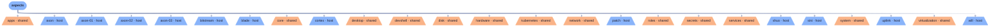

# Namespace

```mermaid
%%{init: {"elk":{"mergeEdges":true,"nodePlacementStrategy":"BRANDES_KOEPF"},"flowchart":{"wrappingWidth":600},"layout":"elk","theme":"base","themeVariables":{"activationBkgColor":"#313244","activationBorderColor":"#6c7086","actorBkg":"#313244","actorBorder":"#a6adc8","actorLineColor":"#a6adc8","actorTextColor":"#cdd6f4","background":"#1e1e2e","classText":"#cdd6f4","clusterBkg":"#313244","clusterBorder":"#6c7086","edgeLabelBackground":"#1e1e2e","labelBoxBkgColor":"#313244","labelBoxBorderColor":"#a6adc8","labelTextColor":"#cdd6f4","lineColor":"#a6adc8","loopTextColor":"#cdd6f4","mainBkg":"#313244","nodeBkg":"#313244","nodeBorder":"#a6adc8","nodeTextColor":"#cdd6f4","noteBkgColor":"#313244","noteBorderColor":"#6c7086","noteTextColor":"#cdd6f4","pie1":"#f38ba8","pie2":"#fab387","pie3":"#f9e2af","pie4":"#a6e3a1","pie5":"#94e2d5","pie6":"#89b4fa","pie7":"#cba6f7","pie8":"#f2cdcd","pieLegendTextColor":"#cdd6f4","pieOuterStrokeColor":"#6c7086","pieSectionTextColor":"#cdd6f4","pieStrokeColor":"#6c7086","pieTitleTextColor":"#cdd6f4","primaryBorderColor":"#a6adc8","primaryColor":"#313244","primaryTextColor":"#cdd6f4","secondBkg":"#313244","secondaryBorderColor":"#6c7086","secondaryColor":"#313244","secondaryTextColor":"#cdd6f4","sequenceNumberColor":"#1e1e2e","signalColor":"#a6adc8","signalTextColor":"#cdd6f4","tertiaryBorderColor":"#6c7086","tertiaryColor":"#313244","tertiaryTextColor":"#cdd6f4","textColor":"#cdd6f4","titleColor":"#cdd6f4"}}}%%
graph TD
  aspects([aspects]):::root
  apps[/"apps · shared"\]:::apps_c
  axon[/"axon · host"\]:::axon_c
  axon_01[/"axon-01 · host"\]:::axon_01_c
  axon_02[/"axon-02 · host"\]:::axon_02_c
  axon_03[/"axon-03 · host"\]:::axon_03_c
  bitstream[/"bitstream · host"\]:::bitstream_c
  blade[/"blade · host"\]:::blade_c
  core[/"core · shared"\]:::core_c
  cortex[/"cortex · host"\]:::cortex_c
  desktop[/"desktop · shared"\]:::desktop_c
  devshell[/"devshell · shared"\]:::devshell_c
  disk[/"disk · shared"\]:::disk_c
  hardware[/"hardware · shared"\]:::hardware_c
  kubernetes[/"kubernetes · shared"\]:::kubernetes_c
  network[/"network · shared"\]:::network_c
  patch[/"patch · host"\]:::patch_c
  roles[/"roles · shared"\]:::roles_c
  secrets[/"secrets · shared"\]:::secrets_c
  services[/"services · shared"\]:::services_c
  shuo[/"shuo · host"\]:::shuo_c
  sini[/"sini · host"\]:::sini_c
  system[/"system · shared"\]:::system_c
  uplink[/"uplink · host"\]:::uplink_c
  virtualization[/"virtualization · shared"\]:::virtualization_c
  will[/"will · host"\]:::will_c

  aspects --> apps
  aspects --> axon
  aspects --> axon_01
  aspects --> axon_02
  aspects --> axon_03
  aspects --> bitstream
  aspects --> blade
  aspects --> core
  aspects --> cortex
  aspects --> desktop
  aspects --> devshell
  aspects --> disk
  aspects --> hardware
  aspects --> kubernetes
  aspects --> network
  aspects --> patch
  aspects --> roles
  aspects --> secrets
  aspects --> services
  aspects --> shuo
  aspects --> sini
  aspects --> system
  aspects --> uplink
  aspects --> virtualization
  aspects --> will

  classDef root fill:#89b4fa,stroke:#89b4fa,color:#1e1e2e,font-weight:bold
  classDef apps_c fill:#fab387,stroke:#fab387,color:#1e1e2e,stroke-width:2px
  classDef axon_c fill:#89b4fa,stroke:#89b4fa,color:#1e1e2e,stroke-width:2px
  classDef axon_01_c fill:#89b4fa,stroke:#89b4fa,color:#1e1e2e,stroke-width:2px
  classDef axon_02_c fill:#89b4fa,stroke:#89b4fa,color:#1e1e2e,stroke-width:2px
  classDef axon_03_c fill:#89b4fa,stroke:#89b4fa,color:#1e1e2e,stroke-width:2px
  classDef bitstream_c fill:#89b4fa,stroke:#89b4fa,color:#1e1e2e,stroke-width:2px
  classDef blade_c fill:#89b4fa,stroke:#89b4fa,color:#1e1e2e,stroke-width:2px
  classDef core_c fill:#fab387,stroke:#fab387,color:#1e1e2e,stroke-width:2px
  classDef cortex_c fill:#89b4fa,stroke:#89b4fa,color:#1e1e2e,stroke-width:2px
  classDef desktop_c fill:#fab387,stroke:#fab387,color:#1e1e2e,stroke-width:2px
  classDef devshell_c fill:#fab387,stroke:#fab387,color:#1e1e2e,stroke-width:2px
  classDef disk_c fill:#fab387,stroke:#fab387,color:#1e1e2e,stroke-width:2px
  classDef hardware_c fill:#fab387,stroke:#fab387,color:#1e1e2e,stroke-width:2px
  classDef kubernetes_c fill:#fab387,stroke:#fab387,color:#1e1e2e,stroke-width:2px
  classDef network_c fill:#fab387,stroke:#fab387,color:#1e1e2e,stroke-width:2px
  classDef patch_c fill:#89b4fa,stroke:#89b4fa,color:#1e1e2e,stroke-width:2px
  classDef roles_c fill:#fab387,stroke:#fab387,color:#1e1e2e,stroke-width:2px
  classDef secrets_c fill:#fab387,stroke:#fab387,color:#1e1e2e,stroke-width:2px
  classDef services_c fill:#fab387,stroke:#fab387,color:#1e1e2e,stroke-width:2px
  classDef shuo_c fill:#89b4fa,stroke:#89b4fa,color:#1e1e2e,stroke-width:2px
  classDef sini_c fill:#89b4fa,stroke:#89b4fa,color:#1e1e2e,stroke-width:2px
  classDef system_c fill:#fab387,stroke:#fab387,color:#1e1e2e,stroke-width:2px
  classDef uplink_c fill:#89b4fa,stroke:#89b4fa,color:#1e1e2e,stroke-width:2px
  classDef virtualization_c fill:#fab387,stroke:#fab387,color:#1e1e2e,stroke-width:2px
  classDef will_c fill:#89b4fa,stroke:#89b4fa,color:#1e1e2e,stroke-width:2px
```
