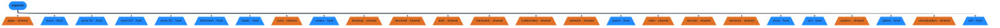

# Namespace

```mermaid
%%{init: {"elk":{"mergeEdges":true,"nodePlacementStrategy":"BRANDES_KOEPF"},"flowchart":{"wrappingWidth":600},"layout":"elk","theme":"base","themeVariables":{"activationBkgColor":"#d0d7de","activationBorderColor":"#8c959f","actorBkg":"#d0d7de","actorBorder":"#6e7781","actorLineColor":"#6e7781","actorTextColor":"#424a53","background":"#eaeef2","classText":"#424a53","clusterBkg":"#d0d7de","clusterBorder":"#8c959f","edgeLabelBackground":"#eaeef2","labelBoxBkgColor":"#d0d7de","labelBoxBorderColor":"#6e7781","labelTextColor":"#424a53","lineColor":"#6e7781","loopTextColor":"#424a53","mainBkg":"#d0d7de","nodeBkg":"#d0d7de","nodeBorder":"#6e7781","nodeTextColor":"#424a53","noteBkgColor":"#d0d7de","noteBorderColor":"#8c959f","noteTextColor":"#424a53","pie1":"#fa4549","pie2":"#e16f24","pie3":"#bf8700","pie4":"#2da44e","pie5":"#339D9B","pie6":"#218bff","pie7":"#a475f9","pie8":"#4d2d00","pieLegendTextColor":"#424a53","pieOuterStrokeColor":"#8c959f","pieSectionTextColor":"#424a53","pieStrokeColor":"#8c959f","pieTitleTextColor":"#424a53","primaryBorderColor":"#6e7781","primaryColor":"#d0d7de","primaryTextColor":"#424a53","secondBkg":"#d0d7de","secondaryBorderColor":"#8c959f","secondaryColor":"#d0d7de","secondaryTextColor":"#424a53","sequenceNumberColor":"#eaeef2","signalColor":"#6e7781","signalTextColor":"#424a53","tertiaryBorderColor":"#8c959f","tertiaryColor":"#d0d7de","tertiaryTextColor":"#424a53","textColor":"#424a53","titleColor":"#424a53"}}}%%
graph TD
  aspects([aspects]):::root
  apps[/"apps · shared"\]:::apps_c
  axon[/"axon · host"\]:::axon_c
  axon_01[/"axon-01 · host"\]:::axon_01_c
  axon_02[/"axon-02 · host"\]:::axon_02_c
  axon_03[/"axon-03 · host"\]:::axon_03_c
  bitstream[/"bitstream · host"\]:::bitstream_c
  blade[/"blade · host"\]:::blade_c
  core[/"core · shared"\]:::core_c
  cortex[/"cortex · host"\]:::cortex_c
  desktop[/"desktop · shared"\]:::desktop_c
  devshell[/"devshell · shared"\]:::devshell_c
  disk[/"disk · shared"\]:::disk_c
  hardware[/"hardware · shared"\]:::hardware_c
  kubernetes[/"kubernetes · shared"\]:::kubernetes_c
  network[/"network · shared"\]:::network_c
  patch[/"patch · host"\]:::patch_c
  roles[/"roles · shared"\]:::roles_c
  secrets[/"secrets · shared"\]:::secrets_c
  services[/"services · shared"\]:::services_c
  shuo[/"shuo · host"\]:::shuo_c
  sini[/"sini · host"\]:::sini_c
  system[/"system · shared"\]:::system_c
  uplink[/"uplink · host"\]:::uplink_c
  virtualization[/"virtualization · shared"\]:::virtualization_c
  will[/"will · host"\]:::will_c

  aspects --> apps
  aspects --> axon
  aspects --> axon_01
  aspects --> axon_02
  aspects --> axon_03
  aspects --> bitstream
  aspects --> blade
  aspects --> core
  aspects --> cortex
  aspects --> desktop
  aspects --> devshell
  aspects --> disk
  aspects --> hardware
  aspects --> kubernetes
  aspects --> network
  aspects --> patch
  aspects --> roles
  aspects --> secrets
  aspects --> services
  aspects --> shuo
  aspects --> sini
  aspects --> system
  aspects --> uplink
  aspects --> virtualization
  aspects --> will

  classDef root fill:#218bff,stroke:#218bff,color:#1f2328,font-weight:bold
  classDef apps_c fill:#e16f24,stroke:#e16f24,color:#1f2328,stroke-width:2px
  classDef axon_c fill:#218bff,stroke:#218bff,color:#1f2328,stroke-width:2px
  classDef axon_01_c fill:#218bff,stroke:#218bff,color:#1f2328,stroke-width:2px
  classDef axon_02_c fill:#218bff,stroke:#218bff,color:#1f2328,stroke-width:2px
  classDef axon_03_c fill:#218bff,stroke:#218bff,color:#1f2328,stroke-width:2px
  classDef bitstream_c fill:#218bff,stroke:#218bff,color:#1f2328,stroke-width:2px
  classDef blade_c fill:#218bff,stroke:#218bff,color:#1f2328,stroke-width:2px
  classDef core_c fill:#e16f24,stroke:#e16f24,color:#1f2328,stroke-width:2px
  classDef cortex_c fill:#218bff,stroke:#218bff,color:#1f2328,stroke-width:2px
  classDef desktop_c fill:#e16f24,stroke:#e16f24,color:#1f2328,stroke-width:2px
  classDef devshell_c fill:#e16f24,stroke:#e16f24,color:#1f2328,stroke-width:2px
  classDef disk_c fill:#e16f24,stroke:#e16f24,color:#1f2328,stroke-width:2px
  classDef hardware_c fill:#e16f24,stroke:#e16f24,color:#1f2328,stroke-width:2px
  classDef kubernetes_c fill:#e16f24,stroke:#e16f24,color:#1f2328,stroke-width:2px
  classDef network_c fill:#e16f24,stroke:#e16f24,color:#1f2328,stroke-width:2px
  classDef patch_c fill:#218bff,stroke:#218bff,color:#1f2328,stroke-width:2px
  classDef roles_c fill:#e16f24,stroke:#e16f24,color:#1f2328,stroke-width:2px
  classDef secrets_c fill:#e16f24,stroke:#e16f24,color:#1f2328,stroke-width:2px
  classDef services_c fill:#e16f24,stroke:#e16f24,color:#1f2328,stroke-width:2px
  classDef shuo_c fill:#218bff,stroke:#218bff,color:#1f2328,stroke-width:2px
  classDef sini_c fill:#218bff,stroke:#218bff,color:#1f2328,stroke-width:2px
  classDef system_c fill:#e16f24,stroke:#e16f24,color:#1f2328,stroke-width:2px
  classDef uplink_c fill:#218bff,stroke:#218bff,color:#1f2328,stroke-width:2px
  classDef virtualization_c fill:#e16f24,stroke:#e16f24,color:#1f2328,stroke-width:2px
  classDef will_c fill:#218bff,stroke:#218bff,color:#1f2328,stroke-width:2px
```
