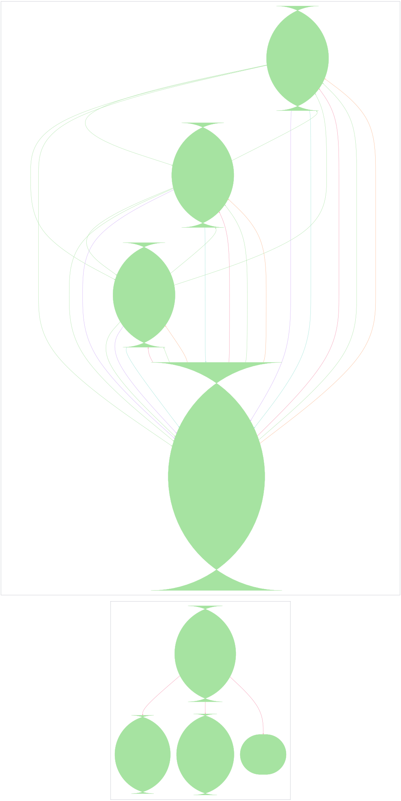

# Pipe Flow

```mermaid
%%{init: {"theme":"base","themeVariables":{"activationBkgColor":"#313244","activationBorderColor":"#6c7086","actorBkg":"#313244","actorBorder":"#a6adc8","actorLineColor":"#a6adc8","actorTextColor":"#cdd6f4","background":"#1e1e2e","classText":"#cdd6f4","clusterBkg":"#313244","clusterBorder":"#6c7086","edgeLabelBackground":"#1e1e2e","labelBoxBkgColor":"#313244","labelBoxBorderColor":"#a6adc8","labelTextColor":"#cdd6f4","lineColor":"#a6adc8","loopTextColor":"#cdd6f4","mainBkg":"#313244","nodeBkg":"#313244","nodeBorder":"#a6adc8","nodeTextColor":"#cdd6f4","noteBkgColor":"#313244","noteBorderColor":"#6c7086","noteTextColor":"#cdd6f4","pie1":"#f38ba8","pie2":"#fab387","pie3":"#f9e2af","pie4":"#a6e3a1","pie5":"#94e2d5","pie6":"#89b4fa","pie7":"#cba6f7","pie8":"#f2cdcd","pieLegendTextColor":"#cdd6f4","pieOuterStrokeColor":"#6c7086","pieSectionTextColor":"#cdd6f4","pieStrokeColor":"#6c7086","pieTitleTextColor":"#cdd6f4","primaryBorderColor":"#a6adc8","primaryColor":"#313244","primaryTextColor":"#cdd6f4","secondBkg":"#313244","secondaryBorderColor":"#6c7086","secondaryColor":"#313244","secondaryTextColor":"#cdd6f4","sequenceNumberColor":"#1e1e2e","signalColor":"#a6adc8","signalTextColor":"#cdd6f4","tertiaryBorderColor":"#6c7086","tertiaryColor":"#313244","tertiaryTextColor":"#cdd6f4","textColor":"#cdd6f4","titleColor":"#cdd6f4"}}}%%
graph LR
  subgraph env_dev["dev"]
    bitstream(["bitstream (core/systemd→cache, core/firmware→persist, core/security→persist, core/nix-remote-build-client→age-secrets, apps/zsh→persistHome, network/openssh→persist, network/hosts→host-addrs, services/tailscale→age-secrets, services/tailscale→persist, secrets/agenix→persist, network/network-boot→age-secrets, network/network-boot→persist, services/acme→age-secrets, services/acme→persist, services/tang→firewall, services/tang→persist, roles/nix-builder→nix-builders, services/nix-remote-build-server→age-secrets, services/nix-remote-build-server→firewall)"])
    blade(["blade (hardware/audio→persistHome, hardware/bluetooth→persist, desktop/stylix→persist, desktop/gnome→persist, roles/laptop→persist, network/wireless→persist, apps/gpg→persistHome, apps/claude→persistHome, apps/vscode→persistHome, apps/gitkraken→persistHome, hardware/razer→persistHome, network/network-boot→age-secrets, network/network-boot→persist, network/openssh→persist, services/tailscale→age-secrets, services/tailscale→persist, secrets/agenix→persist, core/systemd→cache, core/firmware→persist, core/security→persist, core/nix-remote-build-client→age-secrets, apps/zsh→persistHome, network/hosts→host-addrs)"])
    cortex(["cortex (hardware/audio→persistHome, hardware/bluetooth→persist, desktop/stylix→persist, desktop/gnome→persist, apps/gpg→persistHome, apps/claude→persistHome, apps/vscode→persistHome, apps/gitkraken→persistHome, services/ollama→cache, services/ollama→ollama-endpoints, roles/nix-builder→nix-builders, services/nix-remote-build-server→age-secrets, services/nix-remote-build-server→firewall, network/network-boot→age-secrets, network/network-boot→persist, network/openssh→persist, secrets/agenix→persist, core/systemd→cache, core/firmware→persist, core/security→persist, core/nix-remote-build-client→age-secrets, apps/zsh→persistHome, network/hosts→host-addrs, services/tailscale→age-secrets, services/tailscale→persist)"])
    patch(["patch (core/systemd→cache, core/firmware→persist, core/security→persist, core/nix-remote-build-client→age-secrets, apps/zsh→persistHome, network/openssh→persist, network/hosts→host-addrs, services/tailscale→age-secrets, services/tailscale→persist, apps/gpg→persistHome, apps/claude→persistHome)"])
  end
  subgraph env_prod["prod"]
    axon_01(["axon-01 (core/systemd→cache, core/firmware→persist, core/security→persist, core/nix-remote-build-client→age-secrets, apps/zsh→persistHome, network/openssh→persist, network/hosts→host-addrs, services/tailscale→age-secrets, services/tailscale→persist, secrets/agenix→persist, network/network-boot→age-secrets, network/network-boot→persist, services/acme→age-secrets, services/acme→persist, services/tang→firewall, services/tang→persist, roles/nix-builder→nix-builders, services/nix-remote-build-server→age-secrets, services/nix-remote-build-server→firewall, services/bgp→bgp-peers, services/bgp→firewall, services/k3s→age-secrets, services/k3s→k3s-nodes, services/k3s→persist, services/k3s-containerd→persist, services/thunderbolt-mesh-of→thunderbolt-mesh-peers)"])
    axon_02(["axon-02 (core/systemd→cache, core/firmware→persist, core/security→persist, core/nix-remote-build-client→age-secrets, apps/zsh→persistHome, network/openssh→persist, network/hosts→host-addrs, services/tailscale→age-secrets, services/tailscale→persist, secrets/agenix→persist, network/network-boot→age-secrets, network/network-boot→persist, services/acme→age-secrets, services/acme→persist, services/tang→firewall, services/tang→persist, roles/nix-builder→nix-builders, services/nix-remote-build-server→age-secrets, services/nix-remote-build-server→firewall, services/bgp→bgp-peers, services/bgp→firewall, services/k3s→age-secrets, services/k3s→k3s-nodes, services/k3s→persist, services/k3s-containerd→persist, services/thunderbolt-mesh-of→thunderbolt-mesh-peers)"])
    axon_03(["axon-03 (core/systemd→cache, core/firmware→persist, core/security→persist, core/nix-remote-build-client→age-secrets, apps/zsh→persistHome, network/openssh→persist, network/hosts→host-addrs, services/tailscale→age-secrets, services/tailscale→persist, secrets/agenix→persist, network/network-boot→age-secrets, network/network-boot→persist, services/acme→age-secrets, services/acme→persist, services/tang→firewall, services/tang→persist, roles/nix-builder→nix-builders, services/nix-remote-build-server→age-secrets, services/nix-remote-build-server→firewall, services/bgp→bgp-peers, services/bgp→firewall, services/k3s→age-secrets, services/k3s→k3s-nodes, services/k3s→persist, services/k3s-containerd→persist, services/thunderbolt-mesh-of→thunderbolt-mesh-peers)"])
    uplink(["uplink (core/systemd→cache, core/firmware→persist, core/security→persist, core/nix-remote-build-client→age-secrets, apps/zsh→persistHome, network/openssh→persist, network/hosts→host-addrs, services/tailscale→age-secrets, services/tailscale→persist, secrets/agenix→persist, network/network-boot→age-secrets, network/network-boot→persist, services/acme→age-secrets, services/acme→persist, services/tang→firewall, services/tang→persist, roles/nix-builder→nix-builders, services/nix-remote-build-server→age-secrets, services/nix-remote-build-server→firewall, services/prometheus→firewall, services/prometheus→persist, services/prometheus→prometheus-targets, services/prometheus→service-domains, services/loki→firewall, services/loki→persist, services/loki→service-domains, services/grafana→age-secrets, services/grafana→persist, services/grafana→service-domains, services/bgp→bgp-peers, services/bgp→firewall, services/headscale→age-secrets, services/headscale→firewall, services/headscale→persist, services/headscale→prometheus-targets, services/headscale→service-domains, services/nginx→firewall, services/nginx→persist, services/nginx→prometheus-targets, services/kanidm→age-secrets, services/kanidm→firewall, services/kanidm→persist, services/kanidm→service-domains, services/haproxy→firewall, services/jellyfin→firewall, services/jellyfin→persist, services/jellyfin→service-domains, services/homepage→service-domains, services/oauth2-proxy→age-secrets, services/oauth2-proxy→service-domains, services/ollama→cache, services/ollama→ollama-endpoints, services/open-webui→age-secrets, services/open-webui→persist, services/open-webui→service-domains, services/attic→age-secrets, services/attic→cache, services/attic→service-domains, services/den-docs-mirror→persist, services/den-docs-mirror→service-domains)"])
  end

  cortex -->|ollama-endpoints| bitstream
  cortex -->|ollama-endpoints| blade
  cortex -->|ollama-endpoints| patch
  uplink -->|ollama-endpoints| axon_01
  uplink -->|ollama-endpoints| axon_02
  uplink -->|ollama-endpoints| axon_03
  axon_02 -->|bgp-peers| axon_01
  axon_03 -->|bgp-peers| axon_01
  uplink -->|bgp-peers| axon_01
  axon_01 -->|bgp-peers| axon_02
  axon_03 -->|bgp-peers| axon_02
  uplink -->|bgp-peers| axon_02
  axon_01 -->|bgp-peers| axon_03
  axon_02 -->|bgp-peers| axon_03
  uplink -->|bgp-peers| axon_03
  axon_01 -->|bgp-peers| uplink
  axon_02 -->|bgp-peers| uplink
  axon_03 -->|bgp-peers| uplink
  axon_01 -->|k3s-nodes| uplink
  axon_02 -->|k3s-nodes| uplink
  axon_03 -->|k3s-nodes| uplink
  uplink -->|prometheus-targets| axon_01
  uplink -->|prometheus-targets| axon_02
  uplink -->|prometheus-targets| axon_03
  axon_01 -->|thunderbolt-mesh-peers| uplink
  axon_02 -->|thunderbolt-mesh-peers| uplink
  axon_03 -->|thunderbolt-mesh-peers| uplink

  linkStyle 0 stroke:#f38ba8,stroke-width:2px
  linkStyle 1 stroke:#f38ba8,stroke-width:2px
  linkStyle 2 stroke:#f38ba8,stroke-width:2px
  linkStyle 3 stroke:#f38ba8,stroke-width:2px
  linkStyle 4 stroke:#f38ba8,stroke-width:2px
  linkStyle 5 stroke:#f38ba8,stroke-width:2px
  linkStyle 6 stroke:#a6e3a1,stroke-width:2px
  linkStyle 7 stroke:#a6e3a1,stroke-width:2px
  linkStyle 8 stroke:#a6e3a1,stroke-width:2px
  linkStyle 9 stroke:#a6e3a1,stroke-width:2px
  linkStyle 10 stroke:#a6e3a1,stroke-width:2px
  linkStyle 11 stroke:#a6e3a1,stroke-width:2px
  linkStyle 12 stroke:#a6e3a1,stroke-width:2px
  linkStyle 13 stroke:#a6e3a1,stroke-width:2px
  linkStyle 14 stroke:#a6e3a1,stroke-width:2px
  linkStyle 15 stroke:#a6e3a1,stroke-width:2px
  linkStyle 16 stroke:#a6e3a1,stroke-width:2px
  linkStyle 17 stroke:#a6e3a1,stroke-width:2px
  linkStyle 18 stroke:#cba6f7,stroke-width:2px
  linkStyle 19 stroke:#cba6f7,stroke-width:2px
  linkStyle 20 stroke:#cba6f7,stroke-width:2px
  linkStyle 21 stroke:#fab387,stroke-width:2px
  linkStyle 22 stroke:#fab387,stroke-width:2px
  linkStyle 23 stroke:#fab387,stroke-width:2px
  linkStyle 24 stroke:#94e2d5,stroke-width:2px
  linkStyle 25 stroke:#94e2d5,stroke-width:2px
  linkStyle 26 stroke:#94e2d5,stroke-width:2px

  style bitstream fill:#a6e3a1,stroke:#a6e3a1,color:#1e1e2e
  style blade fill:#a6e3a1,stroke:#a6e3a1,color:#1e1e2e
  style cortex fill:#a6e3a1,stroke:#a6e3a1,color:#1e1e2e
  style patch fill:#a6e3a1,stroke:#a6e3a1,color:#1e1e2e
  style axon_01 fill:#a6e3a1,stroke:#a6e3a1,color:#1e1e2e
  style axon_02 fill:#a6e3a1,stroke:#a6e3a1,color:#1e1e2e
  style axon_03 fill:#a6e3a1,stroke:#a6e3a1,color:#1e1e2e
  style uplink fill:#a6e3a1,stroke:#a6e3a1,color:#1e1e2e
  style env_dev fill:transparent,stroke:#6c7086,stroke-width:1px
  style env_prod fill:transparent,stroke:#6c7086,stroke-width:1px
```
