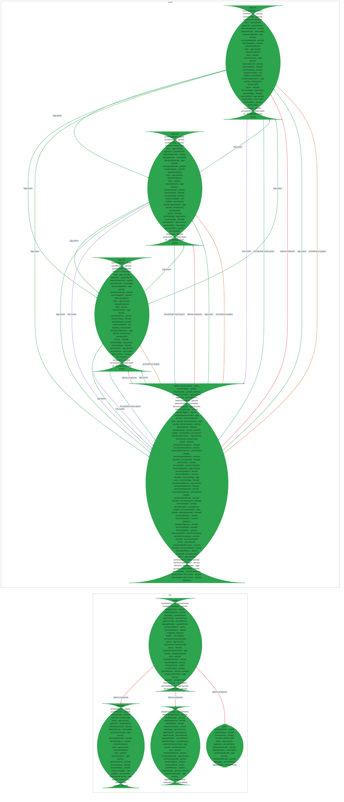

# Pipe Flow

```mermaid
%%{init: {"theme":"base","themeVariables":{"activationBkgColor":"#d0d7de","activationBorderColor":"#8c959f","actorBkg":"#d0d7de","actorBorder":"#6e7781","actorLineColor":"#6e7781","actorTextColor":"#424a53","background":"#eaeef2","classText":"#424a53","clusterBkg":"#d0d7de","clusterBorder":"#8c959f","edgeLabelBackground":"#eaeef2","labelBoxBkgColor":"#d0d7de","labelBoxBorderColor":"#6e7781","labelTextColor":"#424a53","lineColor":"#6e7781","loopTextColor":"#424a53","mainBkg":"#d0d7de","nodeBkg":"#d0d7de","nodeBorder":"#6e7781","nodeTextColor":"#424a53","noteBkgColor":"#d0d7de","noteBorderColor":"#8c959f","noteTextColor":"#424a53","pie1":"#fa4549","pie2":"#e16f24","pie3":"#bf8700","pie4":"#2da44e","pie5":"#339D9B","pie6":"#218bff","pie7":"#a475f9","pie8":"#4d2d00","pieLegendTextColor":"#424a53","pieOuterStrokeColor":"#8c959f","pieSectionTextColor":"#424a53","pieStrokeColor":"#8c959f","pieTitleTextColor":"#424a53","primaryBorderColor":"#6e7781","primaryColor":"#d0d7de","primaryTextColor":"#424a53","secondBkg":"#d0d7de","secondaryBorderColor":"#8c959f","secondaryColor":"#d0d7de","secondaryTextColor":"#424a53","sequenceNumberColor":"#eaeef2","signalColor":"#6e7781","signalTextColor":"#424a53","tertiaryBorderColor":"#8c959f","tertiaryColor":"#d0d7de","tertiaryTextColor":"#424a53","textColor":"#424a53","titleColor":"#424a53"}}}%%
graph LR
  subgraph env_dev["dev"]
    bitstream(["bitstream (core/systemd→cache, core/firmware→persist, core/security→persist, core/nix-remote-build-client→age-secrets, apps/zsh→persistHome, network/openssh→persist, network/hosts→host-addrs, services/tailscale→age-secrets, services/tailscale→persist, secrets/agenix→persist, network/network-boot→age-secrets, network/network-boot→persist, services/acme→age-secrets, services/acme→persist, services/tang→firewall, services/tang→persist, roles/nix-builder→nix-builders, services/nix-remote-build-server→age-secrets, services/nix-remote-build-server→firewall)"])
    blade(["blade (hardware/audio→persistHome, hardware/bluetooth→persist, desktop/stylix→persist, desktop/gnome→persist, roles/laptop→persist, network/wireless→persist, apps/gpg→persistHome, apps/claude→persistHome, apps/vscode→persistHome, apps/gitkraken→persistHome, hardware/razer→persistHome, network/network-boot→age-secrets, network/network-boot→persist, network/openssh→persist, services/tailscale→age-secrets, services/tailscale→persist, secrets/agenix→persist, core/systemd→cache, core/firmware→persist, core/security→persist, core/nix-remote-build-client→age-secrets, apps/zsh→persistHome, network/hosts→host-addrs)"])
    cortex(["cortex (hardware/audio→persistHome, hardware/bluetooth→persist, desktop/stylix→persist, desktop/gnome→persist, apps/gpg→persistHome, apps/claude→persistHome, apps/vscode→persistHome, apps/gitkraken→persistHome, services/ollama→cache, services/ollama→ollama-endpoints, roles/nix-builder→nix-builders, services/nix-remote-build-server→age-secrets, services/nix-remote-build-server→firewall, network/network-boot→age-secrets, network/network-boot→persist, network/openssh→persist, secrets/agenix→persist, core/systemd→cache, core/firmware→persist, core/security→persist, core/nix-remote-build-client→age-secrets, apps/zsh→persistHome, network/hosts→host-addrs, services/tailscale→age-secrets, services/tailscale→persist)"])
    patch(["patch (core/systemd→cache, core/firmware→persist, core/security→persist, core/nix-remote-build-client→age-secrets, apps/zsh→persistHome, network/openssh→persist, network/hosts→host-addrs, services/tailscale→age-secrets, services/tailscale→persist, apps/gpg→persistHome, apps/claude→persistHome)"])
  end
  subgraph env_prod["prod"]
    axon_01(["axon-01 (core/systemd→cache, core/firmware→persist, core/security→persist, core/nix-remote-build-client→age-secrets, apps/zsh→persistHome, network/openssh→persist, network/hosts→host-addrs, services/tailscale→age-secrets, services/tailscale→persist, secrets/agenix→persist, network/network-boot→age-secrets, network/network-boot→persist, services/acme→age-secrets, services/acme→persist, services/tang→firewall, services/tang→persist, roles/nix-builder→nix-builders, services/nix-remote-build-server→age-secrets, services/nix-remote-build-server→firewall, services/bgp→bgp-peers, services/bgp→firewall, services/k3s→age-secrets, services/k3s→k3s-nodes, services/k3s→persist, services/k3s-containerd→persist, services/thunderbolt-mesh-of→thunderbolt-mesh-peers)"])
    axon_02(["axon-02 (core/systemd→cache, core/firmware→persist, core/security→persist, core/nix-remote-build-client→age-secrets, apps/zsh→persistHome, network/openssh→persist, network/hosts→host-addrs, services/tailscale→age-secrets, services/tailscale→persist, secrets/agenix→persist, network/network-boot→age-secrets, network/network-boot→persist, services/acme→age-secrets, services/acme→persist, services/tang→firewall, services/tang→persist, roles/nix-builder→nix-builders, services/nix-remote-build-server→age-secrets, services/nix-remote-build-server→firewall, services/bgp→bgp-peers, services/bgp→firewall, services/k3s→age-secrets, services/k3s→k3s-nodes, services/k3s→persist, services/k3s-containerd→persist, services/thunderbolt-mesh-of→thunderbolt-mesh-peers)"])
    axon_03(["axon-03 (core/systemd→cache, core/firmware→persist, core/security→persist, core/nix-remote-build-client→age-secrets, apps/zsh→persistHome, network/openssh→persist, network/hosts→host-addrs, services/tailscale→age-secrets, services/tailscale→persist, secrets/agenix→persist, network/network-boot→age-secrets, network/network-boot→persist, services/acme→age-secrets, services/acme→persist, services/tang→firewall, services/tang→persist, roles/nix-builder→nix-builders, services/nix-remote-build-server→age-secrets, services/nix-remote-build-server→firewall, services/bgp→bgp-peers, services/bgp→firewall, services/k3s→age-secrets, services/k3s→k3s-nodes, services/k3s→persist, services/k3s-containerd→persist, services/thunderbolt-mesh-of→thunderbolt-mesh-peers)"])
    uplink(["uplink (core/systemd→cache, core/firmware→persist, core/security→persist, core/nix-remote-build-client→age-secrets, apps/zsh→persistHome, network/openssh→persist, network/hosts→host-addrs, services/tailscale→age-secrets, services/tailscale→persist, secrets/agenix→persist, network/network-boot→age-secrets, network/network-boot→persist, services/acme→age-secrets, services/acme→persist, services/tang→firewall, services/tang→persist, roles/nix-builder→nix-builders, services/nix-remote-build-server→age-secrets, services/nix-remote-build-server→firewall, services/prometheus→firewall, services/prometheus→persist, services/prometheus→prometheus-targets, services/prometheus→service-domains, services/loki→firewall, services/loki→persist, services/loki→service-domains, services/grafana→age-secrets, services/grafana→persist, services/grafana→service-domains, services/bgp→bgp-peers, services/bgp→firewall, services/headscale→age-secrets, services/headscale→firewall, services/headscale→persist, services/headscale→prometheus-targets, services/headscale→service-domains, services/nginx→firewall, services/nginx→persist, services/nginx→prometheus-targets, services/kanidm→age-secrets, services/kanidm→firewall, services/kanidm→persist, services/kanidm→service-domains, services/haproxy→firewall, services/jellyfin→firewall, services/jellyfin→persist, services/jellyfin→service-domains, services/homepage→service-domains, services/oauth2-proxy→age-secrets, services/oauth2-proxy→service-domains, services/ollama→cache, services/ollama→ollama-endpoints, services/open-webui→age-secrets, services/open-webui→persist, services/open-webui→service-domains, services/attic→age-secrets, services/attic→cache, services/attic→service-domains, services/den-docs-mirror→persist, services/den-docs-mirror→service-domains)"])
  end

  cortex -->|ollama-endpoints| bitstream
  cortex -->|ollama-endpoints| blade
  cortex -->|ollama-endpoints| patch
  uplink -->|ollama-endpoints| axon_01
  uplink -->|ollama-endpoints| axon_02
  uplink -->|ollama-endpoints| axon_03
  axon_02 -->|bgp-peers| axon_01
  axon_03 -->|bgp-peers| axon_01
  uplink -->|bgp-peers| axon_01
  axon_01 -->|bgp-peers| axon_02
  axon_03 -->|bgp-peers| axon_02
  uplink -->|bgp-peers| axon_02
  axon_01 -->|bgp-peers| axon_03
  axon_02 -->|bgp-peers| axon_03
  uplink -->|bgp-peers| axon_03
  axon_01 -->|bgp-peers| uplink
  axon_02 -->|bgp-peers| uplink
  axon_03 -->|bgp-peers| uplink
  axon_01 -->|k3s-nodes| uplink
  axon_02 -->|k3s-nodes| uplink
  axon_03 -->|k3s-nodes| uplink
  uplink -->|prometheus-targets| axon_01
  uplink -->|prometheus-targets| axon_02
  uplink -->|prometheus-targets| axon_03
  axon_01 -->|thunderbolt-mesh-peers| uplink
  axon_02 -->|thunderbolt-mesh-peers| uplink
  axon_03 -->|thunderbolt-mesh-peers| uplink

  linkStyle 0 stroke:#fa4549,stroke-width:2px
  linkStyle 1 stroke:#fa4549,stroke-width:2px
  linkStyle 2 stroke:#fa4549,stroke-width:2px
  linkStyle 3 stroke:#fa4549,stroke-width:2px
  linkStyle 4 stroke:#fa4549,stroke-width:2px
  linkStyle 5 stroke:#fa4549,stroke-width:2px
  linkStyle 6 stroke:#2da44e,stroke-width:2px
  linkStyle 7 stroke:#2da44e,stroke-width:2px
  linkStyle 8 stroke:#2da44e,stroke-width:2px
  linkStyle 9 stroke:#2da44e,stroke-width:2px
  linkStyle 10 stroke:#2da44e,stroke-width:2px
  linkStyle 11 stroke:#2da44e,stroke-width:2px
  linkStyle 12 stroke:#2da44e,stroke-width:2px
  linkStyle 13 stroke:#2da44e,stroke-width:2px
  linkStyle 14 stroke:#2da44e,stroke-width:2px
  linkStyle 15 stroke:#2da44e,stroke-width:2px
  linkStyle 16 stroke:#2da44e,stroke-width:2px
  linkStyle 17 stroke:#2da44e,stroke-width:2px
  linkStyle 18 stroke:#a475f9,stroke-width:2px
  linkStyle 19 stroke:#a475f9,stroke-width:2px
  linkStyle 20 stroke:#a475f9,stroke-width:2px
  linkStyle 21 stroke:#e16f24,stroke-width:2px
  linkStyle 22 stroke:#e16f24,stroke-width:2px
  linkStyle 23 stroke:#e16f24,stroke-width:2px
  linkStyle 24 stroke:#339D9B,stroke-width:2px
  linkStyle 25 stroke:#339D9B,stroke-width:2px
  linkStyle 26 stroke:#339D9B,stroke-width:2px

  style bitstream fill:#2da44e,stroke:#2da44e,color:#1f2328
  style blade fill:#2da44e,stroke:#2da44e,color:#1f2328
  style cortex fill:#2da44e,stroke:#2da44e,color:#1f2328
  style patch fill:#2da44e,stroke:#2da44e,color:#1f2328
  style axon_01 fill:#2da44e,stroke:#2da44e,color:#1f2328
  style axon_02 fill:#2da44e,stroke:#2da44e,color:#1f2328
  style axon_03 fill:#2da44e,stroke:#2da44e,color:#1f2328
  style uplink fill:#2da44e,stroke:#2da44e,color:#1f2328
  style env_dev fill:transparent,stroke:#8c959f,stroke-width:1px
  style env_prod fill:transparent,stroke:#8c959f,stroke-width:1px
```
