# Pipe Flow



```mermaid
%%{init: {"theme":"base","themeVariables":{"activationBkgColor":"#313244","activationBorderColor":"#6c7086","actorBkg":"#313244","actorBorder":"#a6adc8","actorLineColor":"#a6adc8","actorTextColor":"#cdd6f4","background":"#1e1e2e","classText":"#cdd6f4","clusterBkg":"#313244","clusterBorder":"#6c7086","edgeLabelBackground":"#1e1e2e","labelBoxBkgColor":"#313244","labelBoxBorderColor":"#a6adc8","labelTextColor":"#cdd6f4","lineColor":"#a6adc8","loopTextColor":"#cdd6f4","mainBkg":"#313244","nodeBkg":"#313244","nodeBorder":"#a6adc8","nodeTextColor":"#cdd6f4","noteBkgColor":"#313244","noteBorderColor":"#6c7086","noteTextColor":"#cdd6f4","pie1":"#f38ba8","pie2":"#fab387","pie3":"#f9e2af","pie4":"#a6e3a1","pie5":"#94e2d5","pie6":"#89b4fa","pie7":"#cba6f7","pie8":"#f2cdcd","pieLegendTextColor":"#cdd6f4","pieOuterStrokeColor":"#6c7086","pieSectionTextColor":"#cdd6f4","pieStrokeColor":"#6c7086","pieTitleTextColor":"#cdd6f4","primaryBorderColor":"#a6adc8","primaryColor":"#313244","primaryTextColor":"#cdd6f4","secondBkg":"#313244","secondaryBorderColor":"#6c7086","secondaryColor":"#313244","secondaryTextColor":"#cdd6f4","sequenceNumberColor":"#1e1e2e","signalColor":"#a6adc8","signalTextColor":"#cdd6f4","tertiaryBorderColor":"#6c7086","tertiaryColor":"#313244","tertiaryTextColor":"#cdd6f4","textColor":"#cdd6f4","titleColor":"#cdd6f4"}}}%%
graph LR
  subgraph env_dev["dev"]
    bitstream(["bitstream (core/nix/nixpkgs→nixpkgs-overlays, core/systemd→cache, core/system/firmware→persist, core/security→persist, core/system/linux-kernel→nixpkgs-overlays, applications/shell/zsh→persistHome, core/security/openssh→persist, core/network/hostsfile→host-addrs, core/network/tailscale→age-secrets, core/network/tailscale→persist, secrets/agenix→persist, services/security/acme→age-secrets, services/security/acme→persist, services/security/tang→firewall, services/security/tang→persist, core/boot/network-initrd→age-secrets, core/boot/network-initrd→persist, roles/nix-builder→nix-builders, services/nix/remote-build-server→age-secrets, services/nix/remote-build-server→firewall, hardware/cpu/amd→nixpkgs-overlays)"])
    blade(["blade (core/nix/nixpkgs→nixpkgs-overlays, core/systemd→cache, core/system/firmware→persist, core/security→persist, core/system/linux-kernel→nixpkgs-overlays, applications/shell/zsh→persistHome, core/security/openssh→persist, core/network/hostsfile→host-addrs, core/network/tailscale→age-secrets, core/network/tailscale→persist, secrets/agenix→persist, hardware/audio→persistHome, hardware/bluetooth→persist, desktop/style/stylix→homeManagerModules, desktop/style/stylix→persist, virtualization/libvirt→persist, desktop/gnome→persist, applications/browsers/firefox→cacheHome, applications/browsers/firefox→persistHome, applications/browsers/firefox→stylix-hm, applications/browsers/chromium→cacheHome, applications/browsers/chromium→homebrew-cask, applications/browsers/chromium→persistHome, applications/mail/protonmail→homebrew-cask, applications/productivity/obs-studio→homebrew-cask, applications/gaming/steam→cacheHome, applications/gaming/steam→nixpkgs-overlays, applications/gaming/sunshine→persistHome, applications/dev/ai/claude→cacheHome, applications/dev/ai/claude→persistHome, applications/dev/ai/claude→replicateHome, applications/shell/nix-index→homeManagerModules, applications/dev/editor/nvf→homeManagerModules, applications/dev/security/ssh-agent-mux→nixpkgs-overlays, applications/dev/lang/go→codium-extensions, applications/dev/lang/rust→nixpkgs-overlays, applications/dev/lang/python→codium-extensions, applications/dev/lang/python→codium-settings, applications/dev/lang/nix→codium-extensions, applications/dev/lang/nix→codium-settings, applications/dev/editor/codium/antigravity→persistHome, applications/dev/editor/codium/vscode→persistHome, applications/dev/editor/codium/core→codium-extensions, applications/dev/editor/codium/core→codium-settings, applications/dev/editor/codium/core→nixpkgs-overlays, applications/dev/lang/c→codium-extensions, applications/dev/lang/lua→codium-extensions, applications/dev/lang/lua→codium-settings, applications/dev/lang/markdown→codium-extensions, applications/dev/lang/markdown→codium-settings, applications/dev/lang/shell→codium-extensions, applications/dev/lang/shell→codium-settings, roles/dev-gui/<anon>:11→homebrew-cask, applications/messaging/discord→homeManagerModules, applications/messaging/element→persistHome, applications/messaging/kdeconnect→persistHome, applications/messaging/messenger→persistHome, applications/media/spicetify→firewall, applications/media/spicetify→homeManagerModules, hardware/laptop→persist, hardware/razer→persistHome, core/boot/wireless-initrd→age-secrets, core/boot/network-initrd→age-secrets, core/boot/network-initrd→persist, core/network/manager→cache)"])
    cortex(["cortex (core/nix/nixpkgs→nixpkgs-overlays, core/systemd→cache, core/system/firmware→persist, core/security→persist, core/system/linux-kernel→nixpkgs-overlays, applications/shell/zsh→persistHome, core/security/openssh→persist, core/network/hostsfile→host-addrs, core/network/tailscale→age-secrets, core/network/tailscale→persist, secrets/agenix→persist, hardware/audio→persistHome, hardware/bluetooth→persist, desktop/style/stylix→homeManagerModules, desktop/style/stylix→persist, virtualization/libvirt→persist, desktop/gnome→persist, applications/browsers/firefox→cacheHome, applications/browsers/firefox→persistHome, applications/browsers/firefox→stylix-hm, applications/browsers/chromium→cacheHome, applications/browsers/chromium→homebrew-cask, applications/browsers/chromium→persistHome, applications/mail/protonmail→homebrew-cask, applications/productivity/obs-studio→homebrew-cask, applications/gaming/steam→cacheHome, applications/gaming/steam→nixpkgs-overlays, applications/gaming/sunshine→persistHome, applications/dev/ai/claude→cacheHome, applications/dev/ai/claude→persistHome, applications/dev/ai/claude→replicateHome, applications/shell/nix-index→homeManagerModules, applications/dev/editor/nvf→homeManagerModules, applications/dev/security/ssh-agent-mux→nixpkgs-overlays, applications/dev/lang/go→codium-extensions, applications/dev/lang/rust→nixpkgs-overlays, applications/dev/lang/python→codium-extensions, applications/dev/lang/python→codium-settings, applications/dev/lang/nix→codium-extensions, applications/dev/lang/nix→codium-settings, applications/dev/editor/codium/antigravity→persistHome, applications/dev/editor/codium/vscode→persistHome, applications/dev/editor/codium/core→codium-extensions, applications/dev/editor/codium/core→codium-settings, applications/dev/editor/codium/core→nixpkgs-overlays, applications/dev/lang/c→codium-extensions, applications/dev/lang/lua→codium-extensions, applications/dev/lang/lua→codium-settings, applications/dev/lang/markdown→codium-extensions, applications/dev/lang/markdown→codium-settings, applications/dev/lang/shell→codium-extensions, applications/dev/lang/shell→codium-settings, roles/dev-gui/<anon>:11→homebrew-cask, applications/media/spicetify→firewall, applications/media/spicetify→homeManagerModules, services/ai/ollama→cache, services/ai/ollama→ollama-endpoints, applications/messaging/discord→homeManagerModules, applications/messaging/element→persistHome, applications/messaging/kdeconnect→persistHome, applications/messaging/messenger→persistHome, roles/nix-builder→nix-builders, services/nix/remote-build-server→age-secrets, services/nix/remote-build-server→firewall, hardware/cpu/amd→nixpkgs-overlays, hardware/vr-amd→homeManagerModules, core/boot/network-initrd→age-secrets, core/boot/network-initrd→persist, virtualization/microvm-host→firewall, virtualization/microvm-host→gpu-claims, virtualization/microvm-host→microvm-guests, virtualization/microvm-host→persist, virtualization/windows-vfio→gpu-claims, virtualization/podman→cache, virtualization/podman→cacheHome, virtualization/containers→age-secrets, applications/media/easyeffects→persistHome)"])
    patch(["patch (core/nix/nixpkgs→nixpkgs-overlays, core/systemd→cache, core/system/firmware→persist, core/security→persist, core/system/linux-kernel→nixpkgs-overlays, applications/shell/zsh→persistHome, core/security/openssh→persist, core/network/hostsfile→host-addrs, core/network/tailscale→age-secrets, core/network/tailscale→persist, secrets/agenix→persist, applications/dev/ai/claude→cacheHome, applications/dev/ai/claude→persistHome, applications/dev/ai/claude→replicateHome, applications/shell/nix-index→homeManagerModules, applications/dev/editor/nvf→homeManagerModules, applications/dev/security/ssh-agent-mux→nixpkgs-overlays, applications/dev/lang/go→codium-extensions, applications/dev/lang/rust→nixpkgs-overlays, applications/dev/lang/python→codium-extensions, applications/dev/lang/python→codium-settings, applications/dev/lang/nix→codium-extensions, applications/dev/lang/nix→codium-settings, desktop/style/stylix→homeManagerModules, desktop/style/stylix→persist, macos/applications/karabiner→homebrew-cask, macos/applications/raycast→homebrew-cask, applications/browsers/firefox→cacheHome, applications/browsers/firefox→persistHome, applications/browsers/firefox→stylix-hm, applications/browsers/chromium→cacheHome, applications/browsers/chromium→homebrew-cask, applications/browsers/chromium→persistHome, applications/dev/editor/codium/vscode→persistHome, applications/dev/editor/codium/core→codium-extensions, applications/dev/editor/codium/core→codium-settings, applications/dev/editor/codium/core→nixpkgs-overlays, applications/dev/lang/c→codium-extensions, applications/dev/lang/lua→codium-extensions, applications/dev/lang/lua→codium-settings, applications/dev/lang/markdown→codium-extensions, applications/dev/lang/markdown→codium-settings, applications/dev/lang/shell→codium-extensions, applications/dev/lang/shell→codium-settings, applications/dev/git/gitkraken/{gitkraken@user=sini}→homeManagerModules, applications/dev/git/gitkraken/{gitkraken@user=sini}→homebrew-cask, applications/dev/git/gitkraken/{gitkraken@user=sini}→persistHome, roles/darwin-workstation/<anon>:31→homebrew-cask, applications/productivity/obs-studio→homebrew-cask, applications/mail/protonmail→homebrew-cask)"])
    slab(["slab (applications/dev/ai/claude→cacheHome, applications/dev/ai/claude→persistHome, applications/dev/ai/claude→replicateHome, applications/shell/nix-index→homeManagerModules, applications/dev/editor/nvf→homeManagerModules, applications/dev/security/ssh-agent-mux→nixpkgs-overlays, applications/dev/lang/go→codium-extensions, applications/dev/lang/rust→nixpkgs-overlays, applications/dev/lang/python→codium-extensions, applications/dev/lang/python→codium-settings, applications/dev/lang/nix→codium-extensions, applications/dev/lang/nix→codium-settings, applications/shell/zsh→persistHome)"])
  end
  subgraph env_prod["prod"]
    axon_01(["axon-01 (core/nix/nixpkgs→nixpkgs-overlays, core/systemd→cache, core/system/firmware→persist, core/security→persist, core/system/linux-kernel→nixpkgs-overlays, applications/shell/zsh→persistHome, core/security/openssh→persist, core/network/hostsfile→host-addrs, core/network/tailscale→age-secrets, core/network/tailscale→persist, secrets/agenix→persist, core/boot/network-initrd→age-secrets, core/boot/network-initrd→persist, services/security/acme→age-secrets, services/security/acme→persist, services/security/tang→firewall, services/security/tang→persist, roles/nix-builder→nix-builders, services/nix/remote-build-server→age-secrets, services/nix/remote-build-server→firewall, services/bgp→bgp-peers, services/bgp→firewall, services/k3s→age-secrets, services/k3s→k3s-nodes, services/k3s→persist, services/k3s/containerd→persist, services/storage/media-scratch→cache, services/storage/media-scratch→media-scratch-exports, hardware/cpu/amd→nixpkgs-overlays, services/networking/thunderbolt-mesh-of→thunderbolt-mesh-peers)"])
    axon_02(["axon-02 (core/nix/nixpkgs→nixpkgs-overlays, core/systemd→cache, core/system/firmware→persist, core/security→persist, core/system/linux-kernel→nixpkgs-overlays, applications/shell/zsh→persistHome, core/security/openssh→persist, core/network/hostsfile→host-addrs, core/network/tailscale→age-secrets, core/network/tailscale→persist, secrets/agenix→persist, core/boot/network-initrd→age-secrets, core/boot/network-initrd→persist, services/security/acme→age-secrets, services/security/acme→persist, services/security/tang→firewall, services/security/tang→persist, roles/nix-builder→nix-builders, services/nix/remote-build-server→age-secrets, services/nix/remote-build-server→firewall, services/bgp→bgp-peers, services/bgp→firewall, services/k3s→age-secrets, services/k3s→k3s-nodes, services/k3s→persist, services/k3s/containerd→persist, hardware/cpu/amd→nixpkgs-overlays, services/networking/thunderbolt-mesh-of→thunderbolt-mesh-peers)"])
    axon_03(["axon-03 (core/nix/nixpkgs→nixpkgs-overlays, core/systemd→cache, core/system/firmware→persist, core/security→persist, core/system/linux-kernel→nixpkgs-overlays, applications/shell/zsh→persistHome, core/security/openssh→persist, core/network/hostsfile→host-addrs, core/network/tailscale→age-secrets, core/network/tailscale→persist, secrets/agenix→persist, core/boot/network-initrd→age-secrets, core/boot/network-initrd→persist, services/security/acme→age-secrets, services/security/acme→persist, services/security/tang→firewall, services/security/tang→persist, roles/nix-builder→nix-builders, services/nix/remote-build-server→age-secrets, services/nix/remote-build-server→firewall, services/bgp→bgp-peers, services/bgp→firewall, services/k3s→age-secrets, services/k3s→k3s-nodes, services/k3s→persist, services/k3s/containerd→persist, hardware/cpu/amd→nixpkgs-overlays, services/networking/thunderbolt-mesh-of→thunderbolt-mesh-peers)"])
    uplink(["uplink (core/nix/nixpkgs→nixpkgs-overlays, core/systemd→cache, core/system/firmware→persist, core/security→persist, core/system/linux-kernel→nixpkgs-overlays, applications/shell/zsh→persistHome, core/security/openssh→persist, core/network/hostsfile→host-addrs, core/network/tailscale→age-secrets, core/network/tailscale→persist, secrets/agenix→persist, core/boot/network-initrd→age-secrets, core/boot/network-initrd→persist, services/security/acme→age-secrets, services/security/acme→persist, services/security/tang→firewall, services/security/tang→persist, roles/nix-builder→nix-builders, services/nix/remote-build-server→age-secrets, services/nix/remote-build-server→firewall, services/monitoring/prometheus→firewall, services/monitoring/prometheus→persist, services/monitoring/prometheus→prometheus-targets, services/monitoring/prometheus→service-domains, services/monitoring/loki→firewall, services/monitoring/loki→persist, services/monitoring/loki→service-domains, services/monitoring/grafana→age-secrets, services/monitoring/grafana→persist, services/monitoring/grafana→service-domains, services/bgp→bgp-peers, services/bgp→firewall, services/networking/headscale→age-secrets, services/networking/headscale→firewall, services/networking/headscale→persist, services/networking/headscale→prometheus-targets, services/networking/headscale→service-domains, services/networking/nginx→firewall, services/networking/nginx→persist, services/networking/nginx→prometheus-targets, services/security/kanidm→age-secrets, services/security/kanidm→firewall, services/security/kanidm→persist, services/security/kanidm→service-domains, services/networking/haproxy→firewall, services/media/jellyfin→firewall, services/media/jellyfin→persist, services/media/jellyfin→service-domains, services/web/homepage→service-domains, services/security/oauth2-proxy→age-secrets, services/security/oauth2-proxy→service-domains, services/ai/ollama→cache, services/ai/ollama→ollama-endpoints, services/ai/open-webui→age-secrets, services/ai/open-webui→persist, services/ai/open-webui→service-domains, services/nix/attic→age-secrets, services/nix/attic→cache, services/nix/attic→service-domains, core/network/syncthing/hub→persist, core/network/syncthing/hub→syncthing-peers, services/web/den-docs-mirror→persist, services/web/den-docs-mirror→service-domains, services/web/container-registry→age-secrets, services/web/container-registry→container-registries, services/web/container-registry→persist, virtualization/podman→cache, virtualization/podman→cacheHome, virtualization/containers→age-secrets, hardware/cpu/amd→nixpkgs-overlays)"])
  end

  cortex -->|ollama-endpoints| bitstream
  cortex -->|ollama-endpoints| blade
  cortex -->|ollama-endpoints| patch
  cortex -->|ollama-endpoints| slab
  uplink -->|ollama-endpoints| axon_01
  uplink -->|ollama-endpoints| axon_02
  uplink -->|ollama-endpoints| axon_03
  axon_02 -->|bgp-peers| axon_01
  axon_03 -->|bgp-peers| axon_01
  uplink -->|bgp-peers| axon_01
  axon_01 -->|bgp-peers| axon_02
  axon_03 -->|bgp-peers| axon_02
  uplink -->|bgp-peers| axon_02
  axon_01 -->|bgp-peers| axon_03
  axon_02 -->|bgp-peers| axon_03
  uplink -->|bgp-peers| axon_03
  axon_01 -->|bgp-peers| uplink
  axon_02 -->|bgp-peers| uplink
  axon_03 -->|bgp-peers| uplink
  uplink -->|container-registries| axon_01
  uplink -->|container-registries| axon_02
  uplink -->|container-registries| axon_03
  axon_01 -->|k3s-nodes| uplink
  axon_02 -->|k3s-nodes| uplink
  axon_03 -->|k3s-nodes| uplink
  uplink -->|prometheus-targets| axon_01
  uplink -->|prometheus-targets| axon_02
  uplink -->|prometheus-targets| axon_03
  axon_01 -->|thunderbolt-mesh-peers| uplink
  axon_02 -->|thunderbolt-mesh-peers| uplink
  axon_03 -->|thunderbolt-mesh-peers| uplink

  linkStyle 0 stroke:#f38ba8,stroke-width:2px
  linkStyle 1 stroke:#f38ba8,stroke-width:2px
  linkStyle 2 stroke:#f38ba8,stroke-width:2px
  linkStyle 3 stroke:#f38ba8,stroke-width:2px
  linkStyle 4 stroke:#f38ba8,stroke-width:2px
  linkStyle 5 stroke:#f38ba8,stroke-width:2px
  linkStyle 6 stroke:#f38ba8,stroke-width:2px
  linkStyle 7 stroke:#a6e3a1,stroke-width:2px
  linkStyle 8 stroke:#a6e3a1,stroke-width:2px
  linkStyle 9 stroke:#a6e3a1,stroke-width:2px
  linkStyle 10 stroke:#a6e3a1,stroke-width:2px
  linkStyle 11 stroke:#a6e3a1,stroke-width:2px
  linkStyle 12 stroke:#a6e3a1,stroke-width:2px
  linkStyle 13 stroke:#a6e3a1,stroke-width:2px
  linkStyle 14 stroke:#a6e3a1,stroke-width:2px
  linkStyle 15 stroke:#a6e3a1,stroke-width:2px
  linkStyle 16 stroke:#a6e3a1,stroke-width:2px
  linkStyle 17 stroke:#a6e3a1,stroke-width:2px
  linkStyle 18 stroke:#a6e3a1,stroke-width:2px
  linkStyle 19 stroke:#cba6f7,stroke-width:2px
  linkStyle 20 stroke:#cba6f7,stroke-width:2px
  linkStyle 21 stroke:#cba6f7,stroke-width:2px
  linkStyle 22 stroke:#fab387,stroke-width:2px
  linkStyle 23 stroke:#fab387,stroke-width:2px
  linkStyle 24 stroke:#fab387,stroke-width:2px
  linkStyle 25 stroke:#94e2d5,stroke-width:2px
  linkStyle 26 stroke:#94e2d5,stroke-width:2px
  linkStyle 27 stroke:#94e2d5,stroke-width:2px
  linkStyle 28 stroke:#f2cdcd,stroke-width:2px
  linkStyle 29 stroke:#f2cdcd,stroke-width:2px
  linkStyle 30 stroke:#f2cdcd,stroke-width:2px

  style bitstream fill:#a6e3a1,stroke:#a6e3a1,color:#1e1e2e
  style blade fill:#a6e3a1,stroke:#a6e3a1,color:#1e1e2e
  style cortex fill:#a6e3a1,stroke:#a6e3a1,color:#1e1e2e
  style patch fill:#a6e3a1,stroke:#a6e3a1,color:#1e1e2e
  style slab fill:#a6e3a1,stroke:#a6e3a1,color:#1e1e2e
  style axon_01 fill:#a6e3a1,stroke:#a6e3a1,color:#1e1e2e
  style axon_02 fill:#a6e3a1,stroke:#a6e3a1,color:#1e1e2e
  style axon_03 fill:#a6e3a1,stroke:#a6e3a1,color:#1e1e2e
  style uplink fill:#a6e3a1,stroke:#a6e3a1,color:#1e1e2e
  style env_dev fill:transparent,stroke:#6c7086,stroke-width:1px
  style env_prod fill:transparent,stroke:#6c7086,stroke-width:1px
```
