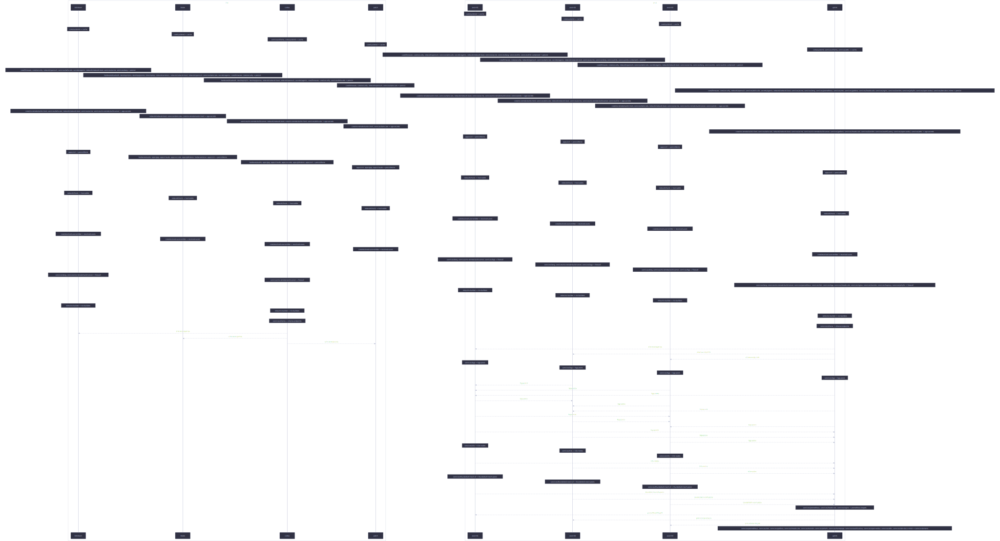

# Pipe Sequence

```mermaid
%%{init: {"theme":"base","themeVariables":{"activationBkgColor":"#d0d7de","activationBorderColor":"#8c959f","actorBkg":"#d0d7de","actorBorder":"#6e7781","actorLineColor":"#6e7781","actorTextColor":"#424a53","background":"#eaeef2","classText":"#424a53","clusterBkg":"#d0d7de","clusterBorder":"#8c959f","edgeLabelBackground":"#eaeef2","labelBoxBkgColor":"#d0d7de","labelBoxBorderColor":"#6e7781","labelTextColor":"#424a53","lineColor":"#6e7781","loopTextColor":"#424a53","mainBkg":"#d0d7de","nodeBkg":"#d0d7de","nodeBorder":"#6e7781","nodeTextColor":"#424a53","noteBkgColor":"#d0d7de","noteBorderColor":"#8c959f","noteTextColor":"#424a53","pie1":"#fa4549","pie2":"#e16f24","pie3":"#bf8700","pie4":"#2da44e","pie5":"#339D9B","pie6":"#218bff","pie7":"#a475f9","pie8":"#4d2d00","pieLegendTextColor":"#424a53","pieOuterStrokeColor":"#8c959f","pieSectionTextColor":"#424a53","pieStrokeColor":"#8c959f","pieTitleTextColor":"#424a53","primaryBorderColor":"#6e7781","primaryColor":"#d0d7de","primaryTextColor":"#424a53","secondBkg":"#d0d7de","secondaryBorderColor":"#8c959f","secondaryColor":"#d0d7de","secondaryTextColor":"#424a53","sequenceNumberColor":"#eaeef2","signalColor":"#6e7781","signalTextColor":"#424a53","tertiaryBorderColor":"#8c959f","tertiaryColor":"#d0d7de","tertiaryTextColor":"#424a53","textColor":"#424a53","titleColor":"#424a53"}}}%%
sequenceDiagram
    box dev
    participant bitstream as bitstream
    participant blade as blade
    participant cortex as cortex
    participant patch as patch
    end
    box prod
    participant axon_01 as axon-01
    participant axon_02 as axon-02
    participant axon_03 as axon-03
    participant uplink as uplink
    end

    Note over axon_01: core/systemd → cache
    Note over axon_02: core/systemd → cache
    Note over axon_03: core/systemd → cache
    Note over bitstream: core/systemd → cache
    Note over blade: core/systemd → cache
    Note over cortex: services/ollama, core/systemd → cache
    Note over patch: core/systemd → cache
    Note over uplink: core/systemd, services/ollama, services/attic → cache

    Note over axon_01: core/firmware, core/security, network/openssh, services/tailscale, secrets/agenix, network/network-boot, services/acme, services/tang, services/k3s, services/k3s-containerd → persist
    Note over axon_02: core/firmware, core/security, network/openssh, services/tailscale, secrets/agenix, network/network-boot, services/acme, services/tang, services/k3s, services/k3s-containerd → persist
    Note over axon_03: core/firmware, core/security, network/openssh, services/tailscale, secrets/agenix, network/network-boot, services/acme, services/tang, services/k3s, services/k3s-containerd → persist
    Note over bitstream: core/firmware, core/security, network/openssh, services/tailscale, secrets/agenix, network/network-boot, services/acme, services/tang → persist
    Note over blade: hardware/bluetooth, desktop/stylix, desktop/gnome, roles/laptop, network/wireless, network/network-boot, network/openssh, services/tailscale, secrets/agenix, core/firmware, core/security → persist
    Note over cortex: hardware/bluetooth, desktop/stylix, desktop/gnome, network/network-boot, network/openssh, secrets/agenix, core/firmware, core/security, services/tailscale → persist
    Note over patch: core/firmware, core/security, network/openssh, services/tailscale → persist
    Note over uplink: core/firmware, core/security, network/openssh, services/tailscale, secrets/agenix, network/network-boot, services/acme, services/tang, services/prometheus, services/loki, services/grafana, services/headscale, services/nginx, services/kanidm, services/jellyfin, services/open-webui, services/den-docs-mirror → persist

    Note over axon_01: core/nix-remote-build-client, services/tailscale, network/network-boot, services/acme, services/nix-remote-build-server, services/k3s → age-secrets
    Note over axon_02: core/nix-remote-build-client, services/tailscale, network/network-boot, services/acme, services/nix-remote-build-server, services/k3s → age-secrets
    Note over axon_03: core/nix-remote-build-client, services/tailscale, network/network-boot, services/acme, services/nix-remote-build-server, services/k3s → age-secrets
    Note over bitstream: core/nix-remote-build-client, services/tailscale, network/network-boot, services/acme, services/nix-remote-build-server → age-secrets
    Note over blade: network/network-boot, services/tailscale, core/nix-remote-build-client → age-secrets
    Note over cortex: services/nix-remote-build-server, network/network-boot, core/nix-remote-build-client, services/tailscale → age-secrets
    Note over patch: core/nix-remote-build-client, services/tailscale → age-secrets
    Note over uplink: core/nix-remote-build-client, services/tailscale, network/network-boot, services/acme, services/nix-remote-build-server, services/grafana, services/headscale, services/kanidm, services/oauth2-proxy, services/open-webui, services/attic → age-secrets

    Note over axon_01: apps/zsh → persistHome
    Note over axon_02: apps/zsh → persistHome
    Note over axon_03: apps/zsh → persistHome
    Note over bitstream: apps/zsh → persistHome
    Note over blade: hardware/audio, apps/gpg, apps/claude, apps/vscode, apps/gitkraken, hardware/razer, apps/zsh → persistHome
    Note over cortex: hardware/audio, apps/gpg, apps/claude, apps/vscode, apps/gitkraken, apps/zsh → persistHome
    Note over patch: apps/zsh, apps/gpg, apps/claude → persistHome
    Note over uplink: apps/zsh → persistHome

    Note over axon_01: network/hosts → host-addrs
    Note over axon_02: network/hosts → host-addrs
    Note over axon_03: network/hosts → host-addrs
    Note over bitstream: network/hosts → host-addrs
    Note over blade: network/hosts → host-addrs
    Note over cortex: network/hosts → host-addrs
    Note over patch: network/hosts → host-addrs
    Note over uplink: network/hosts → host-addrs

    Note over axon_01: core/resolved-user-emitter → resolved-users
    Note over axon_02: core/resolved-user-emitter → resolved-users
    Note over axon_03: core/resolved-user-emitter → resolved-users
    Note over bitstream: core/resolved-user-emitter → resolved-users
    Note over blade: core/resolved-user-emitter → resolved-users
    Note over cortex: core/resolved-user-emitter → resolved-users
    Note over patch: core/resolved-user-emitter → resolved-users
    Note over uplink: core/resolved-user-emitter → resolved-users

    Note over axon_01: services/tang, services/nix-remote-build-server, services/bgp → firewall
    Note over axon_02: services/tang, services/nix-remote-build-server, services/bgp → firewall
    Note over axon_03: services/tang, services/nix-remote-build-server, services/bgp → firewall
    Note over bitstream: services/tang, services/nix-remote-build-server → firewall
    Note over cortex: services/nix-remote-build-server → firewall
    Note over uplink: services/tang, services/nix-remote-build-server, services/prometheus, services/loki, services/bgp, services/headscale, services/nginx, services/kanidm, services/haproxy, services/jellyfin → firewall

    Note over axon_01: roles/nix-builder → nix-builders
    Note over axon_02: roles/nix-builder → nix-builders
    Note over axon_03: roles/nix-builder → nix-builders
    Note over bitstream: roles/nix-builder → nix-builders
    Note over cortex: roles/nix-builder → nix-builders
    Note over uplink: roles/nix-builder → nix-builders

    Note over cortex: services/ollama → ollama-endpoints
    Note over uplink: services/ollama → ollama-endpoints
    cortex -->> bitstream: ollama-endpoints
    cortex -->> blade: ollama-endpoints
    cortex -->> patch: ollama-endpoints
    uplink -->> axon_01: ollama-endpoints
    uplink -->> axon_02: ollama-endpoints
    uplink -->> axon_03: ollama-endpoints

    Note over axon_01: services/bgp → bgp-peers
    Note over axon_02: services/bgp → bgp-peers
    Note over axon_03: services/bgp → bgp-peers
    Note over uplink: services/bgp → bgp-peers
    axon_02 -->> axon_01: bgp-peers
    axon_03 -->> axon_01: bgp-peers
    uplink -->> axon_01: bgp-peers
    axon_01 -->> axon_02: bgp-peers
    axon_03 -->> axon_02: bgp-peers
    uplink -->> axon_02: bgp-peers
    axon_01 -->> axon_03: bgp-peers
    axon_02 -->> axon_03: bgp-peers
    uplink -->> axon_03: bgp-peers
    axon_01 -->> uplink: bgp-peers
    axon_02 -->> uplink: bgp-peers
    axon_03 -->> uplink: bgp-peers

    Note over axon_01: services/k3s → k3s-nodes
    Note over axon_02: services/k3s → k3s-nodes
    Note over axon_03: services/k3s → k3s-nodes
    axon_01 -->> uplink: k3s-nodes
    axon_02 -->> uplink: k3s-nodes
    axon_03 -->> uplink: k3s-nodes

    Note over axon_01: services/thunderbolt-mesh-of → thunderbolt-mesh-peers
    Note over axon_02: services/thunderbolt-mesh-of → thunderbolt-mesh-peers
    Note over axon_03: services/thunderbolt-mesh-of → thunderbolt-mesh-peers
    axon_01 -->> uplink: thunderbolt-mesh-peers
    axon_02 -->> uplink: thunderbolt-mesh-peers
    axon_03 -->> uplink: thunderbolt-mesh-peers

    Note over uplink: services/prometheus, services/headscale, services/nginx → prometheus-targets
    uplink -->> axon_01: prometheus-targets
    uplink -->> axon_02: prometheus-targets
    uplink -->> axon_03: prometheus-targets

    Note over uplink: services/prometheus, services/loki, services/grafana, services/headscale, services/kanidm, services/jellyfin, services/homepage, services/oauth2-proxy, services/open-webui, services/attic, services/den-docs-mirror → service-domains
```
