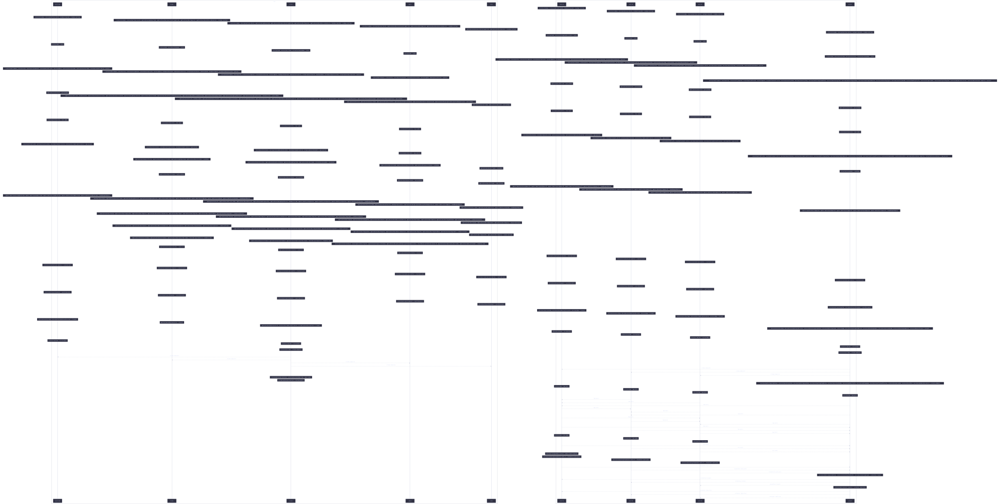

# Pipe Sequence



```mermaid
%%{init: {"theme":"base","themeVariables":{"activationBkgColor":"#313244","activationBorderColor":"#6c7086","actorBkg":"#313244","actorBorder":"#a6adc8","actorLineColor":"#a6adc8","actorTextColor":"#cdd6f4","background":"#1e1e2e","classText":"#cdd6f4","clusterBkg":"#313244","clusterBorder":"#6c7086","edgeLabelBackground":"#1e1e2e","labelBoxBkgColor":"#313244","labelBoxBorderColor":"#a6adc8","labelTextColor":"#cdd6f4","lineColor":"#a6adc8","loopTextColor":"#cdd6f4","mainBkg":"#313244","nodeBkg":"#313244","nodeBorder":"#a6adc8","nodeTextColor":"#cdd6f4","noteBkgColor":"#313244","noteBorderColor":"#6c7086","noteTextColor":"#cdd6f4","pie1":"#f38ba8","pie2":"#fab387","pie3":"#f9e2af","pie4":"#a6e3a1","pie5":"#94e2d5","pie6":"#89b4fa","pie7":"#cba6f7","pie8":"#f2cdcd","pieLegendTextColor":"#cdd6f4","pieOuterStrokeColor":"#6c7086","pieSectionTextColor":"#cdd6f4","pieStrokeColor":"#6c7086","pieTitleTextColor":"#cdd6f4","primaryBorderColor":"#a6adc8","primaryColor":"#313244","primaryTextColor":"#cdd6f4","secondBkg":"#313244","secondaryBorderColor":"#6c7086","secondaryColor":"#313244","secondaryTextColor":"#cdd6f4","sequenceNumberColor":"#1e1e2e","signalColor":"#a6adc8","signalTextColor":"#cdd6f4","tertiaryBorderColor":"#6c7086","tertiaryColor":"#313244","tertiaryTextColor":"#cdd6f4","textColor":"#cdd6f4","titleColor":"#cdd6f4"}}}%%
sequenceDiagram
    box dev
    participant bitstream as bitstream
    participant blade as blade
    participant cortex as cortex
    participant patch as patch
    participant slab as slab
    end
    box prod
    participant axon_01 as axon-01
    participant axon_02 as axon-02
    participant axon_03 as axon-03
    participant uplink as uplink
    end

    Note over axon_01: core/nix/nixpkgs, core/system/linux-kernel, hardware/cpu/amd → nixpkgs-overlays
    Note over axon_02: core/nix/nixpkgs, core/system/linux-kernel, hardware/cpu/amd → nixpkgs-overlays
    Note over axon_03: core/nix/nixpkgs, core/system/linux-kernel, hardware/cpu/amd → nixpkgs-overlays
    Note over bitstream: core/nix/nixpkgs, core/system/linux-kernel, hardware/cpu/amd → nixpkgs-overlays
    Note over blade: core/nix/nixpkgs, core/system/linux-kernel, applications/gaming/steam, applications/dev/security/ssh-agent-mux, applications/dev/lang/rust, applications/dev/editor/codium/core → nixpkgs-overlays
    Note over cortex: core/nix/nixpkgs, core/system/linux-kernel, applications/gaming/steam, applications/dev/security/ssh-agent-mux, applications/dev/lang/rust, applications/dev/editor/codium/core, hardware/cpu/amd → nixpkgs-overlays
    Note over patch: core/nix/nixpkgs, core/system/linux-kernel, applications/dev/security/ssh-agent-mux, applications/dev/lang/rust, applications/dev/editor/codium/core → nixpkgs-overlays
    Note over slab: applications/dev/security/ssh-agent-mux, applications/dev/lang/rust → nixpkgs-overlays
    Note over uplink: core/nix/nixpkgs, core/system/linux-kernel, hardware/cpu/amd → nixpkgs-overlays

    Note over axon_01: core/systemd, services/storage/media-scratch → cache
    Note over axon_02: core/systemd → cache
    Note over axon_03: core/systemd → cache
    Note over bitstream: core/systemd → cache
    Note over blade: core/systemd, core/network/manager → cache
    Note over cortex: core/systemd, services/ai/ollama, virtualization/podman → cache
    Note over patch: core/systemd → cache
    Note over uplink: core/systemd, services/ai/ollama, services/nix/attic, virtualization/podman → cache

    Note over axon_01: core/system/firmware, core/security, core/security/openssh, core/network/tailscale, secrets/agenix, core/boot/network-initrd, services/security/acme, services/security/tang, services/k3s, services/k3s/containerd → persist
    Note over axon_02: core/system/firmware, core/security, core/security/openssh, core/network/tailscale, secrets/agenix, core/boot/network-initrd, services/security/acme, services/security/tang, services/k3s, services/k3s/containerd → persist
    Note over axon_03: core/system/firmware, core/security, core/security/openssh, core/network/tailscale, secrets/agenix, core/boot/network-initrd, services/security/acme, services/security/tang, services/k3s, services/k3s/containerd → persist
    Note over bitstream: core/system/firmware, core/security, core/security/openssh, core/network/tailscale, secrets/agenix, services/security/acme, services/security/tang, core/boot/network-initrd → persist
    Note over blade: core/system/firmware, core/security, core/security/openssh, core/network/tailscale, secrets/agenix, hardware/bluetooth, desktop/style/stylix, virtualization/libvirt, desktop/gnome, hardware/laptop, core/boot/network-initrd → persist
    Note over cortex: core/system/firmware, core/security, core/security/openssh, core/network/tailscale, secrets/agenix, hardware/bluetooth, desktop/style/stylix, virtualization/libvirt, desktop/gnome, core/boot/network-initrd, virtualization/microvm-host → persist
    Note over patch: core/system/firmware, core/security, core/security/openssh, core/network/tailscale, secrets/agenix, desktop/style/stylix → persist
    Note over uplink: core/system/firmware, core/security, core/security/openssh, core/network/tailscale, secrets/agenix, core/boot/network-initrd, services/security/acme, services/security/tang, services/monitoring/prometheus, services/monitoring/loki, services/monitoring/grafana, services/networking/headscale, services/networking/nginx, services/security/kanidm, services/media/jellyfin, services/ai/open-webui, core/network/syncthing/hub, services/web/den-docs-mirror, services/web/container-registry → persist

    Note over axon_01: applications/shell/zsh → persistHome
    Note over axon_02: applications/shell/zsh → persistHome
    Note over axon_03: applications/shell/zsh → persistHome
    Note over bitstream: applications/shell/zsh → persistHome
    Note over blade: applications/shell/zsh, hardware/audio, applications/browsers/firefox, applications/browsers/chromium, applications/gaming/sunshine, applications/dev/ai/claude, applications/dev/editor/codium/antigravity, applications/dev/editor/codium/vscode, applications/messaging/element, applications/messaging/kdeconnect, applications/messaging/messenger, hardware/razer → persistHome
    Note over cortex: applications/shell/zsh, hardware/audio, applications/browsers/firefox, applications/browsers/chromium, applications/gaming/sunshine, applications/dev/ai/claude, applications/dev/editor/codium/antigravity, applications/dev/editor/codium/vscode, applications/messaging/element, applications/messaging/kdeconnect, applications/messaging/messenger, applications/media/easyeffects → persistHome
    Note over patch: applications/shell/zsh, applications/dev/ai/claude, applications/browsers/firefox, applications/browsers/chromium, applications/dev/editor/codium/vscode, applications/dev/git/gitkraken/{gitkraken@user=sini} → persistHome
    Note over slab: applications/dev/ai/claude, applications/shell/zsh → persistHome
    Note over uplink: applications/shell/zsh → persistHome

    Note over axon_01: core/network/hostsfile → host-addrs
    Note over axon_02: core/network/hostsfile → host-addrs
    Note over axon_03: core/network/hostsfile → host-addrs
    Note over bitstream: core/network/hostsfile → host-addrs
    Note over blade: core/network/hostsfile → host-addrs
    Note over cortex: core/network/hostsfile → host-addrs
    Note over patch: core/network/hostsfile → host-addrs
    Note over uplink: core/network/hostsfile → host-addrs

    Note over axon_01: core/network/tailscale, core/boot/network-initrd, services/security/acme, services/nix/remote-build-server, services/k3s → age-secrets
    Note over axon_02: core/network/tailscale, core/boot/network-initrd, services/security/acme, services/nix/remote-build-server, services/k3s → age-secrets
    Note over axon_03: core/network/tailscale, core/boot/network-initrd, services/security/acme, services/nix/remote-build-server, services/k3s → age-secrets
    Note over bitstream: core/network/tailscale, services/security/acme, core/boot/network-initrd, services/nix/remote-build-server → age-secrets
    Note over blade: core/network/tailscale, core/boot/wireless-initrd, core/boot/network-initrd → age-secrets
    Note over cortex: core/network/tailscale, services/nix/remote-build-server, core/boot/network-initrd, virtualization/containers → age-secrets
    Note over patch: core/network/tailscale → age-secrets
    Note over uplink: core/network/tailscale, core/boot/network-initrd, services/security/acme, services/nix/remote-build-server, services/monitoring/grafana, services/networking/headscale, services/security/kanidm, services/security/oauth2-proxy, services/ai/open-webui, services/nix/attic, services/web/container-registry, virtualization/containers → age-secrets

    Note over blade: applications/browsers/firefox, applications/browsers/chromium, applications/gaming/steam, applications/dev/ai/claude → cacheHome
    Note over cortex: applications/browsers/firefox, applications/browsers/chromium, applications/gaming/steam, applications/dev/ai/claude, virtualization/podman → cacheHome
    Note over patch: applications/dev/ai/claude, applications/browsers/firefox, applications/browsers/chromium → cacheHome
    Note over slab: applications/dev/ai/claude → cacheHome
    Note over uplink: virtualization/podman → cacheHome

    Note over blade: applications/dev/ai/claude → replicateHome
    Note over cortex: applications/dev/ai/claude → replicateHome
    Note over patch: applications/dev/ai/claude → replicateHome
    Note over slab: applications/dev/ai/claude → replicateHome

    Note over axon_01: agenix-identity/dvicory@axon-01, agenix-identity/pol@axon-01, agenix-identity/sini@axon-01, agenix-identity/theutz@axon-01, agenix-identity/vic@axon-01 → homeManagerModules
    Note over axon_02: agenix-identity/dvicory@axon-02, agenix-identity/pol@axon-02, agenix-identity/sini@axon-02, agenix-identity/theutz@axon-02, agenix-identity/vic@axon-02 → homeManagerModules
    Note over axon_03: agenix-identity/dvicory@axon-03, agenix-identity/pol@axon-03, agenix-identity/sini@axon-03, agenix-identity/theutz@axon-03, agenix-identity/vic@axon-03 → homeManagerModules
    Note over bitstream: agenix-identity/dvicory@bitstream, agenix-identity/pol@bitstream, agenix-identity/sini@bitstream, agenix-identity/theutz@bitstream, agenix-identity/vic@bitstream → homeManagerModules
    Note over blade: desktop/style/stylix, applications/shell/nix-index, applications/dev/editor/nvf, applications/messaging/discord, applications/media/spicetify, agenix-identity/shuo@blade, agenix-identity/sini@blade, agenix-identity/vic@blade, agenix-identity/will@blade → homeManagerModules
    Note over cortex: desktop/style/stylix, applications/shell/nix-index, applications/dev/editor/nvf, applications/media/spicetify, applications/messaging/discord, hardware/vr-amd, agenix-identity/shuo@cortex, agenix-identity/sini@cortex, agenix-identity/vic@cortex, agenix-identity/will@cortex → homeManagerModules
    Note over patch: applications/shell/nix-index, applications/dev/editor/nvf, desktop/style/stylix, applications/dev/git/gitkraken/{gitkraken@user=sini}, agenix-identity/sini@patch → homeManagerModules
    Note over slab: applications/shell/nix-index, applications/dev/editor/nvf, agenix-identity/sini@slab → homeManagerModules
    Note over uplink: agenix-identity/dvicory@uplink, agenix-identity/pol@uplink, agenix-identity/sini@uplink, agenix-identity/theutz@uplink, agenix-identity/vic@uplink → homeManagerModules

    Note over blade: applications/dev/lang/go, applications/dev/lang/python, applications/dev/lang/nix, applications/dev/editor/codium/core, applications/dev/lang/c, applications/dev/lang/lua, applications/dev/lang/markdown, applications/dev/lang/shell → codium-extensions
    Note over cortex: applications/dev/lang/go, applications/dev/lang/python, applications/dev/lang/nix, applications/dev/editor/codium/core, applications/dev/lang/c, applications/dev/lang/lua, applications/dev/lang/markdown, applications/dev/lang/shell → codium-extensions
    Note over patch: applications/dev/lang/go, applications/dev/lang/python, applications/dev/lang/nix, applications/dev/editor/codium/core, applications/dev/lang/c, applications/dev/lang/lua, applications/dev/lang/markdown, applications/dev/lang/shell → codium-extensions
    Note over slab: applications/dev/lang/go, applications/dev/lang/python, applications/dev/lang/nix → codium-extensions

    Note over blade: applications/dev/lang/python, applications/dev/lang/nix, applications/dev/editor/codium/core, applications/dev/lang/lua, applications/dev/lang/markdown, applications/dev/lang/shell → codium-settings
    Note over cortex: applications/dev/lang/python, applications/dev/lang/nix, applications/dev/editor/codium/core, applications/dev/lang/lua, applications/dev/lang/markdown, applications/dev/lang/shell → codium-settings
    Note over patch: applications/dev/lang/python, applications/dev/lang/nix, applications/dev/editor/codium/core, applications/dev/lang/lua, applications/dev/lang/markdown, applications/dev/lang/shell → codium-settings
    Note over slab: applications/dev/lang/python, applications/dev/lang/nix → codium-settings

    Note over blade: applications/browsers/chromium, applications/mail/protonmail, applications/productivity/obs-studio, roles/dev-gui/<anon>:11 → homebrew-cask
    Note over cortex: applications/browsers/chromium, applications/mail/protonmail, applications/productivity/obs-studio, roles/dev-gui/<anon>:11 → homebrew-cask
    Note over patch: macos/applications/karabiner, macos/applications/raycast, applications/browsers/chromium, applications/dev/git/gitkraken/{gitkraken@user=sini}, roles/darwin-workstation/<anon>:31, applications/productivity/obs-studio, applications/mail/protonmail → homebrew-cask

    Note over blade: applications/browsers/firefox → stylix-hm
    Note over cortex: applications/browsers/firefox → stylix-hm
    Note over patch: applications/browsers/firefox → stylix-hm

    Note over axon_01: core/users/resolved-user-emitter → resolved-users
    Note over axon_02: core/users/resolved-user-emitter → resolved-users
    Note over axon_03: core/users/resolved-user-emitter → resolved-users
    Note over bitstream: core/users/resolved-user-emitter → resolved-users
    Note over blade: core/users/resolved-user-emitter → resolved-users
    Note over cortex: core/users/resolved-user-emitter → resolved-users
    Note over patch: core/users/resolved-user-emitter → resolved-users
    Note over slab: core/users/resolved-user-emitter → resolved-users
    Note over uplink: core/users/resolved-user-emitter → resolved-users

    Note over axon_01: core/network/syncthing/peer → syncthing-peers
    Note over axon_02: core/network/syncthing/peer → syncthing-peers
    Note over axon_03: core/network/syncthing/peer → syncthing-peers
    Note over bitstream: core/network/syncthing/peer → syncthing-peers
    Note over blade: core/network/syncthing/peer → syncthing-peers
    Note over cortex: core/network/syncthing/peer → syncthing-peers
    Note over patch: core/network/syncthing/peer → syncthing-peers
    Note over slab: core/network/syncthing/peer → syncthing-peers
    Note over uplink: core/network/syncthing/hub, core/network/syncthing/peer → syncthing-peers

    Note over axon_01: services/security/tang, services/nix/remote-build-server, services/bgp → firewall
    Note over axon_02: services/security/tang, services/nix/remote-build-server, services/bgp → firewall
    Note over axon_03: services/security/tang, services/nix/remote-build-server, services/bgp → firewall
    Note over bitstream: services/security/tang, services/nix/remote-build-server → firewall
    Note over blade: applications/media/spicetify → firewall
    Note over cortex: applications/media/spicetify, services/nix/remote-build-server, virtualization/microvm-host → firewall
    Note over uplink: services/security/tang, services/nix/remote-build-server, services/monitoring/prometheus, services/monitoring/loki, services/bgp, services/networking/headscale, services/networking/nginx, services/security/kanidm, services/networking/haproxy, services/media/jellyfin → firewall

    Note over axon_01: roles/nix-builder → nix-builders
    Note over axon_02: roles/nix-builder → nix-builders
    Note over axon_03: roles/nix-builder → nix-builders
    Note over bitstream: roles/nix-builder → nix-builders
    Note over cortex: roles/nix-builder → nix-builders
    Note over uplink: roles/nix-builder → nix-builders

    Note over cortex: services/ai/ollama → ollama-endpoints
    Note over uplink: services/ai/ollama → ollama-endpoints
    cortex -->> bitstream: ollama-endpoints
    cortex -->> blade: ollama-endpoints
    cortex -->> patch: ollama-endpoints
    cortex -->> slab: ollama-endpoints
    uplink -->> axon_01: ollama-endpoints
    uplink -->> axon_02: ollama-endpoints
    uplink -->> axon_03: ollama-endpoints

    Note over cortex: virtualization/microvm-host, virtualization/windows-vfio → gpu-claims

    Note over cortex: virtualization/microvm-host → microvm-guests

    Note over uplink: services/monitoring/prometheus, services/monitoring/loki, services/monitoring/grafana, services/networking/headscale, services/security/kanidm, services/media/jellyfin, services/web/homepage, services/security/oauth2-proxy, services/ai/open-webui, services/nix/attic, services/web/den-docs-mirror → service-domains

    Note over axon_01: services/bgp → bgp-peers
    Note over axon_02: services/bgp → bgp-peers
    Note over axon_03: services/bgp → bgp-peers
    Note over uplink: services/bgp → bgp-peers
    axon_02 -->> axon_01: bgp-peers
    axon_03 -->> axon_01: bgp-peers
    uplink -->> axon_01: bgp-peers
    axon_01 -->> axon_02: bgp-peers
    axon_03 -->> axon_02: bgp-peers
    uplink -->> axon_02: bgp-peers
    axon_01 -->> axon_03: bgp-peers
    axon_02 -->> axon_03: bgp-peers
    uplink -->> axon_03: bgp-peers
    axon_01 -->> uplink: bgp-peers
    axon_02 -->> uplink: bgp-peers
    axon_03 -->> uplink: bgp-peers

    Note over axon_01: services/k3s → k3s-nodes
    Note over axon_02: services/k3s → k3s-nodes
    Note over axon_03: services/k3s → k3s-nodes
    axon_01 -->> uplink: k3s-nodes
    axon_02 -->> uplink: k3s-nodes
    axon_03 -->> uplink: k3s-nodes

    Note over axon_01: services/storage/media-scratch → media-scratch-exports

    Note over axon_01: services/networking/thunderbolt-mesh-of → thunderbolt-mesh-peers
    Note over axon_02: services/networking/thunderbolt-mesh-of → thunderbolt-mesh-peers
    Note over axon_03: services/networking/thunderbolt-mesh-of → thunderbolt-mesh-peers
    axon_01 -->> uplink: thunderbolt-mesh-peers
    axon_02 -->> uplink: thunderbolt-mesh-peers
    axon_03 -->> uplink: thunderbolt-mesh-peers

    Note over uplink: services/monitoring/prometheus, services/networking/headscale, services/networking/nginx → prometheus-targets
    uplink -->> axon_01: prometheus-targets
    uplink -->> axon_02: prometheus-targets
    uplink -->> axon_03: prometheus-targets

    Note over uplink: services/web/container-registry → container-registries
    uplink -->> axon_01: container-registries
    uplink -->> axon_02: container-registries
    uplink -->> axon_03: container-registries
```
