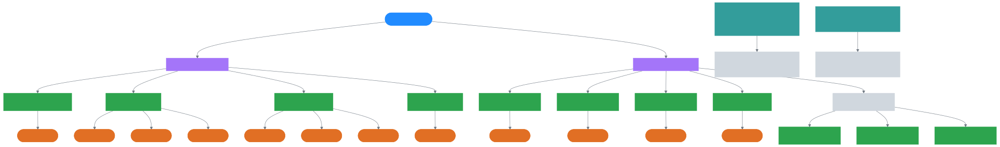

# Scope Topology

```mermaid
%%{init: {"theme":"base","themeVariables":{"activationBkgColor":"#313244","activationBorderColor":"#6c7086","actorBkg":"#313244","actorBorder":"#a6adc8","actorLineColor":"#a6adc8","actorTextColor":"#cdd6f4","background":"#1e1e2e","classText":"#cdd6f4","clusterBkg":"#313244","clusterBorder":"#6c7086","edgeLabelBackground":"#1e1e2e","labelBoxBkgColor":"#313244","labelBoxBorderColor":"#a6adc8","labelTextColor":"#cdd6f4","lineColor":"#a6adc8","loopTextColor":"#cdd6f4","mainBkg":"#313244","nodeBkg":"#313244","nodeBorder":"#a6adc8","nodeTextColor":"#cdd6f4","noteBkgColor":"#313244","noteBorderColor":"#6c7086","noteTextColor":"#cdd6f4","pie1":"#f38ba8","pie2":"#fab387","pie3":"#f9e2af","pie4":"#a6e3a1","pie5":"#94e2d5","pie6":"#89b4fa","pie7":"#cba6f7","pie8":"#f2cdcd","pieLegendTextColor":"#cdd6f4","pieOuterStrokeColor":"#6c7086","pieSectionTextColor":"#cdd6f4","pieStrokeColor":"#6c7086","pieTitleTextColor":"#cdd6f4","primaryBorderColor":"#a6adc8","primaryColor":"#313244","primaryTextColor":"#cdd6f4","secondBkg":"#313244","secondaryBorderColor":"#6c7086","secondaryColor":"#313244","secondaryTextColor":"#cdd6f4","sequenceNumberColor":"#1e1e2e","signalColor":"#a6adc8","signalTextColor":"#cdd6f4","tertiaryBorderColor":"#6c7086","tertiaryColor":"#313244","tertiaryTextColor":"#cdd6f4","textColor":"#cdd6f4","titleColor":"#cdd6f4"}}}%%
graph TD
  accessGroups__list_accessGroups__environment_dev_fleet_fleet_host_bitstream_secretsConfig__set_secretsConfig_["host: bitstream"]
  accessGroups__list_accessGroups__environment_dev_fleet_fleet_host_bitstream_secretsConfig__set_secretsConfig__user_sini(["user: sini"])
  accessGroups__list_accessGroups__environment_dev_fleet_fleet_host_blade_secretsConfig__set_secretsConfig_["host: blade"]
  accessGroups__list_accessGroups__environment_dev_fleet_fleet_host_blade_secretsConfig__set_secretsConfig__user_shuo(["user: shuo"])
  accessGroups__list_accessGroups__environment_dev_fleet_fleet_host_blade_secretsConfig__set_secretsConfig__user_sini(["user: sini"])
  accessGroups__list_accessGroups__environment_dev_fleet_fleet_host_blade_secretsConfig__set_secretsConfig__user_will(["user: will"])
  accessGroups__list_accessGroups__environment_dev_fleet_fleet_host_cortex_secretsConfig__set_secretsConfig_["host: cortex"]
  accessGroups__list_accessGroups__environment_dev_fleet_fleet_host_cortex_secretsConfig__set_secretsConfig__user_shuo(["user: shuo"])
  accessGroups__list_accessGroups__environment_dev_fleet_fleet_host_cortex_secretsConfig__set_secretsConfig__user_sini(["user: sini"])
  accessGroups__list_accessGroups__environment_dev_fleet_fleet_host_cortex_secretsConfig__set_secretsConfig__user_will(["user: will"])
  accessGroups__list_accessGroups__environment_dev_fleet_fleet_host_patch_secretsConfig__set_secretsConfig_["host: patch"]
  accessGroups__list_accessGroups__environment_dev_fleet_fleet_host_patch_secretsConfig__set_secretsConfig__user_sini(["user: sini"])
  accessGroups__list_accessGroups__environment_prod_fleet_fleet_host_axon_01_secretsConfig__set_secretsConfig_["host: axon-01"]
  accessGroups__list_accessGroups__environment_prod_fleet_fleet_host_axon_01_secretsConfig__set_secretsConfig__user_sini(["user: sini"])
  accessGroups__list_accessGroups__environment_prod_fleet_fleet_host_axon_02_secretsConfig__set_secretsConfig_["host: axon-02"]
  accessGroups__list_accessGroups__environment_prod_fleet_fleet_host_axon_02_secretsConfig__set_secretsConfig__user_sini(["user: sini"])
  accessGroups__list_accessGroups__environment_prod_fleet_fleet_host_axon_03_secretsConfig__set_secretsConfig_["host: axon-03"]
  accessGroups__list_accessGroups__environment_prod_fleet_fleet_host_axon_03_secretsConfig__set_secretsConfig__user_sini(["user: sini"])
  accessGroups__list_accessGroups__environment_prod_fleet_fleet_host_uplink_secretsConfig__set_secretsConfig_["host: uplink"]
  accessGroups__list_accessGroups__environment_prod_fleet_fleet_host_uplink_secretsConfig__set_secretsConfig__user_sini(["user: sini"])
  cluster_axon_environment_prod_fleet_fleet_host_axon_01_secretsConfig__set_secretsConfig_["host: axon-01"]
  cluster_axon_environment_prod_fleet_fleet_host_axon_02_secretsConfig__set_secretsConfig_["host: axon-02"]
  cluster_axon_environment_prod_fleet_fleet_host_axon_03_secretsConfig__set_secretsConfig_["host: axon-03"]
  cluster_axon_environment_prod_fleet_fleet_secretsConfig__set_secretsConfig_["cluster: axon"]
  environment_dev_fleet_fleet_secretsConfig__set_secretsConfig_[["environment: dev"]]
  environment_prod_fleet_fleet_secretsConfig__set_secretsConfig_[["environment: prod"]]
  flake_parts_flake_parts_aarch64_darwin_system_aarch64_darwin["flake-parts: flake-parts-aarch64-darwin"]
  flake_parts_flake_parts_x86_64_linux_system_x86_64_linux["flake-parts: flake-parts-x86_64-linux"]
  fleet_fleet_secretsConfig__set_secretsConfig_(["fleet: fleet"])
  system_aarch64_darwin["flake-system: system=aarch64-darwin"]
  system_x86_64_linux["flake-system: system=x86_64-linux"]

  environment_dev_fleet_fleet_secretsConfig__set_secretsConfig_ --> accessGroups__list_accessGroups__environment_dev_fleet_fleet_host_bitstream_secretsConfig__set_secretsConfig_
  accessGroups__list_accessGroups__environment_dev_fleet_fleet_host_bitstream_secretsConfig__set_secretsConfig_ --> accessGroups__list_accessGroups__environment_dev_fleet_fleet_host_bitstream_secretsConfig__set_secretsConfig__user_sini
  environment_dev_fleet_fleet_secretsConfig__set_secretsConfig_ --> accessGroups__list_accessGroups__environment_dev_fleet_fleet_host_blade_secretsConfig__set_secretsConfig_
  accessGroups__list_accessGroups__environment_dev_fleet_fleet_host_blade_secretsConfig__set_secretsConfig_ --> accessGroups__list_accessGroups__environment_dev_fleet_fleet_host_blade_secretsConfig__set_secretsConfig__user_shuo
  accessGroups__list_accessGroups__environment_dev_fleet_fleet_host_blade_secretsConfig__set_secretsConfig_ --> accessGroups__list_accessGroups__environment_dev_fleet_fleet_host_blade_secretsConfig__set_secretsConfig__user_sini
  accessGroups__list_accessGroups__environment_dev_fleet_fleet_host_blade_secretsConfig__set_secretsConfig_ --> accessGroups__list_accessGroups__environment_dev_fleet_fleet_host_blade_secretsConfig__set_secretsConfig__user_will
  environment_dev_fleet_fleet_secretsConfig__set_secretsConfig_ --> accessGroups__list_accessGroups__environment_dev_fleet_fleet_host_cortex_secretsConfig__set_secretsConfig_
  accessGroups__list_accessGroups__environment_dev_fleet_fleet_host_cortex_secretsConfig__set_secretsConfig_ --> accessGroups__list_accessGroups__environment_dev_fleet_fleet_host_cortex_secretsConfig__set_secretsConfig__user_shuo
  accessGroups__list_accessGroups__environment_dev_fleet_fleet_host_cortex_secretsConfig__set_secretsConfig_ --> accessGroups__list_accessGroups__environment_dev_fleet_fleet_host_cortex_secretsConfig__set_secretsConfig__user_sini
  accessGroups__list_accessGroups__environment_dev_fleet_fleet_host_cortex_secretsConfig__set_secretsConfig_ --> accessGroups__list_accessGroups__environment_dev_fleet_fleet_host_cortex_secretsConfig__set_secretsConfig__user_will
  environment_dev_fleet_fleet_secretsConfig__set_secretsConfig_ --> accessGroups__list_accessGroups__environment_dev_fleet_fleet_host_patch_secretsConfig__set_secretsConfig_
  accessGroups__list_accessGroups__environment_dev_fleet_fleet_host_patch_secretsConfig__set_secretsConfig_ --> accessGroups__list_accessGroups__environment_dev_fleet_fleet_host_patch_secretsConfig__set_secretsConfig__user_sini
  environment_prod_fleet_fleet_secretsConfig__set_secretsConfig_ --> accessGroups__list_accessGroups__environment_prod_fleet_fleet_host_axon_01_secretsConfig__set_secretsConfig_
  accessGroups__list_accessGroups__environment_prod_fleet_fleet_host_axon_01_secretsConfig__set_secretsConfig_ --> accessGroups__list_accessGroups__environment_prod_fleet_fleet_host_axon_01_secretsConfig__set_secretsConfig__user_sini
  environment_prod_fleet_fleet_secretsConfig__set_secretsConfig_ --> accessGroups__list_accessGroups__environment_prod_fleet_fleet_host_axon_02_secretsConfig__set_secretsConfig_
  accessGroups__list_accessGroups__environment_prod_fleet_fleet_host_axon_02_secretsConfig__set_secretsConfig_ --> accessGroups__list_accessGroups__environment_prod_fleet_fleet_host_axon_02_secretsConfig__set_secretsConfig__user_sini
  environment_prod_fleet_fleet_secretsConfig__set_secretsConfig_ --> accessGroups__list_accessGroups__environment_prod_fleet_fleet_host_axon_03_secretsConfig__set_secretsConfig_
  accessGroups__list_accessGroups__environment_prod_fleet_fleet_host_axon_03_secretsConfig__set_secretsConfig_ --> accessGroups__list_accessGroups__environment_prod_fleet_fleet_host_axon_03_secretsConfig__set_secretsConfig__user_sini
  environment_prod_fleet_fleet_secretsConfig__set_secretsConfig_ --> accessGroups__list_accessGroups__environment_prod_fleet_fleet_host_uplink_secretsConfig__set_secretsConfig_
  accessGroups__list_accessGroups__environment_prod_fleet_fleet_host_uplink_secretsConfig__set_secretsConfig_ --> accessGroups__list_accessGroups__environment_prod_fleet_fleet_host_uplink_secretsConfig__set_secretsConfig__user_sini
  cluster_axon_environment_prod_fleet_fleet_secretsConfig__set_secretsConfig_ --> cluster_axon_environment_prod_fleet_fleet_host_axon_01_secretsConfig__set_secretsConfig_
  cluster_axon_environment_prod_fleet_fleet_secretsConfig__set_secretsConfig_ --> cluster_axon_environment_prod_fleet_fleet_host_axon_02_secretsConfig__set_secretsConfig_
  cluster_axon_environment_prod_fleet_fleet_secretsConfig__set_secretsConfig_ --> cluster_axon_environment_prod_fleet_fleet_host_axon_03_secretsConfig__set_secretsConfig_
  environment_prod_fleet_fleet_secretsConfig__set_secretsConfig_ --> cluster_axon_environment_prod_fleet_fleet_secretsConfig__set_secretsConfig_
  fleet_fleet_secretsConfig__set_secretsConfig_ --> environment_dev_fleet_fleet_secretsConfig__set_secretsConfig_
  fleet_fleet_secretsConfig__set_secretsConfig_ --> environment_prod_fleet_fleet_secretsConfig__set_secretsConfig_
  system_aarch64_darwin --> flake_parts_flake_parts_aarch64_darwin_system_aarch64_darwin
  system_x86_64_linux --> flake_parts_flake_parts_x86_64_linux_system_x86_64_linux

  style accessGroups__list_accessGroups__environment_dev_fleet_fleet_host_bitstream_secretsConfig__set_secretsConfig_ fill:#a6e3a1,stroke:#a6e3a1,color:#1e1e2e
  style accessGroups__list_accessGroups__environment_dev_fleet_fleet_host_bitstream_secretsConfig__set_secretsConfig__user_sini fill:#fab387,stroke:#fab387,color:#1e1e2e
  style accessGroups__list_accessGroups__environment_dev_fleet_fleet_host_blade_secretsConfig__set_secretsConfig_ fill:#a6e3a1,stroke:#a6e3a1,color:#1e1e2e
  style accessGroups__list_accessGroups__environment_dev_fleet_fleet_host_blade_secretsConfig__set_secretsConfig__user_shuo fill:#fab387,stroke:#fab387,color:#1e1e2e
  style accessGroups__list_accessGroups__environment_dev_fleet_fleet_host_blade_secretsConfig__set_secretsConfig__user_sini fill:#fab387,stroke:#fab387,color:#1e1e2e
  style accessGroups__list_accessGroups__environment_dev_fleet_fleet_host_blade_secretsConfig__set_secretsConfig__user_will fill:#fab387,stroke:#fab387,color:#1e1e2e
  style accessGroups__list_accessGroups__environment_dev_fleet_fleet_host_cortex_secretsConfig__set_secretsConfig_ fill:#a6e3a1,stroke:#a6e3a1,color:#1e1e2e
  style accessGroups__list_accessGroups__environment_dev_fleet_fleet_host_cortex_secretsConfig__set_secretsConfig__user_shuo fill:#fab387,stroke:#fab387,color:#1e1e2e
  style accessGroups__list_accessGroups__environment_dev_fleet_fleet_host_cortex_secretsConfig__set_secretsConfig__user_sini fill:#fab387,stroke:#fab387,color:#1e1e2e
  style accessGroups__list_accessGroups__environment_dev_fleet_fleet_host_cortex_secretsConfig__set_secretsConfig__user_will fill:#fab387,stroke:#fab387,color:#1e1e2e
  style accessGroups__list_accessGroups__environment_dev_fleet_fleet_host_patch_secretsConfig__set_secretsConfig_ fill:#a6e3a1,stroke:#a6e3a1,color:#1e1e2e
  style accessGroups__list_accessGroups__environment_dev_fleet_fleet_host_patch_secretsConfig__set_secretsConfig__user_sini fill:#fab387,stroke:#fab387,color:#1e1e2e
  style accessGroups__list_accessGroups__environment_prod_fleet_fleet_host_axon_01_secretsConfig__set_secretsConfig_ fill:#a6e3a1,stroke:#a6e3a1,color:#1e1e2e
  style accessGroups__list_accessGroups__environment_prod_fleet_fleet_host_axon_01_secretsConfig__set_secretsConfig__user_sini fill:#fab387,stroke:#fab387,color:#1e1e2e
  style accessGroups__list_accessGroups__environment_prod_fleet_fleet_host_axon_02_secretsConfig__set_secretsConfig_ fill:#a6e3a1,stroke:#a6e3a1,color:#1e1e2e
  style accessGroups__list_accessGroups__environment_prod_fleet_fleet_host_axon_02_secretsConfig__set_secretsConfig__user_sini fill:#fab387,stroke:#fab387,color:#1e1e2e
  style accessGroups__list_accessGroups__environment_prod_fleet_fleet_host_axon_03_secretsConfig__set_secretsConfig_ fill:#a6e3a1,stroke:#a6e3a1,color:#1e1e2e
  style accessGroups__list_accessGroups__environment_prod_fleet_fleet_host_axon_03_secretsConfig__set_secretsConfig__user_sini fill:#fab387,stroke:#fab387,color:#1e1e2e
  style accessGroups__list_accessGroups__environment_prod_fleet_fleet_host_uplink_secretsConfig__set_secretsConfig_ fill:#a6e3a1,stroke:#a6e3a1,color:#1e1e2e
  style accessGroups__list_accessGroups__environment_prod_fleet_fleet_host_uplink_secretsConfig__set_secretsConfig__user_sini fill:#fab387,stroke:#fab387,color:#1e1e2e
  style cluster_axon_environment_prod_fleet_fleet_host_axon_01_secretsConfig__set_secretsConfig_ fill:#a6e3a1,stroke:#a6e3a1,color:#1e1e2e
  style cluster_axon_environment_prod_fleet_fleet_host_axon_02_secretsConfig__set_secretsConfig_ fill:#a6e3a1,stroke:#a6e3a1,color:#1e1e2e
  style cluster_axon_environment_prod_fleet_fleet_host_axon_03_secretsConfig__set_secretsConfig_ fill:#a6e3a1,stroke:#a6e3a1,color:#1e1e2e
  style cluster_axon_environment_prod_fleet_fleet_secretsConfig__set_secretsConfig_ fill:#313244,stroke:#313244,color:#1e1e2e
  style environment_dev_fleet_fleet_secretsConfig__set_secretsConfig_ fill:#cba6f7,stroke:#cba6f7,color:#1e1e2e
  style environment_prod_fleet_fleet_secretsConfig__set_secretsConfig_ fill:#cba6f7,stroke:#cba6f7,color:#1e1e2e
  style flake_parts_flake_parts_aarch64_darwin_system_aarch64_darwin fill:#313244,stroke:#313244,color:#1e1e2e
  style flake_parts_flake_parts_x86_64_linux_system_x86_64_linux fill:#313244,stroke:#313244,color:#1e1e2e
  style fleet_fleet_secretsConfig__set_secretsConfig_ fill:#89b4fa,stroke:#89b4fa,color:#1e1e2e
  style system_aarch64_darwin fill:#94e2d5,stroke:#94e2d5,color:#1e1e2e
  style system_x86_64_linux fill:#94e2d5,stroke:#94e2d5,color:#1e1e2e
```
