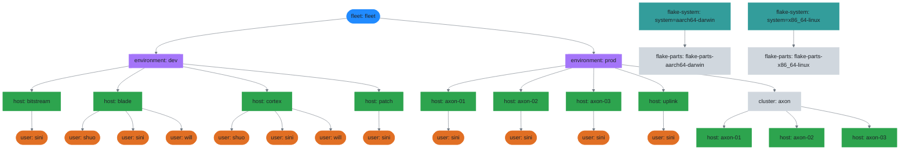

# Scope Topology

```mermaid
%%{init: {"theme":"base","themeVariables":{"activationBkgColor":"#d0d7de","activationBorderColor":"#8c959f","actorBkg":"#d0d7de","actorBorder":"#6e7781","actorLineColor":"#6e7781","actorTextColor":"#424a53","background":"#eaeef2","classText":"#424a53","clusterBkg":"#d0d7de","clusterBorder":"#8c959f","edgeLabelBackground":"#eaeef2","labelBoxBkgColor":"#d0d7de","labelBoxBorderColor":"#6e7781","labelTextColor":"#424a53","lineColor":"#6e7781","loopTextColor":"#424a53","mainBkg":"#d0d7de","nodeBkg":"#d0d7de","nodeBorder":"#6e7781","nodeTextColor":"#424a53","noteBkgColor":"#d0d7de","noteBorderColor":"#8c959f","noteTextColor":"#424a53","pie1":"#fa4549","pie2":"#e16f24","pie3":"#bf8700","pie4":"#2da44e","pie5":"#339D9B","pie6":"#218bff","pie7":"#a475f9","pie8":"#4d2d00","pieLegendTextColor":"#424a53","pieOuterStrokeColor":"#8c959f","pieSectionTextColor":"#424a53","pieStrokeColor":"#8c959f","pieTitleTextColor":"#424a53","primaryBorderColor":"#6e7781","primaryColor":"#d0d7de","primaryTextColor":"#424a53","secondBkg":"#d0d7de","secondaryBorderColor":"#8c959f","secondaryColor":"#d0d7de","secondaryTextColor":"#424a53","sequenceNumberColor":"#eaeef2","signalColor":"#6e7781","signalTextColor":"#424a53","tertiaryBorderColor":"#8c959f","tertiaryColor":"#d0d7de","tertiaryTextColor":"#424a53","textColor":"#424a53","titleColor":"#424a53"}}}%%
graph TD
  accessGroups__list_accessGroups__environment_dev_fleet_fleet_host_bitstream_secretsConfig__set_secretsConfig_["host: bitstream"]
  accessGroups__list_accessGroups__environment_dev_fleet_fleet_host_bitstream_secretsConfig__set_secretsConfig__user_sini(["user: sini"])
  accessGroups__list_accessGroups__environment_dev_fleet_fleet_host_blade_secretsConfig__set_secretsConfig_["host: blade"]
  accessGroups__list_accessGroups__environment_dev_fleet_fleet_host_blade_secretsConfig__set_secretsConfig__user_shuo(["user: shuo"])
  accessGroups__list_accessGroups__environment_dev_fleet_fleet_host_blade_secretsConfig__set_secretsConfig__user_sini(["user: sini"])
  accessGroups__list_accessGroups__environment_dev_fleet_fleet_host_blade_secretsConfig__set_secretsConfig__user_will(["user: will"])
  accessGroups__list_accessGroups__environment_dev_fleet_fleet_host_cortex_secretsConfig__set_secretsConfig_["host: cortex"]
  accessGroups__list_accessGroups__environment_dev_fleet_fleet_host_cortex_secretsConfig__set_secretsConfig__user_shuo(["user: shuo"])
  accessGroups__list_accessGroups__environment_dev_fleet_fleet_host_cortex_secretsConfig__set_secretsConfig__user_sini(["user: sini"])
  accessGroups__list_accessGroups__environment_dev_fleet_fleet_host_cortex_secretsConfig__set_secretsConfig__user_will(["user: will"])
  accessGroups__list_accessGroups__environment_dev_fleet_fleet_host_patch_secretsConfig__set_secretsConfig_["host: patch"]
  accessGroups__list_accessGroups__environment_dev_fleet_fleet_host_patch_secretsConfig__set_secretsConfig__user_sini(["user: sini"])
  accessGroups__list_accessGroups__environment_prod_fleet_fleet_host_axon_01_secretsConfig__set_secretsConfig_["host: axon-01"]
  accessGroups__list_accessGroups__environment_prod_fleet_fleet_host_axon_01_secretsConfig__set_secretsConfig__user_sini(["user: sini"])
  accessGroups__list_accessGroups__environment_prod_fleet_fleet_host_axon_02_secretsConfig__set_secretsConfig_["host: axon-02"]
  accessGroups__list_accessGroups__environment_prod_fleet_fleet_host_axon_02_secretsConfig__set_secretsConfig__user_sini(["user: sini"])
  accessGroups__list_accessGroups__environment_prod_fleet_fleet_host_axon_03_secretsConfig__set_secretsConfig_["host: axon-03"]
  accessGroups__list_accessGroups__environment_prod_fleet_fleet_host_axon_03_secretsConfig__set_secretsConfig__user_sini(["user: sini"])
  accessGroups__list_accessGroups__environment_prod_fleet_fleet_host_uplink_secretsConfig__set_secretsConfig_["host: uplink"]
  accessGroups__list_accessGroups__environment_prod_fleet_fleet_host_uplink_secretsConfig__set_secretsConfig__user_sini(["user: sini"])
  cluster_axon_environment_prod_fleet_fleet_host_axon_01_secretsConfig__set_secretsConfig_["host: axon-01"]
  cluster_axon_environment_prod_fleet_fleet_host_axon_02_secretsConfig__set_secretsConfig_["host: axon-02"]
  cluster_axon_environment_prod_fleet_fleet_host_axon_03_secretsConfig__set_secretsConfig_["host: axon-03"]
  cluster_axon_environment_prod_fleet_fleet_secretsConfig__set_secretsConfig_["cluster: axon"]
  environment_dev_fleet_fleet_secretsConfig__set_secretsConfig_[["environment: dev"]]
  environment_prod_fleet_fleet_secretsConfig__set_secretsConfig_[["environment: prod"]]
  flake_parts_flake_parts_aarch64_darwin_system_aarch64_darwin["flake-parts: flake-parts-aarch64-darwin"]
  flake_parts_flake_parts_x86_64_linux_system_x86_64_linux["flake-parts: flake-parts-x86_64-linux"]
  fleet_fleet_secretsConfig__set_secretsConfig_(["fleet: fleet"])
  system_aarch64_darwin["flake-system: system=aarch64-darwin"]
  system_x86_64_linux["flake-system: system=x86_64-linux"]

  environment_dev_fleet_fleet_secretsConfig__set_secretsConfig_ --> accessGroups__list_accessGroups__environment_dev_fleet_fleet_host_bitstream_secretsConfig__set_secretsConfig_
  accessGroups__list_accessGroups__environment_dev_fleet_fleet_host_bitstream_secretsConfig__set_secretsConfig_ --> accessGroups__list_accessGroups__environment_dev_fleet_fleet_host_bitstream_secretsConfig__set_secretsConfig__user_sini
  environment_dev_fleet_fleet_secretsConfig__set_secretsConfig_ --> accessGroups__list_accessGroups__environment_dev_fleet_fleet_host_blade_secretsConfig__set_secretsConfig_
  accessGroups__list_accessGroups__environment_dev_fleet_fleet_host_blade_secretsConfig__set_secretsConfig_ --> accessGroups__list_accessGroups__environment_dev_fleet_fleet_host_blade_secretsConfig__set_secretsConfig__user_shuo
  accessGroups__list_accessGroups__environment_dev_fleet_fleet_host_blade_secretsConfig__set_secretsConfig_ --> accessGroups__list_accessGroups__environment_dev_fleet_fleet_host_blade_secretsConfig__set_secretsConfig__user_sini
  accessGroups__list_accessGroups__environment_dev_fleet_fleet_host_blade_secretsConfig__set_secretsConfig_ --> accessGroups__list_accessGroups__environment_dev_fleet_fleet_host_blade_secretsConfig__set_secretsConfig__user_will
  environment_dev_fleet_fleet_secretsConfig__set_secretsConfig_ --> accessGroups__list_accessGroups__environment_dev_fleet_fleet_host_cortex_secretsConfig__set_secretsConfig_
  accessGroups__list_accessGroups__environment_dev_fleet_fleet_host_cortex_secretsConfig__set_secretsConfig_ --> accessGroups__list_accessGroups__environment_dev_fleet_fleet_host_cortex_secretsConfig__set_secretsConfig__user_shuo
  accessGroups__list_accessGroups__environment_dev_fleet_fleet_host_cortex_secretsConfig__set_secretsConfig_ --> accessGroups__list_accessGroups__environment_dev_fleet_fleet_host_cortex_secretsConfig__set_secretsConfig__user_sini
  accessGroups__list_accessGroups__environment_dev_fleet_fleet_host_cortex_secretsConfig__set_secretsConfig_ --> accessGroups__list_accessGroups__environment_dev_fleet_fleet_host_cortex_secretsConfig__set_secretsConfig__user_will
  environment_dev_fleet_fleet_secretsConfig__set_secretsConfig_ --> accessGroups__list_accessGroups__environment_dev_fleet_fleet_host_patch_secretsConfig__set_secretsConfig_
  accessGroups__list_accessGroups__environment_dev_fleet_fleet_host_patch_secretsConfig__set_secretsConfig_ --> accessGroups__list_accessGroups__environment_dev_fleet_fleet_host_patch_secretsConfig__set_secretsConfig__user_sini
  environment_prod_fleet_fleet_secretsConfig__set_secretsConfig_ --> accessGroups__list_accessGroups__environment_prod_fleet_fleet_host_axon_01_secretsConfig__set_secretsConfig_
  accessGroups__list_accessGroups__environment_prod_fleet_fleet_host_axon_01_secretsConfig__set_secretsConfig_ --> accessGroups__list_accessGroups__environment_prod_fleet_fleet_host_axon_01_secretsConfig__set_secretsConfig__user_sini
  environment_prod_fleet_fleet_secretsConfig__set_secretsConfig_ --> accessGroups__list_accessGroups__environment_prod_fleet_fleet_host_axon_02_secretsConfig__set_secretsConfig_
  accessGroups__list_accessGroups__environment_prod_fleet_fleet_host_axon_02_secretsConfig__set_secretsConfig_ --> accessGroups__list_accessGroups__environment_prod_fleet_fleet_host_axon_02_secretsConfig__set_secretsConfig__user_sini
  environment_prod_fleet_fleet_secretsConfig__set_secretsConfig_ --> accessGroups__list_accessGroups__environment_prod_fleet_fleet_host_axon_03_secretsConfig__set_secretsConfig_
  accessGroups__list_accessGroups__environment_prod_fleet_fleet_host_axon_03_secretsConfig__set_secretsConfig_ --> accessGroups__list_accessGroups__environment_prod_fleet_fleet_host_axon_03_secretsConfig__set_secretsConfig__user_sini
  environment_prod_fleet_fleet_secretsConfig__set_secretsConfig_ --> accessGroups__list_accessGroups__environment_prod_fleet_fleet_host_uplink_secretsConfig__set_secretsConfig_
  accessGroups__list_accessGroups__environment_prod_fleet_fleet_host_uplink_secretsConfig__set_secretsConfig_ --> accessGroups__list_accessGroups__environment_prod_fleet_fleet_host_uplink_secretsConfig__set_secretsConfig__user_sini
  cluster_axon_environment_prod_fleet_fleet_secretsConfig__set_secretsConfig_ --> cluster_axon_environment_prod_fleet_fleet_host_axon_01_secretsConfig__set_secretsConfig_
  cluster_axon_environment_prod_fleet_fleet_secretsConfig__set_secretsConfig_ --> cluster_axon_environment_prod_fleet_fleet_host_axon_02_secretsConfig__set_secretsConfig_
  cluster_axon_environment_prod_fleet_fleet_secretsConfig__set_secretsConfig_ --> cluster_axon_environment_prod_fleet_fleet_host_axon_03_secretsConfig__set_secretsConfig_
  environment_prod_fleet_fleet_secretsConfig__set_secretsConfig_ --> cluster_axon_environment_prod_fleet_fleet_secretsConfig__set_secretsConfig_
  fleet_fleet_secretsConfig__set_secretsConfig_ --> environment_dev_fleet_fleet_secretsConfig__set_secretsConfig_
  fleet_fleet_secretsConfig__set_secretsConfig_ --> environment_prod_fleet_fleet_secretsConfig__set_secretsConfig_
  system_aarch64_darwin --> flake_parts_flake_parts_aarch64_darwin_system_aarch64_darwin
  system_x86_64_linux --> flake_parts_flake_parts_x86_64_linux_system_x86_64_linux

  style accessGroups__list_accessGroups__environment_dev_fleet_fleet_host_bitstream_secretsConfig__set_secretsConfig_ fill:#2da44e,stroke:#2da44e,color:#1f2328
  style accessGroups__list_accessGroups__environment_dev_fleet_fleet_host_bitstream_secretsConfig__set_secretsConfig__user_sini fill:#e16f24,stroke:#e16f24,color:#1f2328
  style accessGroups__list_accessGroups__environment_dev_fleet_fleet_host_blade_secretsConfig__set_secretsConfig_ fill:#2da44e,stroke:#2da44e,color:#1f2328
  style accessGroups__list_accessGroups__environment_dev_fleet_fleet_host_blade_secretsConfig__set_secretsConfig__user_shuo fill:#e16f24,stroke:#e16f24,color:#1f2328
  style accessGroups__list_accessGroups__environment_dev_fleet_fleet_host_blade_secretsConfig__set_secretsConfig__user_sini fill:#e16f24,stroke:#e16f24,color:#1f2328
  style accessGroups__list_accessGroups__environment_dev_fleet_fleet_host_blade_secretsConfig__set_secretsConfig__user_will fill:#e16f24,stroke:#e16f24,color:#1f2328
  style accessGroups__list_accessGroups__environment_dev_fleet_fleet_host_cortex_secretsConfig__set_secretsConfig_ fill:#2da44e,stroke:#2da44e,color:#1f2328
  style accessGroups__list_accessGroups__environment_dev_fleet_fleet_host_cortex_secretsConfig__set_secretsConfig__user_shuo fill:#e16f24,stroke:#e16f24,color:#1f2328
  style accessGroups__list_accessGroups__environment_dev_fleet_fleet_host_cortex_secretsConfig__set_secretsConfig__user_sini fill:#e16f24,stroke:#e16f24,color:#1f2328
  style accessGroups__list_accessGroups__environment_dev_fleet_fleet_host_cortex_secretsConfig__set_secretsConfig__user_will fill:#e16f24,stroke:#e16f24,color:#1f2328
  style accessGroups__list_accessGroups__environment_dev_fleet_fleet_host_patch_secretsConfig__set_secretsConfig_ fill:#2da44e,stroke:#2da44e,color:#1f2328
  style accessGroups__list_accessGroups__environment_dev_fleet_fleet_host_patch_secretsConfig__set_secretsConfig__user_sini fill:#e16f24,stroke:#e16f24,color:#1f2328
  style accessGroups__list_accessGroups__environment_prod_fleet_fleet_host_axon_01_secretsConfig__set_secretsConfig_ fill:#2da44e,stroke:#2da44e,color:#1f2328
  style accessGroups__list_accessGroups__environment_prod_fleet_fleet_host_axon_01_secretsConfig__set_secretsConfig__user_sini fill:#e16f24,stroke:#e16f24,color:#1f2328
  style accessGroups__list_accessGroups__environment_prod_fleet_fleet_host_axon_02_secretsConfig__set_secretsConfig_ fill:#2da44e,stroke:#2da44e,color:#1f2328
  style accessGroups__list_accessGroups__environment_prod_fleet_fleet_host_axon_02_secretsConfig__set_secretsConfig__user_sini fill:#e16f24,stroke:#e16f24,color:#1f2328
  style accessGroups__list_accessGroups__environment_prod_fleet_fleet_host_axon_03_secretsConfig__set_secretsConfig_ fill:#2da44e,stroke:#2da44e,color:#1f2328
  style accessGroups__list_accessGroups__environment_prod_fleet_fleet_host_axon_03_secretsConfig__set_secretsConfig__user_sini fill:#e16f24,stroke:#e16f24,color:#1f2328
  style accessGroups__list_accessGroups__environment_prod_fleet_fleet_host_uplink_secretsConfig__set_secretsConfig_ fill:#2da44e,stroke:#2da44e,color:#1f2328
  style accessGroups__list_accessGroups__environment_prod_fleet_fleet_host_uplink_secretsConfig__set_secretsConfig__user_sini fill:#e16f24,stroke:#e16f24,color:#1f2328
  style cluster_axon_environment_prod_fleet_fleet_host_axon_01_secretsConfig__set_secretsConfig_ fill:#2da44e,stroke:#2da44e,color:#1f2328
  style cluster_axon_environment_prod_fleet_fleet_host_axon_02_secretsConfig__set_secretsConfig_ fill:#2da44e,stroke:#2da44e,color:#1f2328
  style cluster_axon_environment_prod_fleet_fleet_host_axon_03_secretsConfig__set_secretsConfig_ fill:#2da44e,stroke:#2da44e,color:#1f2328
  style cluster_axon_environment_prod_fleet_fleet_secretsConfig__set_secretsConfig_ fill:#d0d7de,stroke:#d0d7de,color:#1f2328
  style environment_dev_fleet_fleet_secretsConfig__set_secretsConfig_ fill:#a475f9,stroke:#a475f9,color:#1f2328
  style environment_prod_fleet_fleet_secretsConfig__set_secretsConfig_ fill:#a475f9,stroke:#a475f9,color:#1f2328
  style flake_parts_flake_parts_aarch64_darwin_system_aarch64_darwin fill:#d0d7de,stroke:#d0d7de,color:#1f2328
  style flake_parts_flake_parts_x86_64_linux_system_x86_64_linux fill:#d0d7de,stroke:#d0d7de,color:#1f2328
  style fleet_fleet_secretsConfig__set_secretsConfig_ fill:#218bff,stroke:#218bff,color:#1f2328
  style system_aarch64_darwin fill:#339D9B,stroke:#339D9B,color:#1f2328
  style system_x86_64_linux fill:#339D9B,stroke:#339D9B,color:#1f2328
```
