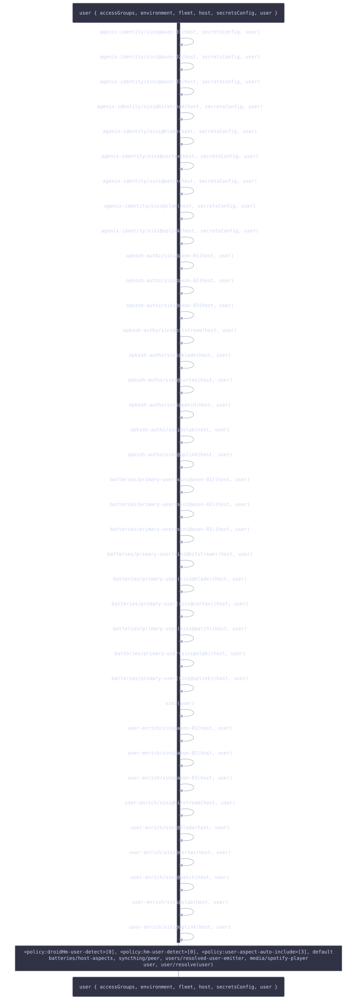

# Scope Sequence: sini

```mermaid
%%{init: {"theme":"base","themeVariables":{"activationBkgColor":"#313244","activationBorderColor":"#6c7086","actorBkg":"#313244","actorBorder":"#a6adc8","actorLineColor":"#a6adc8","actorTextColor":"#cdd6f4","background":"#1e1e2e","classText":"#cdd6f4","clusterBkg":"#313244","clusterBorder":"#6c7086","edgeLabelBackground":"#1e1e2e","labelBoxBkgColor":"#313244","labelBoxBorderColor":"#a6adc8","labelTextColor":"#cdd6f4","lineColor":"#a6adc8","loopTextColor":"#cdd6f4","mainBkg":"#313244","nodeBkg":"#313244","nodeBorder":"#a6adc8","nodeTextColor":"#cdd6f4","noteBkgColor":"#313244","noteBorderColor":"#6c7086","noteTextColor":"#cdd6f4","pie1":"#f38ba8","pie2":"#fab387","pie3":"#f9e2af","pie4":"#a6e3a1","pie5":"#94e2d5","pie6":"#89b4fa","pie7":"#cba6f7","pie8":"#f2cdcd","pieLegendTextColor":"#cdd6f4","pieOuterStrokeColor":"#6c7086","pieSectionTextColor":"#cdd6f4","pieStrokeColor":"#6c7086","pieTitleTextColor":"#cdd6f4","primaryBorderColor":"#a6adc8","primaryColor":"#313244","primaryTextColor":"#cdd6f4","secondBkg":"#313244","secondaryBorderColor":"#6c7086","secondaryColor":"#313244","secondaryTextColor":"#cdd6f4","sequenceNumberColor":"#1e1e2e","signalColor":"#a6adc8","signalTextColor":"#cdd6f4","tertiaryBorderColor":"#6c7086","tertiaryColor":"#313244","tertiaryTextColor":"#cdd6f4","textColor":"#cdd6f4","titleColor":"#cdd6f4"}}}%%
sequenceDiagram
    participant user as user { accessGroups, environment, fleet, host, secretsConfig, user }


    activate user
    user ->> user: agenix-identity/sini@axon-01(host, secretsConfig, user)
    user ->> user: agenix-identity/sini@axon-02(host, secretsConfig, user)
    user ->> user: agenix-identity/sini@axon-03(host, secretsConfig, user)
    user ->> user: agenix-identity/sini@bitstream(host, secretsConfig, user)
    user ->> user: agenix-identity/sini@blade(host, secretsConfig, user)
    user ->> user: agenix-identity/sini@cortex(host, secretsConfig, user)
    user ->> user: agenix-identity/sini@patch(host, secretsConfig, user)
    user ->> user: agenix-identity/sini@slab(host, secretsConfig, user)
    user ->> user: agenix-identity/sini@uplink(host, secretsConfig, user)
    user ->> user: opkssh-authz/sini@axon-01(host, user)
    user ->> user: opkssh-authz/sini@axon-02(host, user)
    user ->> user: opkssh-authz/sini@axon-03(host, user)
    user ->> user: opkssh-authz/sini@bitstream(host, user)
    user ->> user: opkssh-authz/sini@blade(host, user)
    user ->> user: opkssh-authz/sini@cortex(host, user)
    user ->> user: opkssh-authz/sini@patch(host, user)
    user ->> user: opkssh-authz/sini@slab(host, user)
    user ->> user: opkssh-authz/sini@uplink(host, user)
    user ->> user: batteries/primary-user(sini@axon-01)(host, user)
    user ->> user: batteries/primary-user(sini@axon-02)(host, user)
    user ->> user: batteries/primary-user(sini@axon-03)(host, user)
    user ->> user: batteries/primary-user(sini@bitstream)(host, user)
    user ->> user: batteries/primary-user(sini@blade)(host, user)
    user ->> user: batteries/primary-user(sini@cortex)(host, user)
    user ->> user: batteries/primary-user(sini@patch)(host, user)
    user ->> user: batteries/primary-user(sini@slab)(host, user)
    user ->> user: batteries/primary-user(sini@uplink)(host, user)
    user ->> user: sini(user)
    user ->> user: user-enrich/sini@axon-01(host, user)
    user ->> user: user-enrich/sini@axon-02(host, user)
    user ->> user: user-enrich/sini@axon-03(host, user)
    user ->> user: user-enrich/sini@bitstream(host, user)
    user ->> user: user-enrich/sini@blade(host, user)
    user ->> user: user-enrich/sini@cortex(host, user)
    user ->> user: user-enrich/sini@patch(host, user)
    user ->> user: user-enrich/sini@slab(host, user)
    user ->> user: user-enrich/sini@uplink(host, user)
    deactivate user
    Note over user: <policy:droidHm-user-detect>[0], <policy:hm-user-detect>[0], <policy:user-aspect-auto-include>[3], default<br/>batteries/host-aspects, syncthing/peer, users/resolved-user-emitter, media/spotify-player<br/>user, user/resolve(user)
```
