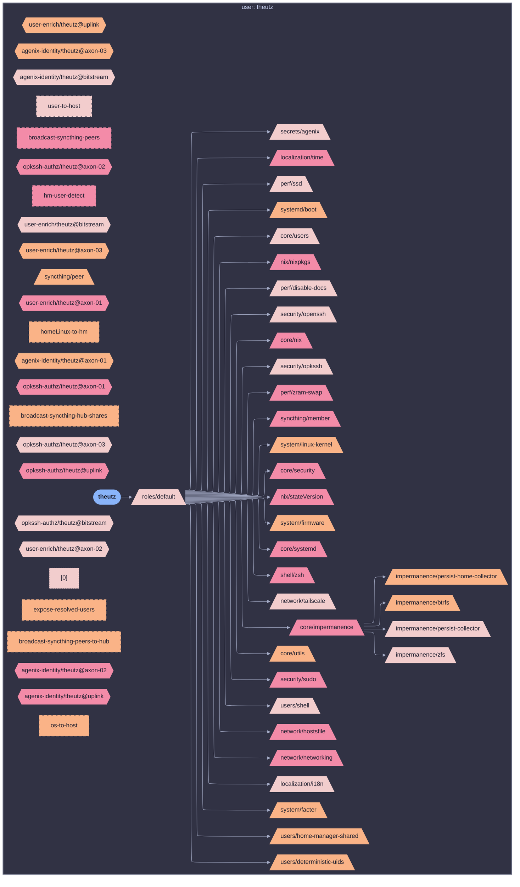

# Aspect Hierarchy: theutz

```mermaid
%%{init: {"elk":{"mergeEdges":true,"nodePlacementStrategy":"BRANDES_KOEPF"},"flowchart":{"wrappingWidth":600},"layout":"elk","theme":"base","themeVariables":{"activationBkgColor":"#313244","activationBorderColor":"#6c7086","actorBkg":"#313244","actorBorder":"#a6adc8","actorLineColor":"#a6adc8","actorTextColor":"#cdd6f4","background":"#1e1e2e","classText":"#cdd6f4","clusterBkg":"#313244","clusterBorder":"#6c7086","edgeLabelBackground":"#1e1e2e","labelBoxBkgColor":"#313244","labelBoxBorderColor":"#a6adc8","labelTextColor":"#cdd6f4","lineColor":"#a6adc8","loopTextColor":"#cdd6f4","mainBkg":"#313244","nodeBkg":"#313244","nodeBorder":"#a6adc8","nodeTextColor":"#cdd6f4","noteBkgColor":"#313244","noteBorderColor":"#6c7086","noteTextColor":"#cdd6f4","pie1":"#f38ba8","pie2":"#fab387","pie3":"#f9e2af","pie4":"#a6e3a1","pie5":"#94e2d5","pie6":"#89b4fa","pie7":"#cba6f7","pie8":"#f2cdcd","pieLegendTextColor":"#cdd6f4","pieOuterStrokeColor":"#6c7086","pieSectionTextColor":"#cdd6f4","pieStrokeColor":"#6c7086","pieTitleTextColor":"#cdd6f4","primaryBorderColor":"#a6adc8","primaryColor":"#313244","primaryTextColor":"#cdd6f4","secondBkg":"#313244","secondaryBorderColor":"#6c7086","secondaryColor":"#313244","secondaryTextColor":"#cdd6f4","sequenceNumberColor":"#1e1e2e","signalColor":"#a6adc8","signalTextColor":"#cdd6f4","tertiaryBorderColor":"#6c7086","tertiaryColor":"#313244","tertiaryTextColor":"#cdd6f4","textColor":"#cdd6f4","titleColor":"#cdd6f4"}}}%%
graph LR
  theutz([theutz]):::root

  subgraph ctx_user_theutz["user: theutz"]
  _policy_hm_user_detect__0_["<policy:hm-user-detect>[0]"]:::_policy_hm_user_detect__0__c
  secrets__agenix[/"secrets/agenix"\]:::secrets__agenix_c
  agenix_identity__theutz_axon_01{{"agenix-identity/theutz@axon-01"}}:::agenix_identity__theutz_axon_01_c
  agenix_identity__theutz_axon_02{{"agenix-identity/theutz@axon-02"}}:::agenix_identity__theutz_axon_02_c
  agenix_identity__theutz_axon_03{{"agenix-identity/theutz@axon-03"}}:::agenix_identity__theutz_axon_03_c
  agenix_identity__theutz_bitstream{{"agenix-identity/theutz@bitstream"}}:::agenix_identity__theutz_bitstream_c
  agenix_identity__theutz_uplink{{"agenix-identity/theutz@uplink"}}:::agenix_identity__theutz_uplink_c
  core__systemd__boot[/"systemd/boot"\]:::core__systemd__boot_c
  broadcast_syncthing_hub_shares["broadcast-syncthing-hub-shares"]:::broadcast_syncthing_hub_shares_c
  broadcast_syncthing_peers["broadcast-syncthing-peers"]:::broadcast_syncthing_peers_c
  broadcast_syncthing_peers_to_hub["broadcast-syncthing-peers-to-hub"]:::broadcast_syncthing_peers_to_hub_c
  core__impermanence__btrfs[/"impermanence/btrfs"\]:::core__impermanence__btrfs_c
  roles__default[/"roles/default"\]:::roles__default_c
  core__users__deterministic_uids[/"users/deterministic-uids"\]:::core__users__deterministic_uids_c
  core__perf__disable_docs[/"perf/disable-docs"\]:::core__perf__disable_docs_c
  expose_resolved_users["expose-resolved-users"]:::expose_resolved_users_c
  core__system__facter[/"system/facter"\]:::core__system__facter_c
  core__system__firmware[/"system/firmware"\]:::core__system__firmware_c
  hm_user_detect["hm-user-detect"]:::hm_user_detect_c
  core__users__home_manager_shared[/"users/home-manager-shared"\]:::core__users__home_manager_shared_c
  homeLinux_to_hm["homeLinux-to-hm"]:::homeLinux_to_hm_c
  core__network__hostsfile[/"network/hostsfile"\]:::core__network__hostsfile_c
  core__localization__i18n[/"localization/i18n"\]:::core__localization__i18n_c
  core__impermanence[/"core/impermanence"\]:::core__impermanence_c
  core__system__linux_kernel[/"system/linux-kernel"\]:::core__system__linux_kernel_c
  core__network__syncthing__member[/"syncthing/member"\]:::core__network__syncthing__member_c
  core__network__networking[/"network/networking"\]:::core__network__networking_c
  core__nix[/"core/nix"\]:::core__nix_c
  core__nix__nixpkgs[/"nix/nixpkgs"\]:::core__nix__nixpkgs_c
  core__security__openssh[/"security/openssh"\]:::core__security__openssh_c
  core__security__opkssh[/"security/opkssh"\]:::core__security__opkssh_c
  opkssh_authz__theutz_axon_01{{"opkssh-authz/theutz@axon-01"}}:::opkssh_authz__theutz_axon_01_c
  opkssh_authz__theutz_axon_02{{"opkssh-authz/theutz@axon-02"}}:::opkssh_authz__theutz_axon_02_c
  opkssh_authz__theutz_axon_03{{"opkssh-authz/theutz@axon-03"}}:::opkssh_authz__theutz_axon_03_c
  opkssh_authz__theutz_bitstream{{"opkssh-authz/theutz@bitstream"}}:::opkssh_authz__theutz_bitstream_c
  opkssh_authz__theutz_uplink{{"opkssh-authz/theutz@uplink"}}:::opkssh_authz__theutz_uplink_c
  os_to_host["os-to-host"]:::os_to_host_c
  core__network__syncthing__peer[/"syncthing/peer"\]:::core__network__syncthing__peer_c
  core__impermanence__persist_collector[/"impermanence/persist-collector"\]:::core__impermanence__persist_collector_c
  core__impermanence__persist_home_collector[/"impermanence/persist-home-collector"\]:::core__impermanence__persist_home_collector_c
  core__security[/"core/security"\]:::core__security_c
  core__users__shell[/"users/shell"\]:::core__users__shell_c
  core__perf__ssd[/"perf/ssd"\]:::core__perf__ssd_c
  core__nix__stateVersion[/"nix/stateVersion"\]:::core__nix__stateVersion_c
  core__security__sudo[/"security/sudo"\]:::core__security__sudo_c
  core__systemd[/"core/systemd"\]:::core__systemd_c
  core__network__tailscale[/"network/tailscale"\]:::core__network__tailscale_c
  core__localization__time[/"localization/time"\]:::core__localization__time_c
  user_enrich__theutz_axon_01{{"user-enrich/theutz@axon-01"}}:::user_enrich__theutz_axon_01_c
  user_enrich__theutz_axon_02{{"user-enrich/theutz@axon-02"}}:::user_enrich__theutz_axon_02_c
  user_enrich__theutz_axon_03{{"user-enrich/theutz@axon-03"}}:::user_enrich__theutz_axon_03_c
  user_enrich__theutz_bitstream{{"user-enrich/theutz@bitstream"}}:::user_enrich__theutz_bitstream_c
  user_enrich__theutz_uplink{{"user-enrich/theutz@uplink"}}:::user_enrich__theutz_uplink_c
  user_to_host["user-to-host"]:::user_to_host_c
  core__users[/"core/users"\]:::core__users_c
  core__utils[/"core/utils"\]:::core__utils_c
  core__impermanence__zfs[/"impermanence/zfs"\]:::core__impermanence__zfs_c
  core__perf__zram_swap[/"perf/zram-swap"\]:::core__perf__zram_swap_c
  applications__shell__zsh[/"shell/zsh"\]:::applications__shell__zsh_c
  core__impermanence --> core__impermanence__btrfs
  core__impermanence --> core__impermanence__persist_collector
  core__impermanence --> core__impermanence__persist_home_collector
  core__impermanence --> core__impermanence__zfs
  roles__default --> secrets__agenix
  roles__default --> core__systemd__boot
  roles__default --> core__users__deterministic_uids
  roles__default --> core__perf__disable_docs
  roles__default --> core__system__facter
  roles__default --> core__system__firmware
  roles__default --> core__users__home_manager_shared
  roles__default --> core__network__hostsfile
  roles__default --> core__localization__i18n
  roles__default --> core__impermanence
  roles__default --> core__system__linux_kernel
  roles__default --> core__network__syncthing__member
  roles__default --> core__network__networking
  roles__default --> core__nix
  roles__default --> core__nix__nixpkgs
  roles__default --> core__security__openssh
  roles__default --> core__security__opkssh
  roles__default --> core__security
  roles__default --> core__users__shell
  roles__default --> core__perf__ssd
  roles__default --> core__nix__stateVersion
  roles__default --> core__security__sudo
  roles__default --> core__systemd
  roles__default --> core__network__tailscale
  roles__default --> core__localization__time
  roles__default --> core__users
  roles__default --> core__utils
  roles__default --> core__perf__zram_swap
  roles__default --> applications__shell__zsh
  theutz --> roles__default
  end


  classDef root fill:#89b4fa,stroke:#89b4fa,color:#1e1e2e,font-weight:bold
  classDef _policy_hm_user_detect__0__c fill:#f2cdcd,stroke:#f2cdcd,color:#1e1e2e,stroke-dasharray: 3 3,stroke-width:1px
  classDef secrets__agenix_c fill:#f2cdcd,stroke:#f2cdcd,color:#1e1e2e,stroke-width:3px
  classDef agenix_identity__theutz_axon_01_c fill:#fab387,stroke:#fab387,color:#1e1e2e,stroke-width:2px
  classDef agenix_identity__theutz_axon_02_c fill:#f38ba8,stroke:#f38ba8,color:#1e1e2e,stroke-width:2px
  classDef agenix_identity__theutz_axon_03_c fill:#fab387,stroke:#fab387,color:#1e1e2e,stroke-width:2px
  classDef agenix_identity__theutz_bitstream_c fill:#f2cdcd,stroke:#f2cdcd,color:#1e1e2e,stroke-width:2px
  classDef agenix_identity__theutz_uplink_c fill:#f38ba8,stroke:#f38ba8,color:#1e1e2e,stroke-width:2px
  classDef applications_c fill:#fab387,stroke:#fab387,color:#1e1e2e,stroke-dasharray: 3 3,stroke-width:1px
  classDef core__systemd__boot_c fill:#fab387,stroke:#fab387,color:#1e1e2e,stroke-width:3px
  classDef broadcast_syncthing_hub_shares_c fill:#fab387,stroke:#fab387,color:#1e1e2e,stroke-width:2px,stroke-dasharray: 8 4
  classDef broadcast_syncthing_peers_c fill:#f38ba8,stroke:#f38ba8,color:#1e1e2e,stroke-width:2px,stroke-dasharray: 8 4
  classDef broadcast_syncthing_peers_to_hub_c fill:#fab387,stroke:#fab387,color:#1e1e2e,stroke-width:2px,stroke-dasharray: 8 4
  classDef core__impermanence__btrfs_c fill:#fab387,stroke:#fab387,color:#1e1e2e,stroke-width:3px
  classDef core_c fill:#f9e2af,stroke:#f9e2af,color:#1e1e2e,stroke-dasharray: 3 3,stroke-width:1px
  classDef roles__default_c fill:#f2cdcd,stroke:#f2cdcd,color:#1e1e2e,stroke-width:3px
  classDef core__users__deterministic_uids_c fill:#fab387,stroke:#fab387,color:#1e1e2e,stroke-width:3px
  classDef core__perf__disable_docs_c fill:#f2cdcd,stroke:#f2cdcd,color:#1e1e2e,stroke-width:3px
  classDef expose_resolved_users_c fill:#fab387,stroke:#fab387,color:#1e1e2e,stroke-width:2px,stroke-dasharray: 8 4
  classDef core__system__facter_c fill:#fab387,stroke:#fab387,color:#1e1e2e,stroke-width:3px
  classDef core__system__firmware_c fill:#fab387,stroke:#fab387,color:#1e1e2e,stroke-width:3px
  classDef hm_user_detect_c fill:#f38ba8,stroke:#f38ba8,color:#1e1e2e,stroke-width:2px,stroke-dasharray: 8 4
  classDef core__users__home_manager_shared_c fill:#fab387,stroke:#fab387,color:#1e1e2e,stroke-width:3px
  classDef homeLinux_to_hm_c fill:#fab387,stroke:#fab387,color:#1e1e2e,stroke-width:2px,stroke-dasharray: 8 4
  classDef core__network__hostsfile_c fill:#f38ba8,stroke:#f38ba8,color:#1e1e2e,stroke-width:3px
  classDef core__localization__i18n_c fill:#f2cdcd,stroke:#f2cdcd,color:#1e1e2e,stroke-width:3px
  classDef core__impermanence_c fill:#f38ba8,stroke:#f38ba8,color:#1e1e2e,stroke-width:3px
  classDef core__system__linux_kernel_c fill:#fab387,stroke:#fab387,color:#1e1e2e,stroke-width:3px
  classDef core__network__syncthing__member_c fill:#f38ba8,stroke:#f38ba8,color:#1e1e2e,stroke-width:3px
  classDef core__network__networking_c fill:#f38ba8,stroke:#f38ba8,color:#1e1e2e,stroke-width:3px
  classDef core__nix_c fill:#f38ba8,stroke:#f38ba8,color:#1e1e2e,stroke-width:3px
  classDef core__nix__nixpkgs_c fill:#f38ba8,stroke:#f38ba8,color:#1e1e2e,stroke-width:3px
  classDef core__security__openssh_c fill:#f2cdcd,stroke:#f2cdcd,color:#1e1e2e,stroke-width:3px
  classDef core__security__opkssh_c fill:#f2cdcd,stroke:#f2cdcd,color:#1e1e2e,stroke-width:3px
  classDef opkssh_authz__theutz_axon_01_c fill:#f38ba8,stroke:#f38ba8,color:#1e1e2e,stroke-width:2px
  classDef opkssh_authz__theutz_axon_02_c fill:#f38ba8,stroke:#f38ba8,color:#1e1e2e,stroke-width:2px
  classDef opkssh_authz__theutz_axon_03_c fill:#f2cdcd,stroke:#f2cdcd,color:#1e1e2e,stroke-width:2px
  classDef opkssh_authz__theutz_bitstream_c fill:#f2cdcd,stroke:#f2cdcd,color:#1e1e2e,stroke-width:2px
  classDef opkssh_authz__theutz_uplink_c fill:#f38ba8,stroke:#f38ba8,color:#1e1e2e,stroke-width:2px
  classDef os_to_host_c fill:#fab387,stroke:#fab387,color:#1e1e2e,stroke-width:2px,stroke-dasharray: 8 4
  classDef core__network__syncthing__peer_c fill:#fab387,stroke:#fab387,color:#1e1e2e,stroke-width:2px
  classDef core__impermanence__persist_collector_c fill:#f2cdcd,stroke:#f2cdcd,color:#1e1e2e,stroke-width:3px
  classDef core__impermanence__persist_home_collector_c fill:#fab387,stroke:#fab387,color:#1e1e2e,stroke-width:3px
  classDef roles_c fill:#a6e3a1,stroke:#a6e3a1,color:#1e1e2e,stroke-dasharray: 3 3,stroke-width:1px
  classDef secrets_c fill:#f9e2af,stroke:#f9e2af,color:#1e1e2e,stroke-dasharray: 3 3,stroke-width:1px
  classDef core__security_c fill:#f38ba8,stroke:#f38ba8,color:#1e1e2e,stroke-width:3px
  classDef core__users__shell_c fill:#f2cdcd,stroke:#f2cdcd,color:#1e1e2e,stroke-width:3px
  classDef core__perf__ssd_c fill:#f2cdcd,stroke:#f2cdcd,color:#1e1e2e,stroke-width:3px
  classDef core__nix__stateVersion_c fill:#f38ba8,stroke:#f38ba8,color:#1e1e2e,stroke-width:3px
  classDef core__security__sudo_c fill:#f38ba8,stroke:#f38ba8,color:#1e1e2e,stroke-width:3px
  classDef core__systemd_c fill:#f38ba8,stroke:#f38ba8,color:#1e1e2e,stroke-width:3px
  classDef core__network__tailscale_c fill:#f2cdcd,stroke:#f2cdcd,color:#1e1e2e,stroke-width:3px
  classDef theutz_c fill:#f2cdcd,stroke:#f2cdcd,color:#1e1e2e,stroke-width:3px
  classDef core__localization__time_c fill:#f38ba8,stroke:#f38ba8,color:#1e1e2e,stroke-width:3px
  classDef user_enrich__theutz_axon_01_c fill:#f38ba8,stroke:#f38ba8,color:#1e1e2e,stroke-width:2px
  classDef user_enrich__theutz_axon_02_c fill:#f2cdcd,stroke:#f2cdcd,color:#1e1e2e,stroke-width:2px
  classDef user_enrich__theutz_axon_03_c fill:#fab387,stroke:#fab387,color:#1e1e2e,stroke-width:2px
  classDef user_enrich__theutz_bitstream_c fill:#f2cdcd,stroke:#f2cdcd,color:#1e1e2e,stroke-width:2px
  classDef user_enrich__theutz_uplink_c fill:#fab387,stroke:#fab387,color:#1e1e2e,stroke-width:2px
  classDef user_to_host_c fill:#f2cdcd,stroke:#f2cdcd,color:#1e1e2e,stroke-width:2px,stroke-dasharray: 8 4
  classDef core__users_c fill:#f2cdcd,stroke:#f2cdcd,color:#1e1e2e,stroke-width:3px
  classDef core__utils_c fill:#fab387,stroke:#fab387,color:#1e1e2e,stroke-width:3px
  classDef core__impermanence__zfs_c fill:#f2cdcd,stroke:#f2cdcd,color:#1e1e2e,stroke-width:3px
  classDef core__perf__zram_swap_c fill:#f38ba8,stroke:#f38ba8,color:#1e1e2e,stroke-width:3px
  classDef applications__shell__zsh_c fill:#f38ba8,stroke:#f38ba8,color:#1e1e2e,stroke-width:3px
style ctx_user_theutz fill:#313244,stroke:#6c7086,stroke-width:2px
```
