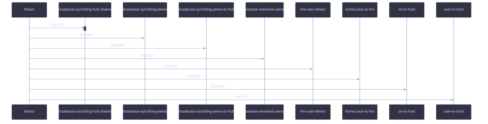

# Policy Sequence: theutz

```mermaid
%%{init: {"theme":"base","themeVariables":{"activationBkgColor":"#313244","activationBorderColor":"#6c7086","actorBkg":"#313244","actorBorder":"#a6adc8","actorLineColor":"#a6adc8","actorTextColor":"#cdd6f4","background":"#1e1e2e","classText":"#cdd6f4","clusterBkg":"#313244","clusterBorder":"#6c7086","edgeLabelBackground":"#1e1e2e","labelBoxBkgColor":"#313244","labelBoxBorderColor":"#a6adc8","labelTextColor":"#cdd6f4","lineColor":"#a6adc8","loopTextColor":"#cdd6f4","mainBkg":"#313244","nodeBkg":"#313244","nodeBorder":"#a6adc8","nodeTextColor":"#cdd6f4","noteBkgColor":"#313244","noteBorderColor":"#6c7086","noteTextColor":"#cdd6f4","pie1":"#f38ba8","pie2":"#fab387","pie3":"#f9e2af","pie4":"#a6e3a1","pie5":"#94e2d5","pie6":"#89b4fa","pie7":"#cba6f7","pie8":"#f2cdcd","pieLegendTextColor":"#cdd6f4","pieOuterStrokeColor":"#6c7086","pieSectionTextColor":"#cdd6f4","pieStrokeColor":"#6c7086","pieTitleTextColor":"#cdd6f4","primaryBorderColor":"#a6adc8","primaryColor":"#313244","primaryTextColor":"#cdd6f4","secondBkg":"#313244","secondaryBorderColor":"#6c7086","secondaryColor":"#313244","secondaryTextColor":"#cdd6f4","sequenceNumberColor":"#1e1e2e","signalColor":"#a6adc8","signalTextColor":"#cdd6f4","tertiaryBorderColor":"#6c7086","tertiaryColor":"#313244","tertiaryTextColor":"#cdd6f4","textColor":"#cdd6f4","titleColor":"#cdd6f4"}}}%%
sequenceDiagram
    participant root as theutz
    participant broadcast_syncthing_hub_shares as broadcast-syncthing-hub-shares
    participant broadcast_syncthing_peers as broadcast-syncthing-peers
    participant broadcast_syncthing_peers_to_hub as broadcast-syncthing-peers-to-hub
    participant expose_resolved_users as expose-resolved-users
    participant hm_user_detect as hm-user-detect
    participant homeLinux_to_hm as homeLinux-to-hm
    participant os_to_host as os-to-host
    participant user_to_host as user-to-host

    root ->> broadcast_syncthing_hub_shares: dispatch
    activate broadcast_syncthing_hub_shares
    deactivate broadcast_syncthing_hub_shares

    root ->> broadcast_syncthing_peers: dispatch

    root ->> broadcast_syncthing_peers_to_hub: dispatch

    root ->> expose_resolved_users: dispatch

    root ->> hm_user_detect: dispatch

    root ->> homeLinux_to_hm: dispatch

    root ->> os_to_host: dispatch

    root ->> user_to_host: dispatch
```
