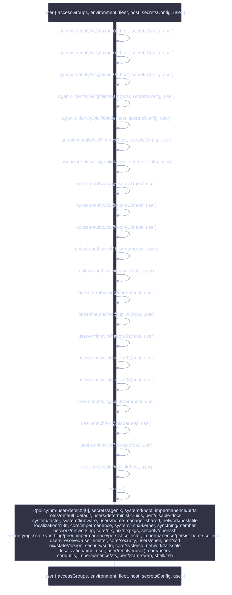

# Scope Sequence: vic

```mermaid
%%{init: {"theme":"base","themeVariables":{"activationBkgColor":"#313244","activationBorderColor":"#6c7086","actorBkg":"#313244","actorBorder":"#a6adc8","actorLineColor":"#a6adc8","actorTextColor":"#cdd6f4","background":"#1e1e2e","classText":"#cdd6f4","clusterBkg":"#313244","clusterBorder":"#6c7086","edgeLabelBackground":"#1e1e2e","labelBoxBkgColor":"#313244","labelBoxBorderColor":"#a6adc8","labelTextColor":"#cdd6f4","lineColor":"#a6adc8","loopTextColor":"#cdd6f4","mainBkg":"#313244","nodeBkg":"#313244","nodeBorder":"#a6adc8","nodeTextColor":"#cdd6f4","noteBkgColor":"#313244","noteBorderColor":"#6c7086","noteTextColor":"#cdd6f4","pie1":"#f38ba8","pie2":"#fab387","pie3":"#f9e2af","pie4":"#a6e3a1","pie5":"#94e2d5","pie6":"#89b4fa","pie7":"#cba6f7","pie8":"#f2cdcd","pieLegendTextColor":"#cdd6f4","pieOuterStrokeColor":"#6c7086","pieSectionTextColor":"#cdd6f4","pieStrokeColor":"#6c7086","pieTitleTextColor":"#cdd6f4","primaryBorderColor":"#a6adc8","primaryColor":"#313244","primaryTextColor":"#cdd6f4","secondBkg":"#313244","secondaryBorderColor":"#6c7086","secondaryColor":"#313244","secondaryTextColor":"#cdd6f4","sequenceNumberColor":"#1e1e2e","signalColor":"#a6adc8","signalTextColor":"#cdd6f4","tertiaryBorderColor":"#6c7086","tertiaryColor":"#313244","tertiaryTextColor":"#cdd6f4","textColor":"#cdd6f4","titleColor":"#cdd6f4"}}}%%
sequenceDiagram
    participant user as user { accessGroups, environment, fleet, host, secretsConfig, user }


    activate user
    user ->> user: agenix-identity/vic@axon-01(host, secretsConfig, user)
    user ->> user: agenix-identity/vic@axon-02(host, secretsConfig, user)
    user ->> user: agenix-identity/vic@axon-03(host, secretsConfig, user)
    user ->> user: agenix-identity/vic@bitstream(host, secretsConfig, user)
    user ->> user: agenix-identity/vic@blade(host, secretsConfig, user)
    user ->> user: agenix-identity/vic@cortex(host, secretsConfig, user)
    user ->> user: agenix-identity/vic@uplink(host, secretsConfig, user)
    user ->> user: opkssh-authz/vic@axon-01(host, user)
    user ->> user: opkssh-authz/vic@axon-02(host, user)
    user ->> user: opkssh-authz/vic@axon-03(host, user)
    user ->> user: opkssh-authz/vic@bitstream(host, user)
    user ->> user: opkssh-authz/vic@blade(host, user)
    user ->> user: opkssh-authz/vic@cortex(host, user)
    user ->> user: opkssh-authz/vic@uplink(host, user)
    user ->> user: user-enrich/vic@axon-01(host, user)
    user ->> user: user-enrich/vic@axon-02(host, user)
    user ->> user: user-enrich/vic@axon-03(host, user)
    user ->> user: user-enrich/vic@bitstream(host, user)
    user ->> user: user-enrich/vic@blade(host, user)
    user ->> user: user-enrich/vic@cortex(host, user)
    user ->> user: user-enrich/vic@uplink(host, user)
    user ->> user: vic(user)
    deactivate user
    Note over user: <policy:hm-user-detect>[0], secrets/agenix, systemd/boot, impermanence/btrfs<br/>roles/default, default, users/deterministic-uids, perf/disable-docs<br/>system/facter, system/firmware, users/home-manager-shared, network/hostsfile<br/>localization/i18n, core/impermanence, system/linux-kernel, syncthing/member<br/>network/networking, core/nix, nix/nixpkgs, security/openssh<br/>security/opkssh, syncthing/peer, impermanence/persist-collector, impermanence/persist-home-collector<br/>users/resolved-user-emitter, core/security, users/shell, perf/ssd<br/>nix/stateVersion, security/sudo, core/systemd, network/tailscale<br/>localization/time, user, user/resolve(user), core/users<br/>core/utils, impermanence/zfs, perf/zram-swap, shell/zsh
```
