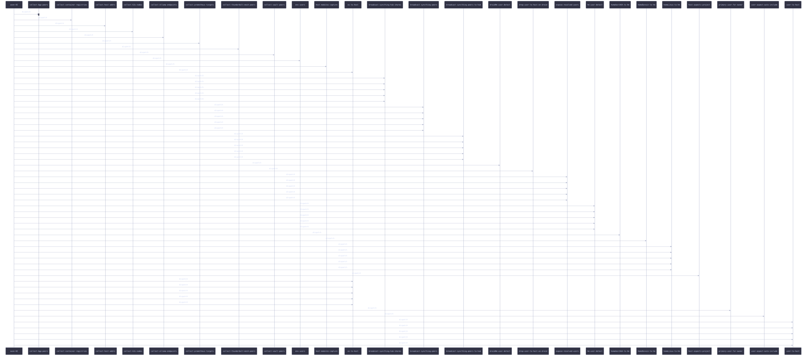

# Policy Sequence: axon-02

```mermaid
%%{init: {"theme":"base","themeVariables":{"activationBkgColor":"#313244","activationBorderColor":"#6c7086","actorBkg":"#313244","actorBorder":"#a6adc8","actorLineColor":"#a6adc8","actorTextColor":"#cdd6f4","background":"#1e1e2e","classText":"#cdd6f4","clusterBkg":"#313244","clusterBorder":"#6c7086","edgeLabelBackground":"#1e1e2e","labelBoxBkgColor":"#313244","labelBoxBorderColor":"#a6adc8","labelTextColor":"#cdd6f4","lineColor":"#a6adc8","loopTextColor":"#cdd6f4","mainBkg":"#313244","nodeBkg":"#313244","nodeBorder":"#a6adc8","nodeTextColor":"#cdd6f4","noteBkgColor":"#313244","noteBorderColor":"#6c7086","noteTextColor":"#cdd6f4","pie1":"#f38ba8","pie2":"#fab387","pie3":"#f9e2af","pie4":"#a6e3a1","pie5":"#94e2d5","pie6":"#89b4fa","pie7":"#cba6f7","pie8":"#f2cdcd","pieLegendTextColor":"#cdd6f4","pieOuterStrokeColor":"#6c7086","pieSectionTextColor":"#cdd6f4","pieStrokeColor":"#6c7086","pieTitleTextColor":"#cdd6f4","primaryBorderColor":"#a6adc8","primaryColor":"#313244","primaryTextColor":"#cdd6f4","secondBkg":"#313244","secondaryBorderColor":"#6c7086","secondaryColor":"#313244","secondaryTextColor":"#cdd6f4","sequenceNumberColor":"#1e1e2e","signalColor":"#a6adc8","signalTextColor":"#cdd6f4","tertiaryBorderColor":"#6c7086","tertiaryColor":"#313244","tertiaryTextColor":"#cdd6f4","textColor":"#cdd6f4","titleColor":"#cdd6f4"}}}%%
sequenceDiagram
    participant root as axon-02
    participant collect_bgp_peers as collect-bgp-peers
    participant collect_container_registries as collect-container-registries
    participant collect_host_addrs as collect-host-addrs
    participant collect_k3s_nodes as collect-k3s-nodes
    participant collect_ollama_endpoints as collect-ollama-endpoints
    participant collect_prometheus_targets as collect-prometheus-targets
    participant collect_thunderbolt_mesh_peers as collect-thunderbolt-mesh-peers
    participant collect_vault_peers as collect-vault-peers
    participant env_users as env-users
    participant host_modules_capture as host-modules-capture
    participant os_to_host as os-to-host
    participant broadcast_syncthing_hub_shares as broadcast-syncthing-hub-shares
    participant broadcast_syncthing_hub_shares as broadcast-syncthing-hub-shares
    participant broadcast_syncthing_hub_shares as broadcast-syncthing-hub-shares
    participant broadcast_syncthing_hub_shares as broadcast-syncthing-hub-shares
    participant broadcast_syncthing_hub_shares as broadcast-syncthing-hub-shares
    participant broadcast_syncthing_peers as broadcast-syncthing-peers
    participant broadcast_syncthing_peers as broadcast-syncthing-peers
    participant broadcast_syncthing_peers as broadcast-syncthing-peers
    participant broadcast_syncthing_peers as broadcast-syncthing-peers
    participant broadcast_syncthing_peers as broadcast-syncthing-peers
    participant broadcast_syncthing_peers_to_hub as broadcast-syncthing-peers-to-hub
    participant broadcast_syncthing_peers_to_hub as broadcast-syncthing-peers-to-hub
    participant broadcast_syncthing_peers_to_hub as broadcast-syncthing-peers-to-hub
    participant broadcast_syncthing_peers_to_hub as broadcast-syncthing-peers-to-hub
    participant broadcast_syncthing_peers_to_hub as broadcast-syncthing-peers-to-hub
    participant droidHm_user_detect as droidHm-user-detect
    participant drop_user_to_host_on_droid as drop-user-to-host-on-droid
    participant expose_resolved_users as expose-resolved-users
    participant expose_resolved_users as expose-resolved-users
    participant expose_resolved_users as expose-resolved-users
    participant expose_resolved_users as expose-resolved-users
    participant expose_resolved_users as expose-resolved-users
    participant hm_user_detect as hm-user-detect
    participant hm_user_detect as hm-user-detect
    participant hm_user_detect as hm-user-detect
    participant hm_user_detect as hm-user-detect
    participant hm_user_detect as hm-user-detect
    participant homeAarch64_to_hm as homeAarch64-to-hm
    participant homeDarwin_to_hm as homeDarwin-to-hm
    participant homeLinux_to_hm as homeLinux-to-hm
    participant homeLinux_to_hm as homeLinux-to-hm
    participant homeLinux_to_hm as homeLinux-to-hm
    participant homeLinux_to_hm as homeLinux-to-hm
    participant homeLinux_to_hm as homeLinux-to-hm
    participant host_aspects_project as host-aspects-project
    participant os_to_host as os-to-host
    participant os_to_host as os-to-host
    participant os_to_host as os-to-host
    participant os_to_host as os-to-host
    participant os_to_host as os-to-host
    participant primary_user_for_owner as primary-user-for-owner
    participant user_aspect_auto_include as user-aspect-auto-include
    participant user_to_host as user-to-host
    participant user_to_host as user-to-host
    participant user_to_host as user-to-host
    participant user_to_host as user-to-host
    participant user_to_host as user-to-host

    root ->> collect_bgp_peers: dispatch
    activate collect_bgp_peers
    deactivate collect_bgp_peers

    root ->> collect_container_registries: dispatch

    root ->> collect_host_addrs: dispatch

    root ->> collect_k3s_nodes: dispatch

    root ->> collect_ollama_endpoints: dispatch

    root ->> collect_prometheus_targets: dispatch

    root ->> collect_thunderbolt_mesh_peers: dispatch

    root ->> collect_vault_peers: dispatch

    root ->> env_users: dispatch

    root ->> host_modules_capture: dispatch

    root ->> os_to_host: dispatch

    root ->> broadcast_syncthing_hub_shares: dispatch

    root ->> broadcast_syncthing_hub_shares: dispatch

    root ->> broadcast_syncthing_hub_shares: dispatch

    root ->> broadcast_syncthing_hub_shares: dispatch

    root ->> broadcast_syncthing_hub_shares: dispatch

    root ->> broadcast_syncthing_peers: dispatch

    root ->> broadcast_syncthing_peers: dispatch

    root ->> broadcast_syncthing_peers: dispatch

    root ->> broadcast_syncthing_peers: dispatch

    root ->> broadcast_syncthing_peers: dispatch

    root ->> broadcast_syncthing_peers_to_hub: dispatch

    root ->> broadcast_syncthing_peers_to_hub: dispatch

    root ->> broadcast_syncthing_peers_to_hub: dispatch

    root ->> broadcast_syncthing_peers_to_hub: dispatch

    root ->> broadcast_syncthing_peers_to_hub: dispatch

    root ->> droidHm_user_detect: dispatch

    root ->> drop_user_to_host_on_droid: dispatch

    root ->> expose_resolved_users: dispatch

    root ->> expose_resolved_users: dispatch

    root ->> expose_resolved_users: dispatch

    root ->> expose_resolved_users: dispatch

    root ->> expose_resolved_users: dispatch

    root ->> hm_user_detect: dispatch

    root ->> hm_user_detect: dispatch

    root ->> hm_user_detect: dispatch

    root ->> hm_user_detect: dispatch

    root ->> hm_user_detect: dispatch

    root ->> homeAarch64_to_hm: dispatch

    root ->> homeDarwin_to_hm: dispatch

    root ->> homeLinux_to_hm: dispatch

    root ->> homeLinux_to_hm: dispatch

    root ->> homeLinux_to_hm: dispatch

    root ->> homeLinux_to_hm: dispatch

    root ->> homeLinux_to_hm: dispatch

    root ->> host_aspects_project: dispatch

    root ->> os_to_host: dispatch

    root ->> os_to_host: dispatch

    root ->> os_to_host: dispatch

    root ->> os_to_host: dispatch

    root ->> os_to_host: dispatch

    root ->> primary_user_for_owner: dispatch

    root ->> user_aspect_auto_include: dispatch

    root ->> user_to_host: dispatch

    root ->> user_to_host: dispatch

    root ->> user_to_host: dispatch

    root ->> user_to_host: dispatch

    root ->> user_to_host: dispatch
```
