# Aspect Hierarchy: axon-03



```mermaid
%%{init: {"elk":{"mergeEdges":true,"nodePlacementStrategy":"BRANDES_KOEPF"},"flowchart":{"wrappingWidth":600},"layout":"elk","theme":"base","themeVariables":{"activationBkgColor":"#313244","activationBorderColor":"#6c7086","actorBkg":"#313244","actorBorder":"#a6adc8","actorLineColor":"#a6adc8","actorTextColor":"#cdd6f4","background":"#1e1e2e","classText":"#cdd6f4","clusterBkg":"#313244","clusterBorder":"#6c7086","edgeLabelBackground":"#1e1e2e","labelBoxBkgColor":"#313244","labelBoxBorderColor":"#a6adc8","labelTextColor":"#cdd6f4","lineColor":"#a6adc8","loopTextColor":"#cdd6f4","mainBkg":"#313244","nodeBkg":"#313244","nodeBorder":"#a6adc8","nodeTextColor":"#cdd6f4","noteBkgColor":"#313244","noteBorderColor":"#6c7086","noteTextColor":"#cdd6f4","pie1":"#f38ba8","pie2":"#fab387","pie3":"#f9e2af","pie4":"#a6e3a1","pie5":"#94e2d5","pie6":"#89b4fa","pie7":"#cba6f7","pie8":"#f2cdcd","pieLegendTextColor":"#cdd6f4","pieOuterStrokeColor":"#6c7086","pieSectionTextColor":"#cdd6f4","pieStrokeColor":"#6c7086","pieTitleTextColor":"#cdd6f4","primaryBorderColor":"#a6adc8","primaryColor":"#313244","primaryTextColor":"#cdd6f4","secondBkg":"#313244","secondaryBorderColor":"#6c7086","secondaryColor":"#313244","secondaryTextColor":"#cdd6f4","sequenceNumberColor":"#1e1e2e","signalColor":"#a6adc8","signalTextColor":"#cdd6f4","tertiaryBorderColor":"#6c7086","tertiaryColor":"#313244","tertiaryTextColor":"#cdd6f4","textColor":"#cdd6f4","titleColor":"#cdd6f4"}}}%%
graph LR
  axon_03([axon-03]):::root

  subgraph ctx_user_sini["user: sini"]
  _policy_droidHm_user_detect__0_["<policy:droidHm-user-detect>[0]"]:::_policy_droidHm_user_detect__0__c
  _policy_hm_user_detect__0__user_sini["<policy:hm-user-detect>[0]"]:::_policy_hm_user_detect__0__user_sini_c
  _policy_user_aspect_auto_include__3_["<policy:user-aspect-auto-include>[3]"]:::_policy_user_aspect_auto_include__3__c
  agenix_identity__sini_axon_01{{"agenix-identity/sini@axon-01"}}:::agenix_identity__sini_axon_01_c
  agenix_identity__sini_axon_02{{"agenix-identity/sini@axon-02"}}:::agenix_identity__sini_axon_02_c
  agenix_identity__sini_axon_03{{"agenix-identity/sini@axon-03"}}:::agenix_identity__sini_axon_03_c
  agenix_identity__sini_bitstream{{"agenix-identity/sini@bitstream"}}:::agenix_identity__sini_bitstream_c
  agenix_identity__sini_blade{{"agenix-identity/sini@blade"}}:::agenix_identity__sini_blade_c
  agenix_identity__sini_cortex{{"agenix-identity/sini@cortex"}}:::agenix_identity__sini_cortex_c
  agenix_identity__sini_patch{{"agenix-identity/sini@patch"}}:::agenix_identity__sini_patch_c
  agenix_identity__sini_slab{{"agenix-identity/sini@slab"}}:::agenix_identity__sini_slab_c
  agenix_identity__sini_uplink{{"agenix-identity/sini@uplink"}}:::agenix_identity__sini_uplink_c
  broadcast_syncthing_hub_shares_user_sini["broadcast-syncthing-hub-shares"]:::broadcast_syncthing_hub_shares_user_sini_c
  broadcast_syncthing_peers_user_sini["broadcast-syncthing-peers"]:::broadcast_syncthing_peers_user_sini_c
  broadcast_syncthing_peers_to_hub_user_sini["broadcast-syncthing-peers-to-hub"]:::broadcast_syncthing_peers_to_hub_user_sini_c
  droidHm_user_detect["droidHm-user-detect"]:::droidHm_user_detect_c
  drop_user_to_host_on_droid["drop-user-to-host-on-droid"]:::drop_user_to_host_on_droid_c
  expose_resolved_users_user_sini["expose-resolved-users"]:::expose_resolved_users_user_sini_c
  hm_user_detect_user_sini["hm-user-detect"]:::hm_user_detect_user_sini_c
  homeAarch64_to_hm["homeAarch64-to-hm"]:::homeAarch64_to_hm_c
  homeDarwin_to_hm["homeDarwin-to-hm"]:::homeDarwin_to_hm_c
  homeLinux_to_hm_user_sini["homeLinux-to-hm"]:::homeLinux_to_hm_user_sini_c
  den__batteries__host_aspects[/"batteries/host-aspects"\]:::den__batteries__host_aspects_c
  host_aspects_project["host-aspects-project"]:::host_aspects_project_c
  opkssh_authz__sini_axon_01{{"opkssh-authz/sini@axon-01"}}:::opkssh_authz__sini_axon_01_c
  opkssh_authz__sini_axon_02{{"opkssh-authz/sini@axon-02"}}:::opkssh_authz__sini_axon_02_c
  opkssh_authz__sini_axon_03{{"opkssh-authz/sini@axon-03"}}:::opkssh_authz__sini_axon_03_c
  opkssh_authz__sini_bitstream{{"opkssh-authz/sini@bitstream"}}:::opkssh_authz__sini_bitstream_c
  opkssh_authz__sini_blade{{"opkssh-authz/sini@blade"}}:::opkssh_authz__sini_blade_c
  opkssh_authz__sini_cortex{{"opkssh-authz/sini@cortex"}}:::opkssh_authz__sini_cortex_c
  opkssh_authz__sini_patch{{"opkssh-authz/sini@patch"}}:::opkssh_authz__sini_patch_c
  opkssh_authz__sini_slab{{"opkssh-authz/sini@slab"}}:::opkssh_authz__sini_slab_c
  opkssh_authz__sini_uplink{{"opkssh-authz/sini@uplink"}}:::opkssh_authz__sini_uplink_c
  os_to_host_user_sini["os-to-host"]:::os_to_host_user_sini_c
  core__network__syncthing__peer_user_sini[/"core/network/syncthing/peer"\]:::core__network__syncthing__peer_user_sini_c
  den__batteries__primary_user_sini_axon_01_{{"batteries/primary-user(sini@axon-01)"}}:::den__batteries__primary_user_sini_axon_01__c
  den__batteries__primary_user_sini_axon_02_{{"batteries/primary-user(sini@axon-02)"}}:::den__batteries__primary_user_sini_axon_02__c
  den__batteries__primary_user_sini_axon_03_{{"batteries/primary-user(sini@axon-03)"}}:::den__batteries__primary_user_sini_axon_03__c
  den__batteries__primary_user_sini_bitstream_{{"batteries/primary-user(sini@bitstream)"}}:::den__batteries__primary_user_sini_bitstream__c
  den__batteries__primary_user_sini_blade_{{"batteries/primary-user(sini@blade)"}}:::den__batteries__primary_user_sini_blade__c
  den__batteries__primary_user_sini_cortex_{{"batteries/primary-user(sini@cortex)"}}:::den__batteries__primary_user_sini_cortex__c
  den__batteries__primary_user_sini_patch_{{"batteries/primary-user(sini@patch)"}}:::den__batteries__primary_user_sini_patch__c
  den__batteries__primary_user_sini_slab_{{"batteries/primary-user(sini@slab)"}}:::den__batteries__primary_user_sini_slab__c
  den__batteries__primary_user_sini_uplink_{{"batteries/primary-user(sini@uplink)"}}:::den__batteries__primary_user_sini_uplink__c
  primary_user_for_owner["primary-user-for-owner"]:::primary_user_for_owner_c
  sini{{"sini"}}:::sini_c
  applications__media__spotify_player[/"media/spotify-player"\]:::applications__media__spotify_player_c
  user_aspect_auto_include["user-aspect-auto-include"]:::user_aspect_auto_include_c
  user_enrich__sini_axon_01{{"user-enrich/sini@axon-01"}}:::user_enrich__sini_axon_01_c
  user_enrich__sini_axon_02{{"user-enrich/sini@axon-02"}}:::user_enrich__sini_axon_02_c
  user_enrich__sini_axon_03{{"user-enrich/sini@axon-03"}}:::user_enrich__sini_axon_03_c
  user_enrich__sini_bitstream{{"user-enrich/sini@bitstream"}}:::user_enrich__sini_bitstream_c
  user_enrich__sini_blade{{"user-enrich/sini@blade"}}:::user_enrich__sini_blade_c
  user_enrich__sini_cortex{{"user-enrich/sini@cortex"}}:::user_enrich__sini_cortex_c
  user_enrich__sini_patch{{"user-enrich/sini@patch"}}:::user_enrich__sini_patch_c
  user_enrich__sini_slab{{"user-enrich/sini@slab"}}:::user_enrich__sini_slab_c
  user_enrich__sini_uplink{{"user-enrich/sini@uplink"}}:::user_enrich__sini_uplink_c
  user_to_host_user_sini["user-to-host"]:::user_to_host_user_sini_c
  _policy_user_aspect_auto_include__3_ --> applications__media__spotify_player
  sini --> den__batteries__host_aspects
  end
  subgraph ctx_user_dvicory["user: dvicory"]
  _policy_hm_user_detect__0__user_dvicory["<policy:hm-user-detect>[0]"]:::_policy_hm_user_detect__0__user_dvicory_c
  secrets__agenix_user_dvicory[/"secrets/agenix"\]:::secrets__agenix_user_dvicory_c
  agenix_identity__dvicory_axon_01{{"agenix-identity/dvicory@axon-01"}}:::agenix_identity__dvicory_axon_01_c
  agenix_identity__dvicory_axon_02{{"agenix-identity/dvicory@axon-02"}}:::agenix_identity__dvicory_axon_02_c
  agenix_identity__dvicory_axon_03{{"agenix-identity/dvicory@axon-03"}}:::agenix_identity__dvicory_axon_03_c
  agenix_identity__dvicory_bitstream{{"agenix-identity/dvicory@bitstream"}}:::agenix_identity__dvicory_bitstream_c
  agenix_identity__dvicory_uplink{{"agenix-identity/dvicory@uplink"}}:::agenix_identity__dvicory_uplink_c
  core__systemd__boot_user_dvicory[/"core/systemd/boot"\]:::core__systemd__boot_user_dvicory_c
  broadcast_syncthing_hub_shares_user_dvicory["broadcast-syncthing-hub-shares"]:::broadcast_syncthing_hub_shares_user_dvicory_c
  broadcast_syncthing_peers_user_dvicory["broadcast-syncthing-peers"]:::broadcast_syncthing_peers_user_dvicory_c
  broadcast_syncthing_peers_to_hub_user_dvicory["broadcast-syncthing-peers-to-hub"]:::broadcast_syncthing_peers_to_hub_user_dvicory_c
  core__impermanence__btrfs_user_dvicory[/"core/impermanence/btrfs"\]:::core__impermanence__btrfs_user_dvicory_c
  roles__default_user_dvicory[/"roles/default"\]:::roles__default_user_dvicory_c
  core__users__deterministic_uids_user_dvicory[/"core/users/deterministic-uids"\]:::core__users__deterministic_uids_user_dvicory_c
  core__perf__disable_docs_user_dvicory[/"core/perf/disable-docs"\]:::core__perf__disable_docs_user_dvicory_c
  dvicory{{"dvicory"}}:::dvicory_c
  expose_resolved_users_user_dvicory["expose-resolved-users"]:::expose_resolved_users_user_dvicory_c
  core__system__facter_user_dvicory[/"core/system/facter"\]:::core__system__facter_user_dvicory_c
  core__system__firmware_user_dvicory[/"core/system/firmware"\]:::core__system__firmware_user_dvicory_c
  hm_user_detect_user_dvicory["hm-user-detect"]:::hm_user_detect_user_dvicory_c
  core__users__home_manager_shared_user_dvicory[/"core/users/home-manager-shared"\]:::core__users__home_manager_shared_user_dvicory_c
  homeLinux_to_hm_user_dvicory["homeLinux-to-hm"]:::homeLinux_to_hm_user_dvicory_c
  core__network__hostsfile_user_dvicory[/"core/network/hostsfile"\]:::core__network__hostsfile_user_dvicory_c
  core__localization__i18n_user_dvicory[/"core/localization/i18n"\]:::core__localization__i18n_user_dvicory_c
  core__impermanence_user_dvicory[/"core/impermanence"\]:::core__impermanence_user_dvicory_c
  core__system__linux_kernel_user_dvicory[/"core/system/linux-kernel"\]:::core__system__linux_kernel_user_dvicory_c
  core__network__syncthing__member_user_dvicory[/"core/network/syncthing/member"\]:::core__network__syncthing__member_user_dvicory_c
  core__network__networking_user_dvicory[/"core/network/networking"\]:::core__network__networking_user_dvicory_c
  core__nix_user_dvicory[/"core/nix"\]:::core__nix_user_dvicory_c
  core__nix__nixpkgs_user_dvicory[/"core/nix/nixpkgs"\]:::core__nix__nixpkgs_user_dvicory_c
  core__security__openssh_user_dvicory[/"core/security/openssh"\]:::core__security__openssh_user_dvicory_c
  core__security__opkssh_user_dvicory[/"core/security/opkssh"\]:::core__security__opkssh_user_dvicory_c
  opkssh_authz__dvicory_axon_01{{"opkssh-authz/dvicory@axon-01"}}:::opkssh_authz__dvicory_axon_01_c
  opkssh_authz__dvicory_axon_02{{"opkssh-authz/dvicory@axon-02"}}:::opkssh_authz__dvicory_axon_02_c
  opkssh_authz__dvicory_axon_03{{"opkssh-authz/dvicory@axon-03"}}:::opkssh_authz__dvicory_axon_03_c
  opkssh_authz__dvicory_bitstream{{"opkssh-authz/dvicory@bitstream"}}:::opkssh_authz__dvicory_bitstream_c
  opkssh_authz__dvicory_uplink{{"opkssh-authz/dvicory@uplink"}}:::opkssh_authz__dvicory_uplink_c
  os_to_host_user_dvicory["os-to-host"]:::os_to_host_user_dvicory_c
  core__network__syncthing__peer_user_dvicory[/"core/network/syncthing/peer"\]:::core__network__syncthing__peer_user_dvicory_c
  core__impermanence__persist_collector_user_dvicory[/"core/impermanence/persist-collector"\]:::core__impermanence__persist_collector_user_dvicory_c
  core__impermanence__persist_home_collector_user_dvicory[/"core/impermanence/persist-home-collector"\]:::core__impermanence__persist_home_collector_user_dvicory_c
  core__security_user_dvicory[/"core/security"\]:::core__security_user_dvicory_c
  core__users__shell_user_dvicory[/"core/users/shell"\]:::core__users__shell_user_dvicory_c
  core__perf__ssd_user_dvicory[/"core/perf/ssd"\]:::core__perf__ssd_user_dvicory_c
  core__nix__stateVersion_user_dvicory[/"core/nix/stateVersion"\]:::core__nix__stateVersion_user_dvicory_c
  core__security__sudo_user_dvicory[/"core/security/sudo"\]:::core__security__sudo_user_dvicory_c
  core__systemd_user_dvicory[/"core/systemd"\]:::core__systemd_user_dvicory_c
  core__network__tailscale_user_dvicory[/"core/network/tailscale"\]:::core__network__tailscale_user_dvicory_c
  core__localization__time_user_dvicory[/"core/localization/time"\]:::core__localization__time_user_dvicory_c
  user_enrich__dvicory_axon_01{{"user-enrich/dvicory@axon-01"}}:::user_enrich__dvicory_axon_01_c
  user_enrich__dvicory_axon_02{{"user-enrich/dvicory@axon-02"}}:::user_enrich__dvicory_axon_02_c
  user_enrich__dvicory_axon_03{{"user-enrich/dvicory@axon-03"}}:::user_enrich__dvicory_axon_03_c
  user_enrich__dvicory_bitstream{{"user-enrich/dvicory@bitstream"}}:::user_enrich__dvicory_bitstream_c
  user_enrich__dvicory_uplink{{"user-enrich/dvicory@uplink"}}:::user_enrich__dvicory_uplink_c
  user_to_host_user_dvicory["user-to-host"]:::user_to_host_user_dvicory_c
  core__users_user_dvicory[/"core/users"\]:::core__users_user_dvicory_c
  core__utils_user_dvicory[/"core/utils"\]:::core__utils_user_dvicory_c
  core__impermanence__zfs_user_dvicory[/"core/impermanence/zfs"\]:::core__impermanence__zfs_user_dvicory_c
  core__perf__zram_swap_user_dvicory[/"core/perf/zram-swap"\]:::core__perf__zram_swap_user_dvicory_c
  applications__shell__zsh_user_dvicory[/"applications/shell/zsh"\]:::applications__shell__zsh_user_dvicory_c
  core__impermanence_user_dvicory --> core__impermanence__btrfs_user_dvicory
  core__impermanence_user_dvicory --> core__impermanence__persist_collector_user_dvicory
  core__impermanence_user_dvicory --> core__impermanence__persist_home_collector_user_dvicory
  core__impermanence_user_dvicory --> core__impermanence__zfs_user_dvicory
  dvicory --> roles__default_user_dvicory
  roles__default_user_dvicory --> secrets__agenix_user_dvicory
  roles__default_user_dvicory --> core__systemd__boot_user_dvicory
  roles__default_user_dvicory --> core__users__deterministic_uids_user_dvicory
  roles__default_user_dvicory --> core__perf__disable_docs_user_dvicory
  roles__default_user_dvicory --> core__system__facter_user_dvicory
  roles__default_user_dvicory --> core__system__firmware_user_dvicory
  roles__default_user_dvicory --> core__users__home_manager_shared_user_dvicory
  roles__default_user_dvicory --> core__network__hostsfile_user_dvicory
  roles__default_user_dvicory --> core__localization__i18n_user_dvicory
  roles__default_user_dvicory --> core__impermanence_user_dvicory
  roles__default_user_dvicory --> core__system__linux_kernel_user_dvicory
  roles__default_user_dvicory --> core__network__syncthing__member_user_dvicory
  roles__default_user_dvicory --> core__network__networking_user_dvicory
  roles__default_user_dvicory --> core__nix_user_dvicory
  roles__default_user_dvicory --> core__nix__nixpkgs_user_dvicory
  roles__default_user_dvicory --> core__security__openssh_user_dvicory
  roles__default_user_dvicory --> core__security__opkssh_user_dvicory
  roles__default_user_dvicory --> core__security_user_dvicory
  roles__default_user_dvicory --> core__users__shell_user_dvicory
  roles__default_user_dvicory --> core__perf__ssd_user_dvicory
  roles__default_user_dvicory --> core__nix__stateVersion_user_dvicory
  roles__default_user_dvicory --> core__security__sudo_user_dvicory
  roles__default_user_dvicory --> core__systemd_user_dvicory
  roles__default_user_dvicory --> core__network__tailscale_user_dvicory
  roles__default_user_dvicory --> core__localization__time_user_dvicory
  roles__default_user_dvicory --> core__users_user_dvicory
  roles__default_user_dvicory --> core__utils_user_dvicory
  roles__default_user_dvicory --> core__perf__zram_swap_user_dvicory
  roles__default_user_dvicory --> applications__shell__zsh_user_dvicory
  end
  subgraph ctx_user_pol["user: pol"]
  _policy_hm_user_detect__0__user_pol["<policy:hm-user-detect>[0]"]:::_policy_hm_user_detect__0__user_pol_c
  secrets__agenix_user_pol[/"secrets/agenix"\]:::secrets__agenix_user_pol_c
  agenix_identity__pol_axon_01{{"agenix-identity/pol@axon-01"}}:::agenix_identity__pol_axon_01_c
  agenix_identity__pol_axon_02{{"agenix-identity/pol@axon-02"}}:::agenix_identity__pol_axon_02_c
  agenix_identity__pol_axon_03{{"agenix-identity/pol@axon-03"}}:::agenix_identity__pol_axon_03_c
  agenix_identity__pol_bitstream{{"agenix-identity/pol@bitstream"}}:::agenix_identity__pol_bitstream_c
  agenix_identity__pol_uplink{{"agenix-identity/pol@uplink"}}:::agenix_identity__pol_uplink_c
  core__systemd__boot_user_pol[/"core/systemd/boot"\]:::core__systemd__boot_user_pol_c
  broadcast_syncthing_hub_shares_user_pol["broadcast-syncthing-hub-shares"]:::broadcast_syncthing_hub_shares_user_pol_c
  broadcast_syncthing_peers_user_pol["broadcast-syncthing-peers"]:::broadcast_syncthing_peers_user_pol_c
  broadcast_syncthing_peers_to_hub_user_pol["broadcast-syncthing-peers-to-hub"]:::broadcast_syncthing_peers_to_hub_user_pol_c
  core__impermanence__btrfs_user_pol[/"core/impermanence/btrfs"\]:::core__impermanence__btrfs_user_pol_c
  roles__default_user_pol[/"roles/default"\]:::roles__default_user_pol_c
  core__users__deterministic_uids_user_pol[/"core/users/deterministic-uids"\]:::core__users__deterministic_uids_user_pol_c
  core__perf__disable_docs_user_pol[/"core/perf/disable-docs"\]:::core__perf__disable_docs_user_pol_c
  expose_resolved_users_user_pol["expose-resolved-users"]:::expose_resolved_users_user_pol_c
  core__system__facter_user_pol[/"core/system/facter"\]:::core__system__facter_user_pol_c
  core__system__firmware_user_pol[/"core/system/firmware"\]:::core__system__firmware_user_pol_c
  hm_user_detect_user_pol["hm-user-detect"]:::hm_user_detect_user_pol_c
  core__users__home_manager_shared_user_pol[/"core/users/home-manager-shared"\]:::core__users__home_manager_shared_user_pol_c
  homeLinux_to_hm_user_pol["homeLinux-to-hm"]:::homeLinux_to_hm_user_pol_c
  core__network__hostsfile_user_pol[/"core/network/hostsfile"\]:::core__network__hostsfile_user_pol_c
  core__localization__i18n_user_pol[/"core/localization/i18n"\]:::core__localization__i18n_user_pol_c
  core__impermanence_user_pol[/"core/impermanence"\]:::core__impermanence_user_pol_c
  core__system__linux_kernel_user_pol[/"core/system/linux-kernel"\]:::core__system__linux_kernel_user_pol_c
  core__network__syncthing__member_user_pol[/"core/network/syncthing/member"\]:::core__network__syncthing__member_user_pol_c
  core__network__networking_user_pol[/"core/network/networking"\]:::core__network__networking_user_pol_c
  core__nix_user_pol[/"core/nix"\]:::core__nix_user_pol_c
  core__nix__nixpkgs_user_pol[/"core/nix/nixpkgs"\]:::core__nix__nixpkgs_user_pol_c
  core__security__openssh_user_pol[/"core/security/openssh"\]:::core__security__openssh_user_pol_c
  core__security__opkssh_user_pol[/"core/security/opkssh"\]:::core__security__opkssh_user_pol_c
  opkssh_authz__pol_axon_01{{"opkssh-authz/pol@axon-01"}}:::opkssh_authz__pol_axon_01_c
  opkssh_authz__pol_axon_02{{"opkssh-authz/pol@axon-02"}}:::opkssh_authz__pol_axon_02_c
  opkssh_authz__pol_axon_03{{"opkssh-authz/pol@axon-03"}}:::opkssh_authz__pol_axon_03_c
  opkssh_authz__pol_bitstream{{"opkssh-authz/pol@bitstream"}}:::opkssh_authz__pol_bitstream_c
  opkssh_authz__pol_uplink{{"opkssh-authz/pol@uplink"}}:::opkssh_authz__pol_uplink_c
  os_to_host_user_pol["os-to-host"]:::os_to_host_user_pol_c
  core__network__syncthing__peer_user_pol[/"core/network/syncthing/peer"\]:::core__network__syncthing__peer_user_pol_c
  core__impermanence__persist_collector_user_pol[/"core/impermanence/persist-collector"\]:::core__impermanence__persist_collector_user_pol_c
  core__impermanence__persist_home_collector_user_pol[/"core/impermanence/persist-home-collector"\]:::core__impermanence__persist_home_collector_user_pol_c
  pol{{"pol"}}:::pol_c
  core__security_user_pol[/"core/security"\]:::core__security_user_pol_c
  core__users__shell_user_pol[/"core/users/shell"\]:::core__users__shell_user_pol_c
  core__perf__ssd_user_pol[/"core/perf/ssd"\]:::core__perf__ssd_user_pol_c
  core__nix__stateVersion_user_pol[/"core/nix/stateVersion"\]:::core__nix__stateVersion_user_pol_c
  core__security__sudo_user_pol[/"core/security/sudo"\]:::core__security__sudo_user_pol_c
  core__systemd_user_pol[/"core/systemd"\]:::core__systemd_user_pol_c
  core__network__tailscale_user_pol[/"core/network/tailscale"\]:::core__network__tailscale_user_pol_c
  core__localization__time_user_pol[/"core/localization/time"\]:::core__localization__time_user_pol_c
  user_enrich__pol_axon_01{{"user-enrich/pol@axon-01"}}:::user_enrich__pol_axon_01_c
  user_enrich__pol_axon_02{{"user-enrich/pol@axon-02"}}:::user_enrich__pol_axon_02_c
  user_enrich__pol_axon_03{{"user-enrich/pol@axon-03"}}:::user_enrich__pol_axon_03_c
  user_enrich__pol_bitstream{{"user-enrich/pol@bitstream"}}:::user_enrich__pol_bitstream_c
  user_enrich__pol_uplink{{"user-enrich/pol@uplink"}}:::user_enrich__pol_uplink_c
  user_to_host_user_pol["user-to-host"]:::user_to_host_user_pol_c
  core__users_user_pol[/"core/users"\]:::core__users_user_pol_c
  core__utils_user_pol[/"core/utils"\]:::core__utils_user_pol_c
  core__impermanence__zfs_user_pol[/"core/impermanence/zfs"\]:::core__impermanence__zfs_user_pol_c
  core__perf__zram_swap_user_pol[/"core/perf/zram-swap"\]:::core__perf__zram_swap_user_pol_c
  applications__shell__zsh_user_pol[/"applications/shell/zsh"\]:::applications__shell__zsh_user_pol_c
  core__impermanence_user_pol --> core__impermanence__btrfs_user_pol
  core__impermanence_user_pol --> core__impermanence__persist_collector_user_pol
  core__impermanence_user_pol --> core__impermanence__persist_home_collector_user_pol
  core__impermanence_user_pol --> core__impermanence__zfs_user_pol
  pol --> roles__default_user_pol
  roles__default_user_pol --> secrets__agenix_user_pol
  roles__default_user_pol --> core__systemd__boot_user_pol
  roles__default_user_pol --> core__users__deterministic_uids_user_pol
  roles__default_user_pol --> core__perf__disable_docs_user_pol
  roles__default_user_pol --> core__system__facter_user_pol
  roles__default_user_pol --> core__system__firmware_user_pol
  roles__default_user_pol --> core__users__home_manager_shared_user_pol
  roles__default_user_pol --> core__network__hostsfile_user_pol
  roles__default_user_pol --> core__localization__i18n_user_pol
  roles__default_user_pol --> core__impermanence_user_pol
  roles__default_user_pol --> core__system__linux_kernel_user_pol
  roles__default_user_pol --> core__network__syncthing__member_user_pol
  roles__default_user_pol --> core__network__networking_user_pol
  roles__default_user_pol --> core__nix_user_pol
  roles__default_user_pol --> core__nix__nixpkgs_user_pol
  roles__default_user_pol --> core__security__openssh_user_pol
  roles__default_user_pol --> core__security__opkssh_user_pol
  roles__default_user_pol --> core__security_user_pol
  roles__default_user_pol --> core__users__shell_user_pol
  roles__default_user_pol --> core__perf__ssd_user_pol
  roles__default_user_pol --> core__nix__stateVersion_user_pol
  roles__default_user_pol --> core__security__sudo_user_pol
  roles__default_user_pol --> core__systemd_user_pol
  roles__default_user_pol --> core__network__tailscale_user_pol
  roles__default_user_pol --> core__localization__time_user_pol
  roles__default_user_pol --> core__users_user_pol
  roles__default_user_pol --> core__utils_user_pol
  roles__default_user_pol --> core__perf__zram_swap_user_pol
  roles__default_user_pol --> applications__shell__zsh_user_pol
  end
  subgraph ctx_user_theutz["user: theutz"]
  _policy_hm_user_detect__0__user_theutz["<policy:hm-user-detect>[0]"]:::_policy_hm_user_detect__0__user_theutz_c
  secrets__agenix_user_theutz[/"secrets/agenix"\]:::secrets__agenix_user_theutz_c
  agenix_identity__theutz_axon_01{{"agenix-identity/theutz@axon-01"}}:::agenix_identity__theutz_axon_01_c
  agenix_identity__theutz_axon_02{{"agenix-identity/theutz@axon-02"}}:::agenix_identity__theutz_axon_02_c
  agenix_identity__theutz_axon_03{{"agenix-identity/theutz@axon-03"}}:::agenix_identity__theutz_axon_03_c
  agenix_identity__theutz_bitstream{{"agenix-identity/theutz@bitstream"}}:::agenix_identity__theutz_bitstream_c
  agenix_identity__theutz_uplink{{"agenix-identity/theutz@uplink"}}:::agenix_identity__theutz_uplink_c
  core__systemd__boot_user_theutz[/"core/systemd/boot"\]:::core__systemd__boot_user_theutz_c
  broadcast_syncthing_hub_shares_user_theutz["broadcast-syncthing-hub-shares"]:::broadcast_syncthing_hub_shares_user_theutz_c
  broadcast_syncthing_peers_user_theutz["broadcast-syncthing-peers"]:::broadcast_syncthing_peers_user_theutz_c
  broadcast_syncthing_peers_to_hub_user_theutz["broadcast-syncthing-peers-to-hub"]:::broadcast_syncthing_peers_to_hub_user_theutz_c
  core__impermanence__btrfs_user_theutz[/"core/impermanence/btrfs"\]:::core__impermanence__btrfs_user_theutz_c
  roles__default_user_theutz[/"roles/default"\]:::roles__default_user_theutz_c
  core__users__deterministic_uids_user_theutz[/"core/users/deterministic-uids"\]:::core__users__deterministic_uids_user_theutz_c
  core__perf__disable_docs_user_theutz[/"core/perf/disable-docs"\]:::core__perf__disable_docs_user_theutz_c
  expose_resolved_users_user_theutz["expose-resolved-users"]:::expose_resolved_users_user_theutz_c
  core__system__facter_user_theutz[/"core/system/facter"\]:::core__system__facter_user_theutz_c
  core__system__firmware_user_theutz[/"core/system/firmware"\]:::core__system__firmware_user_theutz_c
  hm_user_detect_user_theutz["hm-user-detect"]:::hm_user_detect_user_theutz_c
  core__users__home_manager_shared_user_theutz[/"core/users/home-manager-shared"\]:::core__users__home_manager_shared_user_theutz_c
  homeLinux_to_hm_user_theutz["homeLinux-to-hm"]:::homeLinux_to_hm_user_theutz_c
  core__network__hostsfile_user_theutz[/"core/network/hostsfile"\]:::core__network__hostsfile_user_theutz_c
  core__localization__i18n_user_theutz[/"core/localization/i18n"\]:::core__localization__i18n_user_theutz_c
  core__impermanence_user_theutz[/"core/impermanence"\]:::core__impermanence_user_theutz_c
  core__system__linux_kernel_user_theutz[/"core/system/linux-kernel"\]:::core__system__linux_kernel_user_theutz_c
  core__network__syncthing__member_user_theutz[/"core/network/syncthing/member"\]:::core__network__syncthing__member_user_theutz_c
  core__network__networking_user_theutz[/"core/network/networking"\]:::core__network__networking_user_theutz_c
  core__nix_user_theutz[/"core/nix"\]:::core__nix_user_theutz_c
  core__nix__nixpkgs_user_theutz[/"core/nix/nixpkgs"\]:::core__nix__nixpkgs_user_theutz_c
  core__security__openssh_user_theutz[/"core/security/openssh"\]:::core__security__openssh_user_theutz_c
  core__security__opkssh_user_theutz[/"core/security/opkssh"\]:::core__security__opkssh_user_theutz_c
  opkssh_authz__theutz_axon_01{{"opkssh-authz/theutz@axon-01"}}:::opkssh_authz__theutz_axon_01_c
  opkssh_authz__theutz_axon_02{{"opkssh-authz/theutz@axon-02"}}:::opkssh_authz__theutz_axon_02_c
  opkssh_authz__theutz_axon_03{{"opkssh-authz/theutz@axon-03"}}:::opkssh_authz__theutz_axon_03_c
  opkssh_authz__theutz_bitstream{{"opkssh-authz/theutz@bitstream"}}:::opkssh_authz__theutz_bitstream_c
  opkssh_authz__theutz_uplink{{"opkssh-authz/theutz@uplink"}}:::opkssh_authz__theutz_uplink_c
  os_to_host_user_theutz["os-to-host"]:::os_to_host_user_theutz_c
  core__network__syncthing__peer_user_theutz[/"core/network/syncthing/peer"\]:::core__network__syncthing__peer_user_theutz_c
  core__impermanence__persist_collector_user_theutz[/"core/impermanence/persist-collector"\]:::core__impermanence__persist_collector_user_theutz_c
  core__impermanence__persist_home_collector_user_theutz[/"core/impermanence/persist-home-collector"\]:::core__impermanence__persist_home_collector_user_theutz_c
  core__security_user_theutz[/"core/security"\]:::core__security_user_theutz_c
  core__users__shell_user_theutz[/"core/users/shell"\]:::core__users__shell_user_theutz_c
  core__perf__ssd_user_theutz[/"core/perf/ssd"\]:::core__perf__ssd_user_theutz_c
  core__nix__stateVersion_user_theutz[/"core/nix/stateVersion"\]:::core__nix__stateVersion_user_theutz_c
  core__security__sudo_user_theutz[/"core/security/sudo"\]:::core__security__sudo_user_theutz_c
  core__systemd_user_theutz[/"core/systemd"\]:::core__systemd_user_theutz_c
  core__network__tailscale_user_theutz[/"core/network/tailscale"\]:::core__network__tailscale_user_theutz_c
  theutz{{"theutz"}}:::theutz_c
  core__localization__time_user_theutz[/"core/localization/time"\]:::core__localization__time_user_theutz_c
  user_enrich__theutz_axon_01{{"user-enrich/theutz@axon-01"}}:::user_enrich__theutz_axon_01_c
  user_enrich__theutz_axon_02{{"user-enrich/theutz@axon-02"}}:::user_enrich__theutz_axon_02_c
  user_enrich__theutz_axon_03{{"user-enrich/theutz@axon-03"}}:::user_enrich__theutz_axon_03_c
  user_enrich__theutz_bitstream{{"user-enrich/theutz@bitstream"}}:::user_enrich__theutz_bitstream_c
  user_enrich__theutz_uplink{{"user-enrich/theutz@uplink"}}:::user_enrich__theutz_uplink_c
  user_to_host_user_theutz["user-to-host"]:::user_to_host_user_theutz_c
  core__users_user_theutz[/"core/users"\]:::core__users_user_theutz_c
  core__utils_user_theutz[/"core/utils"\]:::core__utils_user_theutz_c
  core__impermanence__zfs_user_theutz[/"core/impermanence/zfs"\]:::core__impermanence__zfs_user_theutz_c
  core__perf__zram_swap_user_theutz[/"core/perf/zram-swap"\]:::core__perf__zram_swap_user_theutz_c
  applications__shell__zsh_user_theutz[/"applications/shell/zsh"\]:::applications__shell__zsh_user_theutz_c
  core__impermanence_user_theutz --> core__impermanence__btrfs_user_theutz
  core__impermanence_user_theutz --> core__impermanence__persist_collector_user_theutz
  core__impermanence_user_theutz --> core__impermanence__persist_home_collector_user_theutz
  core__impermanence_user_theutz --> core__impermanence__zfs_user_theutz
  roles__default_user_theutz --> secrets__agenix_user_theutz
  roles__default_user_theutz --> core__systemd__boot_user_theutz
  roles__default_user_theutz --> core__users__deterministic_uids_user_theutz
  roles__default_user_theutz --> core__perf__disable_docs_user_theutz
  roles__default_user_theutz --> core__system__facter_user_theutz
  roles__default_user_theutz --> core__system__firmware_user_theutz
  roles__default_user_theutz --> core__users__home_manager_shared_user_theutz
  roles__default_user_theutz --> core__network__hostsfile_user_theutz
  roles__default_user_theutz --> core__localization__i18n_user_theutz
  roles__default_user_theutz --> core__impermanence_user_theutz
  roles__default_user_theutz --> core__system__linux_kernel_user_theutz
  roles__default_user_theutz --> core__network__syncthing__member_user_theutz
  roles__default_user_theutz --> core__network__networking_user_theutz
  roles__default_user_theutz --> core__nix_user_theutz
  roles__default_user_theutz --> core__nix__nixpkgs_user_theutz
  roles__default_user_theutz --> core__security__openssh_user_theutz
  roles__default_user_theutz --> core__security__opkssh_user_theutz
  roles__default_user_theutz --> core__security_user_theutz
  roles__default_user_theutz --> core__users__shell_user_theutz
  roles__default_user_theutz --> core__perf__ssd_user_theutz
  roles__default_user_theutz --> core__nix__stateVersion_user_theutz
  roles__default_user_theutz --> core__security__sudo_user_theutz
  roles__default_user_theutz --> core__systemd_user_theutz
  roles__default_user_theutz --> core__network__tailscale_user_theutz
  roles__default_user_theutz --> core__localization__time_user_theutz
  roles__default_user_theutz --> core__users_user_theutz
  roles__default_user_theutz --> core__utils_user_theutz
  roles__default_user_theutz --> core__perf__zram_swap_user_theutz
  roles__default_user_theutz --> applications__shell__zsh_user_theutz
  theutz --> roles__default_user_theutz
  end
  subgraph ctx_user_vic["user: vic"]
  _policy_hm_user_detect__0__user_vic["<policy:hm-user-detect>[0]"]:::_policy_hm_user_detect__0__user_vic_c
  secrets__agenix_user_vic[/"secrets/agenix"\]:::secrets__agenix_user_vic_c
  agenix_identity__vic_axon_01{{"agenix-identity/vic@axon-01"}}:::agenix_identity__vic_axon_01_c
  agenix_identity__vic_axon_02{{"agenix-identity/vic@axon-02"}}:::agenix_identity__vic_axon_02_c
  agenix_identity__vic_axon_03{{"agenix-identity/vic@axon-03"}}:::agenix_identity__vic_axon_03_c
  agenix_identity__vic_bitstream{{"agenix-identity/vic@bitstream"}}:::agenix_identity__vic_bitstream_c
  agenix_identity__vic_blade{{"agenix-identity/vic@blade"}}:::agenix_identity__vic_blade_c
  agenix_identity__vic_cortex{{"agenix-identity/vic@cortex"}}:::agenix_identity__vic_cortex_c
  agenix_identity__vic_uplink{{"agenix-identity/vic@uplink"}}:::agenix_identity__vic_uplink_c
  core__systemd__boot_user_vic[/"core/systemd/boot"\]:::core__systemd__boot_user_vic_c
  broadcast_syncthing_hub_shares_user_vic["broadcast-syncthing-hub-shares"]:::broadcast_syncthing_hub_shares_user_vic_c
  broadcast_syncthing_peers_user_vic["broadcast-syncthing-peers"]:::broadcast_syncthing_peers_user_vic_c
  broadcast_syncthing_peers_to_hub_user_vic["broadcast-syncthing-peers-to-hub"]:::broadcast_syncthing_peers_to_hub_user_vic_c
  core__impermanence__btrfs_user_vic[/"core/impermanence/btrfs"\]:::core__impermanence__btrfs_user_vic_c
  roles__default_user_vic[/"roles/default"\]:::roles__default_user_vic_c
  core__users__deterministic_uids_user_vic[/"core/users/deterministic-uids"\]:::core__users__deterministic_uids_user_vic_c
  core__perf__disable_docs_user_vic[/"core/perf/disable-docs"\]:::core__perf__disable_docs_user_vic_c
  expose_resolved_users_user_vic["expose-resolved-users"]:::expose_resolved_users_user_vic_c
  core__system__facter_user_vic[/"core/system/facter"\]:::core__system__facter_user_vic_c
  core__system__firmware_user_vic[/"core/system/firmware"\]:::core__system__firmware_user_vic_c
  hm_user_detect_user_vic["hm-user-detect"]:::hm_user_detect_user_vic_c
  core__users__home_manager_shared_user_vic[/"core/users/home-manager-shared"\]:::core__users__home_manager_shared_user_vic_c
  homeLinux_to_hm_user_vic["homeLinux-to-hm"]:::homeLinux_to_hm_user_vic_c
  core__network__hostsfile_user_vic[/"core/network/hostsfile"\]:::core__network__hostsfile_user_vic_c
  core__localization__i18n_user_vic[/"core/localization/i18n"\]:::core__localization__i18n_user_vic_c
  core__impermanence_user_vic[/"core/impermanence"\]:::core__impermanence_user_vic_c
  core__system__linux_kernel_user_vic[/"core/system/linux-kernel"\]:::core__system__linux_kernel_user_vic_c
  core__network__syncthing__member_user_vic[/"core/network/syncthing/member"\]:::core__network__syncthing__member_user_vic_c
  core__network__networking_user_vic[/"core/network/networking"\]:::core__network__networking_user_vic_c
  core__nix_user_vic[/"core/nix"\]:::core__nix_user_vic_c
  core__nix__nixpkgs_user_vic[/"core/nix/nixpkgs"\]:::core__nix__nixpkgs_user_vic_c
  core__security__openssh_user_vic[/"core/security/openssh"\]:::core__security__openssh_user_vic_c
  core__security__opkssh_user_vic[/"core/security/opkssh"\]:::core__security__opkssh_user_vic_c
  opkssh_authz__vic_axon_01{{"opkssh-authz/vic@axon-01"}}:::opkssh_authz__vic_axon_01_c
  opkssh_authz__vic_axon_02{{"opkssh-authz/vic@axon-02"}}:::opkssh_authz__vic_axon_02_c
  opkssh_authz__vic_axon_03{{"opkssh-authz/vic@axon-03"}}:::opkssh_authz__vic_axon_03_c
  opkssh_authz__vic_bitstream{{"opkssh-authz/vic@bitstream"}}:::opkssh_authz__vic_bitstream_c
  opkssh_authz__vic_blade{{"opkssh-authz/vic@blade"}}:::opkssh_authz__vic_blade_c
  opkssh_authz__vic_cortex{{"opkssh-authz/vic@cortex"}}:::opkssh_authz__vic_cortex_c
  opkssh_authz__vic_uplink{{"opkssh-authz/vic@uplink"}}:::opkssh_authz__vic_uplink_c
  os_to_host_user_vic["os-to-host"]:::os_to_host_user_vic_c
  core__network__syncthing__peer_user_vic[/"core/network/syncthing/peer"\]:::core__network__syncthing__peer_user_vic_c
  core__impermanence__persist_collector_user_vic[/"core/impermanence/persist-collector"\]:::core__impermanence__persist_collector_user_vic_c
  core__impermanence__persist_home_collector_user_vic[/"core/impermanence/persist-home-collector"\]:::core__impermanence__persist_home_collector_user_vic_c
  core__security_user_vic[/"core/security"\]:::core__security_user_vic_c
  core__users__shell_user_vic[/"core/users/shell"\]:::core__users__shell_user_vic_c
  core__perf__ssd_user_vic[/"core/perf/ssd"\]:::core__perf__ssd_user_vic_c
  core__nix__stateVersion_user_vic[/"core/nix/stateVersion"\]:::core__nix__stateVersion_user_vic_c
  core__security__sudo_user_vic[/"core/security/sudo"\]:::core__security__sudo_user_vic_c
  core__systemd_user_vic[/"core/systemd"\]:::core__systemd_user_vic_c
  core__network__tailscale_user_vic[/"core/network/tailscale"\]:::core__network__tailscale_user_vic_c
  core__localization__time_user_vic[/"core/localization/time"\]:::core__localization__time_user_vic_c
  user_enrich__vic_axon_01{{"user-enrich/vic@axon-01"}}:::user_enrich__vic_axon_01_c
  user_enrich__vic_axon_02{{"user-enrich/vic@axon-02"}}:::user_enrich__vic_axon_02_c
  user_enrich__vic_axon_03{{"user-enrich/vic@axon-03"}}:::user_enrich__vic_axon_03_c
  user_enrich__vic_bitstream{{"user-enrich/vic@bitstream"}}:::user_enrich__vic_bitstream_c
  user_enrich__vic_blade{{"user-enrich/vic@blade"}}:::user_enrich__vic_blade_c
  user_enrich__vic_cortex{{"user-enrich/vic@cortex"}}:::user_enrich__vic_cortex_c
  user_enrich__vic_uplink{{"user-enrich/vic@uplink"}}:::user_enrich__vic_uplink_c
  user_to_host_user_vic["user-to-host"]:::user_to_host_user_vic_c
  core__users_user_vic[/"core/users"\]:::core__users_user_vic_c
  core__utils_user_vic[/"core/utils"\]:::core__utils_user_vic_c
  vic{{"vic"}}:::vic_c
  core__impermanence__zfs_user_vic[/"core/impermanence/zfs"\]:::core__impermanence__zfs_user_vic_c
  core__perf__zram_swap_user_vic[/"core/perf/zram-swap"\]:::core__perf__zram_swap_user_vic_c
  applications__shell__zsh_user_vic[/"applications/shell/zsh"\]:::applications__shell__zsh_user_vic_c
  core__impermanence_user_vic --> core__impermanence__btrfs_user_vic
  core__impermanence_user_vic --> core__impermanence__persist_collector_user_vic
  core__impermanence_user_vic --> core__impermanence__persist_home_collector_user_vic
  core__impermanence_user_vic --> core__impermanence__zfs_user_vic
  roles__default_user_vic --> secrets__agenix_user_vic
  roles__default_user_vic --> core__systemd__boot_user_vic
  roles__default_user_vic --> core__users__deterministic_uids_user_vic
  roles__default_user_vic --> core__perf__disable_docs_user_vic
  roles__default_user_vic --> core__system__facter_user_vic
  roles__default_user_vic --> core__system__firmware_user_vic
  roles__default_user_vic --> core__users__home_manager_shared_user_vic
  roles__default_user_vic --> core__network__hostsfile_user_vic
  roles__default_user_vic --> core__localization__i18n_user_vic
  roles__default_user_vic --> core__impermanence_user_vic
  roles__default_user_vic --> core__system__linux_kernel_user_vic
  roles__default_user_vic --> core__network__syncthing__member_user_vic
  roles__default_user_vic --> core__network__networking_user_vic
  roles__default_user_vic --> core__nix_user_vic
  roles__default_user_vic --> core__nix__nixpkgs_user_vic
  roles__default_user_vic --> core__security__openssh_user_vic
  roles__default_user_vic --> core__security__opkssh_user_vic
  roles__default_user_vic --> core__security_user_vic
  roles__default_user_vic --> core__users__shell_user_vic
  roles__default_user_vic --> core__perf__ssd_user_vic
  roles__default_user_vic --> core__nix__stateVersion_user_vic
  roles__default_user_vic --> core__security__sudo_user_vic
  roles__default_user_vic --> core__systemd_user_vic
  roles__default_user_vic --> core__network__tailscale_user_vic
  roles__default_user_vic --> core__localization__time_user_vic
  roles__default_user_vic --> core__users_user_vic
  roles__default_user_vic --> core__utils_user_vic
  roles__default_user_vic --> core__perf__zram_swap_user_vic
  roles__default_user_vic --> applications__shell__zsh_user_vic
  vic --> roles__default_user_vic
  end
  subgraph ctx_host_axon_03["host: axon-03"]
  services__security__acme[/"security/acme"\]:::services__security__acme_c
  secrets__agenix_host_axon_03[/"secrets/agenix"\]:::secrets__agenix_host_axon_03_c
  agenix__axon_03{{"agenix/axon-03"}}:::agenix__axon_03_c
  hardware__cpu__amd[/"cpu/amd"\]:::hardware__cpu__amd_c
  hardware__gpu__amd[/"gpu/amd"\]:::hardware__gpu__amd_c
  services__bgp[/"services/bgp"\]:::services__bgp_c
  core__systemd__boot_host_axon_03[/"core/systemd/boot"\]:::core__systemd__boot_host_axon_03_c
  services__k3s__bootstrap[/"k3s/bootstrap"\]:::services__k3s__bootstrap_c
  core__impermanence__btrfs_host_axon_03[/"core/impermanence/btrfs"\]:::core__impermanence__btrfs_host_axon_03_c
  services__bgp__cilium_bgp[/"bgp/cilium-bgp"\]:::services__bgp__cilium_bgp_c
  collect_bgp_peers["collect-bgp-peers"]:::collect_bgp_peers_c
  collect_container_registries["collect-container-registries"]:::collect_container_registries_c
  collect_host_addrs["collect-host-addrs"]:::collect_host_addrs_c
  collect_k3s_nodes["collect-k3s-nodes"]:::collect_k3s_nodes_c
  collect_ollama_endpoints["collect-ollama-endpoints"]:::collect_ollama_endpoints_c
  collect_prometheus_targets["collect-prometheus-targets"]:::collect_prometheus_targets_c
  collect_thunderbolt_mesh_peers["collect-thunderbolt-mesh-peers"]:::collect_thunderbolt_mesh_peers_c
  collect_vault_peers["collect-vault-peers"]:::collect_vault_peers_c
  core__secrets__collector[/"secrets/collector"\]:::core__secrets__collector_c
  services__k3s__containerd[/"k3s/containerd"\]:::services__k3s__containerd_c
  roles__default_host_axon_03[/"roles/default"\]:::roles__default_host_axon_03_c
  den__batteries__define_user[/"batteries/define-user"\]:::den__batteries__define_user_c
  den__batteries__define_user__dvicory_axon_03{{"batteries/define-user/dvicory@axon-03"}}:::den__batteries__define_user__dvicory_axon_03_c
  den__batteries__define_user__pol_axon_03{{"batteries/define-user/pol@axon-03"}}:::den__batteries__define_user__pol_axon_03_c
  den__batteries__define_user__sini_axon_03{{"batteries/define-user/sini@axon-03"}}:::den__batteries__define_user__sini_axon_03_c
  den__batteries__define_user__theutz_axon_03{{"batteries/define-user/theutz@axon-03"}}:::den__batteries__define_user__theutz_axon_03_c
  den__batteries__define_user__vic_axon_03{{"batteries/define-user/vic@axon-03"}}:::den__batteries__define_user__vic_axon_03_c
  core__users__deterministic_uids_host_axon_03[/"core/users/deterministic-uids"\]:::core__users__deterministic_uids_host_axon_03_c
  core__perf__disable_docs_host_axon_03[/"core/perf/disable-docs"\]:::core__perf__disable_docs_host_axon_03_c
  env_users["env-users"]:::env_users_c
  core__system__facter_host_axon_03[/"core/system/facter"\]:::core__system__facter_host_axon_03_c
  core__network__firewall_collector[/"network/firewall-collector"\]:::core__network__firewall_collector_c
  core__system__firmware_host_axon_03[/"core/system/firmware"\]:::core__system__firmware_host_axon_03_c
  core__users__home_manager_shared_host_axon_03[/"core/users/home-manager-shared"\]:::core__users__home_manager_shared_host_axon_03_c
  host_modules_capture["host-modules-capture"]:::host_modules_capture_c
  den__batteries__hostname[/"batteries/hostname"\]:::den__batteries__hostname_c
  den__batteries__hostname__os{{"batteries/hostname/os"}}:::den__batteries__hostname__os_c
  core__network__hostsfile_host_axon_03[/"core/network/hostsfile"\]:::core__network__hostsfile_host_axon_03_c
  core__localization__i18n_host_axon_03[/"core/localization/i18n"\]:::core__localization__i18n_host_axon_03_c
  core__impermanence_host_axon_03[/"core/impermanence"\]:::core__impermanence_host_axon_03_c
  den__batteries__inputs_[/"batteries/inputs'"\]:::den__batteries__inputs__c
  den__batteries__inputs___os{{"batteries/inputs'/os"}}:::den__batteries__inputs___os_c
  den__batteries__inputs___user{{"batteries/inputs'/user"}}:::den__batteries__inputs___user_c
  insecure_predicate["insecure-predicate"]:::insecure_predicate_c
  insecure_predicate__os{{"insecure-predicate/os"}}:::insecure_predicate__os_c
  insecure_predicate__user{{"insecure-predicate/user"}}:::insecure_predicate__user_c
  services__k3s[/"services/k3s"\]:::services__k3s_c
  core__system__linux_kernel_host_axon_03[/"core/system/linux-kernel"\]:::core__system__linux_kernel_host_axon_03_c
  services__storage__media_data_share[/"storage/media-data-share"\]:::services__storage__media_data_share_c
  core__boot__network_initrd[/"boot/network-initrd"\]:::core__boot__network_initrd_c
  core__network__networking_host_axon_03[/"core/network/networking"\]:::core__network__networking_host_axon_03_c
  core__nix_host_axon_03[/"core/nix"\]:::core__nix_host_axon_03_c
  roles__nix_builder[/"roles/nix-builder"\]:::roles__nix_builder_c
  core__nix__nixpkgs_host_axon_03[/"core/nix/nixpkgs"\]:::core__nix__nixpkgs_host_axon_03_c
  services__k3s__node[/"k3s/node"\]:::services__k3s__node_c
  services__k3s__node_lifecycle[/"k3s/node-lifecycle"\]:::services__k3s__node_lifecycle_c
  core__security__openssh_host_axon_03[/"core/security/openssh"\]:::core__security__openssh_host_axon_03_c
  core__security__opkssh_host_axon_03[/"core/security/opkssh"\]:::core__security__opkssh_host_axon_03_c
  os_to_host_host_axon_03["os-to-host"]:::os_to_host_host_axon_03_c
  core__impermanence__persist_collector_host_axon_03[/"core/impermanence/persist-collector"\]:::core__impermanence__persist_collector_host_axon_03_c
  core__impermanence__persist_home_collector_host_axon_03[/"core/impermanence/persist-home-collector"\]:::core__impermanence__persist_home_collector_host_axon_03_c
  services__monitoring__prometheus_exporter[/"monitoring/prometheus-exporter"\]:::services__monitoring__prometheus_exporter_c
  services__nix__remote_build_server[/"nix/remote-build-server"\]:::services__nix__remote_build_server_c
  disk__zfs_disk_single__root[/"zfs-disk-single/root"\]:::disk__zfs_disk_single__root_c
  core__security_host_axon_03[/"core/security"\]:::core__security_host_axon_03_c
  den__batteries__self_[/"batteries/self'"\]:::den__batteries__self__c
  den__batteries__self___os{{"batteries/self'/os"}}:::den__batteries__self___os_c
  den__batteries__self___user{{"batteries/self'/user"}}:::den__batteries__self___user_c
  roles__server[/"roles/server"\]:::roles__server_c
  core__users__shell_host_axon_03[/"core/users/shell"\]:::core__users__shell_host_axon_03_c
  services__bgp__spoke[/"bgp/spoke"\]:::services__bgp__spoke_c
  core__perf__ssd_host_axon_03[/"core/perf/ssd"\]:::core__perf__ssd_host_axon_03_c
  core__nix__stateVersion_host_axon_03[/"core/nix/stateVersion"\]:::core__nix__stateVersion_host_axon_03_c
  core__security__sudo_host_axon_03[/"core/security/sudo"\]:::core__security__sudo_host_axon_03_c
  core__systemd_host_axon_03[/"core/systemd"\]:::core__systemd_host_axon_03_c
  core__network__tailscale_host_axon_03[/"core/network/tailscale"\]:::core__network__tailscale_host_axon_03_c
  services__security__tang[/"security/tang"\]:::services__security__tang_c
  services__networking__thunderbolt_mesh_of[/"networking/thunderbolt-mesh-of"\]:::services__networking__thunderbolt_mesh_of_c
  hardware__thunderbolt_network[/"hardware/thunderbolt-network"\]:::hardware__thunderbolt_network_c
  core__localization__time_host_axon_03[/"core/localization/time"\]:::core__localization__time_host_axon_03_c
  unfree_predicate["unfree-predicate"]:::unfree_predicate_c
  unfree_predicate__os{{"unfree-predicate/os"}}:::unfree_predicate__os_c
  unfree_predicate__user{{"unfree-predicate/user"}}:::unfree_predicate__user_c
  roles__unlock[/"roles/unlock"\]:::roles__unlock_c
  core__users_host_axon_03[/"core/users"\]:::core__users_host_axon_03_c
  core__utils_host_axon_03[/"core/utils"\]:::core__utils_host_axon_03_c
  disk__xfs_disk_longhorn[/"disk/xfs-disk-longhorn"\]:::disk__xfs_disk_longhorn_c
  core__impermanence__zfs_host_axon_03[/"core/impermanence/zfs"\]:::core__impermanence__zfs_host_axon_03_c
  disk__zfs_diff[/"disk/zfs-diff"\]:::disk__zfs_diff_c
  disk__zfs_disk_single[/"disk/zfs-disk-single"\]:::disk__zfs_disk_single_c
  core__perf__zram_swap_host_axon_03[/"core/perf/zram-swap"\]:::core__perf__zram_swap_host_axon_03_c
  applications__shell__zsh_host_axon_03[/"applications/shell/zsh"\]:::applications__shell__zsh_host_axon_03_c
  axon_03 --> hardware__cpu__amd
  axon_03 --> hardware__gpu__amd
  axon_03 --> services__bgp__cilium_bgp
  axon_03 --> roles__default_host_axon_03
  axon_03 --> services__k3s
  axon_03 --> core__boot__network_initrd
  axon_03 --> roles__nix_builder
  axon_03 --> roles__server
  axon_03 --> services__bgp__spoke
  axon_03 --> services__networking__thunderbolt_mesh_of
  axon_03 --> roles__unlock
  axon_03 --> disk__xfs_disk_longhorn
  axon_03 --> disk__zfs_disk_single
  core__impermanence_host_axon_03 --> core__impermanence__btrfs_host_axon_03
  core__impermanence_host_axon_03 --> core__impermanence__persist_collector_host_axon_03
  core__impermanence_host_axon_03 --> core__impermanence__persist_home_collector_host_axon_03
  core__impermanence_host_axon_03 --> core__impermanence__zfs_host_axon_03
  den__batteries__define_user --> den__batteries__define_user__dvicory_axon_03
  den__batteries__define_user --> den__batteries__define_user__pol_axon_03
  den__batteries__define_user --> den__batteries__define_user__sini_axon_03
  den__batteries__define_user --> den__batteries__define_user__theutz_axon_03
  den__batteries__define_user --> den__batteries__define_user__vic_axon_03
  den__batteries__hostname --> den__batteries__hostname__os
  den__batteries__inputs_ --> den__batteries__inputs___os
  den__batteries__inputs_ --> den__batteries__inputs___user
  den__batteries__self_ --> den__batteries__self___os
  den__batteries__self_ --> den__batteries__self___user
  disk__zfs_disk_single --> disk__zfs_disk_single__root
  disk__zfs_disk_single__root --> disk__zfs_diff
  insecure_predicate --> insecure_predicate__os
  insecure_predicate --> insecure_predicate__user
  roles__default_host_axon_03 --> secrets__agenix_host_axon_03
  roles__default_host_axon_03 --> core__systemd__boot_host_axon_03
  roles__default_host_axon_03 --> core__users__deterministic_uids_host_axon_03
  roles__default_host_axon_03 --> core__perf__disable_docs_host_axon_03
  roles__default_host_axon_03 --> core__system__facter_host_axon_03
  roles__default_host_axon_03 --> core__system__firmware_host_axon_03
  roles__default_host_axon_03 --> core__users__home_manager_shared_host_axon_03
  roles__default_host_axon_03 --> core__network__hostsfile_host_axon_03
  roles__default_host_axon_03 --> core__localization__i18n_host_axon_03
  roles__default_host_axon_03 --> core__impermanence_host_axon_03
  roles__default_host_axon_03 --> core__system__linux_kernel_host_axon_03
  roles__default_host_axon_03 --> core__network__networking_host_axon_03
  roles__default_host_axon_03 --> core__nix_host_axon_03
  roles__default_host_axon_03 --> core__nix__nixpkgs_host_axon_03
  roles__default_host_axon_03 --> core__security__openssh_host_axon_03
  roles__default_host_axon_03 --> core__security__opkssh_host_axon_03
  roles__default_host_axon_03 --> core__security_host_axon_03
  roles__default_host_axon_03 --> core__users__shell_host_axon_03
  roles__default_host_axon_03 --> core__perf__ssd_host_axon_03
  roles__default_host_axon_03 --> core__nix__stateVersion_host_axon_03
  roles__default_host_axon_03 --> core__security__sudo_host_axon_03
  roles__default_host_axon_03 --> core__systemd_host_axon_03
  roles__default_host_axon_03 --> core__network__tailscale_host_axon_03
  roles__default_host_axon_03 --> core__localization__time_host_axon_03
  roles__default_host_axon_03 --> core__users_host_axon_03
  roles__default_host_axon_03 --> core__utils_host_axon_03
  roles__default_host_axon_03 --> core__perf__zram_swap_host_axon_03
  roles__default_host_axon_03 --> applications__shell__zsh_host_axon_03
  roles__nix_builder --> services__nix__remote_build_server
  roles__server --> services__security__acme
  roles__server --> services__storage__media_data_share
  roles__server --> services__monitoring__prometheus_exporter
  roles__server --> services__security__tang
  services__bgp__spoke --> services__bgp
  services__k3s --> services__k3s__bootstrap
  services__k3s --> services__k3s__containerd
  services__k3s --> services__k3s__node
  services__k3s --> services__k3s__node_lifecycle
  services__networking__thunderbolt_mesh_of --> hardware__thunderbolt_network
  unfree_predicate --> unfree_predicate__os
  unfree_predicate --> unfree_predicate__user
  end


  classDef root fill:#89b4fa,stroke:#89b4fa,color:#1e1e2e,font-weight:bold
  classDef _policy_droidHm_user_detect__0__c fill:#fab387,stroke:#fab387,color:#1e1e2e,stroke-dasharray: 3 3,stroke-width:1px
  classDef _policy_hm_user_detect__0__user_sini_c fill:#f2cdcd,stroke:#f2cdcd,color:#1e1e2e,stroke-dasharray: 3 3,stroke-width:1px
  classDef _policy_hm_user_detect__0__user_dvicory_c fill:#f2cdcd,stroke:#f2cdcd,color:#1e1e2e,stroke-dasharray: 3 3,stroke-width:1px
  classDef _policy_hm_user_detect__0__user_pol_c fill:#f2cdcd,stroke:#f2cdcd,color:#1e1e2e,stroke-dasharray: 3 3,stroke-width:1px
  classDef _policy_hm_user_detect__0__user_theutz_c fill:#f2cdcd,stroke:#f2cdcd,color:#1e1e2e,stroke-dasharray: 3 3,stroke-width:1px
  classDef _policy_hm_user_detect__0__user_vic_c fill:#f2cdcd,stroke:#f2cdcd,color:#1e1e2e,stroke-dasharray: 3 3,stroke-width:1px
  classDef _policy_user_aspect_auto_include__3__c fill:#fab387,stroke:#fab387,color:#1e1e2e,stroke-dasharray: 3 3,stroke-width:1px
  classDef services__security__acme_c fill:#89b4fa,stroke:#89b4fa,color:#1e1e2e,stroke-width:3px
  classDef secrets__agenix_user_dvicory_c fill:#f2cdcd,stroke:#f2cdcd,color:#1e1e2e,stroke-width:3px
  classDef secrets__agenix_user_pol_c fill:#f2cdcd,stroke:#f2cdcd,color:#1e1e2e,stroke-width:3px
  classDef secrets__agenix_user_theutz_c fill:#f2cdcd,stroke:#f2cdcd,color:#1e1e2e,stroke-width:3px
  classDef secrets__agenix_user_vic_c fill:#f2cdcd,stroke:#f2cdcd,color:#1e1e2e,stroke-width:3px
  classDef secrets__agenix_host_axon_03_c fill:#89b4fa,stroke:#89b4fa,color:#1e1e2e,stroke-width:3px
  classDef agenix_identity__dvicory_axon_01_c fill:#fab387,stroke:#fab387,color:#1e1e2e,stroke-width:2px
  classDef agenix_identity__dvicory_axon_02_c fill:#f38ba8,stroke:#f38ba8,color:#1e1e2e,stroke-width:2px
  classDef agenix_identity__dvicory_axon_03_c fill:#f38ba8,stroke:#f38ba8,color:#1e1e2e,stroke-width:2px
  classDef agenix_identity__dvicory_bitstream_c fill:#f38ba8,stroke:#f38ba8,color:#1e1e2e,stroke-width:2px
  classDef agenix_identity__dvicory_uplink_c fill:#f38ba8,stroke:#f38ba8,color:#1e1e2e,stroke-width:2px
  classDef agenix_identity__pol_axon_01_c fill:#fab387,stroke:#fab387,color:#1e1e2e,stroke-width:2px
  classDef agenix_identity__pol_axon_02_c fill:#f2cdcd,stroke:#f2cdcd,color:#1e1e2e,stroke-width:2px
  classDef agenix_identity__pol_axon_03_c fill:#f2cdcd,stroke:#f2cdcd,color:#1e1e2e,stroke-width:2px
  classDef agenix_identity__pol_bitstream_c fill:#f38ba8,stroke:#f38ba8,color:#1e1e2e,stroke-width:2px
  classDef agenix_identity__pol_uplink_c fill:#fab387,stroke:#fab387,color:#1e1e2e,stroke-width:2px
  classDef agenix_identity__sini_axon_01_c fill:#fab387,stroke:#fab387,color:#1e1e2e,stroke-width:2px
  classDef agenix_identity__sini_axon_02_c fill:#fab387,stroke:#fab387,color:#1e1e2e,stroke-width:2px
  classDef agenix_identity__sini_axon_03_c fill:#f38ba8,stroke:#f38ba8,color:#1e1e2e,stroke-width:2px
  classDef agenix_identity__sini_bitstream_c fill:#f2cdcd,stroke:#f2cdcd,color:#1e1e2e,stroke-width:2px
  classDef agenix_identity__sini_blade_c fill:#f2cdcd,stroke:#f2cdcd,color:#1e1e2e,stroke-width:2px
  classDef agenix_identity__sini_cortex_c fill:#fab387,stroke:#fab387,color:#1e1e2e,stroke-width:2px
  classDef agenix_identity__sini_patch_c fill:#fab387,stroke:#fab387,color:#1e1e2e,stroke-dasharray: 3 3,stroke-width:1px
  classDef agenix_identity__sini_slab_c fill:#f38ba8,stroke:#f38ba8,color:#1e1e2e,stroke-dasharray: 3 3,stroke-width:1px
  classDef agenix_identity__sini_uplink_c fill:#f38ba8,stroke:#f38ba8,color:#1e1e2e,stroke-width:2px
  classDef agenix_identity__theutz_axon_01_c fill:#fab387,stroke:#fab387,color:#1e1e2e,stroke-width:2px
  classDef agenix_identity__theutz_axon_02_c fill:#f38ba8,stroke:#f38ba8,color:#1e1e2e,stroke-width:2px
  classDef agenix_identity__theutz_axon_03_c fill:#fab387,stroke:#fab387,color:#1e1e2e,stroke-width:2px
  classDef agenix_identity__theutz_bitstream_c fill:#f2cdcd,stroke:#f2cdcd,color:#1e1e2e,stroke-width:2px
  classDef agenix_identity__theutz_uplink_c fill:#f38ba8,stroke:#f38ba8,color:#1e1e2e,stroke-width:2px
  classDef agenix_identity__vic_axon_01_c fill:#f38ba8,stroke:#f38ba8,color:#1e1e2e,stroke-width:2px
  classDef agenix_identity__vic_axon_02_c fill:#fab387,stroke:#fab387,color:#1e1e2e,stroke-width:2px
  classDef agenix_identity__vic_axon_03_c fill:#f2cdcd,stroke:#f2cdcd,color:#1e1e2e,stroke-width:2px
  classDef agenix_identity__vic_bitstream_c fill:#f2cdcd,stroke:#f2cdcd,color:#1e1e2e,stroke-width:2px
  classDef agenix_identity__vic_blade_c fill:#f2cdcd,stroke:#f2cdcd,color:#1e1e2e,stroke-width:2px
  classDef agenix_identity__vic_cortex_c fill:#fab387,stroke:#fab387,color:#1e1e2e,stroke-width:2px
  classDef agenix_identity__vic_uplink_c fill:#fab387,stroke:#fab387,color:#1e1e2e,stroke-width:2px
  classDef agenix__axon_03_c fill:#89b4fa,stroke:#89b4fa,color:#1e1e2e,stroke-width:2px
  classDef hardware__cpu__amd_c fill:#f2cdcd,stroke:#f2cdcd,color:#1e1e2e,stroke-width:3px
  classDef hardware__gpu__amd_c fill:#cba6f7,stroke:#cba6f7,color:#1e1e2e,stroke-width:3px
  classDef applications_c fill:#fab387,stroke:#fab387,color:#1e1e2e,stroke-dasharray: 3 3,stroke-width:1px
  classDef axon_03_c fill:#f2cdcd,stroke:#f2cdcd,color:#1e1e2e,stroke-width:3px
  classDef services__bgp_c fill:#cba6f7,stroke:#cba6f7,color:#1e1e2e,stroke-width:3px
  classDef core__systemd__boot_user_dvicory_c fill:#f38ba8,stroke:#f38ba8,color:#1e1e2e,stroke-width:3px
  classDef core__systemd__boot_user_pol_c fill:#f38ba8,stroke:#f38ba8,color:#1e1e2e,stroke-width:3px
  classDef core__systemd__boot_user_theutz_c fill:#f38ba8,stroke:#f38ba8,color:#1e1e2e,stroke-width:3px
  classDef core__systemd__boot_user_vic_c fill:#f38ba8,stroke:#f38ba8,color:#1e1e2e,stroke-width:3px
  classDef core__systemd__boot_host_axon_03_c fill:#cba6f7,stroke:#cba6f7,color:#1e1e2e,stroke-width:3px
  classDef services__k3s__bootstrap_c fill:#89b4fa,stroke:#89b4fa,color:#1e1e2e,stroke-width:3px
  classDef broadcast_syncthing_hub_shares_user_sini_c fill:#fab387,stroke:#fab387,color:#1e1e2e,stroke-width:2px,stroke-dasharray: 8 4
  classDef broadcast_syncthing_hub_shares_user_dvicory_c fill:#fab387,stroke:#fab387,color:#1e1e2e,stroke-width:2px,stroke-dasharray: 8 4
  classDef broadcast_syncthing_hub_shares_user_pol_c fill:#fab387,stroke:#fab387,color:#1e1e2e,stroke-width:2px,stroke-dasharray: 8 4
  classDef broadcast_syncthing_hub_shares_user_theutz_c fill:#fab387,stroke:#fab387,color:#1e1e2e,stroke-width:2px,stroke-dasharray: 8 4
  classDef broadcast_syncthing_hub_shares_user_vic_c fill:#fab387,stroke:#fab387,color:#1e1e2e,stroke-width:2px,stroke-dasharray: 8 4
  classDef broadcast_syncthing_peers_user_sini_c fill:#f38ba8,stroke:#f38ba8,color:#1e1e2e,stroke-width:2px,stroke-dasharray: 8 4
  classDef broadcast_syncthing_peers_user_dvicory_c fill:#f38ba8,stroke:#f38ba8,color:#1e1e2e,stroke-width:2px,stroke-dasharray: 8 4
  classDef broadcast_syncthing_peers_user_pol_c fill:#f38ba8,stroke:#f38ba8,color:#1e1e2e,stroke-width:2px,stroke-dasharray: 8 4
  classDef broadcast_syncthing_peers_user_theutz_c fill:#f38ba8,stroke:#f38ba8,color:#1e1e2e,stroke-width:2px,stroke-dasharray: 8 4
  classDef broadcast_syncthing_peers_user_vic_c fill:#f38ba8,stroke:#f38ba8,color:#1e1e2e,stroke-width:2px,stroke-dasharray: 8 4
  classDef broadcast_syncthing_peers_to_hub_user_sini_c fill:#fab387,stroke:#fab387,color:#1e1e2e,stroke-width:2px,stroke-dasharray: 8 4
  classDef broadcast_syncthing_peers_to_hub_user_dvicory_c fill:#fab387,stroke:#fab387,color:#1e1e2e,stroke-width:2px,stroke-dasharray: 8 4
  classDef broadcast_syncthing_peers_to_hub_user_pol_c fill:#fab387,stroke:#fab387,color:#1e1e2e,stroke-width:2px,stroke-dasharray: 8 4
  classDef broadcast_syncthing_peers_to_hub_user_theutz_c fill:#fab387,stroke:#fab387,color:#1e1e2e,stroke-width:2px,stroke-dasharray: 8 4
  classDef broadcast_syncthing_peers_to_hub_user_vic_c fill:#fab387,stroke:#fab387,color:#1e1e2e,stroke-width:2px,stroke-dasharray: 8 4
  classDef core__impermanence__btrfs_user_dvicory_c fill:#f2cdcd,stroke:#f2cdcd,color:#1e1e2e,stroke-width:3px
  classDef core__impermanence__btrfs_user_pol_c fill:#f2cdcd,stroke:#f2cdcd,color:#1e1e2e,stroke-width:3px
  classDef core__impermanence__btrfs_user_theutz_c fill:#f2cdcd,stroke:#f2cdcd,color:#1e1e2e,stroke-width:3px
  classDef core__impermanence__btrfs_user_vic_c fill:#f2cdcd,stroke:#f2cdcd,color:#1e1e2e,stroke-width:3px
  classDef core__impermanence__btrfs_host_axon_03_c fill:#89b4fa,stroke:#89b4fa,color:#1e1e2e,stroke-width:3px
  classDef services__bgp__cilium_bgp_c fill:#89b4fa,stroke:#89b4fa,color:#1e1e2e,stroke-width:3px
  classDef collect_bgp_peers_c fill:#cba6f7,stroke:#cba6f7,color:#1e1e2e,stroke-width:2px,stroke-dasharray: 8 4
  classDef collect_container_registries_c fill:#f2cdcd,stroke:#f2cdcd,color:#1e1e2e,stroke-width:2px,stroke-dasharray: 8 4
  classDef collect_host_addrs_c fill:#89b4fa,stroke:#89b4fa,color:#1e1e2e,stroke-width:2px,stroke-dasharray: 8 4
  classDef collect_k3s_nodes_c fill:#cba6f7,stroke:#cba6f7,color:#1e1e2e,stroke-width:2px,stroke-dasharray: 8 4
  classDef collect_ollama_endpoints_c fill:#cba6f7,stroke:#cba6f7,color:#1e1e2e,stroke-width:2px,stroke-dasharray: 8 4
  classDef collect_prometheus_targets_c fill:#cba6f7,stroke:#cba6f7,color:#1e1e2e,stroke-width:2px,stroke-dasharray: 8 4
  classDef collect_thunderbolt_mesh_peers_c fill:#cba6f7,stroke:#cba6f7,color:#1e1e2e,stroke-width:2px,stroke-dasharray: 8 4
  classDef collect_vault_peers_c fill:#89b4fa,stroke:#89b4fa,color:#1e1e2e,stroke-width:2px,stroke-dasharray: 8 4
  classDef core__secrets__collector_c fill:#89b4fa,stroke:#89b4fa,color:#1e1e2e,stroke-width:2px
  classDef services__k3s__containerd_c fill:#89b4fa,stroke:#89b4fa,color:#1e1e2e,stroke-width:3px
  classDef core_c fill:#f9e2af,stroke:#f9e2af,color:#1e1e2e,stroke-dasharray: 3 3,stroke-width:1px
  classDef roles__default_user_dvicory_c fill:#f2cdcd,stroke:#f2cdcd,color:#1e1e2e,stroke-width:3px
  classDef roles__default_user_pol_c fill:#f2cdcd,stroke:#f2cdcd,color:#1e1e2e,stroke-width:3px
  classDef roles__default_user_theutz_c fill:#f2cdcd,stroke:#f2cdcd,color:#1e1e2e,stroke-width:3px
  classDef roles__default_user_vic_c fill:#f2cdcd,stroke:#f2cdcd,color:#1e1e2e,stroke-width:3px
  classDef roles__default_host_axon_03_c fill:#89b4fa,stroke:#89b4fa,color:#1e1e2e,stroke-width:3px
  classDef den__batteries__define_user_c fill:#89b4fa,stroke:#89b4fa,color:#1e1e2e,stroke-width:3px
  classDef den__batteries__define_user__dvicory_axon_03_c fill:#f2cdcd,stroke:#f2cdcd,color:#1e1e2e,stroke-width:2px
  classDef den__batteries__define_user__pol_axon_03_c fill:#f2cdcd,stroke:#f2cdcd,color:#1e1e2e,stroke-width:2px
  classDef den__batteries__define_user__sini_axon_03_c fill:#cba6f7,stroke:#cba6f7,color:#1e1e2e,stroke-width:2px
  classDef den__batteries__define_user__theutz_axon_03_c fill:#f2cdcd,stroke:#f2cdcd,color:#1e1e2e,stroke-width:2px
  classDef den__batteries__define_user__vic_axon_03_c fill:#cba6f7,stroke:#cba6f7,color:#1e1e2e,stroke-width:2px
  classDef core__users__deterministic_uids_user_dvicory_c fill:#fab387,stroke:#fab387,color:#1e1e2e,stroke-width:3px
  classDef core__users__deterministic_uids_user_pol_c fill:#fab387,stroke:#fab387,color:#1e1e2e,stroke-width:3px
  classDef core__users__deterministic_uids_user_theutz_c fill:#fab387,stroke:#fab387,color:#1e1e2e,stroke-width:3px
  classDef core__users__deterministic_uids_user_vic_c fill:#fab387,stroke:#fab387,color:#1e1e2e,stroke-width:3px
  classDef core__users__deterministic_uids_host_axon_03_c fill:#f2cdcd,stroke:#f2cdcd,color:#1e1e2e,stroke-width:3px
  classDef core__perf__disable_docs_user_dvicory_c fill:#f2cdcd,stroke:#f2cdcd,color:#1e1e2e,stroke-width:3px
  classDef core__perf__disable_docs_user_pol_c fill:#f2cdcd,stroke:#f2cdcd,color:#1e1e2e,stroke-width:3px
  classDef core__perf__disable_docs_user_theutz_c fill:#f2cdcd,stroke:#f2cdcd,color:#1e1e2e,stroke-width:3px
  classDef core__perf__disable_docs_user_vic_c fill:#f2cdcd,stroke:#f2cdcd,color:#1e1e2e,stroke-width:3px
  classDef core__perf__disable_docs_host_axon_03_c fill:#89b4fa,stroke:#89b4fa,color:#1e1e2e,stroke-width:3px
  classDef disk_c fill:#a6e3a1,stroke:#a6e3a1,color:#1e1e2e,stroke-dasharray: 3 3,stroke-width:1px
  classDef droidHm_user_detect_c fill:#fab387,stroke:#fab387,color:#1e1e2e,stroke-width:2px,stroke-dasharray: 8 4
  classDef drop_user_to_host_on_droid_c fill:#f2cdcd,stroke:#f2cdcd,color:#1e1e2e,stroke-width:2px,stroke-dasharray: 8 4
  classDef dvicory_c fill:#f38ba8,stroke:#f38ba8,color:#1e1e2e,stroke-width:3px
  classDef env_users_c fill:#89b4fa,stroke:#89b4fa,color:#1e1e2e,stroke-width:2px,stroke-dasharray: 8 4
  classDef expose_resolved_users_user_sini_c fill:#fab387,stroke:#fab387,color:#1e1e2e,stroke-width:2px,stroke-dasharray: 8 4
  classDef expose_resolved_users_user_dvicory_c fill:#fab387,stroke:#fab387,color:#1e1e2e,stroke-width:2px,stroke-dasharray: 8 4
  classDef expose_resolved_users_user_pol_c fill:#fab387,stroke:#fab387,color:#1e1e2e,stroke-width:2px,stroke-dasharray: 8 4
  classDef expose_resolved_users_user_theutz_c fill:#fab387,stroke:#fab387,color:#1e1e2e,stroke-width:2px,stroke-dasharray: 8 4
  classDef expose_resolved_users_user_vic_c fill:#fab387,stroke:#fab387,color:#1e1e2e,stroke-width:2px,stroke-dasharray: 8 4
  classDef core__system__facter_user_dvicory_c fill:#f2cdcd,stroke:#f2cdcd,color:#1e1e2e,stroke-width:3px
  classDef core__system__facter_user_pol_c fill:#f2cdcd,stroke:#f2cdcd,color:#1e1e2e,stroke-width:3px
  classDef core__system__facter_user_theutz_c fill:#f2cdcd,stroke:#f2cdcd,color:#1e1e2e,stroke-width:3px
  classDef core__system__facter_user_vic_c fill:#f2cdcd,stroke:#f2cdcd,color:#1e1e2e,stroke-width:3px
  classDef core__system__facter_host_axon_03_c fill:#89b4fa,stroke:#89b4fa,color:#1e1e2e,stroke-width:3px
  classDef core__network__firewall_collector_c fill:#cba6f7,stroke:#cba6f7,color:#1e1e2e,stroke-width:2px
  classDef core__system__firmware_user_dvicory_c fill:#f2cdcd,stroke:#f2cdcd,color:#1e1e2e,stroke-width:3px
  classDef core__system__firmware_user_pol_c fill:#f2cdcd,stroke:#f2cdcd,color:#1e1e2e,stroke-width:3px
  classDef core__system__firmware_user_theutz_c fill:#f2cdcd,stroke:#f2cdcd,color:#1e1e2e,stroke-width:3px
  classDef core__system__firmware_user_vic_c fill:#f2cdcd,stroke:#f2cdcd,color:#1e1e2e,stroke-width:3px
  classDef core__system__firmware_host_axon_03_c fill:#89b4fa,stroke:#89b4fa,color:#1e1e2e,stroke-width:3px
  classDef hardware_c fill:#a6e3a1,stroke:#a6e3a1,color:#1e1e2e,stroke-dasharray: 3 3,stroke-width:1px
  classDef hm_user_detect_user_sini_c fill:#f38ba8,stroke:#f38ba8,color:#1e1e2e,stroke-width:2px,stroke-dasharray: 8 4
  classDef hm_user_detect_user_dvicory_c fill:#f38ba8,stroke:#f38ba8,color:#1e1e2e,stroke-width:2px,stroke-dasharray: 8 4
  classDef hm_user_detect_user_pol_c fill:#f38ba8,stroke:#f38ba8,color:#1e1e2e,stroke-width:2px,stroke-dasharray: 8 4
  classDef hm_user_detect_user_theutz_c fill:#f38ba8,stroke:#f38ba8,color:#1e1e2e,stroke-width:2px,stroke-dasharray: 8 4
  classDef hm_user_detect_user_vic_c fill:#f38ba8,stroke:#f38ba8,color:#1e1e2e,stroke-width:2px,stroke-dasharray: 8 4
  classDef core__users__home_manager_shared_user_dvicory_c fill:#f38ba8,stroke:#f38ba8,color:#1e1e2e,stroke-width:3px
  classDef core__users__home_manager_shared_user_pol_c fill:#f38ba8,stroke:#f38ba8,color:#1e1e2e,stroke-width:3px
  classDef core__users__home_manager_shared_user_theutz_c fill:#f38ba8,stroke:#f38ba8,color:#1e1e2e,stroke-width:3px
  classDef core__users__home_manager_shared_user_vic_c fill:#f38ba8,stroke:#f38ba8,color:#1e1e2e,stroke-width:3px
  classDef core__users__home_manager_shared_host_axon_03_c fill:#cba6f7,stroke:#cba6f7,color:#1e1e2e,stroke-width:3px
  classDef homeAarch64_to_hm_c fill:#f2cdcd,stroke:#f2cdcd,color:#1e1e2e,stroke-width:2px,stroke-dasharray: 8 4
  classDef homeDarwin_to_hm_c fill:#f38ba8,stroke:#f38ba8,color:#1e1e2e,stroke-width:2px,stroke-dasharray: 8 4
  classDef homeLinux_to_hm_user_sini_c fill:#fab387,stroke:#fab387,color:#1e1e2e,stroke-width:2px,stroke-dasharray: 8 4
  classDef homeLinux_to_hm_user_dvicory_c fill:#fab387,stroke:#fab387,color:#1e1e2e,stroke-width:2px,stroke-dasharray: 8 4
  classDef homeLinux_to_hm_user_pol_c fill:#fab387,stroke:#fab387,color:#1e1e2e,stroke-width:2px,stroke-dasharray: 8 4
  classDef homeLinux_to_hm_user_theutz_c fill:#fab387,stroke:#fab387,color:#1e1e2e,stroke-width:2px,stroke-dasharray: 8 4
  classDef homeLinux_to_hm_user_vic_c fill:#fab387,stroke:#fab387,color:#1e1e2e,stroke-width:2px,stroke-dasharray: 8 4
  classDef den__batteries__host_aspects_c fill:#f38ba8,stroke:#f38ba8,color:#1e1e2e,stroke-width:3px
  classDef host_aspects_project_c fill:#f2cdcd,stroke:#f2cdcd,color:#1e1e2e,stroke-width:2px,stroke-dasharray: 8 4
  classDef host_modules_capture_c fill:#f2cdcd,stroke:#f2cdcd,color:#1e1e2e,stroke-width:2px,stroke-dasharray: 8 4
  classDef den__batteries__hostname_c fill:#89b4fa,stroke:#89b4fa,color:#1e1e2e,stroke-width:3px
  classDef den__batteries__hostname__os_c fill:#89b4fa,stroke:#89b4fa,color:#1e1e2e,stroke-width:2px
  classDef core__network__hostsfile_user_dvicory_c fill:#f2cdcd,stroke:#f2cdcd,color:#1e1e2e,stroke-width:3px
  classDef core__network__hostsfile_user_pol_c fill:#f2cdcd,stroke:#f2cdcd,color:#1e1e2e,stroke-width:3px
  classDef core__network__hostsfile_user_theutz_c fill:#f2cdcd,stroke:#f2cdcd,color:#1e1e2e,stroke-width:3px
  classDef core__network__hostsfile_user_vic_c fill:#f2cdcd,stroke:#f2cdcd,color:#1e1e2e,stroke-width:3px
  classDef core__network__hostsfile_host_axon_03_c fill:#89b4fa,stroke:#89b4fa,color:#1e1e2e,stroke-width:3px
  classDef core__localization__i18n_user_dvicory_c fill:#f38ba8,stroke:#f38ba8,color:#1e1e2e,stroke-width:3px
  classDef core__localization__i18n_user_pol_c fill:#f38ba8,stroke:#f38ba8,color:#1e1e2e,stroke-width:3px
  classDef core__localization__i18n_user_theutz_c fill:#f38ba8,stroke:#f38ba8,color:#1e1e2e,stroke-width:3px
  classDef core__localization__i18n_user_vic_c fill:#f38ba8,stroke:#f38ba8,color:#1e1e2e,stroke-width:3px
  classDef core__localization__i18n_host_axon_03_c fill:#cba6f7,stroke:#cba6f7,color:#1e1e2e,stroke-width:3px
  classDef core__impermanence_user_dvicory_c fill:#f38ba8,stroke:#f38ba8,color:#1e1e2e,stroke-width:3px
  classDef core__impermanence_user_pol_c fill:#f38ba8,stroke:#f38ba8,color:#1e1e2e,stroke-width:3px
  classDef core__impermanence_user_theutz_c fill:#f38ba8,stroke:#f38ba8,color:#1e1e2e,stroke-width:3px
  classDef core__impermanence_user_vic_c fill:#f38ba8,stroke:#f38ba8,color:#1e1e2e,stroke-width:3px
  classDef core__impermanence_host_axon_03_c fill:#cba6f7,stroke:#cba6f7,color:#1e1e2e,stroke-width:3px
  classDef den__batteries__inputs__c fill:#89b4fa,stroke:#89b4fa,color:#1e1e2e,stroke-width:3px
  classDef den__batteries__inputs___os_c fill:#89b4fa,stroke:#89b4fa,color:#1e1e2e,stroke-width:2px
  classDef den__batteries__inputs___user_c fill:#cba6f7,stroke:#cba6f7,color:#1e1e2e,stroke-dasharray: 3 3,stroke-width:1px
  classDef insecure_predicate_c fill:#f2cdcd,stroke:#f2cdcd,color:#1e1e2e,stroke-width:3px
  classDef insecure_predicate__os_c fill:#89b4fa,stroke:#89b4fa,color:#1e1e2e,stroke-width:2px
  classDef insecure_predicate__user_c fill:#f2cdcd,stroke:#f2cdcd,color:#1e1e2e,stroke-dasharray: 3 3,stroke-width:1px
  classDef services__k3s_c fill:#f2cdcd,stroke:#f2cdcd,color:#1e1e2e,stroke-width:3px
  classDef core__system__linux_kernel_user_dvicory_c fill:#f38ba8,stroke:#f38ba8,color:#1e1e2e,stroke-width:3px
  classDef core__system__linux_kernel_user_pol_c fill:#f38ba8,stroke:#f38ba8,color:#1e1e2e,stroke-width:3px
  classDef core__system__linux_kernel_user_theutz_c fill:#f38ba8,stroke:#f38ba8,color:#1e1e2e,stroke-width:3px
  classDef core__system__linux_kernel_user_vic_c fill:#f38ba8,stroke:#f38ba8,color:#1e1e2e,stroke-width:3px
  classDef core__system__linux_kernel_host_axon_03_c fill:#cba6f7,stroke:#cba6f7,color:#1e1e2e,stroke-width:3px
  classDef services__storage__media_data_share_c fill:#cba6f7,stroke:#cba6f7,color:#1e1e2e,stroke-width:3px
  classDef core__network__syncthing__member_user_dvicory_c fill:#f38ba8,stroke:#f38ba8,color:#1e1e2e,stroke-width:3px
  classDef core__network__syncthing__member_user_pol_c fill:#f38ba8,stroke:#f38ba8,color:#1e1e2e,stroke-width:3px
  classDef core__network__syncthing__member_user_theutz_c fill:#f38ba8,stroke:#f38ba8,color:#1e1e2e,stroke-width:3px
  classDef core__network__syncthing__member_user_vic_c fill:#f38ba8,stroke:#f38ba8,color:#1e1e2e,stroke-width:3px
  classDef core__boot__network_initrd_c fill:#cba6f7,stroke:#cba6f7,color:#1e1e2e,stroke-width:3px
  classDef core__network__networking_user_dvicory_c fill:#f2cdcd,stroke:#f2cdcd,color:#1e1e2e,stroke-width:3px
  classDef core__network__networking_user_pol_c fill:#f2cdcd,stroke:#f2cdcd,color:#1e1e2e,stroke-width:3px
  classDef core__network__networking_user_theutz_c fill:#f2cdcd,stroke:#f2cdcd,color:#1e1e2e,stroke-width:3px
  classDef core__network__networking_user_vic_c fill:#f2cdcd,stroke:#f2cdcd,color:#1e1e2e,stroke-width:3px
  classDef core__network__networking_host_axon_03_c fill:#89b4fa,stroke:#89b4fa,color:#1e1e2e,stroke-width:3px
  classDef core__nix_user_dvicory_c fill:#f38ba8,stroke:#f38ba8,color:#1e1e2e,stroke-width:3px
  classDef core__nix_user_pol_c fill:#f38ba8,stroke:#f38ba8,color:#1e1e2e,stroke-width:3px
  classDef core__nix_user_theutz_c fill:#f38ba8,stroke:#f38ba8,color:#1e1e2e,stroke-width:3px
  classDef core__nix_user_vic_c fill:#f38ba8,stroke:#f38ba8,color:#1e1e2e,stroke-width:3px
  classDef core__nix_host_axon_03_c fill:#cba6f7,stroke:#cba6f7,color:#1e1e2e,stroke-width:3px
  classDef roles__nix_builder_c fill:#89b4fa,stroke:#89b4fa,color:#1e1e2e,stroke-width:3px
  classDef core__nix__nixpkgs_user_dvicory_c fill:#f2cdcd,stroke:#f2cdcd,color:#1e1e2e,stroke-width:3px
  classDef core__nix__nixpkgs_user_pol_c fill:#f2cdcd,stroke:#f2cdcd,color:#1e1e2e,stroke-width:3px
  classDef core__nix__nixpkgs_user_theutz_c fill:#f2cdcd,stroke:#f2cdcd,color:#1e1e2e,stroke-width:3px
  classDef core__nix__nixpkgs_user_vic_c fill:#f2cdcd,stroke:#f2cdcd,color:#1e1e2e,stroke-width:3px
  classDef core__nix__nixpkgs_host_axon_03_c fill:#89b4fa,stroke:#89b4fa,color:#1e1e2e,stroke-width:3px
  classDef services__k3s__node_c fill:#89b4fa,stroke:#89b4fa,color:#1e1e2e,stroke-width:3px
  classDef services__k3s__node_lifecycle_c fill:#cba6f7,stroke:#cba6f7,color:#1e1e2e,stroke-width:3px
  classDef core__security__openssh_user_dvicory_c fill:#f38ba8,stroke:#f38ba8,color:#1e1e2e,stroke-width:3px
  classDef core__security__openssh_user_pol_c fill:#f38ba8,stroke:#f38ba8,color:#1e1e2e,stroke-width:3px
  classDef core__security__openssh_user_theutz_c fill:#f38ba8,stroke:#f38ba8,color:#1e1e2e,stroke-width:3px
  classDef core__security__openssh_user_vic_c fill:#f38ba8,stroke:#f38ba8,color:#1e1e2e,stroke-width:3px
  classDef core__security__openssh_host_axon_03_c fill:#cba6f7,stroke:#cba6f7,color:#1e1e2e,stroke-width:3px
  classDef core__security__opkssh_user_dvicory_c fill:#f2cdcd,stroke:#f2cdcd,color:#1e1e2e,stroke-width:3px
  classDef core__security__opkssh_user_pol_c fill:#f2cdcd,stroke:#f2cdcd,color:#1e1e2e,stroke-width:3px
  classDef core__security__opkssh_user_theutz_c fill:#f2cdcd,stroke:#f2cdcd,color:#1e1e2e,stroke-width:3px
  classDef core__security__opkssh_user_vic_c fill:#f2cdcd,stroke:#f2cdcd,color:#1e1e2e,stroke-width:3px
  classDef core__security__opkssh_host_axon_03_c fill:#89b4fa,stroke:#89b4fa,color:#1e1e2e,stroke-width:3px
  classDef opkssh_authz__dvicory_axon_01_c fill:#f2cdcd,stroke:#f2cdcd,color:#1e1e2e,stroke-width:2px
  classDef opkssh_authz__dvicory_axon_02_c fill:#f38ba8,stroke:#f38ba8,color:#1e1e2e,stroke-width:2px
  classDef opkssh_authz__dvicory_axon_03_c fill:#fab387,stroke:#fab387,color:#1e1e2e,stroke-width:2px
  classDef opkssh_authz__dvicory_bitstream_c fill:#fab387,stroke:#fab387,color:#1e1e2e,stroke-width:2px
  classDef opkssh_authz__dvicory_uplink_c fill:#fab387,stroke:#fab387,color:#1e1e2e,stroke-width:2px
  classDef opkssh_authz__pol_axon_01_c fill:#f2cdcd,stroke:#f2cdcd,color:#1e1e2e,stroke-width:2px
  classDef opkssh_authz__pol_axon_02_c fill:#f2cdcd,stroke:#f2cdcd,color:#1e1e2e,stroke-width:2px
  classDef opkssh_authz__pol_axon_03_c fill:#f38ba8,stroke:#f38ba8,color:#1e1e2e,stroke-width:2px
  classDef opkssh_authz__pol_bitstream_c fill:#f38ba8,stroke:#f38ba8,color:#1e1e2e,stroke-width:2px
  classDef opkssh_authz__pol_uplink_c fill:#f38ba8,stroke:#f38ba8,color:#1e1e2e,stroke-width:2px
  classDef opkssh_authz__sini_axon_01_c fill:#fab387,stroke:#fab387,color:#1e1e2e,stroke-width:2px
  classDef opkssh_authz__sini_axon_02_c fill:#f2cdcd,stroke:#f2cdcd,color:#1e1e2e,stroke-width:2px
  classDef opkssh_authz__sini_axon_03_c fill:#fab387,stroke:#fab387,color:#1e1e2e,stroke-width:2px
  classDef opkssh_authz__sini_bitstream_c fill:#fab387,stroke:#fab387,color:#1e1e2e,stroke-width:2px
  classDef opkssh_authz__sini_blade_c fill:#f38ba8,stroke:#f38ba8,color:#1e1e2e,stroke-width:2px
  classDef opkssh_authz__sini_cortex_c fill:#f2cdcd,stroke:#f2cdcd,color:#1e1e2e,stroke-width:2px
  classDef opkssh_authz__sini_patch_c fill:#f38ba8,stroke:#f38ba8,color:#1e1e2e,stroke-width:2px
  classDef opkssh_authz__sini_slab_c fill:#f38ba8,stroke:#f38ba8,color:#1e1e2e,stroke-width:2px
  classDef opkssh_authz__sini_uplink_c fill:#f2cdcd,stroke:#f2cdcd,color:#1e1e2e,stroke-width:2px
  classDef opkssh_authz__theutz_axon_01_c fill:#f38ba8,stroke:#f38ba8,color:#1e1e2e,stroke-width:2px
  classDef opkssh_authz__theutz_axon_02_c fill:#f38ba8,stroke:#f38ba8,color:#1e1e2e,stroke-width:2px
  classDef opkssh_authz__theutz_axon_03_c fill:#f2cdcd,stroke:#f2cdcd,color:#1e1e2e,stroke-width:2px
  classDef opkssh_authz__theutz_bitstream_c fill:#f2cdcd,stroke:#f2cdcd,color:#1e1e2e,stroke-width:2px
  classDef opkssh_authz__theutz_uplink_c fill:#f38ba8,stroke:#f38ba8,color:#1e1e2e,stroke-width:2px
  classDef opkssh_authz__vic_axon_01_c fill:#f38ba8,stroke:#f38ba8,color:#1e1e2e,stroke-width:2px
  classDef opkssh_authz__vic_axon_02_c fill:#fab387,stroke:#fab387,color:#1e1e2e,stroke-width:2px
  classDef opkssh_authz__vic_axon_03_c fill:#fab387,stroke:#fab387,color:#1e1e2e,stroke-width:2px
  classDef opkssh_authz__vic_bitstream_c fill:#f2cdcd,stroke:#f2cdcd,color:#1e1e2e,stroke-width:2px
  classDef opkssh_authz__vic_blade_c fill:#f2cdcd,stroke:#f2cdcd,color:#1e1e2e,stroke-width:2px
  classDef opkssh_authz__vic_cortex_c fill:#fab387,stroke:#fab387,color:#1e1e2e,stroke-width:2px
  classDef opkssh_authz__vic_uplink_c fill:#f38ba8,stroke:#f38ba8,color:#1e1e2e,stroke-width:2px
  classDef os_to_host_user_sini_c fill:#fab387,stroke:#fab387,color:#1e1e2e,stroke-width:2px,stroke-dasharray: 8 4
  classDef os_to_host_user_dvicory_c fill:#fab387,stroke:#fab387,color:#1e1e2e,stroke-width:2px,stroke-dasharray: 8 4
  classDef os_to_host_user_pol_c fill:#fab387,stroke:#fab387,color:#1e1e2e,stroke-width:2px,stroke-dasharray: 8 4
  classDef os_to_host_user_theutz_c fill:#fab387,stroke:#fab387,color:#1e1e2e,stroke-width:2px,stroke-dasharray: 8 4
  classDef os_to_host_user_vic_c fill:#fab387,stroke:#fab387,color:#1e1e2e,stroke-width:2px,stroke-dasharray: 8 4
  classDef os_to_host_host_axon_03_c fill:#f2cdcd,stroke:#f2cdcd,color:#1e1e2e,stroke-width:2px,stroke-dasharray: 8 4
  classDef core__network__syncthing__peer_user_sini_c fill:#fab387,stroke:#fab387,color:#1e1e2e,stroke-width:2px
  classDef core__network__syncthing__peer_user_dvicory_c fill:#fab387,stroke:#fab387,color:#1e1e2e,stroke-width:2px
  classDef core__network__syncthing__peer_user_pol_c fill:#fab387,stroke:#fab387,color:#1e1e2e,stroke-width:2px
  classDef core__network__syncthing__peer_user_theutz_c fill:#fab387,stroke:#fab387,color:#1e1e2e,stroke-width:2px
  classDef core__network__syncthing__peer_user_vic_c fill:#fab387,stroke:#fab387,color:#1e1e2e,stroke-width:2px
  classDef core__impermanence__persist_collector_user_dvicory_c fill:#f38ba8,stroke:#f38ba8,color:#1e1e2e,stroke-width:3px
  classDef core__impermanence__persist_collector_user_pol_c fill:#f38ba8,stroke:#f38ba8,color:#1e1e2e,stroke-width:3px
  classDef core__impermanence__persist_collector_user_theutz_c fill:#f38ba8,stroke:#f38ba8,color:#1e1e2e,stroke-width:3px
  classDef core__impermanence__persist_collector_user_vic_c fill:#f38ba8,stroke:#f38ba8,color:#1e1e2e,stroke-width:3px
  classDef core__impermanence__persist_collector_host_axon_03_c fill:#cba6f7,stroke:#cba6f7,color:#1e1e2e,stroke-width:3px
  classDef core__impermanence__persist_home_collector_user_dvicory_c fill:#fab387,stroke:#fab387,color:#1e1e2e,stroke-width:3px
  classDef core__impermanence__persist_home_collector_user_pol_c fill:#fab387,stroke:#fab387,color:#1e1e2e,stroke-width:3px
  classDef core__impermanence__persist_home_collector_user_theutz_c fill:#fab387,stroke:#fab387,color:#1e1e2e,stroke-width:3px
  classDef core__impermanence__persist_home_collector_user_vic_c fill:#fab387,stroke:#fab387,color:#1e1e2e,stroke-width:3px
  classDef core__impermanence__persist_home_collector_host_axon_03_c fill:#f2cdcd,stroke:#f2cdcd,color:#1e1e2e,stroke-width:3px
  classDef pol_c fill:#f38ba8,stroke:#f38ba8,color:#1e1e2e,stroke-width:3px
  classDef den__batteries__primary_user_sini_axon_01__c fill:#f2cdcd,stroke:#f2cdcd,color:#1e1e2e,stroke-width:2px
  classDef den__batteries__primary_user_sini_axon_02__c fill:#f2cdcd,stroke:#f2cdcd,color:#1e1e2e,stroke-width:2px
  classDef den__batteries__primary_user_sini_axon_03__c fill:#f38ba8,stroke:#f38ba8,color:#1e1e2e,stroke-width:2px
  classDef den__batteries__primary_user_sini_bitstream__c fill:#f2cdcd,stroke:#f2cdcd,color:#1e1e2e,stroke-width:2px
  classDef den__batteries__primary_user_sini_blade__c fill:#fab387,stroke:#fab387,color:#1e1e2e,stroke-width:2px
  classDef den__batteries__primary_user_sini_cortex__c fill:#f2cdcd,stroke:#f2cdcd,color:#1e1e2e,stroke-width:2px
  classDef den__batteries__primary_user_sini_patch__c fill:#fab387,stroke:#fab387,color:#1e1e2e,stroke-width:2px
  classDef den__batteries__primary_user_sini_slab__c fill:#f2cdcd,stroke:#f2cdcd,color:#1e1e2e,stroke-width:2px
  classDef den__batteries__primary_user_sini_uplink__c fill:#f2cdcd,stroke:#f2cdcd,color:#1e1e2e,stroke-width:2px
  classDef primary_user_for_owner_c fill:#fab387,stroke:#fab387,color:#1e1e2e,stroke-width:2px,stroke-dasharray: 8 4
  classDef services__monitoring__prometheus_exporter_c fill:#89b4fa,stroke:#89b4fa,color:#1e1e2e,stroke-width:3px
  classDef services__nix__remote_build_server_c fill:#89b4fa,stroke:#89b4fa,color:#1e1e2e,stroke-width:3px
  classDef roles_c fill:#a6e3a1,stroke:#a6e3a1,color:#1e1e2e,stroke-dasharray: 3 3,stroke-width:1px
  classDef disk__zfs_disk_single__root_c fill:#cba6f7,stroke:#cba6f7,color:#1e1e2e,stroke-width:3px
  classDef secrets_c fill:#f9e2af,stroke:#f9e2af,color:#1e1e2e,stroke-dasharray: 3 3,stroke-width:1px
  classDef core__security_user_dvicory_c fill:#f38ba8,stroke:#f38ba8,color:#1e1e2e,stroke-width:3px
  classDef core__security_user_pol_c fill:#f38ba8,stroke:#f38ba8,color:#1e1e2e,stroke-width:3px
  classDef core__security_user_theutz_c fill:#f38ba8,stroke:#f38ba8,color:#1e1e2e,stroke-width:3px
  classDef core__security_user_vic_c fill:#f38ba8,stroke:#f38ba8,color:#1e1e2e,stroke-width:3px
  classDef core__security_host_axon_03_c fill:#cba6f7,stroke:#cba6f7,color:#1e1e2e,stroke-width:3px
  classDef den__batteries__self__c fill:#cba6f7,stroke:#cba6f7,color:#1e1e2e,stroke-width:3px
  classDef den__batteries__self___os_c fill:#f2cdcd,stroke:#f2cdcd,color:#1e1e2e,stroke-width:2px
  classDef den__batteries__self___user_c fill:#89b4fa,stroke:#89b4fa,color:#1e1e2e,stroke-dasharray: 3 3,stroke-width:1px
  classDef roles__server_c fill:#f2cdcd,stroke:#f2cdcd,color:#1e1e2e,stroke-width:3px
  classDef services_c fill:#a6e3a1,stroke:#a6e3a1,color:#1e1e2e,stroke-dasharray: 3 3,stroke-width:1px
  classDef core__users__shell_user_dvicory_c fill:#f38ba8,stroke:#f38ba8,color:#1e1e2e,stroke-width:3px
  classDef core__users__shell_user_pol_c fill:#f38ba8,stroke:#f38ba8,color:#1e1e2e,stroke-width:3px
  classDef core__users__shell_user_theutz_c fill:#f38ba8,stroke:#f38ba8,color:#1e1e2e,stroke-width:3px
  classDef core__users__shell_user_vic_c fill:#f38ba8,stroke:#f38ba8,color:#1e1e2e,stroke-width:3px
  classDef core__users__shell_host_axon_03_c fill:#cba6f7,stroke:#cba6f7,color:#1e1e2e,stroke-width:3px
  classDef sini_c fill:#fab387,stroke:#fab387,color:#1e1e2e,stroke-width:3px
  classDef services__bgp__spoke_c fill:#89b4fa,stroke:#89b4fa,color:#1e1e2e,stroke-width:3px
  classDef applications__media__spotify_player_c fill:#f38ba8,stroke:#f38ba8,color:#1e1e2e,stroke-dasharray: 3 3,stroke-width:1px
  classDef core__perf__ssd_user_dvicory_c fill:#f38ba8,stroke:#f38ba8,color:#1e1e2e,stroke-width:3px
  classDef core__perf__ssd_user_pol_c fill:#f38ba8,stroke:#f38ba8,color:#1e1e2e,stroke-width:3px
  classDef core__perf__ssd_user_theutz_c fill:#f38ba8,stroke:#f38ba8,color:#1e1e2e,stroke-width:3px
  classDef core__perf__ssd_user_vic_c fill:#f38ba8,stroke:#f38ba8,color:#1e1e2e,stroke-width:3px
  classDef core__perf__ssd_host_axon_03_c fill:#cba6f7,stroke:#cba6f7,color:#1e1e2e,stroke-width:3px
  classDef core__nix__stateVersion_user_dvicory_c fill:#f38ba8,stroke:#f38ba8,color:#1e1e2e,stroke-width:3px
  classDef core__nix__stateVersion_user_pol_c fill:#f38ba8,stroke:#f38ba8,color:#1e1e2e,stroke-width:3px
  classDef core__nix__stateVersion_user_theutz_c fill:#f38ba8,stroke:#f38ba8,color:#1e1e2e,stroke-width:3px
  classDef core__nix__stateVersion_user_vic_c fill:#f38ba8,stroke:#f38ba8,color:#1e1e2e,stroke-width:3px
  classDef core__nix__stateVersion_host_axon_03_c fill:#cba6f7,stroke:#cba6f7,color:#1e1e2e,stroke-width:3px
  classDef core__security__sudo_user_dvicory_c fill:#f2cdcd,stroke:#f2cdcd,color:#1e1e2e,stroke-width:3px
  classDef core__security__sudo_user_pol_c fill:#f2cdcd,stroke:#f2cdcd,color:#1e1e2e,stroke-width:3px
  classDef core__security__sudo_user_theutz_c fill:#f2cdcd,stroke:#f2cdcd,color:#1e1e2e,stroke-width:3px
  classDef core__security__sudo_user_vic_c fill:#f2cdcd,stroke:#f2cdcd,color:#1e1e2e,stroke-width:3px
  classDef core__security__sudo_host_axon_03_c fill:#89b4fa,stroke:#89b4fa,color:#1e1e2e,stroke-width:3px
  classDef core__systemd_user_dvicory_c fill:#f38ba8,stroke:#f38ba8,color:#1e1e2e,stroke-width:3px
  classDef core__systemd_user_pol_c fill:#f38ba8,stroke:#f38ba8,color:#1e1e2e,stroke-width:3px
  classDef core__systemd_user_theutz_c fill:#f38ba8,stroke:#f38ba8,color:#1e1e2e,stroke-width:3px
  classDef core__systemd_user_vic_c fill:#f38ba8,stroke:#f38ba8,color:#1e1e2e,stroke-width:3px
  classDef core__systemd_host_axon_03_c fill:#cba6f7,stroke:#cba6f7,color:#1e1e2e,stroke-width:3px
  classDef core__network__tailscale_user_dvicory_c fill:#fab387,stroke:#fab387,color:#1e1e2e,stroke-width:3px
  classDef core__network__tailscale_user_pol_c fill:#fab387,stroke:#fab387,color:#1e1e2e,stroke-width:3px
  classDef core__network__tailscale_user_theutz_c fill:#fab387,stroke:#fab387,color:#1e1e2e,stroke-width:3px
  classDef core__network__tailscale_user_vic_c fill:#fab387,stroke:#fab387,color:#1e1e2e,stroke-width:3px
  classDef core__network__tailscale_host_axon_03_c fill:#f2cdcd,stroke:#f2cdcd,color:#1e1e2e,stroke-width:3px
  classDef services__security__tang_c fill:#89b4fa,stroke:#89b4fa,color:#1e1e2e,stroke-width:3px
  classDef theutz_c fill:#f2cdcd,stroke:#f2cdcd,color:#1e1e2e,stroke-width:3px
  classDef services__networking__thunderbolt_mesh_of_c fill:#cba6f7,stroke:#cba6f7,color:#1e1e2e,stroke-width:3px
  classDef hardware__thunderbolt_network_c fill:#cba6f7,stroke:#cba6f7,color:#1e1e2e,stroke-width:3px
  classDef core__localization__time_user_dvicory_c fill:#fab387,stroke:#fab387,color:#1e1e2e,stroke-width:3px
  classDef core__localization__time_user_pol_c fill:#fab387,stroke:#fab387,color:#1e1e2e,stroke-width:3px
  classDef core__localization__time_user_theutz_c fill:#fab387,stroke:#fab387,color:#1e1e2e,stroke-width:3px
  classDef core__localization__time_user_vic_c fill:#fab387,stroke:#fab387,color:#1e1e2e,stroke-width:3px
  classDef core__localization__time_host_axon_03_c fill:#f2cdcd,stroke:#f2cdcd,color:#1e1e2e,stroke-width:3px
  classDef unfree_predicate_c fill:#f2cdcd,stroke:#f2cdcd,color:#1e1e2e,stroke-width:3px
  classDef unfree_predicate__os_c fill:#cba6f7,stroke:#cba6f7,color:#1e1e2e,stroke-width:2px
  classDef unfree_predicate__user_c fill:#cba6f7,stroke:#cba6f7,color:#1e1e2e,stroke-dasharray: 3 3,stroke-width:1px
  classDef roles__unlock_c fill:#cba6f7,stroke:#cba6f7,color:#1e1e2e,stroke-width:3px
  classDef user_aspect_auto_include_c fill:#fab387,stroke:#fab387,color:#1e1e2e,stroke-width:2px,stroke-dasharray: 8 4
  classDef user_enrich__dvicory_axon_01_c fill:#f38ba8,stroke:#f38ba8,color:#1e1e2e,stroke-width:2px
  classDef user_enrich__dvicory_axon_02_c fill:#f2cdcd,stroke:#f2cdcd,color:#1e1e2e,stroke-width:2px
  classDef user_enrich__dvicory_axon_03_c fill:#f2cdcd,stroke:#f2cdcd,color:#1e1e2e,stroke-width:2px
  classDef user_enrich__dvicory_bitstream_c fill:#fab387,stroke:#fab387,color:#1e1e2e,stroke-width:2px
  classDef user_enrich__dvicory_uplink_c fill:#fab387,stroke:#fab387,color:#1e1e2e,stroke-width:2px
  classDef user_enrich__pol_axon_01_c fill:#f38ba8,stroke:#f38ba8,color:#1e1e2e,stroke-width:2px
  classDef user_enrich__pol_axon_02_c fill:#f38ba8,stroke:#f38ba8,color:#1e1e2e,stroke-width:2px
  classDef user_enrich__pol_axon_03_c fill:#f2cdcd,stroke:#f2cdcd,color:#1e1e2e,stroke-width:2px
  classDef user_enrich__pol_bitstream_c fill:#f38ba8,stroke:#f38ba8,color:#1e1e2e,stroke-width:2px
  classDef user_enrich__pol_uplink_c fill:#fab387,stroke:#fab387,color:#1e1e2e,stroke-width:2px
  classDef user_enrich__sini_axon_01_c fill:#f38ba8,stroke:#f38ba8,color:#1e1e2e,stroke-width:2px
  classDef user_enrich__sini_axon_02_c fill:#fab387,stroke:#fab387,color:#1e1e2e,stroke-width:2px
  classDef user_enrich__sini_axon_03_c fill:#f2cdcd,stroke:#f2cdcd,color:#1e1e2e,stroke-width:2px
  classDef user_enrich__sini_bitstream_c fill:#f38ba8,stroke:#f38ba8,color:#1e1e2e,stroke-width:2px
  classDef user_enrich__sini_blade_c fill:#f2cdcd,stroke:#f2cdcd,color:#1e1e2e,stroke-width:2px
  classDef user_enrich__sini_cortex_c fill:#fab387,stroke:#fab387,color:#1e1e2e,stroke-width:2px
  classDef user_enrich__sini_patch_c fill:#f38ba8,stroke:#f38ba8,color:#1e1e2e,stroke-width:2px
  classDef user_enrich__sini_slab_c fill:#fab387,stroke:#fab387,color:#1e1e2e,stroke-width:2px
  classDef user_enrich__sini_uplink_c fill:#f2cdcd,stroke:#f2cdcd,color:#1e1e2e,stroke-width:2px
  classDef user_enrich__theutz_axon_01_c fill:#f38ba8,stroke:#f38ba8,color:#1e1e2e,stroke-width:2px
  classDef user_enrich__theutz_axon_02_c fill:#f2cdcd,stroke:#f2cdcd,color:#1e1e2e,stroke-width:2px
  classDef user_enrich__theutz_axon_03_c fill:#fab387,stroke:#fab387,color:#1e1e2e,stroke-width:2px
  classDef user_enrich__theutz_bitstream_c fill:#f2cdcd,stroke:#f2cdcd,color:#1e1e2e,stroke-width:2px
  classDef user_enrich__theutz_uplink_c fill:#fab387,stroke:#fab387,color:#1e1e2e,stroke-width:2px
  classDef user_enrich__vic_axon_01_c fill:#f38ba8,stroke:#f38ba8,color:#1e1e2e,stroke-width:2px
  classDef user_enrich__vic_axon_02_c fill:#fab387,stroke:#fab387,color:#1e1e2e,stroke-width:2px
  classDef user_enrich__vic_axon_03_c fill:#f38ba8,stroke:#f38ba8,color:#1e1e2e,stroke-width:2px
  classDef user_enrich__vic_bitstream_c fill:#fab387,stroke:#fab387,color:#1e1e2e,stroke-width:2px
  classDef user_enrich__vic_blade_c fill:#f38ba8,stroke:#f38ba8,color:#1e1e2e,stroke-width:2px
  classDef user_enrich__vic_cortex_c fill:#f2cdcd,stroke:#f2cdcd,color:#1e1e2e,stroke-width:2px
  classDef user_enrich__vic_uplink_c fill:#f38ba8,stroke:#f38ba8,color:#1e1e2e,stroke-width:2px
  classDef user_to_host_user_sini_c fill:#f2cdcd,stroke:#f2cdcd,color:#1e1e2e,stroke-width:2px,stroke-dasharray: 8 4
  classDef user_to_host_user_dvicory_c fill:#f2cdcd,stroke:#f2cdcd,color:#1e1e2e,stroke-width:2px,stroke-dasharray: 8 4
  classDef user_to_host_user_pol_c fill:#f2cdcd,stroke:#f2cdcd,color:#1e1e2e,stroke-width:2px,stroke-dasharray: 8 4
  classDef user_to_host_user_theutz_c fill:#f2cdcd,stroke:#f2cdcd,color:#1e1e2e,stroke-width:2px,stroke-dasharray: 8 4
  classDef user_to_host_user_vic_c fill:#f2cdcd,stroke:#f2cdcd,color:#1e1e2e,stroke-width:2px,stroke-dasharray: 8 4
  classDef core__users_user_dvicory_c fill:#f2cdcd,stroke:#f2cdcd,color:#1e1e2e,stroke-width:3px
  classDef core__users_user_pol_c fill:#f2cdcd,stroke:#f2cdcd,color:#1e1e2e,stroke-width:3px
  classDef core__users_user_theutz_c fill:#f2cdcd,stroke:#f2cdcd,color:#1e1e2e,stroke-width:3px
  classDef core__users_user_vic_c fill:#f2cdcd,stroke:#f2cdcd,color:#1e1e2e,stroke-width:3px
  classDef core__users_host_axon_03_c fill:#89b4fa,stroke:#89b4fa,color:#1e1e2e,stroke-width:3px
  classDef core__utils_user_dvicory_c fill:#fab387,stroke:#fab387,color:#1e1e2e,stroke-width:3px
  classDef core__utils_user_pol_c fill:#fab387,stroke:#fab387,color:#1e1e2e,stroke-width:3px
  classDef core__utils_user_theutz_c fill:#fab387,stroke:#fab387,color:#1e1e2e,stroke-width:3px
  classDef core__utils_user_vic_c fill:#fab387,stroke:#fab387,color:#1e1e2e,stroke-width:3px
  classDef core__utils_host_axon_03_c fill:#f2cdcd,stroke:#f2cdcd,color:#1e1e2e,stroke-width:3px
  classDef vic_c fill:#f38ba8,stroke:#f38ba8,color:#1e1e2e,stroke-width:3px
  classDef disk__xfs_disk_longhorn_c fill:#89b4fa,stroke:#89b4fa,color:#1e1e2e,stroke-width:3px
  classDef core__impermanence__zfs_user_dvicory_c fill:#f2cdcd,stroke:#f2cdcd,color:#1e1e2e,stroke-width:3px
  classDef core__impermanence__zfs_user_pol_c fill:#f2cdcd,stroke:#f2cdcd,color:#1e1e2e,stroke-width:3px
  classDef core__impermanence__zfs_user_theutz_c fill:#f2cdcd,stroke:#f2cdcd,color:#1e1e2e,stroke-width:3px
  classDef core__impermanence__zfs_user_vic_c fill:#f2cdcd,stroke:#f2cdcd,color:#1e1e2e,stroke-width:3px
  classDef core__impermanence__zfs_host_axon_03_c fill:#89b4fa,stroke:#89b4fa,color:#1e1e2e,stroke-width:3px
  classDef disk__zfs_diff_c fill:#89b4fa,stroke:#89b4fa,color:#1e1e2e,stroke-width:3px
  classDef disk__zfs_disk_single_c fill:#cba6f7,stroke:#cba6f7,color:#1e1e2e,stroke-width:3px
  classDef core__perf__zram_swap_user_dvicory_c fill:#f38ba8,stroke:#f38ba8,color:#1e1e2e,stroke-width:3px
  classDef core__perf__zram_swap_user_pol_c fill:#f38ba8,stroke:#f38ba8,color:#1e1e2e,stroke-width:3px
  classDef core__perf__zram_swap_user_theutz_c fill:#f38ba8,stroke:#f38ba8,color:#1e1e2e,stroke-width:3px
  classDef core__perf__zram_swap_user_vic_c fill:#f38ba8,stroke:#f38ba8,color:#1e1e2e,stroke-width:3px
  classDef core__perf__zram_swap_host_axon_03_c fill:#cba6f7,stroke:#cba6f7,color:#1e1e2e,stroke-width:3px
  classDef applications__shell__zsh_user_dvicory_c fill:#f38ba8,stroke:#f38ba8,color:#1e1e2e,stroke-width:3px
  classDef applications__shell__zsh_user_pol_c fill:#f38ba8,stroke:#f38ba8,color:#1e1e2e,stroke-width:3px
  classDef applications__shell__zsh_user_theutz_c fill:#f38ba8,stroke:#f38ba8,color:#1e1e2e,stroke-width:3px
  classDef applications__shell__zsh_user_vic_c fill:#f38ba8,stroke:#f38ba8,color:#1e1e2e,stroke-width:3px
  classDef applications__shell__zsh_host_axon_03_c fill:#cba6f7,stroke:#cba6f7,color:#1e1e2e,stroke-width:3px
style ctx_user_sini fill:#313244,stroke:#6c7086,stroke-width:2px
style ctx_user_dvicory fill:#313244,stroke:#6c7086,stroke-width:2px
style ctx_user_pol fill:#313244,stroke:#6c7086,stroke-width:2px
style ctx_user_theutz fill:#313244,stroke:#6c7086,stroke-width:2px
style ctx_user_vic fill:#313244,stroke:#6c7086,stroke-width:2px
style ctx_host_axon_03 fill:#313244,stroke:#6c7086,stroke-width:2px
```
