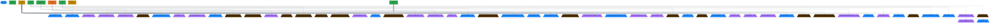

# Provider Tree: axon-03

```mermaid
%%{init: {"elk":{"mergeEdges":true,"nodePlacementStrategy":"BRANDES_KOEPF"},"flowchart":{"wrappingWidth":600},"layout":"elk","theme":"base","themeVariables":{"activationBkgColor":"#d0d7de","activationBorderColor":"#8c959f","actorBkg":"#d0d7de","actorBorder":"#6e7781","actorLineColor":"#6e7781","actorTextColor":"#424a53","background":"#eaeef2","classText":"#424a53","clusterBkg":"#d0d7de","clusterBorder":"#8c959f","edgeLabelBackground":"#eaeef2","labelBoxBkgColor":"#d0d7de","labelBoxBorderColor":"#6e7781","labelTextColor":"#424a53","lineColor":"#6e7781","loopTextColor":"#424a53","mainBkg":"#d0d7de","nodeBkg":"#d0d7de","nodeBorder":"#6e7781","nodeTextColor":"#424a53","noteBkgColor":"#d0d7de","noteBorderColor":"#8c959f","noteTextColor":"#424a53","pie1":"#fa4549","pie2":"#e16f24","pie3":"#bf8700","pie4":"#2da44e","pie5":"#339D9B","pie6":"#218bff","pie7":"#a475f9","pie8":"#4d2d00","pieLegendTextColor":"#424a53","pieOuterStrokeColor":"#8c959f","pieSectionTextColor":"#424a53","pieStrokeColor":"#8c959f","pieTitleTextColor":"#424a53","primaryBorderColor":"#6e7781","primaryColor":"#d0d7de","primaryTextColor":"#424a53","secondBkg":"#d0d7de","secondaryBorderColor":"#8c959f","secondaryColor":"#d0d7de","secondaryTextColor":"#424a53","sequenceNumberColor":"#eaeef2","signalColor":"#6e7781","signalTextColor":"#424a53","tertiaryBorderColor":"#8c959f","tertiaryColor":"#d0d7de","tertiaryTextColor":"#424a53","textColor":"#424a53","titleColor":"#424a53"}}}%%
graph TD
  axon_03([axon-03]):::root
  services__acme[/"services/acme · host"\]:::services__acme_c
  secrets__agenix[/"secrets/agenix · host"\]:::secrets__agenix_c
  apps["apps"]:::apps_c
  services__bgp[/"services/bgp · host"\]:::services__bgp_c
  services__cilium_bgp[/"services/cilium-bgp · host"\]:::services__cilium_bgp_c
  core["core"]:::core_c
  hardware__cpu_amd[/"hardware/cpu-amd · host"\]:::hardware__cpu_amd_c
  core__default[/"core/default · host"\]:::core__default_c
  core__deterministic_uids[/"core/deterministic-uids · host"\]:::core__deterministic_uids_c
  disk["disk"]:::disk_c
  core__facter[/"core/facter · host"\]:::core__facter_c
  core__firewall_collector[/"core/firewall-collector · host"\]:::core__firewall_collector_c
  core__firmware[/"core/firmware · host"\]:::core__firmware_c
  hardware__gpu_amd[/"hardware/gpu-amd · host"\]:::hardware__gpu_amd_c
  hardware["hardware"]:::hardware_c
  core__home_manager[/"core/home-manager · host"\]:::core__home_manager_c
  network__hosts[/"network/hosts · host"\]:::network__hosts_c
  core__i18n[/"core/i18n · host"\]:::core__i18n_c
  disk__impermanence[/"disk/impermanence · host"\]:::disk__impermanence_c
  services__k3s[/"services/k3s · host"\]:::services__k3s_c
  services__k3s_containerd[/"services/k3s-containerd · host"\]:::services__k3s_containerd_c
  core__linux_kernel[/"core/linux-kernel · host"\]:::core__linux_kernel_c
  core__lix[/"core/lix · host"\]:::core__lix_c
  services__media_data_share[/"services/media-data-share · host"\]:::services__media_data_share_c
  network["network"]:::network_c
  network__network_boot[/"network/network-boot · host"\]:::network__network_boot_c
  network__networking[/"network/networking · host"\]:::network__networking_c
  core__nix[/"core/nix · host"\]:::core__nix_c
  roles__nix_builder[/"roles/nix-builder · host"\]:::roles__nix_builder_c
  core__nix_remote_build_client[/"core/nix-remote-build-client · host"\]:::core__nix_remote_build_client_c
  services__nix_remote_build_server[/"services/nix-remote-build-server · host"\]:::services__nix_remote_build_server_c
  core__nixpkgs[/"core/nixpkgs · host"\]:::core__nixpkgs_c
  network__openssh[/"network/openssh · host"\]:::network__openssh_c
  core__persist_collector[/"core/persist-collector · host"\]:::core__persist_collector_c
  core__persist_home_collector[/"core/persist-home-collector · host"\]:::core__persist_home_collector_c
  services__prometheus_exporter[/"services/prometheus-exporter · host"\]:::services__prometheus_exporter_c
  roles["roles"]:::roles_c
  disk__zfs_disk_single__root[/"zfs-disk-single/root · host"\]:::disk__zfs_disk_single__root_c
  secrets["secrets"]:::secrets_c
  core__secrets_collector[/"core/secrets-collector · host"\]:::core__secrets_collector_c
  core__security[/"core/security · host"\]:::core__security_c
  roles__server[/"roles/server · host"\]:::roles__server_c
  services["services"]:::services_c
  core__shell[/"core/shell · host"\]:::core__shell_c
  services__bgp__spoke[/"bgp/spoke · host"\]:::services__bgp__spoke_c
  core__ssd[/"core/ssd · host"\]:::core__ssd_c
  core__stateVersion[/"core/stateVersion · host"\]:::core__stateVersion_c
  core__sudo[/"core/sudo · host"\]:::core__sudo_c
  core__systemd[/"core/systemd · host"\]:::core__systemd_c
  core__systemd_boot[/"core/systemd-boot · host"\]:::core__systemd_boot_c
  services__tailscale[/"services/tailscale · host"\]:::services__tailscale_c
  services__tang[/"services/tang · host"\]:::services__tang_c
  services__thunderbolt_mesh_of[/"services/thunderbolt-mesh-of · host"\]:::services__thunderbolt_mesh_of_c
  hardware__thunderbolt_network[/"hardware/thunderbolt-network · host"\]:::hardware__thunderbolt_network_c
  core__time[/"core/time · host"\]:::core__time_c
  roles__unlock[/"roles/unlock · host"\]:::roles__unlock_c
  core__users[/"core/users · host"\]:::core__users_c
  core__utils[/"core/utils · host"\]:::core__utils_c
  disk__xfs_disk_longhorn[/"disk/xfs-disk-longhorn · host"\]:::disk__xfs_disk_longhorn_c
  disk__zfs_diff[/"disk/zfs-diff · host"\]:::disk__zfs_diff_c
  disk__zfs_disk_single[/"disk/zfs-disk-single · host"\]:::disk__zfs_disk_single_c
  apps__zsh[/"apps/zsh · host"\]:::apps__zsh_c

  services --> services__acme
  secrets --> secrets__agenix
  services --> services__bgp
  services --> services__cilium_bgp
  hardware --> hardware__cpu_amd
  core --> core__default
  core --> core__deterministic_uids
  core --> core__facter
  core --> core__firewall_collector
  core --> core__firmware
  hardware --> hardware__gpu_amd
  core --> core__home_manager
  network --> network__hosts
  core --> core__i18n
  disk --> disk__impermanence
  services --> services__k3s
  services --> services__k3s_containerd
  core --> core__linux_kernel
  core --> core__lix
  services --> services__media_data_share
  network --> network__network_boot
  network --> network__networking
  core --> core__nix
  roles --> roles__nix_builder
  core --> core__nix_remote_build_client
  services --> services__nix_remote_build_server
  core --> core__nixpkgs
  network --> network__openssh
  core --> core__persist_collector
  core --> core__persist_home_collector
  services --> services__prometheus_exporter
  disk__zfs_disk_single --> disk__zfs_disk_single__root
  core --> core__secrets_collector
  core --> core__security
  roles --> roles__server
  core --> core__shell
  services__bgp --> services__bgp__spoke
  core --> core__ssd
  core --> core__stateVersion
  core --> core__sudo
  core --> core__systemd
  core --> core__systemd_boot
  services --> services__tailscale
  services --> services__tang
  services --> services__thunderbolt_mesh_of
  hardware --> hardware__thunderbolt_network
  core --> core__time
  roles --> roles__unlock
  core --> core__users
  core --> core__utils
  disk --> disk__xfs_disk_longhorn
  disk --> disk__zfs_diff
  disk --> disk__zfs_disk_single
  apps --> apps__zsh

  classDef root fill:#218bff,stroke:#218bff,color:#1f2328,font-weight:bold
  classDef services__acme_c fill:#218bff,stroke:#218bff,color:#1f2328,stroke-width:3px
  classDef secrets__agenix_c fill:#218bff,stroke:#218bff,color:#1f2328,stroke-width:3px
  classDef apps_c fill:#2da44e,stroke:#2da44e,color:#1f2328,stroke-dasharray: 3 3,stroke-width:1px
  classDef services__bgp_c fill:#a475f9,stroke:#a475f9,color:#1f2328,stroke-width:3px
  classDef services__cilium_bgp_c fill:#a475f9,stroke:#a475f9,color:#1f2328,stroke-width:3px
  classDef core_c fill:#bf8700,stroke:#bf8700,color:#1f2328,stroke-dasharray: 3 3,stroke-width:1px
  classDef hardware__cpu_amd_c fill:#a475f9,stroke:#a475f9,color:#1f2328,stroke-width:3px
  classDef core__default_c fill:#4d2d00,stroke:#4d2d00,color:#1f2328,stroke-width:3px
  classDef core__deterministic_uids_c fill:#218bff,stroke:#218bff,color:#1f2328,stroke-width:3px
  classDef disk_c fill:#2da44e,stroke:#2da44e,color:#1f2328,stroke-dasharray: 3 3,stroke-width:1px
  classDef core__facter_c fill:#a475f9,stroke:#a475f9,color:#1f2328,stroke-width:3px
  classDef core__firewall_collector_c fill:#a475f9,stroke:#a475f9,color:#1f2328,stroke-width:2px
  classDef core__firmware_c fill:#218bff,stroke:#218bff,color:#1f2328,stroke-width:3px
  classDef hardware__gpu_amd_c fill:#4d2d00,stroke:#4d2d00,color:#1f2328,stroke-width:3px
  classDef hardware_c fill:#2da44e,stroke:#2da44e,color:#1f2328,stroke-dasharray: 3 3,stroke-width:1px
  classDef core__home_manager_c fill:#4d2d00,stroke:#4d2d00,color:#1f2328,stroke-width:3px
  classDef network__hosts_c fill:#a475f9,stroke:#a475f9,color:#1f2328,stroke-width:3px
  classDef core__i18n_c fill:#4d2d00,stroke:#4d2d00,color:#1f2328,stroke-width:3px
  classDef disk__impermanence_c fill:#4d2d00,stroke:#4d2d00,color:#1f2328,stroke-width:3px
  classDef services__k3s_c fill:#4d2d00,stroke:#4d2d00,color:#1f2328,stroke-width:3px
  classDef services__k3s_containerd_c fill:#4d2d00,stroke:#4d2d00,color:#1f2328,stroke-width:3px
  classDef core__linux_kernel_c fill:#a475f9,stroke:#a475f9,color:#1f2328,stroke-width:3px
  classDef core__lix_c fill:#218bff,stroke:#218bff,color:#1f2328,stroke-width:3px
  classDef services__media_data_share_c fill:#4d2d00,stroke:#4d2d00,color:#1f2328,stroke-width:3px
  classDef network_c fill:#e16f24,stroke:#e16f24,color:#1f2328,stroke-dasharray: 3 3,stroke-width:1px
  classDef network__network_boot_c fill:#a475f9,stroke:#a475f9,color:#1f2328,stroke-width:3px
  classDef network__networking_c fill:#a475f9,stroke:#a475f9,color:#1f2328,stroke-width:3px
  classDef core__nix_c fill:#a475f9,stroke:#a475f9,color:#1f2328,stroke-width:3px
  classDef roles__nix_builder_c fill:#218bff,stroke:#218bff,color:#1f2328,stroke-width:3px
  classDef core__nix_remote_build_client_c fill:#4d2d00,stroke:#4d2d00,color:#1f2328,stroke-width:3px
  classDef services__nix_remote_build_server_c fill:#218bff,stroke:#218bff,color:#1f2328,stroke-width:3px
  classDef core__nixpkgs_c fill:#218bff,stroke:#218bff,color:#1f2328,stroke-width:3px
  classDef network__openssh_c fill:#218bff,stroke:#218bff,color:#1f2328,stroke-width:3px
  classDef core__persist_collector_c fill:#4d2d00,stroke:#4d2d00,color:#1f2328,stroke-width:3px
  classDef core__persist_home_collector_c fill:#a475f9,stroke:#a475f9,color:#1f2328,stroke-width:3px
  classDef services__prometheus_exporter_c fill:#218bff,stroke:#218bff,color:#1f2328,stroke-width:3px
  classDef roles_c fill:#2da44e,stroke:#2da44e,color:#1f2328,stroke-dasharray: 3 3,stroke-width:1px
  classDef disk__zfs_disk_single__root_c fill:#a475f9,stroke:#a475f9,color:#1f2328,stroke-width:3px
  classDef secrets_c fill:#bf8700,stroke:#bf8700,color:#1f2328,stroke-dasharray: 3 3,stroke-width:1px
  classDef core__secrets_collector_c fill:#a475f9,stroke:#a475f9,color:#1f2328,stroke-width:2px
  classDef core__security_c fill:#a475f9,stroke:#a475f9,color:#1f2328,stroke-width:3px
  classDef roles__server_c fill:#4d2d00,stroke:#4d2d00,color:#1f2328,stroke-width:3px
  classDef services_c fill:#2da44e,stroke:#2da44e,color:#1f2328,stroke-dasharray: 3 3,stroke-width:1px
  classDef core__shell_c fill:#218bff,stroke:#218bff,color:#1f2328,stroke-width:3px
  classDef services__bgp__spoke_c fill:#218bff,stroke:#218bff,color:#1f2328,stroke-width:3px
  classDef core__ssd_c fill:#4d2d00,stroke:#4d2d00,color:#1f2328,stroke-width:3px
  classDef core__stateVersion_c fill:#218bff,stroke:#218bff,color:#1f2328,stroke-width:3px
  classDef core__sudo_c fill:#a475f9,stroke:#a475f9,color:#1f2328,stroke-width:3px
  classDef core__systemd_c fill:#a475f9,stroke:#a475f9,color:#1f2328,stroke-width:3px
  classDef core__systemd_boot_c fill:#a475f9,stroke:#a475f9,color:#1f2328,stroke-width:3px
  classDef services__tailscale_c fill:#218bff,stroke:#218bff,color:#1f2328,stroke-width:3px
  classDef services__tang_c fill:#4d2d00,stroke:#4d2d00,color:#1f2328,stroke-width:3px
  classDef services__thunderbolt_mesh_of_c fill:#4d2d00,stroke:#4d2d00,color:#1f2328,stroke-width:3px
  classDef hardware__thunderbolt_network_c fill:#a475f9,stroke:#a475f9,color:#1f2328,stroke-width:3px
  classDef core__time_c fill:#218bff,stroke:#218bff,color:#1f2328,stroke-width:3px
  classDef roles__unlock_c fill:#a475f9,stroke:#a475f9,color:#1f2328,stroke-width:3px
  classDef core__users_c fill:#218bff,stroke:#218bff,color:#1f2328,stroke-width:3px
  classDef core__utils_c fill:#4d2d00,stroke:#4d2d00,color:#1f2328,stroke-width:3px
  classDef disk__xfs_disk_longhorn_c fill:#218bff,stroke:#218bff,color:#1f2328,stroke-width:3px
  classDef disk__zfs_diff_c fill:#218bff,stroke:#218bff,color:#1f2328,stroke-width:3px
  classDef disk__zfs_disk_single_c fill:#a475f9,stroke:#a475f9,color:#1f2328,stroke-width:3px
  classDef apps__zsh_c fill:#4d2d00,stroke:#4d2d00,color:#1f2328,stroke-width:3px
```
