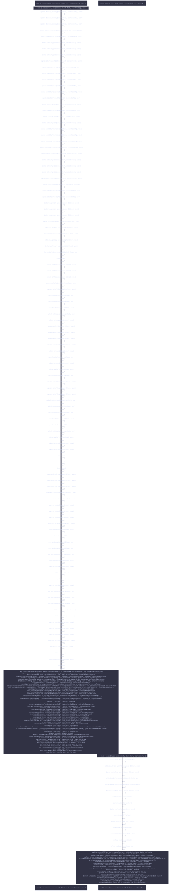

# Scope Sequence (expanded): axon-03

```mermaid
%%{init: {"theme":"base","themeVariables":{"activationBkgColor":"#313244","activationBorderColor":"#6c7086","actorBkg":"#313244","actorBorder":"#a6adc8","actorLineColor":"#a6adc8","actorTextColor":"#cdd6f4","background":"#1e1e2e","classText":"#cdd6f4","clusterBkg":"#313244","clusterBorder":"#6c7086","edgeLabelBackground":"#1e1e2e","labelBoxBkgColor":"#313244","labelBoxBorderColor":"#a6adc8","labelTextColor":"#cdd6f4","lineColor":"#a6adc8","loopTextColor":"#cdd6f4","mainBkg":"#313244","nodeBkg":"#313244","nodeBorder":"#a6adc8","nodeTextColor":"#cdd6f4","noteBkgColor":"#313244","noteBorderColor":"#6c7086","noteTextColor":"#cdd6f4","pie1":"#f38ba8","pie2":"#fab387","pie3":"#f9e2af","pie4":"#a6e3a1","pie5":"#94e2d5","pie6":"#89b4fa","pie7":"#cba6f7","pie8":"#f2cdcd","pieLegendTextColor":"#cdd6f4","pieOuterStrokeColor":"#6c7086","pieSectionTextColor":"#cdd6f4","pieStrokeColor":"#6c7086","pieTitleTextColor":"#cdd6f4","primaryBorderColor":"#a6adc8","primaryColor":"#313244","primaryTextColor":"#cdd6f4","secondBkg":"#313244","secondaryBorderColor":"#6c7086","secondaryColor":"#313244","secondaryTextColor":"#cdd6f4","sequenceNumberColor":"#1e1e2e","signalColor":"#a6adc8","signalTextColor":"#cdd6f4","tertiaryBorderColor":"#6c7086","tertiaryColor":"#313244","tertiaryTextColor":"#cdd6f4","textColor":"#cdd6f4","titleColor":"#cdd6f4"}}}%%
sequenceDiagram
    participant user as user { accessGroups, environment, fleet, host, secretsConfig, user }
    participant host as host { accessGroups, environment, fleet, host, secretsConfig }

    Note over user: ── user { accessGroups, environment, fleet, host, secretsConfig, user }
    activate user
    user ->> user: agenix-identity/dvicory@axon-01(host, secretsConfig, user)
    user ->> user: agenix-identity/dvicory@axon-02(host, secretsConfig, user)
    user ->> user: agenix-identity/dvicory@axon-03(host, secretsConfig, user)
    user ->> user: agenix-identity/dvicory@bitstream(host, secretsConfig, user)
    user ->> user: agenix-identity/dvicory@uplink(host, secretsConfig, user)
    user ->> user: agenix-identity/pol@axon-01(host, secretsConfig, user)
    user ->> user: agenix-identity/pol@axon-02(host, secretsConfig, user)
    user ->> user: agenix-identity/pol@axon-03(host, secretsConfig, user)
    user ->> user: agenix-identity/pol@bitstream(host, secretsConfig, user)
    user ->> user: agenix-identity/pol@uplink(host, secretsConfig, user)
    user ->> user: agenix-identity/sini@axon-01(host, secretsConfig, user)
    user ->> user: agenix-identity/sini@axon-02(host, secretsConfig, user)
    user ->> user: agenix-identity/sini@axon-03(host, secretsConfig, user)
    user ->> user: agenix-identity/sini@bitstream(host, secretsConfig, user)
    user ->> user: agenix-identity/sini@blade(host, secretsConfig, user)
    user ->> user: agenix-identity/sini@cortex(host, secretsConfig, user)
    user ->> user: agenix-identity/sini@patch(host, secretsConfig, user)
    user ->> user: agenix-identity/sini@slab(host, secretsConfig, user)
    user ->> user: agenix-identity/sini@uplink(host, secretsConfig, user)
    user ->> user: agenix-identity/theutz@axon-01(host, secretsConfig, user)
    user ->> user: agenix-identity/theutz@axon-02(host, secretsConfig, user)
    user ->> user: agenix-identity/theutz@axon-03(host, secretsConfig, user)
    user ->> user: agenix-identity/theutz@bitstream(host, secretsConfig, user)
    user ->> user: agenix-identity/theutz@uplink(host, secretsConfig, user)
    user ->> user: agenix-identity/vic@axon-01(host, secretsConfig, user)
    user ->> user: agenix-identity/vic@axon-02(host, secretsConfig, user)
    user ->> user: agenix-identity/vic@axon-03(host, secretsConfig, user)
    user ->> user: agenix-identity/vic@bitstream(host, secretsConfig, user)
    user ->> user: agenix-identity/vic@blade(host, secretsConfig, user)
    user ->> user: agenix-identity/vic@cortex(host, secretsConfig, user)
    user ->> user: agenix-identity/vic@uplink(host, secretsConfig, user)
    user ->> user: batteries/primary-user(sini@axon-01)(host, user)
    user ->> user: batteries/primary-user(sini@axon-02)(host, user)
    user ->> user: batteries/primary-user(sini@axon-03)(host, user)
    user ->> user: batteries/primary-user(sini@bitstream)(host, user)
    user ->> user: batteries/primary-user(sini@blade)(host, user)
    user ->> user: batteries/primary-user(sini@cortex)(host, user)
    user ->> user: batteries/primary-user(sini@patch)(host, user)
    user ->> user: batteries/primary-user(sini@slab)(host, user)
    user ->> user: batteries/primary-user(sini@uplink)(host, user)
    user ->> user: dvicory(user)
    user ->> user: opkssh-authz/dvicory@axon-01(host, user)
    user ->> user: opkssh-authz/dvicory@axon-02(host, user)
    user ->> user: opkssh-authz/dvicory@axon-03(host, user)
    user ->> user: opkssh-authz/dvicory@bitstream(host, user)
    user ->> user: opkssh-authz/dvicory@uplink(host, user)
    user ->> user: opkssh-authz/pol@axon-01(host, user)
    user ->> user: opkssh-authz/pol@axon-02(host, user)
    user ->> user: opkssh-authz/pol@axon-03(host, user)
    user ->> user: opkssh-authz/pol@bitstream(host, user)
    user ->> user: opkssh-authz/pol@uplink(host, user)
    user ->> user: opkssh-authz/sini@axon-01(host, user)
    user ->> user: opkssh-authz/sini@axon-02(host, user)
    user ->> user: opkssh-authz/sini@axon-03(host, user)
    user ->> user: opkssh-authz/sini@bitstream(host, user)
    user ->> user: opkssh-authz/sini@blade(host, user)
    user ->> user: opkssh-authz/sini@cortex(host, user)
    user ->> user: opkssh-authz/sini@patch(host, user)
    user ->> user: opkssh-authz/sini@slab(host, user)
    user ->> user: opkssh-authz/sini@uplink(host, user)
    user ->> user: opkssh-authz/theutz@axon-01(host, user)
    user ->> user: opkssh-authz/theutz@axon-02(host, user)
    user ->> user: opkssh-authz/theutz@axon-03(host, user)
    user ->> user: opkssh-authz/theutz@bitstream(host, user)
    user ->> user: opkssh-authz/theutz@uplink(host, user)
    user ->> user: opkssh-authz/vic@axon-01(host, user)
    user ->> user: opkssh-authz/vic@axon-02(host, user)
    user ->> user: opkssh-authz/vic@axon-03(host, user)
    user ->> user: opkssh-authz/vic@bitstream(host, user)
    user ->> user: opkssh-authz/vic@blade(host, user)
    user ->> user: opkssh-authz/vic@cortex(host, user)
    user ->> user: opkssh-authz/vic@uplink(host, user)
    user ->> user: pol(user)
    user ->> user: sini(user)
    user ->> user: theutz(user)
    user ->> user: user-enrich/dvicory@axon-01(host, user)
    user ->> user: user-enrich/dvicory@axon-02(host, user)
    user ->> user: user-enrich/dvicory@axon-03(host, user)
    user ->> user: user-enrich/dvicory@bitstream(host, user)
    user ->> user: user-enrich/dvicory@uplink(host, user)
    user ->> user: user-enrich/pol@axon-01(host, user)
    user ->> user: user-enrich/pol@axon-02(host, user)
    user ->> user: user-enrich/pol@axon-03(host, user)
    user ->> user: user-enrich/pol@bitstream(host, user)
    user ->> user: user-enrich/pol@uplink(host, user)
    user ->> user: user-enrich/sini@axon-01(host, user)
    user ->> user: user-enrich/sini@axon-02(host, user)
    user ->> user: user-enrich/sini@axon-03(host, user)
    user ->> user: user-enrich/sini@bitstream(host, user)
    user ->> user: user-enrich/sini@blade(host, user)
    user ->> user: user-enrich/sini@cortex(host, user)
    user ->> user: user-enrich/sini@patch(host, user)
    user ->> user: user-enrich/sini@slab(host, user)
    user ->> user: user-enrich/sini@uplink(host, user)
    user ->> user: user-enrich/theutz@axon-01(host, user)
    user ->> user: user-enrich/theutz@axon-02(host, user)
    user ->> user: user-enrich/theutz@axon-03(host, user)
    user ->> user: user-enrich/theutz@bitstream(host, user)
    user ->> user: user-enrich/theutz@uplink(host, user)
    user ->> user: user-enrich/vic@axon-01(host, user)
    user ->> user: user-enrich/vic@axon-02(host, user)
    user ->> user: user-enrich/vic@axon-03(host, user)
    user ->> user: user-enrich/vic@bitstream(host, user)
    user ->> user: user-enrich/vic@blade(host, user)
    user ->> user: user-enrich/vic@cortex(host, user)
    user ->> user: user-enrich/vic@uplink(host, user)
    user ->> user: vic(user)
    deactivate user
    Note over user: <policy:droidHm-user-detect>[0], <policy:hm-user-detect>[0], <policy:hm-user-detect>[0], <policy:hm-user-detect>[0]<br/><policy:hm-user-detect>[0], <policy:hm-user-detect>[0], <policy:user-aspect-auto-include>[3], applications/shell/zsh<br/>applications/shell/zsh, applications/shell/zsh, applications/shell/zsh, batteries/host-aspects<br/>broadcast-syncthing-hub-shares, broadcast-syncthing-hub-shares, broadcast-syncthing-hub-shares, broadcast-syncthing-hub-shares<br/>broadcast-syncthing-hub-shares, broadcast-syncthing-peers, broadcast-syncthing-peers, broadcast-syncthing-peers<br/>broadcast-syncthing-peers, broadcast-syncthing-peers, broadcast-syncthing-peers-to-hub, broadcast-syncthing-peers-to-hub<br/>broadcast-syncthing-peers-to-hub, broadcast-syncthing-peers-to-hub, broadcast-syncthing-peers-to-hub, core/impermanence<br/>core/impermanence, core/impermanence, core/impermanence, core/impermanence/btrfs<br/>core/impermanence/btrfs, core/impermanence/btrfs, core/impermanence/btrfs, core/impermanence/persist-collector<br/>core/impermanence/persist-collector, core/impermanence/persist-collector, core/impermanence/persist-collector, core/impermanence/persist-home-collector<br/>core/impermanence/persist-home-collector, core/impermanence/persist-home-collector, core/impermanence/persist-home-collector, core/impermanence/zfs<br/>core/impermanence/zfs, core/impermanence/zfs, core/impermanence/zfs, core/localization/i18n<br/>core/localization/i18n, core/localization/i18n, core/localization/i18n, core/localization/time<br/>core/localization/time, core/localization/time, core/localization/time, core/network/hostsfile<br/>core/network/hostsfile, core/network/hostsfile, core/network/hostsfile, core/network/networking<br/>core/network/networking, core/network/networking, core/network/networking, core/network/syncthing/member<br/>core/network/syncthing/member, core/network/syncthing/member, core/network/syncthing/member, core/network/syncthing/peer<br/>core/network/syncthing/peer, core/network/syncthing/peer, core/network/syncthing/peer, core/network/syncthing/peer<br/>core/network/tailscale, core/network/tailscale, core/network/tailscale, core/network/tailscale<br/>core/nix, core/nix, core/nix, core/nix<br/>core/nix/nixpkgs, core/nix/nixpkgs, core/nix/nixpkgs, core/nix/nixpkgs<br/>core/nix/stateVersion, core/nix/stateVersion, core/nix/stateVersion, core/nix/stateVersion<br/>core/perf/disable-docs, core/perf/disable-docs, core/perf/disable-docs, core/perf/disable-docs<br/>core/perf/ssd, core/perf/ssd, core/perf/ssd, core/perf/ssd<br/>core/perf/zram-swap, core/perf/zram-swap, core/perf/zram-swap, core/perf/zram-swap<br/>core/security, core/security, core/security, core/security<br/>core/security/openssh, core/security/openssh, core/security/openssh, core/security/openssh<br/>core/security/opkssh, core/security/opkssh, core/security/opkssh, core/security/opkssh<br/>core/security/sudo, core/security/sudo, core/security/sudo, core/security/sudo<br/>core/system/facter, core/system/facter, core/system/facter, core/system/facter<br/>core/system/firmware, core/system/firmware, core/system/firmware, core/system/firmware<br/>core/system/linux-kernel, core/system/linux-kernel, core/system/linux-kernel, core/system/linux-kernel<br/>core/systemd, core/systemd, core/systemd, core/systemd<br/>core/systemd/boot, core/systemd/boot, core/systemd/boot, core/systemd/boot<br/>core/users, core/users, core/users, core/users<br/>core/users/deterministic-uids, core/users/deterministic-uids, core/users/deterministic-uids, core/users/deterministic-uids<br/>core/users/home-manager-shared, core/users/home-manager-shared, core/users/home-manager-shared, core/users/home-manager-shared<br/>core/users/shell, core/users/shell, core/users/shell, core/users/shell<br/>core/utils, core/utils, core/utils, core/utils<br/>default, default, default, default<br/>default, droidHm-user-detect, drop-user-to-host-on-droid, expose-resolved-users<br/>expose-resolved-users, expose-resolved-users, expose-resolved-users, expose-resolved-users<br/>hm-user-detect, hm-user-detect, hm-user-detect, hm-user-detect<br/>hm-user-detect, homeAarch64-to-hm, homeDarwin-to-hm, homeLinux-to-hm<br/>homeLinux-to-hm, homeLinux-to-hm, homeLinux-to-hm, homeLinux-to-hm<br/>host-aspects-project, media/spotify-player, os-to-host, os-to-host<br/>os-to-host, os-to-host, os-to-host, primary-user-for-owner<br/>roles/default, roles/default, roles/default, roles/default<br/>secrets/agenix, secrets/agenix, secrets/agenix, secrets/agenix<br/>user, user, user, user<br/>user, user-aspect-auto-include, user-to-host, user-to-host<br/>user-to-host, user-to-host, user-to-host

    Note over host: ── host { accessGroups, environment, fleet, host, secretsConfig }
    activate host
    host ->> host: agenix/axon-03(host, secretsConfig)
    host ->> host: batteries/define-user/dvicory@axon-03(host, user)
    host ->> host: batteries/define-user/pol@axon-03(host, user)
    host ->> host: batteries/define-user/sini@axon-03(host, user)
    host ->> host: batteries/define-user/theutz@axon-03(host, user)
    host ->> host: batteries/define-user/vic@axon-03(host, user)
    host ->> host: batteries/hostname/os(host)
    host ->> host: batteries/inputs'/os(host)
    host ->> host: batteries/inputs'/user(host, user)
    host ->> host: batteries/self'/os(host)
    host ->> host: batteries/self'/user(host, user)
    host ->> host: insecure-predicate/os(host)
    host ->> host: insecure-predicate/user(host, user)
    host ->> host: unfree-predicate/os(host)
    host ->> host: unfree-predicate/user(host, user)
    deactivate host
    Note over host: applications/shell/zsh, batteries/define-user, batteries/hostname, batteries/inputs'<br/>batteries/self', bgp/cilium-bgp, bgp/spoke, boot/network-initrd<br/>collect-bgp-peers, collect-container-registries, collect-host-addrs, collect-k3s-nodes<br/>collect-ollama-endpoints, collect-prometheus-targets, collect-thunderbolt-mesh-peers, collect-vault-peers<br/>core/impermanence, core/impermanence/btrfs, core/impermanence/persist-collector, core/impermanence/persist-home-collector<br/>core/impermanence/zfs, core/localization/i18n, core/localization/time, core/network/hostsfile<br/>core/network/networking, core/network/tailscale, core/nix, core/nix/nixpkgs<br/>core/nix/stateVersion, core/perf/disable-docs, core/perf/ssd, core/perf/zram-swap<br/>core/security, core/security/openssh, core/security/opkssh, core/security/sudo<br/>core/system/facter, core/system/firmware, core/system/linux-kernel, core/systemd<br/>core/systemd/boot, core/users, core/users/deterministic-uids, core/users/home-manager-shared<br/>core/users/shell, core/utils, cpu/amd, default<br/>disk/xfs-disk-longhorn, disk/zfs-diff, disk/zfs-disk-single, env-users<br/>gpu/amd, hardware/thunderbolt-network, host, host-modules-capture<br/>insecure-predicate, k3s/bootstrap, k3s/containerd, k3s/node<br/>k3s/node-lifecycle, monitoring/prometheus-exporter, network/firewall-collector, networking/thunderbolt-mesh-of<br/>nix/remote-build-server, os-to-host, roles/default, roles/nix-builder<br/>roles/server, roles/unlock, secrets/agenix, secrets/collector<br/>security/acme, security/tang, services/bgp, services/k3s<br/>storage/media-data-share, unfree-predicate, zfs-disk-single/root
```
