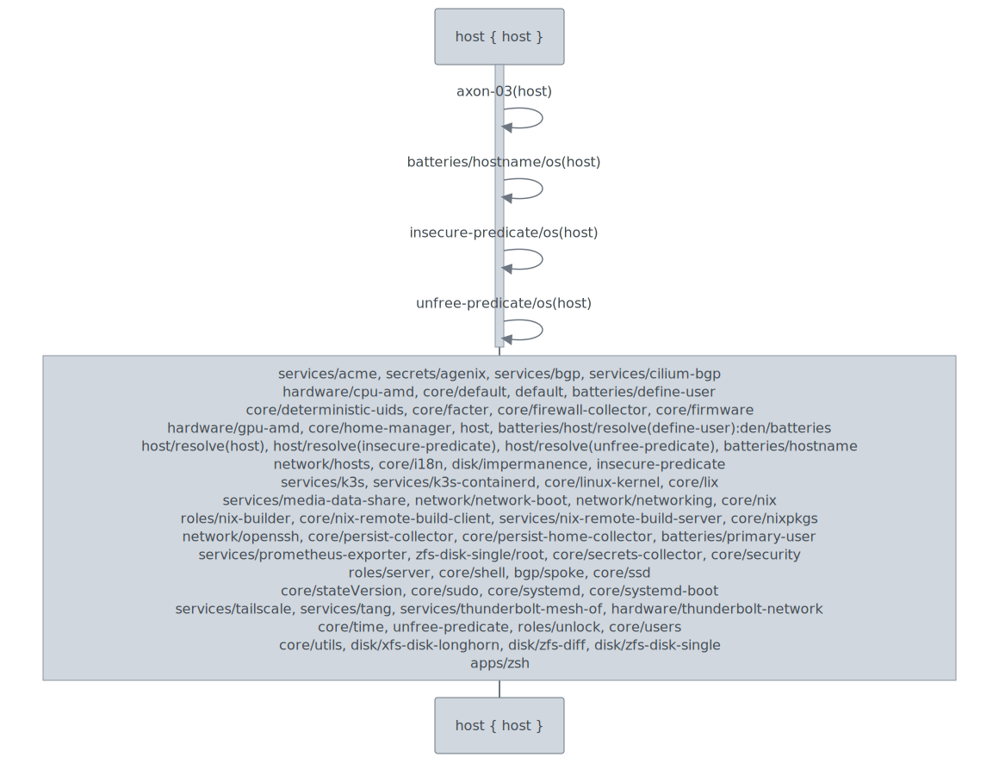
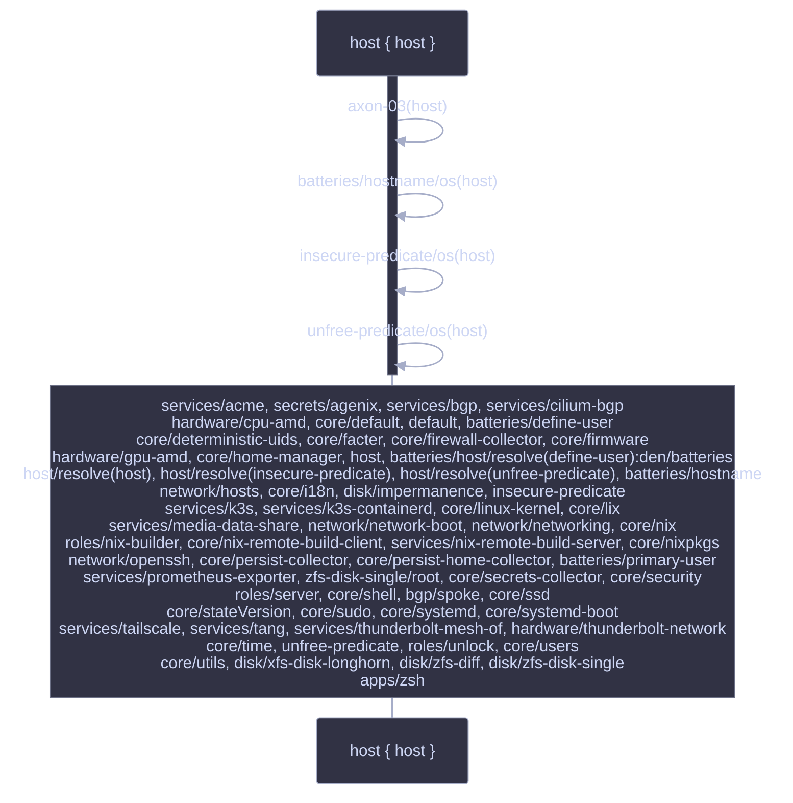

# Scope Sequence: axon-03

```mermaid
%%{init: {"theme":"base","themeVariables":{"activationBkgColor":"#313244","activationBorderColor":"#6c7086","actorBkg":"#313244","actorBorder":"#a6adc8","actorLineColor":"#a6adc8","actorTextColor":"#cdd6f4","background":"#1e1e2e","classText":"#cdd6f4","clusterBkg":"#313244","clusterBorder":"#6c7086","edgeLabelBackground":"#1e1e2e","labelBoxBkgColor":"#313244","labelBoxBorderColor":"#a6adc8","labelTextColor":"#cdd6f4","lineColor":"#a6adc8","loopTextColor":"#cdd6f4","mainBkg":"#313244","nodeBkg":"#313244","nodeBorder":"#a6adc8","nodeTextColor":"#cdd6f4","noteBkgColor":"#313244","noteBorderColor":"#6c7086","noteTextColor":"#cdd6f4","pie1":"#f38ba8","pie2":"#fab387","pie3":"#f9e2af","pie4":"#a6e3a1","pie5":"#94e2d5","pie6":"#89b4fa","pie7":"#cba6f7","pie8":"#f2cdcd","pieLegendTextColor":"#cdd6f4","pieOuterStrokeColor":"#6c7086","pieSectionTextColor":"#cdd6f4","pieStrokeColor":"#6c7086","pieTitleTextColor":"#cdd6f4","primaryBorderColor":"#a6adc8","primaryColor":"#313244","primaryTextColor":"#cdd6f4","secondBkg":"#313244","secondaryBorderColor":"#6c7086","secondaryColor":"#313244","secondaryTextColor":"#cdd6f4","sequenceNumberColor":"#1e1e2e","signalColor":"#a6adc8","signalTextColor":"#cdd6f4","tertiaryBorderColor":"#6c7086","tertiaryColor":"#313244","tertiaryTextColor":"#cdd6f4","textColor":"#cdd6f4","titleColor":"#cdd6f4"}}}%%
sequenceDiagram
    participant host as host { host }


    activate host
    host ->> host: axon-03(host)
    host ->> host: batteries/hostname/os(host)
    host ->> host: insecure-predicate/os(host)
    host ->> host: unfree-predicate/os(host)
    deactivate host
    Note over host: services/acme, secrets/agenix, services/bgp, services/cilium-bgp<br/>hardware/cpu-amd, core/default, default, batteries/define-user<br/>core/deterministic-uids, core/facter, core/firewall-collector, core/firmware<br/>hardware/gpu-amd, core/home-manager, host, batteries/host/resolve(define-user):den/batteries<br/>host/resolve(host), host/resolve(insecure-predicate), host/resolve(unfree-predicate), batteries/hostname<br/>network/hosts, core/i18n, disk/impermanence, insecure-predicate<br/>services/k3s, services/k3s-containerd, core/linux-kernel, core/lix<br/>services/media-data-share, network/network-boot, network/networking, core/nix<br/>roles/nix-builder, core/nix-remote-build-client, services/nix-remote-build-server, core/nixpkgs<br/>network/openssh, core/persist-collector, core/persist-home-collector, batteries/primary-user<br/>services/prometheus-exporter, zfs-disk-single/root, core/secrets-collector, core/security<br/>roles/server, core/shell, bgp/spoke, core/ssd<br/>core/stateVersion, core/sudo, core/systemd, core/systemd-boot<br/>services/tailscale, services/tang, services/thunderbolt-mesh-of, hardware/thunderbolt-network<br/>core/time, unfree-predicate, roles/unlock, core/users<br/>core/utils, disk/xfs-disk-longhorn, disk/zfs-diff, disk/zfs-disk-single<br/>apps/zsh
```
