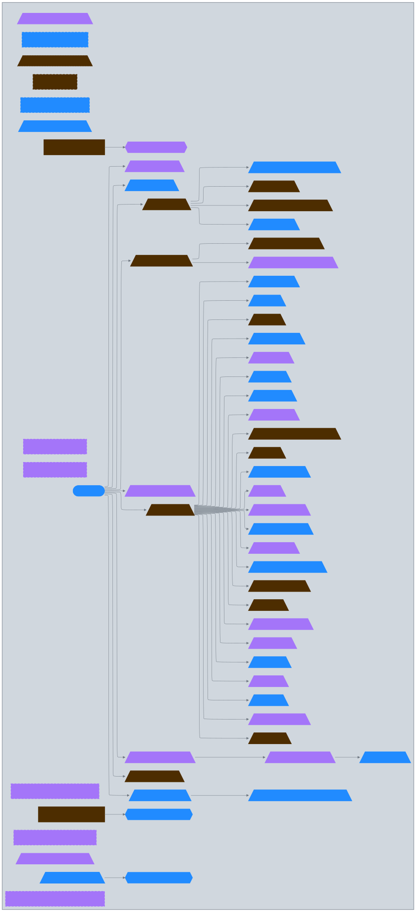

# Aspect Hierarchy: bitstream

```mermaid
%%{init: {"elk":{"mergeEdges":true,"nodePlacementStrategy":"BRANDES_KOEPF"},"flowchart":{"wrappingWidth":600},"layout":"elk","theme":"base","themeVariables":{"activationBkgColor":"#313244","activationBorderColor":"#6c7086","actorBkg":"#313244","actorBorder":"#a6adc8","actorLineColor":"#a6adc8","actorTextColor":"#cdd6f4","background":"#1e1e2e","classText":"#cdd6f4","clusterBkg":"#313244","clusterBorder":"#6c7086","edgeLabelBackground":"#1e1e2e","labelBoxBkgColor":"#313244","labelBoxBorderColor":"#a6adc8","labelTextColor":"#cdd6f4","lineColor":"#a6adc8","loopTextColor":"#cdd6f4","mainBkg":"#313244","nodeBkg":"#313244","nodeBorder":"#a6adc8","nodeTextColor":"#cdd6f4","noteBkgColor":"#313244","noteBorderColor":"#6c7086","noteTextColor":"#cdd6f4","pie1":"#f38ba8","pie2":"#fab387","pie3":"#f9e2af","pie4":"#a6e3a1","pie5":"#94e2d5","pie6":"#89b4fa","pie7":"#cba6f7","pie8":"#f2cdcd","pieLegendTextColor":"#cdd6f4","pieOuterStrokeColor":"#6c7086","pieSectionTextColor":"#cdd6f4","pieStrokeColor":"#6c7086","pieTitleTextColor":"#cdd6f4","primaryBorderColor":"#a6adc8","primaryColor":"#313244","primaryTextColor":"#cdd6f4","secondBkg":"#313244","secondaryBorderColor":"#6c7086","secondaryColor":"#313244","secondaryTextColor":"#cdd6f4","sequenceNumberColor":"#1e1e2e","signalColor":"#a6adc8","signalTextColor":"#cdd6f4","tertiaryBorderColor":"#6c7086","tertiaryColor":"#313244","tertiaryTextColor":"#cdd6f4","textColor":"#cdd6f4","titleColor":"#cdd6f4"}}}%%
graph LR
  bitstream([bitstream]):::root

  subgraph ctx_host_bitstream["host: bitstream"]
  services__acme[/"services/acme"\]:::services__acme_c
  secrets__agenix[/"secrets/agenix"\]:::secrets__agenix_c
  collect_bgp_peers["collect-bgp-peers"]:::collect_bgp_peers_c
  collect_host_addrs["collect-host-addrs"]:::collect_host_addrs_c
  collect_k3s_nodes["collect-k3s-nodes"]:::collect_k3s_nodes_c
  collect_ollama_endpoints["collect-ollama-endpoints"]:::collect_ollama_endpoints_c
  collect_prometheus_targets["collect-prometheus-targets"]:::collect_prometheus_targets_c
  collect_thunderbolt_mesh_peers["collect-thunderbolt-mesh-peers"]:::collect_thunderbolt_mesh_peers_c
  collect_vault_peers["collect-vault-peers"]:::collect_vault_peers_c
  hardware__cpu_amd[/"hardware/cpu-amd"\]:::hardware__cpu_amd_c
  core__default[/"core/default"\]:::core__default_c
  den__batteries__define_user[/"batteries/define-user"\]:::den__batteries__define_user_c
  core__deterministic_uids[/"core/deterministic-uids"\]:::core__deterministic_uids_c
  core__facter[/"core/facter"\]:::core__facter_c
  core__firewall_collector[/"core/firewall-collector"\]:::core__firewall_collector_c
  core__firmware[/"core/firmware"\]:::core__firmware_c
  hardware__gpu_amd[/"hardware/gpu-amd"\]:::hardware__gpu_amd_c
  core__home_manager[/"core/home-manager"\]:::core__home_manager_c
  den__batteries__hostname[/"batteries/hostname"\]:::den__batteries__hostname_c
  den__batteries__hostname__os{{"batteries/hostname/os"}}:::den__batteries__hostname__os_c
  network__hosts[/"network/hosts"\]:::network__hosts_c
  core__i18n[/"core/i18n"\]:::core__i18n_c
  disk__impermanence[/"disk/impermanence"\]:::disk__impermanence_c
  insecure_predicate["insecure-predicate"]:::insecure_predicate_c
  insecure_predicate__os{{"insecure-predicate/os"}}:::insecure_predicate__os_c
  core__linux_kernel[/"core/linux-kernel"\]:::core__linux_kernel_c
  core__lix[/"core/lix"\]:::core__lix_c
  services__media_data_share[/"services/media-data-share"\]:::services__media_data_share_c
  network__network_boot[/"network/network-boot"\]:::network__network_boot_c
  network__networking[/"network/networking"\]:::network__networking_c
  core__nix[/"core/nix"\]:::core__nix_c
  roles__nix_builder[/"roles/nix-builder"\]:::roles__nix_builder_c
  core__nix_remote_build_client[/"core/nix-remote-build-client"\]:::core__nix_remote_build_client_c
  services__nix_remote_build_server[/"services/nix-remote-build-server"\]:::services__nix_remote_build_server_c
  core__nixpkgs[/"core/nixpkgs"\]:::core__nixpkgs_c
  network__openssh[/"network/openssh"\]:::network__openssh_c
  os_to_host["os-to-host"]:::os_to_host_c
  core__persist_collector[/"core/persist-collector"\]:::core__persist_collector_c
  core__persist_home_collector[/"core/persist-home-collector"\]:::core__persist_home_collector_c
  den__batteries__primary_user[/"batteries/primary-user"\]:::den__batteries__primary_user_c
  services__prometheus_exporter[/"services/prometheus-exporter"\]:::services__prometheus_exporter_c
  disk__zfs_disk_single__root[/"zfs-disk-single/root"\]:::disk__zfs_disk_single__root_c
  core__secrets_collector[/"core/secrets-collector"\]:::core__secrets_collector_c
  core__security[/"core/security"\]:::core__security_c
  roles__server[/"roles/server"\]:::roles__server_c
  core__shell[/"core/shell"\]:::core__shell_c
  core__ssd[/"core/ssd"\]:::core__ssd_c
  core__stateVersion[/"core/stateVersion"\]:::core__stateVersion_c
  core__sudo[/"core/sudo"\]:::core__sudo_c
  core__systemd[/"core/systemd"\]:::core__systemd_c
  core__systemd_boot[/"core/systemd-boot"\]:::core__systemd_boot_c
  services__tailscale[/"services/tailscale"\]:::services__tailscale_c
  services__tang[/"services/tang"\]:::services__tang_c
  core__time[/"core/time"\]:::core__time_c
  unfree_predicate["unfree-predicate"]:::unfree_predicate_c
  unfree_predicate__os{{"unfree-predicate/os"}}:::unfree_predicate__os_c
  core__users[/"core/users"\]:::core__users_c
  core__utils[/"core/utils"\]:::core__utils_c
  disk__zfs_diff[/"disk/zfs-diff"\]:::disk__zfs_diff_c
  disk__zfs_disk_single[/"disk/zfs-disk-single"\]:::disk__zfs_disk_single_c
  apps__zsh[/"apps/zsh"\]:::apps__zsh_c
  bitstream --> secrets__agenix
  bitstream --> hardware__cpu_amd
  bitstream --> core__default
  bitstream --> hardware__gpu_amd
  bitstream --> disk__impermanence
  bitstream --> network__network_boot
  bitstream --> roles__nix_builder
  bitstream --> roles__server
  bitstream --> disk__zfs_disk_single
  core__default --> core__deterministic_uids
  core__default --> core__facter
  core__default --> core__firmware
  core__default --> core__home_manager
  core__default --> network__hosts
  core__default --> core__i18n
  core__default --> core__linux_kernel
  core__default --> core__lix
  core__default --> network__networking
  core__default --> core__nix
  core__default --> core__nix_remote_build_client
  core__default --> core__nixpkgs
  core__default --> network__openssh
  core__default --> core__security
  core__default --> core__shell
  core__default --> core__ssd
  core__default --> core__stateVersion
  core__default --> core__sudo
  core__default --> core__systemd
  core__default --> core__systemd_boot
  core__default --> services__tailscale
  core__default --> core__time
  core__default --> core__users
  core__default --> core__utils
  core__default --> apps__zsh
  den__batteries__hostname --> den__batteries__hostname__os
  disk__impermanence --> core__persist_collector
  disk__impermanence --> core__persist_home_collector
  disk__zfs_disk_single --> disk__zfs_disk_single__root
  disk__zfs_disk_single__root --> disk__zfs_diff
  insecure_predicate --> insecure_predicate__os
  roles__nix_builder --> services__nix_remote_build_server
  roles__server --> services__acme
  roles__server --> services__media_data_share
  roles__server --> services__prometheus_exporter
  roles__server --> services__tang
  unfree_predicate --> unfree_predicate__os
  end


  classDef root fill:#89b4fa,stroke:#89b4fa,color:#1e1e2e,font-weight:bold
  classDef services__acme_c fill:#89b4fa,stroke:#89b4fa,color:#1e1e2e,stroke-width:3px
  classDef secrets__agenix_c fill:#89b4fa,stroke:#89b4fa,color:#1e1e2e,stroke-width:3px
  classDef apps_c fill:#a6e3a1,stroke:#a6e3a1,color:#1e1e2e,stroke-dasharray: 3 3,stroke-width:1px
  classDef bitstream_c fill:#cba6f7,stroke:#cba6f7,color:#1e1e2e,stroke-width:3px
  classDef collect_bgp_peers_c fill:#cba6f7,stroke:#cba6f7,color:#1e1e2e,stroke-width:2px,stroke-dasharray: 8 4
  classDef collect_host_addrs_c fill:#89b4fa,stroke:#89b4fa,color:#1e1e2e,stroke-width:2px,stroke-dasharray: 8 4
  classDef collect_k3s_nodes_c fill:#cba6f7,stroke:#cba6f7,color:#1e1e2e,stroke-width:2px,stroke-dasharray: 8 4
  classDef collect_ollama_endpoints_c fill:#cba6f7,stroke:#cba6f7,color:#1e1e2e,stroke-width:2px,stroke-dasharray: 8 4
  classDef collect_prometheus_targets_c fill:#cba6f7,stroke:#cba6f7,color:#1e1e2e,stroke-width:2px,stroke-dasharray: 8 4
  classDef collect_thunderbolt_mesh_peers_c fill:#cba6f7,stroke:#cba6f7,color:#1e1e2e,stroke-width:2px,stroke-dasharray: 8 4
  classDef collect_vault_peers_c fill:#89b4fa,stroke:#89b4fa,color:#1e1e2e,stroke-width:2px,stroke-dasharray: 8 4
  classDef core_c fill:#f9e2af,stroke:#f9e2af,color:#1e1e2e,stroke-dasharray: 3 3,stroke-width:1px
  classDef hardware__cpu_amd_c fill:#cba6f7,stroke:#cba6f7,color:#1e1e2e,stroke-width:3px
  classDef core__default_c fill:#f2cdcd,stroke:#f2cdcd,color:#1e1e2e,stroke-width:3px
  classDef den__batteries__define_user_c fill:#89b4fa,stroke:#89b4fa,color:#1e1e2e,stroke-width:3px
  classDef core__deterministic_uids_c fill:#89b4fa,stroke:#89b4fa,color:#1e1e2e,stroke-width:3px
  classDef disk_c fill:#a6e3a1,stroke:#a6e3a1,color:#1e1e2e,stroke-dasharray: 3 3,stroke-width:1px
  classDef core__facter_c fill:#cba6f7,stroke:#cba6f7,color:#1e1e2e,stroke-width:3px
  classDef core__firewall_collector_c fill:#cba6f7,stroke:#cba6f7,color:#1e1e2e,stroke-width:2px
  classDef core__firmware_c fill:#89b4fa,stroke:#89b4fa,color:#1e1e2e,stroke-width:3px
  classDef hardware__gpu_amd_c fill:#f2cdcd,stroke:#f2cdcd,color:#1e1e2e,stroke-width:3px
  classDef hardware_c fill:#a6e3a1,stroke:#a6e3a1,color:#1e1e2e,stroke-dasharray: 3 3,stroke-width:1px
  classDef core__home_manager_c fill:#f2cdcd,stroke:#f2cdcd,color:#1e1e2e,stroke-width:3px
  classDef den__batteries__hostname_c fill:#89b4fa,stroke:#89b4fa,color:#1e1e2e,stroke-width:3px
  classDef den__batteries__hostname__os_c fill:#89b4fa,stroke:#89b4fa,color:#1e1e2e,stroke-width:2px
  classDef network__hosts_c fill:#cba6f7,stroke:#cba6f7,color:#1e1e2e,stroke-width:3px
  classDef core__i18n_c fill:#f2cdcd,stroke:#f2cdcd,color:#1e1e2e,stroke-width:3px
  classDef disk__impermanence_c fill:#f2cdcd,stroke:#f2cdcd,color:#1e1e2e,stroke-width:3px
  classDef insecure_predicate_c fill:#f2cdcd,stroke:#f2cdcd,color:#1e1e2e,stroke-width:3px
  classDef insecure_predicate__os_c fill:#89b4fa,stroke:#89b4fa,color:#1e1e2e,stroke-width:2px
  classDef core__linux_kernel_c fill:#cba6f7,stroke:#cba6f7,color:#1e1e2e,stroke-width:3px
  classDef core__lix_c fill:#89b4fa,stroke:#89b4fa,color:#1e1e2e,stroke-width:3px
  classDef services__media_data_share_c fill:#f2cdcd,stroke:#f2cdcd,color:#1e1e2e,stroke-width:3px
  classDef network_c fill:#fab387,stroke:#fab387,color:#1e1e2e,stroke-dasharray: 3 3,stroke-width:1px
  classDef network__network_boot_c fill:#cba6f7,stroke:#cba6f7,color:#1e1e2e,stroke-width:3px
  classDef network__networking_c fill:#cba6f7,stroke:#cba6f7,color:#1e1e2e,stroke-width:3px
  classDef core__nix_c fill:#cba6f7,stroke:#cba6f7,color:#1e1e2e,stroke-width:3px
  classDef roles__nix_builder_c fill:#89b4fa,stroke:#89b4fa,color:#1e1e2e,stroke-width:3px
  classDef core__nix_remote_build_client_c fill:#f2cdcd,stroke:#f2cdcd,color:#1e1e2e,stroke-width:3px
  classDef services__nix_remote_build_server_c fill:#89b4fa,stroke:#89b4fa,color:#1e1e2e,stroke-width:3px
  classDef core__nixpkgs_c fill:#89b4fa,stroke:#89b4fa,color:#1e1e2e,stroke-width:3px
  classDef network__openssh_c fill:#89b4fa,stroke:#89b4fa,color:#1e1e2e,stroke-width:3px
  classDef os_to_host_c fill:#f2cdcd,stroke:#f2cdcd,color:#1e1e2e,stroke-width:2px,stroke-dasharray: 8 4
  classDef core__persist_collector_c fill:#f2cdcd,stroke:#f2cdcd,color:#1e1e2e,stroke-width:3px
  classDef core__persist_home_collector_c fill:#cba6f7,stroke:#cba6f7,color:#1e1e2e,stroke-width:3px
  classDef den__batteries__primary_user_c fill:#f2cdcd,stroke:#f2cdcd,color:#1e1e2e,stroke-dasharray: 3 3,stroke-width:1px
  classDef services__prometheus_exporter_c fill:#89b4fa,stroke:#89b4fa,color:#1e1e2e,stroke-width:3px
  classDef roles_c fill:#a6e3a1,stroke:#a6e3a1,color:#1e1e2e,stroke-dasharray: 3 3,stroke-width:1px
  classDef disk__zfs_disk_single__root_c fill:#cba6f7,stroke:#cba6f7,color:#1e1e2e,stroke-width:3px
  classDef secrets_c fill:#f9e2af,stroke:#f9e2af,color:#1e1e2e,stroke-dasharray: 3 3,stroke-width:1px
  classDef core__secrets_collector_c fill:#cba6f7,stroke:#cba6f7,color:#1e1e2e,stroke-width:2px
  classDef core__security_c fill:#cba6f7,stroke:#cba6f7,color:#1e1e2e,stroke-width:3px
  classDef roles__server_c fill:#f2cdcd,stroke:#f2cdcd,color:#1e1e2e,stroke-width:3px
  classDef services_c fill:#a6e3a1,stroke:#a6e3a1,color:#1e1e2e,stroke-dasharray: 3 3,stroke-width:1px
  classDef core__shell_c fill:#89b4fa,stroke:#89b4fa,color:#1e1e2e,stroke-width:3px
  classDef core__ssd_c fill:#f2cdcd,stroke:#f2cdcd,color:#1e1e2e,stroke-width:3px
  classDef core__stateVersion_c fill:#89b4fa,stroke:#89b4fa,color:#1e1e2e,stroke-width:3px
  classDef core__sudo_c fill:#cba6f7,stroke:#cba6f7,color:#1e1e2e,stroke-width:3px
  classDef core__systemd_c fill:#cba6f7,stroke:#cba6f7,color:#1e1e2e,stroke-width:3px
  classDef core__systemd_boot_c fill:#cba6f7,stroke:#cba6f7,color:#1e1e2e,stroke-width:3px
  classDef services__tailscale_c fill:#89b4fa,stroke:#89b4fa,color:#1e1e2e,stroke-width:3px
  classDef services__tang_c fill:#f2cdcd,stroke:#f2cdcd,color:#1e1e2e,stroke-width:3px
  classDef core__time_c fill:#89b4fa,stroke:#89b4fa,color:#1e1e2e,stroke-width:3px
  classDef unfree_predicate_c fill:#f2cdcd,stroke:#f2cdcd,color:#1e1e2e,stroke-width:3px
  classDef unfree_predicate__os_c fill:#cba6f7,stroke:#cba6f7,color:#1e1e2e,stroke-width:2px
  classDef core__users_c fill:#89b4fa,stroke:#89b4fa,color:#1e1e2e,stroke-width:3px
  classDef core__utils_c fill:#f2cdcd,stroke:#f2cdcd,color:#1e1e2e,stroke-width:3px
  classDef disk__zfs_diff_c fill:#89b4fa,stroke:#89b4fa,color:#1e1e2e,stroke-width:3px
  classDef disk__zfs_disk_single_c fill:#cba6f7,stroke:#cba6f7,color:#1e1e2e,stroke-width:3px
  classDef apps__zsh_c fill:#f2cdcd,stroke:#f2cdcd,color:#1e1e2e,stroke-width:3px
style ctx_host_bitstream fill:#313244,stroke:#6c7086,stroke-width:2px
```
