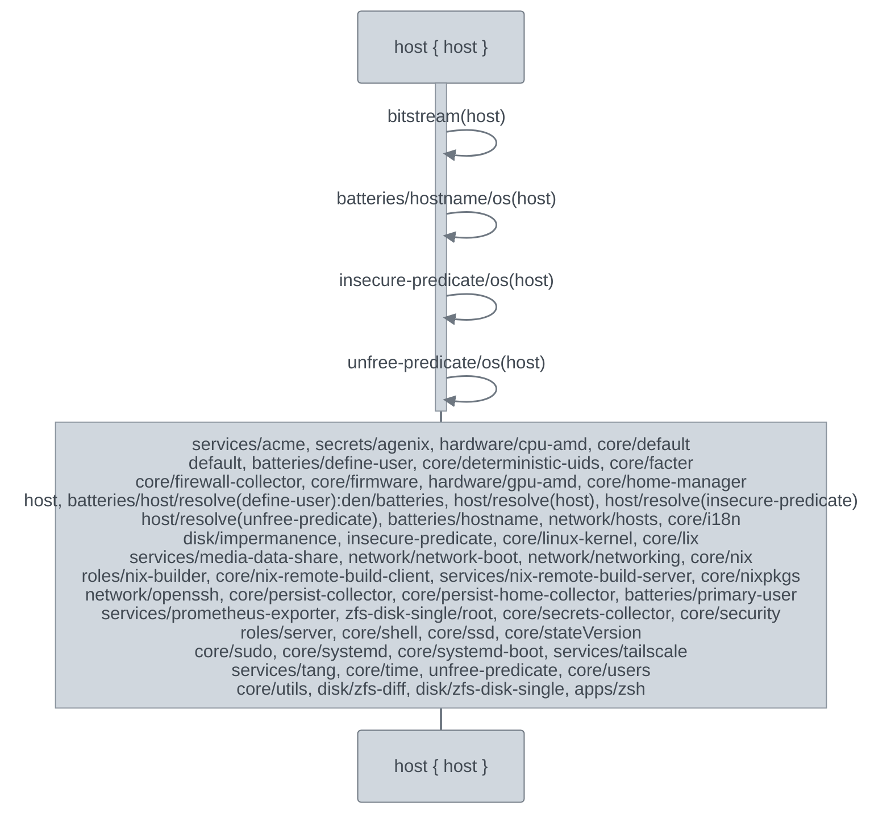

# Scope Sequence: bitstream

```mermaid
%%{init: {"theme":"base","themeVariables":{"activationBkgColor":"#d0d7de","activationBorderColor":"#8c959f","actorBkg":"#d0d7de","actorBorder":"#6e7781","actorLineColor":"#6e7781","actorTextColor":"#424a53","background":"#eaeef2","classText":"#424a53","clusterBkg":"#d0d7de","clusterBorder":"#8c959f","edgeLabelBackground":"#eaeef2","labelBoxBkgColor":"#d0d7de","labelBoxBorderColor":"#6e7781","labelTextColor":"#424a53","lineColor":"#6e7781","loopTextColor":"#424a53","mainBkg":"#d0d7de","nodeBkg":"#d0d7de","nodeBorder":"#6e7781","nodeTextColor":"#424a53","noteBkgColor":"#d0d7de","noteBorderColor":"#8c959f","noteTextColor":"#424a53","pie1":"#fa4549","pie2":"#e16f24","pie3":"#bf8700","pie4":"#2da44e","pie5":"#339D9B","pie6":"#218bff","pie7":"#a475f9","pie8":"#4d2d00","pieLegendTextColor":"#424a53","pieOuterStrokeColor":"#8c959f","pieSectionTextColor":"#424a53","pieStrokeColor":"#8c959f","pieTitleTextColor":"#424a53","primaryBorderColor":"#6e7781","primaryColor":"#d0d7de","primaryTextColor":"#424a53","secondBkg":"#d0d7de","secondaryBorderColor":"#8c959f","secondaryColor":"#d0d7de","secondaryTextColor":"#424a53","sequenceNumberColor":"#eaeef2","signalColor":"#6e7781","signalTextColor":"#424a53","tertiaryBorderColor":"#8c959f","tertiaryColor":"#d0d7de","tertiaryTextColor":"#424a53","textColor":"#424a53","titleColor":"#424a53"}}}%%
sequenceDiagram
    participant host as host { host }


    activate host
    host ->> host: bitstream(host)
    host ->> host: batteries/hostname/os(host)
    host ->> host: insecure-predicate/os(host)
    host ->> host: unfree-predicate/os(host)
    deactivate host
    Note over host: services/acme, secrets/agenix, hardware/cpu-amd, core/default<br/>default, batteries/define-user, core/deterministic-uids, core/facter<br/>core/firewall-collector, core/firmware, hardware/gpu-amd, core/home-manager<br/>host, batteries/host/resolve(define-user):den/batteries, host/resolve(host), host/resolve(insecure-predicate)<br/>host/resolve(unfree-predicate), batteries/hostname, network/hosts, core/i18n<br/>disk/impermanence, insecure-predicate, core/linux-kernel, core/lix<br/>services/media-data-share, network/network-boot, network/networking, core/nix<br/>roles/nix-builder, core/nix-remote-build-client, services/nix-remote-build-server, core/nixpkgs<br/>network/openssh, core/persist-collector, core/persist-home-collector, batteries/primary-user<br/>services/prometheus-exporter, zfs-disk-single/root, core/secrets-collector, core/security<br/>roles/server, core/shell, core/ssd, core/stateVersion<br/>core/sudo, core/systemd, core/systemd-boot, services/tailscale<br/>services/tang, core/time, unfree-predicate, core/users<br/>core/utils, disk/zfs-diff, disk/zfs-disk-single, apps/zsh
```
