# Aspect Hierarchy: blade



```mermaid
%%{init: {"elk":{"mergeEdges":true,"nodePlacementStrategy":"BRANDES_KOEPF"},"flowchart":{"wrappingWidth":600},"layout":"elk","theme":"base","themeVariables":{"activationBkgColor":"#313244","activationBorderColor":"#6c7086","actorBkg":"#313244","actorBorder":"#a6adc8","actorLineColor":"#a6adc8","actorTextColor":"#cdd6f4","background":"#1e1e2e","classText":"#cdd6f4","clusterBkg":"#313244","clusterBorder":"#6c7086","edgeLabelBackground":"#1e1e2e","labelBoxBkgColor":"#313244","labelBoxBorderColor":"#a6adc8","labelTextColor":"#cdd6f4","lineColor":"#a6adc8","loopTextColor":"#cdd6f4","mainBkg":"#313244","nodeBkg":"#313244","nodeBorder":"#a6adc8","nodeTextColor":"#cdd6f4","noteBkgColor":"#313244","noteBorderColor":"#6c7086","noteTextColor":"#cdd6f4","pie1":"#f38ba8","pie2":"#fab387","pie3":"#f9e2af","pie4":"#a6e3a1","pie5":"#94e2d5","pie6":"#89b4fa","pie7":"#cba6f7","pie8":"#f2cdcd","pieLegendTextColor":"#cdd6f4","pieOuterStrokeColor":"#6c7086","pieSectionTextColor":"#cdd6f4","pieStrokeColor":"#6c7086","pieTitleTextColor":"#cdd6f4","primaryBorderColor":"#a6adc8","primaryColor":"#313244","primaryTextColor":"#cdd6f4","secondBkg":"#313244","secondaryBorderColor":"#6c7086","secondaryColor":"#313244","secondaryTextColor":"#cdd6f4","sequenceNumberColor":"#1e1e2e","signalColor":"#a6adc8","signalTextColor":"#cdd6f4","tertiaryBorderColor":"#6c7086","tertiaryColor":"#313244","tertiaryTextColor":"#cdd6f4","textColor":"#cdd6f4","titleColor":"#cdd6f4"}}}%%
graph LR
  blade([blade]):::root

  subgraph ctx_host_blade["host: blade"]
  hardware__adb[/"hardware/adb"\]:::hardware__adb_c
  secrets__agenix[/"secrets/agenix"\]:::secrets__agenix_c
  apps__alacritty[/"apps/alacritty"\]:::apps__alacritty_c
  hardware__audio[/"hardware/audio"\]:::hardware__audio_c
  apps__bat[/"apps/bat"\]:::apps__bat_c
  hardware__bluetooth[/"hardware/bluetooth"\]:::hardware__bluetooth_c
  apps__claude[/"apps/claude"\]:::apps__claude_c
  collect_bgp_peers["collect-bgp-peers"]:::collect_bgp_peers_c
  collect_host_addrs["collect-host-addrs"]:::collect_host_addrs_c
  collect_k3s_nodes["collect-k3s-nodes"]:::collect_k3s_nodes_c
  collect_ollama_endpoints["collect-ollama-endpoints"]:::collect_ollama_endpoints_c
  collect_prometheus_targets["collect-prometheus-targets"]:::collect_prometheus_targets_c
  collect_thunderbolt_mesh_peers["collect-thunderbolt-mesh-peers"]:::collect_thunderbolt_mesh_peers_c
  collect_vault_peers["collect-vault-peers"]:::collect_vault_peers_c
  hardware__coolercontrol[/"hardware/coolercontrol"\]:::hardware__coolercontrol_c
  hardware__cpu_intel[/"hardware/cpu-intel"\]:::hardware__cpu_intel_c
  hardware__ddcutil[/"hardware/ddcutil"\]:::hardware__ddcutil_c
  core__default[/"core/default"\]:::core__default_c
  den__batteries__define_user[/"batteries/define-user"\]:::den__batteries__define_user_c
  core__deterministic_uids[/"core/deterministic-uids"\]:::core__deterministic_uids_c
  roles__dev[/"roles/dev"\]:::roles__dev_c
  roles__dev_gui[/"roles/dev-gui"\]:::roles__dev_gui_c
  apps__direnv[/"apps/direnv"\]:::apps__direnv_c
  apps__discord[/"apps/discord"\]:::apps__discord_c
  apps__emulation[/"apps/emulation"\]:::apps__emulation_c
  apps__eza[/"apps/eza"\]:::apps__eza_c
  core__facter[/"core/facter"\]:::core__facter_c
  apps__firefox[/"apps/firefox"\]:::apps__firefox_c
  core__firewall_collector[/"core/firewall-collector"\]:::core__firewall_collector_c
  core__firmware[/"core/firmware"\]:::core__firmware_c
  desktop__fonts[/"desktop/fonts"\]:::desktop__fonts_c
  hardware__gamepad[/"hardware/gamepad"\]:::hardware__gamepad_c
  roles__gaming[/"roles/gaming"\]:::roles__gaming_c
  desktop__gdm[/"desktop/gdm"\]:::desktop__gdm_c
  apps__git[/"apps/git"\]:::apps__git_c
  apps__gitkraken[/"apps/gitkraken"\]:::apps__gitkraken_c
  desktop__gnome[/"desktop/gnome"\]:::desktop__gnome_c
  apps__gpg[/"apps/gpg"\]:::apps__gpg_c
  hardware__gpu_intel[/"hardware/gpu-intel"\]:::hardware__gpu_intel_c
  hardware__gpu_nvidia[/"hardware/gpu-nvidia"\]:::hardware__gpu_nvidia_c
  hardware__gpu_nvidia_prime[/"hardware/gpu-nvidia-prime"\]:::hardware__gpu_nvidia_prime_c
  core__home_manager[/"core/home-manager"\]:::core__home_manager_c
  den__batteries__hostname[/"batteries/hostname"\]:::den__batteries__hostname_c
  den__batteries__hostname__os{{"batteries/hostname/os"}}:::den__batteries__hostname__os_c
  network__hosts[/"network/hosts"\]:::network__hosts_c
  desktop__hyprland[/"desktop/hyprland"\]:::desktop__hyprland_c
  core__i18n[/"core/i18n"\]:::core__i18n_c
  disk__impermanence[/"disk/impermanence"\]:::disk__impermanence_c
  insecure_predicate["insecure-predicate"]:::insecure_predicate_c
  insecure_predicate__os{{"insecure-predicate/os"}}:::insecure_predicate__os_c
  apps__jellyfin_client[/"apps/jellyfin-client"\]:::apps__jellyfin_client_c
  apps__k9s[/"apps/k9s"\]:::apps__k9s_c
  hardware__keyboard[/"hardware/keyboard"\]:::hardware__keyboard_c
  apps__kitty[/"apps/kitty"\]:::apps__kitty_c
  apps__kube_tools[/"apps/kube-tools"\]:::apps__kube_tools_c
  roles__laptop[/"roles/laptop"\]:::roles__laptop_c
  virtualization__libvirt[/"virtualization/libvirt"\]:::virtualization__libvirt_c
  core__linux_kernel[/"core/linux-kernel"\]:::core__linux_kernel_c
  core__lix[/"core/lix"\]:::core__lix_c
  apps__mangohud[/"apps/mangohud"\]:::apps__mangohud_c
  roles__media[/"roles/media"\]:::roles__media_c
  apps__misc_tools[/"apps/misc-tools"\]:::apps__misc_tools_c
  apps__mpv[/"apps/mpv"\]:::apps__mpv_c
  network__network_boot[/"network/network-boot"\]:::network__network_boot_c
  network__network_manager[/"network/network-manager"\]:::network__network_manager_c
  network__networking[/"network/networking"\]:::network__networking_c
  core__nix[/"core/nix"\]:::core__nix_c
  apps__nix_index[/"apps/nix-index"\]:::apps__nix_index_c
  system__nix_ld[/"system/nix-ld"\]:::system__nix_ld_c
  core__nix_remote_build_client[/"core/nix-remote-build-client"\]:::core__nix_remote_build_client_c
  core__nixpkgs[/"core/nixpkgs"\]:::core__nixpkgs_c
  apps__nvf[/"apps/nvf"\]:::apps__nvf_c
  apps__obs_studio[/"apps/obs-studio"\]:::apps__obs_studio_c
  apps__obsidian[/"apps/obsidian"\]:::apps__obsidian_c
  network__openssh[/"network/openssh"\]:::network__openssh_c
  os_to_host["os-to-host"]:::os_to_host_c
  hardware__performance[/"hardware/performance"\]:::hardware__performance_c
  core__persist_collector[/"core/persist-collector"\]:::core__persist_collector_c
  core__persist_home_collector[/"core/persist-home-collector"\]:::core__persist_home_collector_c
  den__batteries__primary_user[/"batteries/primary-user"\]:::den__batteries__primary_user_c
  apps__python[/"apps/python"\]:::apps__python_c
  apps__qbittorrent[/"apps/qbittorrent"\]:::apps__qbittorrent_c
  hardware__razer[/"hardware/razer"\]:::hardware__razer_c
  disk__zfs_disk_single__root[/"zfs-disk-single/root"\]:::disk__zfs_disk_single__root_c
  core__secrets_collector[/"core/secrets-collector"\]:::core__secrets_collector_c
  core__security[/"core/security"\]:::core__security_c
  core__shell[/"core/shell"\]:::core__shell_c
  apps__spicetify[/"apps/spicetify"\]:::apps__spicetify_c
  core__ssd[/"core/ssd"\]:::core__ssd_c
  apps__ssh[/"apps/ssh"\]:::apps__ssh_c
  apps__starship[/"apps/starship"\]:::apps__starship_c
  core__stateVersion[/"core/stateVersion"\]:::core__stateVersion_c
  apps__steam[/"apps/steam"\]:::apps__steam_c
  desktop__stylix[/"desktop/stylix"\]:::desktop__stylix_c
  core__sudo[/"core/sudo"\]:::core__sudo_c
  apps__sunshine[/"apps/sunshine"\]:::apps__sunshine_c
  apps__sysmon[/"apps/sysmon"\]:::apps__sysmon_c
  core__systemd[/"core/systemd"\]:::core__systemd_c
  core__systemd_boot[/"core/systemd-boot"\]:::core__systemd_boot_c
  services__tailscale[/"services/tailscale"\]:::services__tailscale_c
  core__time[/"core/time"\]:::core__time_c
  unfree_predicate["unfree-predicate"]:::unfree_predicate_c
  unfree_predicate__os{{"unfree-predicate/os"}}:::unfree_predicate__os_c
  core__users[/"core/users"\]:::core__users_c
  core__utils[/"core/utils"\]:::core__utils_c
  desktop__uwsm[/"desktop/uwsm"\]:::desktop__uwsm_c
  apps__vscode[/"apps/vscode"\]:::apps__vscode_c
  network__wireless[/"network/wireless"\]:::network__wireless_c
  apps__wireshark[/"apps/wireshark"\]:::apps__wireshark_c
  roles__workstation[/"roles/workstation"\]:::roles__workstation_c
  desktop__xdg_portal[/"desktop/xdg-portal"\]:::desktop__xdg_portal_c
  desktop__xserver[/"desktop/xserver"\]:::desktop__xserver_c
  desktop__xwayland[/"desktop/xwayland"\]:::desktop__xwayland_c
  apps__yazi[/"apps/yazi"\]:::apps__yazi_c
  apps__youtube_music[/"apps/youtube-music"\]:::apps__youtube_music_c
  apps__yt_dlp[/"apps/yt-dlp"\]:::apps__yt_dlp_c
  apps__zathura[/"apps/zathura"\]:::apps__zathura_c
  apps__zellij[/"apps/zellij"\]:::apps__zellij_c
  disk__zfs_diff[/"disk/zfs-diff"\]:::disk__zfs_diff_c
  disk__zfs_disk_single[/"disk/zfs-disk-single"\]:::disk__zfs_disk_single_c
  apps__zoxide[/"apps/zoxide"\]:::apps__zoxide_c
  apps__zsh[/"apps/zsh"\]:::apps__zsh_c
  blade --> secrets__agenix
  blade --> hardware__cpu_intel
  blade --> core__default
  blade --> roles__dev
  blade --> roles__dev_gui
  blade --> apps__discord
  blade --> roles__gaming
  blade --> hardware__gpu_intel
  blade --> hardware__gpu_nvidia
  blade --> hardware__gpu_nvidia_prime
  blade --> desktop__hyprland
  blade --> disk__impermanence
  blade --> roles__laptop
  blade --> roles__media
  blade --> network__network_boot
  blade --> network__network_manager
  blade --> network__openssh
  blade --> hardware__performance
  blade --> hardware__razer
  blade --> services__tailscale
  blade --> desktop__uwsm
  blade --> roles__workstation
  blade --> disk__zfs_disk_single
  core__default --> core__deterministic_uids
  core__default --> core__facter
  core__default --> core__firmware
  core__default --> core__home_manager
  core__default --> network__hosts
  core__default --> core__i18n
  core__default --> core__linux_kernel
  core__default --> core__lix
  core__default --> network__networking
  core__default --> core__nix
  core__default --> core__nix_remote_build_client
  core__default --> core__nixpkgs
  core__default --> core__security
  core__default --> core__shell
  core__default --> core__ssd
  core__default --> core__stateVersion
  core__default --> core__sudo
  core__default --> core__systemd
  core__default --> core__systemd_boot
  core__default --> core__time
  core__default --> core__users
  core__default --> core__utils
  core__default --> apps__zsh
  den__batteries__hostname --> den__batteries__hostname__os
  disk__impermanence --> core__persist_collector
  disk__impermanence --> core__persist_home_collector
  disk__zfs_disk_single --> disk__zfs_disk_single__root
  disk__zfs_disk_single__root --> disk__zfs_diff
  insecure_predicate --> insecure_predicate__os
  roles__dev --> hardware__adb
  roles__dev --> apps__bat
  roles__dev --> apps__claude
  roles__dev --> apps__direnv
  roles__dev --> apps__eza
  roles__dev --> apps__git
  roles__dev --> apps__gpg
  roles__dev --> apps__k9s
  roles__dev --> apps__misc_tools
  roles__dev --> apps__nix_index
  roles__dev --> apps__nvf
  roles__dev --> apps__python
  roles__dev --> apps__ssh
  roles__dev --> apps__starship
  roles__dev --> apps__sysmon
  roles__dev --> apps__yazi
  roles__dev --> apps__zoxide
  roles__dev_gui --> apps__gitkraken
  roles__dev_gui --> apps__kube_tools
  roles__dev_gui --> apps__vscode
  roles__dev_gui --> apps__wireshark
  roles__dev_gui --> apps__zellij
  roles__gaming --> apps__emulation
  roles__gaming --> hardware__gamepad
  roles__gaming --> apps__mangohud
  roles__gaming --> system__nix_ld
  roles__gaming --> apps__steam
  roles__gaming --> apps__sunshine
  roles__laptop --> network__wireless
  roles__media --> apps__jellyfin_client
  roles__media --> apps__mpv
  roles__media --> apps__qbittorrent
  roles__media --> apps__spicetify
  roles__media --> apps__youtube_music
  roles__media --> apps__yt_dlp
  roles__workstation --> apps__alacritty
  roles__workstation --> hardware__audio
  roles__workstation --> hardware__bluetooth
  roles__workstation --> hardware__coolercontrol
  roles__workstation --> hardware__ddcutil
  roles__workstation --> apps__firefox
  roles__workstation --> desktop__fonts
  roles__workstation --> desktop__gdm
  roles__workstation --> desktop__gnome
  roles__workstation --> hardware__keyboard
  roles__workstation --> apps__kitty
  roles__workstation --> virtualization__libvirt
  roles__workstation --> apps__obs_studio
  roles__workstation --> apps__obsidian
  roles__workstation --> desktop__stylix
  roles__workstation --> desktop__xdg_portal
  roles__workstation --> desktop__xserver
  roles__workstation --> desktop__xwayland
  roles__workstation --> apps__zathura
  unfree_predicate --> unfree_predicate__os
  end


  classDef root fill:#89b4fa,stroke:#89b4fa,color:#1e1e2e,font-weight:bold
  classDef hardware__adb_c fill:#cba6f7,stroke:#cba6f7,color:#1e1e2e,stroke-width:3px
  classDef secrets__agenix_c fill:#89b4fa,stroke:#89b4fa,color:#1e1e2e,stroke-width:3px
  classDef apps__alacritty_c fill:#cba6f7,stroke:#cba6f7,color:#1e1e2e,stroke-width:3px
  classDef apps_c fill:#a6e3a1,stroke:#a6e3a1,color:#1e1e2e,stroke-dasharray: 3 3,stroke-width:1px
  classDef hardware__audio_c fill:#cba6f7,stroke:#cba6f7,color:#1e1e2e,stroke-width:3px
  classDef apps__bat_c fill:#f2cdcd,stroke:#f2cdcd,color:#1e1e2e,stroke-width:3px
  classDef blade_c fill:#f2cdcd,stroke:#f2cdcd,color:#1e1e2e,stroke-width:3px
  classDef hardware__bluetooth_c fill:#89b4fa,stroke:#89b4fa,color:#1e1e2e,stroke-width:3px
  classDef apps__claude_c fill:#f2cdcd,stroke:#f2cdcd,color:#1e1e2e,stroke-width:3px
  classDef collect_bgp_peers_c fill:#cba6f7,stroke:#cba6f7,color:#1e1e2e,stroke-width:2px,stroke-dasharray: 8 4
  classDef collect_host_addrs_c fill:#89b4fa,stroke:#89b4fa,color:#1e1e2e,stroke-width:2px,stroke-dasharray: 8 4
  classDef collect_k3s_nodes_c fill:#cba6f7,stroke:#cba6f7,color:#1e1e2e,stroke-width:2px,stroke-dasharray: 8 4
  classDef collect_ollama_endpoints_c fill:#cba6f7,stroke:#cba6f7,color:#1e1e2e,stroke-width:2px,stroke-dasharray: 8 4
  classDef collect_prometheus_targets_c fill:#cba6f7,stroke:#cba6f7,color:#1e1e2e,stroke-width:2px,stroke-dasharray: 8 4
  classDef collect_thunderbolt_mesh_peers_c fill:#cba6f7,stroke:#cba6f7,color:#1e1e2e,stroke-width:2px,stroke-dasharray: 8 4
  classDef collect_vault_peers_c fill:#89b4fa,stroke:#89b4fa,color:#1e1e2e,stroke-width:2px,stroke-dasharray: 8 4
  classDef hardware__coolercontrol_c fill:#89b4fa,stroke:#89b4fa,color:#1e1e2e,stroke-width:3px
  classDef core_c fill:#f9e2af,stroke:#f9e2af,color:#1e1e2e,stroke-dasharray: 3 3,stroke-width:1px
  classDef hardware__cpu_intel_c fill:#89b4fa,stroke:#89b4fa,color:#1e1e2e,stroke-width:3px
  classDef hardware__ddcutil_c fill:#89b4fa,stroke:#89b4fa,color:#1e1e2e,stroke-width:3px
  classDef core__default_c fill:#f2cdcd,stroke:#f2cdcd,color:#1e1e2e,stroke-width:3px
  classDef den__batteries__define_user_c fill:#89b4fa,stroke:#89b4fa,color:#1e1e2e,stroke-width:3px
  classDef desktop_c fill:#a6e3a1,stroke:#a6e3a1,color:#1e1e2e,stroke-dasharray: 3 3,stroke-width:1px
  classDef core__deterministic_uids_c fill:#89b4fa,stroke:#89b4fa,color:#1e1e2e,stroke-width:3px
  classDef roles__dev_c fill:#cba6f7,stroke:#cba6f7,color:#1e1e2e,stroke-width:3px
  classDef roles__dev_gui_c fill:#cba6f7,stroke:#cba6f7,color:#1e1e2e,stroke-width:3px
  classDef apps__direnv_c fill:#f2cdcd,stroke:#f2cdcd,color:#1e1e2e,stroke-width:3px
  classDef apps__discord_c fill:#f2cdcd,stroke:#f2cdcd,color:#1e1e2e,stroke-width:3px
  classDef disk_c fill:#a6e3a1,stroke:#a6e3a1,color:#1e1e2e,stroke-dasharray: 3 3,stroke-width:1px
  classDef apps__emulation_c fill:#cba6f7,stroke:#cba6f7,color:#1e1e2e,stroke-width:3px
  classDef apps__eza_c fill:#89b4fa,stroke:#89b4fa,color:#1e1e2e,stroke-width:3px
  classDef core__facter_c fill:#cba6f7,stroke:#cba6f7,color:#1e1e2e,stroke-width:3px
  classDef apps__firefox_c fill:#f2cdcd,stroke:#f2cdcd,color:#1e1e2e,stroke-width:3px
  classDef core__firewall_collector_c fill:#cba6f7,stroke:#cba6f7,color:#1e1e2e,stroke-width:2px
  classDef core__firmware_c fill:#89b4fa,stroke:#89b4fa,color:#1e1e2e,stroke-width:3px
  classDef desktop__fonts_c fill:#cba6f7,stroke:#cba6f7,color:#1e1e2e,stroke-width:3px
  classDef hardware__gamepad_c fill:#cba6f7,stroke:#cba6f7,color:#1e1e2e,stroke-width:3px
  classDef roles__gaming_c fill:#89b4fa,stroke:#89b4fa,color:#1e1e2e,stroke-width:3px
  classDef desktop__gdm_c fill:#f2cdcd,stroke:#f2cdcd,color:#1e1e2e,stroke-width:3px
  classDef apps__git_c fill:#cba6f7,stroke:#cba6f7,color:#1e1e2e,stroke-width:3px
  classDef apps__gitkraken_c fill:#89b4fa,stroke:#89b4fa,color:#1e1e2e,stroke-width:3px
  classDef desktop__gnome_c fill:#f2cdcd,stroke:#f2cdcd,color:#1e1e2e,stroke-width:3px
  classDef apps__gpg_c fill:#f2cdcd,stroke:#f2cdcd,color:#1e1e2e,stroke-width:3px
  classDef hardware__gpu_intel_c fill:#89b4fa,stroke:#89b4fa,color:#1e1e2e,stroke-width:3px
  classDef hardware__gpu_nvidia_c fill:#f2cdcd,stroke:#f2cdcd,color:#1e1e2e,stroke-width:3px
  classDef hardware__gpu_nvidia_prime_c fill:#cba6f7,stroke:#cba6f7,color:#1e1e2e,stroke-width:3px
  classDef hardware_c fill:#a6e3a1,stroke:#a6e3a1,color:#1e1e2e,stroke-dasharray: 3 3,stroke-width:1px
  classDef core__home_manager_c fill:#f2cdcd,stroke:#f2cdcd,color:#1e1e2e,stroke-width:3px
  classDef den__batteries__hostname_c fill:#89b4fa,stroke:#89b4fa,color:#1e1e2e,stroke-width:3px
  classDef den__batteries__hostname__os_c fill:#89b4fa,stroke:#89b4fa,color:#1e1e2e,stroke-width:2px
  classDef network__hosts_c fill:#cba6f7,stroke:#cba6f7,color:#1e1e2e,stroke-width:3px
  classDef desktop__hyprland_c fill:#89b4fa,stroke:#89b4fa,color:#1e1e2e,stroke-width:3px
  classDef core__i18n_c fill:#f2cdcd,stroke:#f2cdcd,color:#1e1e2e,stroke-width:3px
  classDef disk__impermanence_c fill:#f2cdcd,stroke:#f2cdcd,color:#1e1e2e,stroke-width:3px
  classDef insecure_predicate_c fill:#f2cdcd,stroke:#f2cdcd,color:#1e1e2e,stroke-width:3px
  classDef insecure_predicate__os_c fill:#89b4fa,stroke:#89b4fa,color:#1e1e2e,stroke-width:2px
  classDef apps__jellyfin_client_c fill:#f2cdcd,stroke:#f2cdcd,color:#1e1e2e,stroke-width:3px
  classDef apps__k9s_c fill:#f2cdcd,stroke:#f2cdcd,color:#1e1e2e,stroke-width:3px
  classDef hardware__keyboard_c fill:#89b4fa,stroke:#89b4fa,color:#1e1e2e,stroke-width:3px
  classDef apps__kitty_c fill:#cba6f7,stroke:#cba6f7,color:#1e1e2e,stroke-width:3px
  classDef apps__kube_tools_c fill:#f2cdcd,stroke:#f2cdcd,color:#1e1e2e,stroke-width:3px
  classDef roles__laptop_c fill:#89b4fa,stroke:#89b4fa,color:#1e1e2e,stroke-width:3px
  classDef virtualization__libvirt_c fill:#89b4fa,stroke:#89b4fa,color:#1e1e2e,stroke-width:3px
  classDef core__linux_kernel_c fill:#cba6f7,stroke:#cba6f7,color:#1e1e2e,stroke-width:3px
  classDef core__lix_c fill:#89b4fa,stroke:#89b4fa,color:#1e1e2e,stroke-width:3px
  classDef apps__mangohud_c fill:#f2cdcd,stroke:#f2cdcd,color:#1e1e2e,stroke-width:3px
  classDef roles__media_c fill:#cba6f7,stroke:#cba6f7,color:#1e1e2e,stroke-width:3px
  classDef apps__misc_tools_c fill:#cba6f7,stroke:#cba6f7,color:#1e1e2e,stroke-width:3px
  classDef apps__mpv_c fill:#89b4fa,stroke:#89b4fa,color:#1e1e2e,stroke-width:3px
  classDef network_c fill:#fab387,stroke:#fab387,color:#1e1e2e,stroke-dasharray: 3 3,stroke-width:1px
  classDef network__network_boot_c fill:#cba6f7,stroke:#cba6f7,color:#1e1e2e,stroke-width:3px
  classDef network__network_manager_c fill:#89b4fa,stroke:#89b4fa,color:#1e1e2e,stroke-width:3px
  classDef network__networking_c fill:#cba6f7,stroke:#cba6f7,color:#1e1e2e,stroke-width:3px
  classDef core__nix_c fill:#cba6f7,stroke:#cba6f7,color:#1e1e2e,stroke-width:3px
  classDef apps__nix_index_c fill:#f2cdcd,stroke:#f2cdcd,color:#1e1e2e,stroke-width:3px
  classDef system__nix_ld_c fill:#cba6f7,stroke:#cba6f7,color:#1e1e2e,stroke-width:3px
  classDef core__nix_remote_build_client_c fill:#f2cdcd,stroke:#f2cdcd,color:#1e1e2e,stroke-width:3px
  classDef core__nixpkgs_c fill:#89b4fa,stroke:#89b4fa,color:#1e1e2e,stroke-width:3px
  classDef apps__nvf_c fill:#89b4fa,stroke:#89b4fa,color:#1e1e2e,stroke-width:3px
  classDef apps__obs_studio_c fill:#89b4fa,stroke:#89b4fa,color:#1e1e2e,stroke-width:3px
  classDef apps__obsidian_c fill:#89b4fa,stroke:#89b4fa,color:#1e1e2e,stroke-width:3px
  classDef network__openssh_c fill:#89b4fa,stroke:#89b4fa,color:#1e1e2e,stroke-width:3px
  classDef os_to_host_c fill:#f2cdcd,stroke:#f2cdcd,color:#1e1e2e,stroke-width:2px,stroke-dasharray: 8 4
  classDef hardware__performance_c fill:#89b4fa,stroke:#89b4fa,color:#1e1e2e,stroke-width:3px
  classDef core__persist_collector_c fill:#f2cdcd,stroke:#f2cdcd,color:#1e1e2e,stroke-width:3px
  classDef core__persist_home_collector_c fill:#cba6f7,stroke:#cba6f7,color:#1e1e2e,stroke-width:3px
  classDef den__batteries__primary_user_c fill:#f2cdcd,stroke:#f2cdcd,color:#1e1e2e,stroke-dasharray: 3 3,stroke-width:1px
  classDef apps__python_c fill:#cba6f7,stroke:#cba6f7,color:#1e1e2e,stroke-width:3px
  classDef apps__qbittorrent_c fill:#89b4fa,stroke:#89b4fa,color:#1e1e2e,stroke-width:3px
  classDef hardware__razer_c fill:#89b4fa,stroke:#89b4fa,color:#1e1e2e,stroke-width:3px
  classDef roles_c fill:#a6e3a1,stroke:#a6e3a1,color:#1e1e2e,stroke-dasharray: 3 3,stroke-width:1px
  classDef disk__zfs_disk_single__root_c fill:#cba6f7,stroke:#cba6f7,color:#1e1e2e,stroke-width:3px
  classDef secrets_c fill:#f9e2af,stroke:#f9e2af,color:#1e1e2e,stroke-dasharray: 3 3,stroke-width:1px
  classDef core__secrets_collector_c fill:#cba6f7,stroke:#cba6f7,color:#1e1e2e,stroke-width:2px
  classDef core__security_c fill:#cba6f7,stroke:#cba6f7,color:#1e1e2e,stroke-width:3px
  classDef services_c fill:#a6e3a1,stroke:#a6e3a1,color:#1e1e2e,stroke-dasharray: 3 3,stroke-width:1px
  classDef core__shell_c fill:#89b4fa,stroke:#89b4fa,color:#1e1e2e,stroke-width:3px
  classDef apps__spicetify_c fill:#89b4fa,stroke:#89b4fa,color:#1e1e2e,stroke-width:3px
  classDef core__ssd_c fill:#f2cdcd,stroke:#f2cdcd,color:#1e1e2e,stroke-width:3px
  classDef apps__ssh_c fill:#89b4fa,stroke:#89b4fa,color:#1e1e2e,stroke-width:3px
  classDef apps__starship_c fill:#cba6f7,stroke:#cba6f7,color:#1e1e2e,stroke-width:3px
  classDef core__stateVersion_c fill:#89b4fa,stroke:#89b4fa,color:#1e1e2e,stroke-width:3px
  classDef apps__steam_c fill:#89b4fa,stroke:#89b4fa,color:#1e1e2e,stroke-width:3px
  classDef desktop__stylix_c fill:#f2cdcd,stroke:#f2cdcd,color:#1e1e2e,stroke-width:3px
  classDef core__sudo_c fill:#cba6f7,stroke:#cba6f7,color:#1e1e2e,stroke-width:3px
  classDef apps__sunshine_c fill:#cba6f7,stroke:#cba6f7,color:#1e1e2e,stroke-width:3px
  classDef apps__sysmon_c fill:#cba6f7,stroke:#cba6f7,color:#1e1e2e,stroke-width:3px
  classDef system_c fill:#f9e2af,stroke:#f9e2af,color:#1e1e2e,stroke-dasharray: 3 3,stroke-width:1px
  classDef core__systemd_c fill:#cba6f7,stroke:#cba6f7,color:#1e1e2e,stroke-width:3px
  classDef core__systemd_boot_c fill:#cba6f7,stroke:#cba6f7,color:#1e1e2e,stroke-width:3px
  classDef services__tailscale_c fill:#89b4fa,stroke:#89b4fa,color:#1e1e2e,stroke-width:3px
  classDef core__time_c fill:#89b4fa,stroke:#89b4fa,color:#1e1e2e,stroke-width:3px
  classDef unfree_predicate_c fill:#f2cdcd,stroke:#f2cdcd,color:#1e1e2e,stroke-width:3px
  classDef unfree_predicate__os_c fill:#cba6f7,stroke:#cba6f7,color:#1e1e2e,stroke-width:2px
  classDef core__users_c fill:#89b4fa,stroke:#89b4fa,color:#1e1e2e,stroke-width:3px
  classDef core__utils_c fill:#f2cdcd,stroke:#f2cdcd,color:#1e1e2e,stroke-width:3px
  classDef desktop__uwsm_c fill:#89b4fa,stroke:#89b4fa,color:#1e1e2e,stroke-width:3px
  classDef virtualization_c fill:#fab387,stroke:#fab387,color:#1e1e2e,stroke-dasharray: 3 3,stroke-width:1px
  classDef apps__vscode_c fill:#89b4fa,stroke:#89b4fa,color:#1e1e2e,stroke-width:3px
  classDef network__wireless_c fill:#cba6f7,stroke:#cba6f7,color:#1e1e2e,stroke-width:3px
  classDef apps__wireshark_c fill:#f2cdcd,stroke:#f2cdcd,color:#1e1e2e,stroke-width:3px
  classDef roles__workstation_c fill:#89b4fa,stroke:#89b4fa,color:#1e1e2e,stroke-width:3px
  classDef desktop__xdg_portal_c fill:#cba6f7,stroke:#cba6f7,color:#1e1e2e,stroke-width:3px
  classDef desktop__xserver_c fill:#89b4fa,stroke:#89b4fa,color:#1e1e2e,stroke-width:3px
  classDef desktop__xwayland_c fill:#cba6f7,stroke:#cba6f7,color:#1e1e2e,stroke-width:3px
  classDef apps__yazi_c fill:#f2cdcd,stroke:#f2cdcd,color:#1e1e2e,stroke-width:3px
  classDef apps__youtube_music_c fill:#f2cdcd,stroke:#f2cdcd,color:#1e1e2e,stroke-width:3px
  classDef apps__yt_dlp_c fill:#cba6f7,stroke:#cba6f7,color:#1e1e2e,stroke-width:3px
  classDef apps__zathura_c fill:#cba6f7,stroke:#cba6f7,color:#1e1e2e,stroke-width:3px
  classDef apps__zellij_c fill:#89b4fa,stroke:#89b4fa,color:#1e1e2e,stroke-width:3px
  classDef disk__zfs_diff_c fill:#89b4fa,stroke:#89b4fa,color:#1e1e2e,stroke-width:3px
  classDef disk__zfs_disk_single_c fill:#cba6f7,stroke:#cba6f7,color:#1e1e2e,stroke-width:3px
  classDef apps__zoxide_c fill:#cba6f7,stroke:#cba6f7,color:#1e1e2e,stroke-width:3px
  classDef apps__zsh_c fill:#f2cdcd,stroke:#f2cdcd,color:#1e1e2e,stroke-width:3px
style ctx_host_blade fill:#313244,stroke:#6c7086,stroke-width:2px
```
