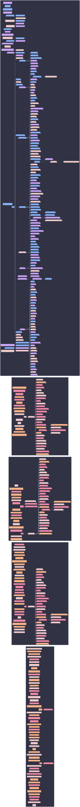

# Aspect Hierarchy: blade



```mermaid
%%{init: {"elk":{"mergeEdges":true,"nodePlacementStrategy":"BRANDES_KOEPF"},"flowchart":{"wrappingWidth":600},"layout":"elk","theme":"base","themeVariables":{"activationBkgColor":"#313244","activationBorderColor":"#6c7086","actorBkg":"#313244","actorBorder":"#a6adc8","actorLineColor":"#a6adc8","actorTextColor":"#cdd6f4","background":"#1e1e2e","classText":"#cdd6f4","clusterBkg":"#313244","clusterBorder":"#6c7086","edgeLabelBackground":"#1e1e2e","labelBoxBkgColor":"#313244","labelBoxBorderColor":"#a6adc8","labelTextColor":"#cdd6f4","lineColor":"#a6adc8","loopTextColor":"#cdd6f4","mainBkg":"#313244","nodeBkg":"#313244","nodeBorder":"#a6adc8","nodeTextColor":"#cdd6f4","noteBkgColor":"#313244","noteBorderColor":"#6c7086","noteTextColor":"#cdd6f4","pie1":"#f38ba8","pie2":"#fab387","pie3":"#f9e2af","pie4":"#a6e3a1","pie5":"#94e2d5","pie6":"#89b4fa","pie7":"#cba6f7","pie8":"#f2cdcd","pieLegendTextColor":"#cdd6f4","pieOuterStrokeColor":"#6c7086","pieSectionTextColor":"#cdd6f4","pieStrokeColor":"#6c7086","pieTitleTextColor":"#cdd6f4","primaryBorderColor":"#a6adc8","primaryColor":"#313244","primaryTextColor":"#cdd6f4","secondBkg":"#313244","secondaryBorderColor":"#6c7086","secondaryColor":"#313244","secondaryTextColor":"#cdd6f4","sequenceNumberColor":"#1e1e2e","signalColor":"#a6adc8","signalTextColor":"#cdd6f4","tertiaryBorderColor":"#6c7086","tertiaryColor":"#313244","tertiaryTextColor":"#cdd6f4","textColor":"#cdd6f4","titleColor":"#cdd6f4"}}}%%
graph LR
  blade([blade]):::root

  subgraph ctx_user_sini["user: sini"]
  _policy_droidHm_user_detect__0_["<policy:droidHm-user-detect>[0]"]:::_policy_droidHm_user_detect__0__c
  _policy_hm_user_detect__0__user_sini["<policy:hm-user-detect>[0]"]:::_policy_hm_user_detect__0__user_sini_c
  _policy_user_aspect_auto_include__3_["<policy:user-aspect-auto-include>[3]"]:::_policy_user_aspect_auto_include__3__c
  agenix_identity__sini_axon_01{{"agenix-identity/sini@axon-01"}}:::agenix_identity__sini_axon_01_c
  agenix_identity__sini_axon_02{{"agenix-identity/sini@axon-02"}}:::agenix_identity__sini_axon_02_c
  agenix_identity__sini_axon_03{{"agenix-identity/sini@axon-03"}}:::agenix_identity__sini_axon_03_c
  agenix_identity__sini_bitstream{{"agenix-identity/sini@bitstream"}}:::agenix_identity__sini_bitstream_c
  agenix_identity__sini_blade{{"agenix-identity/sini@blade"}}:::agenix_identity__sini_blade_c
  agenix_identity__sini_cortex{{"agenix-identity/sini@cortex"}}:::agenix_identity__sini_cortex_c
  agenix_identity__sini_patch{{"agenix-identity/sini@patch"}}:::agenix_identity__sini_patch_c
  agenix_identity__sini_slab{{"agenix-identity/sini@slab"}}:::agenix_identity__sini_slab_c
  agenix_identity__sini_uplink{{"agenix-identity/sini@uplink"}}:::agenix_identity__sini_uplink_c
  broadcast_syncthing_hub_shares_user_sini["broadcast-syncthing-hub-shares"]:::broadcast_syncthing_hub_shares_user_sini_c
  broadcast_syncthing_peers_user_sini["broadcast-syncthing-peers"]:::broadcast_syncthing_peers_user_sini_c
  broadcast_syncthing_peers_to_hub_user_sini["broadcast-syncthing-peers-to-hub"]:::broadcast_syncthing_peers_to_hub_user_sini_c
  droidHm_user_detect["droidHm-user-detect"]:::droidHm_user_detect_c
  drop_user_to_host_on_droid["drop-user-to-host-on-droid"]:::drop_user_to_host_on_droid_c
  expose_resolved_users_user_sini["expose-resolved-users"]:::expose_resolved_users_user_sini_c
  hm_user_detect_user_sini["hm-user-detect"]:::hm_user_detect_user_sini_c
  homeAarch64_to_hm["homeAarch64-to-hm"]:::homeAarch64_to_hm_c
  homeDarwin_to_hm["homeDarwin-to-hm"]:::homeDarwin_to_hm_c
  homeLinux_to_hm_user_sini["homeLinux-to-hm"]:::homeLinux_to_hm_user_sini_c
  den__batteries__host_aspects[/"batteries/host-aspects"\]:::den__batteries__host_aspects_c
  host_aspects_project["host-aspects-project"]:::host_aspects_project_c
  opkssh_authz__sini_axon_01{{"opkssh-authz/sini@axon-01"}}:::opkssh_authz__sini_axon_01_c
  opkssh_authz__sini_axon_02{{"opkssh-authz/sini@axon-02"}}:::opkssh_authz__sini_axon_02_c
  opkssh_authz__sini_axon_03{{"opkssh-authz/sini@axon-03"}}:::opkssh_authz__sini_axon_03_c
  opkssh_authz__sini_bitstream{{"opkssh-authz/sini@bitstream"}}:::opkssh_authz__sini_bitstream_c
  opkssh_authz__sini_blade{{"opkssh-authz/sini@blade"}}:::opkssh_authz__sini_blade_c
  opkssh_authz__sini_cortex{{"opkssh-authz/sini@cortex"}}:::opkssh_authz__sini_cortex_c
  opkssh_authz__sini_patch{{"opkssh-authz/sini@patch"}}:::opkssh_authz__sini_patch_c
  opkssh_authz__sini_slab{{"opkssh-authz/sini@slab"}}:::opkssh_authz__sini_slab_c
  opkssh_authz__sini_uplink{{"opkssh-authz/sini@uplink"}}:::opkssh_authz__sini_uplink_c
  os_to_host_user_sini["os-to-host"]:::os_to_host_user_sini_c
  core__network__syncthing__peer_user_sini[/"core/network/syncthing/peer"\]:::core__network__syncthing__peer_user_sini_c
  den__batteries__primary_user_sini_axon_01_{{"batteries/primary-user(sini@axon-01)"}}:::den__batteries__primary_user_sini_axon_01__c
  den__batteries__primary_user_sini_axon_02_{{"batteries/primary-user(sini@axon-02)"}}:::den__batteries__primary_user_sini_axon_02__c
  den__batteries__primary_user_sini_axon_03_{{"batteries/primary-user(sini@axon-03)"}}:::den__batteries__primary_user_sini_axon_03__c
  den__batteries__primary_user_sini_bitstream_{{"batteries/primary-user(sini@bitstream)"}}:::den__batteries__primary_user_sini_bitstream__c
  den__batteries__primary_user_sini_blade_{{"batteries/primary-user(sini@blade)"}}:::den__batteries__primary_user_sini_blade__c
  den__batteries__primary_user_sini_cortex_{{"batteries/primary-user(sini@cortex)"}}:::den__batteries__primary_user_sini_cortex__c
  den__batteries__primary_user_sini_patch_{{"batteries/primary-user(sini@patch)"}}:::den__batteries__primary_user_sini_patch__c
  den__batteries__primary_user_sini_slab_{{"batteries/primary-user(sini@slab)"}}:::den__batteries__primary_user_sini_slab__c
  den__batteries__primary_user_sini_uplink_{{"batteries/primary-user(sini@uplink)"}}:::den__batteries__primary_user_sini_uplink__c
  primary_user_for_owner["primary-user-for-owner"]:::primary_user_for_owner_c
  sini{{"sini"}}:::sini_c
  applications__media__spotify_player[/"media/spotify-player"\]:::applications__media__spotify_player_c
  user_aspect_auto_include_user_sini["user-aspect-auto-include"]:::user_aspect_auto_include_user_sini_c
  user_enrich__sini_axon_01{{"user-enrich/sini@axon-01"}}:::user_enrich__sini_axon_01_c
  user_enrich__sini_axon_02{{"user-enrich/sini@axon-02"}}:::user_enrich__sini_axon_02_c
  user_enrich__sini_axon_03{{"user-enrich/sini@axon-03"}}:::user_enrich__sini_axon_03_c
  user_enrich__sini_bitstream{{"user-enrich/sini@bitstream"}}:::user_enrich__sini_bitstream_c
  user_enrich__sini_blade{{"user-enrich/sini@blade"}}:::user_enrich__sini_blade_c
  user_enrich__sini_cortex{{"user-enrich/sini@cortex"}}:::user_enrich__sini_cortex_c
  user_enrich__sini_patch{{"user-enrich/sini@patch"}}:::user_enrich__sini_patch_c
  user_enrich__sini_slab{{"user-enrich/sini@slab"}}:::user_enrich__sini_slab_c
  user_enrich__sini_uplink{{"user-enrich/sini@uplink"}}:::user_enrich__sini_uplink_c
  user_to_host_user_sini["user-to-host"]:::user_to_host_user_sini_c
  _policy_user_aspect_auto_include__3_ --> applications__media__spotify_player
  sini --> den__batteries__host_aspects
  end
  subgraph ctx_user_vic["user: vic"]
  _policy_hm_user_detect__0__user_vic["<policy:hm-user-detect>[0]"]:::_policy_hm_user_detect__0__user_vic_c
  secrets__agenix_user_vic[/"secrets/agenix"\]:::secrets__agenix_user_vic_c
  agenix_identity__vic_axon_01{{"agenix-identity/vic@axon-01"}}:::agenix_identity__vic_axon_01_c
  agenix_identity__vic_axon_02{{"agenix-identity/vic@axon-02"}}:::agenix_identity__vic_axon_02_c
  agenix_identity__vic_axon_03{{"agenix-identity/vic@axon-03"}}:::agenix_identity__vic_axon_03_c
  agenix_identity__vic_bitstream{{"agenix-identity/vic@bitstream"}}:::agenix_identity__vic_bitstream_c
  agenix_identity__vic_blade{{"agenix-identity/vic@blade"}}:::agenix_identity__vic_blade_c
  agenix_identity__vic_cortex{{"agenix-identity/vic@cortex"}}:::agenix_identity__vic_cortex_c
  agenix_identity__vic_uplink{{"agenix-identity/vic@uplink"}}:::agenix_identity__vic_uplink_c
  core__systemd__boot_user_vic[/"core/systemd/boot"\]:::core__systemd__boot_user_vic_c
  broadcast_syncthing_hub_shares_user_vic["broadcast-syncthing-hub-shares"]:::broadcast_syncthing_hub_shares_user_vic_c
  broadcast_syncthing_peers_user_vic["broadcast-syncthing-peers"]:::broadcast_syncthing_peers_user_vic_c
  broadcast_syncthing_peers_to_hub_user_vic["broadcast-syncthing-peers-to-hub"]:::broadcast_syncthing_peers_to_hub_user_vic_c
  core__impermanence__btrfs_user_vic[/"core/impermanence/btrfs"\]:::core__impermanence__btrfs_user_vic_c
  roles__default_user_vic[/"roles/default"\]:::roles__default_user_vic_c
  core__users__deterministic_uids_user_vic[/"core/users/deterministic-uids"\]:::core__users__deterministic_uids_user_vic_c
  core__perf__disable_docs_user_vic[/"core/perf/disable-docs"\]:::core__perf__disable_docs_user_vic_c
  expose_resolved_users_user_vic["expose-resolved-users"]:::expose_resolved_users_user_vic_c
  core__system__facter_user_vic[/"core/system/facter"\]:::core__system__facter_user_vic_c
  core__system__firmware_user_vic[/"core/system/firmware"\]:::core__system__firmware_user_vic_c
  hm_user_detect_user_vic["hm-user-detect"]:::hm_user_detect_user_vic_c
  core__users__home_manager_shared_user_vic[/"core/users/home-manager-shared"\]:::core__users__home_manager_shared_user_vic_c
  homeLinux_to_hm_user_vic["homeLinux-to-hm"]:::homeLinux_to_hm_user_vic_c
  core__network__hostsfile_user_vic[/"core/network/hostsfile"\]:::core__network__hostsfile_user_vic_c
  core__localization__i18n_user_vic[/"core/localization/i18n"\]:::core__localization__i18n_user_vic_c
  core__impermanence_user_vic[/"core/impermanence"\]:::core__impermanence_user_vic_c
  core__system__linux_kernel_user_vic[/"core/system/linux-kernel"\]:::core__system__linux_kernel_user_vic_c
  core__network__syncthing__member_user_vic[/"core/network/syncthing/member"\]:::core__network__syncthing__member_user_vic_c
  core__network__networking_user_vic[/"core/network/networking"\]:::core__network__networking_user_vic_c
  core__nix_user_vic[/"core/nix"\]:::core__nix_user_vic_c
  core__nix__nixpkgs_user_vic[/"core/nix/nixpkgs"\]:::core__nix__nixpkgs_user_vic_c
  core__security__openssh_user_vic[/"core/security/openssh"\]:::core__security__openssh_user_vic_c
  core__security__opkssh_user_vic[/"core/security/opkssh"\]:::core__security__opkssh_user_vic_c
  opkssh_authz__vic_axon_01{{"opkssh-authz/vic@axon-01"}}:::opkssh_authz__vic_axon_01_c
  opkssh_authz__vic_axon_02{{"opkssh-authz/vic@axon-02"}}:::opkssh_authz__vic_axon_02_c
  opkssh_authz__vic_axon_03{{"opkssh-authz/vic@axon-03"}}:::opkssh_authz__vic_axon_03_c
  opkssh_authz__vic_bitstream{{"opkssh-authz/vic@bitstream"}}:::opkssh_authz__vic_bitstream_c
  opkssh_authz__vic_blade{{"opkssh-authz/vic@blade"}}:::opkssh_authz__vic_blade_c
  opkssh_authz__vic_cortex{{"opkssh-authz/vic@cortex"}}:::opkssh_authz__vic_cortex_c
  opkssh_authz__vic_uplink{{"opkssh-authz/vic@uplink"}}:::opkssh_authz__vic_uplink_c
  os_to_host_user_vic["os-to-host"]:::os_to_host_user_vic_c
  core__network__syncthing__peer_user_vic[/"core/network/syncthing/peer"\]:::core__network__syncthing__peer_user_vic_c
  core__impermanence__persist_collector_user_vic[/"core/impermanence/persist-collector"\]:::core__impermanence__persist_collector_user_vic_c
  core__impermanence__persist_home_collector_user_vic[/"core/impermanence/persist-home-collector"\]:::core__impermanence__persist_home_collector_user_vic_c
  core__security_user_vic[/"core/security"\]:::core__security_user_vic_c
  core__users__shell_user_vic[/"core/users/shell"\]:::core__users__shell_user_vic_c
  core__perf__ssd_user_vic[/"core/perf/ssd"\]:::core__perf__ssd_user_vic_c
  core__nix__stateVersion_user_vic[/"core/nix/stateVersion"\]:::core__nix__stateVersion_user_vic_c
  core__security__sudo_user_vic[/"core/security/sudo"\]:::core__security__sudo_user_vic_c
  core__systemd_user_vic[/"core/systemd"\]:::core__systemd_user_vic_c
  core__network__tailscale_user_vic[/"core/network/tailscale"\]:::core__network__tailscale_user_vic_c
  core__localization__time_user_vic[/"core/localization/time"\]:::core__localization__time_user_vic_c
  user_enrich__vic_axon_01{{"user-enrich/vic@axon-01"}}:::user_enrich__vic_axon_01_c
  user_enrich__vic_axon_02{{"user-enrich/vic@axon-02"}}:::user_enrich__vic_axon_02_c
  user_enrich__vic_axon_03{{"user-enrich/vic@axon-03"}}:::user_enrich__vic_axon_03_c
  user_enrich__vic_bitstream{{"user-enrich/vic@bitstream"}}:::user_enrich__vic_bitstream_c
  user_enrich__vic_blade{{"user-enrich/vic@blade"}}:::user_enrich__vic_blade_c
  user_enrich__vic_cortex{{"user-enrich/vic@cortex"}}:::user_enrich__vic_cortex_c
  user_enrich__vic_uplink{{"user-enrich/vic@uplink"}}:::user_enrich__vic_uplink_c
  user_to_host_user_vic["user-to-host"]:::user_to_host_user_vic_c
  core__users_user_vic[/"core/users"\]:::core__users_user_vic_c
  core__utils_user_vic[/"core/utils"\]:::core__utils_user_vic_c
  vic{{"vic"}}:::vic_c
  core__impermanence__zfs_user_vic[/"core/impermanence/zfs"\]:::core__impermanence__zfs_user_vic_c
  core__perf__zram_swap_user_vic[/"core/perf/zram-swap"\]:::core__perf__zram_swap_user_vic_c
  applications__shell__zsh_user_vic[/"applications/shell/zsh"\]:::applications__shell__zsh_user_vic_c
  core__impermanence_user_vic --> core__impermanence__btrfs_user_vic
  core__impermanence_user_vic --> core__impermanence__persist_collector_user_vic
  core__impermanence_user_vic --> core__impermanence__persist_home_collector_user_vic
  core__impermanence_user_vic --> core__impermanence__zfs_user_vic
  roles__default_user_vic --> secrets__agenix_user_vic
  roles__default_user_vic --> core__systemd__boot_user_vic
  roles__default_user_vic --> core__users__deterministic_uids_user_vic
  roles__default_user_vic --> core__perf__disable_docs_user_vic
  roles__default_user_vic --> core__system__facter_user_vic
  roles__default_user_vic --> core__system__firmware_user_vic
  roles__default_user_vic --> core__users__home_manager_shared_user_vic
  roles__default_user_vic --> core__network__hostsfile_user_vic
  roles__default_user_vic --> core__localization__i18n_user_vic
  roles__default_user_vic --> core__impermanence_user_vic
  roles__default_user_vic --> core__system__linux_kernel_user_vic
  roles__default_user_vic --> core__network__syncthing__member_user_vic
  roles__default_user_vic --> core__network__networking_user_vic
  roles__default_user_vic --> core__nix_user_vic
  roles__default_user_vic --> core__nix__nixpkgs_user_vic
  roles__default_user_vic --> core__security__openssh_user_vic
  roles__default_user_vic --> core__security__opkssh_user_vic
  roles__default_user_vic --> core__security_user_vic
  roles__default_user_vic --> core__users__shell_user_vic
  roles__default_user_vic --> core__perf__ssd_user_vic
  roles__default_user_vic --> core__nix__stateVersion_user_vic
  roles__default_user_vic --> core__security__sudo_user_vic
  roles__default_user_vic --> core__systemd_user_vic
  roles__default_user_vic --> core__network__tailscale_user_vic
  roles__default_user_vic --> core__localization__time_user_vic
  roles__default_user_vic --> core__users_user_vic
  roles__default_user_vic --> core__utils_user_vic
  roles__default_user_vic --> core__perf__zram_swap_user_vic
  roles__default_user_vic --> applications__shell__zsh_user_vic
  vic --> roles__default_user_vic
  end
  subgraph ctx_user_shuo["user: shuo"]
  _policy_hm_user_detect__0__user_shuo["<policy:hm-user-detect>[0]"]:::_policy_hm_user_detect__0__user_shuo_c
  _policy_user_aspect_auto_include__2_["<policy:user-aspect-auto-include>[2]"]:::_policy_user_aspect_auto_include__2__c
  secrets__agenix_user_shuo[/"secrets/agenix"\]:::secrets__agenix_user_shuo_c
  agenix_identity__shuo_blade{{"agenix-identity/shuo@blade"}}:::agenix_identity__shuo_blade_c
  agenix_identity__shuo_cortex{{"agenix-identity/shuo@cortex"}}:::agenix_identity__shuo_cortex_c
  core__systemd__boot_user_shuo[/"core/systemd/boot"\]:::core__systemd__boot_user_shuo_c
  broadcast_syncthing_hub_shares_user_shuo["broadcast-syncthing-hub-shares"]:::broadcast_syncthing_hub_shares_user_shuo_c
  broadcast_syncthing_peers_user_shuo["broadcast-syncthing-peers"]:::broadcast_syncthing_peers_user_shuo_c
  broadcast_syncthing_peers_to_hub_user_shuo["broadcast-syncthing-peers-to-hub"]:::broadcast_syncthing_peers_to_hub_user_shuo_c
  core__impermanence__btrfs_user_shuo[/"core/impermanence/btrfs"\]:::core__impermanence__btrfs_user_shuo_c
  roles__default_user_shuo[/"roles/default"\]:::roles__default_user_shuo_c
  core__users__deterministic_uids_user_shuo[/"core/users/deterministic-uids"\]:::core__users__deterministic_uids_user_shuo_c
  core__perf__disable_docs_user_shuo[/"core/perf/disable-docs"\]:::core__perf__disable_docs_user_shuo_c
  expose_resolved_users_user_shuo["expose-resolved-users"]:::expose_resolved_users_user_shuo_c
  core__system__facter_user_shuo[/"core/system/facter"\]:::core__system__facter_user_shuo_c
  applications__browsers__firefox_user_shuo[/"applications/browsers/firefox"\]:::applications__browsers__firefox_user_shuo_c
  core__system__firmware_user_shuo[/"core/system/firmware"\]:::core__system__firmware_user_shuo_c
  hm_user_detect_user_shuo["hm-user-detect"]:::hm_user_detect_user_shuo_c
  core__users__home_manager_shared_user_shuo[/"core/users/home-manager-shared"\]:::core__users__home_manager_shared_user_shuo_c
  homeLinux_to_hm_user_shuo["homeLinux-to-hm"]:::homeLinux_to_hm_user_shuo_c
  core__network__hostsfile_user_shuo[/"core/network/hostsfile"\]:::core__network__hostsfile_user_shuo_c
  core__localization__i18n_user_shuo[/"core/localization/i18n"\]:::core__localization__i18n_user_shuo_c
  core__impermanence_user_shuo[/"core/impermanence"\]:::core__impermanence_user_shuo_c
  core__system__linux_kernel_user_shuo[/"core/system/linux-kernel"\]:::core__system__linux_kernel_user_shuo_c
  core__network__syncthing__member_user_shuo[/"core/network/syncthing/member"\]:::core__network__syncthing__member_user_shuo_c
  core__network__networking_user_shuo[/"core/network/networking"\]:::core__network__networking_user_shuo_c
  core__nix_user_shuo[/"core/nix"\]:::core__nix_user_shuo_c
  core__nix__nixpkgs_user_shuo[/"core/nix/nixpkgs"\]:::core__nix__nixpkgs_user_shuo_c
  core__security__openssh_user_shuo[/"core/security/openssh"\]:::core__security__openssh_user_shuo_c
  core__security__opkssh_user_shuo[/"core/security/opkssh"\]:::core__security__opkssh_user_shuo_c
  opkssh_authz__shuo_blade{{"opkssh-authz/shuo@blade"}}:::opkssh_authz__shuo_blade_c
  opkssh_authz__shuo_cortex{{"opkssh-authz/shuo@cortex"}}:::opkssh_authz__shuo_cortex_c
  os_to_host_user_shuo["os-to-host"]:::os_to_host_user_shuo_c
  core__network__syncthing__peer_user_shuo[/"core/network/syncthing/peer"\]:::core__network__syncthing__peer_user_shuo_c
  core__impermanence__persist_collector_user_shuo[/"core/impermanence/persist-collector"\]:::core__impermanence__persist_collector_user_shuo_c
  core__impermanence__persist_home_collector_user_shuo[/"core/impermanence/persist-home-collector"\]:::core__impermanence__persist_home_collector_user_shuo_c
  core__security_user_shuo[/"core/security"\]:::core__security_user_shuo_c
  core__users__shell_user_shuo[/"core/users/shell"\]:::core__users__shell_user_shuo_c
  shuo{{"shuo"}}:::shuo_c
  applications__media__spicetify_user_shuo[/"applications/media/spicetify"\]:::applications__media__spicetify_user_shuo_c
  core__perf__ssd_user_shuo[/"core/perf/ssd"\]:::core__perf__ssd_user_shuo_c
  core__nix__stateVersion_user_shuo[/"core/nix/stateVersion"\]:::core__nix__stateVersion_user_shuo_c
  applications__gaming__steam_user_shuo[/"applications/gaming/steam"\]:::applications__gaming__steam_user_shuo_c
  core__security__sudo_user_shuo[/"core/security/sudo"\]:::core__security__sudo_user_shuo_c
  core__systemd_user_shuo[/"core/systemd"\]:::core__systemd_user_shuo_c
  core__network__tailscale_user_shuo[/"core/network/tailscale"\]:::core__network__tailscale_user_shuo_c
  core__localization__time_user_shuo[/"core/localization/time"\]:::core__localization__time_user_shuo_c
  user_aspect_auto_include_user_shuo["user-aspect-auto-include"]:::user_aspect_auto_include_user_shuo_c
  user_enrich__shuo_blade{{"user-enrich/shuo@blade"}}:::user_enrich__shuo_blade_c
  user_enrich__shuo_cortex{{"user-enrich/shuo@cortex"}}:::user_enrich__shuo_cortex_c
  user_to_host_user_shuo["user-to-host"]:::user_to_host_user_shuo_c
  core__users_user_shuo[/"core/users"\]:::core__users_user_shuo_c
  core__utils_user_shuo[/"core/utils"\]:::core__utils_user_shuo_c
  core__impermanence__zfs_user_shuo[/"core/impermanence/zfs"\]:::core__impermanence__zfs_user_shuo_c
  core__perf__zram_swap_user_shuo[/"core/perf/zram-swap"\]:::core__perf__zram_swap_user_shuo_c
  applications__shell__zsh_user_shuo[/"applications/shell/zsh"\]:::applications__shell__zsh_user_shuo_c
  _policy_user_aspect_auto_include__2_ --> applications__browsers__firefox_user_shuo
  _policy_user_aspect_auto_include__2_ --> applications__media__spicetify_user_shuo
  _policy_user_aspect_auto_include__2_ --> applications__gaming__steam_user_shuo
  core__impermanence_user_shuo --> core__impermanence__btrfs_user_shuo
  core__impermanence_user_shuo --> core__impermanence__persist_collector_user_shuo
  core__impermanence_user_shuo --> core__impermanence__persist_home_collector_user_shuo
  core__impermanence_user_shuo --> core__impermanence__zfs_user_shuo
  roles__default_user_shuo --> secrets__agenix_user_shuo
  roles__default_user_shuo --> core__systemd__boot_user_shuo
  roles__default_user_shuo --> core__users__deterministic_uids_user_shuo
  roles__default_user_shuo --> core__perf__disable_docs_user_shuo
  roles__default_user_shuo --> core__system__facter_user_shuo
  roles__default_user_shuo --> core__system__firmware_user_shuo
  roles__default_user_shuo --> core__users__home_manager_shared_user_shuo
  roles__default_user_shuo --> core__network__hostsfile_user_shuo
  roles__default_user_shuo --> core__localization__i18n_user_shuo
  roles__default_user_shuo --> core__impermanence_user_shuo
  roles__default_user_shuo --> core__system__linux_kernel_user_shuo
  roles__default_user_shuo --> core__network__syncthing__member_user_shuo
  roles__default_user_shuo --> core__network__networking_user_shuo
  roles__default_user_shuo --> core__nix_user_shuo
  roles__default_user_shuo --> core__nix__nixpkgs_user_shuo
  roles__default_user_shuo --> core__security__openssh_user_shuo
  roles__default_user_shuo --> core__security__opkssh_user_shuo
  roles__default_user_shuo --> core__security_user_shuo
  roles__default_user_shuo --> core__users__shell_user_shuo
  roles__default_user_shuo --> core__perf__ssd_user_shuo
  roles__default_user_shuo --> core__nix__stateVersion_user_shuo
  roles__default_user_shuo --> core__security__sudo_user_shuo
  roles__default_user_shuo --> core__systemd_user_shuo
  roles__default_user_shuo --> core__network__tailscale_user_shuo
  roles__default_user_shuo --> core__localization__time_user_shuo
  roles__default_user_shuo --> core__users_user_shuo
  roles__default_user_shuo --> core__utils_user_shuo
  roles__default_user_shuo --> core__perf__zram_swap_user_shuo
  roles__default_user_shuo --> applications__shell__zsh_user_shuo
  shuo --> roles__default_user_shuo
  end
  subgraph ctx_user_will["user: will"]
  _policy_hm_user_detect__0__user_will["<policy:hm-user-detect>[0]"]:::_policy_hm_user_detect__0__user_will_c
  secrets__agenix_user_will[/"secrets/agenix"\]:::secrets__agenix_user_will_c
  agenix_identity__will_blade{{"agenix-identity/will@blade"}}:::agenix_identity__will_blade_c
  agenix_identity__will_cortex{{"agenix-identity/will@cortex"}}:::agenix_identity__will_cortex_c
  core__systemd__boot_user_will[/"core/systemd/boot"\]:::core__systemd__boot_user_will_c
  broadcast_syncthing_hub_shares_user_will["broadcast-syncthing-hub-shares"]:::broadcast_syncthing_hub_shares_user_will_c
  broadcast_syncthing_peers_user_will["broadcast-syncthing-peers"]:::broadcast_syncthing_peers_user_will_c
  broadcast_syncthing_peers_to_hub_user_will["broadcast-syncthing-peers-to-hub"]:::broadcast_syncthing_peers_to_hub_user_will_c
  core__impermanence__btrfs_user_will[/"core/impermanence/btrfs"\]:::core__impermanence__btrfs_user_will_c
  roles__default_user_will[/"roles/default"\]:::roles__default_user_will_c
  core__users__deterministic_uids_user_will[/"core/users/deterministic-uids"\]:::core__users__deterministic_uids_user_will_c
  core__perf__disable_docs_user_will[/"core/perf/disable-docs"\]:::core__perf__disable_docs_user_will_c
  expose_resolved_users_user_will["expose-resolved-users"]:::expose_resolved_users_user_will_c
  core__system__facter_user_will[/"core/system/facter"\]:::core__system__facter_user_will_c
  core__system__firmware_user_will[/"core/system/firmware"\]:::core__system__firmware_user_will_c
  hm_user_detect_user_will["hm-user-detect"]:::hm_user_detect_user_will_c
  core__users__home_manager_shared_user_will[/"core/users/home-manager-shared"\]:::core__users__home_manager_shared_user_will_c
  homeLinux_to_hm_user_will["homeLinux-to-hm"]:::homeLinux_to_hm_user_will_c
  core__network__hostsfile_user_will[/"core/network/hostsfile"\]:::core__network__hostsfile_user_will_c
  core__localization__i18n_user_will[/"core/localization/i18n"\]:::core__localization__i18n_user_will_c
  core__impermanence_user_will[/"core/impermanence"\]:::core__impermanence_user_will_c
  core__system__linux_kernel_user_will[/"core/system/linux-kernel"\]:::core__system__linux_kernel_user_will_c
  core__network__syncthing__member_user_will[/"core/network/syncthing/member"\]:::core__network__syncthing__member_user_will_c
  core__network__networking_user_will[/"core/network/networking"\]:::core__network__networking_user_will_c
  core__nix_user_will[/"core/nix"\]:::core__nix_user_will_c
  core__nix__nixpkgs_user_will[/"core/nix/nixpkgs"\]:::core__nix__nixpkgs_user_will_c
  core__security__openssh_user_will[/"core/security/openssh"\]:::core__security__openssh_user_will_c
  core__security__opkssh_user_will[/"core/security/opkssh"\]:::core__security__opkssh_user_will_c
  opkssh_authz__will_blade{{"opkssh-authz/will@blade"}}:::opkssh_authz__will_blade_c
  opkssh_authz__will_cortex{{"opkssh-authz/will@cortex"}}:::opkssh_authz__will_cortex_c
  os_to_host_user_will["os-to-host"]:::os_to_host_user_will_c
  core__network__syncthing__peer_user_will[/"core/network/syncthing/peer"\]:::core__network__syncthing__peer_user_will_c
  core__impermanence__persist_collector_user_will[/"core/impermanence/persist-collector"\]:::core__impermanence__persist_collector_user_will_c
  core__impermanence__persist_home_collector_user_will[/"core/impermanence/persist-home-collector"\]:::core__impermanence__persist_home_collector_user_will_c
  core__security_user_will[/"core/security"\]:::core__security_user_will_c
  core__users__shell_user_will[/"core/users/shell"\]:::core__users__shell_user_will_c
  core__perf__ssd_user_will[/"core/perf/ssd"\]:::core__perf__ssd_user_will_c
  core__nix__stateVersion_user_will[/"core/nix/stateVersion"\]:::core__nix__stateVersion_user_will_c
  core__security__sudo_user_will[/"core/security/sudo"\]:::core__security__sudo_user_will_c
  core__systemd_user_will[/"core/systemd"\]:::core__systemd_user_will_c
  core__network__tailscale_user_will[/"core/network/tailscale"\]:::core__network__tailscale_user_will_c
  core__localization__time_user_will[/"core/localization/time"\]:::core__localization__time_user_will_c
  user_enrich__will_blade{{"user-enrich/will@blade"}}:::user_enrich__will_blade_c
  user_enrich__will_cortex{{"user-enrich/will@cortex"}}:::user_enrich__will_cortex_c
  user_to_host_user_will["user-to-host"]:::user_to_host_user_will_c
  core__users_user_will[/"core/users"\]:::core__users_user_will_c
  core__utils_user_will[/"core/utils"\]:::core__utils_user_will_c
  will{{"will"}}:::will_c
  core__impermanence__zfs_user_will[/"core/impermanence/zfs"\]:::core__impermanence__zfs_user_will_c
  core__perf__zram_swap_user_will[/"core/perf/zram-swap"\]:::core__perf__zram_swap_user_will_c
  applications__shell__zsh_user_will[/"applications/shell/zsh"\]:::applications__shell__zsh_user_will_c
  core__impermanence_user_will --> core__impermanence__btrfs_user_will
  core__impermanence_user_will --> core__impermanence__persist_collector_user_will
  core__impermanence_user_will --> core__impermanence__persist_home_collector_user_will
  core__impermanence_user_will --> core__impermanence__zfs_user_will
  roles__default_user_will --> secrets__agenix_user_will
  roles__default_user_will --> core__systemd__boot_user_will
  roles__default_user_will --> core__users__deterministic_uids_user_will
  roles__default_user_will --> core__perf__disable_docs_user_will
  roles__default_user_will --> core__system__facter_user_will
  roles__default_user_will --> core__system__firmware_user_will
  roles__default_user_will --> core__users__home_manager_shared_user_will
  roles__default_user_will --> core__network__hostsfile_user_will
  roles__default_user_will --> core__localization__i18n_user_will
  roles__default_user_will --> core__impermanence_user_will
  roles__default_user_will --> core__system__linux_kernel_user_will
  roles__default_user_will --> core__network__syncthing__member_user_will
  roles__default_user_will --> core__network__networking_user_will
  roles__default_user_will --> core__nix_user_will
  roles__default_user_will --> core__nix__nixpkgs_user_will
  roles__default_user_will --> core__security__openssh_user_will
  roles__default_user_will --> core__security__opkssh_user_will
  roles__default_user_will --> core__security_user_will
  roles__default_user_will --> core__users__shell_user_will
  roles__default_user_will --> core__perf__ssd_user_will
  roles__default_user_will --> core__nix__stateVersion_user_will
  roles__default_user_will --> core__security__sudo_user_will
  roles__default_user_will --> core__systemd_user_will
  roles__default_user_will --> core__network__tailscale_user_will
  roles__default_user_will --> core__localization__time_user_will
  roles__default_user_will --> core__users_user_will
  roles__default_user_will --> core__utils_user_will
  roles__default_user_will --> core__perf__zram_swap_user_will
  roles__default_user_will --> applications__shell__zsh_user_will
  will --> roles__default_user_will
  end
  subgraph ctx_host_blade["host: blade"]
  hardware__adb[/"hardware/adb"\]:::hardware__adb_c
  secrets__agenix_host_blade[/"secrets/agenix"\]:::secrets__agenix_host_blade_c
  agenix__blade{{"agenix/blade"}}:::agenix__blade_c
  applications__terminals__alacritty[/"terminals/alacritty"\]:::applications__terminals__alacritty_c
  applications__dev__editor__codium__antigravity[/"codium/antigravity"\]:::applications__dev__editor__codium__antigravity_c
  applications__shell__archive[/"shell/archive"\]:::applications__shell__archive_c
  hardware__audio[/"hardware/audio"\]:::hardware__audio_c
  applications__dev__shell__bat[/"shell/bat"\]:::applications__dev__shell__bat_c
  applications__dev__ai__beads[/"ai/beads"\]:::applications__dev__ai__beads_c
  hardware__bluetooth[/"hardware/bluetooth"\]:::hardware__bluetooth_c
  core__systemd__boot_host_blade[/"core/systemd/boot"\]:::core__systemd__boot_host_blade_c
  applications__dev__shell__bottom[/"shell/bottom"\]:::applications__dev__shell__bottom_c
  applications__dev__shell__btop[/"shell/btop"\]:::applications__dev__shell__btop_c
  core__impermanence__btrfs_host_blade[/"core/impermanence/btrfs"\]:::core__impermanence__btrfs_host_blade_c
  applications__dev__lang__c[/"lang/c"\]:::applications__dev__lang__c_c
  applications__browsers__chromium[/"browsers/chromium"\]:::applications__browsers__chromium_c
  applications__dev__ai__claude[/"ai/claude"\]:::applications__dev__ai__claude_c
  applications__dev__ai__mcp__codebase_memory[/"mcp/codebase-memory"\]:::applications__dev__ai__mcp__codebase_memory_c
  collect_bgp_peers["collect-bgp-peers"]:::collect_bgp_peers_c
  collect_container_registries["collect-container-registries"]:::collect_container_registries_c
  collect_host_addrs["collect-host-addrs"]:::collect_host_addrs_c
  collect_k3s_nodes["collect-k3s-nodes"]:::collect_k3s_nodes_c
  collect_ollama_endpoints["collect-ollama-endpoints"]:::collect_ollama_endpoints_c
  collect_prometheus_targets["collect-prometheus-targets"]:::collect_prometheus_targets_c
  collect_thunderbolt_mesh_peers["collect-thunderbolt-mesh-peers"]:::collect_thunderbolt_mesh_peers_c
  collect_vault_peers["collect-vault-peers"]:::collect_vault_peers_c
  core__secrets__collector[/"secrets/collector"\]:::core__secrets__collector_c
  hardware__coolercontrol[/"hardware/coolercontrol"\]:::hardware__coolercontrol_c
  applications__dev__editor__codium__core[/"codium/core"\]:::applications__dev__editor__codium__core_c
  applications__dev__k8s__core[/"k8s/core"\]:::applications__dev__k8s__core_c
  applications__shell__data[/"shell/data"\]:::applications__shell__data_c
  hardware__ddcutil[/"hardware/ddcutil"\]:::hardware__ddcutil_c
  roles__default_host_blade[/"roles/default"\]:::roles__default_host_blade_c
  den__batteries__define_user[/"batteries/define-user"\]:::den__batteries__define_user_c
  den__batteries__define_user__shuo_blade{{"batteries/define-user/shuo@blade"}}:::den__batteries__define_user__shuo_blade_c
  den__batteries__define_user__sini_blade{{"batteries/define-user/sini@blade"}}:::den__batteries__define_user__sini_blade_c
  den__batteries__define_user__vic_blade{{"batteries/define-user/vic@blade"}}:::den__batteries__define_user__vic_blade_c
  den__batteries__define_user__will_blade{{"batteries/define-user/will@blade"}}:::den__batteries__define_user__will_blade_c
  applications__dev__git__delta[/"git/delta"\]:::applications__dev__git__delta_c
  core__users__deterministic_uids_host_blade[/"core/users/deterministic-uids"\]:::core__users__deterministic_uids_host_blade_c
  roles__dev[/"roles/dev"\]:::roles__dev_c
  applications__dev__k8s__dev[/"k8s/dev"\]:::applications__dev__k8s__dev_c
  roles__dev_gui[/"roles/dev-gui"\]:::roles__dev_gui_c
  applications__dev__shell__direnv[/"shell/direnv"\]:::applications__dev__shell__direnv_c
  core__perf__disable_docs_host_blade[/"core/perf/disable-docs"\]:::core__perf__disable_docs_host_blade_c
  applications__messaging__discord[/"messaging/discord"\]:::applications__messaging__discord_c
  applications__shell__disk[/"shell/disk"\]:::applications__shell__disk_c
  applications__messaging__element[/"messaging/element"\]:::applications__messaging__element_c
  applications__gaming__emulation[/"gaming/emulation"\]:::applications__gaming__emulation_c
  env_users["env-users"]:::env_users_c
  applications__dev__shell__eza[/"shell/eza"\]:::applications__dev__shell__eza_c
  core__system__facter_host_blade[/"core/system/facter"\]:::core__system__facter_host_blade_c
  applications__browsers__firefox_host_blade[/"applications/browsers/firefox"\]:::applications__browsers__firefox_host_blade_c
  core__network__firewall_collector[/"network/firewall-collector"\]:::core__network__firewall_collector_c
  core__system__firmware_host_blade[/"core/system/firmware"\]:::core__system__firmware_host_blade_c
  desktop__style__fonts[/"style/fonts"\]:::desktop__style__fonts_c
  hardware__gamepad[/"hardware/gamepad"\]:::hardware__gamepad_c
  roles__gaming[/"roles/gaming"\]:::roles__gaming_c
  desktop__gdm[/"desktop/gdm"\]:::desktop__gdm_c
  applications__dev__git__github[/"git/github"\]:::applications__dev__git__github_c
  desktop__gnome[/"desktop/gnome"\]:::desktop__gnome_c
  applications__dev__lang__go[/"lang/go"\]:::applications__dev__lang__go_c
  applications__dev__k8s__helm[/"k8s/helm"\]:::applications__dev__k8s__helm_c
  applications__dev__mux__herdr[/"mux/herdr"\]:::applications__dev__mux__herdr_c
  applications__dev__mux__herdr_pair[/"mux/herdr-pair"\]:::applications__dev__mux__herdr_pair_c
  core__users__home_manager_shared_host_blade[/"core/users/home-manager-shared"\]:::core__users__home_manager_shared_host_blade_c
  host_modules_capture["host-modules-capture"]:::host_modules_capture_c
  den__batteries__hostname[/"batteries/hostname"\]:::den__batteries__hostname_c
  den__batteries__hostname__os{{"batteries/hostname/os"}}:::den__batteries__hostname__os_c
  core__network__hostsfile_host_blade[/"core/network/hostsfile"\]:::core__network__hostsfile_host_blade_c
  applications__dev__ai__hunk[/"ai/hunk"\]:::applications__dev__ai__hunk_c
  core__localization__i18n_host_blade[/"core/localization/i18n"\]:::core__localization__i18n_host_blade_c
  core__impermanence_host_blade[/"core/impermanence"\]:::core__impermanence_host_blade_c
  den__batteries__inputs_[/"batteries/inputs'"\]:::den__batteries__inputs__c
  den__batteries__inputs___os{{"batteries/inputs'/os"}}:::den__batteries__inputs___os_c
  den__batteries__inputs___user{{"batteries/inputs'/user"}}:::den__batteries__inputs___user_c
  insecure_predicate["insecure-predicate"]:::insecure_predicate_c
  insecure_predicate__os{{"insecure-predicate/os"}}:::insecure_predicate__os_c
  insecure_predicate__user{{"insecure-predicate/user"}}:::insecure_predicate__user_c
  hardware__cpu__intel[/"cpu/intel"\]:::hardware__cpu__intel_c
  hardware__gpu__intel[/"gpu/intel"\]:::hardware__gpu__intel_c
  applications__media__jellyfin_client[/"media/jellyfin-client"\]:::applications__media__jellyfin_client_c
  applications__dev__k8s__k9s[/"k8s/k9s"\]:::applications__dev__k8s__k9s_c
  applications__messaging__kdeconnect[/"messaging/kdeconnect"\]:::applications__messaging__kdeconnect_c
  hardware__keyboard[/"hardware/keyboard"\]:::hardware__keyboard_c
  applications__terminals__kitty[/"terminals/kitty"\]:::applications__terminals__kitty_c
  hardware__laptop[/"hardware/laptop"\]:::hardware__laptop_c
  applications__dev__git__lazygit[/"git/lazygit"\]:::applications__dev__git__lazygit_c
  virtualization__libvirt[/"virtualization/libvirt"\]:::virtualization__libvirt_c
  core__system__linux_kernel_host_blade[/"core/system/linux-kernel"\]:::core__system__linux_kernel_host_blade_c
  applications__dev__ai__llm_agents[/"ai/llm-agents"\]:::applications__dev__ai__llm_agents_c
  applications__dev__lang__lua[/"lang/lua"\]:::applications__dev__lang__lua_c
  core__network__manager[/"network/manager"\]:::core__network__manager_c
  applications__gaming__mangohud[/"gaming/mangohud"\]:::applications__gaming__mangohud_c
  applications__dev__lang__markdown[/"lang/markdown"\]:::applications__dev__lang__markdown_c
  roles__media[/"roles/media"\]:::roles__media_c
  applications__dev__git__mergiraf[/"git/mergiraf"\]:::applications__dev__git__mergiraf_c
  roles__messaging[/"roles/messaging"\]:::roles__messaging_c
  applications__messaging__messenger[/"messaging/messenger"\]:::applications__messaging__messenger_c
  applications__media__mpv[/"media/mpv"\]:::applications__media__mpv_c
  desktop__style__fonts__nerd_fonts[/"fonts/nerd-fonts"\]:::desktop__style__fonts__nerd_fonts_c
  core__boot__network_initrd[/"boot/network-initrd"\]:::core__boot__network_initrd_c
  core__network__networking_host_blade[/"core/network/networking"\]:::core__network__networking_host_blade_c
  core__nix_host_blade[/"core/nix"\]:::core__nix_host_blade_c
  applications__dev__lang__nix[/"lang/nix"\]:::applications__dev__lang__nix_c
  applications__shell__nix_index[/"shell/nix-index"\]:::applications__shell__nix_index_c
  applications__gaming__nix_ld[/"gaming/nix-ld"\]:::applications__gaming__nix_ld_c
  core__nix__nixpkgs_host_blade[/"core/nix/nixpkgs"\]:::core__nix__nixpkgs_host_blade_c
  applications__dev__editor__nvf[/"editor/nvf"\]:::applications__dev__editor__nvf_c
  hardware__gpu__nvidia[/"gpu/nvidia"\]:::hardware__gpu__nvidia_c
  hardware__gpu__nvidia_prime[/"gpu/nvidia-prime"\]:::hardware__gpu__nvidia_prime_c
  applications__productivity__obs_studio[/"productivity/obs-studio"\]:::applications__productivity__obs_studio_c
  applications__dev__k8s__observability[/"k8s/observability"\]:::applications__dev__k8s__observability_c
  applications__productivity__obsidian[/"productivity/obsidian"\]:::applications__productivity__obsidian_c
  core__security__openssh_host_blade[/"core/security/openssh"\]:::core__security__openssh_host_blade_c
  core__security__opkssh_host_blade[/"core/security/opkssh"\]:::core__security__opkssh_host_blade_c
  applications__dev__security__opkssh_client[/"security/opkssh-client"\]:::applications__dev__security__opkssh_client_c
  os_to_host_host_blade["os-to-host"]:::os_to_host_host_blade_c
  hardware__performance[/"hardware/performance"\]:::hardware__performance_c
  core__impermanence__persist_collector_host_blade[/"core/impermanence/persist-collector"\]:::core__impermanence__persist_collector_host_blade_c
  core__impermanence__persist_home_collector_host_blade[/"core/impermanence/persist-home-collector"\]:::core__impermanence__persist_home_collector_host_blade_c
  applications__dev__k8s__plugins[/"k8s/plugins"\]:::applications__dev__k8s__plugins_c
  applications__shell__process[/"shell/process"\]:::applications__shell__process_c
  applications__mail__protonmail[/"mail/protonmail"\]:::applications__mail__protonmail_c
  applications__dev__lang__python[/"lang/python"\]:::applications__dev__lang__python_c
  applications__media__qbittorrent[/"media/qbittorrent"\]:::applications__media__qbittorrent_c
  hardware__razer[/"hardware/razer"\]:::hardware__razer_c
  desktop__style__fonts__regular[/"fonts/regular"\]:::desktop__style__fonts__regular_c
  disk__zfs_disk_single__root[/"zfs-disk-single/root"\]:::disk__zfs_disk_single__root_c
  applications__dev__ai__rtk[/"ai/rtk"\]:::applications__dev__ai__rtk_c
  applications__dev__lang__rust[/"lang/rust"\]:::applications__dev__lang__rust_c
  applications__shell__search[/"shell/search"\]:::applications__shell__search_c
  core__security_host_blade[/"core/security"\]:::core__security_host_blade_c
  applications__dev__k8s__security[/"k8s/security"\]:::applications__dev__k8s__security_c
  den__batteries__self_[/"batteries/self'"\]:::den__batteries__self__c
  den__batteries__self___os{{"batteries/self'/os"}}:::den__batteries__self___os_c
  den__batteries__self___user{{"batteries/self'/user"}}:::den__batteries__self___user_c
  applications__dev__mux__sesh[/"mux/sesh"\]:::applications__dev__mux__sesh_c
  core__users__shell_host_blade[/"core/users/shell"\]:::core__users__shell_host_blade_c
  applications__dev__lang__shell[/"lang/shell"\]:::applications__dev__lang__shell_c
  applications__media__spicetify_host_blade[/"applications/media/spicetify"\]:::applications__media__spicetify_host_blade_c
  core__perf__ssd_host_blade[/"core/perf/ssd"\]:::core__perf__ssd_host_blade_c
  applications__dev__security__ssh_agent_mux[/"security/ssh-agent-mux"\]:::applications__dev__security__ssh_agent_mux_c
  applications__dev__shell__starship[/"shell/starship"\]:::applications__dev__shell__starship_c
  core__nix__stateVersion_host_blade[/"core/nix/stateVersion"\]:::core__nix__stateVersion_host_blade_c
  applications__gaming__steam_host_blade[/"applications/gaming/steam"\]:::applications__gaming__steam_host_blade_c
  desktop__style__stylix[/"style/stylix"\]:::desktop__style__stylix_c
  core__security__sudo_host_blade[/"core/security/sudo"\]:::core__security__sudo_host_blade_c
  applications__gaming__sunshine[/"gaming/sunshine"\]:::applications__gaming__sunshine_c
  core__systemd_host_blade[/"core/systemd"\]:::core__systemd_host_blade_c
  core__network__tailscale_host_blade[/"core/network/tailscale"\]:::core__network__tailscale_host_blade_c
  applications__messaging__telegram[/"messaging/telegram"\]:::applications__messaging__telegram_c
  core__localization__time_host_blade[/"core/localization/time"\]:::core__localization__time_host_blade_c
  applications__dev__mux__tmux[/"mux/tmux"\]:::applications__dev__mux__tmux_c
  core__network__syncthing__tray[/"syncthing/tray"\]:::core__network__syncthing__tray_c
  applications__dev__k8s__tui[/"k8s/tui"\]:::applications__dev__k8s__tui_c
  den__provides__unfree_antigravity_{{"provides/unfree(antigravity)"}}:::den__provides__unfree_antigravity__c
  den__provides__unfree_corefonts_vista_fonts_{{"provides/unfree(corefonts,vista-fonts)"}}:::den__provides__unfree_corefonts_vista_fonts__c
  unfree_predicate["unfree-predicate"]:::unfree_predicate_c
  unfree_predicate__os{{"unfree-predicate/os"}}:::unfree_predicate__os_c
  unfree_predicate__user{{"unfree-predicate/user"}}:::unfree_predicate__user_c
  core__users_host_blade[/"core/users"\]:::core__users_host_blade_c
  core__utils_host_blade[/"core/utils"\]:::core__utils_host_blade_c
  applications__dev__k8s__utils[/"k8s/utils"\]:::applications__dev__k8s__utils_c
  desktop__uwsm[/"desktop/uwsm"\]:::desktop__uwsm_c
  applications__dev__editor__codium__vscode[/"codium/vscode"\]:::applications__dev__editor__codium__vscode_c
  core__boot__wireless_initrd[/"boot/wireless-initrd"\]:::core__boot__wireless_initrd_c
  roles__workstation[/"roles/workstation"\]:::roles__workstation_c
  desktop__xdg_portal[/"desktop/xdg-portal"\]:::desktop__xdg_portal_c
  desktop__xserver[/"desktop/xserver"\]:::desktop__xserver_c
  desktop__xwayland[/"desktop/xwayland"\]:::desktop__xwayland_c
  applications__shell__yazi[/"shell/yazi"\]:::applications__shell__yazi_c
  applications__media__youtube_music[/"media/youtube-music"\]:::applications__media__youtube_music_c
  applications__media__yt_dlp[/"media/yt-dlp"\]:::applications__media__yt_dlp_c
  applications__productivity__zathura[/"productivity/zathura"\]:::applications__productivity__zathura_c
  applications__dev__mux__zellij[/"mux/zellij"\]:::applications__dev__mux__zellij_c
  core__impermanence__zfs_host_blade[/"core/impermanence/zfs"\]:::core__impermanence__zfs_host_blade_c
  disk__zfs_diff[/"disk/zfs-diff"\]:::disk__zfs_diff_c
  disk__zfs_disk_single[/"disk/zfs-disk-single"\]:::disk__zfs_disk_single_c
  applications__messaging__zoom[/"messaging/zoom"\]:::applications__messaging__zoom_c
  applications__shell__zoxide[/"shell/zoxide"\]:::applications__shell__zoxide_c
  core__perf__zram_swap_host_blade[/"core/perf/zram-swap"\]:::core__perf__zram_swap_host_blade_c
  applications__shell__zsh_host_blade[/"applications/shell/zsh"\]:::applications__shell__zsh_host_blade_c
  applications__dev__editor__codium__antigravity --> den__provides__unfree_antigravity_
  blade --> roles__default_host_blade
  blade --> roles__dev
  blade --> roles__dev_gui
  blade --> roles__gaming
  blade --> applications__dev__mux__herdr_pair
  blade --> hardware__cpu__intel
  blade --> hardware__gpu__intel
  blade --> hardware__laptop
  blade --> core__network__manager
  blade --> roles__media
  blade --> roles__messaging
  blade --> hardware__gpu__nvidia
  blade --> hardware__gpu__nvidia_prime
  blade --> hardware__performance
  blade --> hardware__razer
  blade --> desktop__uwsm
  blade --> core__boot__wireless_initrd
  blade --> roles__workstation
  blade --> disk__zfs_disk_single
  core__boot__wireless_initrd --> core__boot__network_initrd
  core__impermanence_host_blade --> core__impermanence__btrfs_host_blade
  core__impermanence_host_blade --> core__impermanence__persist_collector_host_blade
  core__impermanence_host_blade --> core__impermanence__persist_home_collector_host_blade
  core__impermanence_host_blade --> core__impermanence__zfs_host_blade
  den__batteries__define_user --> den__batteries__define_user__shuo_blade
  den__batteries__define_user --> den__batteries__define_user__sini_blade
  den__batteries__define_user --> den__batteries__define_user__vic_blade
  den__batteries__define_user --> den__batteries__define_user__will_blade
  den__batteries__hostname --> den__batteries__hostname__os
  den__batteries__inputs_ --> den__batteries__inputs___os
  den__batteries__inputs_ --> den__batteries__inputs___user
  den__batteries__self_ --> den__batteries__self___os
  den__batteries__self_ --> den__batteries__self___user
  desktop__style__fonts --> desktop__style__fonts__nerd_fonts
  desktop__style__fonts --> desktop__style__fonts__regular
  desktop__style__fonts__regular --> den__provides__unfree_corefonts_vista_fonts_
  disk__zfs_disk_single --> disk__zfs_disk_single__root
  disk__zfs_disk_single__root --> disk__zfs_diff
  insecure_predicate --> insecure_predicate__os
  insecure_predicate --> insecure_predicate__user
  roles__default_host_blade --> secrets__agenix_host_blade
  roles__default_host_blade --> core__systemd__boot_host_blade
  roles__default_host_blade --> core__users__deterministic_uids_host_blade
  roles__default_host_blade --> core__perf__disable_docs_host_blade
  roles__default_host_blade --> core__system__facter_host_blade
  roles__default_host_blade --> core__system__firmware_host_blade
  roles__default_host_blade --> core__users__home_manager_shared_host_blade
  roles__default_host_blade --> core__network__hostsfile_host_blade
  roles__default_host_blade --> core__localization__i18n_host_blade
  roles__default_host_blade --> core__impermanence_host_blade
  roles__default_host_blade --> core__system__linux_kernel_host_blade
  roles__default_host_blade --> core__network__networking_host_blade
  roles__default_host_blade --> core__nix_host_blade
  roles__default_host_blade --> core__nix__nixpkgs_host_blade
  roles__default_host_blade --> core__security__openssh_host_blade
  roles__default_host_blade --> core__security__opkssh_host_blade
  roles__default_host_blade --> core__security_host_blade
  roles__default_host_blade --> core__users__shell_host_blade
  roles__default_host_blade --> core__perf__ssd_host_blade
  roles__default_host_blade --> core__nix__stateVersion_host_blade
  roles__default_host_blade --> core__security__sudo_host_blade
  roles__default_host_blade --> core__systemd_host_blade
  roles__default_host_blade --> core__network__tailscale_host_blade
  roles__default_host_blade --> core__localization__time_host_blade
  roles__default_host_blade --> core__users_host_blade
  roles__default_host_blade --> core__utils_host_blade
  roles__default_host_blade --> core__perf__zram_swap_host_blade
  roles__default_host_blade --> applications__shell__zsh_host_blade
  roles__dev --> hardware__adb
  roles__dev --> applications__shell__archive
  roles__dev --> applications__dev__shell__bat
  roles__dev --> applications__dev__ai__beads
  roles__dev --> applications__dev__shell__bottom
  roles__dev --> applications__dev__shell__btop
  roles__dev --> applications__dev__ai__claude
  roles__dev --> applications__dev__ai__mcp__codebase_memory
  roles__dev --> applications__shell__data
  roles__dev --> applications__dev__git__delta
  roles__dev --> applications__dev__shell__direnv
  roles__dev --> applications__shell__disk
  roles__dev --> applications__dev__shell__eza
  roles__dev --> applications__dev__git__github
  roles__dev --> applications__dev__lang__go
  roles__dev --> applications__dev__mux__herdr
  roles__dev --> applications__dev__ai__hunk
  roles__dev --> applications__dev__k8s__k9s
  roles__dev --> applications__dev__git__lazygit
  roles__dev --> applications__dev__ai__llm_agents
  roles__dev --> applications__dev__git__mergiraf
  roles__dev --> applications__dev__lang__nix
  roles__dev --> applications__shell__nix_index
  roles__dev --> applications__dev__editor__nvf
  roles__dev --> applications__shell__process
  roles__dev --> applications__dev__lang__python
  roles__dev --> applications__dev__ai__rtk
  roles__dev --> applications__dev__lang__rust
  roles__dev --> applications__shell__search
  roles__dev --> applications__dev__mux__sesh
  roles__dev --> applications__dev__security__ssh_agent_mux
  roles__dev --> applications__dev__shell__starship
  roles__dev --> applications__dev__mux__tmux
  roles__dev --> applications__shell__yazi
  roles__dev --> applications__dev__mux__zellij
  roles__dev --> applications__shell__zoxide
  roles__dev_gui --> applications__dev__editor__codium__antigravity
  roles__dev_gui --> applications__dev__lang__c
  roles__dev_gui --> applications__dev__editor__codium__core
  roles__dev_gui --> applications__dev__k8s__core
  roles__dev_gui --> applications__dev__k8s__dev
  roles__dev_gui --> applications__dev__k8s__helm
  roles__dev_gui --> applications__dev__lang__lua
  roles__dev_gui --> applications__dev__lang__markdown
  roles__dev_gui --> applications__dev__k8s__observability
  roles__dev_gui --> applications__dev__k8s__plugins
  roles__dev_gui --> applications__dev__k8s__security
  roles__dev_gui --> applications__dev__lang__shell
  roles__dev_gui --> applications__dev__k8s__tui
  roles__dev_gui --> applications__dev__k8s__utils
  roles__dev_gui --> applications__dev__editor__codium__vscode
  roles__gaming --> applications__gaming__emulation
  roles__gaming --> hardware__gamepad
  roles__gaming --> applications__gaming__mangohud
  roles__gaming --> applications__gaming__nix_ld
  roles__gaming --> applications__gaming__steam_host_blade
  roles__gaming --> applications__gaming__sunshine
  roles__media --> applications__media__jellyfin_client
  roles__media --> applications__media__mpv
  roles__media --> applications__media__qbittorrent
  roles__media --> applications__media__spicetify_host_blade
  roles__media --> applications__media__youtube_music
  roles__media --> applications__media__yt_dlp
  roles__messaging --> applications__messaging__discord
  roles__messaging --> applications__messaging__element
  roles__messaging --> applications__messaging__kdeconnect
  roles__messaging --> applications__messaging__messenger
  roles__messaging --> applications__messaging__telegram
  roles__messaging --> applications__messaging__zoom
  roles__workstation --> applications__terminals__alacritty
  roles__workstation --> hardware__audio
  roles__workstation --> hardware__bluetooth
  roles__workstation --> applications__browsers__chromium
  roles__workstation --> hardware__coolercontrol
  roles__workstation --> hardware__ddcutil
  roles__workstation --> applications__browsers__firefox_host_blade
  roles__workstation --> desktop__style__fonts
  roles__workstation --> desktop__gdm
  roles__workstation --> desktop__gnome
  roles__workstation --> hardware__keyboard
  roles__workstation --> applications__terminals__kitty
  roles__workstation --> virtualization__libvirt
  roles__workstation --> applications__productivity__obs_studio
  roles__workstation --> applications__productivity__obsidian
  roles__workstation --> applications__dev__security__opkssh_client
  roles__workstation --> applications__mail__protonmail
  roles__workstation --> desktop__style__stylix
  roles__workstation --> core__network__syncthing__tray
  roles__workstation --> desktop__xdg_portal
  roles__workstation --> desktop__xserver
  roles__workstation --> desktop__xwayland
  roles__workstation --> applications__productivity__zathura
  unfree_predicate --> unfree_predicate__os
  unfree_predicate --> unfree_predicate__user
  end


  classDef root fill:#89b4fa,stroke:#89b4fa,color:#1e1e2e,font-weight:bold
  classDef _policy_droidHm_user_detect__0__c fill:#fab387,stroke:#fab387,color:#1e1e2e,stroke-dasharray: 3 3,stroke-width:1px
  classDef _policy_hm_user_detect__0__user_sini_c fill:#f2cdcd,stroke:#f2cdcd,color:#1e1e2e,stroke-dasharray: 3 3,stroke-width:1px
  classDef _policy_hm_user_detect__0__user_vic_c fill:#f2cdcd,stroke:#f2cdcd,color:#1e1e2e,stroke-dasharray: 3 3,stroke-width:1px
  classDef _policy_hm_user_detect__0__user_shuo_c fill:#f2cdcd,stroke:#f2cdcd,color:#1e1e2e,stroke-dasharray: 3 3,stroke-width:1px
  classDef _policy_hm_user_detect__0__user_will_c fill:#f2cdcd,stroke:#f2cdcd,color:#1e1e2e,stroke-dasharray: 3 3,stroke-width:1px
  classDef _policy_user_aspect_auto_include__2__c fill:#f38ba8,stroke:#f38ba8,color:#1e1e2e,stroke-dasharray: 3 3,stroke-width:1px
  classDef _policy_user_aspect_auto_include__3__c fill:#fab387,stroke:#fab387,color:#1e1e2e,stroke-dasharray: 3 3,stroke-width:1px
  classDef hardware__adb_c fill:#cba6f7,stroke:#cba6f7,color:#1e1e2e,stroke-width:3px
  classDef secrets__agenix_user_vic_c fill:#f2cdcd,stroke:#f2cdcd,color:#1e1e2e,stroke-width:3px
  classDef secrets__agenix_host_blade_c fill:#89b4fa,stroke:#89b4fa,color:#1e1e2e,stroke-width:3px
  classDef secrets__agenix_user_shuo_c fill:#f2cdcd,stroke:#f2cdcd,color:#1e1e2e,stroke-width:3px
  classDef secrets__agenix_user_will_c fill:#f2cdcd,stroke:#f2cdcd,color:#1e1e2e,stroke-width:3px
  classDef agenix_identity__shuo_blade_c fill:#f2cdcd,stroke:#f2cdcd,color:#1e1e2e,stroke-width:2px
  classDef agenix_identity__shuo_cortex_c fill:#fab387,stroke:#fab387,color:#1e1e2e,stroke-width:2px
  classDef agenix_identity__sini_axon_01_c fill:#fab387,stroke:#fab387,color:#1e1e2e,stroke-width:2px
  classDef agenix_identity__sini_axon_02_c fill:#fab387,stroke:#fab387,color:#1e1e2e,stroke-width:2px
  classDef agenix_identity__sini_axon_03_c fill:#f38ba8,stroke:#f38ba8,color:#1e1e2e,stroke-width:2px
  classDef agenix_identity__sini_bitstream_c fill:#f2cdcd,stroke:#f2cdcd,color:#1e1e2e,stroke-width:2px
  classDef agenix_identity__sini_blade_c fill:#f2cdcd,stroke:#f2cdcd,color:#1e1e2e,stroke-width:2px
  classDef agenix_identity__sini_cortex_c fill:#fab387,stroke:#fab387,color:#1e1e2e,stroke-width:2px
  classDef agenix_identity__sini_patch_c fill:#fab387,stroke:#fab387,color:#1e1e2e,stroke-dasharray: 3 3,stroke-width:1px
  classDef agenix_identity__sini_slab_c fill:#f38ba8,stroke:#f38ba8,color:#1e1e2e,stroke-dasharray: 3 3,stroke-width:1px
  classDef agenix_identity__sini_uplink_c fill:#f38ba8,stroke:#f38ba8,color:#1e1e2e,stroke-width:2px
  classDef agenix_identity__vic_axon_01_c fill:#f38ba8,stroke:#f38ba8,color:#1e1e2e,stroke-width:2px
  classDef agenix_identity__vic_axon_02_c fill:#fab387,stroke:#fab387,color:#1e1e2e,stroke-width:2px
  classDef agenix_identity__vic_axon_03_c fill:#f2cdcd,stroke:#f2cdcd,color:#1e1e2e,stroke-width:2px
  classDef agenix_identity__vic_bitstream_c fill:#f2cdcd,stroke:#f2cdcd,color:#1e1e2e,stroke-width:2px
  classDef agenix_identity__vic_blade_c fill:#f2cdcd,stroke:#f2cdcd,color:#1e1e2e,stroke-width:2px
  classDef agenix_identity__vic_cortex_c fill:#fab387,stroke:#fab387,color:#1e1e2e,stroke-width:2px
  classDef agenix_identity__vic_uplink_c fill:#fab387,stroke:#fab387,color:#1e1e2e,stroke-width:2px
  classDef agenix_identity__will_blade_c fill:#f38ba8,stroke:#f38ba8,color:#1e1e2e,stroke-width:2px
  classDef agenix_identity__will_cortex_c fill:#fab387,stroke:#fab387,color:#1e1e2e,stroke-width:2px
  classDef agenix__blade_c fill:#cba6f7,stroke:#cba6f7,color:#1e1e2e,stroke-width:2px
  classDef applications__terminals__alacritty_c fill:#f2cdcd,stroke:#f2cdcd,color:#1e1e2e,stroke-width:3px
  classDef applications__dev__editor__codium__antigravity_c fill:#89b4fa,stroke:#89b4fa,color:#1e1e2e,stroke-width:3px
  classDef applications_c fill:#fab387,stroke:#fab387,color:#1e1e2e,stroke-dasharray: 3 3,stroke-width:1px
  classDef applications__shell__archive_c fill:#89b4fa,stroke:#89b4fa,color:#1e1e2e,stroke-width:3px
  classDef hardware__audio_c fill:#cba6f7,stroke:#cba6f7,color:#1e1e2e,stroke-width:3px
  classDef applications__dev__shell__bat_c fill:#89b4fa,stroke:#89b4fa,color:#1e1e2e,stroke-width:3px
  classDef applications__dev__ai__beads_c fill:#89b4fa,stroke:#89b4fa,color:#1e1e2e,stroke-width:3px
  classDef blade_c fill:#f2cdcd,stroke:#f2cdcd,color:#1e1e2e,stroke-width:3px
  classDef hardware__bluetooth_c fill:#89b4fa,stroke:#89b4fa,color:#1e1e2e,stroke-width:3px
  classDef core__systemd__boot_user_vic_c fill:#f38ba8,stroke:#f38ba8,color:#1e1e2e,stroke-width:3px
  classDef core__systemd__boot_host_blade_c fill:#cba6f7,stroke:#cba6f7,color:#1e1e2e,stroke-width:3px
  classDef core__systemd__boot_user_shuo_c fill:#f38ba8,stroke:#f38ba8,color:#1e1e2e,stroke-width:3px
  classDef core__systemd__boot_user_will_c fill:#f38ba8,stroke:#f38ba8,color:#1e1e2e,stroke-width:3px
  classDef applications__dev__shell__bottom_c fill:#cba6f7,stroke:#cba6f7,color:#1e1e2e,stroke-width:3px
  classDef broadcast_syncthing_hub_shares_user_sini_c fill:#fab387,stroke:#fab387,color:#1e1e2e,stroke-width:2px,stroke-dasharray: 8 4
  classDef broadcast_syncthing_hub_shares_user_vic_c fill:#fab387,stroke:#fab387,color:#1e1e2e,stroke-width:2px,stroke-dasharray: 8 4
  classDef broadcast_syncthing_hub_shares_user_shuo_c fill:#fab387,stroke:#fab387,color:#1e1e2e,stroke-width:2px,stroke-dasharray: 8 4
  classDef broadcast_syncthing_hub_shares_user_will_c fill:#fab387,stroke:#fab387,color:#1e1e2e,stroke-width:2px,stroke-dasharray: 8 4
  classDef broadcast_syncthing_peers_user_sini_c fill:#f38ba8,stroke:#f38ba8,color:#1e1e2e,stroke-width:2px,stroke-dasharray: 8 4
  classDef broadcast_syncthing_peers_user_vic_c fill:#f38ba8,stroke:#f38ba8,color:#1e1e2e,stroke-width:2px,stroke-dasharray: 8 4
  classDef broadcast_syncthing_peers_user_shuo_c fill:#f38ba8,stroke:#f38ba8,color:#1e1e2e,stroke-width:2px,stroke-dasharray: 8 4
  classDef broadcast_syncthing_peers_user_will_c fill:#f38ba8,stroke:#f38ba8,color:#1e1e2e,stroke-width:2px,stroke-dasharray: 8 4
  classDef broadcast_syncthing_peers_to_hub_user_sini_c fill:#fab387,stroke:#fab387,color:#1e1e2e,stroke-width:2px,stroke-dasharray: 8 4
  classDef broadcast_syncthing_peers_to_hub_user_vic_c fill:#fab387,stroke:#fab387,color:#1e1e2e,stroke-width:2px,stroke-dasharray: 8 4
  classDef broadcast_syncthing_peers_to_hub_user_shuo_c fill:#fab387,stroke:#fab387,color:#1e1e2e,stroke-width:2px,stroke-dasharray: 8 4
  classDef broadcast_syncthing_peers_to_hub_user_will_c fill:#fab387,stroke:#fab387,color:#1e1e2e,stroke-width:2px,stroke-dasharray: 8 4
  classDef applications__dev__shell__btop_c fill:#89b4fa,stroke:#89b4fa,color:#1e1e2e,stroke-width:3px
  classDef core__impermanence__btrfs_user_vic_c fill:#f2cdcd,stroke:#f2cdcd,color:#1e1e2e,stroke-width:3px
  classDef core__impermanence__btrfs_host_blade_c fill:#89b4fa,stroke:#89b4fa,color:#1e1e2e,stroke-width:3px
  classDef core__impermanence__btrfs_user_shuo_c fill:#f2cdcd,stroke:#f2cdcd,color:#1e1e2e,stroke-width:3px
  classDef core__impermanence__btrfs_user_will_c fill:#f2cdcd,stroke:#f2cdcd,color:#1e1e2e,stroke-width:3px
  classDef applications__dev__lang__c_c fill:#cba6f7,stroke:#cba6f7,color:#1e1e2e,stroke-width:3px
  classDef applications__browsers__chromium_c fill:#f2cdcd,stroke:#f2cdcd,color:#1e1e2e,stroke-width:3px
  classDef applications__dev__ai__claude_c fill:#89b4fa,stroke:#89b4fa,color:#1e1e2e,stroke-width:3px
  classDef applications__dev__ai__mcp__codebase_memory_c fill:#89b4fa,stroke:#89b4fa,color:#1e1e2e,stroke-width:3px
  classDef collect_bgp_peers_c fill:#cba6f7,stroke:#cba6f7,color:#1e1e2e,stroke-width:2px,stroke-dasharray: 8 4
  classDef collect_container_registries_c fill:#f2cdcd,stroke:#f2cdcd,color:#1e1e2e,stroke-width:2px,stroke-dasharray: 8 4
  classDef collect_host_addrs_c fill:#89b4fa,stroke:#89b4fa,color:#1e1e2e,stroke-width:2px,stroke-dasharray: 8 4
  classDef collect_k3s_nodes_c fill:#cba6f7,stroke:#cba6f7,color:#1e1e2e,stroke-width:2px,stroke-dasharray: 8 4
  classDef collect_ollama_endpoints_c fill:#cba6f7,stroke:#cba6f7,color:#1e1e2e,stroke-width:2px,stroke-dasharray: 8 4
  classDef collect_prometheus_targets_c fill:#cba6f7,stroke:#cba6f7,color:#1e1e2e,stroke-width:2px,stroke-dasharray: 8 4
  classDef collect_thunderbolt_mesh_peers_c fill:#cba6f7,stroke:#cba6f7,color:#1e1e2e,stroke-width:2px,stroke-dasharray: 8 4
  classDef collect_vault_peers_c fill:#89b4fa,stroke:#89b4fa,color:#1e1e2e,stroke-width:2px,stroke-dasharray: 8 4
  classDef core__secrets__collector_c fill:#89b4fa,stroke:#89b4fa,color:#1e1e2e,stroke-width:2px
  classDef hardware__coolercontrol_c fill:#89b4fa,stroke:#89b4fa,color:#1e1e2e,stroke-width:3px
  classDef applications__dev__editor__codium__core_c fill:#89b4fa,stroke:#89b4fa,color:#1e1e2e,stroke-width:3px
  classDef applications__dev__k8s__core_c fill:#89b4fa,stroke:#89b4fa,color:#1e1e2e,stroke-width:3px
  classDef core_c fill:#f9e2af,stroke:#f9e2af,color:#1e1e2e,stroke-dasharray: 3 3,stroke-width:1px
  classDef applications__shell__data_c fill:#f2cdcd,stroke:#f2cdcd,color:#1e1e2e,stroke-width:3px
  classDef hardware__ddcutil_c fill:#89b4fa,stroke:#89b4fa,color:#1e1e2e,stroke-width:3px
  classDef roles__default_user_vic_c fill:#f2cdcd,stroke:#f2cdcd,color:#1e1e2e,stroke-width:3px
  classDef roles__default_host_blade_c fill:#89b4fa,stroke:#89b4fa,color:#1e1e2e,stroke-width:3px
  classDef roles__default_user_shuo_c fill:#f2cdcd,stroke:#f2cdcd,color:#1e1e2e,stroke-width:3px
  classDef roles__default_user_will_c fill:#f2cdcd,stroke:#f2cdcd,color:#1e1e2e,stroke-width:3px
  classDef den__batteries__define_user_c fill:#89b4fa,stroke:#89b4fa,color:#1e1e2e,stroke-width:3px
  classDef den__batteries__define_user__shuo_blade_c fill:#89b4fa,stroke:#89b4fa,color:#1e1e2e,stroke-width:2px
  classDef den__batteries__define_user__sini_blade_c fill:#cba6f7,stroke:#cba6f7,color:#1e1e2e,stroke-width:2px
  classDef den__batteries__define_user__vic_blade_c fill:#f2cdcd,stroke:#f2cdcd,color:#1e1e2e,stroke-width:2px
  classDef den__batteries__define_user__will_blade_c fill:#89b4fa,stroke:#89b4fa,color:#1e1e2e,stroke-width:2px
  classDef applications__dev__git__delta_c fill:#89b4fa,stroke:#89b4fa,color:#1e1e2e,stroke-width:3px
  classDef desktop_c fill:#a6e3a1,stroke:#a6e3a1,color:#1e1e2e,stroke-dasharray: 3 3,stroke-width:1px
  classDef core__users__deterministic_uids_user_vic_c fill:#fab387,stroke:#fab387,color:#1e1e2e,stroke-width:3px
  classDef core__users__deterministic_uids_host_blade_c fill:#f2cdcd,stroke:#f2cdcd,color:#1e1e2e,stroke-width:3px
  classDef core__users__deterministic_uids_user_shuo_c fill:#fab387,stroke:#fab387,color:#1e1e2e,stroke-width:3px
  classDef core__users__deterministic_uids_user_will_c fill:#fab387,stroke:#fab387,color:#1e1e2e,stroke-width:3px
  classDef roles__dev_c fill:#cba6f7,stroke:#cba6f7,color:#1e1e2e,stroke-width:3px
  classDef applications__dev__k8s__dev_c fill:#89b4fa,stroke:#89b4fa,color:#1e1e2e,stroke-width:3px
  classDef roles__dev_gui_c fill:#cba6f7,stroke:#cba6f7,color:#1e1e2e,stroke-width:3px
  classDef applications__dev__shell__direnv_c fill:#cba6f7,stroke:#cba6f7,color:#1e1e2e,stroke-width:3px
  classDef core__perf__disable_docs_user_vic_c fill:#f2cdcd,stroke:#f2cdcd,color:#1e1e2e,stroke-width:3px
  classDef core__perf__disable_docs_host_blade_c fill:#89b4fa,stroke:#89b4fa,color:#1e1e2e,stroke-width:3px
  classDef core__perf__disable_docs_user_shuo_c fill:#f2cdcd,stroke:#f2cdcd,color:#1e1e2e,stroke-width:3px
  classDef core__perf__disable_docs_user_will_c fill:#f2cdcd,stroke:#f2cdcd,color:#1e1e2e,stroke-width:3px
  classDef applications__messaging__discord_c fill:#cba6f7,stroke:#cba6f7,color:#1e1e2e,stroke-width:3px
  classDef applications__shell__disk_c fill:#cba6f7,stroke:#cba6f7,color:#1e1e2e,stroke-width:3px
  classDef disk_c fill:#a6e3a1,stroke:#a6e3a1,color:#1e1e2e,stroke-dasharray: 3 3,stroke-width:1px
  classDef droidHm_user_detect_c fill:#fab387,stroke:#fab387,color:#1e1e2e,stroke-width:2px,stroke-dasharray: 8 4
  classDef drop_user_to_host_on_droid_c fill:#f2cdcd,stroke:#f2cdcd,color:#1e1e2e,stroke-width:2px,stroke-dasharray: 8 4
  classDef applications__messaging__element_c fill:#89b4fa,stroke:#89b4fa,color:#1e1e2e,stroke-width:3px
  classDef applications__gaming__emulation_c fill:#89b4fa,stroke:#89b4fa,color:#1e1e2e,stroke-width:3px
  classDef env_users_c fill:#89b4fa,stroke:#89b4fa,color:#1e1e2e,stroke-width:2px,stroke-dasharray: 8 4
  classDef expose_resolved_users_user_sini_c fill:#fab387,stroke:#fab387,color:#1e1e2e,stroke-width:2px,stroke-dasharray: 8 4
  classDef expose_resolved_users_user_vic_c fill:#fab387,stroke:#fab387,color:#1e1e2e,stroke-width:2px,stroke-dasharray: 8 4
  classDef expose_resolved_users_user_shuo_c fill:#fab387,stroke:#fab387,color:#1e1e2e,stroke-width:2px,stroke-dasharray: 8 4
  classDef expose_resolved_users_user_will_c fill:#fab387,stroke:#fab387,color:#1e1e2e,stroke-width:2px,stroke-dasharray: 8 4
  classDef applications__dev__shell__eza_c fill:#f2cdcd,stroke:#f2cdcd,color:#1e1e2e,stroke-width:3px
  classDef core__system__facter_user_vic_c fill:#f2cdcd,stroke:#f2cdcd,color:#1e1e2e,stroke-width:3px
  classDef core__system__facter_host_blade_c fill:#89b4fa,stroke:#89b4fa,color:#1e1e2e,stroke-width:3px
  classDef core__system__facter_user_shuo_c fill:#f2cdcd,stroke:#f2cdcd,color:#1e1e2e,stroke-width:3px
  classDef core__system__facter_user_will_c fill:#f2cdcd,stroke:#f2cdcd,color:#1e1e2e,stroke-width:3px
  classDef applications__browsers__firefox_host_blade_c fill:#cba6f7,stroke:#cba6f7,color:#1e1e2e,stroke-width:3px
  classDef applications__browsers__firefox_user_shuo_c fill:#f38ba8,stroke:#f38ba8,color:#1e1e2e,stroke-dasharray: 3 3,stroke-width:1px
  classDef core__network__firewall_collector_c fill:#cba6f7,stroke:#cba6f7,color:#1e1e2e,stroke-width:2px
  classDef core__system__firmware_user_vic_c fill:#f2cdcd,stroke:#f2cdcd,color:#1e1e2e,stroke-width:3px
  classDef core__system__firmware_host_blade_c fill:#89b4fa,stroke:#89b4fa,color:#1e1e2e,stroke-width:3px
  classDef core__system__firmware_user_shuo_c fill:#f2cdcd,stroke:#f2cdcd,color:#1e1e2e,stroke-width:3px
  classDef core__system__firmware_user_will_c fill:#f2cdcd,stroke:#f2cdcd,color:#1e1e2e,stroke-width:3px
  classDef desktop__style__fonts_c fill:#89b4fa,stroke:#89b4fa,color:#1e1e2e,stroke-width:3px
  classDef hardware__gamepad_c fill:#cba6f7,stroke:#cba6f7,color:#1e1e2e,stroke-width:3px
  classDef roles__gaming_c fill:#89b4fa,stroke:#89b4fa,color:#1e1e2e,stroke-width:3px
  classDef desktop__gdm_c fill:#f2cdcd,stroke:#f2cdcd,color:#1e1e2e,stroke-width:3px
  classDef applications__dev__git__github_c fill:#f2cdcd,stroke:#f2cdcd,color:#1e1e2e,stroke-width:3px
  classDef desktop__gnome_c fill:#f2cdcd,stroke:#f2cdcd,color:#1e1e2e,stroke-width:3px
  classDef applications__dev__lang__go_c fill:#cba6f7,stroke:#cba6f7,color:#1e1e2e,stroke-width:3px
  classDef hardware_c fill:#a6e3a1,stroke:#a6e3a1,color:#1e1e2e,stroke-dasharray: 3 3,stroke-width:1px
  classDef applications__dev__k8s__helm_c fill:#cba6f7,stroke:#cba6f7,color:#1e1e2e,stroke-width:3px
  classDef applications__dev__mux__herdr_c fill:#cba6f7,stroke:#cba6f7,color:#1e1e2e,stroke-width:3px
  classDef applications__dev__mux__herdr_pair_c fill:#f2cdcd,stroke:#f2cdcd,color:#1e1e2e,stroke-width:3px
  classDef hm_user_detect_user_sini_c fill:#f38ba8,stroke:#f38ba8,color:#1e1e2e,stroke-width:2px,stroke-dasharray: 8 4
  classDef hm_user_detect_user_vic_c fill:#f38ba8,stroke:#f38ba8,color:#1e1e2e,stroke-width:2px,stroke-dasharray: 8 4
  classDef hm_user_detect_user_shuo_c fill:#f38ba8,stroke:#f38ba8,color:#1e1e2e,stroke-width:2px,stroke-dasharray: 8 4
  classDef hm_user_detect_user_will_c fill:#f38ba8,stroke:#f38ba8,color:#1e1e2e,stroke-width:2px,stroke-dasharray: 8 4
  classDef core__users__home_manager_shared_user_vic_c fill:#f38ba8,stroke:#f38ba8,color:#1e1e2e,stroke-width:3px
  classDef core__users__home_manager_shared_host_blade_c fill:#cba6f7,stroke:#cba6f7,color:#1e1e2e,stroke-width:3px
  classDef core__users__home_manager_shared_user_shuo_c fill:#f38ba8,stroke:#f38ba8,color:#1e1e2e,stroke-width:3px
  classDef core__users__home_manager_shared_user_will_c fill:#f38ba8,stroke:#f38ba8,color:#1e1e2e,stroke-width:3px
  classDef homeAarch64_to_hm_c fill:#f2cdcd,stroke:#f2cdcd,color:#1e1e2e,stroke-width:2px,stroke-dasharray: 8 4
  classDef homeDarwin_to_hm_c fill:#f38ba8,stroke:#f38ba8,color:#1e1e2e,stroke-width:2px,stroke-dasharray: 8 4
  classDef homeLinux_to_hm_user_sini_c fill:#fab387,stroke:#fab387,color:#1e1e2e,stroke-width:2px,stroke-dasharray: 8 4
  classDef homeLinux_to_hm_user_vic_c fill:#fab387,stroke:#fab387,color:#1e1e2e,stroke-width:2px,stroke-dasharray: 8 4
  classDef homeLinux_to_hm_user_shuo_c fill:#fab387,stroke:#fab387,color:#1e1e2e,stroke-width:2px,stroke-dasharray: 8 4
  classDef homeLinux_to_hm_user_will_c fill:#fab387,stroke:#fab387,color:#1e1e2e,stroke-width:2px,stroke-dasharray: 8 4
  classDef den__batteries__host_aspects_c fill:#f38ba8,stroke:#f38ba8,color:#1e1e2e,stroke-width:3px
  classDef host_aspects_project_c fill:#f2cdcd,stroke:#f2cdcd,color:#1e1e2e,stroke-width:2px,stroke-dasharray: 8 4
  classDef host_modules_capture_c fill:#f2cdcd,stroke:#f2cdcd,color:#1e1e2e,stroke-width:2px,stroke-dasharray: 8 4
  classDef den__batteries__hostname_c fill:#89b4fa,stroke:#89b4fa,color:#1e1e2e,stroke-width:3px
  classDef den__batteries__hostname__os_c fill:#89b4fa,stroke:#89b4fa,color:#1e1e2e,stroke-width:2px
  classDef core__network__hostsfile_user_vic_c fill:#f2cdcd,stroke:#f2cdcd,color:#1e1e2e,stroke-width:3px
  classDef core__network__hostsfile_host_blade_c fill:#89b4fa,stroke:#89b4fa,color:#1e1e2e,stroke-width:3px
  classDef core__network__hostsfile_user_shuo_c fill:#f2cdcd,stroke:#f2cdcd,color:#1e1e2e,stroke-width:3px
  classDef core__network__hostsfile_user_will_c fill:#f2cdcd,stroke:#f2cdcd,color:#1e1e2e,stroke-width:3px
  classDef applications__dev__ai__hunk_c fill:#89b4fa,stroke:#89b4fa,color:#1e1e2e,stroke-width:3px
  classDef core__localization__i18n_user_vic_c fill:#f38ba8,stroke:#f38ba8,color:#1e1e2e,stroke-width:3px
  classDef core__localization__i18n_host_blade_c fill:#cba6f7,stroke:#cba6f7,color:#1e1e2e,stroke-width:3px
  classDef core__localization__i18n_user_shuo_c fill:#f38ba8,stroke:#f38ba8,color:#1e1e2e,stroke-width:3px
  classDef core__localization__i18n_user_will_c fill:#f38ba8,stroke:#f38ba8,color:#1e1e2e,stroke-width:3px
  classDef core__impermanence_user_vic_c fill:#f38ba8,stroke:#f38ba8,color:#1e1e2e,stroke-width:3px
  classDef core__impermanence_host_blade_c fill:#cba6f7,stroke:#cba6f7,color:#1e1e2e,stroke-width:3px
  classDef core__impermanence_user_shuo_c fill:#f38ba8,stroke:#f38ba8,color:#1e1e2e,stroke-width:3px
  classDef core__impermanence_user_will_c fill:#f38ba8,stroke:#f38ba8,color:#1e1e2e,stroke-width:3px
  classDef den__batteries__inputs__c fill:#89b4fa,stroke:#89b4fa,color:#1e1e2e,stroke-width:3px
  classDef den__batteries__inputs___os_c fill:#89b4fa,stroke:#89b4fa,color:#1e1e2e,stroke-width:2px
  classDef den__batteries__inputs___user_c fill:#cba6f7,stroke:#cba6f7,color:#1e1e2e,stroke-dasharray: 3 3,stroke-width:1px
  classDef insecure_predicate_c fill:#f2cdcd,stroke:#f2cdcd,color:#1e1e2e,stroke-width:3px
  classDef insecure_predicate__os_c fill:#89b4fa,stroke:#89b4fa,color:#1e1e2e,stroke-width:2px
  classDef insecure_predicate__user_c fill:#f2cdcd,stroke:#f2cdcd,color:#1e1e2e,stroke-dasharray: 3 3,stroke-width:1px
  classDef hardware__cpu__intel_c fill:#f2cdcd,stroke:#f2cdcd,color:#1e1e2e,stroke-width:3px
  classDef hardware__gpu__intel_c fill:#89b4fa,stroke:#89b4fa,color:#1e1e2e,stroke-width:3px
  classDef applications__media__jellyfin_client_c fill:#89b4fa,stroke:#89b4fa,color:#1e1e2e,stroke-width:3px
  classDef applications__dev__k8s__k9s_c fill:#f2cdcd,stroke:#f2cdcd,color:#1e1e2e,stroke-width:3px
  classDef applications__messaging__kdeconnect_c fill:#cba6f7,stroke:#cba6f7,color:#1e1e2e,stroke-width:3px
  classDef hardware__keyboard_c fill:#89b4fa,stroke:#89b4fa,color:#1e1e2e,stroke-width:3px
  classDef applications__terminals__kitty_c fill:#f2cdcd,stroke:#f2cdcd,color:#1e1e2e,stroke-width:3px
  classDef hardware__laptop_c fill:#cba6f7,stroke:#cba6f7,color:#1e1e2e,stroke-width:3px
  classDef applications__dev__git__lazygit_c fill:#f2cdcd,stroke:#f2cdcd,color:#1e1e2e,stroke-width:3px
  classDef virtualization__libvirt_c fill:#89b4fa,stroke:#89b4fa,color:#1e1e2e,stroke-width:3px
  classDef core__system__linux_kernel_user_vic_c fill:#f38ba8,stroke:#f38ba8,color:#1e1e2e,stroke-width:3px
  classDef core__system__linux_kernel_host_blade_c fill:#cba6f7,stroke:#cba6f7,color:#1e1e2e,stroke-width:3px
  classDef core__system__linux_kernel_user_shuo_c fill:#f38ba8,stroke:#f38ba8,color:#1e1e2e,stroke-width:3px
  classDef core__system__linux_kernel_user_will_c fill:#f38ba8,stroke:#f38ba8,color:#1e1e2e,stroke-width:3px
  classDef applications__dev__ai__llm_agents_c fill:#f2cdcd,stroke:#f2cdcd,color:#1e1e2e,stroke-width:3px
  classDef applications__dev__lang__lua_c fill:#f2cdcd,stroke:#f2cdcd,color:#1e1e2e,stroke-width:3px
  classDef core__network__manager_c fill:#f2cdcd,stroke:#f2cdcd,color:#1e1e2e,stroke-width:3px
  classDef applications__gaming__mangohud_c fill:#cba6f7,stroke:#cba6f7,color:#1e1e2e,stroke-width:3px
  classDef applications__dev__lang__markdown_c fill:#cba6f7,stroke:#cba6f7,color:#1e1e2e,stroke-width:3px
  classDef roles__media_c fill:#cba6f7,stroke:#cba6f7,color:#1e1e2e,stroke-width:3px
  classDef core__network__syncthing__member_user_vic_c fill:#f38ba8,stroke:#f38ba8,color:#1e1e2e,stroke-width:3px
  classDef core__network__syncthing__member_user_shuo_c fill:#f38ba8,stroke:#f38ba8,color:#1e1e2e,stroke-width:3px
  classDef core__network__syncthing__member_user_will_c fill:#f38ba8,stroke:#f38ba8,color:#1e1e2e,stroke-width:3px
  classDef applications__dev__git__mergiraf_c fill:#89b4fa,stroke:#89b4fa,color:#1e1e2e,stroke-width:3px
  classDef roles__messaging_c fill:#f2cdcd,stroke:#f2cdcd,color:#1e1e2e,stroke-width:3px
  classDef applications__messaging__messenger_c fill:#89b4fa,stroke:#89b4fa,color:#1e1e2e,stroke-width:3px
  classDef applications__media__mpv_c fill:#89b4fa,stroke:#89b4fa,color:#1e1e2e,stroke-width:3px
  classDef desktop__style__fonts__nerd_fonts_c fill:#cba6f7,stroke:#cba6f7,color:#1e1e2e,stroke-width:3px
  classDef core__boot__network_initrd_c fill:#cba6f7,stroke:#cba6f7,color:#1e1e2e,stroke-width:3px
  classDef core__network__networking_user_vic_c fill:#f2cdcd,stroke:#f2cdcd,color:#1e1e2e,stroke-width:3px
  classDef core__network__networking_host_blade_c fill:#89b4fa,stroke:#89b4fa,color:#1e1e2e,stroke-width:3px
  classDef core__network__networking_user_shuo_c fill:#f2cdcd,stroke:#f2cdcd,color:#1e1e2e,stroke-width:3px
  classDef core__network__networking_user_will_c fill:#f2cdcd,stroke:#f2cdcd,color:#1e1e2e,stroke-width:3px
  classDef core__nix_user_vic_c fill:#f38ba8,stroke:#f38ba8,color:#1e1e2e,stroke-width:3px
  classDef core__nix_host_blade_c fill:#cba6f7,stroke:#cba6f7,color:#1e1e2e,stroke-width:3px
  classDef applications__dev__lang__nix_c fill:#cba6f7,stroke:#cba6f7,color:#1e1e2e,stroke-width:3px
  classDef core__nix_user_shuo_c fill:#f38ba8,stroke:#f38ba8,color:#1e1e2e,stroke-width:3px
  classDef core__nix_user_will_c fill:#f38ba8,stroke:#f38ba8,color:#1e1e2e,stroke-width:3px
  classDef applications__shell__nix_index_c fill:#f2cdcd,stroke:#f2cdcd,color:#1e1e2e,stroke-width:3px
  classDef applications__gaming__nix_ld_c fill:#cba6f7,stroke:#cba6f7,color:#1e1e2e,stroke-width:3px
  classDef core__nix__nixpkgs_user_vic_c fill:#f2cdcd,stroke:#f2cdcd,color:#1e1e2e,stroke-width:3px
  classDef core__nix__nixpkgs_host_blade_c fill:#89b4fa,stroke:#89b4fa,color:#1e1e2e,stroke-width:3px
  classDef core__nix__nixpkgs_user_shuo_c fill:#f2cdcd,stroke:#f2cdcd,color:#1e1e2e,stroke-width:3px
  classDef core__nix__nixpkgs_user_will_c fill:#f2cdcd,stroke:#f2cdcd,color:#1e1e2e,stroke-width:3px
  classDef applications__dev__editor__nvf_c fill:#f2cdcd,stroke:#f2cdcd,color:#1e1e2e,stroke-width:3px
  classDef hardware__gpu__nvidia_c fill:#f2cdcd,stroke:#f2cdcd,color:#1e1e2e,stroke-width:3px
  classDef hardware__gpu__nvidia_prime_c fill:#f2cdcd,stroke:#f2cdcd,color:#1e1e2e,stroke-width:3px
  classDef applications__productivity__obs_studio_c fill:#f2cdcd,stroke:#f2cdcd,color:#1e1e2e,stroke-width:3px
  classDef applications__dev__k8s__observability_c fill:#f2cdcd,stroke:#f2cdcd,color:#1e1e2e,stroke-width:3px
  classDef applications__productivity__obsidian_c fill:#89b4fa,stroke:#89b4fa,color:#1e1e2e,stroke-width:3px
  classDef core__security__openssh_user_vic_c fill:#f38ba8,stroke:#f38ba8,color:#1e1e2e,stroke-width:3px
  classDef core__security__openssh_host_blade_c fill:#cba6f7,stroke:#cba6f7,color:#1e1e2e,stroke-width:3px
  classDef core__security__openssh_user_shuo_c fill:#f38ba8,stroke:#f38ba8,color:#1e1e2e,stroke-width:3px
  classDef core__security__openssh_user_will_c fill:#f38ba8,stroke:#f38ba8,color:#1e1e2e,stroke-width:3px
  classDef core__security__opkssh_user_vic_c fill:#f2cdcd,stroke:#f2cdcd,color:#1e1e2e,stroke-width:3px
  classDef core__security__opkssh_host_blade_c fill:#89b4fa,stroke:#89b4fa,color:#1e1e2e,stroke-width:3px
  classDef core__security__opkssh_user_shuo_c fill:#f2cdcd,stroke:#f2cdcd,color:#1e1e2e,stroke-width:3px
  classDef core__security__opkssh_user_will_c fill:#f2cdcd,stroke:#f2cdcd,color:#1e1e2e,stroke-width:3px
  classDef opkssh_authz__shuo_blade_c fill:#f38ba8,stroke:#f38ba8,color:#1e1e2e,stroke-width:2px
  classDef opkssh_authz__shuo_cortex_c fill:#f38ba8,stroke:#f38ba8,color:#1e1e2e,stroke-width:2px
  classDef opkssh_authz__sini_axon_01_c fill:#fab387,stroke:#fab387,color:#1e1e2e,stroke-width:2px
  classDef opkssh_authz__sini_axon_02_c fill:#f2cdcd,stroke:#f2cdcd,color:#1e1e2e,stroke-width:2px
  classDef opkssh_authz__sini_axon_03_c fill:#fab387,stroke:#fab387,color:#1e1e2e,stroke-width:2px
  classDef opkssh_authz__sini_bitstream_c fill:#fab387,stroke:#fab387,color:#1e1e2e,stroke-width:2px
  classDef opkssh_authz__sini_blade_c fill:#f38ba8,stroke:#f38ba8,color:#1e1e2e,stroke-width:2px
  classDef opkssh_authz__sini_cortex_c fill:#f2cdcd,stroke:#f2cdcd,color:#1e1e2e,stroke-width:2px
  classDef opkssh_authz__sini_patch_c fill:#f38ba8,stroke:#f38ba8,color:#1e1e2e,stroke-width:2px
  classDef opkssh_authz__sini_slab_c fill:#f38ba8,stroke:#f38ba8,color:#1e1e2e,stroke-width:2px
  classDef opkssh_authz__sini_uplink_c fill:#f2cdcd,stroke:#f2cdcd,color:#1e1e2e,stroke-width:2px
  classDef opkssh_authz__vic_axon_01_c fill:#f38ba8,stroke:#f38ba8,color:#1e1e2e,stroke-width:2px
  classDef opkssh_authz__vic_axon_02_c fill:#fab387,stroke:#fab387,color:#1e1e2e,stroke-width:2px
  classDef opkssh_authz__vic_axon_03_c fill:#fab387,stroke:#fab387,color:#1e1e2e,stroke-width:2px
  classDef opkssh_authz__vic_bitstream_c fill:#f2cdcd,stroke:#f2cdcd,color:#1e1e2e,stroke-width:2px
  classDef opkssh_authz__vic_blade_c fill:#f2cdcd,stroke:#f2cdcd,color:#1e1e2e,stroke-width:2px
  classDef opkssh_authz__vic_cortex_c fill:#fab387,stroke:#fab387,color:#1e1e2e,stroke-width:2px
  classDef opkssh_authz__vic_uplink_c fill:#f38ba8,stroke:#f38ba8,color:#1e1e2e,stroke-width:2px
  classDef opkssh_authz__will_blade_c fill:#f2cdcd,stroke:#f2cdcd,color:#1e1e2e,stroke-width:2px
  classDef opkssh_authz__will_cortex_c fill:#f38ba8,stroke:#f38ba8,color:#1e1e2e,stroke-width:2px
  classDef applications__dev__security__opkssh_client_c fill:#f2cdcd,stroke:#f2cdcd,color:#1e1e2e,stroke-width:3px
  classDef os_to_host_user_sini_c fill:#fab387,stroke:#fab387,color:#1e1e2e,stroke-width:2px,stroke-dasharray: 8 4
  classDef os_to_host_user_vic_c fill:#fab387,stroke:#fab387,color:#1e1e2e,stroke-width:2px,stroke-dasharray: 8 4
  classDef os_to_host_host_blade_c fill:#f2cdcd,stroke:#f2cdcd,color:#1e1e2e,stroke-width:2px,stroke-dasharray: 8 4
  classDef os_to_host_user_shuo_c fill:#fab387,stroke:#fab387,color:#1e1e2e,stroke-width:2px,stroke-dasharray: 8 4
  classDef os_to_host_user_will_c fill:#fab387,stroke:#fab387,color:#1e1e2e,stroke-width:2px,stroke-dasharray: 8 4
  classDef core__network__syncthing__peer_user_sini_c fill:#fab387,stroke:#fab387,color:#1e1e2e,stroke-width:2px
  classDef core__network__syncthing__peer_user_vic_c fill:#fab387,stroke:#fab387,color:#1e1e2e,stroke-width:2px
  classDef core__network__syncthing__peer_user_shuo_c fill:#fab387,stroke:#fab387,color:#1e1e2e,stroke-width:2px
  classDef core__network__syncthing__peer_user_will_c fill:#fab387,stroke:#fab387,color:#1e1e2e,stroke-width:2px
  classDef hardware__performance_c fill:#89b4fa,stroke:#89b4fa,color:#1e1e2e,stroke-width:3px
  classDef core__impermanence__persist_collector_user_vic_c fill:#f38ba8,stroke:#f38ba8,color:#1e1e2e,stroke-width:3px
  classDef core__impermanence__persist_collector_host_blade_c fill:#cba6f7,stroke:#cba6f7,color:#1e1e2e,stroke-width:3px
  classDef core__impermanence__persist_collector_user_shuo_c fill:#f38ba8,stroke:#f38ba8,color:#1e1e2e,stroke-width:3px
  classDef core__impermanence__persist_collector_user_will_c fill:#f38ba8,stroke:#f38ba8,color:#1e1e2e,stroke-width:3px
  classDef core__impermanence__persist_home_collector_user_vic_c fill:#fab387,stroke:#fab387,color:#1e1e2e,stroke-width:3px
  classDef core__impermanence__persist_home_collector_host_blade_c fill:#f2cdcd,stroke:#f2cdcd,color:#1e1e2e,stroke-width:3px
  classDef core__impermanence__persist_home_collector_user_shuo_c fill:#fab387,stroke:#fab387,color:#1e1e2e,stroke-width:3px
  classDef core__impermanence__persist_home_collector_user_will_c fill:#fab387,stroke:#fab387,color:#1e1e2e,stroke-width:3px
  classDef applications__dev__k8s__plugins_c fill:#cba6f7,stroke:#cba6f7,color:#1e1e2e,stroke-width:3px
  classDef den__batteries__primary_user_sini_axon_01__c fill:#f2cdcd,stroke:#f2cdcd,color:#1e1e2e,stroke-width:2px
  classDef den__batteries__primary_user_sini_axon_02__c fill:#f2cdcd,stroke:#f2cdcd,color:#1e1e2e,stroke-width:2px
  classDef den__batteries__primary_user_sini_axon_03__c fill:#f38ba8,stroke:#f38ba8,color:#1e1e2e,stroke-width:2px
  classDef den__batteries__primary_user_sini_bitstream__c fill:#f2cdcd,stroke:#f2cdcd,color:#1e1e2e,stroke-width:2px
  classDef den__batteries__primary_user_sini_blade__c fill:#fab387,stroke:#fab387,color:#1e1e2e,stroke-width:2px
  classDef den__batteries__primary_user_sini_cortex__c fill:#f2cdcd,stroke:#f2cdcd,color:#1e1e2e,stroke-width:2px
  classDef den__batteries__primary_user_sini_patch__c fill:#fab387,stroke:#fab387,color:#1e1e2e,stroke-width:2px
  classDef den__batteries__primary_user_sini_slab__c fill:#f2cdcd,stroke:#f2cdcd,color:#1e1e2e,stroke-width:2px
  classDef den__batteries__primary_user_sini_uplink__c fill:#f2cdcd,stroke:#f2cdcd,color:#1e1e2e,stroke-width:2px
  classDef primary_user_for_owner_c fill:#fab387,stroke:#fab387,color:#1e1e2e,stroke-width:2px,stroke-dasharray: 8 4
  classDef applications__shell__process_c fill:#f2cdcd,stroke:#f2cdcd,color:#1e1e2e,stroke-width:3px
  classDef applications__mail__protonmail_c fill:#89b4fa,stroke:#89b4fa,color:#1e1e2e,stroke-width:3px
  classDef applications__dev__lang__python_c fill:#f2cdcd,stroke:#f2cdcd,color:#1e1e2e,stroke-width:3px
  classDef applications__media__qbittorrent_c fill:#cba6f7,stroke:#cba6f7,color:#1e1e2e,stroke-width:3px
  classDef hardware__razer_c fill:#89b4fa,stroke:#89b4fa,color:#1e1e2e,stroke-width:3px
  classDef desktop__style__fonts__regular_c fill:#f2cdcd,stroke:#f2cdcd,color:#1e1e2e,stroke-width:3px
  classDef roles_c fill:#a6e3a1,stroke:#a6e3a1,color:#1e1e2e,stroke-dasharray: 3 3,stroke-width:1px
  classDef disk__zfs_disk_single__root_c fill:#cba6f7,stroke:#cba6f7,color:#1e1e2e,stroke-width:3px
  classDef applications__dev__ai__rtk_c fill:#cba6f7,stroke:#cba6f7,color:#1e1e2e,stroke-width:3px
  classDef applications__dev__lang__rust_c fill:#cba6f7,stroke:#cba6f7,color:#1e1e2e,stroke-width:3px
  classDef applications__shell__search_c fill:#89b4fa,stroke:#89b4fa,color:#1e1e2e,stroke-width:3px
  classDef secrets_c fill:#f9e2af,stroke:#f9e2af,color:#1e1e2e,stroke-dasharray: 3 3,stroke-width:1px
  classDef core__security_user_vic_c fill:#f38ba8,stroke:#f38ba8,color:#1e1e2e,stroke-width:3px
  classDef core__security_host_blade_c fill:#cba6f7,stroke:#cba6f7,color:#1e1e2e,stroke-width:3px
  classDef applications__dev__k8s__security_c fill:#89b4fa,stroke:#89b4fa,color:#1e1e2e,stroke-width:3px
  classDef core__security_user_shuo_c fill:#f38ba8,stroke:#f38ba8,color:#1e1e2e,stroke-width:3px
  classDef core__security_user_will_c fill:#f38ba8,stroke:#f38ba8,color:#1e1e2e,stroke-width:3px
  classDef den__batteries__self__c fill:#cba6f7,stroke:#cba6f7,color:#1e1e2e,stroke-width:3px
  classDef den__batteries__self___os_c fill:#f2cdcd,stroke:#f2cdcd,color:#1e1e2e,stroke-width:2px
  classDef den__batteries__self___user_c fill:#89b4fa,stroke:#89b4fa,color:#1e1e2e,stroke-dasharray: 3 3,stroke-width:1px
  classDef applications__dev__mux__sesh_c fill:#f2cdcd,stroke:#f2cdcd,color:#1e1e2e,stroke-width:3px
  classDef core__users__shell_user_vic_c fill:#f38ba8,stroke:#f38ba8,color:#1e1e2e,stroke-width:3px
  classDef core__users__shell_host_blade_c fill:#cba6f7,stroke:#cba6f7,color:#1e1e2e,stroke-width:3px
  classDef applications__dev__lang__shell_c fill:#f2cdcd,stroke:#f2cdcd,color:#1e1e2e,stroke-width:3px
  classDef core__users__shell_user_shuo_c fill:#f38ba8,stroke:#f38ba8,color:#1e1e2e,stroke-width:3px
  classDef core__users__shell_user_will_c fill:#f38ba8,stroke:#f38ba8,color:#1e1e2e,stroke-width:3px
  classDef shuo_c fill:#f38ba8,stroke:#f38ba8,color:#1e1e2e,stroke-width:3px
  classDef sini_c fill:#fab387,stroke:#fab387,color:#1e1e2e,stroke-width:3px
  classDef applications__media__spicetify_host_blade_c fill:#cba6f7,stroke:#cba6f7,color:#1e1e2e,stroke-width:3px
  classDef applications__media__spicetify_user_shuo_c fill:#f38ba8,stroke:#f38ba8,color:#1e1e2e,stroke-dasharray: 3 3,stroke-width:1px
  classDef applications__media__spotify_player_c fill:#f38ba8,stroke:#f38ba8,color:#1e1e2e,stroke-dasharray: 3 3,stroke-width:1px
  classDef core__perf__ssd_user_vic_c fill:#f38ba8,stroke:#f38ba8,color:#1e1e2e,stroke-width:3px
  classDef core__perf__ssd_host_blade_c fill:#cba6f7,stroke:#cba6f7,color:#1e1e2e,stroke-width:3px
  classDef core__perf__ssd_user_shuo_c fill:#f38ba8,stroke:#f38ba8,color:#1e1e2e,stroke-width:3px
  classDef core__perf__ssd_user_will_c fill:#f38ba8,stroke:#f38ba8,color:#1e1e2e,stroke-width:3px
  classDef applications__dev__security__ssh_agent_mux_c fill:#cba6f7,stroke:#cba6f7,color:#1e1e2e,stroke-width:3px
  classDef applications__dev__shell__starship_c fill:#cba6f7,stroke:#cba6f7,color:#1e1e2e,stroke-width:3px
  classDef core__nix__stateVersion_user_vic_c fill:#f38ba8,stroke:#f38ba8,color:#1e1e2e,stroke-width:3px
  classDef core__nix__stateVersion_host_blade_c fill:#cba6f7,stroke:#cba6f7,color:#1e1e2e,stroke-width:3px
  classDef core__nix__stateVersion_user_shuo_c fill:#f38ba8,stroke:#f38ba8,color:#1e1e2e,stroke-width:3px
  classDef core__nix__stateVersion_user_will_c fill:#f38ba8,stroke:#f38ba8,color:#1e1e2e,stroke-width:3px
  classDef applications__gaming__steam_host_blade_c fill:#89b4fa,stroke:#89b4fa,color:#1e1e2e,stroke-width:3px
  classDef applications__gaming__steam_user_shuo_c fill:#f2cdcd,stroke:#f2cdcd,color:#1e1e2e,stroke-width:2px
  classDef desktop__style__stylix_c fill:#f2cdcd,stroke:#f2cdcd,color:#1e1e2e,stroke-width:3px
  classDef core__security__sudo_user_vic_c fill:#f2cdcd,stroke:#f2cdcd,color:#1e1e2e,stroke-width:3px
  classDef core__security__sudo_host_blade_c fill:#89b4fa,stroke:#89b4fa,color:#1e1e2e,stroke-width:3px
  classDef core__security__sudo_user_shuo_c fill:#f2cdcd,stroke:#f2cdcd,color:#1e1e2e,stroke-width:3px
  classDef core__security__sudo_user_will_c fill:#f2cdcd,stroke:#f2cdcd,color:#1e1e2e,stroke-width:3px
  classDef applications__gaming__sunshine_c fill:#89b4fa,stroke:#89b4fa,color:#1e1e2e,stroke-width:3px
  classDef core__systemd_user_vic_c fill:#f38ba8,stroke:#f38ba8,color:#1e1e2e,stroke-width:3px
  classDef core__systemd_host_blade_c fill:#cba6f7,stroke:#cba6f7,color:#1e1e2e,stroke-width:3px
  classDef core__systemd_user_shuo_c fill:#f38ba8,stroke:#f38ba8,color:#1e1e2e,stroke-width:3px
  classDef core__systemd_user_will_c fill:#f38ba8,stroke:#f38ba8,color:#1e1e2e,stroke-width:3px
  classDef core__network__tailscale_user_vic_c fill:#fab387,stroke:#fab387,color:#1e1e2e,stroke-width:3px
  classDef core__network__tailscale_host_blade_c fill:#f2cdcd,stroke:#f2cdcd,color:#1e1e2e,stroke-width:3px
  classDef core__network__tailscale_user_shuo_c fill:#fab387,stroke:#fab387,color:#1e1e2e,stroke-width:3px
  classDef core__network__tailscale_user_will_c fill:#fab387,stroke:#fab387,color:#1e1e2e,stroke-width:3px
  classDef applications__messaging__telegram_c fill:#89b4fa,stroke:#89b4fa,color:#1e1e2e,stroke-width:3px
  classDef core__localization__time_user_vic_c fill:#fab387,stroke:#fab387,color:#1e1e2e,stroke-width:3px
  classDef core__localization__time_host_blade_c fill:#f2cdcd,stroke:#f2cdcd,color:#1e1e2e,stroke-width:3px
  classDef core__localization__time_user_shuo_c fill:#fab387,stroke:#fab387,color:#1e1e2e,stroke-width:3px
  classDef core__localization__time_user_will_c fill:#fab387,stroke:#fab387,color:#1e1e2e,stroke-width:3px
  classDef applications__dev__mux__tmux_c fill:#cba6f7,stroke:#cba6f7,color:#1e1e2e,stroke-width:3px
  classDef core__network__syncthing__tray_c fill:#f2cdcd,stroke:#f2cdcd,color:#1e1e2e,stroke-width:3px
  classDef applications__dev__k8s__tui_c fill:#f2cdcd,stroke:#f2cdcd,color:#1e1e2e,stroke-width:3px
  classDef den__provides__unfree_antigravity__c fill:#f2cdcd,stroke:#f2cdcd,color:#1e1e2e,stroke-width:2px
  classDef den__provides__unfree_corefonts_vista_fonts__c fill:#f2cdcd,stroke:#f2cdcd,color:#1e1e2e,stroke-width:2px
  classDef unfree_predicate_c fill:#f2cdcd,stroke:#f2cdcd,color:#1e1e2e,stroke-width:3px
  classDef unfree_predicate__os_c fill:#cba6f7,stroke:#cba6f7,color:#1e1e2e,stroke-width:2px
  classDef unfree_predicate__user_c fill:#cba6f7,stroke:#cba6f7,color:#1e1e2e,stroke-dasharray: 3 3,stroke-width:1px
  classDef user_aspect_auto_include_user_shuo_c fill:#fab387,stroke:#fab387,color:#1e1e2e,stroke-width:2px,stroke-dasharray: 8 4
  classDef user_aspect_auto_include_user_sini_c fill:#fab387,stroke:#fab387,color:#1e1e2e,stroke-width:2px,stroke-dasharray: 8 4
  classDef user_enrich__shuo_blade_c fill:#fab387,stroke:#fab387,color:#1e1e2e,stroke-width:2px
  classDef user_enrich__shuo_cortex_c fill:#f2cdcd,stroke:#f2cdcd,color:#1e1e2e,stroke-width:2px
  classDef user_enrich__sini_axon_01_c fill:#f38ba8,stroke:#f38ba8,color:#1e1e2e,stroke-width:2px
  classDef user_enrich__sini_axon_02_c fill:#fab387,stroke:#fab387,color:#1e1e2e,stroke-width:2px
  classDef user_enrich__sini_axon_03_c fill:#f2cdcd,stroke:#f2cdcd,color:#1e1e2e,stroke-width:2px
  classDef user_enrich__sini_bitstream_c fill:#f38ba8,stroke:#f38ba8,color:#1e1e2e,stroke-width:2px
  classDef user_enrich__sini_blade_c fill:#f2cdcd,stroke:#f2cdcd,color:#1e1e2e,stroke-width:2px
  classDef user_enrich__sini_cortex_c fill:#fab387,stroke:#fab387,color:#1e1e2e,stroke-width:2px
  classDef user_enrich__sini_patch_c fill:#f38ba8,stroke:#f38ba8,color:#1e1e2e,stroke-width:2px
  classDef user_enrich__sini_slab_c fill:#fab387,stroke:#fab387,color:#1e1e2e,stroke-width:2px
  classDef user_enrich__sini_uplink_c fill:#f2cdcd,stroke:#f2cdcd,color:#1e1e2e,stroke-width:2px
  classDef user_enrich__vic_axon_01_c fill:#f38ba8,stroke:#f38ba8,color:#1e1e2e,stroke-width:2px
  classDef user_enrich__vic_axon_02_c fill:#fab387,stroke:#fab387,color:#1e1e2e,stroke-width:2px
  classDef user_enrich__vic_axon_03_c fill:#f38ba8,stroke:#f38ba8,color:#1e1e2e,stroke-width:2px
  classDef user_enrich__vic_bitstream_c fill:#fab387,stroke:#fab387,color:#1e1e2e,stroke-width:2px
  classDef user_enrich__vic_blade_c fill:#f38ba8,stroke:#f38ba8,color:#1e1e2e,stroke-width:2px
  classDef user_enrich__vic_cortex_c fill:#f2cdcd,stroke:#f2cdcd,color:#1e1e2e,stroke-width:2px
  classDef user_enrich__vic_uplink_c fill:#f38ba8,stroke:#f38ba8,color:#1e1e2e,stroke-width:2px
  classDef user_enrich__will_blade_c fill:#fab387,stroke:#fab387,color:#1e1e2e,stroke-width:2px
  classDef user_enrich__will_cortex_c fill:#f2cdcd,stroke:#f2cdcd,color:#1e1e2e,stroke-width:2px
  classDef user_to_host_user_sini_c fill:#f2cdcd,stroke:#f2cdcd,color:#1e1e2e,stroke-width:2px,stroke-dasharray: 8 4
  classDef user_to_host_user_vic_c fill:#f2cdcd,stroke:#f2cdcd,color:#1e1e2e,stroke-width:2px,stroke-dasharray: 8 4
  classDef user_to_host_user_shuo_c fill:#f2cdcd,stroke:#f2cdcd,color:#1e1e2e,stroke-width:2px,stroke-dasharray: 8 4
  classDef user_to_host_user_will_c fill:#f2cdcd,stroke:#f2cdcd,color:#1e1e2e,stroke-width:2px,stroke-dasharray: 8 4
  classDef core__users_user_vic_c fill:#f2cdcd,stroke:#f2cdcd,color:#1e1e2e,stroke-width:3px
  classDef core__users_host_blade_c fill:#89b4fa,stroke:#89b4fa,color:#1e1e2e,stroke-width:3px
  classDef core__users_user_shuo_c fill:#f2cdcd,stroke:#f2cdcd,color:#1e1e2e,stroke-width:3px
  classDef core__users_user_will_c fill:#f2cdcd,stroke:#f2cdcd,color:#1e1e2e,stroke-width:3px
  classDef core__utils_user_vic_c fill:#fab387,stroke:#fab387,color:#1e1e2e,stroke-width:3px
  classDef core__utils_host_blade_c fill:#f2cdcd,stroke:#f2cdcd,color:#1e1e2e,stroke-width:3px
  classDef applications__dev__k8s__utils_c fill:#f2cdcd,stroke:#f2cdcd,color:#1e1e2e,stroke-width:3px
  classDef core__utils_user_shuo_c fill:#fab387,stroke:#fab387,color:#1e1e2e,stroke-width:3px
  classDef core__utils_user_will_c fill:#fab387,stroke:#fab387,color:#1e1e2e,stroke-width:3px
  classDef desktop__uwsm_c fill:#89b4fa,stroke:#89b4fa,color:#1e1e2e,stroke-width:3px
  classDef vic_c fill:#f38ba8,stroke:#f38ba8,color:#1e1e2e,stroke-width:3px
  classDef virtualization_c fill:#fab387,stroke:#fab387,color:#1e1e2e,stroke-dasharray: 3 3,stroke-width:1px
  classDef applications__dev__editor__codium__vscode_c fill:#89b4fa,stroke:#89b4fa,color:#1e1e2e,stroke-width:3px
  classDef will_c fill:#f2cdcd,stroke:#f2cdcd,color:#1e1e2e,stroke-width:3px
  classDef core__boot__wireless_initrd_c fill:#cba6f7,stroke:#cba6f7,color:#1e1e2e,stroke-width:3px
  classDef roles__workstation_c fill:#89b4fa,stroke:#89b4fa,color:#1e1e2e,stroke-width:3px
  classDef desktop__xdg_portal_c fill:#cba6f7,stroke:#cba6f7,color:#1e1e2e,stroke-width:3px
  classDef desktop__xserver_c fill:#89b4fa,stroke:#89b4fa,color:#1e1e2e,stroke-width:3px
  classDef desktop__xwayland_c fill:#cba6f7,stroke:#cba6f7,color:#1e1e2e,stroke-width:3px
  classDef applications__shell__yazi_c fill:#f2cdcd,stroke:#f2cdcd,color:#1e1e2e,stroke-width:3px
  classDef applications__media__youtube_music_c fill:#f2cdcd,stroke:#f2cdcd,color:#1e1e2e,stroke-width:3px
  classDef applications__media__yt_dlp_c fill:#cba6f7,stroke:#cba6f7,color:#1e1e2e,stroke-width:3px
  classDef applications__productivity__zathura_c fill:#cba6f7,stroke:#cba6f7,color:#1e1e2e,stroke-width:3px
  classDef applications__dev__mux__zellij_c fill:#f2cdcd,stroke:#f2cdcd,color:#1e1e2e,stroke-width:3px
  classDef core__impermanence__zfs_user_vic_c fill:#f2cdcd,stroke:#f2cdcd,color:#1e1e2e,stroke-width:3px
  classDef core__impermanence__zfs_host_blade_c fill:#89b4fa,stroke:#89b4fa,color:#1e1e2e,stroke-width:3px
  classDef core__impermanence__zfs_user_shuo_c fill:#f2cdcd,stroke:#f2cdcd,color:#1e1e2e,stroke-width:3px
  classDef core__impermanence__zfs_user_will_c fill:#f2cdcd,stroke:#f2cdcd,color:#1e1e2e,stroke-width:3px
  classDef disk__zfs_diff_c fill:#89b4fa,stroke:#89b4fa,color:#1e1e2e,stroke-width:3px
  classDef disk__zfs_disk_single_c fill:#cba6f7,stroke:#cba6f7,color:#1e1e2e,stroke-width:3px
  classDef applications__messaging__zoom_c fill:#89b4fa,stroke:#89b4fa,color:#1e1e2e,stroke-width:3px
  classDef applications__shell__zoxide_c fill:#cba6f7,stroke:#cba6f7,color:#1e1e2e,stroke-width:3px
  classDef core__perf__zram_swap_user_vic_c fill:#f38ba8,stroke:#f38ba8,color:#1e1e2e,stroke-width:3px
  classDef core__perf__zram_swap_host_blade_c fill:#cba6f7,stroke:#cba6f7,color:#1e1e2e,stroke-width:3px
  classDef core__perf__zram_swap_user_shuo_c fill:#f38ba8,stroke:#f38ba8,color:#1e1e2e,stroke-width:3px
  classDef core__perf__zram_swap_user_will_c fill:#f38ba8,stroke:#f38ba8,color:#1e1e2e,stroke-width:3px
  classDef applications__shell__zsh_user_vic_c fill:#f38ba8,stroke:#f38ba8,color:#1e1e2e,stroke-width:3px
  classDef applications__shell__zsh_host_blade_c fill:#cba6f7,stroke:#cba6f7,color:#1e1e2e,stroke-width:3px
  classDef applications__shell__zsh_user_shuo_c fill:#f38ba8,stroke:#f38ba8,color:#1e1e2e,stroke-width:3px
  classDef applications__shell__zsh_user_will_c fill:#f38ba8,stroke:#f38ba8,color:#1e1e2e,stroke-width:3px
style ctx_user_sini fill:#313244,stroke:#6c7086,stroke-width:2px
style ctx_user_vic fill:#313244,stroke:#6c7086,stroke-width:2px
style ctx_user_shuo fill:#313244,stroke:#6c7086,stroke-width:2px
style ctx_user_will fill:#313244,stroke:#6c7086,stroke-width:2px
style ctx_host_blade fill:#313244,stroke:#6c7086,stroke-width:2px
```
