# Class Slice: nixos: blade



```mermaid
%%{init: {"elk":{"mergeEdges":true,"nodePlacementStrategy":"BRANDES_KOEPF"},"flowchart":{"wrappingWidth":600},"layout":"elk","theme":"base","themeVariables":{"activationBkgColor":"#d0d7de","activationBorderColor":"#8c959f","actorBkg":"#d0d7de","actorBorder":"#6e7781","actorLineColor":"#6e7781","actorTextColor":"#424a53","background":"#eaeef2","classText":"#424a53","clusterBkg":"#d0d7de","clusterBorder":"#8c959f","edgeLabelBackground":"#eaeef2","labelBoxBkgColor":"#d0d7de","labelBoxBorderColor":"#6e7781","labelTextColor":"#424a53","lineColor":"#6e7781","loopTextColor":"#424a53","mainBkg":"#d0d7de","nodeBkg":"#d0d7de","nodeBorder":"#6e7781","nodeTextColor":"#424a53","noteBkgColor":"#d0d7de","noteBorderColor":"#8c959f","noteTextColor":"#424a53","pie1":"#fa4549","pie2":"#e16f24","pie3":"#bf8700","pie4":"#2da44e","pie5":"#339D9B","pie6":"#218bff","pie7":"#a475f9","pie8":"#4d2d00","pieLegendTextColor":"#424a53","pieOuterStrokeColor":"#8c959f","pieSectionTextColor":"#424a53","pieStrokeColor":"#8c959f","pieTitleTextColor":"#424a53","primaryBorderColor":"#6e7781","primaryColor":"#d0d7de","primaryTextColor":"#424a53","secondBkg":"#d0d7de","secondaryBorderColor":"#8c959f","secondaryColor":"#d0d7de","secondaryTextColor":"#424a53","sequenceNumberColor":"#eaeef2","signalColor":"#6e7781","signalTextColor":"#424a53","tertiaryBorderColor":"#8c959f","tertiaryColor":"#d0d7de","tertiaryTextColor":"#424a53","textColor":"#424a53","titleColor":"#424a53"}}}%%
graph LR
  blade([blade]):::root

  subgraph ctx_host_blade["host: blade"]
  hardware__adb[/"hardware/adb"\]:::hardware__adb_c
  hardware__audio[/"hardware/audio"\]:::hardware__audio_c
  hardware__bluetooth[/"hardware/bluetooth"\]:::hardware__bluetooth_c
  hardware__coolercontrol[/"hardware/coolercontrol"\]:::hardware__coolercontrol_c
  hardware__cpu_intel[/"hardware/cpu-intel"\]:::hardware__cpu_intel_c
  hardware__ddcutil[/"hardware/ddcutil"\]:::hardware__ddcutil_c
  core__default[/"core/default"\]:::core__default_c
  core__deterministic_uids[/"core/deterministic-uids"\]:::core__deterministic_uids_c
  roles__dev[/"roles/dev"\]:::roles__dev_c
  roles__dev_gui[/"roles/dev-gui"\]:::roles__dev_gui_c
  apps__emulation[/"apps/emulation"\]:::apps__emulation_c
  core__facter[/"core/facter"\]:::core__facter_c
  core__firewall_collector[/"core/firewall-collector"\]:::core__firewall_collector_c
  core__firmware[/"core/firmware"\]:::core__firmware_c
  desktop__fonts[/"desktop/fonts"\]:::desktop__fonts_c
  hardware__gamepad[/"hardware/gamepad"\]:::hardware__gamepad_c
  roles__gaming[/"roles/gaming"\]:::roles__gaming_c
  desktop__gdm[/"desktop/gdm"\]:::desktop__gdm_c
  desktop__gnome[/"desktop/gnome"\]:::desktop__gnome_c
  apps__gpg[/"apps/gpg"\]:::apps__gpg_c
  hardware__gpu_intel[/"hardware/gpu-intel"\]:::hardware__gpu_intel_c
  hardware__gpu_nvidia[/"hardware/gpu-nvidia"\]:::hardware__gpu_nvidia_c
  hardware__gpu_nvidia_prime[/"hardware/gpu-nvidia-prime"\]:::hardware__gpu_nvidia_prime_c
  core__home_manager[/"core/home-manager"\]:::core__home_manager_c
  den__batteries__hostname[/"batteries/hostname"\]:::den__batteries__hostname_c
  den__batteries__hostname__os{{"batteries/hostname/os"}}:::den__batteries__hostname__os_c
  network__hosts[/"network/hosts"\]:::network__hosts_c
  desktop__hyprland[/"desktop/hyprland"\]:::desktop__hyprland_c
  core__i18n[/"core/i18n"\]:::core__i18n_c
  disk__impermanence[/"disk/impermanence"\]:::disk__impermanence_c
  insecure_predicate["insecure-predicate"]:::insecure_predicate_c
  insecure_predicate__os{{"insecure-predicate/os"}}:::insecure_predicate__os_c
  hardware__keyboard[/"hardware/keyboard"\]:::hardware__keyboard_c
  roles__laptop[/"roles/laptop"\]:::roles__laptop_c
  virtualization__libvirt[/"virtualization/libvirt"\]:::virtualization__libvirt_c
  core__linux_kernel[/"core/linux-kernel"\]:::core__linux_kernel_c
  core__lix[/"core/lix"\]:::core__lix_c
  network__network_boot[/"network/network-boot"\]:::network__network_boot_c
  network__network_manager[/"network/network-manager"\]:::network__network_manager_c
  network__networking[/"network/networking"\]:::network__networking_c
  core__nix[/"core/nix"\]:::core__nix_c
  system__nix_ld[/"system/nix-ld"\]:::system__nix_ld_c
  core__nix_remote_build_client[/"core/nix-remote-build-client"\]:::core__nix_remote_build_client_c
  network__openssh[/"network/openssh"\]:::network__openssh_c
  hardware__performance[/"hardware/performance"\]:::hardware__performance_c
  core__persist_collector[/"core/persist-collector"\]:::core__persist_collector_c
  hardware__razer[/"hardware/razer"\]:::hardware__razer_c
  disk__zfs_disk_single__root[/"zfs-disk-single/root"\]:::disk__zfs_disk_single__root_c
  core__secrets_collector[/"core/secrets-collector"\]:::core__secrets_collector_c
  core__security[/"core/security"\]:::core__security_c
  core__shell[/"core/shell"\]:::core__shell_c
  core__ssd[/"core/ssd"\]:::core__ssd_c
  core__stateVersion[/"core/stateVersion"\]:::core__stateVersion_c
  apps__steam[/"apps/steam"\]:::apps__steam_c
  desktop__stylix[/"desktop/stylix"\]:::desktop__stylix_c
  core__sudo[/"core/sudo"\]:::core__sudo_c
  apps__sunshine[/"apps/sunshine"\]:::apps__sunshine_c
  core__systemd[/"core/systemd"\]:::core__systemd_c
  core__systemd_boot[/"core/systemd-boot"\]:::core__systemd_boot_c
  services__tailscale[/"services/tailscale"\]:::services__tailscale_c
  unfree_predicate["unfree-predicate"]:::unfree_predicate_c
  unfree_predicate__os{{"unfree-predicate/os"}}:::unfree_predicate__os_c
  core__users[/"core/users"\]:::core__users_c
  core__utils[/"core/utils"\]:::core__utils_c
  desktop__uwsm[/"desktop/uwsm"\]:::desktop__uwsm_c
  network__wireless[/"network/wireless"\]:::network__wireless_c
  apps__wireshark[/"apps/wireshark"\]:::apps__wireshark_c
  roles__workstation[/"roles/workstation"\]:::roles__workstation_c
  desktop__xdg_portal[/"desktop/xdg-portal"\]:::desktop__xdg_portal_c
  desktop__xserver[/"desktop/xserver"\]:::desktop__xserver_c
  desktop__xwayland[/"desktop/xwayland"\]:::desktop__xwayland_c
  disk__zfs_diff[/"disk/zfs-diff"\]:::disk__zfs_diff_c
  disk__zfs_disk_single[/"disk/zfs-disk-single"\]:::disk__zfs_disk_single_c
  blade --> hardware__cpu_intel
  blade --> core__default
  blade --> roles__dev
  blade --> roles__dev_gui
  blade --> roles__gaming
  blade --> hardware__gpu_intel
  blade --> hardware__gpu_nvidia
  blade --> hardware__gpu_nvidia_prime
  blade --> desktop__hyprland
  blade --> disk__impermanence
  blade --> roles__laptop
  blade --> network__network_boot
  blade --> network__network_manager
  blade --> network__openssh
  blade --> hardware__performance
  blade --> hardware__razer
  blade --> services__tailscale
  blade --> desktop__uwsm
  blade --> roles__workstation
  blade --> disk__zfs_disk_single
  core__default --> core__deterministic_uids
  core__default --> core__facter
  core__default --> core__firmware
  core__default --> core__home_manager
  core__default --> network__hosts
  core__default --> core__i18n
  core__default --> core__linux_kernel
  core__default --> core__lix
  core__default --> network__networking
  core__default --> core__nix
  core__default --> core__nix_remote_build_client
  core__default --> core__security
  core__default --> core__shell
  core__default --> core__ssd
  core__default --> core__stateVersion
  core__default --> core__sudo
  core__default --> core__systemd
  core__default --> core__systemd_boot
  core__default --> core__users
  core__default --> core__utils
  den__batteries__hostname --> den__batteries__hostname__os
  disk__impermanence --> core__persist_collector
  disk__zfs_disk_single --> disk__zfs_disk_single__root
  disk__zfs_disk_single__root --> disk__zfs_diff
  insecure_predicate --> insecure_predicate__os
  roles__dev --> hardware__adb
  roles__dev --> apps__gpg
  roles__dev_gui --> apps__wireshark
  roles__gaming --> apps__emulation
  roles__gaming --> hardware__gamepad
  roles__gaming --> system__nix_ld
  roles__gaming --> apps__steam
  roles__gaming --> apps__sunshine
  roles__laptop --> network__wireless
  roles__workstation --> hardware__audio
  roles__workstation --> hardware__bluetooth
  roles__workstation --> hardware__coolercontrol
  roles__workstation --> hardware__ddcutil
  roles__workstation --> desktop__fonts
  roles__workstation --> desktop__gdm
  roles__workstation --> desktop__gnome
  roles__workstation --> hardware__keyboard
  roles__workstation --> virtualization__libvirt
  roles__workstation --> desktop__stylix
  roles__workstation --> desktop__xdg_portal
  roles__workstation --> desktop__xserver
  roles__workstation --> desktop__xwayland
  unfree_predicate --> unfree_predicate__os
  end


  classDef root fill:#218bff,stroke:#218bff,color:#1f2328,font-weight:bold
  classDef hardware__adb_c fill:#a475f9,stroke:#a475f9,color:#1f2328,stroke-width:3px
  classDef apps_c fill:#2da44e,stroke:#2da44e,color:#1f2328,stroke-dasharray: 3 3,stroke-width:1px
  classDef hardware__audio_c fill:#a475f9,stroke:#a475f9,color:#1f2328,stroke-width:3px
  classDef blade_c fill:#4d2d00,stroke:#4d2d00,color:#1f2328,stroke-width:3px
  classDef hardware__bluetooth_c fill:#218bff,stroke:#218bff,color:#1f2328,stroke-width:3px
  classDef hardware__coolercontrol_c fill:#218bff,stroke:#218bff,color:#1f2328,stroke-width:3px
  classDef core_c fill:#bf8700,stroke:#bf8700,color:#1f2328,stroke-dasharray: 3 3,stroke-width:1px
  classDef hardware__cpu_intel_c fill:#218bff,stroke:#218bff,color:#1f2328,stroke-width:3px
  classDef hardware__ddcutil_c fill:#218bff,stroke:#218bff,color:#1f2328,stroke-width:3px
  classDef core__default_c fill:#4d2d00,stroke:#4d2d00,color:#1f2328,stroke-width:3px
  classDef desktop_c fill:#2da44e,stroke:#2da44e,color:#1f2328,stroke-dasharray: 3 3,stroke-width:1px
  classDef core__deterministic_uids_c fill:#218bff,stroke:#218bff,color:#1f2328,stroke-width:3px
  classDef roles__dev_c fill:#a475f9,stroke:#a475f9,color:#1f2328,stroke-width:3px
  classDef roles__dev_gui_c fill:#a475f9,stroke:#a475f9,color:#1f2328,stroke-width:3px
  classDef disk_c fill:#2da44e,stroke:#2da44e,color:#1f2328,stroke-dasharray: 3 3,stroke-width:1px
  classDef apps__emulation_c fill:#a475f9,stroke:#a475f9,color:#1f2328,stroke-width:3px
  classDef core__facter_c fill:#a475f9,stroke:#a475f9,color:#1f2328,stroke-width:3px
  classDef core__firewall_collector_c fill:#a475f9,stroke:#a475f9,color:#1f2328,stroke-width:2px
  classDef core__firmware_c fill:#218bff,stroke:#218bff,color:#1f2328,stroke-width:3px
  classDef desktop__fonts_c fill:#a475f9,stroke:#a475f9,color:#1f2328,stroke-width:3px
  classDef hardware__gamepad_c fill:#a475f9,stroke:#a475f9,color:#1f2328,stroke-width:3px
  classDef roles__gaming_c fill:#218bff,stroke:#218bff,color:#1f2328,stroke-width:3px
  classDef desktop__gdm_c fill:#4d2d00,stroke:#4d2d00,color:#1f2328,stroke-width:3px
  classDef desktop__gnome_c fill:#4d2d00,stroke:#4d2d00,color:#1f2328,stroke-width:3px
  classDef apps__gpg_c fill:#4d2d00,stroke:#4d2d00,color:#1f2328,stroke-width:3px
  classDef hardware__gpu_intel_c fill:#218bff,stroke:#218bff,color:#1f2328,stroke-width:3px
  classDef hardware__gpu_nvidia_c fill:#4d2d00,stroke:#4d2d00,color:#1f2328,stroke-width:3px
  classDef hardware__gpu_nvidia_prime_c fill:#a475f9,stroke:#a475f9,color:#1f2328,stroke-width:3px
  classDef hardware_c fill:#2da44e,stroke:#2da44e,color:#1f2328,stroke-dasharray: 3 3,stroke-width:1px
  classDef core__home_manager_c fill:#4d2d00,stroke:#4d2d00,color:#1f2328,stroke-width:3px
  classDef den__batteries__hostname_c fill:#218bff,stroke:#218bff,color:#1f2328,stroke-width:3px
  classDef den__batteries__hostname__os_c fill:#218bff,stroke:#218bff,color:#1f2328,stroke-width:2px
  classDef network__hosts_c fill:#a475f9,stroke:#a475f9,color:#1f2328,stroke-width:3px
  classDef desktop__hyprland_c fill:#218bff,stroke:#218bff,color:#1f2328,stroke-width:3px
  classDef core__i18n_c fill:#4d2d00,stroke:#4d2d00,color:#1f2328,stroke-width:3px
  classDef disk__impermanence_c fill:#4d2d00,stroke:#4d2d00,color:#1f2328,stroke-width:3px
  classDef insecure_predicate_c fill:#4d2d00,stroke:#4d2d00,color:#1f2328,stroke-width:3px
  classDef insecure_predicate__os_c fill:#218bff,stroke:#218bff,color:#1f2328,stroke-width:2px
  classDef hardware__keyboard_c fill:#218bff,stroke:#218bff,color:#1f2328,stroke-width:3px
  classDef roles__laptop_c fill:#218bff,stroke:#218bff,color:#1f2328,stroke-width:3px
  classDef virtualization__libvirt_c fill:#218bff,stroke:#218bff,color:#1f2328,stroke-width:3px
  classDef core__linux_kernel_c fill:#a475f9,stroke:#a475f9,color:#1f2328,stroke-width:3px
  classDef core__lix_c fill:#218bff,stroke:#218bff,color:#1f2328,stroke-width:3px
  classDef network_c fill:#e16f24,stroke:#e16f24,color:#1f2328,stroke-dasharray: 3 3,stroke-width:1px
  classDef network__network_boot_c fill:#a475f9,stroke:#a475f9,color:#1f2328,stroke-width:3px
  classDef network__network_manager_c fill:#218bff,stroke:#218bff,color:#1f2328,stroke-width:3px
  classDef network__networking_c fill:#a475f9,stroke:#a475f9,color:#1f2328,stroke-width:3px
  classDef core__nix_c fill:#a475f9,stroke:#a475f9,color:#1f2328,stroke-width:3px
  classDef system__nix_ld_c fill:#a475f9,stroke:#a475f9,color:#1f2328,stroke-width:3px
  classDef core__nix_remote_build_client_c fill:#4d2d00,stroke:#4d2d00,color:#1f2328,stroke-width:3px
  classDef network__openssh_c fill:#218bff,stroke:#218bff,color:#1f2328,stroke-width:3px
  classDef hardware__performance_c fill:#218bff,stroke:#218bff,color:#1f2328,stroke-width:3px
  classDef core__persist_collector_c fill:#4d2d00,stroke:#4d2d00,color:#1f2328,stroke-width:3px
  classDef hardware__razer_c fill:#218bff,stroke:#218bff,color:#1f2328,stroke-width:3px
  classDef roles_c fill:#2da44e,stroke:#2da44e,color:#1f2328,stroke-dasharray: 3 3,stroke-width:1px
  classDef disk__zfs_disk_single__root_c fill:#a475f9,stroke:#a475f9,color:#1f2328,stroke-width:3px
  classDef core__secrets_collector_c fill:#a475f9,stroke:#a475f9,color:#1f2328,stroke-width:2px
  classDef core__security_c fill:#a475f9,stroke:#a475f9,color:#1f2328,stroke-width:3px
  classDef services_c fill:#2da44e,stroke:#2da44e,color:#1f2328,stroke-dasharray: 3 3,stroke-width:1px
  classDef core__shell_c fill:#218bff,stroke:#218bff,color:#1f2328,stroke-width:3px
  classDef core__ssd_c fill:#4d2d00,stroke:#4d2d00,color:#1f2328,stroke-width:3px
  classDef core__stateVersion_c fill:#218bff,stroke:#218bff,color:#1f2328,stroke-width:3px
  classDef apps__steam_c fill:#218bff,stroke:#218bff,color:#1f2328,stroke-width:3px
  classDef desktop__stylix_c fill:#4d2d00,stroke:#4d2d00,color:#1f2328,stroke-width:3px
  classDef core__sudo_c fill:#a475f9,stroke:#a475f9,color:#1f2328,stroke-width:3px
  classDef apps__sunshine_c fill:#a475f9,stroke:#a475f9,color:#1f2328,stroke-width:3px
  classDef system_c fill:#bf8700,stroke:#bf8700,color:#1f2328,stroke-dasharray: 3 3,stroke-width:1px
  classDef core__systemd_c fill:#a475f9,stroke:#a475f9,color:#1f2328,stroke-width:3px
  classDef core__systemd_boot_c fill:#a475f9,stroke:#a475f9,color:#1f2328,stroke-width:3px
  classDef services__tailscale_c fill:#218bff,stroke:#218bff,color:#1f2328,stroke-width:3px
  classDef unfree_predicate_c fill:#4d2d00,stroke:#4d2d00,color:#1f2328,stroke-width:3px
  classDef unfree_predicate__os_c fill:#a475f9,stroke:#a475f9,color:#1f2328,stroke-width:2px
  classDef core__users_c fill:#218bff,stroke:#218bff,color:#1f2328,stroke-width:3px
  classDef core__utils_c fill:#4d2d00,stroke:#4d2d00,color:#1f2328,stroke-width:3px
  classDef desktop__uwsm_c fill:#218bff,stroke:#218bff,color:#1f2328,stroke-width:3px
  classDef virtualization_c fill:#e16f24,stroke:#e16f24,color:#1f2328,stroke-dasharray: 3 3,stroke-width:1px
  classDef network__wireless_c fill:#a475f9,stroke:#a475f9,color:#1f2328,stroke-width:3px
  classDef apps__wireshark_c fill:#4d2d00,stroke:#4d2d00,color:#1f2328,stroke-width:3px
  classDef roles__workstation_c fill:#218bff,stroke:#218bff,color:#1f2328,stroke-width:3px
  classDef desktop__xdg_portal_c fill:#a475f9,stroke:#a475f9,color:#1f2328,stroke-width:3px
  classDef desktop__xserver_c fill:#218bff,stroke:#218bff,color:#1f2328,stroke-width:3px
  classDef desktop__xwayland_c fill:#a475f9,stroke:#a475f9,color:#1f2328,stroke-width:3px
  classDef disk__zfs_diff_c fill:#218bff,stroke:#218bff,color:#1f2328,stroke-width:3px
  classDef disk__zfs_disk_single_c fill:#a475f9,stroke:#a475f9,color:#1f2328,stroke-width:3px
style ctx_host_blade fill:#d0d7de,stroke:#8c959f,stroke-width:2px
```
