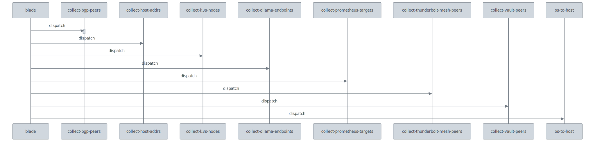
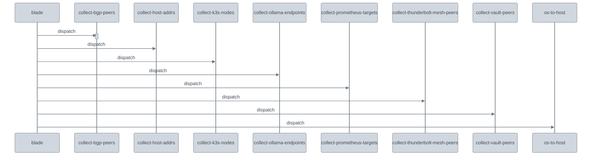

# Policy Sequence: blade

```mermaid
%%{init: {"theme":"base","themeVariables":{"activationBkgColor":"#d0d7de","activationBorderColor":"#8c959f","actorBkg":"#d0d7de","actorBorder":"#6e7781","actorLineColor":"#6e7781","actorTextColor":"#424a53","background":"#eaeef2","classText":"#424a53","clusterBkg":"#d0d7de","clusterBorder":"#8c959f","edgeLabelBackground":"#eaeef2","labelBoxBkgColor":"#d0d7de","labelBoxBorderColor":"#6e7781","labelTextColor":"#424a53","lineColor":"#6e7781","loopTextColor":"#424a53","mainBkg":"#d0d7de","nodeBkg":"#d0d7de","nodeBorder":"#6e7781","nodeTextColor":"#424a53","noteBkgColor":"#d0d7de","noteBorderColor":"#8c959f","noteTextColor":"#424a53","pie1":"#fa4549","pie2":"#e16f24","pie3":"#bf8700","pie4":"#2da44e","pie5":"#339D9B","pie6":"#218bff","pie7":"#a475f9","pie8":"#4d2d00","pieLegendTextColor":"#424a53","pieOuterStrokeColor":"#8c959f","pieSectionTextColor":"#424a53","pieStrokeColor":"#8c959f","pieTitleTextColor":"#424a53","primaryBorderColor":"#6e7781","primaryColor":"#d0d7de","primaryTextColor":"#424a53","secondBkg":"#d0d7de","secondaryBorderColor":"#8c959f","secondaryColor":"#d0d7de","secondaryTextColor":"#424a53","sequenceNumberColor":"#eaeef2","signalColor":"#6e7781","signalTextColor":"#424a53","tertiaryBorderColor":"#8c959f","tertiaryColor":"#d0d7de","tertiaryTextColor":"#424a53","textColor":"#424a53","titleColor":"#424a53"}}}%%
sequenceDiagram
    participant root as blade
    participant collect_bgp_peers as collect-bgp-peers
    participant collect_host_addrs as collect-host-addrs
    participant collect_k3s_nodes as collect-k3s-nodes
    participant collect_ollama_endpoints as collect-ollama-endpoints
    participant collect_prometheus_targets as collect-prometheus-targets
    participant collect_thunderbolt_mesh_peers as collect-thunderbolt-mesh-peers
    participant collect_vault_peers as collect-vault-peers
    participant os_to_host as os-to-host

    root ->> collect_bgp_peers: dispatch
    activate collect_bgp_peers
    deactivate collect_bgp_peers

    root ->> collect_host_addrs: dispatch

    root ->> collect_k3s_nodes: dispatch

    root ->> collect_ollama_endpoints: dispatch

    root ->> collect_prometheus_targets: dispatch

    root ->> collect_thunderbolt_mesh_peers: dispatch

    root ->> collect_vault_peers: dispatch

    root ->> os_to_host: dispatch
```
