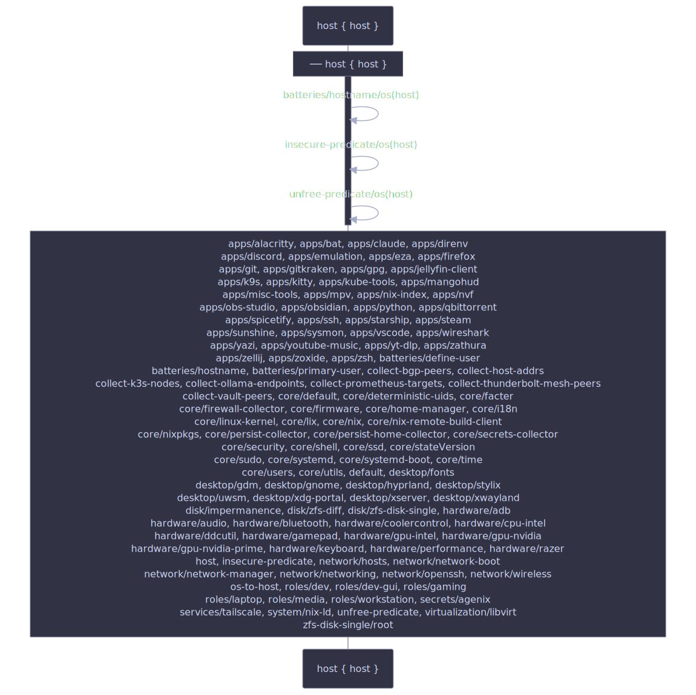
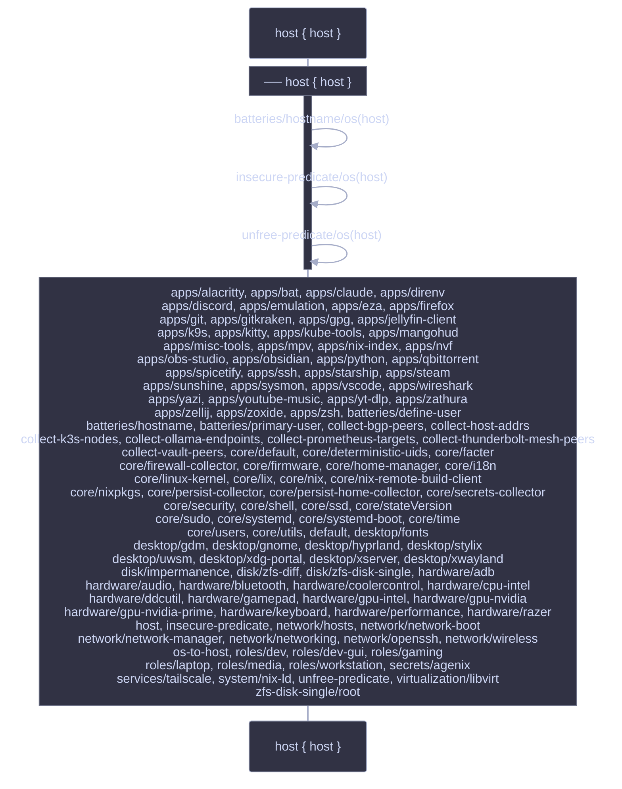

# Scope Sequence (expanded): blade

```mermaid
%%{init: {"theme":"base","themeVariables":{"activationBkgColor":"#313244","activationBorderColor":"#6c7086","actorBkg":"#313244","actorBorder":"#a6adc8","actorLineColor":"#a6adc8","actorTextColor":"#cdd6f4","background":"#1e1e2e","classText":"#cdd6f4","clusterBkg":"#313244","clusterBorder":"#6c7086","edgeLabelBackground":"#1e1e2e","labelBoxBkgColor":"#313244","labelBoxBorderColor":"#a6adc8","labelTextColor":"#cdd6f4","lineColor":"#a6adc8","loopTextColor":"#cdd6f4","mainBkg":"#313244","nodeBkg":"#313244","nodeBorder":"#a6adc8","nodeTextColor":"#cdd6f4","noteBkgColor":"#313244","noteBorderColor":"#6c7086","noteTextColor":"#cdd6f4","pie1":"#f38ba8","pie2":"#fab387","pie3":"#f9e2af","pie4":"#a6e3a1","pie5":"#94e2d5","pie6":"#89b4fa","pie7":"#cba6f7","pie8":"#f2cdcd","pieLegendTextColor":"#cdd6f4","pieOuterStrokeColor":"#6c7086","pieSectionTextColor":"#cdd6f4","pieStrokeColor":"#6c7086","pieTitleTextColor":"#cdd6f4","primaryBorderColor":"#a6adc8","primaryColor":"#313244","primaryTextColor":"#cdd6f4","secondBkg":"#313244","secondaryBorderColor":"#6c7086","secondaryColor":"#313244","secondaryTextColor":"#cdd6f4","sequenceNumberColor":"#1e1e2e","signalColor":"#a6adc8","signalTextColor":"#cdd6f4","tertiaryBorderColor":"#6c7086","tertiaryColor":"#313244","tertiaryTextColor":"#cdd6f4","textColor":"#cdd6f4","titleColor":"#cdd6f4"}}}%%
sequenceDiagram
    participant host as host { host }

    Note over host: ── host { host }
    activate host
    host ->> host: batteries/hostname/os(host)
    host ->> host: insecure-predicate/os(host)
    host ->> host: unfree-predicate/os(host)
    deactivate host
    Note over host: apps/alacritty, apps/bat, apps/claude, apps/direnv<br/>apps/discord, apps/emulation, apps/eza, apps/firefox<br/>apps/git, apps/gitkraken, apps/gpg, apps/jellyfin-client<br/>apps/k9s, apps/kitty, apps/kube-tools, apps/mangohud<br/>apps/misc-tools, apps/mpv, apps/nix-index, apps/nvf<br/>apps/obs-studio, apps/obsidian, apps/python, apps/qbittorrent<br/>apps/spicetify, apps/ssh, apps/starship, apps/steam<br/>apps/sunshine, apps/sysmon, apps/vscode, apps/wireshark<br/>apps/yazi, apps/youtube-music, apps/yt-dlp, apps/zathura<br/>apps/zellij, apps/zoxide, apps/zsh, batteries/define-user<br/>batteries/hostname, batteries/primary-user, collect-bgp-peers, collect-host-addrs<br/>collect-k3s-nodes, collect-ollama-endpoints, collect-prometheus-targets, collect-thunderbolt-mesh-peers<br/>collect-vault-peers, core/default, core/deterministic-uids, core/facter<br/>core/firewall-collector, core/firmware, core/home-manager, core/i18n<br/>core/linux-kernel, core/lix, core/nix, core/nix-remote-build-client<br/>core/nixpkgs, core/persist-collector, core/persist-home-collector, core/secrets-collector<br/>core/security, core/shell, core/ssd, core/stateVersion<br/>core/sudo, core/systemd, core/systemd-boot, core/time<br/>core/users, core/utils, default, desktop/fonts<br/>desktop/gdm, desktop/gnome, desktop/hyprland, desktop/stylix<br/>desktop/uwsm, desktop/xdg-portal, desktop/xserver, desktop/xwayland<br/>disk/impermanence, disk/zfs-diff, disk/zfs-disk-single, hardware/adb<br/>hardware/audio, hardware/bluetooth, hardware/coolercontrol, hardware/cpu-intel<br/>hardware/ddcutil, hardware/gamepad, hardware/gpu-intel, hardware/gpu-nvidia<br/>hardware/gpu-nvidia-prime, hardware/keyboard, hardware/performance, hardware/razer<br/>host, insecure-predicate, network/hosts, network/network-boot<br/>network/network-manager, network/networking, network/openssh, network/wireless<br/>os-to-host, roles/dev, roles/dev-gui, roles/gaming<br/>roles/laptop, roles/media, roles/workstation, secrets/agenix<br/>services/tailscale, system/nix-ld, unfree-predicate, virtualization/libvirt<br/>zfs-disk-single/root
```
