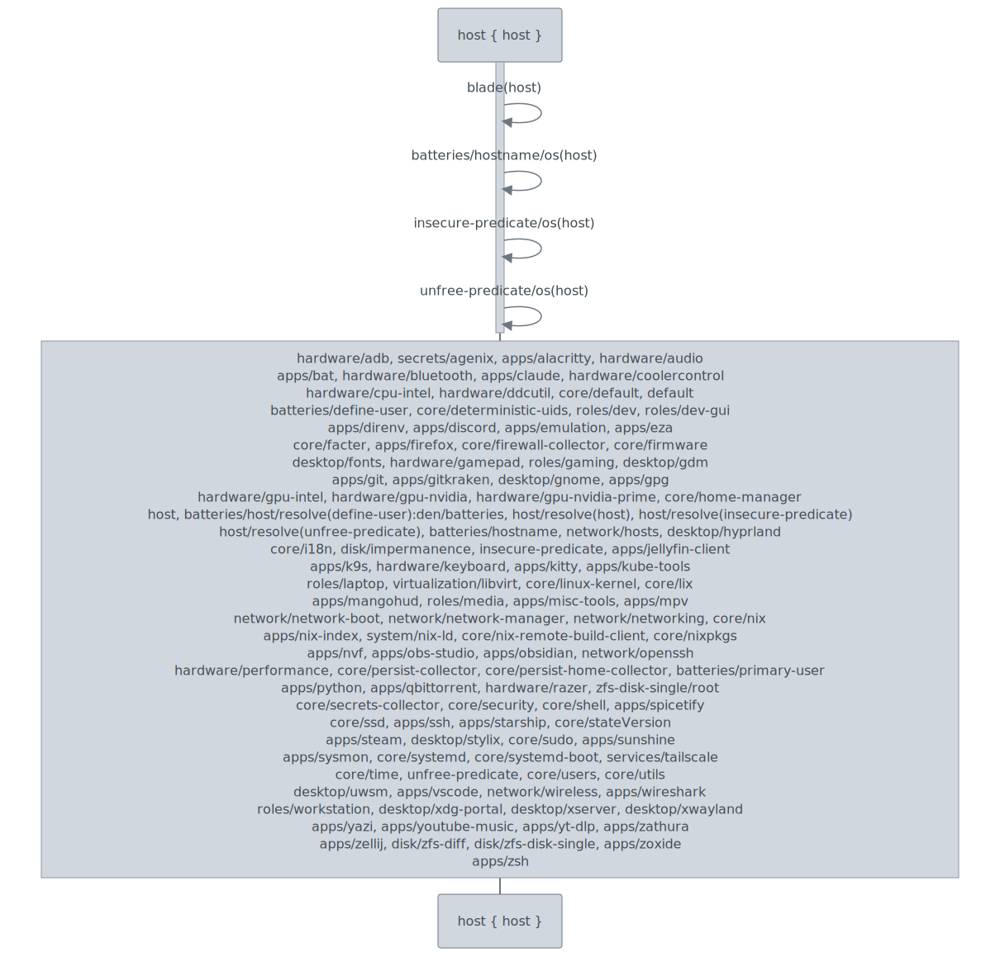
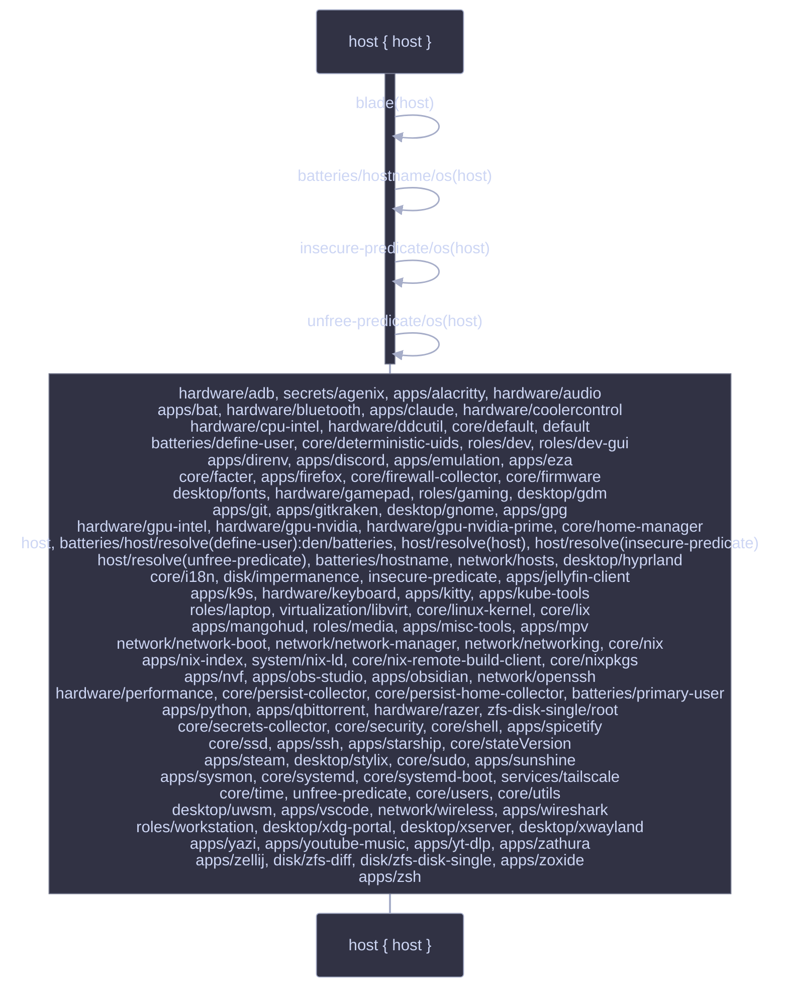

# Scope Sequence: blade

```mermaid
%%{init: {"theme":"base","themeVariables":{"activationBkgColor":"#313244","activationBorderColor":"#6c7086","actorBkg":"#313244","actorBorder":"#a6adc8","actorLineColor":"#a6adc8","actorTextColor":"#cdd6f4","background":"#1e1e2e","classText":"#cdd6f4","clusterBkg":"#313244","clusterBorder":"#6c7086","edgeLabelBackground":"#1e1e2e","labelBoxBkgColor":"#313244","labelBoxBorderColor":"#a6adc8","labelTextColor":"#cdd6f4","lineColor":"#a6adc8","loopTextColor":"#cdd6f4","mainBkg":"#313244","nodeBkg":"#313244","nodeBorder":"#a6adc8","nodeTextColor":"#cdd6f4","noteBkgColor":"#313244","noteBorderColor":"#6c7086","noteTextColor":"#cdd6f4","pie1":"#f38ba8","pie2":"#fab387","pie3":"#f9e2af","pie4":"#a6e3a1","pie5":"#94e2d5","pie6":"#89b4fa","pie7":"#cba6f7","pie8":"#f2cdcd","pieLegendTextColor":"#cdd6f4","pieOuterStrokeColor":"#6c7086","pieSectionTextColor":"#cdd6f4","pieStrokeColor":"#6c7086","pieTitleTextColor":"#cdd6f4","primaryBorderColor":"#a6adc8","primaryColor":"#313244","primaryTextColor":"#cdd6f4","secondBkg":"#313244","secondaryBorderColor":"#6c7086","secondaryColor":"#313244","secondaryTextColor":"#cdd6f4","sequenceNumberColor":"#1e1e2e","signalColor":"#a6adc8","signalTextColor":"#cdd6f4","tertiaryBorderColor":"#6c7086","tertiaryColor":"#313244","tertiaryTextColor":"#cdd6f4","textColor":"#cdd6f4","titleColor":"#cdd6f4"}}}%%
sequenceDiagram
    participant host as host { host }


    activate host
    host ->> host: blade(host)
    host ->> host: batteries/hostname/os(host)
    host ->> host: insecure-predicate/os(host)
    host ->> host: unfree-predicate/os(host)
    deactivate host
    Note over host: hardware/adb, secrets/agenix, apps/alacritty, hardware/audio<br/>apps/bat, hardware/bluetooth, apps/claude, hardware/coolercontrol<br/>hardware/cpu-intel, hardware/ddcutil, core/default, default<br/>batteries/define-user, core/deterministic-uids, roles/dev, roles/dev-gui<br/>apps/direnv, apps/discord, apps/emulation, apps/eza<br/>core/facter, apps/firefox, core/firewall-collector, core/firmware<br/>desktop/fonts, hardware/gamepad, roles/gaming, desktop/gdm<br/>apps/git, apps/gitkraken, desktop/gnome, apps/gpg<br/>hardware/gpu-intel, hardware/gpu-nvidia, hardware/gpu-nvidia-prime, core/home-manager<br/>host, batteries/host/resolve(define-user):den/batteries, host/resolve(host), host/resolve(insecure-predicate)<br/>host/resolve(unfree-predicate), batteries/hostname, network/hosts, desktop/hyprland<br/>core/i18n, disk/impermanence, insecure-predicate, apps/jellyfin-client<br/>apps/k9s, hardware/keyboard, apps/kitty, apps/kube-tools<br/>roles/laptop, virtualization/libvirt, core/linux-kernel, core/lix<br/>apps/mangohud, roles/media, apps/misc-tools, apps/mpv<br/>network/network-boot, network/network-manager, network/networking, core/nix<br/>apps/nix-index, system/nix-ld, core/nix-remote-build-client, core/nixpkgs<br/>apps/nvf, apps/obs-studio, apps/obsidian, network/openssh<br/>hardware/performance, core/persist-collector, core/persist-home-collector, batteries/primary-user<br/>apps/python, apps/qbittorrent, hardware/razer, zfs-disk-single/root<br/>core/secrets-collector, core/security, core/shell, apps/spicetify<br/>core/ssd, apps/ssh, apps/starship, core/stateVersion<br/>apps/steam, desktop/stylix, core/sudo, apps/sunshine<br/>apps/sysmon, core/systemd, core/systemd-boot, services/tailscale<br/>core/time, unfree-predicate, core/users, core/utils<br/>desktop/uwsm, apps/vscode, network/wireless, apps/wireshark<br/>roles/workstation, desktop/xdg-portal, desktop/xserver, desktop/xwayland<br/>apps/yazi, apps/youtube-music, apps/yt-dlp, apps/zathura<br/>apps/zellij, disk/zfs-diff, disk/zfs-disk-single, apps/zoxide<br/>apps/zsh
```
