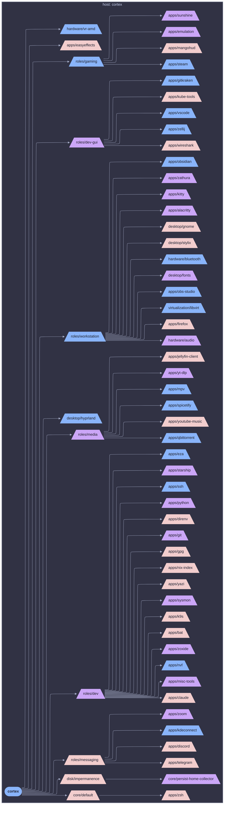

# Class Slice: homeManager: cortex

```mermaid
%%{init: {"elk":{"mergeEdges":true,"nodePlacementStrategy":"BRANDES_KOEPF"},"flowchart":{"wrappingWidth":600},"layout":"elk","theme":"base","themeVariables":{"activationBkgColor":"#313244","activationBorderColor":"#6c7086","actorBkg":"#313244","actorBorder":"#a6adc8","actorLineColor":"#a6adc8","actorTextColor":"#cdd6f4","background":"#1e1e2e","classText":"#cdd6f4","clusterBkg":"#313244","clusterBorder":"#6c7086","edgeLabelBackground":"#1e1e2e","labelBoxBkgColor":"#313244","labelBoxBorderColor":"#a6adc8","labelTextColor":"#cdd6f4","lineColor":"#a6adc8","loopTextColor":"#cdd6f4","mainBkg":"#313244","nodeBkg":"#313244","nodeBorder":"#a6adc8","nodeTextColor":"#cdd6f4","noteBkgColor":"#313244","noteBorderColor":"#6c7086","noteTextColor":"#cdd6f4","pie1":"#f38ba8","pie2":"#fab387","pie3":"#f9e2af","pie4":"#a6e3a1","pie5":"#94e2d5","pie6":"#89b4fa","pie7":"#cba6f7","pie8":"#f2cdcd","pieLegendTextColor":"#cdd6f4","pieOuterStrokeColor":"#6c7086","pieSectionTextColor":"#cdd6f4","pieStrokeColor":"#6c7086","pieTitleTextColor":"#cdd6f4","primaryBorderColor":"#a6adc8","primaryColor":"#313244","primaryTextColor":"#cdd6f4","secondBkg":"#313244","secondaryBorderColor":"#6c7086","secondaryColor":"#313244","secondaryTextColor":"#cdd6f4","sequenceNumberColor":"#1e1e2e","signalColor":"#a6adc8","signalTextColor":"#cdd6f4","tertiaryBorderColor":"#6c7086","tertiaryColor":"#313244","tertiaryTextColor":"#cdd6f4","textColor":"#cdd6f4","titleColor":"#cdd6f4"}}}%%
graph LR
  cortex([cortex]):::root

  subgraph ctx_host_cortex["host: cortex"]
  apps__alacritty[/"apps/alacritty"\]:::apps__alacritty_c
  hardware__audio[/"hardware/audio"\]:::hardware__audio_c
  apps__bat[/"apps/bat"\]:::apps__bat_c
  hardware__bluetooth[/"hardware/bluetooth"\]:::hardware__bluetooth_c
  apps__claude[/"apps/claude"\]:::apps__claude_c
  core__default[/"core/default"\]:::core__default_c
  roles__dev[/"roles/dev"\]:::roles__dev_c
  roles__dev_gui[/"roles/dev-gui"\]:::roles__dev_gui_c
  apps__direnv[/"apps/direnv"\]:::apps__direnv_c
  apps__discord[/"apps/discord"\]:::apps__discord_c
  apps__easyeffects[/"apps/easyeffects"\]:::apps__easyeffects_c
  apps__emulation[/"apps/emulation"\]:::apps__emulation_c
  apps__eza[/"apps/eza"\]:::apps__eza_c
  apps__firefox[/"apps/firefox"\]:::apps__firefox_c
  desktop__fonts[/"desktop/fonts"\]:::desktop__fonts_c
  roles__gaming[/"roles/gaming"\]:::roles__gaming_c
  apps__git[/"apps/git"\]:::apps__git_c
  apps__gitkraken[/"apps/gitkraken"\]:::apps__gitkraken_c
  desktop__gnome[/"desktop/gnome"\]:::desktop__gnome_c
  apps__gpg[/"apps/gpg"\]:::apps__gpg_c
  desktop__hyprland[/"desktop/hyprland"\]:::desktop__hyprland_c
  disk__impermanence[/"disk/impermanence"\]:::disk__impermanence_c
  apps__jellyfin_client[/"apps/jellyfin-client"\]:::apps__jellyfin_client_c
  apps__k9s[/"apps/k9s"\]:::apps__k9s_c
  apps__kdeconnect[/"apps/kdeconnect"\]:::apps__kdeconnect_c
  apps__kitty[/"apps/kitty"\]:::apps__kitty_c
  apps__kube_tools[/"apps/kube-tools"\]:::apps__kube_tools_c
  virtualization__libvirt[/"virtualization/libvirt"\]:::virtualization__libvirt_c
  apps__mangohud[/"apps/mangohud"\]:::apps__mangohud_c
  roles__media[/"roles/media"\]:::roles__media_c
  roles__messaging[/"roles/messaging"\]:::roles__messaging_c
  apps__misc_tools[/"apps/misc-tools"\]:::apps__misc_tools_c
  apps__mpv[/"apps/mpv"\]:::apps__mpv_c
  apps__nix_index[/"apps/nix-index"\]:::apps__nix_index_c
  apps__nvf[/"apps/nvf"\]:::apps__nvf_c
  apps__obs_studio[/"apps/obs-studio"\]:::apps__obs_studio_c
  apps__obsidian[/"apps/obsidian"\]:::apps__obsidian_c
  core__persist_home_collector[/"core/persist-home-collector"\]:::core__persist_home_collector_c
  apps__python[/"apps/python"\]:::apps__python_c
  apps__qbittorrent[/"apps/qbittorrent"\]:::apps__qbittorrent_c
  apps__spicetify[/"apps/spicetify"\]:::apps__spicetify_c
  apps__ssh[/"apps/ssh"\]:::apps__ssh_c
  apps__starship[/"apps/starship"\]:::apps__starship_c
  apps__steam[/"apps/steam"\]:::apps__steam_c
  desktop__stylix[/"desktop/stylix"\]:::desktop__stylix_c
  apps__sunshine[/"apps/sunshine"\]:::apps__sunshine_c
  apps__sysmon[/"apps/sysmon"\]:::apps__sysmon_c
  apps__telegram[/"apps/telegram"\]:::apps__telegram_c
  hardware__vr_amd[/"hardware/vr-amd"\]:::hardware__vr_amd_c
  apps__vscode[/"apps/vscode"\]:::apps__vscode_c
  apps__wireshark[/"apps/wireshark"\]:::apps__wireshark_c
  roles__workstation[/"roles/workstation"\]:::roles__workstation_c
  apps__yazi[/"apps/yazi"\]:::apps__yazi_c
  apps__youtube_music[/"apps/youtube-music"\]:::apps__youtube_music_c
  apps__yt_dlp[/"apps/yt-dlp"\]:::apps__yt_dlp_c
  apps__zathura[/"apps/zathura"\]:::apps__zathura_c
  apps__zellij[/"apps/zellij"\]:::apps__zellij_c
  apps__zoom[/"apps/zoom"\]:::apps__zoom_c
  apps__zoxide[/"apps/zoxide"\]:::apps__zoxide_c
  apps__zsh[/"apps/zsh"\]:::apps__zsh_c
  core__default --> apps__zsh
  cortex --> core__default
  cortex --> roles__dev
  cortex --> roles__dev_gui
  cortex --> apps__easyeffects
  cortex --> roles__gaming
  cortex --> desktop__hyprland
  cortex --> disk__impermanence
  cortex --> roles__media
  cortex --> roles__messaging
  cortex --> hardware__vr_amd
  cortex --> roles__workstation
  disk__impermanence --> core__persist_home_collector
  roles__dev --> apps__bat
  roles__dev --> apps__claude
  roles__dev --> apps__direnv
  roles__dev --> apps__eza
  roles__dev --> apps__git
  roles__dev --> apps__gpg
  roles__dev --> apps__k9s
  roles__dev --> apps__misc_tools
  roles__dev --> apps__nix_index
  roles__dev --> apps__nvf
  roles__dev --> apps__python
  roles__dev --> apps__ssh
  roles__dev --> apps__starship
  roles__dev --> apps__sysmon
  roles__dev --> apps__yazi
  roles__dev --> apps__zoxide
  roles__dev_gui --> apps__gitkraken
  roles__dev_gui --> apps__kube_tools
  roles__dev_gui --> apps__vscode
  roles__dev_gui --> apps__wireshark
  roles__dev_gui --> apps__zellij
  roles__gaming --> apps__emulation
  roles__gaming --> apps__mangohud
  roles__gaming --> apps__steam
  roles__gaming --> apps__sunshine
  roles__media --> apps__jellyfin_client
  roles__media --> apps__mpv
  roles__media --> apps__qbittorrent
  roles__media --> apps__spicetify
  roles__media --> apps__youtube_music
  roles__media --> apps__yt_dlp
  roles__messaging --> apps__discord
  roles__messaging --> apps__kdeconnect
  roles__messaging --> apps__telegram
  roles__messaging --> apps__zoom
  roles__workstation --> apps__alacritty
  roles__workstation --> hardware__audio
  roles__workstation --> hardware__bluetooth
  roles__workstation --> apps__firefox
  roles__workstation --> desktop__fonts
  roles__workstation --> desktop__gnome
  roles__workstation --> apps__kitty
  roles__workstation --> virtualization__libvirt
  roles__workstation --> apps__obs_studio
  roles__workstation --> apps__obsidian
  roles__workstation --> desktop__stylix
  roles__workstation --> apps__zathura
  end


  classDef root fill:#89b4fa,stroke:#89b4fa,color:#1e1e2e,font-weight:bold
  classDef apps__alacritty_c fill:#cba6f7,stroke:#cba6f7,color:#1e1e2e,stroke-width:3px
  classDef apps_c fill:#a6e3a1,stroke:#a6e3a1,color:#1e1e2e,stroke-dasharray: 3 3,stroke-width:1px
  classDef hardware__audio_c fill:#cba6f7,stroke:#cba6f7,color:#1e1e2e,stroke-width:3px
  classDef apps__bat_c fill:#f2cdcd,stroke:#f2cdcd,color:#1e1e2e,stroke-width:3px
  classDef hardware__bluetooth_c fill:#89b4fa,stroke:#89b4fa,color:#1e1e2e,stroke-width:3px
  classDef apps__claude_c fill:#f2cdcd,stroke:#f2cdcd,color:#1e1e2e,stroke-width:3px
  classDef core_c fill:#f9e2af,stroke:#f9e2af,color:#1e1e2e,stroke-dasharray: 3 3,stroke-width:1px
  classDef cortex_c fill:#cba6f7,stroke:#cba6f7,color:#1e1e2e,stroke-width:3px
  classDef core__default_c fill:#f2cdcd,stroke:#f2cdcd,color:#1e1e2e,stroke-width:3px
  classDef desktop_c fill:#a6e3a1,stroke:#a6e3a1,color:#1e1e2e,stroke-dasharray: 3 3,stroke-width:1px
  classDef roles__dev_c fill:#cba6f7,stroke:#cba6f7,color:#1e1e2e,stroke-width:3px
  classDef roles__dev_gui_c fill:#cba6f7,stroke:#cba6f7,color:#1e1e2e,stroke-width:3px
  classDef apps__direnv_c fill:#f2cdcd,stroke:#f2cdcd,color:#1e1e2e,stroke-width:3px
  classDef apps__discord_c fill:#f2cdcd,stroke:#f2cdcd,color:#1e1e2e,stroke-width:3px
  classDef disk_c fill:#a6e3a1,stroke:#a6e3a1,color:#1e1e2e,stroke-dasharray: 3 3,stroke-width:1px
  classDef apps__easyeffects_c fill:#f2cdcd,stroke:#f2cdcd,color:#1e1e2e,stroke-width:3px
  classDef apps__emulation_c fill:#cba6f7,stroke:#cba6f7,color:#1e1e2e,stroke-width:3px
  classDef apps__eza_c fill:#89b4fa,stroke:#89b4fa,color:#1e1e2e,stroke-width:3px
  classDef apps__firefox_c fill:#f2cdcd,stroke:#f2cdcd,color:#1e1e2e,stroke-width:3px
  classDef desktop__fonts_c fill:#cba6f7,stroke:#cba6f7,color:#1e1e2e,stroke-width:3px
  classDef roles__gaming_c fill:#89b4fa,stroke:#89b4fa,color:#1e1e2e,stroke-width:3px
  classDef apps__git_c fill:#cba6f7,stroke:#cba6f7,color:#1e1e2e,stroke-width:3px
  classDef apps__gitkraken_c fill:#89b4fa,stroke:#89b4fa,color:#1e1e2e,stroke-width:3px
  classDef desktop__gnome_c fill:#f2cdcd,stroke:#f2cdcd,color:#1e1e2e,stroke-width:3px
  classDef apps__gpg_c fill:#f2cdcd,stroke:#f2cdcd,color:#1e1e2e,stroke-width:3px
  classDef hardware_c fill:#a6e3a1,stroke:#a6e3a1,color:#1e1e2e,stroke-dasharray: 3 3,stroke-width:1px
  classDef desktop__hyprland_c fill:#89b4fa,stroke:#89b4fa,color:#1e1e2e,stroke-width:3px
  classDef disk__impermanence_c fill:#f2cdcd,stroke:#f2cdcd,color:#1e1e2e,stroke-width:3px
  classDef apps__jellyfin_client_c fill:#f2cdcd,stroke:#f2cdcd,color:#1e1e2e,stroke-width:3px
  classDef apps__k9s_c fill:#f2cdcd,stroke:#f2cdcd,color:#1e1e2e,stroke-width:3px
  classDef apps__kdeconnect_c fill:#89b4fa,stroke:#89b4fa,color:#1e1e2e,stroke-width:3px
  classDef apps__kitty_c fill:#cba6f7,stroke:#cba6f7,color:#1e1e2e,stroke-width:3px
  classDef apps__kube_tools_c fill:#f2cdcd,stroke:#f2cdcd,color:#1e1e2e,stroke-width:3px
  classDef virtualization__libvirt_c fill:#89b4fa,stroke:#89b4fa,color:#1e1e2e,stroke-width:3px
  classDef apps__mangohud_c fill:#f2cdcd,stroke:#f2cdcd,color:#1e1e2e,stroke-width:3px
  classDef roles__media_c fill:#cba6f7,stroke:#cba6f7,color:#1e1e2e,stroke-width:3px
  classDef roles__messaging_c fill:#f2cdcd,stroke:#f2cdcd,color:#1e1e2e,stroke-width:3px
  classDef apps__misc_tools_c fill:#cba6f7,stroke:#cba6f7,color:#1e1e2e,stroke-width:3px
  classDef apps__mpv_c fill:#89b4fa,stroke:#89b4fa,color:#1e1e2e,stroke-width:3px
  classDef apps__nix_index_c fill:#f2cdcd,stroke:#f2cdcd,color:#1e1e2e,stroke-width:3px
  classDef apps__nvf_c fill:#89b4fa,stroke:#89b4fa,color:#1e1e2e,stroke-width:3px
  classDef apps__obs_studio_c fill:#89b4fa,stroke:#89b4fa,color:#1e1e2e,stroke-width:3px
  classDef apps__obsidian_c fill:#89b4fa,stroke:#89b4fa,color:#1e1e2e,stroke-width:3px
  classDef core__persist_home_collector_c fill:#cba6f7,stroke:#cba6f7,color:#1e1e2e,stroke-width:3px
  classDef apps__python_c fill:#cba6f7,stroke:#cba6f7,color:#1e1e2e,stroke-width:3px
  classDef apps__qbittorrent_c fill:#89b4fa,stroke:#89b4fa,color:#1e1e2e,stroke-width:3px
  classDef roles_c fill:#a6e3a1,stroke:#a6e3a1,color:#1e1e2e,stroke-dasharray: 3 3,stroke-width:1px
  classDef apps__spicetify_c fill:#89b4fa,stroke:#89b4fa,color:#1e1e2e,stroke-width:3px
  classDef apps__ssh_c fill:#89b4fa,stroke:#89b4fa,color:#1e1e2e,stroke-width:3px
  classDef apps__starship_c fill:#cba6f7,stroke:#cba6f7,color:#1e1e2e,stroke-width:3px
  classDef apps__steam_c fill:#89b4fa,stroke:#89b4fa,color:#1e1e2e,stroke-width:3px
  classDef desktop__stylix_c fill:#f2cdcd,stroke:#f2cdcd,color:#1e1e2e,stroke-width:3px
  classDef apps__sunshine_c fill:#cba6f7,stroke:#cba6f7,color:#1e1e2e,stroke-width:3px
  classDef apps__sysmon_c fill:#cba6f7,stroke:#cba6f7,color:#1e1e2e,stroke-width:3px
  classDef apps__telegram_c fill:#f2cdcd,stroke:#f2cdcd,color:#1e1e2e,stroke-width:3px
  classDef virtualization_c fill:#fab387,stroke:#fab387,color:#1e1e2e,stroke-dasharray: 3 3,stroke-width:1px
  classDef hardware__vr_amd_c fill:#89b4fa,stroke:#89b4fa,color:#1e1e2e,stroke-width:3px
  classDef apps__vscode_c fill:#89b4fa,stroke:#89b4fa,color:#1e1e2e,stroke-width:3px
  classDef apps__wireshark_c fill:#f2cdcd,stroke:#f2cdcd,color:#1e1e2e,stroke-width:3px
  classDef roles__workstation_c fill:#89b4fa,stroke:#89b4fa,color:#1e1e2e,stroke-width:3px
  classDef apps__yazi_c fill:#f2cdcd,stroke:#f2cdcd,color:#1e1e2e,stroke-width:3px
  classDef apps__youtube_music_c fill:#f2cdcd,stroke:#f2cdcd,color:#1e1e2e,stroke-width:3px
  classDef apps__yt_dlp_c fill:#cba6f7,stroke:#cba6f7,color:#1e1e2e,stroke-width:3px
  classDef apps__zathura_c fill:#cba6f7,stroke:#cba6f7,color:#1e1e2e,stroke-width:3px
  classDef apps__zellij_c fill:#89b4fa,stroke:#89b4fa,color:#1e1e2e,stroke-width:3px
  classDef apps__zoom_c fill:#cba6f7,stroke:#cba6f7,color:#1e1e2e,stroke-width:3px
  classDef apps__zoxide_c fill:#cba6f7,stroke:#cba6f7,color:#1e1e2e,stroke-width:3px
  classDef apps__zsh_c fill:#f2cdcd,stroke:#f2cdcd,color:#1e1e2e,stroke-width:3px
style ctx_host_cortex fill:#313244,stroke:#6c7086,stroke-width:2px
```
