# Class Slice: nixos: cortex



```mermaid
%%{init: {"elk":{"mergeEdges":true,"nodePlacementStrategy":"BRANDES_KOEPF"},"flowchart":{"wrappingWidth":600},"layout":"elk","theme":"base","themeVariables":{"activationBkgColor":"#313244","activationBorderColor":"#6c7086","actorBkg":"#313244","actorBorder":"#a6adc8","actorLineColor":"#a6adc8","actorTextColor":"#cdd6f4","background":"#1e1e2e","classText":"#cdd6f4","clusterBkg":"#313244","clusterBorder":"#6c7086","edgeLabelBackground":"#1e1e2e","labelBoxBkgColor":"#313244","labelBoxBorderColor":"#a6adc8","labelTextColor":"#cdd6f4","lineColor":"#a6adc8","loopTextColor":"#cdd6f4","mainBkg":"#313244","nodeBkg":"#313244","nodeBorder":"#a6adc8","nodeTextColor":"#cdd6f4","noteBkgColor":"#313244","noteBorderColor":"#6c7086","noteTextColor":"#cdd6f4","pie1":"#f38ba8","pie2":"#fab387","pie3":"#f9e2af","pie4":"#a6e3a1","pie5":"#94e2d5","pie6":"#89b4fa","pie7":"#cba6f7","pie8":"#f2cdcd","pieLegendTextColor":"#cdd6f4","pieOuterStrokeColor":"#6c7086","pieSectionTextColor":"#cdd6f4","pieStrokeColor":"#6c7086","pieTitleTextColor":"#cdd6f4","primaryBorderColor":"#a6adc8","primaryColor":"#313244","primaryTextColor":"#cdd6f4","secondBkg":"#313244","secondaryBorderColor":"#6c7086","secondaryColor":"#313244","secondaryTextColor":"#cdd6f4","sequenceNumberColor":"#1e1e2e","signalColor":"#a6adc8","signalTextColor":"#cdd6f4","tertiaryBorderColor":"#6c7086","tertiaryColor":"#313244","tertiaryTextColor":"#cdd6f4","textColor":"#cdd6f4","titleColor":"#cdd6f4"}}}%%
graph LR
  cortex([cortex]):::root

  subgraph ctx_user_sini["user: sini"]
  agenix_identity__sini_axon_01{{"agenix-identity/sini@axon-01"}}:::agenix_identity__sini_axon_01_c
  agenix_identity__sini_axon_02{{"agenix-identity/sini@axon-02"}}:::agenix_identity__sini_axon_02_c
  agenix_identity__sini_axon_03{{"agenix-identity/sini@axon-03"}}:::agenix_identity__sini_axon_03_c
  agenix_identity__sini_bitstream{{"agenix-identity/sini@bitstream"}}:::agenix_identity__sini_bitstream_c
  agenix_identity__sini_blade{{"agenix-identity/sini@blade"}}:::agenix_identity__sini_blade_c
  agenix_identity__sini_cortex{{"agenix-identity/sini@cortex"}}:::agenix_identity__sini_cortex_c
  agenix_identity__sini_uplink{{"agenix-identity/sini@uplink"}}:::agenix_identity__sini_uplink_c
  opkssh_authz__sini_axon_01{{"opkssh-authz/sini@axon-01"}}:::opkssh_authz__sini_axon_01_c
  opkssh_authz__sini_axon_02{{"opkssh-authz/sini@axon-02"}}:::opkssh_authz__sini_axon_02_c
  opkssh_authz__sini_axon_03{{"opkssh-authz/sini@axon-03"}}:::opkssh_authz__sini_axon_03_c
  opkssh_authz__sini_bitstream{{"opkssh-authz/sini@bitstream"}}:::opkssh_authz__sini_bitstream_c
  opkssh_authz__sini_blade{{"opkssh-authz/sini@blade"}}:::opkssh_authz__sini_blade_c
  opkssh_authz__sini_cortex{{"opkssh-authz/sini@cortex"}}:::opkssh_authz__sini_cortex_c
  opkssh_authz__sini_patch{{"opkssh-authz/sini@patch"}}:::opkssh_authz__sini_patch_c
  opkssh_authz__sini_slab{{"opkssh-authz/sini@slab"}}:::opkssh_authz__sini_slab_c
  opkssh_authz__sini_uplink{{"opkssh-authz/sini@uplink"}}:::opkssh_authz__sini_uplink_c
  core__network__syncthing__peer_user_sini[/"core/network/syncthing/peer"\]:::core__network__syncthing__peer_user_sini_c
  den__batteries__primary_user_sini_axon_01_{{"batteries/primary-user(sini@axon-01)"}}:::den__batteries__primary_user_sini_axon_01__c
  den__batteries__primary_user_sini_axon_02_{{"batteries/primary-user(sini@axon-02)"}}:::den__batteries__primary_user_sini_axon_02__c
  den__batteries__primary_user_sini_axon_03_{{"batteries/primary-user(sini@axon-03)"}}:::den__batteries__primary_user_sini_axon_03__c
  den__batteries__primary_user_sini_bitstream_{{"batteries/primary-user(sini@bitstream)"}}:::den__batteries__primary_user_sini_bitstream__c
  den__batteries__primary_user_sini_blade_{{"batteries/primary-user(sini@blade)"}}:::den__batteries__primary_user_sini_blade__c
  den__batteries__primary_user_sini_cortex_{{"batteries/primary-user(sini@cortex)"}}:::den__batteries__primary_user_sini_cortex__c
  den__batteries__primary_user_sini_patch_{{"batteries/primary-user(sini@patch)"}}:::den__batteries__primary_user_sini_patch__c
  den__batteries__primary_user_sini_slab_{{"batteries/primary-user(sini@slab)"}}:::den__batteries__primary_user_sini_slab__c
  den__batteries__primary_user_sini_uplink_{{"batteries/primary-user(sini@uplink)"}}:::den__batteries__primary_user_sini_uplink__c
  user_enrich__sini_axon_01{{"user-enrich/sini@axon-01"}}:::user_enrich__sini_axon_01_c
  user_enrich__sini_axon_02{{"user-enrich/sini@axon-02"}}:::user_enrich__sini_axon_02_c
  user_enrich__sini_axon_03{{"user-enrich/sini@axon-03"}}:::user_enrich__sini_axon_03_c
  user_enrich__sini_bitstream{{"user-enrich/sini@bitstream"}}:::user_enrich__sini_bitstream_c
  user_enrich__sini_blade{{"user-enrich/sini@blade"}}:::user_enrich__sini_blade_c
  user_enrich__sini_cortex{{"user-enrich/sini@cortex"}}:::user_enrich__sini_cortex_c
  user_enrich__sini_patch{{"user-enrich/sini@patch"}}:::user_enrich__sini_patch_c
  user_enrich__sini_slab{{"user-enrich/sini@slab"}}:::user_enrich__sini_slab_c
  user_enrich__sini_uplink{{"user-enrich/sini@uplink"}}:::user_enrich__sini_uplink_c

  end
  subgraph ctx_user_vic["user: vic"]
  agenix_identity__vic_axon_01{{"agenix-identity/vic@axon-01"}}:::agenix_identity__vic_axon_01_c
  agenix_identity__vic_axon_02{{"agenix-identity/vic@axon-02"}}:::agenix_identity__vic_axon_02_c
  agenix_identity__vic_axon_03{{"agenix-identity/vic@axon-03"}}:::agenix_identity__vic_axon_03_c
  agenix_identity__vic_bitstream{{"agenix-identity/vic@bitstream"}}:::agenix_identity__vic_bitstream_c
  agenix_identity__vic_blade{{"agenix-identity/vic@blade"}}:::agenix_identity__vic_blade_c
  agenix_identity__vic_cortex{{"agenix-identity/vic@cortex"}}:::agenix_identity__vic_cortex_c
  agenix_identity__vic_uplink{{"agenix-identity/vic@uplink"}}:::agenix_identity__vic_uplink_c
  core__systemd__boot_user_vic[/"core/systemd/boot"\]:::core__systemd__boot_user_vic_c
  core__impermanence__btrfs_user_vic[/"core/impermanence/btrfs"\]:::core__impermanence__btrfs_user_vic_c
  roles__default_user_vic[/"roles/default"\]:::roles__default_user_vic_c
  core__users__deterministic_uids_user_vic[/"core/users/deterministic-uids"\]:::core__users__deterministic_uids_user_vic_c
  core__perf__disable_docs_user_vic[/"core/perf/disable-docs"\]:::core__perf__disable_docs_user_vic_c
  core__system__facter_user_vic[/"core/system/facter"\]:::core__system__facter_user_vic_c
  core__system__firmware_user_vic[/"core/system/firmware"\]:::core__system__firmware_user_vic_c
  core__users__home_manager_shared_user_vic[/"core/users/home-manager-shared"\]:::core__users__home_manager_shared_user_vic_c
  core__network__hostsfile_user_vic[/"core/network/hostsfile"\]:::core__network__hostsfile_user_vic_c
  core__localization__i18n_user_vic[/"core/localization/i18n"\]:::core__localization__i18n_user_vic_c
  core__impermanence_user_vic[/"core/impermanence"\]:::core__impermanence_user_vic_c
  core__system__linux_kernel_user_vic[/"core/system/linux-kernel"\]:::core__system__linux_kernel_user_vic_c
  core__network__networking_user_vic[/"core/network/networking"\]:::core__network__networking_user_vic_c
  core__nix_user_vic[/"core/nix"\]:::core__nix_user_vic_c
  core__security__openssh_user_vic[/"core/security/openssh"\]:::core__security__openssh_user_vic_c
  core__security__opkssh_user_vic[/"core/security/opkssh"\]:::core__security__opkssh_user_vic_c
  opkssh_authz__vic_axon_01{{"opkssh-authz/vic@axon-01"}}:::opkssh_authz__vic_axon_01_c
  opkssh_authz__vic_axon_02{{"opkssh-authz/vic@axon-02"}}:::opkssh_authz__vic_axon_02_c
  opkssh_authz__vic_axon_03{{"opkssh-authz/vic@axon-03"}}:::opkssh_authz__vic_axon_03_c
  opkssh_authz__vic_bitstream{{"opkssh-authz/vic@bitstream"}}:::opkssh_authz__vic_bitstream_c
  opkssh_authz__vic_blade{{"opkssh-authz/vic@blade"}}:::opkssh_authz__vic_blade_c
  opkssh_authz__vic_cortex{{"opkssh-authz/vic@cortex"}}:::opkssh_authz__vic_cortex_c
  opkssh_authz__vic_uplink{{"opkssh-authz/vic@uplink"}}:::opkssh_authz__vic_uplink_c
  core__network__syncthing__peer_user_vic[/"core/network/syncthing/peer"\]:::core__network__syncthing__peer_user_vic_c
  core__impermanence__persist_collector_user_vic[/"core/impermanence/persist-collector"\]:::core__impermanence__persist_collector_user_vic_c
  core__security_user_vic[/"core/security"\]:::core__security_user_vic_c
  core__users__shell_user_vic[/"core/users/shell"\]:::core__users__shell_user_vic_c
  core__perf__ssd_user_vic[/"core/perf/ssd"\]:::core__perf__ssd_user_vic_c
  core__nix__stateVersion_user_vic[/"core/nix/stateVersion"\]:::core__nix__stateVersion_user_vic_c
  core__security__sudo_user_vic[/"core/security/sudo"\]:::core__security__sudo_user_vic_c
  core__systemd_user_vic[/"core/systemd"\]:::core__systemd_user_vic_c
  core__network__tailscale_user_vic[/"core/network/tailscale"\]:::core__network__tailscale_user_vic_c
  user_enrich__vic_axon_01{{"user-enrich/vic@axon-01"}}:::user_enrich__vic_axon_01_c
  user_enrich__vic_axon_02{{"user-enrich/vic@axon-02"}}:::user_enrich__vic_axon_02_c
  user_enrich__vic_axon_03{{"user-enrich/vic@axon-03"}}:::user_enrich__vic_axon_03_c
  user_enrich__vic_bitstream{{"user-enrich/vic@bitstream"}}:::user_enrich__vic_bitstream_c
  user_enrich__vic_blade{{"user-enrich/vic@blade"}}:::user_enrich__vic_blade_c
  user_enrich__vic_cortex{{"user-enrich/vic@cortex"}}:::user_enrich__vic_cortex_c
  user_enrich__vic_uplink{{"user-enrich/vic@uplink"}}:::user_enrich__vic_uplink_c
  core__users_user_vic[/"core/users"\]:::core__users_user_vic_c
  core__utils_user_vic[/"core/utils"\]:::core__utils_user_vic_c
  vic{{"vic"}}:::vic_c
  core__impermanence__zfs_user_vic[/"core/impermanence/zfs"\]:::core__impermanence__zfs_user_vic_c
  core__perf__zram_swap_user_vic[/"core/perf/zram-swap"\]:::core__perf__zram_swap_user_vic_c
  core__impermanence_user_vic --> core__impermanence__btrfs_user_vic
  core__impermanence_user_vic --> core__impermanence__persist_collector_user_vic
  core__impermanence_user_vic --> core__impermanence__zfs_user_vic
  roles__default_user_vic --> core__systemd__boot_user_vic
  roles__default_user_vic --> core__users__deterministic_uids_user_vic
  roles__default_user_vic --> core__perf__disable_docs_user_vic
  roles__default_user_vic --> core__system__facter_user_vic
  roles__default_user_vic --> core__system__firmware_user_vic
  roles__default_user_vic --> core__users__home_manager_shared_user_vic
  roles__default_user_vic --> core__network__hostsfile_user_vic
  roles__default_user_vic --> core__localization__i18n_user_vic
  roles__default_user_vic --> core__impermanence_user_vic
  roles__default_user_vic --> core__system__linux_kernel_user_vic
  roles__default_user_vic --> core__network__networking_user_vic
  roles__default_user_vic --> core__nix_user_vic
  roles__default_user_vic --> core__security__openssh_user_vic
  roles__default_user_vic --> core__security__opkssh_user_vic
  roles__default_user_vic --> core__security_user_vic
  roles__default_user_vic --> core__users__shell_user_vic
  roles__default_user_vic --> core__perf__ssd_user_vic
  roles__default_user_vic --> core__nix__stateVersion_user_vic
  roles__default_user_vic --> core__security__sudo_user_vic
  roles__default_user_vic --> core__systemd_user_vic
  roles__default_user_vic --> core__network__tailscale_user_vic
  roles__default_user_vic --> core__users_user_vic
  roles__default_user_vic --> core__utils_user_vic
  roles__default_user_vic --> core__perf__zram_swap_user_vic
  vic --> roles__default_user_vic
  end
  subgraph ctx_user_shuo["user: shuo"]
  _policy_user_aspect_auto_include__2_["<policy:user-aspect-auto-include>[2]"]:::_policy_user_aspect_auto_include__2__c
  agenix_identity__shuo_blade{{"agenix-identity/shuo@blade"}}:::agenix_identity__shuo_blade_c
  agenix_identity__shuo_cortex{{"agenix-identity/shuo@cortex"}}:::agenix_identity__shuo_cortex_c
  core__systemd__boot_user_shuo[/"core/systemd/boot"\]:::core__systemd__boot_user_shuo_c
  core__impermanence__btrfs_user_shuo[/"core/impermanence/btrfs"\]:::core__impermanence__btrfs_user_shuo_c
  roles__default_user_shuo[/"roles/default"\]:::roles__default_user_shuo_c
  core__users__deterministic_uids_user_shuo[/"core/users/deterministic-uids"\]:::core__users__deterministic_uids_user_shuo_c
  core__perf__disable_docs_user_shuo[/"core/perf/disable-docs"\]:::core__perf__disable_docs_user_shuo_c
  core__system__facter_user_shuo[/"core/system/facter"\]:::core__system__facter_user_shuo_c
  core__system__firmware_user_shuo[/"core/system/firmware"\]:::core__system__firmware_user_shuo_c
  core__users__home_manager_shared_user_shuo[/"core/users/home-manager-shared"\]:::core__users__home_manager_shared_user_shuo_c
  core__network__hostsfile_user_shuo[/"core/network/hostsfile"\]:::core__network__hostsfile_user_shuo_c
  core__localization__i18n_user_shuo[/"core/localization/i18n"\]:::core__localization__i18n_user_shuo_c
  core__impermanence_user_shuo[/"core/impermanence"\]:::core__impermanence_user_shuo_c
  core__system__linux_kernel_user_shuo[/"core/system/linux-kernel"\]:::core__system__linux_kernel_user_shuo_c
  core__network__networking_user_shuo[/"core/network/networking"\]:::core__network__networking_user_shuo_c
  core__nix_user_shuo[/"core/nix"\]:::core__nix_user_shuo_c
  core__security__openssh_user_shuo[/"core/security/openssh"\]:::core__security__openssh_user_shuo_c
  core__security__opkssh_user_shuo[/"core/security/opkssh"\]:::core__security__opkssh_user_shuo_c
  opkssh_authz__shuo_blade{{"opkssh-authz/shuo@blade"}}:::opkssh_authz__shuo_blade_c
  opkssh_authz__shuo_cortex{{"opkssh-authz/shuo@cortex"}}:::opkssh_authz__shuo_cortex_c
  core__network__syncthing__peer_user_shuo[/"core/network/syncthing/peer"\]:::core__network__syncthing__peer_user_shuo_c
  core__impermanence__persist_collector_user_shuo[/"core/impermanence/persist-collector"\]:::core__impermanence__persist_collector_user_shuo_c
  core__security_user_shuo[/"core/security"\]:::core__security_user_shuo_c
  core__users__shell_user_shuo[/"core/users/shell"\]:::core__users__shell_user_shuo_c
  shuo{{"shuo"}}:::shuo_c
  core__perf__ssd_user_shuo[/"core/perf/ssd"\]:::core__perf__ssd_user_shuo_c
  core__nix__stateVersion_user_shuo[/"core/nix/stateVersion"\]:::core__nix__stateVersion_user_shuo_c
  applications__gaming__steam_user_shuo[/"applications/gaming/steam"\]:::applications__gaming__steam_user_shuo_c
  core__security__sudo_user_shuo[/"core/security/sudo"\]:::core__security__sudo_user_shuo_c
  core__systemd_user_shuo[/"core/systemd"\]:::core__systemd_user_shuo_c
  core__network__tailscale_user_shuo[/"core/network/tailscale"\]:::core__network__tailscale_user_shuo_c
  user_enrich__shuo_blade{{"user-enrich/shuo@blade"}}:::user_enrich__shuo_blade_c
  user_enrich__shuo_cortex{{"user-enrich/shuo@cortex"}}:::user_enrich__shuo_cortex_c
  core__users_user_shuo[/"core/users"\]:::core__users_user_shuo_c
  core__utils_user_shuo[/"core/utils"\]:::core__utils_user_shuo_c
  core__impermanence__zfs_user_shuo[/"core/impermanence/zfs"\]:::core__impermanence__zfs_user_shuo_c
  core__perf__zram_swap_user_shuo[/"core/perf/zram-swap"\]:::core__perf__zram_swap_user_shuo_c
  _policy_user_aspect_auto_include__2_ --> applications__gaming__steam_user_shuo
  core__impermanence_user_shuo --> core__impermanence__btrfs_user_shuo
  core__impermanence_user_shuo --> core__impermanence__persist_collector_user_shuo
  core__impermanence_user_shuo --> core__impermanence__zfs_user_shuo
  roles__default_user_shuo --> core__systemd__boot_user_shuo
  roles__default_user_shuo --> core__users__deterministic_uids_user_shuo
  roles__default_user_shuo --> core__perf__disable_docs_user_shuo
  roles__default_user_shuo --> core__system__facter_user_shuo
  roles__default_user_shuo --> core__system__firmware_user_shuo
  roles__default_user_shuo --> core__users__home_manager_shared_user_shuo
  roles__default_user_shuo --> core__network__hostsfile_user_shuo
  roles__default_user_shuo --> core__localization__i18n_user_shuo
  roles__default_user_shuo --> core__impermanence_user_shuo
  roles__default_user_shuo --> core__system__linux_kernel_user_shuo
  roles__default_user_shuo --> core__network__networking_user_shuo
  roles__default_user_shuo --> core__nix_user_shuo
  roles__default_user_shuo --> core__security__openssh_user_shuo
  roles__default_user_shuo --> core__security__opkssh_user_shuo
  roles__default_user_shuo --> core__security_user_shuo
  roles__default_user_shuo --> core__users__shell_user_shuo
  roles__default_user_shuo --> core__perf__ssd_user_shuo
  roles__default_user_shuo --> core__nix__stateVersion_user_shuo
  roles__default_user_shuo --> core__security__sudo_user_shuo
  roles__default_user_shuo --> core__systemd_user_shuo
  roles__default_user_shuo --> core__network__tailscale_user_shuo
  roles__default_user_shuo --> core__users_user_shuo
  roles__default_user_shuo --> core__utils_user_shuo
  roles__default_user_shuo --> core__perf__zram_swap_user_shuo
  shuo --> roles__default_user_shuo
  end
  subgraph ctx_user_will["user: will"]
  agenix_identity__will_blade{{"agenix-identity/will@blade"}}:::agenix_identity__will_blade_c
  agenix_identity__will_cortex{{"agenix-identity/will@cortex"}}:::agenix_identity__will_cortex_c
  core__systemd__boot_user_will[/"core/systemd/boot"\]:::core__systemd__boot_user_will_c
  core__impermanence__btrfs_user_will[/"core/impermanence/btrfs"\]:::core__impermanence__btrfs_user_will_c
  roles__default_user_will[/"roles/default"\]:::roles__default_user_will_c
  core__users__deterministic_uids_user_will[/"core/users/deterministic-uids"\]:::core__users__deterministic_uids_user_will_c
  core__perf__disable_docs_user_will[/"core/perf/disable-docs"\]:::core__perf__disable_docs_user_will_c
  core__system__facter_user_will[/"core/system/facter"\]:::core__system__facter_user_will_c
  core__system__firmware_user_will[/"core/system/firmware"\]:::core__system__firmware_user_will_c
  core__users__home_manager_shared_user_will[/"core/users/home-manager-shared"\]:::core__users__home_manager_shared_user_will_c
  core__network__hostsfile_user_will[/"core/network/hostsfile"\]:::core__network__hostsfile_user_will_c
  core__localization__i18n_user_will[/"core/localization/i18n"\]:::core__localization__i18n_user_will_c
  core__impermanence_user_will[/"core/impermanence"\]:::core__impermanence_user_will_c
  core__system__linux_kernel_user_will[/"core/system/linux-kernel"\]:::core__system__linux_kernel_user_will_c
  core__network__networking_user_will[/"core/network/networking"\]:::core__network__networking_user_will_c
  core__nix_user_will[/"core/nix"\]:::core__nix_user_will_c
  core__security__openssh_user_will[/"core/security/openssh"\]:::core__security__openssh_user_will_c
  core__security__opkssh_user_will[/"core/security/opkssh"\]:::core__security__opkssh_user_will_c
  opkssh_authz__will_blade{{"opkssh-authz/will@blade"}}:::opkssh_authz__will_blade_c
  opkssh_authz__will_cortex{{"opkssh-authz/will@cortex"}}:::opkssh_authz__will_cortex_c
  core__network__syncthing__peer_user_will[/"core/network/syncthing/peer"\]:::core__network__syncthing__peer_user_will_c
  core__impermanence__persist_collector_user_will[/"core/impermanence/persist-collector"\]:::core__impermanence__persist_collector_user_will_c
  core__security_user_will[/"core/security"\]:::core__security_user_will_c
  core__users__shell_user_will[/"core/users/shell"\]:::core__users__shell_user_will_c
  core__perf__ssd_user_will[/"core/perf/ssd"\]:::core__perf__ssd_user_will_c
  core__nix__stateVersion_user_will[/"core/nix/stateVersion"\]:::core__nix__stateVersion_user_will_c
  core__security__sudo_user_will[/"core/security/sudo"\]:::core__security__sudo_user_will_c
  core__systemd_user_will[/"core/systemd"\]:::core__systemd_user_will_c
  core__network__tailscale_user_will[/"core/network/tailscale"\]:::core__network__tailscale_user_will_c
  user_enrich__will_blade{{"user-enrich/will@blade"}}:::user_enrich__will_blade_c
  user_enrich__will_cortex{{"user-enrich/will@cortex"}}:::user_enrich__will_cortex_c
  core__users_user_will[/"core/users"\]:::core__users_user_will_c
  core__utils_user_will[/"core/utils"\]:::core__utils_user_will_c
  will{{"will"}}:::will_c
  core__impermanence__zfs_user_will[/"core/impermanence/zfs"\]:::core__impermanence__zfs_user_will_c
  core__perf__zram_swap_user_will[/"core/perf/zram-swap"\]:::core__perf__zram_swap_user_will_c
  core__impermanence_user_will --> core__impermanence__btrfs_user_will
  core__impermanence_user_will --> core__impermanence__persist_collector_user_will
  core__impermanence_user_will --> core__impermanence__zfs_user_will
  roles__default_user_will --> core__systemd__boot_user_will
  roles__default_user_will --> core__users__deterministic_uids_user_will
  roles__default_user_will --> core__perf__disable_docs_user_will
  roles__default_user_will --> core__system__facter_user_will
  roles__default_user_will --> core__system__firmware_user_will
  roles__default_user_will --> core__users__home_manager_shared_user_will
  roles__default_user_will --> core__network__hostsfile_user_will
  roles__default_user_will --> core__localization__i18n_user_will
  roles__default_user_will --> core__impermanence_user_will
  roles__default_user_will --> core__system__linux_kernel_user_will
  roles__default_user_will --> core__network__networking_user_will
  roles__default_user_will --> core__nix_user_will
  roles__default_user_will --> core__security__openssh_user_will
  roles__default_user_will --> core__security__opkssh_user_will
  roles__default_user_will --> core__security_user_will
  roles__default_user_will --> core__users__shell_user_will
  roles__default_user_will --> core__perf__ssd_user_will
  roles__default_user_will --> core__nix__stateVersion_user_will
  roles__default_user_will --> core__security__sudo_user_will
  roles__default_user_will --> core__systemd_user_will
  roles__default_user_will --> core__network__tailscale_user_will
  roles__default_user_will --> core__users_user_will
  roles__default_user_will --> core__utils_user_will
  roles__default_user_will --> core__perf__zram_swap_user_will
  will --> roles__default_user_will
  end
  subgraph ctx_host_cortex["host: cortex"]
  hardware__adb[/"hardware/adb"\]:::hardware__adb_c
  agenix__cortex{{"agenix/cortex"}}:::agenix__cortex_c
  hardware__cpu__amd[/"cpu/amd"\]:::hardware__cpu__amd_c
  hardware__gpu__amd[/"gpu/amd"\]:::hardware__gpu__amd_c
  applications__dev__editor__codium__antigravity[/"codium/antigravity"\]:::applications__dev__editor__codium__antigravity_c
  hardware__audio[/"hardware/audio"\]:::hardware__audio_c
  hardware__bluetooth[/"hardware/bluetooth"\]:::hardware__bluetooth_c
  core__systemd__boot_host_cortex[/"core/systemd/boot"\]:::core__systemd__boot_host_cortex_c
  core__impermanence__btrfs_host_cortex[/"core/impermanence/btrfs"\]:::core__impermanence__btrfs_host_cortex_c
  core__secrets__collector[/"secrets/collector"\]:::core__secrets__collector_c
  hardware__coolercontrol[/"hardware/coolercontrol"\]:::hardware__coolercontrol_c
  hardware__ddcutil[/"hardware/ddcutil"\]:::hardware__ddcutil_c
  roles__default_host_cortex[/"roles/default"\]:::roles__default_host_cortex_c
  den__batteries__define_user[/"batteries/define-user"\]:::den__batteries__define_user_c
  den__batteries__define_user__shuo_cortex{{"batteries/define-user/shuo@cortex"}}:::den__batteries__define_user__shuo_cortex_c
  den__batteries__define_user__sini_cortex{{"batteries/define-user/sini@cortex"}}:::den__batteries__define_user__sini_cortex_c
  den__batteries__define_user__vic_cortex{{"batteries/define-user/vic@cortex"}}:::den__batteries__define_user__vic_cortex_c
  den__batteries__define_user__will_cortex{{"batteries/define-user/will@cortex"}}:::den__batteries__define_user__will_cortex_c
  core__users__deterministic_uids_host_cortex[/"core/users/deterministic-uids"\]:::core__users__deterministic_uids_host_cortex_c
  roles__dev[/"roles/dev"\]:::roles__dev_c
  roles__dev_gui[/"roles/dev-gui"\]:::roles__dev_gui_c
  core__perf__disable_docs_host_cortex[/"core/perf/disable-docs"\]:::core__perf__disable_docs_host_cortex_c
  applications__media__easyeffects[/"media/easyeffects"\]:::applications__media__easyeffects_c
  applications__gaming__emulation[/"gaming/emulation"\]:::applications__gaming__emulation_c
  core__system__facter_host_cortex[/"core/system/facter"\]:::core__system__facter_host_cortex_c
  core__network__firewall_collector[/"network/firewall-collector"\]:::core__network__firewall_collector_c
  core__system__firmware_host_cortex[/"core/system/firmware"\]:::core__system__firmware_host_cortex_c
  desktop__style__fonts[/"style/fonts"\]:::desktop__style__fonts_c
  hardware__gamepad[/"hardware/gamepad"\]:::hardware__gamepad_c
  roles__gaming[/"roles/gaming"\]:::roles__gaming_c
  desktop__gdm[/"desktop/gdm"\]:::desktop__gdm_c
  desktop__gnome[/"desktop/gnome"\]:::desktop__gnome_c
  core__users__home_manager_shared_host_cortex[/"core/users/home-manager-shared"\]:::core__users__home_manager_shared_host_cortex_c
  den__batteries__hostname[/"batteries/hostname"\]:::den__batteries__hostname_c
  den__batteries__hostname__os{{"batteries/hostname/os"}}:::den__batteries__hostname__os_c
  core__network__hostsfile_host_cortex[/"core/network/hostsfile"\]:::core__network__hostsfile_host_cortex_c
  core__localization__i18n_host_cortex[/"core/localization/i18n"\]:::core__localization__i18n_host_cortex_c
  core__impermanence_host_cortex[/"core/impermanence"\]:::core__impermanence_host_cortex_c
  roles__inference[/"roles/inference"\]:::roles__inference_c
  den__batteries__inputs_[/"batteries/inputs'"\]:::den__batteries__inputs__c
  den__batteries__inputs___os{{"batteries/inputs'/os"}}:::den__batteries__inputs___os_c
  insecure_predicate["insecure-predicate"]:::insecure_predicate_c
  insecure_predicate__os{{"insecure-predicate/os"}}:::insecure_predicate__os_c
  applications__messaging__kdeconnect[/"messaging/kdeconnect"\]:::applications__messaging__kdeconnect_c
  hardware__keyboard[/"hardware/keyboard"\]:::hardware__keyboard_c
  virtualization__libvirt[/"virtualization/libvirt"\]:::virtualization__libvirt_c
  core__system__linux_kernel_host_cortex[/"core/system/linux-kernel"\]:::core__system__linux_kernel_host_cortex_c
  services__storage__media_data_share[/"storage/media-data-share"\]:::services__storage__media_data_share_c
  roles__messaging[/"roles/messaging"\]:::roles__messaging_c
  virtualization__microvm_host[/"virtualization/microvm-host"\]:::virtualization__microvm_host_c
  desktop__style__fonts__nerd_fonts[/"fonts/nerd-fonts"\]:::desktop__style__fonts__nerd_fonts_c
  core__boot__network_initrd[/"boot/network-initrd"\]:::core__boot__network_initrd_c
  core__network__networking_host_cortex[/"core/network/networking"\]:::core__network__networking_host_cortex_c
  core__nix_host_cortex[/"core/nix"\]:::core__nix_host_cortex_c
  roles__nix_builder[/"roles/nix-builder"\]:::roles__nix_builder_c
  applications__gaming__nix_ld[/"gaming/nix-ld"\]:::applications__gaming__nix_ld_c
  hardware__gpu__nvidia_vfio[/"gpu/nvidia-vfio"\]:::hardware__gpu__nvidia_vfio_c
  services__ai__ollama[/"ai/ollama"\]:::services__ai__ollama_c
  core__security__openssh_host_cortex[/"core/security/openssh"\]:::core__security__openssh_host_cortex_c
  core__security__opkssh_host_cortex[/"core/security/opkssh"\]:::core__security__opkssh_host_cortex_c
  hardware__performance[/"hardware/performance"\]:::hardware__performance_c
  core__impermanence__persist_collector_host_cortex[/"core/impermanence/persist-collector"\]:::core__impermanence__persist_collector_host_cortex_c
  virtualization__podman[/"virtualization/podman"\]:::virtualization__podman_c
  desktop__style__fonts__regular[/"fonts/regular"\]:::desktop__style__fonts__regular_c
  services__nix__remote_build_server[/"nix/remote-build-server"\]:::services__nix__remote_build_server_c
  disk__zfs_disk_single__root[/"zfs-disk-single/root"\]:::disk__zfs_disk_single__root_c
  core__security_host_cortex[/"core/security"\]:::core__security_host_cortex_c
  den__batteries__self_[/"batteries/self'"\]:::den__batteries__self__c
  den__batteries__self___os{{"batteries/self'/os"}}:::den__batteries__self___os_c
  core__users__shell_host_cortex[/"core/users/shell"\]:::core__users__shell_host_cortex_c
  core__perf__ssd_host_cortex[/"core/perf/ssd"\]:::core__perf__ssd_host_cortex_c
  core__nix__stateVersion_host_cortex[/"core/nix/stateVersion"\]:::core__nix__stateVersion_host_cortex_c
  applications__gaming__steam_host_cortex[/"applications/gaming/steam"\]:::applications__gaming__steam_host_cortex_c
  desktop__style__stylix[/"style/stylix"\]:::desktop__style__stylix_c
  core__security__sudo_host_cortex[/"core/security/sudo"\]:::core__security__sudo_host_cortex_c
  applications__gaming__sunshine[/"gaming/sunshine"\]:::applications__gaming__sunshine_c
  core__systemd_host_cortex[/"core/systemd"\]:::core__systemd_host_cortex_c
  core__network__tailscale_host_cortex[/"core/network/tailscale"\]:::core__network__tailscale_host_cortex_c
  den__provides__unfree_antigravity_{{"provides/unfree(antigravity)"}}:::den__provides__unfree_antigravity__c
  den__provides__unfree_corefonts_vista_fonts_{{"provides/unfree(corefonts,vista-fonts)"}}:::den__provides__unfree_corefonts_vista_fonts__c
  unfree_predicate["unfree-predicate"]:::unfree_predicate_c
  unfree_predicate__os{{"unfree-predicate/os"}}:::unfree_predicate__os_c
  core__users_host_cortex[/"core/users"\]:::core__users_host_cortex_c
  core__utils_host_cortex[/"core/utils"\]:::core__utils_host_cortex_c
  desktop__uwsm[/"desktop/uwsm"\]:::desktop__uwsm_c
  hardware__vr_amd[/"hardware/vr-amd"\]:::hardware__vr_amd_c
  virtualization__windows_vfio[/"virtualization/windows-vfio"\]:::virtualization__windows_vfio_c
  roles__workstation[/"roles/workstation"\]:::roles__workstation_c
  desktop__xdg_portal[/"desktop/xdg-portal"\]:::desktop__xdg_portal_c
  desktop__xserver[/"desktop/xserver"\]:::desktop__xserver_c
  desktop__xwayland[/"desktop/xwayland"\]:::desktop__xwayland_c
  core__impermanence__zfs_host_cortex[/"core/impermanence/zfs"\]:::core__impermanence__zfs_host_cortex_c
  disk__zfs_diff[/"disk/zfs-diff"\]:::disk__zfs_diff_c
  disk__zfs_disk_single[/"disk/zfs-disk-single"\]:::disk__zfs_disk_single_c
  core__perf__zram_swap_host_cortex[/"core/perf/zram-swap"\]:::core__perf__zram_swap_host_cortex_c
  applications__dev__editor__codium__antigravity --> den__provides__unfree_antigravity_
  core__impermanence_host_cortex --> core__impermanence__btrfs_host_cortex
  core__impermanence_host_cortex --> core__impermanence__persist_collector_host_cortex
  core__impermanence_host_cortex --> core__impermanence__zfs_host_cortex
  cortex --> hardware__cpu__amd
  cortex --> hardware__gpu__amd
  cortex --> roles__default_host_cortex
  cortex --> roles__dev
  cortex --> roles__dev_gui
  cortex --> applications__media__easyeffects
  cortex --> roles__gaming
  cortex --> roles__inference
  cortex --> services__storage__media_data_share
  cortex --> roles__messaging
  cortex --> virtualization__microvm_host
  cortex --> core__boot__network_initrd
  cortex --> roles__nix_builder
  cortex --> hardware__gpu__nvidia_vfio
  cortex --> hardware__performance
  cortex --> virtualization__podman
  cortex --> desktop__uwsm
  cortex --> hardware__vr_amd
  cortex --> virtualization__windows_vfio
  cortex --> roles__workstation
  cortex --> disk__zfs_disk_single
  den__batteries__define_user --> den__batteries__define_user__shuo_cortex
  den__batteries__define_user --> den__batteries__define_user__sini_cortex
  den__batteries__define_user --> den__batteries__define_user__vic_cortex
  den__batteries__define_user --> den__batteries__define_user__will_cortex
  den__batteries__hostname --> den__batteries__hostname__os
  den__batteries__inputs_ --> den__batteries__inputs___os
  den__batteries__self_ --> den__batteries__self___os
  desktop__style__fonts --> desktop__style__fonts__nerd_fonts
  desktop__style__fonts --> desktop__style__fonts__regular
  desktop__style__fonts__regular --> den__provides__unfree_corefonts_vista_fonts_
  disk__zfs_disk_single --> disk__zfs_disk_single__root
  disk__zfs_disk_single__root --> disk__zfs_diff
  insecure_predicate --> insecure_predicate__os
  roles__default_host_cortex --> core__systemd__boot_host_cortex
  roles__default_host_cortex --> core__users__deterministic_uids_host_cortex
  roles__default_host_cortex --> core__perf__disable_docs_host_cortex
  roles__default_host_cortex --> core__system__facter_host_cortex
  roles__default_host_cortex --> core__system__firmware_host_cortex
  roles__default_host_cortex --> core__users__home_manager_shared_host_cortex
  roles__default_host_cortex --> core__network__hostsfile_host_cortex
  roles__default_host_cortex --> core__localization__i18n_host_cortex
  roles__default_host_cortex --> core__impermanence_host_cortex
  roles__default_host_cortex --> core__system__linux_kernel_host_cortex
  roles__default_host_cortex --> core__network__networking_host_cortex
  roles__default_host_cortex --> core__nix_host_cortex
  roles__default_host_cortex --> core__security__openssh_host_cortex
  roles__default_host_cortex --> core__security__opkssh_host_cortex
  roles__default_host_cortex --> core__security_host_cortex
  roles__default_host_cortex --> core__users__shell_host_cortex
  roles__default_host_cortex --> core__perf__ssd_host_cortex
  roles__default_host_cortex --> core__nix__stateVersion_host_cortex
  roles__default_host_cortex --> core__security__sudo_host_cortex
  roles__default_host_cortex --> core__systemd_host_cortex
  roles__default_host_cortex --> core__network__tailscale_host_cortex
  roles__default_host_cortex --> core__users_host_cortex
  roles__default_host_cortex --> core__utils_host_cortex
  roles__default_host_cortex --> core__perf__zram_swap_host_cortex
  roles__dev --> hardware__adb
  roles__dev_gui --> applications__dev__editor__codium__antigravity
  roles__gaming --> applications__gaming__emulation
  roles__gaming --> hardware__gamepad
  roles__gaming --> applications__gaming__nix_ld
  roles__gaming --> applications__gaming__steam_host_cortex
  roles__gaming --> applications__gaming__sunshine
  roles__inference --> services__ai__ollama
  roles__messaging --> applications__messaging__kdeconnect
  roles__nix_builder --> services__nix__remote_build_server
  roles__workstation --> hardware__audio
  roles__workstation --> hardware__bluetooth
  roles__workstation --> hardware__coolercontrol
  roles__workstation --> hardware__ddcutil
  roles__workstation --> desktop__style__fonts
  roles__workstation --> desktop__gdm
  roles__workstation --> desktop__gnome
  roles__workstation --> hardware__keyboard
  roles__workstation --> virtualization__libvirt
  roles__workstation --> desktop__style__stylix
  roles__workstation --> desktop__xdg_portal
  roles__workstation --> desktop__xserver
  roles__workstation --> desktop__xwayland
  unfree_predicate --> unfree_predicate__os
  end


  classDef root fill:#89b4fa,stroke:#89b4fa,color:#1e1e2e,font-weight:bold
  classDef _policy_user_aspect_auto_include__2__c fill:#f38ba8,stroke:#f38ba8,color:#1e1e2e,stroke-dasharray: 3 3,stroke-width:1px
  classDef hardware__adb_c fill:#cba6f7,stroke:#cba6f7,color:#1e1e2e,stroke-width:3px
  classDef agenix_identity__shuo_blade_c fill:#f2cdcd,stroke:#f2cdcd,color:#1e1e2e,stroke-width:2px
  classDef agenix_identity__shuo_cortex_c fill:#fab387,stroke:#fab387,color:#1e1e2e,stroke-width:2px
  classDef agenix_identity__sini_axon_01_c fill:#fab387,stroke:#fab387,color:#1e1e2e,stroke-width:2px
  classDef agenix_identity__sini_axon_02_c fill:#fab387,stroke:#fab387,color:#1e1e2e,stroke-width:2px
  classDef agenix_identity__sini_axon_03_c fill:#f38ba8,stroke:#f38ba8,color:#1e1e2e,stroke-width:2px
  classDef agenix_identity__sini_bitstream_c fill:#f2cdcd,stroke:#f2cdcd,color:#1e1e2e,stroke-width:2px
  classDef agenix_identity__sini_blade_c fill:#f2cdcd,stroke:#f2cdcd,color:#1e1e2e,stroke-width:2px
  classDef agenix_identity__sini_cortex_c fill:#fab387,stroke:#fab387,color:#1e1e2e,stroke-width:2px
  classDef agenix_identity__sini_uplink_c fill:#f38ba8,stroke:#f38ba8,color:#1e1e2e,stroke-width:2px
  classDef agenix_identity__vic_axon_01_c fill:#f38ba8,stroke:#f38ba8,color:#1e1e2e,stroke-width:2px
  classDef agenix_identity__vic_axon_02_c fill:#fab387,stroke:#fab387,color:#1e1e2e,stroke-width:2px
  classDef agenix_identity__vic_axon_03_c fill:#f2cdcd,stroke:#f2cdcd,color:#1e1e2e,stroke-width:2px
  classDef agenix_identity__vic_bitstream_c fill:#f2cdcd,stroke:#f2cdcd,color:#1e1e2e,stroke-width:2px
  classDef agenix_identity__vic_blade_c fill:#f2cdcd,stroke:#f2cdcd,color:#1e1e2e,stroke-width:2px
  classDef agenix_identity__vic_cortex_c fill:#fab387,stroke:#fab387,color:#1e1e2e,stroke-width:2px
  classDef agenix_identity__vic_uplink_c fill:#fab387,stroke:#fab387,color:#1e1e2e,stroke-width:2px
  classDef agenix_identity__will_blade_c fill:#f38ba8,stroke:#f38ba8,color:#1e1e2e,stroke-width:2px
  classDef agenix_identity__will_cortex_c fill:#fab387,stroke:#fab387,color:#1e1e2e,stroke-width:2px
  classDef agenix__cortex_c fill:#cba6f7,stroke:#cba6f7,color:#1e1e2e,stroke-width:2px
  classDef hardware__cpu__amd_c fill:#f2cdcd,stroke:#f2cdcd,color:#1e1e2e,stroke-width:3px
  classDef hardware__gpu__amd_c fill:#cba6f7,stroke:#cba6f7,color:#1e1e2e,stroke-width:3px
  classDef applications__dev__editor__codium__antigravity_c fill:#89b4fa,stroke:#89b4fa,color:#1e1e2e,stroke-width:3px
  classDef applications_c fill:#fab387,stroke:#fab387,color:#1e1e2e,stroke-dasharray: 3 3,stroke-width:1px
  classDef hardware__audio_c fill:#cba6f7,stroke:#cba6f7,color:#1e1e2e,stroke-width:3px
  classDef hardware__bluetooth_c fill:#89b4fa,stroke:#89b4fa,color:#1e1e2e,stroke-width:3px
  classDef core__systemd__boot_user_vic_c fill:#f38ba8,stroke:#f38ba8,color:#1e1e2e,stroke-width:3px
  classDef core__systemd__boot_user_shuo_c fill:#f38ba8,stroke:#f38ba8,color:#1e1e2e,stroke-width:3px
  classDef core__systemd__boot_user_will_c fill:#f38ba8,stroke:#f38ba8,color:#1e1e2e,stroke-width:3px
  classDef core__systemd__boot_host_cortex_c fill:#cba6f7,stroke:#cba6f7,color:#1e1e2e,stroke-width:3px
  classDef core__impermanence__btrfs_user_vic_c fill:#f2cdcd,stroke:#f2cdcd,color:#1e1e2e,stroke-width:3px
  classDef core__impermanence__btrfs_user_shuo_c fill:#f2cdcd,stroke:#f2cdcd,color:#1e1e2e,stroke-width:3px
  classDef core__impermanence__btrfs_user_will_c fill:#f2cdcd,stroke:#f2cdcd,color:#1e1e2e,stroke-width:3px
  classDef core__impermanence__btrfs_host_cortex_c fill:#89b4fa,stroke:#89b4fa,color:#1e1e2e,stroke-width:3px
  classDef core__secrets__collector_c fill:#89b4fa,stroke:#89b4fa,color:#1e1e2e,stroke-width:2px
  classDef hardware__coolercontrol_c fill:#89b4fa,stroke:#89b4fa,color:#1e1e2e,stroke-width:3px
  classDef core_c fill:#f9e2af,stroke:#f9e2af,color:#1e1e2e,stroke-dasharray: 3 3,stroke-width:1px
  classDef cortex_c fill:#cba6f7,stroke:#cba6f7,color:#1e1e2e,stroke-width:3px
  classDef hardware__ddcutil_c fill:#89b4fa,stroke:#89b4fa,color:#1e1e2e,stroke-width:3px
  classDef roles__default_user_vic_c fill:#f2cdcd,stroke:#f2cdcd,color:#1e1e2e,stroke-width:3px
  classDef roles__default_user_shuo_c fill:#f2cdcd,stroke:#f2cdcd,color:#1e1e2e,stroke-width:3px
  classDef roles__default_user_will_c fill:#f2cdcd,stroke:#f2cdcd,color:#1e1e2e,stroke-width:3px
  classDef roles__default_host_cortex_c fill:#89b4fa,stroke:#89b4fa,color:#1e1e2e,stroke-width:3px
  classDef den__batteries__define_user_c fill:#89b4fa,stroke:#89b4fa,color:#1e1e2e,stroke-width:3px
  classDef den__batteries__define_user__shuo_cortex_c fill:#cba6f7,stroke:#cba6f7,color:#1e1e2e,stroke-width:2px
  classDef den__batteries__define_user__sini_cortex_c fill:#f2cdcd,stroke:#f2cdcd,color:#1e1e2e,stroke-width:2px
  classDef den__batteries__define_user__vic_cortex_c fill:#cba6f7,stroke:#cba6f7,color:#1e1e2e,stroke-width:2px
  classDef den__batteries__define_user__will_cortex_c fill:#f2cdcd,stroke:#f2cdcd,color:#1e1e2e,stroke-width:2px
  classDef desktop_c fill:#a6e3a1,stroke:#a6e3a1,color:#1e1e2e,stroke-dasharray: 3 3,stroke-width:1px
  classDef core__users__deterministic_uids_user_vic_c fill:#fab387,stroke:#fab387,color:#1e1e2e,stroke-width:3px
  classDef core__users__deterministic_uids_user_shuo_c fill:#fab387,stroke:#fab387,color:#1e1e2e,stroke-width:3px
  classDef core__users__deterministic_uids_user_will_c fill:#fab387,stroke:#fab387,color:#1e1e2e,stroke-width:3px
  classDef core__users__deterministic_uids_host_cortex_c fill:#f2cdcd,stroke:#f2cdcd,color:#1e1e2e,stroke-width:3px
  classDef roles__dev_c fill:#cba6f7,stroke:#cba6f7,color:#1e1e2e,stroke-width:3px
  classDef roles__dev_gui_c fill:#cba6f7,stroke:#cba6f7,color:#1e1e2e,stroke-width:3px
  classDef core__perf__disable_docs_user_vic_c fill:#f2cdcd,stroke:#f2cdcd,color:#1e1e2e,stroke-width:3px
  classDef core__perf__disable_docs_user_shuo_c fill:#f2cdcd,stroke:#f2cdcd,color:#1e1e2e,stroke-width:3px
  classDef core__perf__disable_docs_user_will_c fill:#f2cdcd,stroke:#f2cdcd,color:#1e1e2e,stroke-width:3px
  classDef core__perf__disable_docs_host_cortex_c fill:#89b4fa,stroke:#89b4fa,color:#1e1e2e,stroke-width:3px
  classDef disk_c fill:#a6e3a1,stroke:#a6e3a1,color:#1e1e2e,stroke-dasharray: 3 3,stroke-width:1px
  classDef applications__media__easyeffects_c fill:#cba6f7,stroke:#cba6f7,color:#1e1e2e,stroke-width:3px
  classDef applications__gaming__emulation_c fill:#89b4fa,stroke:#89b4fa,color:#1e1e2e,stroke-width:3px
  classDef core__system__facter_user_vic_c fill:#f2cdcd,stroke:#f2cdcd,color:#1e1e2e,stroke-width:3px
  classDef core__system__facter_user_shuo_c fill:#f2cdcd,stroke:#f2cdcd,color:#1e1e2e,stroke-width:3px
  classDef core__system__facter_user_will_c fill:#f2cdcd,stroke:#f2cdcd,color:#1e1e2e,stroke-width:3px
  classDef core__system__facter_host_cortex_c fill:#89b4fa,stroke:#89b4fa,color:#1e1e2e,stroke-width:3px
  classDef core__network__firewall_collector_c fill:#cba6f7,stroke:#cba6f7,color:#1e1e2e,stroke-width:2px
  classDef core__system__firmware_user_vic_c fill:#f2cdcd,stroke:#f2cdcd,color:#1e1e2e,stroke-width:3px
  classDef core__system__firmware_user_shuo_c fill:#f2cdcd,stroke:#f2cdcd,color:#1e1e2e,stroke-width:3px
  classDef core__system__firmware_user_will_c fill:#f2cdcd,stroke:#f2cdcd,color:#1e1e2e,stroke-width:3px
  classDef core__system__firmware_host_cortex_c fill:#89b4fa,stroke:#89b4fa,color:#1e1e2e,stroke-width:3px
  classDef desktop__style__fonts_c fill:#89b4fa,stroke:#89b4fa,color:#1e1e2e,stroke-width:3px
  classDef hardware__gamepad_c fill:#cba6f7,stroke:#cba6f7,color:#1e1e2e,stroke-width:3px
  classDef roles__gaming_c fill:#89b4fa,stroke:#89b4fa,color:#1e1e2e,stroke-width:3px
  classDef desktop__gdm_c fill:#f2cdcd,stroke:#f2cdcd,color:#1e1e2e,stroke-width:3px
  classDef desktop__gnome_c fill:#f2cdcd,stroke:#f2cdcd,color:#1e1e2e,stroke-width:3px
  classDef hardware_c fill:#a6e3a1,stroke:#a6e3a1,color:#1e1e2e,stroke-dasharray: 3 3,stroke-width:1px
  classDef core__users__home_manager_shared_user_vic_c fill:#f38ba8,stroke:#f38ba8,color:#1e1e2e,stroke-width:3px
  classDef core__users__home_manager_shared_user_shuo_c fill:#f38ba8,stroke:#f38ba8,color:#1e1e2e,stroke-width:3px
  classDef core__users__home_manager_shared_user_will_c fill:#f38ba8,stroke:#f38ba8,color:#1e1e2e,stroke-width:3px
  classDef core__users__home_manager_shared_host_cortex_c fill:#cba6f7,stroke:#cba6f7,color:#1e1e2e,stroke-width:3px
  classDef den__batteries__hostname_c fill:#89b4fa,stroke:#89b4fa,color:#1e1e2e,stroke-width:3px
  classDef den__batteries__hostname__os_c fill:#89b4fa,stroke:#89b4fa,color:#1e1e2e,stroke-width:2px
  classDef core__network__hostsfile_user_vic_c fill:#f2cdcd,stroke:#f2cdcd,color:#1e1e2e,stroke-width:3px
  classDef core__network__hostsfile_user_shuo_c fill:#f2cdcd,stroke:#f2cdcd,color:#1e1e2e,stroke-width:3px
  classDef core__network__hostsfile_user_will_c fill:#f2cdcd,stroke:#f2cdcd,color:#1e1e2e,stroke-width:3px
  classDef core__network__hostsfile_host_cortex_c fill:#89b4fa,stroke:#89b4fa,color:#1e1e2e,stroke-width:3px
  classDef core__localization__i18n_user_vic_c fill:#f38ba8,stroke:#f38ba8,color:#1e1e2e,stroke-width:3px
  classDef core__localization__i18n_user_shuo_c fill:#f38ba8,stroke:#f38ba8,color:#1e1e2e,stroke-width:3px
  classDef core__localization__i18n_user_will_c fill:#f38ba8,stroke:#f38ba8,color:#1e1e2e,stroke-width:3px
  classDef core__localization__i18n_host_cortex_c fill:#cba6f7,stroke:#cba6f7,color:#1e1e2e,stroke-width:3px
  classDef core__impermanence_user_vic_c fill:#f38ba8,stroke:#f38ba8,color:#1e1e2e,stroke-width:3px
  classDef core__impermanence_user_shuo_c fill:#f38ba8,stroke:#f38ba8,color:#1e1e2e,stroke-width:3px
  classDef core__impermanence_user_will_c fill:#f38ba8,stroke:#f38ba8,color:#1e1e2e,stroke-width:3px
  classDef core__impermanence_host_cortex_c fill:#cba6f7,stroke:#cba6f7,color:#1e1e2e,stroke-width:3px
  classDef roles__inference_c fill:#f2cdcd,stroke:#f2cdcd,color:#1e1e2e,stroke-width:3px
  classDef den__batteries__inputs__c fill:#89b4fa,stroke:#89b4fa,color:#1e1e2e,stroke-width:3px
  classDef den__batteries__inputs___os_c fill:#89b4fa,stroke:#89b4fa,color:#1e1e2e,stroke-width:2px
  classDef insecure_predicate_c fill:#f2cdcd,stroke:#f2cdcd,color:#1e1e2e,stroke-width:3px
  classDef insecure_predicate__os_c fill:#89b4fa,stroke:#89b4fa,color:#1e1e2e,stroke-width:2px
  classDef applications__messaging__kdeconnect_c fill:#cba6f7,stroke:#cba6f7,color:#1e1e2e,stroke-width:3px
  classDef hardware__keyboard_c fill:#89b4fa,stroke:#89b4fa,color:#1e1e2e,stroke-width:3px
  classDef virtualization__libvirt_c fill:#89b4fa,stroke:#89b4fa,color:#1e1e2e,stroke-width:3px
  classDef core__system__linux_kernel_user_vic_c fill:#f38ba8,stroke:#f38ba8,color:#1e1e2e,stroke-width:3px
  classDef core__system__linux_kernel_user_shuo_c fill:#f38ba8,stroke:#f38ba8,color:#1e1e2e,stroke-width:3px
  classDef core__system__linux_kernel_user_will_c fill:#f38ba8,stroke:#f38ba8,color:#1e1e2e,stroke-width:3px
  classDef core__system__linux_kernel_host_cortex_c fill:#cba6f7,stroke:#cba6f7,color:#1e1e2e,stroke-width:3px
  classDef services__storage__media_data_share_c fill:#cba6f7,stroke:#cba6f7,color:#1e1e2e,stroke-width:3px
  classDef roles__messaging_c fill:#f2cdcd,stroke:#f2cdcd,color:#1e1e2e,stroke-width:3px
  classDef virtualization__microvm_host_c fill:#89b4fa,stroke:#89b4fa,color:#1e1e2e,stroke-width:3px
  classDef desktop__style__fonts__nerd_fonts_c fill:#cba6f7,stroke:#cba6f7,color:#1e1e2e,stroke-width:3px
  classDef core__boot__network_initrd_c fill:#cba6f7,stroke:#cba6f7,color:#1e1e2e,stroke-width:3px
  classDef core__network__networking_user_vic_c fill:#f2cdcd,stroke:#f2cdcd,color:#1e1e2e,stroke-width:3px
  classDef core__network__networking_user_shuo_c fill:#f2cdcd,stroke:#f2cdcd,color:#1e1e2e,stroke-width:3px
  classDef core__network__networking_user_will_c fill:#f2cdcd,stroke:#f2cdcd,color:#1e1e2e,stroke-width:3px
  classDef core__network__networking_host_cortex_c fill:#89b4fa,stroke:#89b4fa,color:#1e1e2e,stroke-width:3px
  classDef core__nix_user_vic_c fill:#f38ba8,stroke:#f38ba8,color:#1e1e2e,stroke-width:3px
  classDef core__nix_user_shuo_c fill:#f38ba8,stroke:#f38ba8,color:#1e1e2e,stroke-width:3px
  classDef core__nix_user_will_c fill:#f38ba8,stroke:#f38ba8,color:#1e1e2e,stroke-width:3px
  classDef core__nix_host_cortex_c fill:#cba6f7,stroke:#cba6f7,color:#1e1e2e,stroke-width:3px
  classDef roles__nix_builder_c fill:#89b4fa,stroke:#89b4fa,color:#1e1e2e,stroke-width:3px
  classDef applications__gaming__nix_ld_c fill:#cba6f7,stroke:#cba6f7,color:#1e1e2e,stroke-width:3px
  classDef hardware__gpu__nvidia_vfio_c fill:#f2cdcd,stroke:#f2cdcd,color:#1e1e2e,stroke-width:3px
  classDef services__ai__ollama_c fill:#89b4fa,stroke:#89b4fa,color:#1e1e2e,stroke-width:3px
  classDef core__security__openssh_user_vic_c fill:#f38ba8,stroke:#f38ba8,color:#1e1e2e,stroke-width:3px
  classDef core__security__openssh_user_shuo_c fill:#f38ba8,stroke:#f38ba8,color:#1e1e2e,stroke-width:3px
  classDef core__security__openssh_user_will_c fill:#f38ba8,stroke:#f38ba8,color:#1e1e2e,stroke-width:3px
  classDef core__security__openssh_host_cortex_c fill:#cba6f7,stroke:#cba6f7,color:#1e1e2e,stroke-width:3px
  classDef core__security__opkssh_user_vic_c fill:#f2cdcd,stroke:#f2cdcd,color:#1e1e2e,stroke-width:3px
  classDef core__security__opkssh_user_shuo_c fill:#f2cdcd,stroke:#f2cdcd,color:#1e1e2e,stroke-width:3px
  classDef core__security__opkssh_user_will_c fill:#f2cdcd,stroke:#f2cdcd,color:#1e1e2e,stroke-width:3px
  classDef core__security__opkssh_host_cortex_c fill:#89b4fa,stroke:#89b4fa,color:#1e1e2e,stroke-width:3px
  classDef opkssh_authz__shuo_blade_c fill:#f38ba8,stroke:#f38ba8,color:#1e1e2e,stroke-width:2px
  classDef opkssh_authz__shuo_cortex_c fill:#f38ba8,stroke:#f38ba8,color:#1e1e2e,stroke-width:2px
  classDef opkssh_authz__sini_axon_01_c fill:#fab387,stroke:#fab387,color:#1e1e2e,stroke-width:2px
  classDef opkssh_authz__sini_axon_02_c fill:#f2cdcd,stroke:#f2cdcd,color:#1e1e2e,stroke-width:2px
  classDef opkssh_authz__sini_axon_03_c fill:#fab387,stroke:#fab387,color:#1e1e2e,stroke-width:2px
  classDef opkssh_authz__sini_bitstream_c fill:#fab387,stroke:#fab387,color:#1e1e2e,stroke-width:2px
  classDef opkssh_authz__sini_blade_c fill:#f38ba8,stroke:#f38ba8,color:#1e1e2e,stroke-width:2px
  classDef opkssh_authz__sini_cortex_c fill:#f2cdcd,stroke:#f2cdcd,color:#1e1e2e,stroke-width:2px
  classDef opkssh_authz__sini_patch_c fill:#f38ba8,stroke:#f38ba8,color:#1e1e2e,stroke-width:2px
  classDef opkssh_authz__sini_slab_c fill:#f38ba8,stroke:#f38ba8,color:#1e1e2e,stroke-width:2px
  classDef opkssh_authz__sini_uplink_c fill:#f2cdcd,stroke:#f2cdcd,color:#1e1e2e,stroke-width:2px
  classDef opkssh_authz__vic_axon_01_c fill:#f38ba8,stroke:#f38ba8,color:#1e1e2e,stroke-width:2px
  classDef opkssh_authz__vic_axon_02_c fill:#fab387,stroke:#fab387,color:#1e1e2e,stroke-width:2px
  classDef opkssh_authz__vic_axon_03_c fill:#fab387,stroke:#fab387,color:#1e1e2e,stroke-width:2px
  classDef opkssh_authz__vic_bitstream_c fill:#f2cdcd,stroke:#f2cdcd,color:#1e1e2e,stroke-width:2px
  classDef opkssh_authz__vic_blade_c fill:#f2cdcd,stroke:#f2cdcd,color:#1e1e2e,stroke-width:2px
  classDef opkssh_authz__vic_cortex_c fill:#fab387,stroke:#fab387,color:#1e1e2e,stroke-width:2px
  classDef opkssh_authz__vic_uplink_c fill:#f38ba8,stroke:#f38ba8,color:#1e1e2e,stroke-width:2px
  classDef opkssh_authz__will_blade_c fill:#f2cdcd,stroke:#f2cdcd,color:#1e1e2e,stroke-width:2px
  classDef opkssh_authz__will_cortex_c fill:#f38ba8,stroke:#f38ba8,color:#1e1e2e,stroke-width:2px
  classDef core__network__syncthing__peer_user_sini_c fill:#fab387,stroke:#fab387,color:#1e1e2e,stroke-width:2px
  classDef core__network__syncthing__peer_user_vic_c fill:#fab387,stroke:#fab387,color:#1e1e2e,stroke-width:2px
  classDef core__network__syncthing__peer_user_shuo_c fill:#fab387,stroke:#fab387,color:#1e1e2e,stroke-width:2px
  classDef core__network__syncthing__peer_user_will_c fill:#fab387,stroke:#fab387,color:#1e1e2e,stroke-width:2px
  classDef hardware__performance_c fill:#89b4fa,stroke:#89b4fa,color:#1e1e2e,stroke-width:3px
  classDef core__impermanence__persist_collector_user_vic_c fill:#f38ba8,stroke:#f38ba8,color:#1e1e2e,stroke-width:3px
  classDef core__impermanence__persist_collector_user_shuo_c fill:#f38ba8,stroke:#f38ba8,color:#1e1e2e,stroke-width:3px
  classDef core__impermanence__persist_collector_user_will_c fill:#f38ba8,stroke:#f38ba8,color:#1e1e2e,stroke-width:3px
  classDef core__impermanence__persist_collector_host_cortex_c fill:#cba6f7,stroke:#cba6f7,color:#1e1e2e,stroke-width:3px
  classDef virtualization__podman_c fill:#cba6f7,stroke:#cba6f7,color:#1e1e2e,stroke-width:3px
  classDef den__batteries__primary_user_sini_axon_01__c fill:#f2cdcd,stroke:#f2cdcd,color:#1e1e2e,stroke-width:2px
  classDef den__batteries__primary_user_sini_axon_02__c fill:#f2cdcd,stroke:#f2cdcd,color:#1e1e2e,stroke-width:2px
  classDef den__batteries__primary_user_sini_axon_03__c fill:#f38ba8,stroke:#f38ba8,color:#1e1e2e,stroke-width:2px
  classDef den__batteries__primary_user_sini_bitstream__c fill:#f2cdcd,stroke:#f2cdcd,color:#1e1e2e,stroke-width:2px
  classDef den__batteries__primary_user_sini_blade__c fill:#fab387,stroke:#fab387,color:#1e1e2e,stroke-width:2px
  classDef den__batteries__primary_user_sini_cortex__c fill:#f2cdcd,stroke:#f2cdcd,color:#1e1e2e,stroke-width:2px
  classDef den__batteries__primary_user_sini_patch__c fill:#fab387,stroke:#fab387,color:#1e1e2e,stroke-width:2px
  classDef den__batteries__primary_user_sini_slab__c fill:#f2cdcd,stroke:#f2cdcd,color:#1e1e2e,stroke-width:2px
  classDef den__batteries__primary_user_sini_uplink__c fill:#f2cdcd,stroke:#f2cdcd,color:#1e1e2e,stroke-width:2px
  classDef desktop__style__fonts__regular_c fill:#f2cdcd,stroke:#f2cdcd,color:#1e1e2e,stroke-width:3px
  classDef services__nix__remote_build_server_c fill:#89b4fa,stroke:#89b4fa,color:#1e1e2e,stroke-width:3px
  classDef roles_c fill:#a6e3a1,stroke:#a6e3a1,color:#1e1e2e,stroke-dasharray: 3 3,stroke-width:1px
  classDef disk__zfs_disk_single__root_c fill:#cba6f7,stroke:#cba6f7,color:#1e1e2e,stroke-width:3px
  classDef core__security_user_vic_c fill:#f38ba8,stroke:#f38ba8,color:#1e1e2e,stroke-width:3px
  classDef core__security_user_shuo_c fill:#f38ba8,stroke:#f38ba8,color:#1e1e2e,stroke-width:3px
  classDef core__security_user_will_c fill:#f38ba8,stroke:#f38ba8,color:#1e1e2e,stroke-width:3px
  classDef core__security_host_cortex_c fill:#cba6f7,stroke:#cba6f7,color:#1e1e2e,stroke-width:3px
  classDef den__batteries__self__c fill:#cba6f7,stroke:#cba6f7,color:#1e1e2e,stroke-width:3px
  classDef den__batteries__self___os_c fill:#f2cdcd,stroke:#f2cdcd,color:#1e1e2e,stroke-width:2px
  classDef services_c fill:#a6e3a1,stroke:#a6e3a1,color:#1e1e2e,stroke-dasharray: 3 3,stroke-width:1px
  classDef core__users__shell_user_vic_c fill:#f38ba8,stroke:#f38ba8,color:#1e1e2e,stroke-width:3px
  classDef core__users__shell_user_shuo_c fill:#f38ba8,stroke:#f38ba8,color:#1e1e2e,stroke-width:3px
  classDef core__users__shell_user_will_c fill:#f38ba8,stroke:#f38ba8,color:#1e1e2e,stroke-width:3px
  classDef core__users__shell_host_cortex_c fill:#cba6f7,stroke:#cba6f7,color:#1e1e2e,stroke-width:3px
  classDef shuo_c fill:#f38ba8,stroke:#f38ba8,color:#1e1e2e,stroke-width:3px
  classDef core__perf__ssd_user_vic_c fill:#f38ba8,stroke:#f38ba8,color:#1e1e2e,stroke-width:3px
  classDef core__perf__ssd_user_shuo_c fill:#f38ba8,stroke:#f38ba8,color:#1e1e2e,stroke-width:3px
  classDef core__perf__ssd_user_will_c fill:#f38ba8,stroke:#f38ba8,color:#1e1e2e,stroke-width:3px
  classDef core__perf__ssd_host_cortex_c fill:#cba6f7,stroke:#cba6f7,color:#1e1e2e,stroke-width:3px
  classDef core__nix__stateVersion_user_vic_c fill:#f38ba8,stroke:#f38ba8,color:#1e1e2e,stroke-width:3px
  classDef core__nix__stateVersion_user_shuo_c fill:#f38ba8,stroke:#f38ba8,color:#1e1e2e,stroke-width:3px
  classDef core__nix__stateVersion_user_will_c fill:#f38ba8,stroke:#f38ba8,color:#1e1e2e,stroke-width:3px
  classDef core__nix__stateVersion_host_cortex_c fill:#cba6f7,stroke:#cba6f7,color:#1e1e2e,stroke-width:3px
  classDef applications__gaming__steam_user_shuo_c fill:#f2cdcd,stroke:#f2cdcd,color:#1e1e2e,stroke-width:2px
  classDef applications__gaming__steam_host_cortex_c fill:#89b4fa,stroke:#89b4fa,color:#1e1e2e,stroke-width:3px
  classDef desktop__style__stylix_c fill:#f2cdcd,stroke:#f2cdcd,color:#1e1e2e,stroke-width:3px
  classDef core__security__sudo_user_vic_c fill:#f2cdcd,stroke:#f2cdcd,color:#1e1e2e,stroke-width:3px
  classDef core__security__sudo_user_shuo_c fill:#f2cdcd,stroke:#f2cdcd,color:#1e1e2e,stroke-width:3px
  classDef core__security__sudo_user_will_c fill:#f2cdcd,stroke:#f2cdcd,color:#1e1e2e,stroke-width:3px
  classDef core__security__sudo_host_cortex_c fill:#89b4fa,stroke:#89b4fa,color:#1e1e2e,stroke-width:3px
  classDef applications__gaming__sunshine_c fill:#89b4fa,stroke:#89b4fa,color:#1e1e2e,stroke-width:3px
  classDef core__systemd_user_vic_c fill:#f38ba8,stroke:#f38ba8,color:#1e1e2e,stroke-width:3px
  classDef core__systemd_user_shuo_c fill:#f38ba8,stroke:#f38ba8,color:#1e1e2e,stroke-width:3px
  classDef core__systemd_user_will_c fill:#f38ba8,stroke:#f38ba8,color:#1e1e2e,stroke-width:3px
  classDef core__systemd_host_cortex_c fill:#cba6f7,stroke:#cba6f7,color:#1e1e2e,stroke-width:3px
  classDef core__network__tailscale_user_vic_c fill:#fab387,stroke:#fab387,color:#1e1e2e,stroke-width:3px
  classDef core__network__tailscale_user_shuo_c fill:#fab387,stroke:#fab387,color:#1e1e2e,stroke-width:3px
  classDef core__network__tailscale_user_will_c fill:#fab387,stroke:#fab387,color:#1e1e2e,stroke-width:3px
  classDef core__network__tailscale_host_cortex_c fill:#f2cdcd,stroke:#f2cdcd,color:#1e1e2e,stroke-width:3px
  classDef den__provides__unfree_antigravity__c fill:#f2cdcd,stroke:#f2cdcd,color:#1e1e2e,stroke-width:2px
  classDef den__provides__unfree_corefonts_vista_fonts__c fill:#f2cdcd,stroke:#f2cdcd,color:#1e1e2e,stroke-width:2px
  classDef unfree_predicate_c fill:#f2cdcd,stroke:#f2cdcd,color:#1e1e2e,stroke-width:3px
  classDef unfree_predicate__os_c fill:#cba6f7,stroke:#cba6f7,color:#1e1e2e,stroke-width:2px
  classDef user_enrich__shuo_blade_c fill:#fab387,stroke:#fab387,color:#1e1e2e,stroke-width:2px
  classDef user_enrich__shuo_cortex_c fill:#f2cdcd,stroke:#f2cdcd,color:#1e1e2e,stroke-width:2px
  classDef user_enrich__sini_axon_01_c fill:#f38ba8,stroke:#f38ba8,color:#1e1e2e,stroke-width:2px
  classDef user_enrich__sini_axon_02_c fill:#fab387,stroke:#fab387,color:#1e1e2e,stroke-width:2px
  classDef user_enrich__sini_axon_03_c fill:#f2cdcd,stroke:#f2cdcd,color:#1e1e2e,stroke-width:2px
  classDef user_enrich__sini_bitstream_c fill:#f38ba8,stroke:#f38ba8,color:#1e1e2e,stroke-width:2px
  classDef user_enrich__sini_blade_c fill:#f2cdcd,stroke:#f2cdcd,color:#1e1e2e,stroke-width:2px
  classDef user_enrich__sini_cortex_c fill:#fab387,stroke:#fab387,color:#1e1e2e,stroke-width:2px
  classDef user_enrich__sini_patch_c fill:#f38ba8,stroke:#f38ba8,color:#1e1e2e,stroke-width:2px
  classDef user_enrich__sini_slab_c fill:#fab387,stroke:#fab387,color:#1e1e2e,stroke-width:2px
  classDef user_enrich__sini_uplink_c fill:#f2cdcd,stroke:#f2cdcd,color:#1e1e2e,stroke-width:2px
  classDef user_enrich__vic_axon_01_c fill:#f38ba8,stroke:#f38ba8,color:#1e1e2e,stroke-width:2px
  classDef user_enrich__vic_axon_02_c fill:#fab387,stroke:#fab387,color:#1e1e2e,stroke-width:2px
  classDef user_enrich__vic_axon_03_c fill:#f38ba8,stroke:#f38ba8,color:#1e1e2e,stroke-width:2px
  classDef user_enrich__vic_bitstream_c fill:#fab387,stroke:#fab387,color:#1e1e2e,stroke-width:2px
  classDef user_enrich__vic_blade_c fill:#f38ba8,stroke:#f38ba8,color:#1e1e2e,stroke-width:2px
  classDef user_enrich__vic_cortex_c fill:#f2cdcd,stroke:#f2cdcd,color:#1e1e2e,stroke-width:2px
  classDef user_enrich__vic_uplink_c fill:#f38ba8,stroke:#f38ba8,color:#1e1e2e,stroke-width:2px
  classDef user_enrich__will_blade_c fill:#fab387,stroke:#fab387,color:#1e1e2e,stroke-width:2px
  classDef user_enrich__will_cortex_c fill:#f2cdcd,stroke:#f2cdcd,color:#1e1e2e,stroke-width:2px
  classDef core__users_user_vic_c fill:#f2cdcd,stroke:#f2cdcd,color:#1e1e2e,stroke-width:3px
  classDef core__users_user_shuo_c fill:#f2cdcd,stroke:#f2cdcd,color:#1e1e2e,stroke-width:3px
  classDef core__users_user_will_c fill:#f2cdcd,stroke:#f2cdcd,color:#1e1e2e,stroke-width:3px
  classDef core__users_host_cortex_c fill:#89b4fa,stroke:#89b4fa,color:#1e1e2e,stroke-width:3px
  classDef core__utils_user_vic_c fill:#fab387,stroke:#fab387,color:#1e1e2e,stroke-width:3px
  classDef core__utils_user_shuo_c fill:#fab387,stroke:#fab387,color:#1e1e2e,stroke-width:3px
  classDef core__utils_user_will_c fill:#fab387,stroke:#fab387,color:#1e1e2e,stroke-width:3px
  classDef core__utils_host_cortex_c fill:#f2cdcd,stroke:#f2cdcd,color:#1e1e2e,stroke-width:3px
  classDef desktop__uwsm_c fill:#89b4fa,stroke:#89b4fa,color:#1e1e2e,stroke-width:3px
  classDef vic_c fill:#f38ba8,stroke:#f38ba8,color:#1e1e2e,stroke-width:3px
  classDef virtualization_c fill:#fab387,stroke:#fab387,color:#1e1e2e,stroke-dasharray: 3 3,stroke-width:1px
  classDef hardware__vr_amd_c fill:#89b4fa,stroke:#89b4fa,color:#1e1e2e,stroke-width:3px
  classDef will_c fill:#f2cdcd,stroke:#f2cdcd,color:#1e1e2e,stroke-width:3px
  classDef virtualization__windows_vfio_c fill:#f2cdcd,stroke:#f2cdcd,color:#1e1e2e,stroke-width:3px
  classDef roles__workstation_c fill:#89b4fa,stroke:#89b4fa,color:#1e1e2e,stroke-width:3px
  classDef desktop__xdg_portal_c fill:#cba6f7,stroke:#cba6f7,color:#1e1e2e,stroke-width:3px
  classDef desktop__xserver_c fill:#89b4fa,stroke:#89b4fa,color:#1e1e2e,stroke-width:3px
  classDef desktop__xwayland_c fill:#cba6f7,stroke:#cba6f7,color:#1e1e2e,stroke-width:3px
  classDef core__impermanence__zfs_user_vic_c fill:#f2cdcd,stroke:#f2cdcd,color:#1e1e2e,stroke-width:3px
  classDef core__impermanence__zfs_user_shuo_c fill:#f2cdcd,stroke:#f2cdcd,color:#1e1e2e,stroke-width:3px
  classDef core__impermanence__zfs_user_will_c fill:#f2cdcd,stroke:#f2cdcd,color:#1e1e2e,stroke-width:3px
  classDef core__impermanence__zfs_host_cortex_c fill:#89b4fa,stroke:#89b4fa,color:#1e1e2e,stroke-width:3px
  classDef disk__zfs_diff_c fill:#89b4fa,stroke:#89b4fa,color:#1e1e2e,stroke-width:3px
  classDef disk__zfs_disk_single_c fill:#cba6f7,stroke:#cba6f7,color:#1e1e2e,stroke-width:3px
  classDef core__perf__zram_swap_user_vic_c fill:#f38ba8,stroke:#f38ba8,color:#1e1e2e,stroke-width:3px
  classDef core__perf__zram_swap_user_shuo_c fill:#f38ba8,stroke:#f38ba8,color:#1e1e2e,stroke-width:3px
  classDef core__perf__zram_swap_user_will_c fill:#f38ba8,stroke:#f38ba8,color:#1e1e2e,stroke-width:3px
  classDef core__perf__zram_swap_host_cortex_c fill:#cba6f7,stroke:#cba6f7,color:#1e1e2e,stroke-width:3px
style ctx_user_sini fill:#313244,stroke:#6c7086,stroke-width:2px
style ctx_user_vic fill:#313244,stroke:#6c7086,stroke-width:2px
style ctx_user_shuo fill:#313244,stroke:#6c7086,stroke-width:2px
style ctx_user_will fill:#313244,stroke:#6c7086,stroke-width:2px
style ctx_host_cortex fill:#313244,stroke:#6c7086,stroke-width:2px
```
