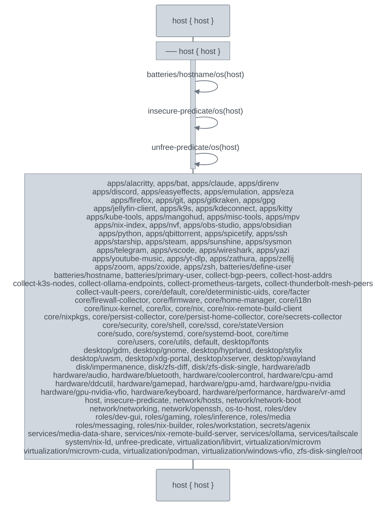

# Scope Sequence (expanded): cortex

```mermaid
%%{init: {"theme":"base","themeVariables":{"activationBkgColor":"#d0d7de","activationBorderColor":"#8c959f","actorBkg":"#d0d7de","actorBorder":"#6e7781","actorLineColor":"#6e7781","actorTextColor":"#424a53","background":"#eaeef2","classText":"#424a53","clusterBkg":"#d0d7de","clusterBorder":"#8c959f","edgeLabelBackground":"#eaeef2","labelBoxBkgColor":"#d0d7de","labelBoxBorderColor":"#6e7781","labelTextColor":"#424a53","lineColor":"#6e7781","loopTextColor":"#424a53","mainBkg":"#d0d7de","nodeBkg":"#d0d7de","nodeBorder":"#6e7781","nodeTextColor":"#424a53","noteBkgColor":"#d0d7de","noteBorderColor":"#8c959f","noteTextColor":"#424a53","pie1":"#fa4549","pie2":"#e16f24","pie3":"#bf8700","pie4":"#2da44e","pie5":"#339D9B","pie6":"#218bff","pie7":"#a475f9","pie8":"#4d2d00","pieLegendTextColor":"#424a53","pieOuterStrokeColor":"#8c959f","pieSectionTextColor":"#424a53","pieStrokeColor":"#8c959f","pieTitleTextColor":"#424a53","primaryBorderColor":"#6e7781","primaryColor":"#d0d7de","primaryTextColor":"#424a53","secondBkg":"#d0d7de","secondaryBorderColor":"#8c959f","secondaryColor":"#d0d7de","secondaryTextColor":"#424a53","sequenceNumberColor":"#eaeef2","signalColor":"#6e7781","signalTextColor":"#424a53","tertiaryBorderColor":"#8c959f","tertiaryColor":"#d0d7de","tertiaryTextColor":"#424a53","textColor":"#424a53","titleColor":"#424a53"}}}%%
sequenceDiagram
    participant host as host { host }

    Note over host: ── host { host }
    activate host
    host ->> host: batteries/hostname/os(host)
    host ->> host: insecure-predicate/os(host)
    host ->> host: unfree-predicate/os(host)
    deactivate host
    Note over host: apps/alacritty, apps/bat, apps/claude, apps/direnv<br/>apps/discord, apps/easyeffects, apps/emulation, apps/eza<br/>apps/firefox, apps/git, apps/gitkraken, apps/gpg<br/>apps/jellyfin-client, apps/k9s, apps/kdeconnect, apps/kitty<br/>apps/kube-tools, apps/mangohud, apps/misc-tools, apps/mpv<br/>apps/nix-index, apps/nvf, apps/obs-studio, apps/obsidian<br/>apps/python, apps/qbittorrent, apps/spicetify, apps/ssh<br/>apps/starship, apps/steam, apps/sunshine, apps/sysmon<br/>apps/telegram, apps/vscode, apps/wireshark, apps/yazi<br/>apps/youtube-music, apps/yt-dlp, apps/zathura, apps/zellij<br/>apps/zoom, apps/zoxide, apps/zsh, batteries/define-user<br/>batteries/hostname, batteries/primary-user, collect-bgp-peers, collect-host-addrs<br/>collect-k3s-nodes, collect-ollama-endpoints, collect-prometheus-targets, collect-thunderbolt-mesh-peers<br/>collect-vault-peers, core/default, core/deterministic-uids, core/facter<br/>core/firewall-collector, core/firmware, core/home-manager, core/i18n<br/>core/linux-kernel, core/lix, core/nix, core/nix-remote-build-client<br/>core/nixpkgs, core/persist-collector, core/persist-home-collector, core/secrets-collector<br/>core/security, core/shell, core/ssd, core/stateVersion<br/>core/sudo, core/systemd, core/systemd-boot, core/time<br/>core/users, core/utils, default, desktop/fonts<br/>desktop/gdm, desktop/gnome, desktop/hyprland, desktop/stylix<br/>desktop/uwsm, desktop/xdg-portal, desktop/xserver, desktop/xwayland<br/>disk/impermanence, disk/zfs-diff, disk/zfs-disk-single, hardware/adb<br/>hardware/audio, hardware/bluetooth, hardware/coolercontrol, hardware/cpu-amd<br/>hardware/ddcutil, hardware/gamepad, hardware/gpu-amd, hardware/gpu-nvidia<br/>hardware/gpu-nvidia-vfio, hardware/keyboard, hardware/performance, hardware/vr-amd<br/>host, insecure-predicate, network/hosts, network/network-boot<br/>network/networking, network/openssh, os-to-host, roles/dev<br/>roles/dev-gui, roles/gaming, roles/inference, roles/media<br/>roles/messaging, roles/nix-builder, roles/workstation, secrets/agenix<br/>services/media-data-share, services/nix-remote-build-server, services/ollama, services/tailscale<br/>system/nix-ld, unfree-predicate, virtualization/libvirt, virtualization/microvm<br/>virtualization/microvm-cuda, virtualization/podman, virtualization/windows-vfio, zfs-disk-single/root
```
