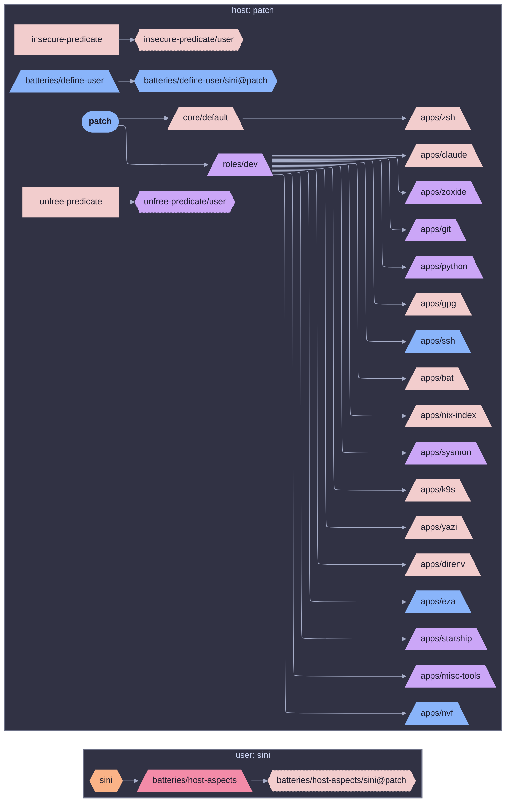

# Class Slice: homeManager: patch

```mermaid
%%{init: {"elk":{"mergeEdges":true,"nodePlacementStrategy":"BRANDES_KOEPF"},"flowchart":{"wrappingWidth":600},"layout":"elk","theme":"base","themeVariables":{"activationBkgColor":"#313244","activationBorderColor":"#6c7086","actorBkg":"#313244","actorBorder":"#a6adc8","actorLineColor":"#a6adc8","actorTextColor":"#cdd6f4","background":"#1e1e2e","classText":"#cdd6f4","clusterBkg":"#313244","clusterBorder":"#6c7086","edgeLabelBackground":"#1e1e2e","labelBoxBkgColor":"#313244","labelBoxBorderColor":"#a6adc8","labelTextColor":"#cdd6f4","lineColor":"#a6adc8","loopTextColor":"#cdd6f4","mainBkg":"#313244","nodeBkg":"#313244","nodeBorder":"#a6adc8","nodeTextColor":"#cdd6f4","noteBkgColor":"#313244","noteBorderColor":"#6c7086","noteTextColor":"#cdd6f4","pie1":"#f38ba8","pie2":"#fab387","pie3":"#f9e2af","pie4":"#a6e3a1","pie5":"#94e2d5","pie6":"#89b4fa","pie7":"#cba6f7","pie8":"#f2cdcd","pieLegendTextColor":"#cdd6f4","pieOuterStrokeColor":"#6c7086","pieSectionTextColor":"#cdd6f4","pieStrokeColor":"#6c7086","pieTitleTextColor":"#cdd6f4","primaryBorderColor":"#a6adc8","primaryColor":"#313244","primaryTextColor":"#cdd6f4","secondBkg":"#313244","secondaryBorderColor":"#6c7086","secondaryColor":"#313244","secondaryTextColor":"#cdd6f4","sequenceNumberColor":"#1e1e2e","signalColor":"#a6adc8","signalTextColor":"#cdd6f4","tertiaryBorderColor":"#6c7086","tertiaryColor":"#313244","tertiaryTextColor":"#cdd6f4","textColor":"#cdd6f4","titleColor":"#cdd6f4"}}}%%
graph LR
  patch([patch]):::root

  subgraph ctx_user_sini["user: sini"]
  den__batteries__host_aspects[/"batteries/host-aspects"\]:::den__batteries__host_aspects_c
  den__batteries__host_aspects__sini_patch{{"batteries/host-aspects/sini@patch"}}:::den__batteries__host_aspects__sini_patch_c
  sini{{"sini"}}:::sini_c
  den__batteries__host_aspects --> den__batteries__host_aspects__sini_patch
  sini --> den__batteries__host_aspects
  end
  subgraph ctx_host_patch["host: patch"]
  apps__bat[/"apps/bat"\]:::apps__bat_c
  apps__claude[/"apps/claude"\]:::apps__claude_c
  core__default[/"core/default"\]:::core__default_c
  den__batteries__define_user[/"batteries/define-user"\]:::den__batteries__define_user_c
  den__batteries__define_user__sini_patch{{"batteries/define-user/sini@patch"}}:::den__batteries__define_user__sini_patch_c
  roles__dev[/"roles/dev"\]:::roles__dev_c
  apps__direnv[/"apps/direnv"\]:::apps__direnv_c
  apps__eza[/"apps/eza"\]:::apps__eza_c
  apps__git[/"apps/git"\]:::apps__git_c
  apps__gpg[/"apps/gpg"\]:::apps__gpg_c
  insecure_predicate["insecure-predicate"]:::insecure_predicate_c
  insecure_predicate__user{{"insecure-predicate/user"}}:::insecure_predicate__user_c
  apps__k9s[/"apps/k9s"\]:::apps__k9s_c
  apps__misc_tools[/"apps/misc-tools"\]:::apps__misc_tools_c
  apps__nix_index[/"apps/nix-index"\]:::apps__nix_index_c
  apps__nvf[/"apps/nvf"\]:::apps__nvf_c
  apps__python[/"apps/python"\]:::apps__python_c
  apps__ssh[/"apps/ssh"\]:::apps__ssh_c
  apps__starship[/"apps/starship"\]:::apps__starship_c
  apps__sysmon[/"apps/sysmon"\]:::apps__sysmon_c
  unfree_predicate["unfree-predicate"]:::unfree_predicate_c
  unfree_predicate__user{{"unfree-predicate/user"}}:::unfree_predicate__user_c
  apps__yazi[/"apps/yazi"\]:::apps__yazi_c
  apps__zoxide[/"apps/zoxide"\]:::apps__zoxide_c
  apps__zsh[/"apps/zsh"\]:::apps__zsh_c
  core__default --> apps__zsh
  den__batteries__define_user --> den__batteries__define_user__sini_patch
  insecure_predicate --> insecure_predicate__user
  patch --> core__default
  patch --> roles__dev
  roles__dev --> apps__bat
  roles__dev --> apps__claude
  roles__dev --> apps__direnv
  roles__dev --> apps__eza
  roles__dev --> apps__git
  roles__dev --> apps__gpg
  roles__dev --> apps__k9s
  roles__dev --> apps__misc_tools
  roles__dev --> apps__nix_index
  roles__dev --> apps__nvf
  roles__dev --> apps__python
  roles__dev --> apps__ssh
  roles__dev --> apps__starship
  roles__dev --> apps__sysmon
  roles__dev --> apps__yazi
  roles__dev --> apps__zoxide
  unfree_predicate --> unfree_predicate__user
  end


  classDef root fill:#89b4fa,stroke:#89b4fa,color:#1e1e2e,font-weight:bold
  classDef apps_c fill:#a6e3a1,stroke:#a6e3a1,color:#1e1e2e,stroke-dasharray: 3 3,stroke-width:1px
  classDef apps__bat_c fill:#f2cdcd,stroke:#f2cdcd,color:#1e1e2e,stroke-width:3px
  classDef apps__claude_c fill:#f2cdcd,stroke:#f2cdcd,color:#1e1e2e,stroke-width:3px
  classDef core_c fill:#f9e2af,stroke:#f9e2af,color:#1e1e2e,stroke-dasharray: 3 3,stroke-width:1px
  classDef core__default_c fill:#f2cdcd,stroke:#f2cdcd,color:#1e1e2e,stroke-width:3px
  classDef den__batteries__define_user_c fill:#89b4fa,stroke:#89b4fa,color:#1e1e2e,stroke-width:3px
  classDef den__batteries__define_user__sini_patch_c fill:#89b4fa,stroke:#89b4fa,color:#1e1e2e,stroke-width:2px
  classDef roles__dev_c fill:#cba6f7,stroke:#cba6f7,color:#1e1e2e,stroke-width:3px
  classDef apps__direnv_c fill:#f2cdcd,stroke:#f2cdcd,color:#1e1e2e,stroke-width:3px
  classDef apps__eza_c fill:#89b4fa,stroke:#89b4fa,color:#1e1e2e,stroke-width:3px
  classDef apps__git_c fill:#cba6f7,stroke:#cba6f7,color:#1e1e2e,stroke-width:3px
  classDef apps__gpg_c fill:#f2cdcd,stroke:#f2cdcd,color:#1e1e2e,stroke-width:3px
  classDef den__batteries__host_aspects_c fill:#f38ba8,stroke:#f38ba8,color:#1e1e2e,stroke-width:3px
  classDef den__batteries__host_aspects__sini_patch_c fill:#f2cdcd,stroke:#f2cdcd,color:#1e1e2e,stroke-dasharray: 3 3,stroke-width:1px
  classDef insecure_predicate_c fill:#f2cdcd,stroke:#f2cdcd,color:#1e1e2e,stroke-width:3px
  classDef insecure_predicate__user_c fill:#f2cdcd,stroke:#f2cdcd,color:#1e1e2e,stroke-dasharray: 3 3,stroke-width:1px
  classDef apps__k9s_c fill:#f2cdcd,stroke:#f2cdcd,color:#1e1e2e,stroke-width:3px
  classDef apps__misc_tools_c fill:#cba6f7,stroke:#cba6f7,color:#1e1e2e,stroke-width:3px
  classDef apps__nix_index_c fill:#f2cdcd,stroke:#f2cdcd,color:#1e1e2e,stroke-width:3px
  classDef apps__nvf_c fill:#89b4fa,stroke:#89b4fa,color:#1e1e2e,stroke-width:3px
  classDef patch_c fill:#89b4fa,stroke:#89b4fa,color:#1e1e2e,stroke-width:3px
  classDef apps__python_c fill:#cba6f7,stroke:#cba6f7,color:#1e1e2e,stroke-width:3px
  classDef roles_c fill:#a6e3a1,stroke:#a6e3a1,color:#1e1e2e,stroke-dasharray: 3 3,stroke-width:1px
  classDef sini_c fill:#fab387,stroke:#fab387,color:#1e1e2e,stroke-width:3px
  classDef apps__ssh_c fill:#89b4fa,stroke:#89b4fa,color:#1e1e2e,stroke-width:3px
  classDef apps__starship_c fill:#cba6f7,stroke:#cba6f7,color:#1e1e2e,stroke-width:3px
  classDef apps__sysmon_c fill:#cba6f7,stroke:#cba6f7,color:#1e1e2e,stroke-width:3px
  classDef unfree_predicate_c fill:#f2cdcd,stroke:#f2cdcd,color:#1e1e2e,stroke-width:3px
  classDef unfree_predicate__user_c fill:#cba6f7,stroke:#cba6f7,color:#1e1e2e,stroke-dasharray: 3 3,stroke-width:1px
  classDef apps__yazi_c fill:#f2cdcd,stroke:#f2cdcd,color:#1e1e2e,stroke-width:3px
  classDef apps__zoxide_c fill:#cba6f7,stroke:#cba6f7,color:#1e1e2e,stroke-width:3px
  classDef apps__zsh_c fill:#f2cdcd,stroke:#f2cdcd,color:#1e1e2e,stroke-width:3px
style ctx_user_sini fill:#313244,stroke:#6c7086,stroke-width:2px
style ctx_host_patch fill:#313244,stroke:#6c7086,stroke-width:2px
```
