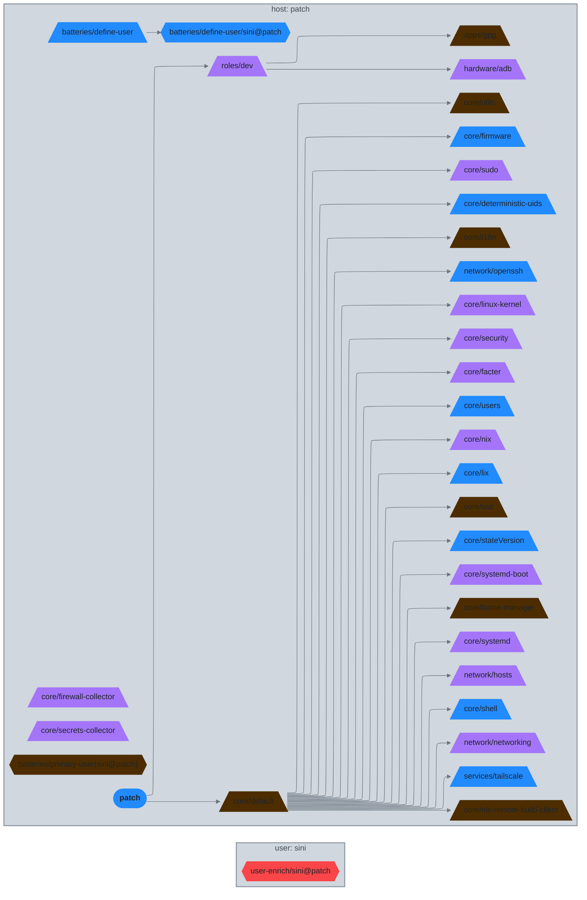

# Class Slice: nixos: patch

```mermaid
%%{init: {"elk":{"mergeEdges":true,"nodePlacementStrategy":"BRANDES_KOEPF"},"flowchart":{"wrappingWidth":600},"layout":"elk","theme":"base","themeVariables":{"activationBkgColor":"#d0d7de","activationBorderColor":"#8c959f","actorBkg":"#d0d7de","actorBorder":"#6e7781","actorLineColor":"#6e7781","actorTextColor":"#424a53","background":"#eaeef2","classText":"#424a53","clusterBkg":"#d0d7de","clusterBorder":"#8c959f","edgeLabelBackground":"#eaeef2","labelBoxBkgColor":"#d0d7de","labelBoxBorderColor":"#6e7781","labelTextColor":"#424a53","lineColor":"#6e7781","loopTextColor":"#424a53","mainBkg":"#d0d7de","nodeBkg":"#d0d7de","nodeBorder":"#6e7781","nodeTextColor":"#424a53","noteBkgColor":"#d0d7de","noteBorderColor":"#8c959f","noteTextColor":"#424a53","pie1":"#fa4549","pie2":"#e16f24","pie3":"#bf8700","pie4":"#2da44e","pie5":"#339D9B","pie6":"#218bff","pie7":"#a475f9","pie8":"#4d2d00","pieLegendTextColor":"#424a53","pieOuterStrokeColor":"#8c959f","pieSectionTextColor":"#424a53","pieStrokeColor":"#8c959f","pieTitleTextColor":"#424a53","primaryBorderColor":"#6e7781","primaryColor":"#d0d7de","primaryTextColor":"#424a53","secondBkg":"#d0d7de","secondaryBorderColor":"#8c959f","secondaryColor":"#d0d7de","secondaryTextColor":"#424a53","sequenceNumberColor":"#eaeef2","signalColor":"#6e7781","signalTextColor":"#424a53","tertiaryBorderColor":"#8c959f","tertiaryColor":"#d0d7de","tertiaryTextColor":"#424a53","textColor":"#424a53","titleColor":"#424a53"}}}%%
graph LR
  patch([patch]):::root

  subgraph ctx_user_sini["user: sini"]
  user_enrich__sini_patch{{"user-enrich/sini@patch"}}:::user_enrich__sini_patch_c

  end
  subgraph ctx_host_patch["host: patch"]
  hardware__adb[/"hardware/adb"\]:::hardware__adb_c
  core__default[/"core/default"\]:::core__default_c
  den__batteries__define_user[/"batteries/define-user"\]:::den__batteries__define_user_c
  den__batteries__define_user__sini_patch{{"batteries/define-user/sini@patch"}}:::den__batteries__define_user__sini_patch_c
  core__deterministic_uids[/"core/deterministic-uids"\]:::core__deterministic_uids_c
  roles__dev[/"roles/dev"\]:::roles__dev_c
  core__facter[/"core/facter"\]:::core__facter_c
  core__firewall_collector[/"core/firewall-collector"\]:::core__firewall_collector_c
  core__firmware[/"core/firmware"\]:::core__firmware_c
  apps__gpg[/"apps/gpg"\]:::apps__gpg_c
  core__home_manager[/"core/home-manager"\]:::core__home_manager_c
  network__hosts[/"network/hosts"\]:::network__hosts_c
  core__i18n[/"core/i18n"\]:::core__i18n_c
  core__linux_kernel[/"core/linux-kernel"\]:::core__linux_kernel_c
  core__lix[/"core/lix"\]:::core__lix_c
  network__networking[/"network/networking"\]:::network__networking_c
  core__nix[/"core/nix"\]:::core__nix_c
  core__nix_remote_build_client[/"core/nix-remote-build-client"\]:::core__nix_remote_build_client_c
  network__openssh[/"network/openssh"\]:::network__openssh_c
  den__batteries__primary_user_sini_patch_{{"batteries/primary-user(sini@patch)"}}:::den__batteries__primary_user_sini_patch__c
  core__secrets_collector[/"core/secrets-collector"\]:::core__secrets_collector_c
  core__security[/"core/security"\]:::core__security_c
  core__shell[/"core/shell"\]:::core__shell_c
  core__ssd[/"core/ssd"\]:::core__ssd_c
  core__stateVersion[/"core/stateVersion"\]:::core__stateVersion_c
  core__sudo[/"core/sudo"\]:::core__sudo_c
  core__systemd[/"core/systemd"\]:::core__systemd_c
  core__systemd_boot[/"core/systemd-boot"\]:::core__systemd_boot_c
  services__tailscale[/"services/tailscale"\]:::services__tailscale_c
  core__users[/"core/users"\]:::core__users_c
  core__utils[/"core/utils"\]:::core__utils_c
  core__default --> core__deterministic_uids
  core__default --> core__facter
  core__default --> core__firmware
  core__default --> core__home_manager
  core__default --> network__hosts
  core__default --> core__i18n
  core__default --> core__linux_kernel
  core__default --> core__lix
  core__default --> network__networking
  core__default --> core__nix
  core__default --> core__nix_remote_build_client
  core__default --> network__openssh
  core__default --> core__security
  core__default --> core__shell
  core__default --> core__ssd
  core__default --> core__stateVersion
  core__default --> core__sudo
  core__default --> core__systemd
  core__default --> core__systemd_boot
  core__default --> services__tailscale
  core__default --> core__users
  core__default --> core__utils
  den__batteries__define_user --> den__batteries__define_user__sini_patch
  patch --> core__default
  patch --> roles__dev
  roles__dev --> hardware__adb
  roles__dev --> apps__gpg
  end


  classDef root fill:#218bff,stroke:#218bff,color:#1f2328,font-weight:bold
  classDef hardware__adb_c fill:#a475f9,stroke:#a475f9,color:#1f2328,stroke-width:3px
  classDef apps_c fill:#2da44e,stroke:#2da44e,color:#1f2328,stroke-dasharray: 3 3,stroke-width:1px
  classDef core_c fill:#bf8700,stroke:#bf8700,color:#1f2328,stroke-dasharray: 3 3,stroke-width:1px
  classDef core__default_c fill:#4d2d00,stroke:#4d2d00,color:#1f2328,stroke-width:3px
  classDef den__batteries__define_user_c fill:#218bff,stroke:#218bff,color:#1f2328,stroke-width:3px
  classDef den__batteries__define_user__sini_patch_c fill:#218bff,stroke:#218bff,color:#1f2328,stroke-width:2px
  classDef core__deterministic_uids_c fill:#218bff,stroke:#218bff,color:#1f2328,stroke-width:3px
  classDef roles__dev_c fill:#a475f9,stroke:#a475f9,color:#1f2328,stroke-width:3px
  classDef core__facter_c fill:#a475f9,stroke:#a475f9,color:#1f2328,stroke-width:3px
  classDef core__firewall_collector_c fill:#a475f9,stroke:#a475f9,color:#1f2328,stroke-width:2px
  classDef core__firmware_c fill:#218bff,stroke:#218bff,color:#1f2328,stroke-width:3px
  classDef apps__gpg_c fill:#4d2d00,stroke:#4d2d00,color:#1f2328,stroke-width:3px
  classDef hardware_c fill:#2da44e,stroke:#2da44e,color:#1f2328,stroke-dasharray: 3 3,stroke-width:1px
  classDef core__home_manager_c fill:#4d2d00,stroke:#4d2d00,color:#1f2328,stroke-width:3px
  classDef network__hosts_c fill:#a475f9,stroke:#a475f9,color:#1f2328,stroke-width:3px
  classDef core__i18n_c fill:#4d2d00,stroke:#4d2d00,color:#1f2328,stroke-width:3px
  classDef core__linux_kernel_c fill:#a475f9,stroke:#a475f9,color:#1f2328,stroke-width:3px
  classDef core__lix_c fill:#218bff,stroke:#218bff,color:#1f2328,stroke-width:3px
  classDef network_c fill:#e16f24,stroke:#e16f24,color:#1f2328,stroke-dasharray: 3 3,stroke-width:1px
  classDef network__networking_c fill:#a475f9,stroke:#a475f9,color:#1f2328,stroke-width:3px
  classDef core__nix_c fill:#a475f9,stroke:#a475f9,color:#1f2328,stroke-width:3px
  classDef core__nix_remote_build_client_c fill:#4d2d00,stroke:#4d2d00,color:#1f2328,stroke-width:3px
  classDef network__openssh_c fill:#218bff,stroke:#218bff,color:#1f2328,stroke-width:3px
  classDef patch_c fill:#218bff,stroke:#218bff,color:#1f2328,stroke-width:3px
  classDef den__batteries__primary_user_sini_patch__c fill:#4d2d00,stroke:#4d2d00,color:#1f2328,stroke-width:2px
  classDef roles_c fill:#2da44e,stroke:#2da44e,color:#1f2328,stroke-dasharray: 3 3,stroke-width:1px
  classDef core__secrets_collector_c fill:#a475f9,stroke:#a475f9,color:#1f2328,stroke-width:2px
  classDef core__security_c fill:#a475f9,stroke:#a475f9,color:#1f2328,stroke-width:3px
  classDef services_c fill:#2da44e,stroke:#2da44e,color:#1f2328,stroke-dasharray: 3 3,stroke-width:1px
  classDef core__shell_c fill:#218bff,stroke:#218bff,color:#1f2328,stroke-width:3px
  classDef core__ssd_c fill:#4d2d00,stroke:#4d2d00,color:#1f2328,stroke-width:3px
  classDef core__stateVersion_c fill:#218bff,stroke:#218bff,color:#1f2328,stroke-width:3px
  classDef core__sudo_c fill:#a475f9,stroke:#a475f9,color:#1f2328,stroke-width:3px
  classDef core__systemd_c fill:#a475f9,stroke:#a475f9,color:#1f2328,stroke-width:3px
  classDef core__systemd_boot_c fill:#a475f9,stroke:#a475f9,color:#1f2328,stroke-width:3px
  classDef services__tailscale_c fill:#218bff,stroke:#218bff,color:#1f2328,stroke-width:3px
  classDef user_enrich__sini_patch_c fill:#fa4549,stroke:#fa4549,color:#1f2328,stroke-width:2px
  classDef core__users_c fill:#218bff,stroke:#218bff,color:#1f2328,stroke-width:3px
  classDef core__utils_c fill:#4d2d00,stroke:#4d2d00,color:#1f2328,stroke-width:3px
style ctx_user_sini fill:#d0d7de,stroke:#8c959f,stroke-width:2px
style ctx_host_patch fill:#d0d7de,stroke:#8c959f,stroke-width:2px
```
