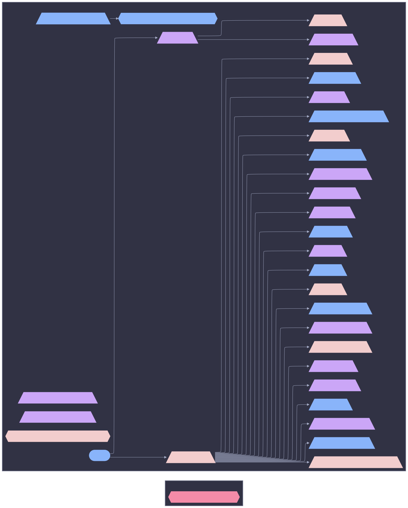

# Class Slice: nixos: patch

```mermaid
%%{init: {"elk":{"mergeEdges":true,"nodePlacementStrategy":"BRANDES_KOEPF"},"flowchart":{"wrappingWidth":600},"layout":"elk","theme":"base","themeVariables":{"activationBkgColor":"#313244","activationBorderColor":"#6c7086","actorBkg":"#313244","actorBorder":"#a6adc8","actorLineColor":"#a6adc8","actorTextColor":"#cdd6f4","background":"#1e1e2e","classText":"#cdd6f4","clusterBkg":"#313244","clusterBorder":"#6c7086","edgeLabelBackground":"#1e1e2e","labelBoxBkgColor":"#313244","labelBoxBorderColor":"#a6adc8","labelTextColor":"#cdd6f4","lineColor":"#a6adc8","loopTextColor":"#cdd6f4","mainBkg":"#313244","nodeBkg":"#313244","nodeBorder":"#a6adc8","nodeTextColor":"#cdd6f4","noteBkgColor":"#313244","noteBorderColor":"#6c7086","noteTextColor":"#cdd6f4","pie1":"#f38ba8","pie2":"#fab387","pie3":"#f9e2af","pie4":"#a6e3a1","pie5":"#94e2d5","pie6":"#89b4fa","pie7":"#cba6f7","pie8":"#f2cdcd","pieLegendTextColor":"#cdd6f4","pieOuterStrokeColor":"#6c7086","pieSectionTextColor":"#cdd6f4","pieStrokeColor":"#6c7086","pieTitleTextColor":"#cdd6f4","primaryBorderColor":"#a6adc8","primaryColor":"#313244","primaryTextColor":"#cdd6f4","secondBkg":"#313244","secondaryBorderColor":"#6c7086","secondaryColor":"#313244","secondaryTextColor":"#cdd6f4","sequenceNumberColor":"#1e1e2e","signalColor":"#a6adc8","signalTextColor":"#cdd6f4","tertiaryBorderColor":"#6c7086","tertiaryColor":"#313244","tertiaryTextColor":"#cdd6f4","textColor":"#cdd6f4","titleColor":"#cdd6f4"}}}%%
graph LR
  patch([patch]):::root

  subgraph ctx_user_sini["user: sini"]
  user_enrich__sini_patch{{"user-enrich/sini@patch"}}:::user_enrich__sini_patch_c

  end
  subgraph ctx_host_patch["host: patch"]
  hardware__adb[/"hardware/adb"\]:::hardware__adb_c
  core__default[/"core/default"\]:::core__default_c
  den__batteries__define_user[/"batteries/define-user"\]:::den__batteries__define_user_c
  den__batteries__define_user__sini_patch{{"batteries/define-user/sini@patch"}}:::den__batteries__define_user__sini_patch_c
  core__deterministic_uids[/"core/deterministic-uids"\]:::core__deterministic_uids_c
  roles__dev[/"roles/dev"\]:::roles__dev_c
  core__facter[/"core/facter"\]:::core__facter_c
  core__firewall_collector[/"core/firewall-collector"\]:::core__firewall_collector_c
  core__firmware[/"core/firmware"\]:::core__firmware_c
  apps__gpg[/"apps/gpg"\]:::apps__gpg_c
  core__home_manager[/"core/home-manager"\]:::core__home_manager_c
  network__hosts[/"network/hosts"\]:::network__hosts_c
  core__i18n[/"core/i18n"\]:::core__i18n_c
  core__linux_kernel[/"core/linux-kernel"\]:::core__linux_kernel_c
  core__lix[/"core/lix"\]:::core__lix_c
  network__networking[/"network/networking"\]:::network__networking_c
  core__nix[/"core/nix"\]:::core__nix_c
  core__nix_remote_build_client[/"core/nix-remote-build-client"\]:::core__nix_remote_build_client_c
  network__openssh[/"network/openssh"\]:::network__openssh_c
  den__batteries__primary_user_sini_patch_{{"batteries/primary-user(sini@patch)"}}:::den__batteries__primary_user_sini_patch__c
  core__secrets_collector[/"core/secrets-collector"\]:::core__secrets_collector_c
  core__security[/"core/security"\]:::core__security_c
  core__shell[/"core/shell"\]:::core__shell_c
  core__ssd[/"core/ssd"\]:::core__ssd_c
  core__stateVersion[/"core/stateVersion"\]:::core__stateVersion_c
  core__sudo[/"core/sudo"\]:::core__sudo_c
  core__systemd[/"core/systemd"\]:::core__systemd_c
  core__systemd_boot[/"core/systemd-boot"\]:::core__systemd_boot_c
  services__tailscale[/"services/tailscale"\]:::services__tailscale_c
  core__users[/"core/users"\]:::core__users_c
  core__utils[/"core/utils"\]:::core__utils_c
  core__default --> core__deterministic_uids
  core__default --> core__facter
  core__default --> core__firmware
  core__default --> core__home_manager
  core__default --> network__hosts
  core__default --> core__i18n
  core__default --> core__linux_kernel
  core__default --> core__lix
  core__default --> network__networking
  core__default --> core__nix
  core__default --> core__nix_remote_build_client
  core__default --> network__openssh
  core__default --> core__security
  core__default --> core__shell
  core__default --> core__ssd
  core__default --> core__stateVersion
  core__default --> core__sudo
  core__default --> core__systemd
  core__default --> core__systemd_boot
  core__default --> services__tailscale
  core__default --> core__users
  core__default --> core__utils
  den__batteries__define_user --> den__batteries__define_user__sini_patch
  patch --> core__default
  patch --> roles__dev
  roles__dev --> hardware__adb
  roles__dev --> apps__gpg
  end


  classDef root fill:#89b4fa,stroke:#89b4fa,color:#1e1e2e,font-weight:bold
  classDef hardware__adb_c fill:#cba6f7,stroke:#cba6f7,color:#1e1e2e,stroke-width:3px
  classDef apps_c fill:#a6e3a1,stroke:#a6e3a1,color:#1e1e2e,stroke-dasharray: 3 3,stroke-width:1px
  classDef core_c fill:#f9e2af,stroke:#f9e2af,color:#1e1e2e,stroke-dasharray: 3 3,stroke-width:1px
  classDef core__default_c fill:#f2cdcd,stroke:#f2cdcd,color:#1e1e2e,stroke-width:3px
  classDef den__batteries__define_user_c fill:#89b4fa,stroke:#89b4fa,color:#1e1e2e,stroke-width:3px
  classDef den__batteries__define_user__sini_patch_c fill:#89b4fa,stroke:#89b4fa,color:#1e1e2e,stroke-width:2px
  classDef core__deterministic_uids_c fill:#89b4fa,stroke:#89b4fa,color:#1e1e2e,stroke-width:3px
  classDef roles__dev_c fill:#cba6f7,stroke:#cba6f7,color:#1e1e2e,stroke-width:3px
  classDef core__facter_c fill:#cba6f7,stroke:#cba6f7,color:#1e1e2e,stroke-width:3px
  classDef core__firewall_collector_c fill:#cba6f7,stroke:#cba6f7,color:#1e1e2e,stroke-width:2px
  classDef core__firmware_c fill:#89b4fa,stroke:#89b4fa,color:#1e1e2e,stroke-width:3px
  classDef apps__gpg_c fill:#f2cdcd,stroke:#f2cdcd,color:#1e1e2e,stroke-width:3px
  classDef hardware_c fill:#a6e3a1,stroke:#a6e3a1,color:#1e1e2e,stroke-dasharray: 3 3,stroke-width:1px
  classDef core__home_manager_c fill:#f2cdcd,stroke:#f2cdcd,color:#1e1e2e,stroke-width:3px
  classDef network__hosts_c fill:#cba6f7,stroke:#cba6f7,color:#1e1e2e,stroke-width:3px
  classDef core__i18n_c fill:#f2cdcd,stroke:#f2cdcd,color:#1e1e2e,stroke-width:3px
  classDef core__linux_kernel_c fill:#cba6f7,stroke:#cba6f7,color:#1e1e2e,stroke-width:3px
  classDef core__lix_c fill:#89b4fa,stroke:#89b4fa,color:#1e1e2e,stroke-width:3px
  classDef network_c fill:#fab387,stroke:#fab387,color:#1e1e2e,stroke-dasharray: 3 3,stroke-width:1px
  classDef network__networking_c fill:#cba6f7,stroke:#cba6f7,color:#1e1e2e,stroke-width:3px
  classDef core__nix_c fill:#cba6f7,stroke:#cba6f7,color:#1e1e2e,stroke-width:3px
  classDef core__nix_remote_build_client_c fill:#f2cdcd,stroke:#f2cdcd,color:#1e1e2e,stroke-width:3px
  classDef network__openssh_c fill:#89b4fa,stroke:#89b4fa,color:#1e1e2e,stroke-width:3px
  classDef patch_c fill:#89b4fa,stroke:#89b4fa,color:#1e1e2e,stroke-width:3px
  classDef den__batteries__primary_user_sini_patch__c fill:#f2cdcd,stroke:#f2cdcd,color:#1e1e2e,stroke-width:2px
  classDef roles_c fill:#a6e3a1,stroke:#a6e3a1,color:#1e1e2e,stroke-dasharray: 3 3,stroke-width:1px
  classDef core__secrets_collector_c fill:#cba6f7,stroke:#cba6f7,color:#1e1e2e,stroke-width:2px
  classDef core__security_c fill:#cba6f7,stroke:#cba6f7,color:#1e1e2e,stroke-width:3px
  classDef services_c fill:#a6e3a1,stroke:#a6e3a1,color:#1e1e2e,stroke-dasharray: 3 3,stroke-width:1px
  classDef core__shell_c fill:#89b4fa,stroke:#89b4fa,color:#1e1e2e,stroke-width:3px
  classDef core__ssd_c fill:#f2cdcd,stroke:#f2cdcd,color:#1e1e2e,stroke-width:3px
  classDef core__stateVersion_c fill:#89b4fa,stroke:#89b4fa,color:#1e1e2e,stroke-width:3px
  classDef core__sudo_c fill:#cba6f7,stroke:#cba6f7,color:#1e1e2e,stroke-width:3px
  classDef core__systemd_c fill:#cba6f7,stroke:#cba6f7,color:#1e1e2e,stroke-width:3px
  classDef core__systemd_boot_c fill:#cba6f7,stroke:#cba6f7,color:#1e1e2e,stroke-width:3px
  classDef services__tailscale_c fill:#89b4fa,stroke:#89b4fa,color:#1e1e2e,stroke-width:3px
  classDef user_enrich__sini_patch_c fill:#f38ba8,stroke:#f38ba8,color:#1e1e2e,stroke-width:2px
  classDef core__users_c fill:#89b4fa,stroke:#89b4fa,color:#1e1e2e,stroke-width:3px
  classDef core__utils_c fill:#f2cdcd,stroke:#f2cdcd,color:#1e1e2e,stroke-width:3px
style ctx_user_sini fill:#313244,stroke:#6c7086,stroke-width:2px
style ctx_host_patch fill:#313244,stroke:#6c7086,stroke-width:2px
```
