# Full DAG: patch



```mermaid
%%{init: {"elk":{"mergeEdges":true,"nodePlacementStrategy":"BRANDES_KOEPF"},"flowchart":{"wrappingWidth":600},"layout":"elk","theme":"base","themeVariables":{"activationBkgColor":"#d0d7de","activationBorderColor":"#8c959f","actorBkg":"#d0d7de","actorBorder":"#6e7781","actorLineColor":"#6e7781","actorTextColor":"#424a53","background":"#eaeef2","classText":"#424a53","clusterBkg":"#d0d7de","clusterBorder":"#8c959f","edgeLabelBackground":"#eaeef2","labelBoxBkgColor":"#d0d7de","labelBoxBorderColor":"#6e7781","labelTextColor":"#424a53","lineColor":"#6e7781","loopTextColor":"#424a53","mainBkg":"#d0d7de","nodeBkg":"#d0d7de","nodeBorder":"#6e7781","nodeTextColor":"#424a53","noteBkgColor":"#d0d7de","noteBorderColor":"#8c959f","noteTextColor":"#424a53","pie1":"#fa4549","pie2":"#e16f24","pie3":"#bf8700","pie4":"#2da44e","pie5":"#339D9B","pie6":"#218bff","pie7":"#a475f9","pie8":"#4d2d00","pieLegendTextColor":"#424a53","pieOuterStrokeColor":"#8c959f","pieSectionTextColor":"#424a53","pieStrokeColor":"#8c959f","pieTitleTextColor":"#424a53","primaryBorderColor":"#6e7781","primaryColor":"#d0d7de","primaryTextColor":"#424a53","secondBkg":"#d0d7de","secondaryBorderColor":"#8c959f","secondaryColor":"#d0d7de","secondaryTextColor":"#424a53","sequenceNumberColor":"#eaeef2","signalColor":"#6e7781","signalTextColor":"#424a53","tertiaryBorderColor":"#8c959f","tertiaryColor":"#d0d7de","tertiaryTextColor":"#424a53","textColor":"#424a53","titleColor":"#424a53"}}}%%
graph LR
  patch([patch]):::root

  subgraph ctx_user_sini["user: sini"]
  _policy_hm_user_detect__0_["<policy:hm-user-detect>[0]"]:::_policy_hm_user_detect__0__c
  default_user_sini["default"]:::default_user_sini_c
  hm_user_detect["hm-user-detect"]:::hm_user_detect_c
  homeAarch64_to_hm["homeAarch64-to-hm"]:::homeAarch64_to_hm_c
  homeDarwin_to_hm["homeDarwin-to-hm"]:::homeDarwin_to_hm_c
  den__batteries__host_aspects[/"batteries/host-aspects"\]:::den__batteries__host_aspects_c
  den__batteries__host_aspects__sini_patch{{"batteries/host-aspects/sini@patch"}}:::den__batteries__host_aspects__sini_patch_c
  os_to_host_user_sini["os-to-host"]:::os_to_host_user_sini_c
  core__resolved_user_emitter[/"core/resolved-user-emitter"\]:::core__resolved_user_emitter_c
  sini{{"sini"}}:::sini_c
  user["user"]:::user_c
  user_enrich__sini_patch{{"user-enrich/sini@patch"}}:::user_enrich__sini_patch_c
  user_to_host["user-to-host"]:::user_to_host_c
  user__resolve_user_["user/resolve(user)"]:::user__resolve_user__c
  den__batteries__host_aspects --> den__batteries__host_aspects__sini_patch
  sini --> den__batteries__host_aspects
  user --> _policy_hm_user_detect__0_
  user --> default_user_sini
  user --> core__resolved_user_emitter
  user --> sini
  user --> user_enrich__sini_patch
  user --> user__resolve_user_
  end
  subgraph ctx_host_patch["host: patch"]
  hardware__adb[/"hardware/adb"\]:::hardware__adb_c
  apps__bat[/"apps/bat"\]:::apps__bat_c
  apps__claude[/"apps/claude"\]:::apps__claude_c
  collect_bgp_peers["collect-bgp-peers"]:::collect_bgp_peers_c
  collect_host_addrs["collect-host-addrs"]:::collect_host_addrs_c
  collect_k3s_nodes["collect-k3s-nodes"]:::collect_k3s_nodes_c
  collect_ollama_endpoints["collect-ollama-endpoints"]:::collect_ollama_endpoints_c
  collect_prometheus_targets["collect-prometheus-targets"]:::collect_prometheus_targets_c
  collect_thunderbolt_mesh_peers["collect-thunderbolt-mesh-peers"]:::collect_thunderbolt_mesh_peers_c
  collect_vault_peers["collect-vault-peers"]:::collect_vault_peers_c
  core__default[/"core/default"\]:::core__default_c
  default_host_patch["default"]:::default_host_patch_c
  den__batteries__define_user[/"batteries/define-user"\]:::den__batteries__define_user_c
  den__batteries__define_user__sini_patch{{"batteries/define-user/sini@patch"}}:::den__batteries__define_user__sini_patch_c
  core__deterministic_uids[/"core/deterministic-uids"\]:::core__deterministic_uids_c
  roles__dev[/"roles/dev"\]:::roles__dev_c
  apps__direnv[/"apps/direnv"\]:::apps__direnv_c
  apps__eza[/"apps/eza"\]:::apps__eza_c
  core__facter[/"core/facter"\]:::core__facter_c
  core__firewall_collector[/"core/firewall-collector"\]:::core__firewall_collector_c
  core__firmware[/"core/firmware"\]:::core__firmware_c
  apps__git[/"apps/git"\]:::apps__git_c
  apps__gpg[/"apps/gpg"\]:::apps__gpg_c
  core__home_manager[/"core/home-manager"\]:::core__home_manager_c
  host["host"]:::host_c
  host_to_hm_users["host-to-hm-users"]:::host_to_hm_users_c
  den__batteries__host__resolve_define_user__den__batteries[/"batteries/host/resolve(define-user):den/batteries"\]:::den__batteries__host__resolve_define_user__den__batteries_c
  host__resolve_host_["host/resolve(host)"]:::host__resolve_host__c
  host__resolve_insecure_predicate_["host/resolve(insecure-predicate)"]:::host__resolve_insecure_predicate__c
  host__resolve_unfree_predicate_["host/resolve(unfree-predicate)"]:::host__resolve_unfree_predicate__c
  den__batteries__hostname[/"batteries/hostname"\]:::den__batteries__hostname_c
  den__batteries__hostname__os{{"batteries/hostname/os"}}:::den__batteries__hostname__os_c
  network__hosts[/"network/hosts"\]:::network__hosts_c
  core__i18n[/"core/i18n"\]:::core__i18n_c
  insecure_predicate["insecure-predicate"]:::insecure_predicate_c
  insecure_predicate__os{{"insecure-predicate/os"}}:::insecure_predicate__os_c
  insecure_predicate__user{{"insecure-predicate/user"}}:::insecure_predicate__user_c
  apps__k9s[/"apps/k9s"\]:::apps__k9s_c
  core__linux_kernel[/"core/linux-kernel"\]:::core__linux_kernel_c
  core__lix[/"core/lix"\]:::core__lix_c
  apps__misc_tools[/"apps/misc-tools"\]:::apps__misc_tools_c
  network__networking[/"network/networking"\]:::network__networking_c
  core__nix[/"core/nix"\]:::core__nix_c
  apps__nix_index[/"apps/nix-index"\]:::apps__nix_index_c
  core__nix_remote_build_client[/"core/nix-remote-build-client"\]:::core__nix_remote_build_client_c
  core__nixpkgs[/"core/nixpkgs"\]:::core__nixpkgs_c
  apps__nvf[/"apps/nvf"\]:::apps__nvf_c
  network__openssh[/"network/openssh"\]:::network__openssh_c
  os_to_host_host_patch["os-to-host"]:::os_to_host_host_patch_c
  den__batteries__primary_user[/"batteries/primary-user"\]:::den__batteries__primary_user_c
  den__batteries__primary_user_sini_patch_{{"batteries/primary-user(sini@patch)"}}:::den__batteries__primary_user_sini_patch__c
  apps__python[/"apps/python"\]:::apps__python_c
  core__secrets_collector[/"core/secrets-collector"\]:::core__secrets_collector_c
  core__security[/"core/security"\]:::core__security_c
  core__shell[/"core/shell"\]:::core__shell_c
  core__ssd[/"core/ssd"\]:::core__ssd_c
  apps__ssh[/"apps/ssh"\]:::apps__ssh_c
  apps__starship[/"apps/starship"\]:::apps__starship_c
  core__stateVersion[/"core/stateVersion"\]:::core__stateVersion_c
  core__sudo[/"core/sudo"\]:::core__sudo_c
  apps__sysmon[/"apps/sysmon"\]:::apps__sysmon_c
  core__systemd[/"core/systemd"\]:::core__systemd_c
  core__systemd_boot[/"core/systemd-boot"\]:::core__systemd_boot_c
  services__tailscale[/"services/tailscale"\]:::services__tailscale_c
  core__time[/"core/time"\]:::core__time_c
  unfree_predicate["unfree-predicate"]:::unfree_predicate_c
  unfree_predicate__os{{"unfree-predicate/os"}}:::unfree_predicate__os_c
  unfree_predicate__user{{"unfree-predicate/user"}}:::unfree_predicate__user_c
  core__users[/"core/users"\]:::core__users_c
  core__utils[/"core/utils"\]:::core__utils_c
  apps__yazi[/"apps/yazi"\]:::apps__yazi_c
  apps__zoxide[/"apps/zoxide"\]:::apps__zoxide_c
  apps__zsh[/"apps/zsh"\]:::apps__zsh_c
  core__default --> core__deterministic_uids
  core__default --> core__facter
  core__default --> core__firmware
  core__default --> core__home_manager
  core__default --> network__hosts
  core__default --> core__i18n
  core__default --> core__linux_kernel
  core__default --> core__lix
  core__default --> network__networking
  core__default --> core__nix
  core__default --> core__nix_remote_build_client
  core__default --> core__nixpkgs
  core__default --> network__openssh
  core__default --> core__security
  core__default --> core__shell
  core__default --> core__ssd
  core__default --> core__stateVersion
  core__default --> core__sudo
  core__default --> core__systemd
  core__default --> core__systemd_boot
  core__default --> services__tailscale
  core__default --> core__time
  core__default --> core__users
  core__default --> core__utils
  core__default --> apps__zsh
  default_host_patch --> den__batteries__define_user
  default_host_patch --> den__batteries__hostname
  default_host_patch --> insecure_predicate
  default_host_patch --> den__batteries__primary_user
  default_host_patch --> den__batteries__primary_user_sini_patch_
  default_host_patch --> unfree_predicate
  den__batteries__define_user --> den__batteries__define_user__sini_patch
  den__batteries__define_user --> den__batteries__host__resolve_define_user__den__batteries
  den__batteries__hostname --> den__batteries__hostname__os
  host --> default_host_patch
  host --> core__firewall_collector
  host --> host__resolve_host_
  host --> patch
  host --> core__secrets_collector
  insecure_predicate --> host__resolve_insecure_predicate_
  insecure_predicate --> insecure_predicate__os
  insecure_predicate --> insecure_predicate__user
  patch --> core__default
  patch --> roles__dev
  roles__dev --> hardware__adb
  roles__dev --> apps__bat
  roles__dev --> apps__claude
  roles__dev --> apps__direnv
  roles__dev --> apps__eza
  roles__dev --> apps__git
  roles__dev --> apps__gpg
  roles__dev --> apps__k9s
  roles__dev --> apps__misc_tools
  roles__dev --> apps__nix_index
  roles__dev --> apps__nvf
  roles__dev --> apps__python
  roles__dev --> apps__ssh
  roles__dev --> apps__starship
  roles__dev --> apps__sysmon
  roles__dev --> apps__yazi
  roles__dev --> apps__zoxide
  unfree_predicate --> host__resolve_unfree_predicate_
  unfree_predicate --> unfree_predicate__os
  unfree_predicate --> unfree_predicate__user
  end


  classDef root fill:#218bff,stroke:#218bff,color:#1f2328,font-weight:bold
  classDef _policy_hm_user_detect__0__c fill:#4d2d00,stroke:#4d2d00,color:#1f2328,stroke-dasharray: 3 3,stroke-width:1px
  classDef hardware__adb_c fill:#a475f9,stroke:#a475f9,color:#1f2328,stroke-width:3px
  classDef apps_c fill:#2da44e,stroke:#2da44e,color:#1f2328,stroke-dasharray: 3 3,stroke-width:1px
  classDef apps__bat_c fill:#4d2d00,stroke:#4d2d00,color:#1f2328,stroke-width:3px
  classDef apps__claude_c fill:#4d2d00,stroke:#4d2d00,color:#1f2328,stroke-width:3px
  classDef collect_bgp_peers_c fill:#a475f9,stroke:#a475f9,color:#1f2328,stroke-width:2px,stroke-dasharray: 8 4
  classDef collect_host_addrs_c fill:#218bff,stroke:#218bff,color:#1f2328,stroke-width:2px,stroke-dasharray: 8 4
  classDef collect_k3s_nodes_c fill:#a475f9,stroke:#a475f9,color:#1f2328,stroke-width:2px,stroke-dasharray: 8 4
  classDef collect_ollama_endpoints_c fill:#a475f9,stroke:#a475f9,color:#1f2328,stroke-width:2px,stroke-dasharray: 8 4
  classDef collect_prometheus_targets_c fill:#a475f9,stroke:#a475f9,color:#1f2328,stroke-width:2px,stroke-dasharray: 8 4
  classDef collect_thunderbolt_mesh_peers_c fill:#a475f9,stroke:#a475f9,color:#1f2328,stroke-width:2px,stroke-dasharray: 8 4
  classDef collect_vault_peers_c fill:#218bff,stroke:#218bff,color:#1f2328,stroke-width:2px,stroke-dasharray: 8 4
  classDef core_c fill:#bf8700,stroke:#bf8700,color:#1f2328,stroke-dasharray: 3 3,stroke-width:1px
  classDef core__default_c fill:#4d2d00,stroke:#4d2d00,color:#1f2328,stroke-width:3px
  classDef default_host_patch_c fill:#218bff,stroke:#218bff,color:#1f2328,stroke-width:3px
  classDef default_user_sini_c fill:#4d2d00,stroke:#4d2d00,color:#1f2328,stroke-width:3px
  classDef den__batteries__define_user_c fill:#218bff,stroke:#218bff,color:#1f2328,stroke-width:3px
  classDef den__batteries__define_user__sini_patch_c fill:#218bff,stroke:#218bff,color:#1f2328,stroke-width:2px
  classDef core__deterministic_uids_c fill:#218bff,stroke:#218bff,color:#1f2328,stroke-width:3px
  classDef roles__dev_c fill:#a475f9,stroke:#a475f9,color:#1f2328,stroke-width:3px
  classDef apps__direnv_c fill:#4d2d00,stroke:#4d2d00,color:#1f2328,stroke-width:3px
  classDef apps__eza_c fill:#218bff,stroke:#218bff,color:#1f2328,stroke-width:3px
  classDef core__facter_c fill:#a475f9,stroke:#a475f9,color:#1f2328,stroke-width:3px
  classDef core__firewall_collector_c fill:#a475f9,stroke:#a475f9,color:#1f2328,stroke-width:2px
  classDef core__firmware_c fill:#218bff,stroke:#218bff,color:#1f2328,stroke-width:3px
  classDef apps__git_c fill:#a475f9,stroke:#a475f9,color:#1f2328,stroke-width:3px
  classDef apps__gpg_c fill:#4d2d00,stroke:#4d2d00,color:#1f2328,stroke-width:3px
  classDef hardware_c fill:#2da44e,stroke:#2da44e,color:#1f2328,stroke-dasharray: 3 3,stroke-width:1px
  classDef hm_user_detect_c fill:#fa4549,stroke:#fa4549,color:#1f2328,stroke-width:2px,stroke-dasharray: 8 4
  classDef core__home_manager_c fill:#4d2d00,stroke:#4d2d00,color:#1f2328,stroke-width:3px
  classDef homeAarch64_to_hm_c fill:#4d2d00,stroke:#4d2d00,color:#1f2328,stroke-width:2px,stroke-dasharray: 8 4
  classDef homeDarwin_to_hm_c fill:#fa4549,stroke:#fa4549,color:#1f2328,stroke-width:2px,stroke-dasharray: 8 4
  classDef host_c fill:#218bff,stroke:#218bff,color:#1f2328,stroke-width:3px
  classDef den__batteries__host_aspects_c fill:#fa4549,stroke:#fa4549,color:#1f2328,stroke-width:3px
  classDef den__batteries__host_aspects__sini_patch_c fill:#4d2d00,stroke:#4d2d00,color:#1f2328,stroke-dasharray: 3 3,stroke-width:1px
  classDef host_to_hm_users_c fill:#4d2d00,stroke:#4d2d00,color:#1f2328,stroke-width:2px,stroke-dasharray: 8 4
  classDef den__batteries__host__resolve_define_user__den__batteries_c fill:#d0d7de,stroke:#8c959f,color:#424a53,stroke-dasharray: 2 2,stroke-width:1px
  classDef host__resolve_host__c fill:#d0d7de,stroke:#8c959f,color:#424a53,stroke-dasharray: 2 2,stroke-width:1px
  classDef host__resolve_insecure_predicate__c fill:#d0d7de,stroke:#8c959f,color:#424a53,stroke-dasharray: 2 2,stroke-width:1px
  classDef host__resolve_unfree_predicate__c fill:#d0d7de,stroke:#8c959f,color:#424a53,stroke-dasharray: 2 2,stroke-width:1px
  classDef den__batteries__hostname_c fill:#218bff,stroke:#218bff,color:#1f2328,stroke-width:3px
  classDef den__batteries__hostname__os_c fill:#218bff,stroke:#218bff,color:#1f2328,stroke-dasharray: 3 3,stroke-width:1px
  classDef network__hosts_c fill:#a475f9,stroke:#a475f9,color:#1f2328,stroke-width:3px
  classDef core__i18n_c fill:#4d2d00,stroke:#4d2d00,color:#1f2328,stroke-width:3px
  classDef insecure_predicate_c fill:#4d2d00,stroke:#4d2d00,color:#1f2328,stroke-width:3px
  classDef insecure_predicate__os_c fill:#218bff,stroke:#218bff,color:#1f2328,stroke-dasharray: 3 3,stroke-width:1px
  classDef insecure_predicate__user_c fill:#4d2d00,stroke:#4d2d00,color:#1f2328,stroke-dasharray: 3 3,stroke-width:1px
  classDef apps__k9s_c fill:#4d2d00,stroke:#4d2d00,color:#1f2328,stroke-width:3px
  classDef core__linux_kernel_c fill:#a475f9,stroke:#a475f9,color:#1f2328,stroke-width:3px
  classDef core__lix_c fill:#218bff,stroke:#218bff,color:#1f2328,stroke-width:3px
  classDef apps__misc_tools_c fill:#a475f9,stroke:#a475f9,color:#1f2328,stroke-width:3px
  classDef network_c fill:#e16f24,stroke:#e16f24,color:#1f2328,stroke-dasharray: 3 3,stroke-width:1px
  classDef network__networking_c fill:#a475f9,stroke:#a475f9,color:#1f2328,stroke-width:3px
  classDef core__nix_c fill:#a475f9,stroke:#a475f9,color:#1f2328,stroke-width:3px
  classDef apps__nix_index_c fill:#4d2d00,stroke:#4d2d00,color:#1f2328,stroke-width:3px
  classDef core__nix_remote_build_client_c fill:#4d2d00,stroke:#4d2d00,color:#1f2328,stroke-width:3px
  classDef core__nixpkgs_c fill:#218bff,stroke:#218bff,color:#1f2328,stroke-width:3px
  classDef apps__nvf_c fill:#218bff,stroke:#218bff,color:#1f2328,stroke-width:3px
  classDef network__openssh_c fill:#218bff,stroke:#218bff,color:#1f2328,stroke-width:3px
  classDef os_to_host_host_patch_c fill:#4d2d00,stroke:#4d2d00,color:#1f2328,stroke-width:2px,stroke-dasharray: 8 4
  classDef os_to_host_user_sini_c fill:#e16f24,stroke:#e16f24,color:#1f2328,stroke-width:2px,stroke-dasharray: 8 4
  classDef patch_c fill:#218bff,stroke:#218bff,color:#1f2328,stroke-width:3px
  classDef den__batteries__primary_user_c fill:#4d2d00,stroke:#4d2d00,color:#1f2328,stroke-dasharray: 3 3,stroke-width:1px
  classDef den__batteries__primary_user_sini_patch__c fill:#4d2d00,stroke:#4d2d00,color:#1f2328,stroke-width:2px
  classDef apps__python_c fill:#a475f9,stroke:#a475f9,color:#1f2328,stroke-width:3px
  classDef core__resolved_user_emitter_c fill:#4d2d00,stroke:#4d2d00,color:#1f2328,stroke-dasharray: 3 3,stroke-width:1px
  classDef roles_c fill:#2da44e,stroke:#2da44e,color:#1f2328,stroke-dasharray: 3 3,stroke-width:1px
  classDef core__secrets_collector_c fill:#a475f9,stroke:#a475f9,color:#1f2328,stroke-width:2px
  classDef core__security_c fill:#a475f9,stroke:#a475f9,color:#1f2328,stroke-width:3px
  classDef services_c fill:#2da44e,stroke:#2da44e,color:#1f2328,stroke-dasharray: 3 3,stroke-width:1px
  classDef core__shell_c fill:#218bff,stroke:#218bff,color:#1f2328,stroke-width:3px
  classDef sini_c fill:#e16f24,stroke:#e16f24,color:#1f2328,stroke-width:3px
  classDef core__ssd_c fill:#4d2d00,stroke:#4d2d00,color:#1f2328,stroke-width:3px
  classDef apps__ssh_c fill:#218bff,stroke:#218bff,color:#1f2328,stroke-width:3px
  classDef apps__starship_c fill:#a475f9,stroke:#a475f9,color:#1f2328,stroke-width:3px
  classDef core__stateVersion_c fill:#218bff,stroke:#218bff,color:#1f2328,stroke-width:3px
  classDef core__sudo_c fill:#a475f9,stroke:#a475f9,color:#1f2328,stroke-width:3px
  classDef apps__sysmon_c fill:#a475f9,stroke:#a475f9,color:#1f2328,stroke-width:3px
  classDef core__systemd_c fill:#a475f9,stroke:#a475f9,color:#1f2328,stroke-width:3px
  classDef core__systemd_boot_c fill:#a475f9,stroke:#a475f9,color:#1f2328,stroke-width:3px
  classDef services__tailscale_c fill:#218bff,stroke:#218bff,color:#1f2328,stroke-width:3px
  classDef core__time_c fill:#218bff,stroke:#218bff,color:#1f2328,stroke-width:3px
  classDef unfree_predicate_c fill:#4d2d00,stroke:#4d2d00,color:#1f2328,stroke-width:3px
  classDef unfree_predicate__os_c fill:#a475f9,stroke:#a475f9,color:#1f2328,stroke-dasharray: 3 3,stroke-width:1px
  classDef unfree_predicate__user_c fill:#a475f9,stroke:#a475f9,color:#1f2328,stroke-dasharray: 3 3,stroke-width:1px
  classDef user_c fill:#4d2d00,stroke:#4d2d00,color:#1f2328,stroke-width:3px
  classDef user_enrich__sini_patch_c fill:#fa4549,stroke:#fa4549,color:#1f2328,stroke-width:2px
  classDef user_to_host_c fill:#4d2d00,stroke:#4d2d00,color:#1f2328,stroke-width:2px,stroke-dasharray: 8 4
  classDef user__resolve_user__c fill:#d0d7de,stroke:#8c959f,color:#424a53,stroke-dasharray: 2 2,stroke-width:1px
  classDef core__users_c fill:#218bff,stroke:#218bff,color:#1f2328,stroke-width:3px
  classDef core__utils_c fill:#4d2d00,stroke:#4d2d00,color:#1f2328,stroke-width:3px
  classDef apps__yazi_c fill:#4d2d00,stroke:#4d2d00,color:#1f2328,stroke-width:3px
  classDef apps__zoxide_c fill:#a475f9,stroke:#a475f9,color:#1f2328,stroke-width:3px
  classDef apps__zsh_c fill:#4d2d00,stroke:#4d2d00,color:#1f2328,stroke-width:3px
style ctx_user_sini fill:#d0d7de,stroke:#8c959f,stroke-width:2px
style ctx_host_patch fill:#d0d7de,stroke:#8c959f,stroke-width:2px
```
