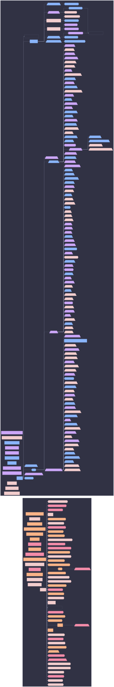

# Full DAG: patch



```mermaid
%%{init: {"elk":{"mergeEdges":true,"nodePlacementStrategy":"BRANDES_KOEPF"},"flowchart":{"wrappingWidth":600},"layout":"elk","theme":"base","themeVariables":{"activationBkgColor":"#313244","activationBorderColor":"#6c7086","actorBkg":"#313244","actorBorder":"#a6adc8","actorLineColor":"#a6adc8","actorTextColor":"#cdd6f4","background":"#1e1e2e","classText":"#cdd6f4","clusterBkg":"#313244","clusterBorder":"#6c7086","edgeLabelBackground":"#1e1e2e","labelBoxBkgColor":"#313244","labelBoxBorderColor":"#a6adc8","labelTextColor":"#cdd6f4","lineColor":"#a6adc8","loopTextColor":"#cdd6f4","mainBkg":"#313244","nodeBkg":"#313244","nodeBorder":"#a6adc8","nodeTextColor":"#cdd6f4","noteBkgColor":"#313244","noteBorderColor":"#6c7086","noteTextColor":"#cdd6f4","pie1":"#f38ba8","pie2":"#fab387","pie3":"#f9e2af","pie4":"#a6e3a1","pie5":"#94e2d5","pie6":"#89b4fa","pie7":"#cba6f7","pie8":"#f2cdcd","pieLegendTextColor":"#cdd6f4","pieOuterStrokeColor":"#6c7086","pieSectionTextColor":"#cdd6f4","pieStrokeColor":"#6c7086","pieTitleTextColor":"#cdd6f4","primaryBorderColor":"#a6adc8","primaryColor":"#313244","primaryTextColor":"#cdd6f4","secondBkg":"#313244","secondaryBorderColor":"#6c7086","secondaryColor":"#313244","secondaryTextColor":"#cdd6f4","sequenceNumberColor":"#1e1e2e","signalColor":"#a6adc8","signalTextColor":"#cdd6f4","tertiaryBorderColor":"#6c7086","tertiaryColor":"#313244","tertiaryTextColor":"#cdd6f4","textColor":"#cdd6f4","titleColor":"#cdd6f4"}}}%%
graph LR
  patch([patch]):::root

  subgraph ctx_user_sini["user: sini"]
  _policy_droidHm_user_detect__0_["<policy:droidHm-user-detect>[0]"]:::_policy_droidHm_user_detect__0__c
  _policy_hm_user_detect__0_["<policy:hm-user-detect>[0]"]:::_policy_hm_user_detect__0__c
  _policy_user_aspect_auto_include__3_["<policy:user-aspect-auto-include>[3]"]:::_policy_user_aspect_auto_include__3__c
  agenix_identity__sini_axon_01{{"agenix-identity/sini@axon-01"}}:::agenix_identity__sini_axon_01_c
  agenix_identity__sini_axon_02{{"agenix-identity/sini@axon-02"}}:::agenix_identity__sini_axon_02_c
  agenix_identity__sini_axon_03{{"agenix-identity/sini@axon-03"}}:::agenix_identity__sini_axon_03_c
  agenix_identity__sini_bitstream{{"agenix-identity/sini@bitstream"}}:::agenix_identity__sini_bitstream_c
  agenix_identity__sini_blade{{"agenix-identity/sini@blade"}}:::agenix_identity__sini_blade_c
  agenix_identity__sini_cortex{{"agenix-identity/sini@cortex"}}:::agenix_identity__sini_cortex_c
  agenix_identity__sini_patch{{"agenix-identity/sini@patch"}}:::agenix_identity__sini_patch_c
  agenix_identity__sini_slab{{"agenix-identity/sini@slab"}}:::agenix_identity__sini_slab_c
  agenix_identity__sini_uplink{{"agenix-identity/sini@uplink"}}:::agenix_identity__sini_uplink_c
  broadcast_syncthing_hub_shares["broadcast-syncthing-hub-shares"]:::broadcast_syncthing_hub_shares_c
  broadcast_syncthing_peers["broadcast-syncthing-peers"]:::broadcast_syncthing_peers_c
  broadcast_syncthing_peers_to_hub["broadcast-syncthing-peers-to-hub"]:::broadcast_syncthing_peers_to_hub_c
  default_user_sini["default"]:::default_user_sini_c
  droidHm_user_detect["droidHm-user-detect"]:::droidHm_user_detect_c
  drop_user_to_host_on_droid["drop-user-to-host-on-droid"]:::drop_user_to_host_on_droid_c
  expose_resolved_users["expose-resolved-users"]:::expose_resolved_users_c
  hm_user_detect["hm-user-detect"]:::hm_user_detect_c
  homeAarch64_to_hm["homeAarch64-to-hm"]:::homeAarch64_to_hm_c
  homeDarwin_to_hm["homeDarwin-to-hm"]:::homeDarwin_to_hm_c
  homeLinux_to_hm["homeLinux-to-hm"]:::homeLinux_to_hm_c
  den__batteries__host_aspects[/"batteries/host-aspects"\]:::den__batteries__host_aspects_c
  host_aspects_project["host-aspects-project"]:::host_aspects_project_c
  opkssh_authz__sini_axon_01{{"opkssh-authz/sini@axon-01"}}:::opkssh_authz__sini_axon_01_c
  opkssh_authz__sini_axon_02{{"opkssh-authz/sini@axon-02"}}:::opkssh_authz__sini_axon_02_c
  opkssh_authz__sini_axon_03{{"opkssh-authz/sini@axon-03"}}:::opkssh_authz__sini_axon_03_c
  opkssh_authz__sini_bitstream{{"opkssh-authz/sini@bitstream"}}:::opkssh_authz__sini_bitstream_c
  opkssh_authz__sini_blade{{"opkssh-authz/sini@blade"}}:::opkssh_authz__sini_blade_c
  opkssh_authz__sini_cortex{{"opkssh-authz/sini@cortex"}}:::opkssh_authz__sini_cortex_c
  opkssh_authz__sini_patch{{"opkssh-authz/sini@patch"}}:::opkssh_authz__sini_patch_c
  opkssh_authz__sini_slab{{"opkssh-authz/sini@slab"}}:::opkssh_authz__sini_slab_c
  opkssh_authz__sini_uplink{{"opkssh-authz/sini@uplink"}}:::opkssh_authz__sini_uplink_c
  os_to_host_user_sini["os-to-host"]:::os_to_host_user_sini_c
  core__network__syncthing__peer[/"syncthing/peer"\]:::core__network__syncthing__peer_c
  den__batteries__primary_user_sini_axon_01_{{"batteries/primary-user(sini@axon-01)"}}:::den__batteries__primary_user_sini_axon_01__c
  den__batteries__primary_user_sini_axon_02_{{"batteries/primary-user(sini@axon-02)"}}:::den__batteries__primary_user_sini_axon_02__c
  den__batteries__primary_user_sini_axon_03_{{"batteries/primary-user(sini@axon-03)"}}:::den__batteries__primary_user_sini_axon_03__c
  den__batteries__primary_user_sini_bitstream_{{"batteries/primary-user(sini@bitstream)"}}:::den__batteries__primary_user_sini_bitstream__c
  den__batteries__primary_user_sini_blade_{{"batteries/primary-user(sini@blade)"}}:::den__batteries__primary_user_sini_blade__c
  den__batteries__primary_user_sini_cortex_{{"batteries/primary-user(sini@cortex)"}}:::den__batteries__primary_user_sini_cortex__c
  den__batteries__primary_user_sini_patch_{{"batteries/primary-user(sini@patch)"}}:::den__batteries__primary_user_sini_patch__c
  den__batteries__primary_user_sini_slab_{{"batteries/primary-user(sini@slab)"}}:::den__batteries__primary_user_sini_slab__c
  den__batteries__primary_user_sini_uplink_{{"batteries/primary-user(sini@uplink)"}}:::den__batteries__primary_user_sini_uplink__c
  primary_user_for_owner["primary-user-for-owner"]:::primary_user_for_owner_c
  core__users__resolved_user_emitter[/"users/resolved-user-emitter"\]:::core__users__resolved_user_emitter_c
  sini{{"sini"}}:::sini_c
  applications__media__spotify_player[/"media/spotify-player"\]:::applications__media__spotify_player_c
  user["user"]:::user_c
  user_aspect_auto_include["user-aspect-auto-include"]:::user_aspect_auto_include_c
  user_enrich__sini_axon_01{{"user-enrich/sini@axon-01"}}:::user_enrich__sini_axon_01_c
  user_enrich__sini_axon_02{{"user-enrich/sini@axon-02"}}:::user_enrich__sini_axon_02_c
  user_enrich__sini_axon_03{{"user-enrich/sini@axon-03"}}:::user_enrich__sini_axon_03_c
  user_enrich__sini_bitstream{{"user-enrich/sini@bitstream"}}:::user_enrich__sini_bitstream_c
  user_enrich__sini_blade{{"user-enrich/sini@blade"}}:::user_enrich__sini_blade_c
  user_enrich__sini_cortex{{"user-enrich/sini@cortex"}}:::user_enrich__sini_cortex_c
  user_enrich__sini_patch{{"user-enrich/sini@patch"}}:::user_enrich__sini_patch_c
  user_enrich__sini_slab{{"user-enrich/sini@slab"}}:::user_enrich__sini_slab_c
  user_enrich__sini_uplink{{"user-enrich/sini@uplink"}}:::user_enrich__sini_uplink_c
  user_to_host["user-to-host"]:::user_to_host_c
  user__resolve_user_["user/resolve(user)"]:::user__resolve_user__c
  _policy_user_aspect_auto_include__3_ --> applications__media__spotify_player
  sini --> den__batteries__host_aspects
  user --> _policy_droidHm_user_detect__0_
  user --> _policy_hm_user_detect__0_
  user --> _policy_user_aspect_auto_include__3_
  user --> agenix_identity__sini_axon_01
  user --> agenix_identity__sini_axon_02
  user --> agenix_identity__sini_axon_03
  user --> agenix_identity__sini_bitstream
  user --> agenix_identity__sini_blade
  user --> agenix_identity__sini_cortex
  user --> agenix_identity__sini_patch
  user --> agenix_identity__sini_slab
  user --> agenix_identity__sini_uplink
  user --> default_user_sini
  user --> opkssh_authz__sini_axon_01
  user --> opkssh_authz__sini_axon_02
  user --> opkssh_authz__sini_axon_03
  user --> opkssh_authz__sini_bitstream
  user --> opkssh_authz__sini_blade
  user --> opkssh_authz__sini_cortex
  user --> opkssh_authz__sini_patch
  user --> opkssh_authz__sini_slab
  user --> opkssh_authz__sini_uplink
  user --> core__network__syncthing__peer
  user --> den__batteries__primary_user_sini_axon_01_
  user --> den__batteries__primary_user_sini_axon_02_
  user --> den__batteries__primary_user_sini_axon_03_
  user --> den__batteries__primary_user_sini_bitstream_
  user --> den__batteries__primary_user_sini_blade_
  user --> den__batteries__primary_user_sini_cortex_
  user --> den__batteries__primary_user_sini_patch_
  user --> den__batteries__primary_user_sini_slab_
  user --> den__batteries__primary_user_sini_uplink_
  user --> core__users__resolved_user_emitter
  user --> sini
  user --> user_enrich__sini_axon_01
  user --> user_enrich__sini_axon_02
  user --> user_enrich__sini_axon_03
  user --> user_enrich__sini_bitstream
  user --> user_enrich__sini_blade
  user --> user_enrich__sini_cortex
  user --> user_enrich__sini_patch
  user --> user_enrich__sini_slab
  user --> user_enrich__sini_uplink
  user --> user__resolve_user_
  end
  subgraph ctx_host_patch["host: patch"]
  hardware__adb[/"hardware/adb"\]:::hardware__adb_c
  macos__wm__aerospace[/"wm/aerospace"\]:::macos__wm__aerospace_c
  secrets__agenix[/"secrets/agenix"\]:::secrets__agenix_c
  agenix__patch{{"agenix/patch"}}:::agenix__patch_c
  applications__terminals__alacritty[/"terminals/alacritty"\]:::applications__terminals__alacritty_c
  macos__defaults__appearance[/"defaults/appearance"\]:::macos__defaults__appearance_c
  applications__shell__archive[/"shell/archive"\]:::applications__shell__archive_c
  applications__dev__shell__bat[/"shell/bat"\]:::applications__dev__shell__bat_c
  applications__dev__ai__beads[/"ai/beads"\]:::applications__dev__ai__beads_c
  applications__dev__security__bitwarden{{"security/bitwarden"}}:::applications__dev__security__bitwarden_c
  core__systemd__boot[/"systemd/boot"\]:::core__systemd__boot_c
  applications__dev__shell__bottom[/"shell/bottom"\]:::applications__dev__shell__bottom_c
  applications__dev__shell__btop[/"shell/btop"\]:::applications__dev__shell__btop_c
  core__impermanence__btrfs[/"impermanence/btrfs"\]:::core__impermanence__btrfs_c
  applications__dev__lang__c[/"lang/c"\]:::applications__dev__lang__c_c
  applications__browsers__chromium[/"browsers/chromium"\]:::applications__browsers__chromium_c
  applications__dev__ai__claude[/"ai/claude"\]:::applications__dev__ai__claude_c
  applications__dev__ai__mcp__codebase_memory[/"mcp/codebase-memory"\]:::applications__dev__ai__mcp__codebase_memory_c
  collect_bgp_peers["collect-bgp-peers"]:::collect_bgp_peers_c
  collect_container_registries["collect-container-registries"]:::collect_container_registries_c
  collect_host_addrs["collect-host-addrs"]:::collect_host_addrs_c
  collect_k3s_nodes["collect-k3s-nodes"]:::collect_k3s_nodes_c
  collect_ollama_endpoints["collect-ollama-endpoints"]:::collect_ollama_endpoints_c
  collect_prometheus_targets["collect-prometheus-targets"]:::collect_prometheus_targets_c
  collect_thunderbolt_mesh_peers["collect-thunderbolt-mesh-peers"]:::collect_thunderbolt_mesh_peers_c
  collect_vault_peers["collect-vault-peers"]:::collect_vault_peers_c
  core__secrets__collector[/"secrets/collector"\]:::core__secrets__collector_c
  applications__dev__editor__codium__core[/"codium/core"\]:::applications__dev__editor__codium__core_c
  roles__darwin_workstation[/"roles/darwin-workstation"\]:::roles__darwin_workstation_c
  applications__shell__data[/"shell/data"\]:::applications__shell__data_c
  roles__default[/"roles/default"\]:::roles__default_c
  default_host_patch["default"]:::default_host_patch_c
  den__batteries__define_user[/"batteries/define-user"\]:::den__batteries__define_user_c
  den__batteries__define_user__sini_patch{{"batteries/define-user/sini@patch"}}:::den__batteries__define_user__sini_patch_c
  applications__dev__git__delta[/"git/delta"\]:::applications__dev__git__delta_c
  core__users__deterministic_uids[/"users/deterministic-uids"\]:::core__users__deterministic_uids_c
  roles__dev[/"roles/dev"\]:::roles__dev_c
  applications__dev__shell__direnv[/"shell/direnv"\]:::applications__dev__shell__direnv_c
  core__perf__disable_docs[/"perf/disable-docs"\]:::core__perf__disable_docs_c
  applications__shell__disk[/"shell/disk"\]:::applications__shell__disk_c
  macos__defaults__dock[/"defaults/dock"\]:::macos__defaults__dock_c
  env_users["env-users"]:::env_users_c
  applications__dev__shell__eza[/"shell/eza"\]:::applications__dev__shell__eza_c
  core__system__facter[/"system/facter"\]:::core__system__facter_c
  macos__defaults__finder[/"defaults/finder"\]:::macos__defaults__finder_c
  applications__browsers__firefox[/"browsers/firefox"\]:::applications__browsers__firefox_c
  core__network__firewall_collector[/"network/firewall-collector"\]:::core__network__firewall_collector_c
  core__system__firmware[/"system/firmware"\]:::core__system__firmware_c
  macos__fonts[/"macos/fonts"\]:::macos__fonts_c
  applications__dev__git{{"dev/git"}}:::applications__dev__git_c
  applications__dev__git__github[/"git/github"\]:::applications__dev__git__github_c
  applications__dev__git__gitkraken{{"git/gitkraken"}}:::applications__dev__git__gitkraken_c
  applications__dev__lang__go[/"lang/go"\]:::applications__dev__lang__go_c
  applications__dev__mux__herdr[/"mux/herdr"\]:::applications__dev__mux__herdr_c
  core__users__home_manager_shared[/"users/home-manager-shared"\]:::core__users__home_manager_shared_c
  macos__homebrew[/"macos/homebrew"\]:::macos__homebrew_c
  host["host"]:::host_c
  host_modules_capture["host-modules-capture"]:::host_modules_capture_c
  host_to_hm_users["host-to-hm-users"]:::host_to_hm_users_c
  host__resolve_darwin_workstation_["host/resolve(darwin-workstation)"]:::host__resolve_darwin_workstation__c
  host__resolve_host_["host/resolve(host)"]:::host__resolve_host__c
  host__resolve_user_["host/resolve(user)"]:::host__resolve_user__c
  den__batteries__hostname[/"batteries/hostname"\]:::den__batteries__hostname_c
  den__batteries__hostname__os{{"batteries/hostname/os"}}:::den__batteries__hostname__os_c
  core__network__hostsfile[/"network/hostsfile"\]:::core__network__hostsfile_c
  applications__dev__ai__hunk[/"ai/hunk"\]:::applications__dev__ai__hunk_c
  core__localization__i18n[/"localization/i18n"\]:::core__localization__i18n_c
  core__impermanence[/"core/impermanence"\]:::core__impermanence_c
  den__batteries__inputs_[/"batteries/inputs'"\]:::den__batteries__inputs__c
  den__batteries__inputs___os{{"batteries/inputs'/os"}}:::den__batteries__inputs___os_c
  den__batteries__inputs___user{{"batteries/inputs'/user"}}:::den__batteries__inputs___user_c
  insecure_predicate["insecure-predicate"]:::insecure_predicate_c
  insecure_predicate__os{{"insecure-predicate/os"}}:::insecure_predicate__os_c
  insecure_predicate__user{{"insecure-predicate/user"}}:::insecure_predicate__user_c
  macos__wm__jankyborders[/"wm/jankyborders"\]:::macos__wm__jankyborders_c
  applications__dev__git__jujutsu{{"git/jujutsu"}}:::applications__dev__git__jujutsu_c
  applications__dev__k8s__k9s[/"k8s/k9s"\]:::applications__dev__k8s__k9s_c
  macos__applications__karabiner[/"applications/karabiner"\]:::macos__applications__karabiner_c
  macos__defaults__keybindings[/"defaults/keybindings"\]:::macos__defaults__keybindings_c
  macos__defaults__keyboard[/"defaults/keyboard"\]:::macos__defaults__keyboard_c
  applications__terminals__kitty[/"terminals/kitty"\]:::applications__terminals__kitty_c
  applications__dev__git__lazygit[/"git/lazygit"\]:::applications__dev__git__lazygit_c
  core__nix__linux_builder[/"nix/linux-builder"\]:::core__nix__linux_builder_c
  core__system__linux_kernel[/"system/linux-kernel"\]:::core__system__linux_kernel_c
  applications__dev__ai__llm_agents[/"ai/llm-agents"\]:::applications__dev__ai__llm_agents_c
  applications__dev__lang__lua[/"lang/lua"\]:::applications__dev__lang__lua_c
  applications__dev__lang__markdown[/"lang/markdown"\]:::applications__dev__lang__markdown_c
  core__network__syncthing__member{{"syncthing/member"}}:::core__network__syncthing__member_c
  applications__dev__git__mergiraf[/"git/mergiraf"\]:::applications__dev__git__mergiraf_c
  core__network__networking[/"network/networking"\]:::core__network__networking_c
  core__nix[/"core/nix"\]:::core__nix_c
  applications__dev__lang__nix[/"lang/nix"\]:::applications__dev__lang__nix_c
  applications__shell__nix_index[/"shell/nix-index"\]:::applications__shell__nix_index_c
  core__nix__nixpkgs[/"nix/nixpkgs"\]:::core__nix__nixpkgs_c
  applications__dev__editor__nvf[/"editor/nvf"\]:::applications__dev__editor__nvf_c
  applications__productivity__obs_studio[/"productivity/obs-studio"\]:::applications__productivity__obs_studio_c
  applications__productivity__obsidian[/"productivity/obsidian"\]:::applications__productivity__obsidian_c
  core__security__openssh[/"security/openssh"\]:::core__security__openssh_c
  core__security__opkssh[/"security/opkssh"\]:::core__security__opkssh_c
  applications__dev__security__opkssh_client[/"security/opkssh-client"\]:::applications__dev__security__opkssh_client_c
  os_to_host_host_patch["os-to-host"]:::os_to_host_host_patch_c
  core__impermanence__persist_collector[/"impermanence/persist-collector"\]:::core__impermanence__persist_collector_c
  core__impermanence__persist_home_collector[/"impermanence/persist-home-collector"\]:::core__impermanence__persist_home_collector_c
  applications__shell__process[/"shell/process"\]:::applications__shell__process_c
  applications__mail__protonmail[/"mail/protonmail"\]:::applications__mail__protonmail_c
  applications__dev__lang__python[/"lang/python"\]:::applications__dev__lang__python_c
  macos__applications__raycast[/"applications/raycast"\]:::macos__applications__raycast_c
  applications__dev__ai__rtk[/"ai/rtk"\]:::applications__dev__ai__rtk_c
  applications__dev__lang__rust[/"lang/rust"\]:::applications__dev__lang__rust_c
  macos__defaults__screencapture[/"defaults/screencapture"\]:::macos__defaults__screencapture_c
  applications__shell__search[/"shell/search"\]:::applications__shell__search_c
  core__security[/"core/security"\]:::core__security_c
  macos__defaults__security[/"defaults/security"\]:::macos__defaults__security_c
  den__batteries__self_[/"batteries/self'"\]:::den__batteries__self__c
  den__batteries__self___os{{"batteries/self'/os"}}:::den__batteries__self___os_c
  den__batteries__self___user{{"batteries/self'/user"}}:::den__batteries__self___user_c
  applications__dev__mux__sesh[/"mux/sesh"\]:::applications__dev__mux__sesh_c
  core__users__shell[/"users/shell"\]:::core__users__shell_c
  applications__dev__lang__shell[/"lang/shell"\]:::applications__dev__lang__shell_c
  applications__dev__security__signing_key{{"security/signing-key"}}:::applications__dev__security__signing_key_c
  macos__wm__sketchybar[/"wm/sketchybar"\]:::macos__wm__sketchybar_c
  macos__spotlight_apps[/"macos/spotlight-apps"\]:::macos__spotlight_apps_c
  core__perf__ssd[/"perf/ssd"\]:::core__perf__ssd_c
  applications__dev__security__ssh{{"security/ssh"}}:::applications__dev__security__ssh_c
  applications__dev__security__ssh_agent_mux[/"security/ssh-agent-mux"\]:::applications__dev__security__ssh_agent_mux_c
  applications__dev__shell__starship[/"shell/starship"\]:::applications__dev__shell__starship_c
  core__nix__stateVersion[/"nix/stateVersion"\]:::core__nix__stateVersion_c
  desktop__style__stylix[/"style/stylix"\]:::desktop__style__stylix_c
  core__security__sudo[/"security/sudo"\]:::core__security__sudo_c
  core__systemd[/"core/systemd"\]:::core__systemd_c
  core__network__tailscale[/"network/tailscale"\]:::core__network__tailscale_c
  core__localization__time[/"localization/time"\]:::core__localization__time_c
  applications__dev__mux__tmux[/"mux/tmux"\]:::applications__dev__mux__tmux_c
  macos__defaults__trackpad[/"defaults/trackpad"\]:::macos__defaults__trackpad_c
  unfree_predicate["unfree-predicate"]:::unfree_predicate_c
  unfree_predicate__os{{"unfree-predicate/os"}}:::unfree_predicate__os_c
  unfree_predicate__user{{"unfree-predicate/user"}}:::unfree_predicate__user_c
  core__users[/"core/users"\]:::core__users_c
  core__utils[/"core/utils"\]:::core__utils_c
  applications__dev__editor__codium__vscode[/"codium/vscode"\]:::applications__dev__editor__codium__vscode_c
  applications__shell__yazi[/"shell/yazi"\]:::applications__shell__yazi_c
  applications__dev__mux__zellij[/"mux/zellij"\]:::applications__dev__mux__zellij_c
  core__impermanence__zfs[/"impermanence/zfs"\]:::core__impermanence__zfs_c
  applications__shell__zoxide[/"shell/zoxide"\]:::applications__shell__zoxide_c
  core__perf__zram_swap[/"perf/zram-swap"\]:::core__perf__zram_swap_c
  applications__shell__zsh[/"shell/zsh"\]:::applications__shell__zsh_c
  core__impermanence --> core__impermanence__btrfs
  core__impermanence --> core__impermanence__persist_collector
  core__impermanence --> core__impermanence__persist_home_collector
  core__impermanence --> core__impermanence__zfs
  default_host_patch --> den__batteries__define_user
  default_host_patch --> den__batteries__hostname
  default_host_patch --> den__batteries__inputs_
  default_host_patch --> insecure_predicate
  default_host_patch --> den__batteries__self_
  default_host_patch --> unfree_predicate
  den__batteries__define_user --> den__batteries__define_user__sini_patch
  den__batteries__hostname --> den__batteries__hostname__os
  den__batteries__inputs_ --> den__batteries__inputs___os
  den__batteries__inputs_ --> den__batteries__inputs___user
  den__batteries__inputs___user --> host__resolve_user_
  den__batteries__self_ --> den__batteries__self___os
  den__batteries__self_ --> den__batteries__self___user
  den__batteries__self___user --> host__resolve_user_
  host --> agenix__patch
  host --> core__secrets__collector
  host --> default_host_patch
  host --> core__network__firewall_collector
  host --> host__resolve_host_
  host --> patch
  insecure_predicate --> insecure_predicate__os
  insecure_predicate --> insecure_predicate__user
  patch --> roles__darwin_workstation
  patch --> roles__default
  patch --> roles__dev
  patch --> core__nix__linux_builder
  roles__darwin_workstation --> macos__wm__aerospace
  roles__darwin_workstation --> applications__terminals__alacritty
  roles__darwin_workstation --> macos__defaults__appearance
  roles__darwin_workstation --> applications__dev__lang__c
  roles__darwin_workstation --> applications__browsers__chromium
  roles__darwin_workstation --> applications__dev__editor__codium__core
  roles__darwin_workstation --> macos__defaults__dock
  roles__darwin_workstation --> macos__defaults__finder
  roles__darwin_workstation --> applications__browsers__firefox
  roles__darwin_workstation --> macos__fonts
  roles__darwin_workstation --> applications__dev__git__gitkraken
  roles__darwin_workstation --> macos__homebrew
  roles__darwin_workstation --> host__resolve_darwin_workstation_
  roles__darwin_workstation --> macos__wm__jankyborders
  roles__darwin_workstation --> macos__applications__karabiner
  roles__darwin_workstation --> macos__defaults__keybindings
  roles__darwin_workstation --> macos__defaults__keyboard
  roles__darwin_workstation --> applications__terminals__kitty
  roles__darwin_workstation --> applications__dev__lang__lua
  roles__darwin_workstation --> applications__dev__lang__markdown
  roles__darwin_workstation --> applications__productivity__obs_studio
  roles__darwin_workstation --> applications__productivity__obsidian
  roles__darwin_workstation --> applications__dev__security__opkssh_client
  roles__darwin_workstation --> applications__mail__protonmail
  roles__darwin_workstation --> macos__applications__raycast
  roles__darwin_workstation --> macos__defaults__screencapture
  roles__darwin_workstation --> macos__defaults__security
  roles__darwin_workstation --> applications__dev__lang__shell
  roles__darwin_workstation --> macos__wm__sketchybar
  roles__darwin_workstation --> macos__spotlight_apps
  roles__darwin_workstation --> desktop__style__stylix
  roles__darwin_workstation --> macos__defaults__trackpad
  roles__darwin_workstation --> applications__dev__editor__codium__vscode
  roles__default --> secrets__agenix
  roles__default --> core__systemd__boot
  roles__default --> core__users__deterministic_uids
  roles__default --> core__perf__disable_docs
  roles__default --> core__system__facter
  roles__default --> core__system__firmware
  roles__default --> core__users__home_manager_shared
  roles__default --> core__network__hostsfile
  roles__default --> core__localization__i18n
  roles__default --> core__impermanence
  roles__default --> core__system__linux_kernel
  roles__default --> core__network__syncthing__member
  roles__default --> core__network__networking
  roles__default --> core__nix
  roles__default --> core__nix__nixpkgs
  roles__default --> core__security__openssh
  roles__default --> core__security__opkssh
  roles__default --> core__security
  roles__default --> core__users__shell
  roles__default --> core__perf__ssd
  roles__default --> core__nix__stateVersion
  roles__default --> core__security__sudo
  roles__default --> core__systemd
  roles__default --> core__network__tailscale
  roles__default --> core__localization__time
  roles__default --> core__users
  roles__default --> core__utils
  roles__default --> core__perf__zram_swap
  roles__default --> applications__shell__zsh
  roles__dev --> hardware__adb
  roles__dev --> applications__shell__archive
  roles__dev --> applications__dev__shell__bat
  roles__dev --> applications__dev__ai__beads
  roles__dev --> applications__dev__security__bitwarden
  roles__dev --> applications__dev__shell__bottom
  roles__dev --> applications__dev__shell__btop
  roles__dev --> applications__dev__ai__claude
  roles__dev --> applications__dev__ai__mcp__codebase_memory
  roles__dev --> applications__shell__data
  roles__dev --> applications__dev__git__delta
  roles__dev --> applications__dev__shell__direnv
  roles__dev --> applications__shell__disk
  roles__dev --> applications__dev__shell__eza
  roles__dev --> applications__dev__git
  roles__dev --> applications__dev__git__github
  roles__dev --> applications__dev__lang__go
  roles__dev --> applications__dev__mux__herdr
  roles__dev --> applications__dev__ai__hunk
  roles__dev --> applications__dev__git__jujutsu
  roles__dev --> applications__dev__k8s__k9s
  roles__dev --> applications__dev__git__lazygit
  roles__dev --> applications__dev__ai__llm_agents
  roles__dev --> applications__dev__git__mergiraf
  roles__dev --> applications__dev__lang__nix
  roles__dev --> applications__shell__nix_index
  roles__dev --> applications__dev__editor__nvf
  roles__dev --> applications__shell__process
  roles__dev --> applications__dev__lang__python
  roles__dev --> applications__dev__ai__rtk
  roles__dev --> applications__dev__lang__rust
  roles__dev --> applications__shell__search
  roles__dev --> applications__dev__mux__sesh
  roles__dev --> applications__dev__security__signing_key
  roles__dev --> applications__dev__security__ssh
  roles__dev --> applications__dev__security__ssh_agent_mux
  roles__dev --> applications__dev__shell__starship
  roles__dev --> applications__dev__mux__tmux
  roles__dev --> applications__shell__yazi
  roles__dev --> applications__dev__mux__zellij
  roles__dev --> applications__shell__zoxide
  unfree_predicate --> unfree_predicate__os
  unfree_predicate --> unfree_predicate__user
  end


  classDef root fill:#89b4fa,stroke:#89b4fa,color:#1e1e2e,font-weight:bold
  classDef _policy_droidHm_user_detect__0__c fill:#fab387,stroke:#fab387,color:#1e1e2e,stroke-dasharray: 3 3,stroke-width:1px
  classDef _policy_hm_user_detect__0__c fill:#f2cdcd,stroke:#f2cdcd,color:#1e1e2e,stroke-dasharray: 3 3,stroke-width:1px
  classDef _policy_user_aspect_auto_include__3__c fill:#fab387,stroke:#fab387,color:#1e1e2e,stroke-dasharray: 3 3,stroke-width:1px
  classDef hardware__adb_c fill:#cba6f7,stroke:#cba6f7,color:#1e1e2e,stroke-width:3px
  classDef macos__wm__aerospace_c fill:#cba6f7,stroke:#cba6f7,color:#1e1e2e,stroke-width:3px
  classDef secrets__agenix_c fill:#89b4fa,stroke:#89b4fa,color:#1e1e2e,stroke-width:3px
  classDef agenix_identity__sini_axon_01_c fill:#fab387,stroke:#fab387,color:#1e1e2e,stroke-width:2px
  classDef agenix_identity__sini_axon_02_c fill:#fab387,stroke:#fab387,color:#1e1e2e,stroke-width:2px
  classDef agenix_identity__sini_axon_03_c fill:#f38ba8,stroke:#f38ba8,color:#1e1e2e,stroke-width:2px
  classDef agenix_identity__sini_bitstream_c fill:#f2cdcd,stroke:#f2cdcd,color:#1e1e2e,stroke-width:2px
  classDef agenix_identity__sini_blade_c fill:#f2cdcd,stroke:#f2cdcd,color:#1e1e2e,stroke-width:2px
  classDef agenix_identity__sini_cortex_c fill:#fab387,stroke:#fab387,color:#1e1e2e,stroke-width:2px
  classDef agenix_identity__sini_patch_c fill:#fab387,stroke:#fab387,color:#1e1e2e,stroke-dasharray: 3 3,stroke-width:1px
  classDef agenix_identity__sini_slab_c fill:#f38ba8,stroke:#f38ba8,color:#1e1e2e,stroke-dasharray: 3 3,stroke-width:1px
  classDef agenix_identity__sini_uplink_c fill:#f38ba8,stroke:#f38ba8,color:#1e1e2e,stroke-width:2px
  classDef agenix__patch_c fill:#89b4fa,stroke:#89b4fa,color:#1e1e2e,stroke-dasharray: 3 3,stroke-width:1px
  classDef applications__terminals__alacritty_c fill:#f2cdcd,stroke:#f2cdcd,color:#1e1e2e,stroke-width:3px
  classDef macos__defaults__appearance_c fill:#f2cdcd,stroke:#f2cdcd,color:#1e1e2e,stroke-width:3px
  classDef applications_c fill:#fab387,stroke:#fab387,color:#1e1e2e,stroke-dasharray: 3 3,stroke-width:1px
  classDef applications__shell__archive_c fill:#89b4fa,stroke:#89b4fa,color:#1e1e2e,stroke-width:3px
  classDef applications__dev__shell__bat_c fill:#89b4fa,stroke:#89b4fa,color:#1e1e2e,stroke-width:3px
  classDef applications__dev__ai__beads_c fill:#89b4fa,stroke:#89b4fa,color:#1e1e2e,stroke-width:3px
  classDef applications__dev__security__bitwarden_c fill:#89b4fa,stroke:#89b4fa,color:#1e1e2e,stroke-width:3px
  classDef core__systemd__boot_c fill:#f2cdcd,stroke:#f2cdcd,color:#1e1e2e,stroke-width:3px
  classDef applications__dev__shell__bottom_c fill:#cba6f7,stroke:#cba6f7,color:#1e1e2e,stroke-width:3px
  classDef broadcast_syncthing_hub_shares_c fill:#fab387,stroke:#fab387,color:#1e1e2e,stroke-width:2px,stroke-dasharray: 8 4
  classDef broadcast_syncthing_peers_c fill:#f38ba8,stroke:#f38ba8,color:#1e1e2e,stroke-width:2px,stroke-dasharray: 8 4
  classDef broadcast_syncthing_peers_to_hub_c fill:#fab387,stroke:#fab387,color:#1e1e2e,stroke-width:2px,stroke-dasharray: 8 4
  classDef applications__dev__shell__btop_c fill:#89b4fa,stroke:#89b4fa,color:#1e1e2e,stroke-width:3px
  classDef core__impermanence__btrfs_c fill:#f2cdcd,stroke:#f2cdcd,color:#1e1e2e,stroke-width:3px
  classDef applications__dev__lang__c_c fill:#cba6f7,stroke:#cba6f7,color:#1e1e2e,stroke-width:3px
  classDef applications__browsers__chromium_c fill:#f2cdcd,stroke:#f2cdcd,color:#1e1e2e,stroke-width:3px
  classDef applications__dev__ai__claude_c fill:#89b4fa,stroke:#89b4fa,color:#1e1e2e,stroke-width:3px
  classDef applications__dev__ai__mcp__codebase_memory_c fill:#89b4fa,stroke:#89b4fa,color:#1e1e2e,stroke-width:3px
  classDef collect_bgp_peers_c fill:#cba6f7,stroke:#cba6f7,color:#1e1e2e,stroke-width:2px,stroke-dasharray: 8 4
  classDef collect_container_registries_c fill:#f2cdcd,stroke:#f2cdcd,color:#1e1e2e,stroke-width:2px,stroke-dasharray: 8 4
  classDef collect_host_addrs_c fill:#89b4fa,stroke:#89b4fa,color:#1e1e2e,stroke-width:2px,stroke-dasharray: 8 4
  classDef collect_k3s_nodes_c fill:#cba6f7,stroke:#cba6f7,color:#1e1e2e,stroke-width:2px,stroke-dasharray: 8 4
  classDef collect_ollama_endpoints_c fill:#cba6f7,stroke:#cba6f7,color:#1e1e2e,stroke-width:2px,stroke-dasharray: 8 4
  classDef collect_prometheus_targets_c fill:#cba6f7,stroke:#cba6f7,color:#1e1e2e,stroke-width:2px,stroke-dasharray: 8 4
  classDef collect_thunderbolt_mesh_peers_c fill:#cba6f7,stroke:#cba6f7,color:#1e1e2e,stroke-width:2px,stroke-dasharray: 8 4
  classDef collect_vault_peers_c fill:#89b4fa,stroke:#89b4fa,color:#1e1e2e,stroke-width:2px,stroke-dasharray: 8 4
  classDef core__secrets__collector_c fill:#89b4fa,stroke:#89b4fa,color:#1e1e2e,stroke-width:2px
  classDef applications__dev__editor__codium__core_c fill:#89b4fa,stroke:#89b4fa,color:#1e1e2e,stroke-width:3px
  classDef core_c fill:#f9e2af,stroke:#f9e2af,color:#1e1e2e,stroke-dasharray: 3 3,stroke-width:1px
  classDef roles__darwin_workstation_c fill:#cba6f7,stroke:#cba6f7,color:#1e1e2e,stroke-width:3px
  classDef applications__shell__data_c fill:#f2cdcd,stroke:#f2cdcd,color:#1e1e2e,stroke-width:3px
  classDef roles__default_c fill:#89b4fa,stroke:#89b4fa,color:#1e1e2e,stroke-width:3px
  classDef default_host_patch_c fill:#89b4fa,stroke:#89b4fa,color:#1e1e2e,stroke-width:3px
  classDef default_user_sini_c fill:#f2cdcd,stroke:#f2cdcd,color:#1e1e2e,stroke-width:3px
  classDef den__batteries__define_user_c fill:#89b4fa,stroke:#89b4fa,color:#1e1e2e,stroke-width:3px
  classDef den__batteries__define_user__sini_patch_c fill:#89b4fa,stroke:#89b4fa,color:#1e1e2e,stroke-width:2px
  classDef applications__dev__git__delta_c fill:#89b4fa,stroke:#89b4fa,color:#1e1e2e,stroke-width:3px
  classDef desktop_c fill:#a6e3a1,stroke:#a6e3a1,color:#1e1e2e,stroke-dasharray: 3 3,stroke-width:1px
  classDef core__users__deterministic_uids_c fill:#f2cdcd,stroke:#f2cdcd,color:#1e1e2e,stroke-width:3px
  classDef roles__dev_c fill:#cba6f7,stroke:#cba6f7,color:#1e1e2e,stroke-width:3px
  classDef applications__dev__shell__direnv_c fill:#cba6f7,stroke:#cba6f7,color:#1e1e2e,stroke-width:3px
  classDef core__perf__disable_docs_c fill:#89b4fa,stroke:#89b4fa,color:#1e1e2e,stroke-width:3px
  classDef applications__shell__disk_c fill:#cba6f7,stroke:#cba6f7,color:#1e1e2e,stroke-width:3px
  classDef macos__defaults__dock_c fill:#89b4fa,stroke:#89b4fa,color:#1e1e2e,stroke-width:3px
  classDef droidHm_user_detect_c fill:#fab387,stroke:#fab387,color:#1e1e2e,stroke-width:2px,stroke-dasharray: 8 4
  classDef drop_user_to_host_on_droid_c fill:#f2cdcd,stroke:#f2cdcd,color:#1e1e2e,stroke-width:2px,stroke-dasharray: 8 4
  classDef env_users_c fill:#89b4fa,stroke:#89b4fa,color:#1e1e2e,stroke-width:2px,stroke-dasharray: 8 4
  classDef expose_resolved_users_c fill:#fab387,stroke:#fab387,color:#1e1e2e,stroke-width:2px,stroke-dasharray: 8 4
  classDef applications__dev__shell__eza_c fill:#f2cdcd,stroke:#f2cdcd,color:#1e1e2e,stroke-width:3px
  classDef core__system__facter_c fill:#f2cdcd,stroke:#f2cdcd,color:#1e1e2e,stroke-width:3px
  classDef macos__defaults__finder_c fill:#f2cdcd,stroke:#f2cdcd,color:#1e1e2e,stroke-width:3px
  classDef applications__browsers__firefox_c fill:#f2cdcd,stroke:#f2cdcd,color:#1e1e2e,stroke-width:3px
  classDef core__network__firewall_collector_c fill:#cba6f7,stroke:#cba6f7,color:#1e1e2e,stroke-width:2px
  classDef core__system__firmware_c fill:#f2cdcd,stroke:#f2cdcd,color:#1e1e2e,stroke-width:3px
  classDef macos__fonts_c fill:#f2cdcd,stroke:#f2cdcd,color:#1e1e2e,stroke-width:3px
  classDef applications__dev__git_c fill:#89b4fa,stroke:#89b4fa,color:#1e1e2e,stroke-width:3px
  classDef applications__dev__git__github_c fill:#f2cdcd,stroke:#f2cdcd,color:#1e1e2e,stroke-width:3px
  classDef applications__dev__git__gitkraken_c fill:#89b4fa,stroke:#89b4fa,color:#1e1e2e,stroke-width:3px
  classDef applications__dev__lang__go_c fill:#cba6f7,stroke:#cba6f7,color:#1e1e2e,stroke-width:3px
  classDef hardware_c fill:#a6e3a1,stroke:#a6e3a1,color:#1e1e2e,stroke-dasharray: 3 3,stroke-width:1px
  classDef applications__dev__mux__herdr_c fill:#cba6f7,stroke:#cba6f7,color:#1e1e2e,stroke-width:3px
  classDef hm_user_detect_c fill:#f38ba8,stroke:#f38ba8,color:#1e1e2e,stroke-width:2px,stroke-dasharray: 8 4
  classDef core__users__home_manager_shared_c fill:#f2cdcd,stroke:#f2cdcd,color:#1e1e2e,stroke-width:3px
  classDef homeAarch64_to_hm_c fill:#f2cdcd,stroke:#f2cdcd,color:#1e1e2e,stroke-width:2px,stroke-dasharray: 8 4
  classDef homeDarwin_to_hm_c fill:#f38ba8,stroke:#f38ba8,color:#1e1e2e,stroke-width:2px,stroke-dasharray: 8 4
  classDef homeLinux_to_hm_c fill:#fab387,stroke:#fab387,color:#1e1e2e,stroke-width:2px,stroke-dasharray: 8 4
  classDef macos__homebrew_c fill:#cba6f7,stroke:#cba6f7,color:#1e1e2e,stroke-width:3px
  classDef host_c fill:#89b4fa,stroke:#89b4fa,color:#1e1e2e,stroke-width:3px
  classDef den__batteries__host_aspects_c fill:#f38ba8,stroke:#f38ba8,color:#1e1e2e,stroke-width:3px
  classDef host_aspects_project_c fill:#f2cdcd,stroke:#f2cdcd,color:#1e1e2e,stroke-width:2px,stroke-dasharray: 8 4
  classDef host_modules_capture_c fill:#f2cdcd,stroke:#f2cdcd,color:#1e1e2e,stroke-width:2px,stroke-dasharray: 8 4
  classDef host_to_hm_users_c fill:#f2cdcd,stroke:#f2cdcd,color:#1e1e2e,stroke-width:2px,stroke-dasharray: 8 4
  classDef host__resolve_darwin_workstation__c fill:#89b4fa,stroke:#89b4fa,color:#1e1e2e,stroke-width:3px
  classDef host__resolve_host__c fill:#313244,stroke:#6c7086,color:#cdd6f4,stroke-dasharray: 2 2,stroke-width:1px
  classDef host__resolve_user__c fill:#313244,stroke:#6c7086,color:#cdd6f4,stroke-dasharray: 2 2,stroke-width:1px
  classDef den__batteries__hostname_c fill:#89b4fa,stroke:#89b4fa,color:#1e1e2e,stroke-width:3px
  classDef den__batteries__hostname__os_c fill:#89b4fa,stroke:#89b4fa,color:#1e1e2e,stroke-dasharray: 3 3,stroke-width:1px
  classDef core__network__hostsfile_c fill:#cba6f7,stroke:#cba6f7,color:#1e1e2e,stroke-width:3px
  classDef applications__dev__ai__hunk_c fill:#89b4fa,stroke:#89b4fa,color:#1e1e2e,stroke-width:3px
  classDef core__localization__i18n_c fill:#89b4fa,stroke:#89b4fa,color:#1e1e2e,stroke-width:3px
  classDef core__impermanence_c fill:#cba6f7,stroke:#cba6f7,color:#1e1e2e,stroke-width:3px
  classDef den__batteries__inputs__c fill:#89b4fa,stroke:#89b4fa,color:#1e1e2e,stroke-width:3px
  classDef den__batteries__inputs___os_c fill:#89b4fa,stroke:#89b4fa,color:#1e1e2e,stroke-dasharray: 3 3,stroke-width:1px
  classDef den__batteries__inputs___user_c fill:#cba6f7,stroke:#cba6f7,color:#1e1e2e,stroke-dasharray: 3 3,stroke-width:1px
  classDef insecure_predicate_c fill:#f2cdcd,stroke:#f2cdcd,color:#1e1e2e,stroke-width:3px
  classDef insecure_predicate__os_c fill:#89b4fa,stroke:#89b4fa,color:#1e1e2e,stroke-dasharray: 3 3,stroke-width:1px
  classDef insecure_predicate__user_c fill:#f2cdcd,stroke:#f2cdcd,color:#1e1e2e,stroke-dasharray: 3 3,stroke-width:1px
  classDef macos__wm__jankyborders_c fill:#cba6f7,stroke:#cba6f7,color:#1e1e2e,stroke-width:3px
  classDef applications__dev__git__jujutsu_c fill:#cba6f7,stroke:#cba6f7,color:#1e1e2e,stroke-width:3px
  classDef applications__dev__k8s__k9s_c fill:#f2cdcd,stroke:#f2cdcd,color:#1e1e2e,stroke-width:3px
  classDef macos__applications__karabiner_c fill:#cba6f7,stroke:#cba6f7,color:#1e1e2e,stroke-width:3px
  classDef macos__defaults__keybindings_c fill:#cba6f7,stroke:#cba6f7,color:#1e1e2e,stroke-width:3px
  classDef macos__defaults__keyboard_c fill:#89b4fa,stroke:#89b4fa,color:#1e1e2e,stroke-width:3px
  classDef applications__terminals__kitty_c fill:#f2cdcd,stroke:#f2cdcd,color:#1e1e2e,stroke-width:3px
  classDef applications__dev__git__lazygit_c fill:#f2cdcd,stroke:#f2cdcd,color:#1e1e2e,stroke-width:3px
  classDef core__nix__linux_builder_c fill:#cba6f7,stroke:#cba6f7,color:#1e1e2e,stroke-width:3px
  classDef core__system__linux_kernel_c fill:#f2cdcd,stroke:#f2cdcd,color:#1e1e2e,stroke-width:3px
  classDef applications__dev__ai__llm_agents_c fill:#f2cdcd,stroke:#f2cdcd,color:#1e1e2e,stroke-width:3px
  classDef applications__dev__lang__lua_c fill:#f2cdcd,stroke:#f2cdcd,color:#1e1e2e,stroke-width:3px
  classDef macos_c fill:#fab387,stroke:#fab387,color:#1e1e2e,stroke-dasharray: 3 3,stroke-width:1px
  classDef applications__dev__lang__markdown_c fill:#cba6f7,stroke:#cba6f7,color:#1e1e2e,stroke-width:3px
  classDef core__network__syncthing__member_c fill:#cba6f7,stroke:#cba6f7,color:#1e1e2e,stroke-width:3px
  classDef applications__dev__git__mergiraf_c fill:#89b4fa,stroke:#89b4fa,color:#1e1e2e,stroke-width:3px
  classDef core__network__networking_c fill:#cba6f7,stroke:#cba6f7,color:#1e1e2e,stroke-width:3px
  classDef core__nix_c fill:#cba6f7,stroke:#cba6f7,color:#1e1e2e,stroke-width:3px
  classDef applications__dev__lang__nix_c fill:#cba6f7,stroke:#cba6f7,color:#1e1e2e,stroke-width:3px
  classDef applications__shell__nix_index_c fill:#f2cdcd,stroke:#f2cdcd,color:#1e1e2e,stroke-width:3px
  classDef core__nix__nixpkgs_c fill:#cba6f7,stroke:#cba6f7,color:#1e1e2e,stroke-width:3px
  classDef applications__dev__editor__nvf_c fill:#f2cdcd,stroke:#f2cdcd,color:#1e1e2e,stroke-width:3px
  classDef applications__productivity__obs_studio_c fill:#f2cdcd,stroke:#f2cdcd,color:#1e1e2e,stroke-width:3px
  classDef applications__productivity__obsidian_c fill:#89b4fa,stroke:#89b4fa,color:#1e1e2e,stroke-width:3px
  classDef core__security__openssh_c fill:#89b4fa,stroke:#89b4fa,color:#1e1e2e,stroke-width:3px
  classDef core__security__opkssh_c fill:#89b4fa,stroke:#89b4fa,color:#1e1e2e,stroke-width:3px
  classDef opkssh_authz__sini_axon_01_c fill:#fab387,stroke:#fab387,color:#1e1e2e,stroke-width:2px
  classDef opkssh_authz__sini_axon_02_c fill:#f2cdcd,stroke:#f2cdcd,color:#1e1e2e,stroke-width:2px
  classDef opkssh_authz__sini_axon_03_c fill:#fab387,stroke:#fab387,color:#1e1e2e,stroke-width:2px
  classDef opkssh_authz__sini_bitstream_c fill:#fab387,stroke:#fab387,color:#1e1e2e,stroke-width:2px
  classDef opkssh_authz__sini_blade_c fill:#f38ba8,stroke:#f38ba8,color:#1e1e2e,stroke-width:2px
  classDef opkssh_authz__sini_cortex_c fill:#f2cdcd,stroke:#f2cdcd,color:#1e1e2e,stroke-width:2px
  classDef opkssh_authz__sini_patch_c fill:#f38ba8,stroke:#f38ba8,color:#1e1e2e,stroke-width:2px
  classDef opkssh_authz__sini_slab_c fill:#f38ba8,stroke:#f38ba8,color:#1e1e2e,stroke-width:2px
  classDef opkssh_authz__sini_uplink_c fill:#f2cdcd,stroke:#f2cdcd,color:#1e1e2e,stroke-width:2px
  classDef applications__dev__security__opkssh_client_c fill:#f2cdcd,stroke:#f2cdcd,color:#1e1e2e,stroke-width:3px
  classDef os_to_host_host_patch_c fill:#f2cdcd,stroke:#f2cdcd,color:#1e1e2e,stroke-width:2px,stroke-dasharray: 8 4
  classDef os_to_host_user_sini_c fill:#fab387,stroke:#fab387,color:#1e1e2e,stroke-width:2px,stroke-dasharray: 8 4
  classDef patch_c fill:#89b4fa,stroke:#89b4fa,color:#1e1e2e,stroke-width:3px
  classDef core__network__syncthing__peer_c fill:#fab387,stroke:#fab387,color:#1e1e2e,stroke-width:2px
  classDef core__impermanence__persist_collector_c fill:#89b4fa,stroke:#89b4fa,color:#1e1e2e,stroke-width:3px
  classDef core__impermanence__persist_home_collector_c fill:#f2cdcd,stroke:#f2cdcd,color:#1e1e2e,stroke-width:3px
  classDef den__batteries__primary_user_sini_axon_01__c fill:#f2cdcd,stroke:#f2cdcd,color:#1e1e2e,stroke-width:2px
  classDef den__batteries__primary_user_sini_axon_02__c fill:#f2cdcd,stroke:#f2cdcd,color:#1e1e2e,stroke-width:2px
  classDef den__batteries__primary_user_sini_axon_03__c fill:#f38ba8,stroke:#f38ba8,color:#1e1e2e,stroke-width:2px
  classDef den__batteries__primary_user_sini_bitstream__c fill:#f2cdcd,stroke:#f2cdcd,color:#1e1e2e,stroke-width:2px
  classDef den__batteries__primary_user_sini_blade__c fill:#fab387,stroke:#fab387,color:#1e1e2e,stroke-width:2px
  classDef den__batteries__primary_user_sini_cortex__c fill:#f2cdcd,stroke:#f2cdcd,color:#1e1e2e,stroke-width:2px
  classDef den__batteries__primary_user_sini_patch__c fill:#fab387,stroke:#fab387,color:#1e1e2e,stroke-width:2px
  classDef den__batteries__primary_user_sini_slab__c fill:#f2cdcd,stroke:#f2cdcd,color:#1e1e2e,stroke-width:2px
  classDef den__batteries__primary_user_sini_uplink__c fill:#f2cdcd,stroke:#f2cdcd,color:#1e1e2e,stroke-width:2px
  classDef primary_user_for_owner_c fill:#fab387,stroke:#fab387,color:#1e1e2e,stroke-width:2px,stroke-dasharray: 8 4
  classDef applications__shell__process_c fill:#f2cdcd,stroke:#f2cdcd,color:#1e1e2e,stroke-width:3px
  classDef applications__mail__protonmail_c fill:#89b4fa,stroke:#89b4fa,color:#1e1e2e,stroke-width:3px
  classDef applications__dev__lang__python_c fill:#f2cdcd,stroke:#f2cdcd,color:#1e1e2e,stroke-width:3px
  classDef macos__applications__raycast_c fill:#cba6f7,stroke:#cba6f7,color:#1e1e2e,stroke-width:3px
  classDef core__users__resolved_user_emitter_c fill:#f38ba8,stroke:#f38ba8,color:#1e1e2e,stroke-dasharray: 3 3,stroke-width:1px
  classDef roles_c fill:#a6e3a1,stroke:#a6e3a1,color:#1e1e2e,stroke-dasharray: 3 3,stroke-width:1px
  classDef applications__dev__ai__rtk_c fill:#cba6f7,stroke:#cba6f7,color:#1e1e2e,stroke-width:3px
  classDef applications__dev__lang__rust_c fill:#cba6f7,stroke:#cba6f7,color:#1e1e2e,stroke-width:3px
  classDef macos__defaults__screencapture_c fill:#f2cdcd,stroke:#f2cdcd,color:#1e1e2e,stroke-width:3px
  classDef applications__shell__search_c fill:#89b4fa,stroke:#89b4fa,color:#1e1e2e,stroke-width:3px
  classDef secrets_c fill:#f9e2af,stroke:#f9e2af,color:#1e1e2e,stroke-dasharray: 3 3,stroke-width:1px
  classDef core__security_c fill:#cba6f7,stroke:#cba6f7,color:#1e1e2e,stroke-width:3px
  classDef macos__defaults__security_c fill:#89b4fa,stroke:#89b4fa,color:#1e1e2e,stroke-width:3px
  classDef den__batteries__self__c fill:#cba6f7,stroke:#cba6f7,color:#1e1e2e,stroke-width:3px
  classDef den__batteries__self___os_c fill:#f2cdcd,stroke:#f2cdcd,color:#1e1e2e,stroke-dasharray: 3 3,stroke-width:1px
  classDef den__batteries__self___user_c fill:#89b4fa,stroke:#89b4fa,color:#1e1e2e,stroke-dasharray: 3 3,stroke-width:1px
  classDef applications__dev__mux__sesh_c fill:#f2cdcd,stroke:#f2cdcd,color:#1e1e2e,stroke-width:3px
  classDef core__users__shell_c fill:#89b4fa,stroke:#89b4fa,color:#1e1e2e,stroke-width:3px
  classDef applications__dev__lang__shell_c fill:#f2cdcd,stroke:#f2cdcd,color:#1e1e2e,stroke-width:3px
  classDef applications__dev__security__signing_key_c fill:#f2cdcd,stroke:#f2cdcd,color:#1e1e2e,stroke-width:3px
  classDef sini_c fill:#fab387,stroke:#fab387,color:#1e1e2e,stroke-width:3px
  classDef macos__wm__sketchybar_c fill:#cba6f7,stroke:#cba6f7,color:#1e1e2e,stroke-width:3px
  classDef applications__media__spotify_player_c fill:#f38ba8,stroke:#f38ba8,color:#1e1e2e,stroke-dasharray: 3 3,stroke-width:1px
  classDef macos__spotlight_apps_c fill:#f2cdcd,stroke:#f2cdcd,color:#1e1e2e,stroke-width:3px
  classDef core__perf__ssd_c fill:#89b4fa,stroke:#89b4fa,color:#1e1e2e,stroke-width:3px
  classDef applications__dev__security__ssh_c fill:#cba6f7,stroke:#cba6f7,color:#1e1e2e,stroke-width:3px
  classDef applications__dev__security__ssh_agent_mux_c fill:#cba6f7,stroke:#cba6f7,color:#1e1e2e,stroke-width:3px
  classDef applications__dev__shell__starship_c fill:#cba6f7,stroke:#cba6f7,color:#1e1e2e,stroke-width:3px
  classDef core__nix__stateVersion_c fill:#cba6f7,stroke:#cba6f7,color:#1e1e2e,stroke-width:3px
  classDef desktop__style__stylix_c fill:#f2cdcd,stroke:#f2cdcd,color:#1e1e2e,stroke-width:3px
  classDef core__security__sudo_c fill:#cba6f7,stroke:#cba6f7,color:#1e1e2e,stroke-width:3px
  classDef core__systemd_c fill:#cba6f7,stroke:#cba6f7,color:#1e1e2e,stroke-width:3px
  classDef core__network__tailscale_c fill:#89b4fa,stroke:#89b4fa,color:#1e1e2e,stroke-width:3px
  classDef core__localization__time_c fill:#cba6f7,stroke:#cba6f7,color:#1e1e2e,stroke-width:3px
  classDef applications__dev__mux__tmux_c fill:#cba6f7,stroke:#cba6f7,color:#1e1e2e,stroke-width:3px
  classDef macos__defaults__trackpad_c fill:#f2cdcd,stroke:#f2cdcd,color:#1e1e2e,stroke-width:3px
  classDef unfree_predicate_c fill:#f2cdcd,stroke:#f2cdcd,color:#1e1e2e,stroke-width:3px
  classDef unfree_predicate__os_c fill:#cba6f7,stroke:#cba6f7,color:#1e1e2e,stroke-dasharray: 3 3,stroke-width:1px
  classDef unfree_predicate__user_c fill:#cba6f7,stroke:#cba6f7,color:#1e1e2e,stroke-dasharray: 3 3,stroke-width:1px
  classDef user_c fill:#f2cdcd,stroke:#f2cdcd,color:#1e1e2e,stroke-width:3px
  classDef user_aspect_auto_include_c fill:#fab387,stroke:#fab387,color:#1e1e2e,stroke-width:2px,stroke-dasharray: 8 4
  classDef user_enrich__sini_axon_01_c fill:#f38ba8,stroke:#f38ba8,color:#1e1e2e,stroke-width:2px
  classDef user_enrich__sini_axon_02_c fill:#fab387,stroke:#fab387,color:#1e1e2e,stroke-width:2px
  classDef user_enrich__sini_axon_03_c fill:#f2cdcd,stroke:#f2cdcd,color:#1e1e2e,stroke-width:2px
  classDef user_enrich__sini_bitstream_c fill:#f38ba8,stroke:#f38ba8,color:#1e1e2e,stroke-width:2px
  classDef user_enrich__sini_blade_c fill:#f2cdcd,stroke:#f2cdcd,color:#1e1e2e,stroke-width:2px
  classDef user_enrich__sini_cortex_c fill:#fab387,stroke:#fab387,color:#1e1e2e,stroke-width:2px
  classDef user_enrich__sini_patch_c fill:#f38ba8,stroke:#f38ba8,color:#1e1e2e,stroke-width:2px
  classDef user_enrich__sini_slab_c fill:#fab387,stroke:#fab387,color:#1e1e2e,stroke-width:2px
  classDef user_enrich__sini_uplink_c fill:#f2cdcd,stroke:#f2cdcd,color:#1e1e2e,stroke-width:2px
  classDef user_to_host_c fill:#f2cdcd,stroke:#f2cdcd,color:#1e1e2e,stroke-width:2px,stroke-dasharray: 8 4
  classDef user__resolve_user__c fill:#313244,stroke:#6c7086,color:#cdd6f4,stroke-dasharray: 2 2,stroke-width:1px
  classDef core__users_c fill:#89b4fa,stroke:#89b4fa,color:#1e1e2e,stroke-width:3px
  classDef core__utils_c fill:#f2cdcd,stroke:#f2cdcd,color:#1e1e2e,stroke-width:3px
  classDef applications__dev__editor__codium__vscode_c fill:#89b4fa,stroke:#89b4fa,color:#1e1e2e,stroke-width:3px
  classDef applications__shell__yazi_c fill:#f2cdcd,stroke:#f2cdcd,color:#1e1e2e,stroke-width:3px
  classDef applications__dev__mux__zellij_c fill:#f2cdcd,stroke:#f2cdcd,color:#1e1e2e,stroke-width:3px
  classDef core__impermanence__zfs_c fill:#89b4fa,stroke:#89b4fa,color:#1e1e2e,stroke-width:3px
  classDef applications__shell__zoxide_c fill:#cba6f7,stroke:#cba6f7,color:#1e1e2e,stroke-width:3px
  classDef core__perf__zram_swap_c fill:#cba6f7,stroke:#cba6f7,color:#1e1e2e,stroke-width:3px
  classDef applications__shell__zsh_c fill:#cba6f7,stroke:#cba6f7,color:#1e1e2e,stroke-width:3px
style ctx_user_sini fill:#313244,stroke:#6c7086,stroke-width:2px
style ctx_host_patch fill:#313244,stroke:#6c7086,stroke-width:2px
```
