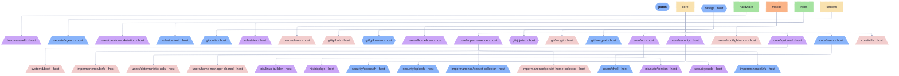

# Provider Tree: patch

```mermaid
%%{init: {"elk":{"mergeEdges":true,"nodePlacementStrategy":"BRANDES_KOEPF"},"flowchart":{"wrappingWidth":600},"layout":"elk","theme":"base","themeVariables":{"activationBkgColor":"#313244","activationBorderColor":"#6c7086","actorBkg":"#313244","actorBorder":"#a6adc8","actorLineColor":"#a6adc8","actorTextColor":"#cdd6f4","background":"#1e1e2e","classText":"#cdd6f4","clusterBkg":"#313244","clusterBorder":"#6c7086","edgeLabelBackground":"#1e1e2e","labelBoxBkgColor":"#313244","labelBoxBorderColor":"#a6adc8","labelTextColor":"#cdd6f4","lineColor":"#a6adc8","loopTextColor":"#cdd6f4","mainBkg":"#313244","nodeBkg":"#313244","nodeBorder":"#a6adc8","nodeTextColor":"#cdd6f4","noteBkgColor":"#313244","noteBorderColor":"#6c7086","noteTextColor":"#cdd6f4","pie1":"#f38ba8","pie2":"#fab387","pie3":"#f9e2af","pie4":"#a6e3a1","pie5":"#94e2d5","pie6":"#89b4fa","pie7":"#cba6f7","pie8":"#f2cdcd","pieLegendTextColor":"#cdd6f4","pieOuterStrokeColor":"#6c7086","pieSectionTextColor":"#cdd6f4","pieStrokeColor":"#6c7086","pieTitleTextColor":"#cdd6f4","primaryBorderColor":"#a6adc8","primaryColor":"#313244","primaryTextColor":"#cdd6f4","secondBkg":"#313244","secondaryBorderColor":"#6c7086","secondaryColor":"#313244","secondaryTextColor":"#cdd6f4","sequenceNumberColor":"#1e1e2e","signalColor":"#a6adc8","signalTextColor":"#cdd6f4","tertiaryBorderColor":"#6c7086","tertiaryColor":"#313244","tertiaryTextColor":"#cdd6f4","textColor":"#cdd6f4","titleColor":"#cdd6f4"}}}%%
graph TD
  patch([patch]):::root
  hardware__adb[/"hardware/adb · host"\]:::hardware__adb_c
  secrets__agenix[/"secrets/agenix · host"\]:::secrets__agenix_c
  core__systemd__boot[/"systemd/boot · host"\]:::core__systemd__boot_c
  core__impermanence__btrfs[/"impermanence/btrfs · host"\]:::core__impermanence__btrfs_c
  core["core"]:::core_c
  roles__darwin_workstation[/"roles/darwin-workstation · host"\]:::roles__darwin_workstation_c
  roles__default[/"roles/default · host"\]:::roles__default_c
  applications__dev__git__delta[/"git/delta · host"\]:::applications__dev__git__delta_c
  core__users__deterministic_uids[/"users/deterministic-uids · host"\]:::core__users__deterministic_uids_c
  roles__dev[/"roles/dev · host"\]:::roles__dev_c
  macos__fonts[/"macos/fonts · host"\]:::macos__fonts_c
  applications__dev__git{{"dev/git · host"}}:::applications__dev__git_c
  applications__dev__git__github[/"git/github · host"\]:::applications__dev__git__github_c
  applications__dev__git__gitkraken{{"git/gitkraken · host"}}:::applications__dev__git__gitkraken_c
  hardware["hardware"]:::hardware_c
  core__users__home_manager_shared[/"users/home-manager-shared · host"\]:::core__users__home_manager_shared_c
  macos__homebrew[/"macos/homebrew · host"\]:::macos__homebrew_c
  core__impermanence[/"core/impermanence · host"\]:::core__impermanence_c
  applications__dev__git__jujutsu{{"git/jujutsu · host"}}:::applications__dev__git__jujutsu_c
  applications__dev__git__lazygit[/"git/lazygit · host"\]:::applications__dev__git__lazygit_c
  core__nix__linux_builder[/"nix/linux-builder · host"\]:::core__nix__linux_builder_c
  macos["macos"]:::macos_c
  applications__dev__git__mergiraf[/"git/mergiraf · host"\]:::applications__dev__git__mergiraf_c
  core__nix[/"core/nix · host"\]:::core__nix_c
  core__nix__nixpkgs[/"nix/nixpkgs · host"\]:::core__nix__nixpkgs_c
  core__security__openssh[/"security/openssh · host"\]:::core__security__openssh_c
  core__security__opkssh[/"security/opkssh · host"\]:::core__security__opkssh_c
  core__impermanence__persist_collector[/"impermanence/persist-collector · host"\]:::core__impermanence__persist_collector_c
  core__impermanence__persist_home_collector[/"impermanence/persist-home-collector · host"\]:::core__impermanence__persist_home_collector_c
  roles["roles"]:::roles_c
  secrets["secrets"]:::secrets_c
  core__security[/"core/security · host"\]:::core__security_c
  core__users__shell[/"users/shell · host"\]:::core__users__shell_c
  macos__spotlight_apps[/"macos/spotlight-apps · host"\]:::macos__spotlight_apps_c
  core__nix__stateVersion[/"nix/stateVersion · host"\]:::core__nix__stateVersion_c
  core__security__sudo[/"security/sudo · host"\]:::core__security__sudo_c
  core__systemd[/"core/systemd · host"\]:::core__systemd_c
  core__users[/"core/users · host"\]:::core__users_c
  core__utils[/"core/utils · host"\]:::core__utils_c
  core__impermanence__zfs[/"impermanence/zfs · host"\]:::core__impermanence__zfs_c

  hardware --> hardware__adb
  secrets --> secrets__agenix
  core__systemd --> core__systemd__boot
  core__impermanence --> core__impermanence__btrfs
  roles --> roles__darwin_workstation
  roles --> roles__default
  applications__dev__git --> applications__dev__git__delta
  core__users --> core__users__deterministic_uids
  roles --> roles__dev
  macos --> macos__fonts
  applications__dev__git --> applications__dev__git__github
  applications__dev__git --> applications__dev__git__gitkraken
  core__users --> core__users__home_manager_shared
  macos --> macos__homebrew
  core --> core__impermanence
  applications__dev__git --> applications__dev__git__jujutsu
  applications__dev__git --> applications__dev__git__lazygit
  core__nix --> core__nix__linux_builder
  applications__dev__git --> applications__dev__git__mergiraf
  core --> core__nix
  core__nix --> core__nix__nixpkgs
  core__security --> core__security__openssh
  core__security --> core__security__opkssh
  core__impermanence --> core__impermanence__persist_collector
  core__impermanence --> core__impermanence__persist_home_collector
  core --> core__security
  core__users --> core__users__shell
  macos --> macos__spotlight_apps
  core__nix --> core__nix__stateVersion
  core__security --> core__security__sudo
  core --> core__systemd
  core --> core__users
  core --> core__utils
  core__impermanence --> core__impermanence__zfs

  classDef root fill:#89b4fa,stroke:#89b4fa,color:#1e1e2e,font-weight:bold
  classDef hardware__adb_c fill:#cba6f7,stroke:#cba6f7,color:#1e1e2e,stroke-width:3px
  classDef secrets__agenix_c fill:#89b4fa,stroke:#89b4fa,color:#1e1e2e,stroke-width:3px
  classDef core__systemd__boot_c fill:#f2cdcd,stroke:#f2cdcd,color:#1e1e2e,stroke-width:3px
  classDef core__impermanence__btrfs_c fill:#f2cdcd,stroke:#f2cdcd,color:#1e1e2e,stroke-width:3px
  classDef core_c fill:#f9e2af,stroke:#f9e2af,color:#1e1e2e,stroke-dasharray: 3 3,stroke-width:1px
  classDef roles__darwin_workstation_c fill:#cba6f7,stroke:#cba6f7,color:#1e1e2e,stroke-width:3px
  classDef roles__default_c fill:#89b4fa,stroke:#89b4fa,color:#1e1e2e,stroke-width:3px
  classDef applications__dev__git__delta_c fill:#89b4fa,stroke:#89b4fa,color:#1e1e2e,stroke-width:3px
  classDef core__users__deterministic_uids_c fill:#f2cdcd,stroke:#f2cdcd,color:#1e1e2e,stroke-width:3px
  classDef roles__dev_c fill:#cba6f7,stroke:#cba6f7,color:#1e1e2e,stroke-width:3px
  classDef macos__fonts_c fill:#f2cdcd,stroke:#f2cdcd,color:#1e1e2e,stroke-width:3px
  classDef applications__dev__git_c fill:#89b4fa,stroke:#89b4fa,color:#1e1e2e,stroke-width:3px
  classDef applications__dev__git__github_c fill:#f2cdcd,stroke:#f2cdcd,color:#1e1e2e,stroke-width:3px
  classDef applications__dev__git__gitkraken_c fill:#89b4fa,stroke:#89b4fa,color:#1e1e2e,stroke-width:3px
  classDef hardware_c fill:#a6e3a1,stroke:#a6e3a1,color:#1e1e2e,stroke-dasharray: 3 3,stroke-width:1px
  classDef core__users__home_manager_shared_c fill:#f2cdcd,stroke:#f2cdcd,color:#1e1e2e,stroke-width:3px
  classDef macos__homebrew_c fill:#cba6f7,stroke:#cba6f7,color:#1e1e2e,stroke-width:3px
  classDef core__impermanence_c fill:#cba6f7,stroke:#cba6f7,color:#1e1e2e,stroke-width:3px
  classDef applications__dev__git__jujutsu_c fill:#cba6f7,stroke:#cba6f7,color:#1e1e2e,stroke-width:3px
  classDef applications__dev__git__lazygit_c fill:#f2cdcd,stroke:#f2cdcd,color:#1e1e2e,stroke-width:3px
  classDef core__nix__linux_builder_c fill:#cba6f7,stroke:#cba6f7,color:#1e1e2e,stroke-width:3px
  classDef macos_c fill:#fab387,stroke:#fab387,color:#1e1e2e,stroke-dasharray: 3 3,stroke-width:1px
  classDef applications__dev__git__mergiraf_c fill:#89b4fa,stroke:#89b4fa,color:#1e1e2e,stroke-width:3px
  classDef core__nix_c fill:#cba6f7,stroke:#cba6f7,color:#1e1e2e,stroke-width:3px
  classDef core__nix__nixpkgs_c fill:#cba6f7,stroke:#cba6f7,color:#1e1e2e,stroke-width:3px
  classDef core__security__openssh_c fill:#89b4fa,stroke:#89b4fa,color:#1e1e2e,stroke-width:3px
  classDef core__security__opkssh_c fill:#89b4fa,stroke:#89b4fa,color:#1e1e2e,stroke-width:3px
  classDef core__impermanence__persist_collector_c fill:#89b4fa,stroke:#89b4fa,color:#1e1e2e,stroke-width:3px
  classDef core__impermanence__persist_home_collector_c fill:#f2cdcd,stroke:#f2cdcd,color:#1e1e2e,stroke-width:3px
  classDef roles_c fill:#a6e3a1,stroke:#a6e3a1,color:#1e1e2e,stroke-dasharray: 3 3,stroke-width:1px
  classDef secrets_c fill:#f9e2af,stroke:#f9e2af,color:#1e1e2e,stroke-dasharray: 3 3,stroke-width:1px
  classDef core__security_c fill:#cba6f7,stroke:#cba6f7,color:#1e1e2e,stroke-width:3px
  classDef core__users__shell_c fill:#89b4fa,stroke:#89b4fa,color:#1e1e2e,stroke-width:3px
  classDef macos__spotlight_apps_c fill:#f2cdcd,stroke:#f2cdcd,color:#1e1e2e,stroke-width:3px
  classDef core__nix__stateVersion_c fill:#cba6f7,stroke:#cba6f7,color:#1e1e2e,stroke-width:3px
  classDef core__security__sudo_c fill:#cba6f7,stroke:#cba6f7,color:#1e1e2e,stroke-width:3px
  classDef core__systemd_c fill:#cba6f7,stroke:#cba6f7,color:#1e1e2e,stroke-width:3px
  classDef core__users_c fill:#89b4fa,stroke:#89b4fa,color:#1e1e2e,stroke-width:3px
  classDef core__utils_c fill:#f2cdcd,stroke:#f2cdcd,color:#1e1e2e,stroke-width:3px
  classDef core__impermanence__zfs_c fill:#89b4fa,stroke:#89b4fa,color:#1e1e2e,stroke-width:3px
```
