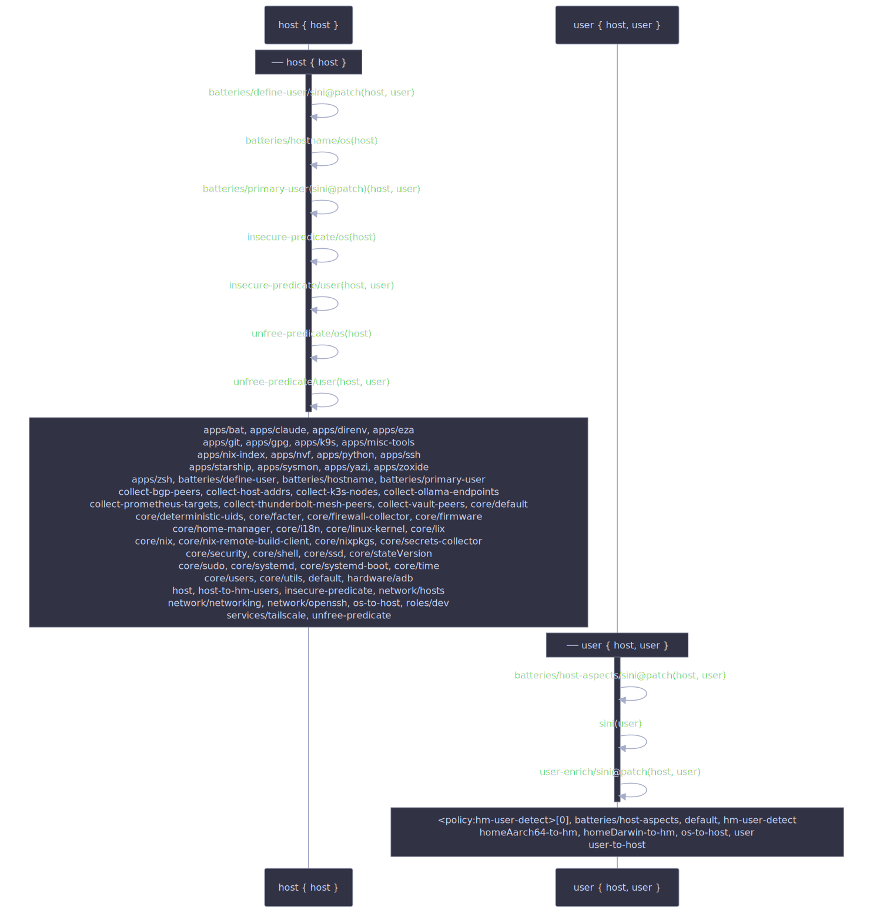
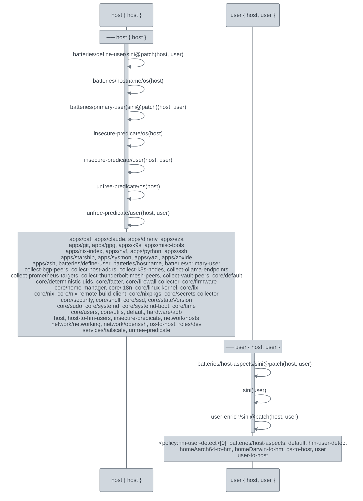

# Scope Sequence (expanded): patch

```mermaid
%%{init: {"theme":"base","themeVariables":{"activationBkgColor":"#d0d7de","activationBorderColor":"#8c959f","actorBkg":"#d0d7de","actorBorder":"#6e7781","actorLineColor":"#6e7781","actorTextColor":"#424a53","background":"#eaeef2","classText":"#424a53","clusterBkg":"#d0d7de","clusterBorder":"#8c959f","edgeLabelBackground":"#eaeef2","labelBoxBkgColor":"#d0d7de","labelBoxBorderColor":"#6e7781","labelTextColor":"#424a53","lineColor":"#6e7781","loopTextColor":"#424a53","mainBkg":"#d0d7de","nodeBkg":"#d0d7de","nodeBorder":"#6e7781","nodeTextColor":"#424a53","noteBkgColor":"#d0d7de","noteBorderColor":"#8c959f","noteTextColor":"#424a53","pie1":"#fa4549","pie2":"#e16f24","pie3":"#bf8700","pie4":"#2da44e","pie5":"#339D9B","pie6":"#218bff","pie7":"#a475f9","pie8":"#4d2d00","pieLegendTextColor":"#424a53","pieOuterStrokeColor":"#8c959f","pieSectionTextColor":"#424a53","pieStrokeColor":"#8c959f","pieTitleTextColor":"#424a53","primaryBorderColor":"#6e7781","primaryColor":"#d0d7de","primaryTextColor":"#424a53","secondBkg":"#d0d7de","secondaryBorderColor":"#8c959f","secondaryColor":"#d0d7de","secondaryTextColor":"#424a53","sequenceNumberColor":"#eaeef2","signalColor":"#6e7781","signalTextColor":"#424a53","tertiaryBorderColor":"#8c959f","tertiaryColor":"#d0d7de","tertiaryTextColor":"#424a53","textColor":"#424a53","titleColor":"#424a53"}}}%%
sequenceDiagram
    participant host as host { host }
    participant user as user { host, user }

    Note over host: ── host { host }
    activate host
    host ->> host: batteries/define-user/sini@patch(host, user)
    host ->> host: batteries/hostname/os(host)
    host ->> host: batteries/primary-user(sini@patch)(host, user)
    host ->> host: insecure-predicate/os(host)
    host ->> host: insecure-predicate/user(host, user)
    host ->> host: unfree-predicate/os(host)
    host ->> host: unfree-predicate/user(host, user)
    deactivate host
    Note over host: apps/bat, apps/claude, apps/direnv, apps/eza<br/>apps/git, apps/gpg, apps/k9s, apps/misc-tools<br/>apps/nix-index, apps/nvf, apps/python, apps/ssh<br/>apps/starship, apps/sysmon, apps/yazi, apps/zoxide<br/>apps/zsh, batteries/define-user, batteries/hostname, batteries/primary-user<br/>collect-bgp-peers, collect-host-addrs, collect-k3s-nodes, collect-ollama-endpoints<br/>collect-prometheus-targets, collect-thunderbolt-mesh-peers, collect-vault-peers, core/default<br/>core/deterministic-uids, core/facter, core/firewall-collector, core/firmware<br/>core/home-manager, core/i18n, core/linux-kernel, core/lix<br/>core/nix, core/nix-remote-build-client, core/nixpkgs, core/secrets-collector<br/>core/security, core/shell, core/ssd, core/stateVersion<br/>core/sudo, core/systemd, core/systemd-boot, core/time<br/>core/users, core/utils, default, hardware/adb<br/>host, host-to-hm-users, insecure-predicate, network/hosts<br/>network/networking, network/openssh, os-to-host, roles/dev<br/>services/tailscale, unfree-predicate

    Note over user: ── user { host, user }
    activate user
    user ->> user: batteries/host-aspects/sini@patch(host, user)
    user ->> user: sini(user)
    user ->> user: user-enrich/sini@patch(host, user)
    deactivate user
    Note over user: <policy:hm-user-detect>[0], batteries/host-aspects, default, hm-user-detect<br/>homeAarch64-to-hm, homeDarwin-to-hm, os-to-host, user<br/>user-to-host
```
