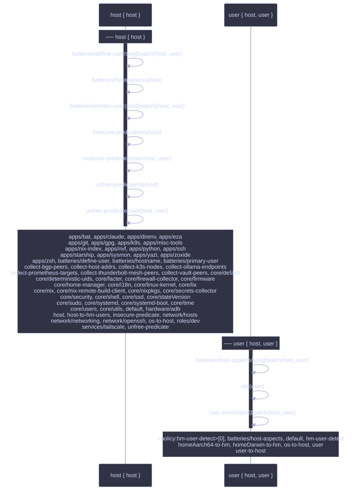

# Scope Sequence (expanded): patch

```mermaid
%%{init: {"theme":"base","themeVariables":{"activationBkgColor":"#313244","activationBorderColor":"#6c7086","actorBkg":"#313244","actorBorder":"#a6adc8","actorLineColor":"#a6adc8","actorTextColor":"#cdd6f4","background":"#1e1e2e","classText":"#cdd6f4","clusterBkg":"#313244","clusterBorder":"#6c7086","edgeLabelBackground":"#1e1e2e","labelBoxBkgColor":"#313244","labelBoxBorderColor":"#a6adc8","labelTextColor":"#cdd6f4","lineColor":"#a6adc8","loopTextColor":"#cdd6f4","mainBkg":"#313244","nodeBkg":"#313244","nodeBorder":"#a6adc8","nodeTextColor":"#cdd6f4","noteBkgColor":"#313244","noteBorderColor":"#6c7086","noteTextColor":"#cdd6f4","pie1":"#f38ba8","pie2":"#fab387","pie3":"#f9e2af","pie4":"#a6e3a1","pie5":"#94e2d5","pie6":"#89b4fa","pie7":"#cba6f7","pie8":"#f2cdcd","pieLegendTextColor":"#cdd6f4","pieOuterStrokeColor":"#6c7086","pieSectionTextColor":"#cdd6f4","pieStrokeColor":"#6c7086","pieTitleTextColor":"#cdd6f4","primaryBorderColor":"#a6adc8","primaryColor":"#313244","primaryTextColor":"#cdd6f4","secondBkg":"#313244","secondaryBorderColor":"#6c7086","secondaryColor":"#313244","secondaryTextColor":"#cdd6f4","sequenceNumberColor":"#1e1e2e","signalColor":"#a6adc8","signalTextColor":"#cdd6f4","tertiaryBorderColor":"#6c7086","tertiaryColor":"#313244","tertiaryTextColor":"#cdd6f4","textColor":"#cdd6f4","titleColor":"#cdd6f4"}}}%%
sequenceDiagram
    participant host as host { host }
    participant user as user { host, user }

    Note over host: ── host { host }
    activate host
    host ->> host: batteries/define-user/sini@patch(host, user)
    host ->> host: batteries/hostname/os(host)
    host ->> host: batteries/primary-user(sini@patch)(host, user)
    host ->> host: insecure-predicate/os(host)
    host ->> host: insecure-predicate/user(host, user)
    host ->> host: unfree-predicate/os(host)
    host ->> host: unfree-predicate/user(host, user)
    deactivate host
    Note over host: apps/bat, apps/claude, apps/direnv, apps/eza<br/>apps/git, apps/gpg, apps/k9s, apps/misc-tools<br/>apps/nix-index, apps/nvf, apps/python, apps/ssh<br/>apps/starship, apps/sysmon, apps/yazi, apps/zoxide<br/>apps/zsh, batteries/define-user, batteries/hostname, batteries/primary-user<br/>collect-bgp-peers, collect-host-addrs, collect-k3s-nodes, collect-ollama-endpoints<br/>collect-prometheus-targets, collect-thunderbolt-mesh-peers, collect-vault-peers, core/default<br/>core/deterministic-uids, core/facter, core/firewall-collector, core/firmware<br/>core/home-manager, core/i18n, core/linux-kernel, core/lix<br/>core/nix, core/nix-remote-build-client, core/nixpkgs, core/secrets-collector<br/>core/security, core/shell, core/ssd, core/stateVersion<br/>core/sudo, core/systemd, core/systemd-boot, core/time<br/>core/users, core/utils, default, hardware/adb<br/>host, host-to-hm-users, insecure-predicate, network/hosts<br/>network/networking, network/openssh, os-to-host, roles/dev<br/>services/tailscale, unfree-predicate

    Note over user: ── user { host, user }
    activate user
    user ->> user: batteries/host-aspects/sini@patch(host, user)
    user ->> user: sini(user)
    user ->> user: user-enrich/sini@patch(host, user)
    deactivate user
    Note over user: <policy:hm-user-detect>[0], batteries/host-aspects, default, hm-user-detect<br/>homeAarch64-to-hm, homeDarwin-to-hm, os-to-host, user<br/>user-to-host
```
