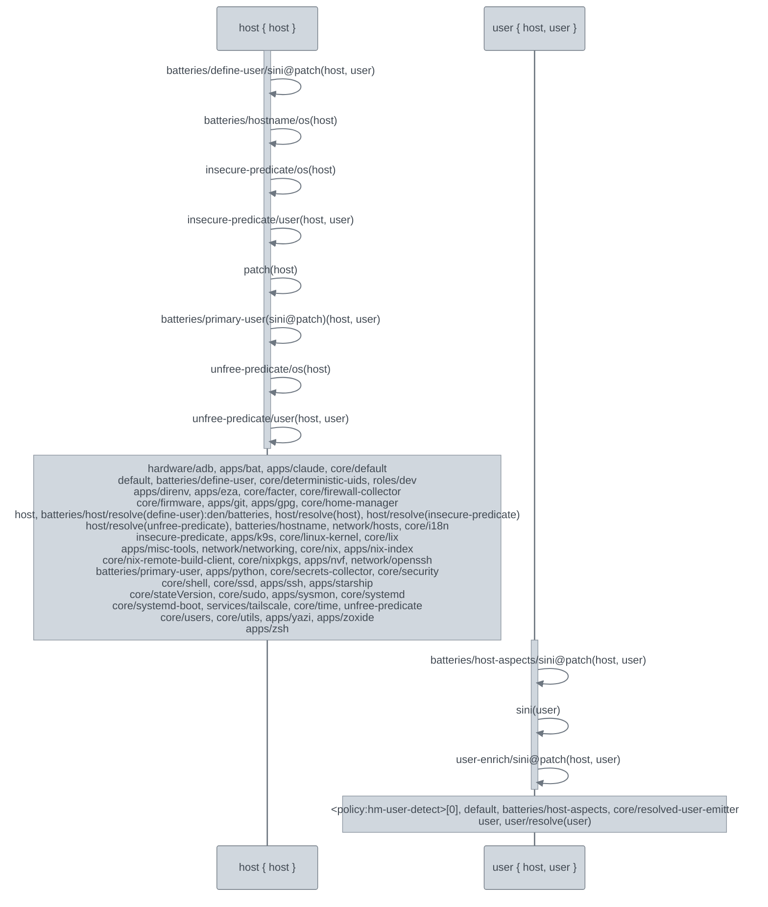

# Scope Sequence: patch

```mermaid
%%{init: {"theme":"base","themeVariables":{"activationBkgColor":"#d0d7de","activationBorderColor":"#8c959f","actorBkg":"#d0d7de","actorBorder":"#6e7781","actorLineColor":"#6e7781","actorTextColor":"#424a53","background":"#eaeef2","classText":"#424a53","clusterBkg":"#d0d7de","clusterBorder":"#8c959f","edgeLabelBackground":"#eaeef2","labelBoxBkgColor":"#d0d7de","labelBoxBorderColor":"#6e7781","labelTextColor":"#424a53","lineColor":"#6e7781","loopTextColor":"#424a53","mainBkg":"#d0d7de","nodeBkg":"#d0d7de","nodeBorder":"#6e7781","nodeTextColor":"#424a53","noteBkgColor":"#d0d7de","noteBorderColor":"#8c959f","noteTextColor":"#424a53","pie1":"#fa4549","pie2":"#e16f24","pie3":"#bf8700","pie4":"#2da44e","pie5":"#339D9B","pie6":"#218bff","pie7":"#a475f9","pie8":"#4d2d00","pieLegendTextColor":"#424a53","pieOuterStrokeColor":"#8c959f","pieSectionTextColor":"#424a53","pieStrokeColor":"#8c959f","pieTitleTextColor":"#424a53","primaryBorderColor":"#6e7781","primaryColor":"#d0d7de","primaryTextColor":"#424a53","secondBkg":"#d0d7de","secondaryBorderColor":"#8c959f","secondaryColor":"#d0d7de","secondaryTextColor":"#424a53","sequenceNumberColor":"#eaeef2","signalColor":"#6e7781","signalTextColor":"#424a53","tertiaryBorderColor":"#8c959f","tertiaryColor":"#d0d7de","tertiaryTextColor":"#424a53","textColor":"#424a53","titleColor":"#424a53"}}}%%
sequenceDiagram
    participant host as host { host }
    participant user as user { host, user }


    activate host
    host ->> host: batteries/define-user/sini@patch(host, user)
    host ->> host: batteries/hostname/os(host)
    host ->> host: insecure-predicate/os(host)
    host ->> host: insecure-predicate/user(host, user)
    host ->> host: patch(host)
    host ->> host: batteries/primary-user(sini@patch)(host, user)
    host ->> host: unfree-predicate/os(host)
    host ->> host: unfree-predicate/user(host, user)
    deactivate host
    Note over host: hardware/adb, apps/bat, apps/claude, core/default<br/>default, batteries/define-user, core/deterministic-uids, roles/dev<br/>apps/direnv, apps/eza, core/facter, core/firewall-collector<br/>core/firmware, apps/git, apps/gpg, core/home-manager<br/>host, batteries/host/resolve(define-user):den/batteries, host/resolve(host), host/resolve(insecure-predicate)<br/>host/resolve(unfree-predicate), batteries/hostname, network/hosts, core/i18n<br/>insecure-predicate, apps/k9s, core/linux-kernel, core/lix<br/>apps/misc-tools, network/networking, core/nix, apps/nix-index<br/>core/nix-remote-build-client, core/nixpkgs, apps/nvf, network/openssh<br/>batteries/primary-user, apps/python, core/secrets-collector, core/security<br/>core/shell, core/ssd, apps/ssh, apps/starship<br/>core/stateVersion, core/sudo, apps/sysmon, core/systemd<br/>core/systemd-boot, services/tailscale, core/time, unfree-predicate<br/>core/users, core/utils, apps/yazi, apps/zoxide<br/>apps/zsh

    activate user
    user ->> user: batteries/host-aspects/sini@patch(host, user)
    user ->> user: sini(user)
    user ->> user: user-enrich/sini@patch(host, user)
    deactivate user
    Note over user: <policy:hm-user-detect>[0], default, batteries/host-aspects, core/resolved-user-emitter<br/>user, user/resolve(user)
```
