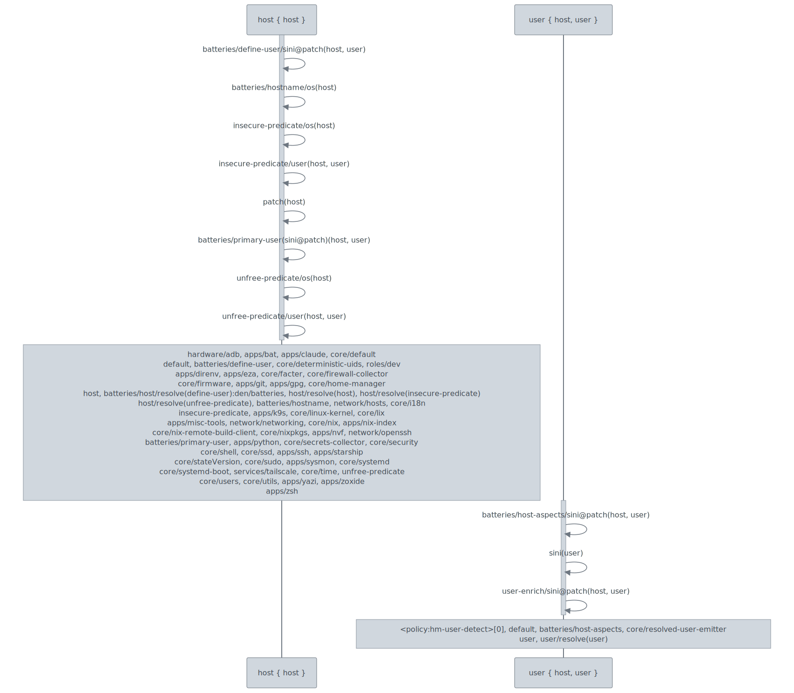
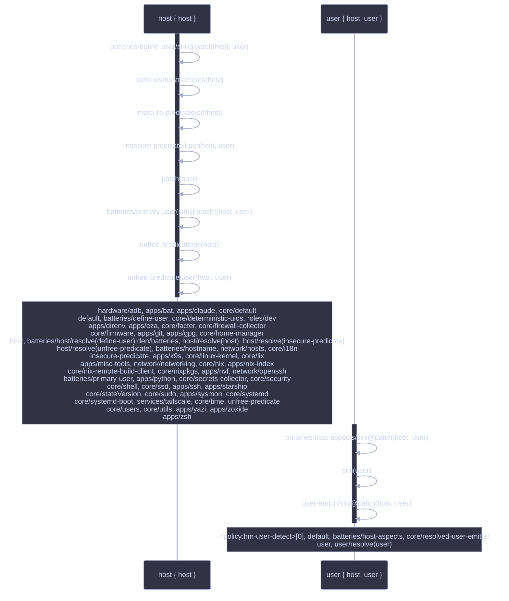

# Scope Sequence: patch

```mermaid
%%{init: {"theme":"base","themeVariables":{"activationBkgColor":"#313244","activationBorderColor":"#6c7086","actorBkg":"#313244","actorBorder":"#a6adc8","actorLineColor":"#a6adc8","actorTextColor":"#cdd6f4","background":"#1e1e2e","classText":"#cdd6f4","clusterBkg":"#313244","clusterBorder":"#6c7086","edgeLabelBackground":"#1e1e2e","labelBoxBkgColor":"#313244","labelBoxBorderColor":"#a6adc8","labelTextColor":"#cdd6f4","lineColor":"#a6adc8","loopTextColor":"#cdd6f4","mainBkg":"#313244","nodeBkg":"#313244","nodeBorder":"#a6adc8","nodeTextColor":"#cdd6f4","noteBkgColor":"#313244","noteBorderColor":"#6c7086","noteTextColor":"#cdd6f4","pie1":"#f38ba8","pie2":"#fab387","pie3":"#f9e2af","pie4":"#a6e3a1","pie5":"#94e2d5","pie6":"#89b4fa","pie7":"#cba6f7","pie8":"#f2cdcd","pieLegendTextColor":"#cdd6f4","pieOuterStrokeColor":"#6c7086","pieSectionTextColor":"#cdd6f4","pieStrokeColor":"#6c7086","pieTitleTextColor":"#cdd6f4","primaryBorderColor":"#a6adc8","primaryColor":"#313244","primaryTextColor":"#cdd6f4","secondBkg":"#313244","secondaryBorderColor":"#6c7086","secondaryColor":"#313244","secondaryTextColor":"#cdd6f4","sequenceNumberColor":"#1e1e2e","signalColor":"#a6adc8","signalTextColor":"#cdd6f4","tertiaryBorderColor":"#6c7086","tertiaryColor":"#313244","tertiaryTextColor":"#cdd6f4","textColor":"#cdd6f4","titleColor":"#cdd6f4"}}}%%
sequenceDiagram
    participant host as host { host }
    participant user as user { host, user }


    activate host
    host ->> host: batteries/define-user/sini@patch(host, user)
    host ->> host: batteries/hostname/os(host)
    host ->> host: insecure-predicate/os(host)
    host ->> host: insecure-predicate/user(host, user)
    host ->> host: patch(host)
    host ->> host: batteries/primary-user(sini@patch)(host, user)
    host ->> host: unfree-predicate/os(host)
    host ->> host: unfree-predicate/user(host, user)
    deactivate host
    Note over host: hardware/adb, apps/bat, apps/claude, core/default<br/>default, batteries/define-user, core/deterministic-uids, roles/dev<br/>apps/direnv, apps/eza, core/facter, core/firewall-collector<br/>core/firmware, apps/git, apps/gpg, core/home-manager<br/>host, batteries/host/resolve(define-user):den/batteries, host/resolve(host), host/resolve(insecure-predicate)<br/>host/resolve(unfree-predicate), batteries/hostname, network/hosts, core/i18n<br/>insecure-predicate, apps/k9s, core/linux-kernel, core/lix<br/>apps/misc-tools, network/networking, core/nix, apps/nix-index<br/>core/nix-remote-build-client, core/nixpkgs, apps/nvf, network/openssh<br/>batteries/primary-user, apps/python, core/secrets-collector, core/security<br/>core/shell, core/ssd, apps/ssh, apps/starship<br/>core/stateVersion, core/sudo, apps/sysmon, core/systemd<br/>core/systemd-boot, services/tailscale, core/time, unfree-predicate<br/>core/users, core/utils, apps/yazi, apps/zoxide<br/>apps/zsh

    activate user
    user ->> user: batteries/host-aspects/sini@patch(host, user)
    user ->> user: sini(user)
    user ->> user: user-enrich/sini@patch(host, user)
    deactivate user
    Note over user: <policy:hm-user-detect>[0], default, batteries/host-aspects, core/resolved-user-emitter<br/>user, user/resolve(user)
```
