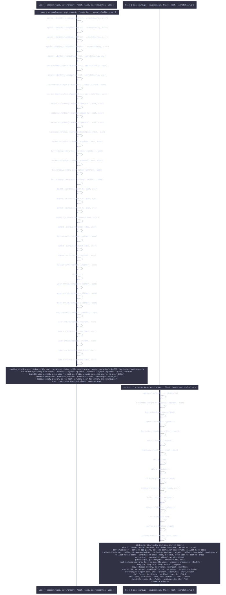

# Scope Sequence (expanded): slab

```mermaid
%%{init: {"theme":"base","themeVariables":{"activationBkgColor":"#313244","activationBorderColor":"#6c7086","actorBkg":"#313244","actorBorder":"#a6adc8","actorLineColor":"#a6adc8","actorTextColor":"#cdd6f4","background":"#1e1e2e","classText":"#cdd6f4","clusterBkg":"#313244","clusterBorder":"#6c7086","edgeLabelBackground":"#1e1e2e","labelBoxBkgColor":"#313244","labelBoxBorderColor":"#a6adc8","labelTextColor":"#cdd6f4","lineColor":"#a6adc8","loopTextColor":"#cdd6f4","mainBkg":"#313244","nodeBkg":"#313244","nodeBorder":"#a6adc8","nodeTextColor":"#cdd6f4","noteBkgColor":"#313244","noteBorderColor":"#6c7086","noteTextColor":"#cdd6f4","pie1":"#f38ba8","pie2":"#fab387","pie3":"#f9e2af","pie4":"#a6e3a1","pie5":"#94e2d5","pie6":"#89b4fa","pie7":"#cba6f7","pie8":"#f2cdcd","pieLegendTextColor":"#cdd6f4","pieOuterStrokeColor":"#6c7086","pieSectionTextColor":"#cdd6f4","pieStrokeColor":"#6c7086","pieTitleTextColor":"#cdd6f4","primaryBorderColor":"#a6adc8","primaryColor":"#313244","primaryTextColor":"#cdd6f4","secondBkg":"#313244","secondaryBorderColor":"#6c7086","secondaryColor":"#313244","secondaryTextColor":"#cdd6f4","sequenceNumberColor":"#1e1e2e","signalColor":"#a6adc8","signalTextColor":"#cdd6f4","tertiaryBorderColor":"#6c7086","tertiaryColor":"#313244","tertiaryTextColor":"#cdd6f4","textColor":"#cdd6f4","titleColor":"#cdd6f4"}}}%%
sequenceDiagram
    participant user as user { accessGroups, environment, fleet, host, secretsConfig, user }
    participant host as host { accessGroups, environment, fleet, host, secretsConfig }

    Note over user: ── user { accessGroups, environment, fleet, host, secretsConfig, user }
    activate user
    user ->> user: agenix-identity/sini@axon-01(host, secretsConfig, user)
    user ->> user: agenix-identity/sini@axon-02(host, secretsConfig, user)
    user ->> user: agenix-identity/sini@axon-03(host, secretsConfig, user)
    user ->> user: agenix-identity/sini@bitstream(host, secretsConfig, user)
    user ->> user: agenix-identity/sini@blade(host, secretsConfig, user)
    user ->> user: agenix-identity/sini@cortex(host, secretsConfig, user)
    user ->> user: agenix-identity/sini@patch(host, secretsConfig, user)
    user ->> user: agenix-identity/sini@slab(host, secretsConfig, user)
    user ->> user: agenix-identity/sini@uplink(host, secretsConfig, user)
    user ->> user: batteries/primary-user(sini@axon-01)(host, user)
    user ->> user: batteries/primary-user(sini@axon-02)(host, user)
    user ->> user: batteries/primary-user(sini@axon-03)(host, user)
    user ->> user: batteries/primary-user(sini@bitstream)(host, user)
    user ->> user: batteries/primary-user(sini@blade)(host, user)
    user ->> user: batteries/primary-user(sini@cortex)(host, user)
    user ->> user: batteries/primary-user(sini@patch)(host, user)
    user ->> user: batteries/primary-user(sini@slab)(host, user)
    user ->> user: batteries/primary-user(sini@uplink)(host, user)
    user ->> user: opkssh-authz/sini@axon-01(host, user)
    user ->> user: opkssh-authz/sini@axon-02(host, user)
    user ->> user: opkssh-authz/sini@axon-03(host, user)
    user ->> user: opkssh-authz/sini@bitstream(host, user)
    user ->> user: opkssh-authz/sini@blade(host, user)
    user ->> user: opkssh-authz/sini@cortex(host, user)
    user ->> user: opkssh-authz/sini@patch(host, user)
    user ->> user: opkssh-authz/sini@slab(host, user)
    user ->> user: opkssh-authz/sini@uplink(host, user)
    user ->> user: sini(user)
    user ->> user: user-enrich/sini@axon-01(host, user)
    user ->> user: user-enrich/sini@axon-02(host, user)
    user ->> user: user-enrich/sini@axon-03(host, user)
    user ->> user: user-enrich/sini@bitstream(host, user)
    user ->> user: user-enrich/sini@blade(host, user)
    user ->> user: user-enrich/sini@cortex(host, user)
    user ->> user: user-enrich/sini@patch(host, user)
    user ->> user: user-enrich/sini@slab(host, user)
    user ->> user: user-enrich/sini@uplink(host, user)
    deactivate user
    Note over user: <policy:droidHm-user-detect>[0], <policy:hm-user-detect>[0], <policy:user-aspect-auto-include>[3], batteries/host-aspects<br/>broadcast-syncthing-hub-shares, broadcast-syncthing-peers, broadcast-syncthing-peers-to-hub, default<br/>droidHm-user-detect, drop-user-to-host-on-droid, expose-resolved-users, hm-user-detect<br/>homeAarch64-to-hm, homeDarwin-to-hm, homeLinux-to-hm, host-aspects-project<br/>media/spotify-player, os-to-host, primary-user-for-owner, syncthing/peer<br/>user, user-aspect-auto-include, user-to-host

    Note over host: ── host { accessGroups, environment, fleet, host, secretsConfig }
    activate host
    host ->> host: agenix/slab(host, secretsConfig)
    host ->> host: batteries/define-user/sini@slab(host, user)
    host ->> host: batteries/hostname/os(host)
    host ->> host: batteries/inputs'/os(host)
    host ->> host: batteries/inputs'/user(host, user)
    host ->> host: batteries/self'/os(host)
    host ->> host: batteries/self'/user(host, user)
    host ->> host: dev/git(user)
    host ->> host: git/jujutsu(user)
    host ->> host: insecure-predicate/os(host)
    host ->> host: insecure-predicate/user(host, user)
    host ->> host: security/bitwarden(user)
    host ->> host: security/signing-key(user)
    host ->> host: security/ssh(user)
    host ->> host: unfree-predicate/os(host)
    host ->> host: unfree-predicate/user(host, user)
    deactivate host
    Note over host: ai/beads, ai/claude, ai/hunk, ai/llm-agents<br/>ai/rtk, batteries/define-user, batteries/hostname, batteries/inputs'<br/>batteries/self', collect-bgp-peers, collect-container-registries, collect-host-addrs<br/>collect-k3s-nodes, collect-ollama-endpoints, collect-prometheus-targets, collect-thunderbolt-mesh-peers<br/>collect-vault-peers, core/nix-on-droid-base, default, drop-user-to-host-on-droid<br/>editor/nvf, env-users, git/delta, git/github<br/>git/lazygit, git/mergiraf, hardware/adb, host<br/>host-modules-capture, host-to-droidHm-users, insecure-predicate, k8s/k9s<br/>lang/go, lang/nix, lang/python, lang/rust<br/>mcp/codebase-memory, mux/herdr, mux/sesh, mux/tmux<br/>mux/zellij, network/firewall-collector, roles/dev, secrets/collector<br/>security/ssh-agent-mux, shell/archive, shell/bat, shell/bottom<br/>shell/btop, shell/data, shell/direnv, shell/disk<br/>shell/eza, shell/nix-index, shell/process, shell/search<br/>shell/starship, shell/yazi, shell/zoxide, shell/zsh<br/>unfree-predicate
```
