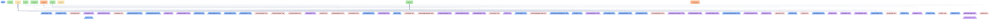

# Provider Tree: uplink

```mermaid
%%{init: {"elk":{"mergeEdges":true,"nodePlacementStrategy":"BRANDES_KOEPF"},"flowchart":{"wrappingWidth":600},"layout":"elk","theme":"base","themeVariables":{"activationBkgColor":"#313244","activationBorderColor":"#6c7086","actorBkg":"#313244","actorBorder":"#a6adc8","actorLineColor":"#a6adc8","actorTextColor":"#cdd6f4","background":"#1e1e2e","classText":"#cdd6f4","clusterBkg":"#313244","clusterBorder":"#6c7086","edgeLabelBackground":"#1e1e2e","labelBoxBkgColor":"#313244","labelBoxBorderColor":"#a6adc8","labelTextColor":"#cdd6f4","lineColor":"#a6adc8","loopTextColor":"#cdd6f4","mainBkg":"#313244","nodeBkg":"#313244","nodeBorder":"#a6adc8","nodeTextColor":"#cdd6f4","noteBkgColor":"#313244","noteBorderColor":"#6c7086","noteTextColor":"#cdd6f4","pie1":"#f38ba8","pie2":"#fab387","pie3":"#f9e2af","pie4":"#a6e3a1","pie5":"#94e2d5","pie6":"#89b4fa","pie7":"#cba6f7","pie8":"#f2cdcd","pieLegendTextColor":"#cdd6f4","pieOuterStrokeColor":"#6c7086","pieSectionTextColor":"#cdd6f4","pieStrokeColor":"#6c7086","pieTitleTextColor":"#cdd6f4","primaryBorderColor":"#a6adc8","primaryColor":"#313244","primaryTextColor":"#cdd6f4","secondBkg":"#313244","secondaryBorderColor":"#6c7086","secondaryColor":"#313244","secondaryTextColor":"#cdd6f4","sequenceNumberColor":"#1e1e2e","signalColor":"#a6adc8","signalTextColor":"#cdd6f4","tertiaryBorderColor":"#6c7086","tertiaryColor":"#313244","tertiaryTextColor":"#cdd6f4","textColor":"#cdd6f4","titleColor":"#cdd6f4"}}}%%
graph TD
  uplink([uplink]):::root
  services__acme[/"services/acme · host"\]:::services__acme_c
  secrets__agenix[/"secrets/agenix · host"\]:::secrets__agenix_c
  apps["apps"]:::apps_c
  services__attic[/"services/attic · host"\]:::services__attic_c
  services__bgp[/"services/bgp · host"\]:::services__bgp_c
  core["core"]:::core_c
  hardware__cpu_amd[/"hardware/cpu-amd · host"\]:::hardware__cpu_amd_c
  core__default[/"core/default · host"\]:::core__default_c
  services__den_docs_mirror[/"services/den-docs-mirror · host"\]:::services__den_docs_mirror_c
  core__deterministic_uids[/"core/deterministic-uids · host"\]:::core__deterministic_uids_c
  disk["disk"]:::disk_c
  core__facter[/"core/facter · host"\]:::core__facter_c
  core__firewall_collector[/"core/firewall-collector · host"\]:::core__firewall_collector_c
  core__firmware[/"core/firmware · host"\]:::core__firmware_c
  hardware__gpu_intel[/"hardware/gpu-intel · host"\]:::hardware__gpu_intel_c
  services__grafana[/"services/grafana · host"\]:::services__grafana_c
  services__haproxy[/"services/haproxy · host"\]:::services__haproxy_c
  hardware["hardware"]:::hardware_c
  services__headscale[/"services/headscale · host"\]:::services__headscale_c
  core__home_manager[/"core/home-manager · host"\]:::core__home_manager_c
  services__homepage[/"services/homepage · host"\]:::services__homepage_c
  network__hosts[/"network/hosts · host"\]:::network__hosts_c
  services__bgp__hub[/"bgp/hub · host"\]:::services__bgp__hub_c
  core__i18n[/"core/i18n · host"\]:::core__i18n_c
  disk__impermanence[/"disk/impermanence · host"\]:::disk__impermanence_c
  services__jellyfin[/"services/jellyfin · host"\]:::services__jellyfin_c
  services__kanidm[/"services/kanidm · host"\]:::services__kanidm_c
  core__linux_kernel[/"core/linux-kernel · host"\]:::core__linux_kernel_c
  core__lix[/"core/lix · host"\]:::core__lix_c
  services__loki[/"services/loki · host"\]:::services__loki_c
  services__media_data_share[/"services/media-data-share · host"\]:::services__media_data_share_c
  roles__metrics_ingester[/"roles/metrics-ingester · host"\]:::roles__metrics_ingester_c
  network["network"]:::network_c
  network__network_boot[/"network/network-boot · host"\]:::network__network_boot_c
  network__networking[/"network/networking · host"\]:::network__networking_c
  services__nginx[/"services/nginx · host"\]:::services__nginx_c
  core__nix[/"core/nix · host"\]:::core__nix_c
  roles__nix_builder[/"roles/nix-builder · host"\]:::roles__nix_builder_c
  core__nix_remote_build_client[/"core/nix-remote-build-client · host"\]:::core__nix_remote_build_client_c
  services__nix_remote_build_server[/"services/nix-remote-build-server · host"\]:::services__nix_remote_build_server_c
  core__nixpkgs[/"core/nixpkgs · host"\]:::core__nixpkgs_c
  services__oauth2_proxy[/"services/oauth2-proxy · host"\]:::services__oauth2_proxy_c
  services__ollama[/"services/ollama · host"\]:::services__ollama_c
  services__open_webui[/"services/open-webui · host"\]:::services__open_webui_c
  network__openssh[/"network/openssh · host"\]:::network__openssh_c
  core__persist_collector[/"core/persist-collector · host"\]:::core__persist_collector_c
  core__persist_home_collector[/"core/persist-home-collector · host"\]:::core__persist_home_collector_c
  virtualization__podman[/"virtualization/podman · host"\]:::virtualization__podman_c
  services__prometheus[/"services/prometheus · host"\]:::services__prometheus_c
  services__prometheus_exporter[/"services/prometheus-exporter · host"\]:::services__prometheus_exporter_c
  roles["roles"]:::roles_c
  disk__zfs_disk_single__root[/"zfs-disk-single/root · host"\]:::disk__zfs_disk_single__root_c
  secrets["secrets"]:::secrets_c
  core__secrets_collector[/"core/secrets-collector · host"\]:::core__secrets_collector_c
  core__security[/"core/security · host"\]:::core__security_c
  roles__server[/"roles/server · host"\]:::roles__server_c
  services["services"]:::services_c
  core__shell[/"core/shell · host"\]:::core__shell_c
  core__ssd[/"core/ssd · host"\]:::core__ssd_c
  core__stateVersion[/"core/stateVersion · host"\]:::core__stateVersion_c
  core__sudo[/"core/sudo · host"\]:::core__sudo_c
  core__systemd[/"core/systemd · host"\]:::core__systemd_c
  core__systemd_boot[/"core/systemd-boot · host"\]:::core__systemd_boot_c
  services__tailscale[/"services/tailscale · host"\]:::services__tailscale_c
  services__tang[/"services/tang · host"\]:::services__tang_c
  core__time[/"core/time · host"\]:::core__time_c
  roles__unlock[/"roles/unlock · host"\]:::roles__unlock_c
  core__users[/"core/users · host"\]:::core__users_c
  core__utils[/"core/utils · host"\]:::core__utils_c
  virtualization["virtualization"]:::virtualization_c
  disk__zfs_diff[/"disk/zfs-diff · host"\]:::disk__zfs_diff_c
  disk__zfs_disk_single[/"disk/zfs-disk-single · host"\]:::disk__zfs_disk_single_c
  apps__zsh[/"apps/zsh · host"\]:::apps__zsh_c

  services --> services__acme
  secrets --> secrets__agenix
  services --> services__attic
  services --> services__bgp
  hardware --> hardware__cpu_amd
  core --> core__default
  services --> services__den_docs_mirror
  core --> core__deterministic_uids
  core --> core__facter
  core --> core__firewall_collector
  core --> core__firmware
  hardware --> hardware__gpu_intel
  services --> services__grafana
  services --> services__haproxy
  services --> services__headscale
  core --> core__home_manager
  services --> services__homepage
  network --> network__hosts
  services__bgp --> services__bgp__hub
  core --> core__i18n
  disk --> disk__impermanence
  services --> services__jellyfin
  services --> services__kanidm
  core --> core__linux_kernel
  core --> core__lix
  services --> services__loki
  services --> services__media_data_share
  roles --> roles__metrics_ingester
  network --> network__network_boot
  network --> network__networking
  services --> services__nginx
  core --> core__nix
  roles --> roles__nix_builder
  core --> core__nix_remote_build_client
  services --> services__nix_remote_build_server
  core --> core__nixpkgs
  services --> services__oauth2_proxy
  services --> services__ollama
  services --> services__open_webui
  network --> network__openssh
  core --> core__persist_collector
  core --> core__persist_home_collector
  virtualization --> virtualization__podman
  services --> services__prometheus
  services --> services__prometheus_exporter
  disk__zfs_disk_single --> disk__zfs_disk_single__root
  core --> core__secrets_collector
  core --> core__security
  roles --> roles__server
  core --> core__shell
  core --> core__ssd
  core --> core__stateVersion
  core --> core__sudo
  core --> core__systemd
  core --> core__systemd_boot
  services --> services__tailscale
  services --> services__tang
  core --> core__time
  roles --> roles__unlock
  core --> core__users
  core --> core__utils
  disk --> disk__zfs_diff
  disk --> disk__zfs_disk_single
  apps --> apps__zsh

  classDef root fill:#89b4fa,stroke:#89b4fa,color:#1e1e2e,font-weight:bold
  classDef services__acme_c fill:#89b4fa,stroke:#89b4fa,color:#1e1e2e,stroke-width:3px
  classDef secrets__agenix_c fill:#89b4fa,stroke:#89b4fa,color:#1e1e2e,stroke-width:3px
  classDef apps_c fill:#a6e3a1,stroke:#a6e3a1,color:#1e1e2e,stroke-dasharray: 3 3,stroke-width:1px
  classDef services__attic_c fill:#f2cdcd,stroke:#f2cdcd,color:#1e1e2e,stroke-width:3px
  classDef services__bgp_c fill:#cba6f7,stroke:#cba6f7,color:#1e1e2e,stroke-width:3px
  classDef core_c fill:#f9e2af,stroke:#f9e2af,color:#1e1e2e,stroke-dasharray: 3 3,stroke-width:1px
  classDef hardware__cpu_amd_c fill:#cba6f7,stroke:#cba6f7,color:#1e1e2e,stroke-width:3px
  classDef core__default_c fill:#f2cdcd,stroke:#f2cdcd,color:#1e1e2e,stroke-width:3px
  classDef services__den_docs_mirror_c fill:#89b4fa,stroke:#89b4fa,color:#1e1e2e,stroke-width:3px
  classDef core__deterministic_uids_c fill:#89b4fa,stroke:#89b4fa,color:#1e1e2e,stroke-width:3px
  classDef disk_c fill:#a6e3a1,stroke:#a6e3a1,color:#1e1e2e,stroke-dasharray: 3 3,stroke-width:1px
  classDef core__facter_c fill:#cba6f7,stroke:#cba6f7,color:#1e1e2e,stroke-width:3px
  classDef core__firewall_collector_c fill:#cba6f7,stroke:#cba6f7,color:#1e1e2e,stroke-width:2px
  classDef core__firmware_c fill:#89b4fa,stroke:#89b4fa,color:#1e1e2e,stroke-width:3px
  classDef hardware__gpu_intel_c fill:#89b4fa,stroke:#89b4fa,color:#1e1e2e,stroke-width:3px
  classDef services__grafana_c fill:#89b4fa,stroke:#89b4fa,color:#1e1e2e,stroke-width:3px
  classDef services__haproxy_c fill:#89b4fa,stroke:#89b4fa,color:#1e1e2e,stroke-width:3px
  classDef hardware_c fill:#a6e3a1,stroke:#a6e3a1,color:#1e1e2e,stroke-dasharray: 3 3,stroke-width:1px
  classDef services__headscale_c fill:#f2cdcd,stroke:#f2cdcd,color:#1e1e2e,stroke-width:3px
  classDef core__home_manager_c fill:#f2cdcd,stroke:#f2cdcd,color:#1e1e2e,stroke-width:3px
  classDef services__homepage_c fill:#f2cdcd,stroke:#f2cdcd,color:#1e1e2e,stroke-width:3px
  classDef network__hosts_c fill:#cba6f7,stroke:#cba6f7,color:#1e1e2e,stroke-width:3px
  classDef services__bgp__hub_c fill:#89b4fa,stroke:#89b4fa,color:#1e1e2e,stroke-width:3px
  classDef core__i18n_c fill:#f2cdcd,stroke:#f2cdcd,color:#1e1e2e,stroke-width:3px
  classDef disk__impermanence_c fill:#f2cdcd,stroke:#f2cdcd,color:#1e1e2e,stroke-width:3px
  classDef services__jellyfin_c fill:#f2cdcd,stroke:#f2cdcd,color:#1e1e2e,stroke-width:3px
  classDef services__kanidm_c fill:#89b4fa,stroke:#89b4fa,color:#1e1e2e,stroke-width:3px
  classDef core__linux_kernel_c fill:#cba6f7,stroke:#cba6f7,color:#1e1e2e,stroke-width:3px
  classDef core__lix_c fill:#89b4fa,stroke:#89b4fa,color:#1e1e2e,stroke-width:3px
  classDef services__loki_c fill:#f2cdcd,stroke:#f2cdcd,color:#1e1e2e,stroke-width:3px
  classDef services__media_data_share_c fill:#f2cdcd,stroke:#f2cdcd,color:#1e1e2e,stroke-width:3px
  classDef roles__metrics_ingester_c fill:#cba6f7,stroke:#cba6f7,color:#1e1e2e,stroke-width:3px
  classDef network_c fill:#fab387,stroke:#fab387,color:#1e1e2e,stroke-dasharray: 3 3,stroke-width:1px
  classDef network__network_boot_c fill:#cba6f7,stroke:#cba6f7,color:#1e1e2e,stroke-width:3px
  classDef network__networking_c fill:#cba6f7,stroke:#cba6f7,color:#1e1e2e,stroke-width:3px
  classDef services__nginx_c fill:#f2cdcd,stroke:#f2cdcd,color:#1e1e2e,stroke-width:3px
  classDef core__nix_c fill:#cba6f7,stroke:#cba6f7,color:#1e1e2e,stroke-width:3px
  classDef roles__nix_builder_c fill:#89b4fa,stroke:#89b4fa,color:#1e1e2e,stroke-width:3px
  classDef core__nix_remote_build_client_c fill:#f2cdcd,stroke:#f2cdcd,color:#1e1e2e,stroke-width:3px
  classDef services__nix_remote_build_server_c fill:#89b4fa,stroke:#89b4fa,color:#1e1e2e,stroke-width:3px
  classDef core__nixpkgs_c fill:#89b4fa,stroke:#89b4fa,color:#1e1e2e,stroke-width:3px
  classDef services__oauth2_proxy_c fill:#cba6f7,stroke:#cba6f7,color:#1e1e2e,stroke-width:3px
  classDef services__ollama_c fill:#89b4fa,stroke:#89b4fa,color:#1e1e2e,stroke-width:3px
  classDef services__open_webui_c fill:#89b4fa,stroke:#89b4fa,color:#1e1e2e,stroke-width:3px
  classDef network__openssh_c fill:#89b4fa,stroke:#89b4fa,color:#1e1e2e,stroke-width:3px
  classDef core__persist_collector_c fill:#f2cdcd,stroke:#f2cdcd,color:#1e1e2e,stroke-width:3px
  classDef core__persist_home_collector_c fill:#cba6f7,stroke:#cba6f7,color:#1e1e2e,stroke-width:3px
  classDef virtualization__podman_c fill:#cba6f7,stroke:#cba6f7,color:#1e1e2e,stroke-width:3px
  classDef services__prometheus_c fill:#cba6f7,stroke:#cba6f7,color:#1e1e2e,stroke-width:3px
  classDef services__prometheus_exporter_c fill:#89b4fa,stroke:#89b4fa,color:#1e1e2e,stroke-width:3px
  classDef roles_c fill:#a6e3a1,stroke:#a6e3a1,color:#1e1e2e,stroke-dasharray: 3 3,stroke-width:1px
  classDef disk__zfs_disk_single__root_c fill:#cba6f7,stroke:#cba6f7,color:#1e1e2e,stroke-width:3px
  classDef secrets_c fill:#f9e2af,stroke:#f9e2af,color:#1e1e2e,stroke-dasharray: 3 3,stroke-width:1px
  classDef core__secrets_collector_c fill:#cba6f7,stroke:#cba6f7,color:#1e1e2e,stroke-width:2px
  classDef core__security_c fill:#cba6f7,stroke:#cba6f7,color:#1e1e2e,stroke-width:3px
  classDef roles__server_c fill:#f2cdcd,stroke:#f2cdcd,color:#1e1e2e,stroke-width:3px
  classDef services_c fill:#a6e3a1,stroke:#a6e3a1,color:#1e1e2e,stroke-dasharray: 3 3,stroke-width:1px
  classDef core__shell_c fill:#89b4fa,stroke:#89b4fa,color:#1e1e2e,stroke-width:3px
  classDef core__ssd_c fill:#f2cdcd,stroke:#f2cdcd,color:#1e1e2e,stroke-width:3px
  classDef core__stateVersion_c fill:#89b4fa,stroke:#89b4fa,color:#1e1e2e,stroke-width:3px
  classDef core__sudo_c fill:#cba6f7,stroke:#cba6f7,color:#1e1e2e,stroke-width:3px
  classDef core__systemd_c fill:#cba6f7,stroke:#cba6f7,color:#1e1e2e,stroke-width:3px
  classDef core__systemd_boot_c fill:#cba6f7,stroke:#cba6f7,color:#1e1e2e,stroke-width:3px
  classDef services__tailscale_c fill:#89b4fa,stroke:#89b4fa,color:#1e1e2e,stroke-width:3px
  classDef services__tang_c fill:#f2cdcd,stroke:#f2cdcd,color:#1e1e2e,stroke-width:3px
  classDef core__time_c fill:#89b4fa,stroke:#89b4fa,color:#1e1e2e,stroke-width:3px
  classDef roles__unlock_c fill:#cba6f7,stroke:#cba6f7,color:#1e1e2e,stroke-width:3px
  classDef core__users_c fill:#89b4fa,stroke:#89b4fa,color:#1e1e2e,stroke-width:3px
  classDef core__utils_c fill:#f2cdcd,stroke:#f2cdcd,color:#1e1e2e,stroke-width:3px
  classDef virtualization_c fill:#fab387,stroke:#fab387,color:#1e1e2e,stroke-dasharray: 3 3,stroke-width:1px
  classDef disk__zfs_diff_c fill:#89b4fa,stroke:#89b4fa,color:#1e1e2e,stroke-width:3px
  classDef disk__zfs_disk_single_c fill:#cba6f7,stroke:#cba6f7,color:#1e1e2e,stroke-width:3px
  classDef apps__zsh_c fill:#f2cdcd,stroke:#f2cdcd,color:#1e1e2e,stroke-width:3px
```
