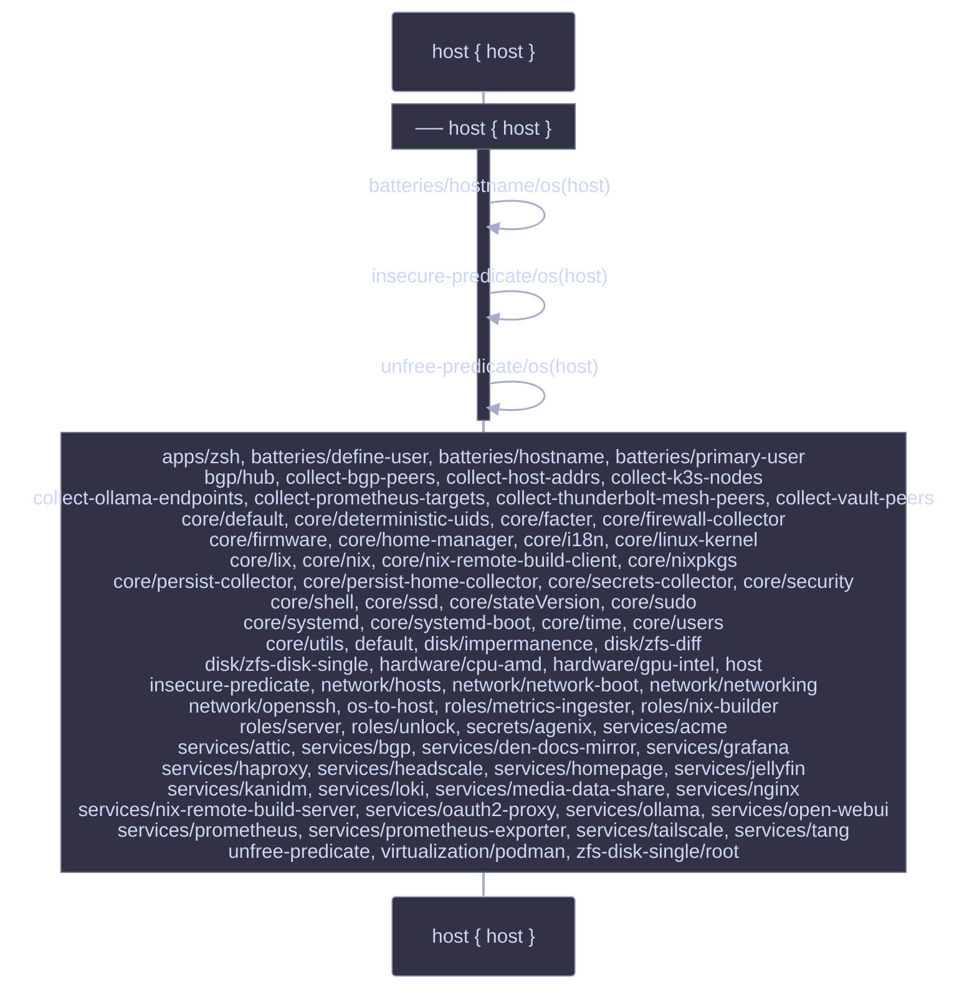

# Scope Sequence (expanded): uplink

```mermaid
%%{init: {"theme":"base","themeVariables":{"activationBkgColor":"#313244","activationBorderColor":"#6c7086","actorBkg":"#313244","actorBorder":"#a6adc8","actorLineColor":"#a6adc8","actorTextColor":"#cdd6f4","background":"#1e1e2e","classText":"#cdd6f4","clusterBkg":"#313244","clusterBorder":"#6c7086","edgeLabelBackground":"#1e1e2e","labelBoxBkgColor":"#313244","labelBoxBorderColor":"#a6adc8","labelTextColor":"#cdd6f4","lineColor":"#a6adc8","loopTextColor":"#cdd6f4","mainBkg":"#313244","nodeBkg":"#313244","nodeBorder":"#a6adc8","nodeTextColor":"#cdd6f4","noteBkgColor":"#313244","noteBorderColor":"#6c7086","noteTextColor":"#cdd6f4","pie1":"#f38ba8","pie2":"#fab387","pie3":"#f9e2af","pie4":"#a6e3a1","pie5":"#94e2d5","pie6":"#89b4fa","pie7":"#cba6f7","pie8":"#f2cdcd","pieLegendTextColor":"#cdd6f4","pieOuterStrokeColor":"#6c7086","pieSectionTextColor":"#cdd6f4","pieStrokeColor":"#6c7086","pieTitleTextColor":"#cdd6f4","primaryBorderColor":"#a6adc8","primaryColor":"#313244","primaryTextColor":"#cdd6f4","secondBkg":"#313244","secondaryBorderColor":"#6c7086","secondaryColor":"#313244","secondaryTextColor":"#cdd6f4","sequenceNumberColor":"#1e1e2e","signalColor":"#a6adc8","signalTextColor":"#cdd6f4","tertiaryBorderColor":"#6c7086","tertiaryColor":"#313244","tertiaryTextColor":"#cdd6f4","textColor":"#cdd6f4","titleColor":"#cdd6f4"}}}%%
sequenceDiagram
    participant host as host { host }

    Note over host: ── host { host }
    activate host
    host ->> host: batteries/hostname/os(host)
    host ->> host: insecure-predicate/os(host)
    host ->> host: unfree-predicate/os(host)
    deactivate host
    Note over host: apps/zsh, batteries/define-user, batteries/hostname, batteries/primary-user<br/>bgp/hub, collect-bgp-peers, collect-host-addrs, collect-k3s-nodes<br/>collect-ollama-endpoints, collect-prometheus-targets, collect-thunderbolt-mesh-peers, collect-vault-peers<br/>core/default, core/deterministic-uids, core/facter, core/firewall-collector<br/>core/firmware, core/home-manager, core/i18n, core/linux-kernel<br/>core/lix, core/nix, core/nix-remote-build-client, core/nixpkgs<br/>core/persist-collector, core/persist-home-collector, core/secrets-collector, core/security<br/>core/shell, core/ssd, core/stateVersion, core/sudo<br/>core/systemd, core/systemd-boot, core/time, core/users<br/>core/utils, default, disk/impermanence, disk/zfs-diff<br/>disk/zfs-disk-single, hardware/cpu-amd, hardware/gpu-intel, host<br/>insecure-predicate, network/hosts, network/network-boot, network/networking<br/>network/openssh, os-to-host, roles/metrics-ingester, roles/nix-builder<br/>roles/server, roles/unlock, secrets/agenix, services/acme<br/>services/attic, services/bgp, services/den-docs-mirror, services/grafana<br/>services/haproxy, services/headscale, services/homepage, services/jellyfin<br/>services/kanidm, services/loki, services/media-data-share, services/nginx<br/>services/nix-remote-build-server, services/oauth2-proxy, services/ollama, services/open-webui<br/>services/prometheus, services/prometheus-exporter, services/tailscale, services/tang<br/>unfree-predicate, virtualization/podman, zfs-disk-single/root
```
