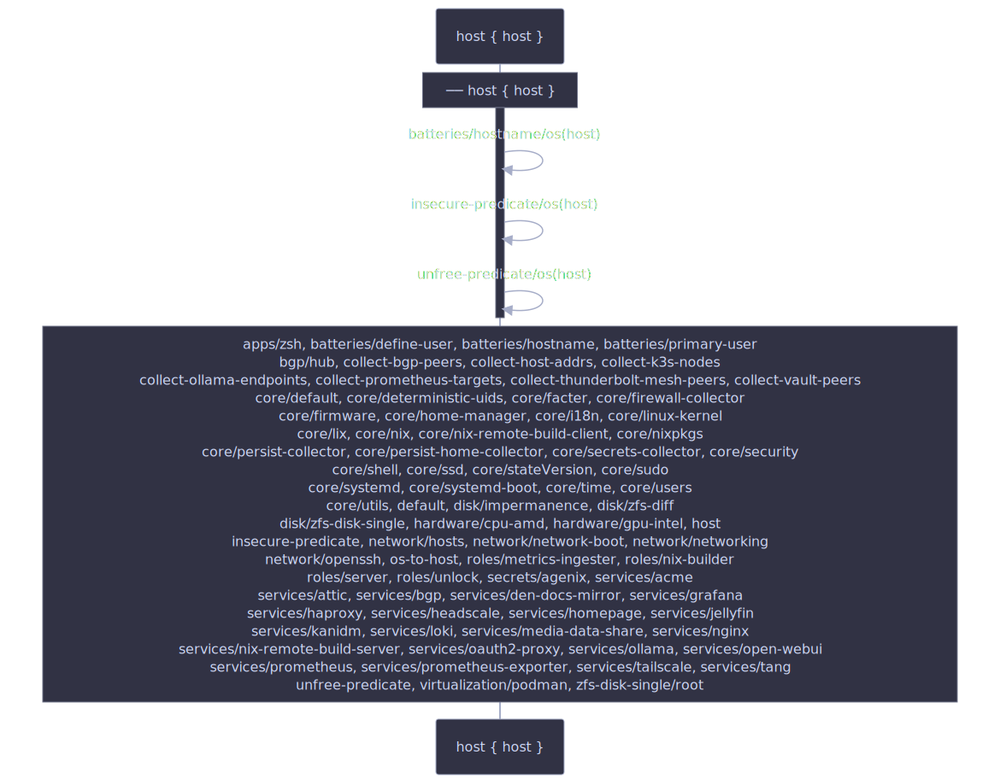
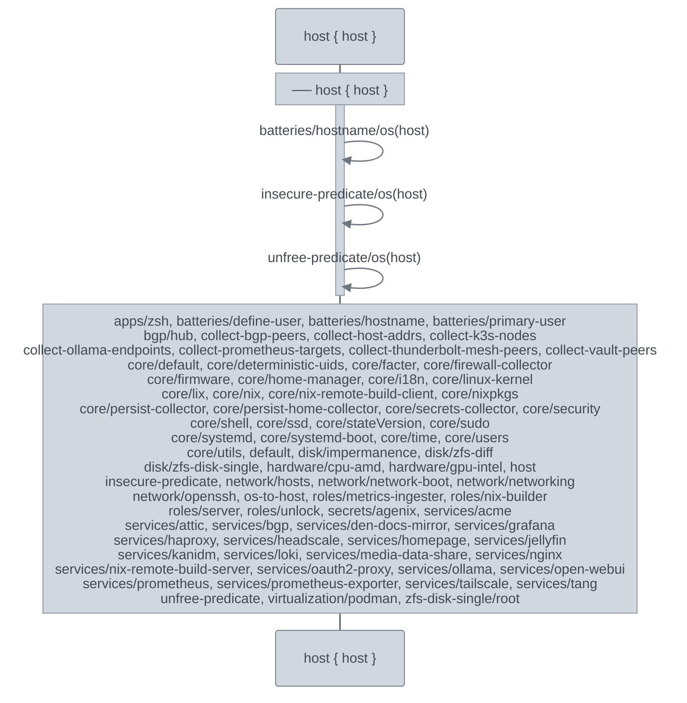

# Scope Sequence (expanded): uplink

```mermaid
%%{init: {"theme":"base","themeVariables":{"activationBkgColor":"#d0d7de","activationBorderColor":"#8c959f","actorBkg":"#d0d7de","actorBorder":"#6e7781","actorLineColor":"#6e7781","actorTextColor":"#424a53","background":"#eaeef2","classText":"#424a53","clusterBkg":"#d0d7de","clusterBorder":"#8c959f","edgeLabelBackground":"#eaeef2","labelBoxBkgColor":"#d0d7de","labelBoxBorderColor":"#6e7781","labelTextColor":"#424a53","lineColor":"#6e7781","loopTextColor":"#424a53","mainBkg":"#d0d7de","nodeBkg":"#d0d7de","nodeBorder":"#6e7781","nodeTextColor":"#424a53","noteBkgColor":"#d0d7de","noteBorderColor":"#8c959f","noteTextColor":"#424a53","pie1":"#fa4549","pie2":"#e16f24","pie3":"#bf8700","pie4":"#2da44e","pie5":"#339D9B","pie6":"#218bff","pie7":"#a475f9","pie8":"#4d2d00","pieLegendTextColor":"#424a53","pieOuterStrokeColor":"#8c959f","pieSectionTextColor":"#424a53","pieStrokeColor":"#8c959f","pieTitleTextColor":"#424a53","primaryBorderColor":"#6e7781","primaryColor":"#d0d7de","primaryTextColor":"#424a53","secondBkg":"#d0d7de","secondaryBorderColor":"#8c959f","secondaryColor":"#d0d7de","secondaryTextColor":"#424a53","sequenceNumberColor":"#eaeef2","signalColor":"#6e7781","signalTextColor":"#424a53","tertiaryBorderColor":"#8c959f","tertiaryColor":"#d0d7de","tertiaryTextColor":"#424a53","textColor":"#424a53","titleColor":"#424a53"}}}%%
sequenceDiagram
    participant host as host { host }

    Note over host: ── host { host }
    activate host
    host ->> host: batteries/hostname/os(host)
    host ->> host: insecure-predicate/os(host)
    host ->> host: unfree-predicate/os(host)
    deactivate host
    Note over host: apps/zsh, batteries/define-user, batteries/hostname, batteries/primary-user<br/>bgp/hub, collect-bgp-peers, collect-host-addrs, collect-k3s-nodes<br/>collect-ollama-endpoints, collect-prometheus-targets, collect-thunderbolt-mesh-peers, collect-vault-peers<br/>core/default, core/deterministic-uids, core/facter, core/firewall-collector<br/>core/firmware, core/home-manager, core/i18n, core/linux-kernel<br/>core/lix, core/nix, core/nix-remote-build-client, core/nixpkgs<br/>core/persist-collector, core/persist-home-collector, core/secrets-collector, core/security<br/>core/shell, core/ssd, core/stateVersion, core/sudo<br/>core/systemd, core/systemd-boot, core/time, core/users<br/>core/utils, default, disk/impermanence, disk/zfs-diff<br/>disk/zfs-disk-single, hardware/cpu-amd, hardware/gpu-intel, host<br/>insecure-predicate, network/hosts, network/network-boot, network/networking<br/>network/openssh, os-to-host, roles/metrics-ingester, roles/nix-builder<br/>roles/server, roles/unlock, secrets/agenix, services/acme<br/>services/attic, services/bgp, services/den-docs-mirror, services/grafana<br/>services/haproxy, services/headscale, services/homepage, services/jellyfin<br/>services/kanidm, services/loki, services/media-data-share, services/nginx<br/>services/nix-remote-build-server, services/oauth2-proxy, services/ollama, services/open-webui<br/>services/prometheus, services/prometheus-exporter, services/tailscale, services/tang<br/>unfree-predicate, virtualization/podman, zfs-disk-single/root
```
