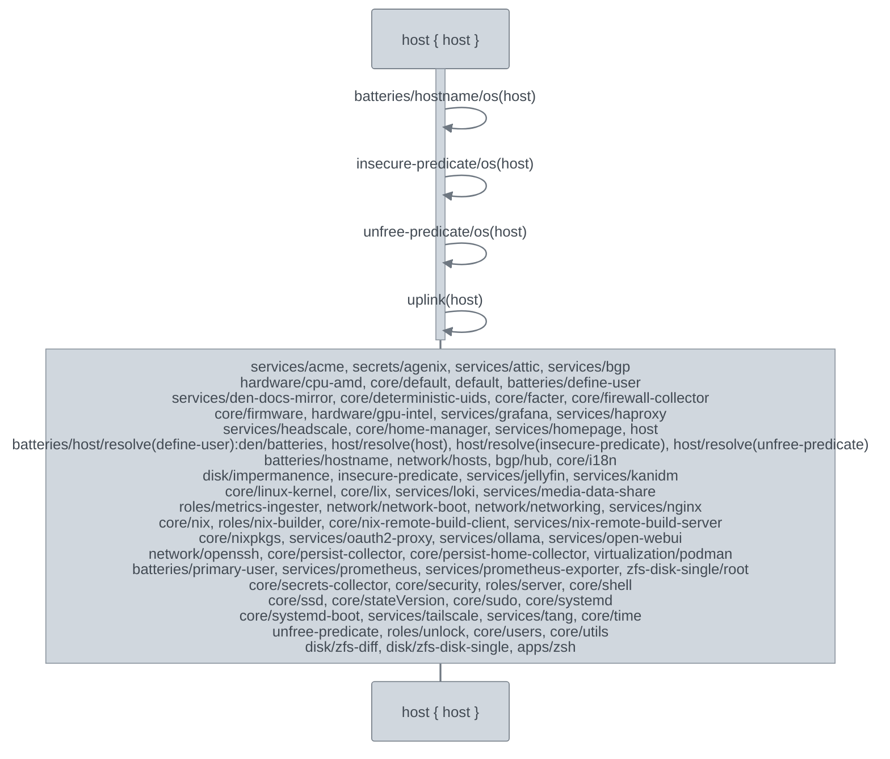

# Scope Sequence: uplink

```mermaid
%%{init: {"theme":"base","themeVariables":{"activationBkgColor":"#d0d7de","activationBorderColor":"#8c959f","actorBkg":"#d0d7de","actorBorder":"#6e7781","actorLineColor":"#6e7781","actorTextColor":"#424a53","background":"#eaeef2","classText":"#424a53","clusterBkg":"#d0d7de","clusterBorder":"#8c959f","edgeLabelBackground":"#eaeef2","labelBoxBkgColor":"#d0d7de","labelBoxBorderColor":"#6e7781","labelTextColor":"#424a53","lineColor":"#6e7781","loopTextColor":"#424a53","mainBkg":"#d0d7de","nodeBkg":"#d0d7de","nodeBorder":"#6e7781","nodeTextColor":"#424a53","noteBkgColor":"#d0d7de","noteBorderColor":"#8c959f","noteTextColor":"#424a53","pie1":"#fa4549","pie2":"#e16f24","pie3":"#bf8700","pie4":"#2da44e","pie5":"#339D9B","pie6":"#218bff","pie7":"#a475f9","pie8":"#4d2d00","pieLegendTextColor":"#424a53","pieOuterStrokeColor":"#8c959f","pieSectionTextColor":"#424a53","pieStrokeColor":"#8c959f","pieTitleTextColor":"#424a53","primaryBorderColor":"#6e7781","primaryColor":"#d0d7de","primaryTextColor":"#424a53","secondBkg":"#d0d7de","secondaryBorderColor":"#8c959f","secondaryColor":"#d0d7de","secondaryTextColor":"#424a53","sequenceNumberColor":"#eaeef2","signalColor":"#6e7781","signalTextColor":"#424a53","tertiaryBorderColor":"#8c959f","tertiaryColor":"#d0d7de","tertiaryTextColor":"#424a53","textColor":"#424a53","titleColor":"#424a53"}}}%%
sequenceDiagram
    participant host as host { host }


    activate host
    host ->> host: batteries/hostname/os(host)
    host ->> host: insecure-predicate/os(host)
    host ->> host: unfree-predicate/os(host)
    host ->> host: uplink(host)
    deactivate host
    Note over host: services/acme, secrets/agenix, services/attic, services/bgp<br/>hardware/cpu-amd, core/default, default, batteries/define-user<br/>services/den-docs-mirror, core/deterministic-uids, core/facter, core/firewall-collector<br/>core/firmware, hardware/gpu-intel, services/grafana, services/haproxy<br/>services/headscale, core/home-manager, services/homepage, host<br/>batteries/host/resolve(define-user):den/batteries, host/resolve(host), host/resolve(insecure-predicate), host/resolve(unfree-predicate)<br/>batteries/hostname, network/hosts, bgp/hub, core/i18n<br/>disk/impermanence, insecure-predicate, services/jellyfin, services/kanidm<br/>core/linux-kernel, core/lix, services/loki, services/media-data-share<br/>roles/metrics-ingester, network/network-boot, network/networking, services/nginx<br/>core/nix, roles/nix-builder, core/nix-remote-build-client, services/nix-remote-build-server<br/>core/nixpkgs, services/oauth2-proxy, services/ollama, services/open-webui<br/>network/openssh, core/persist-collector, core/persist-home-collector, virtualization/podman<br/>batteries/primary-user, services/prometheus, services/prometheus-exporter, zfs-disk-single/root<br/>core/secrets-collector, core/security, roles/server, core/shell<br/>core/ssd, core/stateVersion, core/sudo, core/systemd<br/>core/systemd-boot, services/tailscale, services/tang, core/time<br/>unfree-predicate, roles/unlock, core/users, core/utils<br/>disk/zfs-diff, disk/zfs-disk-single, apps/zsh
```
