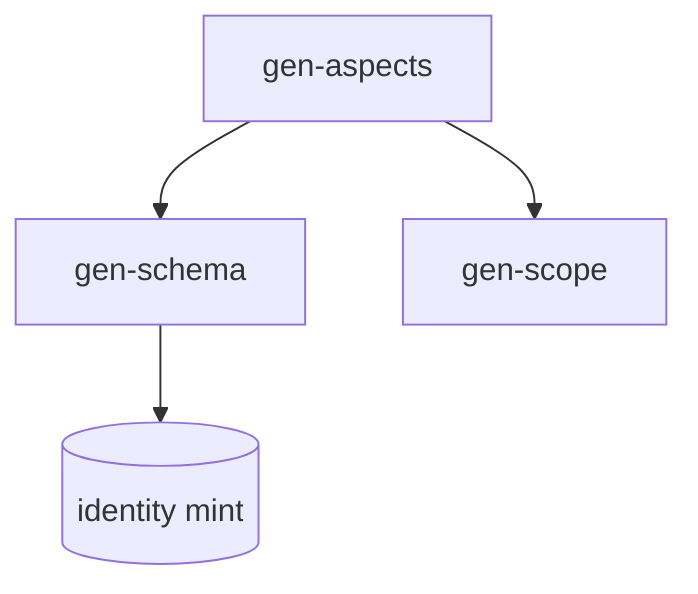

# Writing a design doc

This file is a specification, not a specimen. Its bolding and worked examples
are navigation aids; do not reproduce them in what you write.

A structure and voice guide for technical design docs, documents that describe
_how_ something will be built once the direction is broadly agreed. The skill
owns the section skeleton and the prose voice; the author owns the content.

The section skeleton is the Kubernetes KEP template, trimmed of its
Kubernetes-specific machinery. The prose voice comes from the `writing-tone`
skill.

## Decision routing

```
Open question is *how*, not *whether*?          -> design doc (this skill)
Open question is *whether* / *which*?            -> writing-doc-rfc instead
Change small enough the PR description carries?   -> skip both
Where does it land?                               -> see Step 0
```

## Where the doc lands

When working in this project's repositories, design docs, specs and ADRs live
in `~/Documents/repos/sini/den-ag-design`, not in the code repository.
Elsewhere, follow that project's own convention. Pick the destination before drafting and state it:

- `specs/adr/` -- architecture decisions; this is the law
- `specs/` -- component and library specs
- `plans/` -- phased work plans
- `reports/` -- measurement and review output, `<bead>-<agent>-v<n>.md`
- `gen-specs/<lib>/REFERENCE.md` -- the canonical per-library reference

`den-specs/` is testimony only, never design authority. Do not commit design
docs into the code repository they describe.

## Voice

The prose voice is owned by the `writing-tone` skill -- load it rather than
reproducing its rules here, so there is one source and it cannot drift. In
short: lead with the finding, attach every claim's cost in the same sentence,
mark recollection apart from measurement, name limits plainly, `--` never `—`,
no marketing adjectives, no bolded label prefixes, no emojis.

```
# good -- leads with the finding, claim paired with how it is validated
The cache cuts cold-start p99 from 1.8s to 320ms, confirmed in the load test (k=500).

# bad -- throat-clearing, unvalidated marketing claim
This document describes a robust, seamless caching layer that should improve performance.
```

## Figures, tables and diagrams

**Show a fact that has shape; write a fact that has argument.**

- **Table** when the content is N items against M attributes and the reader
  compares across them: a capability matrix, a measurement set, an option
  comparison. Prose makes the reader rebuild the grid in their head.
- **Diagram** when the fact is a graph: layering, containment, lineage,
  dataflow, state transitions. Prose linearises a graph, and the shape was the
  thing the reader needed.
- **Prose** for argument, cause, judgement, and sequence-with-reasons. Those are
  not grids; flattening them into a table loses the reasoning.

**Evidence tables.** When a claim rests on measurement, put the figures in a
table together with the predicate that produced them, so a reader can re-run it
instead of taking the number on trust. Name the control.

Rules that hold for all three:

- Number it, caption it, and reference it from the text that relies on it. An
  unreferenced figure is decoration.
- **Never do both.** If the table or diagram carries the claim, delete the
  paragraph that was describing it. Duplication is the common failure, and it is
  how the two drift apart.
- A one-row or one-column table is a sentence. Write the sentence.
- **Embed the diagram; do not attach one.** The target is markdown and the
  consumers are GitHub and Astro, both of which render a fenced ```mermaid block
  natively. So the diagram lives inline in the document, versions with it, and
  diffs as text. No image files, no external assets, no export step.
- Load the `diagram` skill to choose a diagram type. `diagram-mermaid-render` is
  for previewing a diagram as ASCII in the terminal before you commit it -- it
  is a check on your own work, not a step in producing the document.

````markdown
Figure 1. Where the kernel sits relative to the compatibility layer.


````

## The skeleton

Sections in order. Drop a section only deliberately, and say why if its absence
would surprise a reader.

1. Summary: One paragraph. What this builds and why, readable on its own.
   Write it last; lead with the outcome.
2. Motivation: The problem as it is. Concrete, not abstract.
   - Goals, what success looks like, as observable outcomes.
   - Non-Goals, the explicit out-list. The most load-bearing subsection.
3. Proposal: The shape of the solution at a glance, before the detail.
   - User stories / workflows _(optional)_, who does what, end to end.
   - Notes, constraints, caveats, what bounds the design.
   - Risks and mitigations, what could go wrong and the answer to each.
4. Design Details: The technical core: data shapes, interfaces, control
   flow, edge cases. Diagrams earn their place here; see Figures, tables and
   diagrams.
   - Validation, how each claim is checked. Give the tests, the manual steps,
     and the inverse case that proves the boundary holds. Generalized from the
     KEP "Test Plan"; no unit/integration/e2e ceremony unless it fits.
   - Rollout / migration _(optional)_, how it ships and how it rolls back.
5. Drawbacks: Honest reasons not to do this. If you cannot name one, the
   analysis is incomplete.
6. Alternatives: Other designs considered and why each was rejected. This
   is where reviewers look first; treat it as load-bearing, not an appendix.
7. Dependencies / resources needed _(optional)_, what this needs from
   other people or systems. Generalized from KEP "Infrastructure Needed".
8. Implementation history: A lightweight changelog: created, revised,
   accepted. Append-only.

## Doc frontmatter

A trimmed version of the KEP `kep.yaml` metadata, drop kep-number, SIGs,
feature-gates, milestones, stage.

```yaml
title: <short imperative title>
authors: [<name>]
status: draft # draft | under-review | accepted | superseded
created: <YYYY-MM-DD>
reviewers: [<name>] # optional
see-also: [] # links to related docs
supersedes: [] # docs this replaces
```

## Template (copy-paste)

```markdown
# <Title>

> Status: draft · Authors: <name> · Created: <YYYY-MM-DD>

## Summary

<One paragraph: what this builds and why.>

## Motivation

<The problem, stated concretely.>

### Goals

- <observable outcome>

### Non-Goals

- <explicitly out of scope>

## Proposal

<The solution shape at a glance.>

### Notes, constraints, caveats

- <what bounds the design>

### Risks and mitigations

- Risk: <x>. Mitigation: <y>.

## Design Details

<Data shapes, interfaces, control flow, edge cases.>

### Validation

- <claim> -- checked by <how>; inverse: <what proves the boundary>.

### Rollout / migration

<How it ships and rolls back. Omit if trivial.>

## Drawbacks

<Honest reasons not to do this.>

## Alternatives

- <alternative> -- rejected because <reason>.

## Dependencies / resources needed

- <what this needs from elsewhere>

## Implementation history

- <YYYY-MM-DD> created
```

## Checklist before sharing

- Summary reads on its own, no jargon undefined.
- Non-Goals lists at least one real exclusion.
- Every claim in Design Details pairs with a Validation line.
- Alternatives names every rejected option and the reason it lost.
- At least one honest Drawback.
- No emojis, no marketing adjectives, no rhetorical flourishes.
- Destination decided (see Where the doc lands) and stated.
