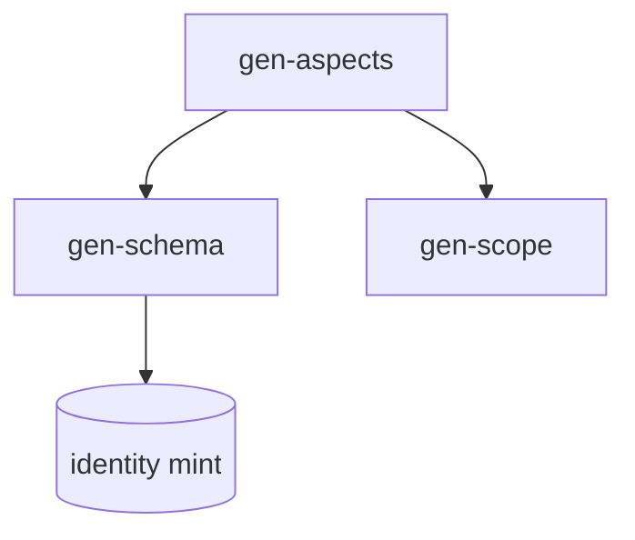

# Writing a request-for-comments (RFC)

This file is a specification, not a specimen. Its bolding and worked examples
are navigation aids; do not reproduce them in what you write.

A structure and voice guide for RFCs, documents that exist to _solicit a
decision_ from a broad audience before commitment. An RFC teaches the idea,
specifies it precisely, surfaces what is still open, and records the
discussion. The skill owns the section skeleton and the prose voice.

The section skeleton is the Rust RFC template, trimmed of its Rust-specific
references. The prose voice comes from the `writing-tone` skill.

## Decision routing

```
Open question is *whether* / *which*, cross-team audience?  -> RFC (this skill)
Direction agreed, only *how* remains?                        -> writing-doc-design instead
Where does it land?                                           -> see Step 0
```

The two share a core (Summary, Motivation, Drawbacks, alternatives). The RFC adds
a teaching pass, prior art, open questions, and future possibilities.

## Where the doc lands

When working in this project's repositories, design docs, specs and ADRs live
in `~/Documents/repos/sini/den-ag-design`, not in the code repository.
Elsewhere, follow that project's own convention. Pick the destination before drafting and state it:

- `specs/adr/` -- architecture decisions; this is the law
- `specs/` -- component and library specs
- `plans/` -- phased work plans
- `reports/` -- measurement and review output, `<bead>-<agent>-v<n>.md`
- `gen-specs/<lib>/REFERENCE.md` -- the canonical per-library reference

`den-specs/` is testimony only, never design authority. Do not commit design
docs into the code repository they describe.

## Voice

The prose voice is owned by the `writing-tone` skill -- load it rather than
reproducing its rules here, so there is one source and it cannot drift. In
short: lead with the finding, attach every claim's cost in the same sentence,
mark recollection apart from measurement, name limits plainly, `--` never `—`,
no marketing adjectives, no bolded label prefixes, no emojis.

```
# good -- teaches the idea concretely, names what review must settle and who settles it
A user types `/share` and the doc uploads; the link is copied to the clipboard.
The auth model for private docs is unresolved. Review has to settle it, and the
threat model is the thing that closes it.

# bad -- abstract, hedged, leaves the open question ownerless
We could maybe add some kind of sharing, and there might be some auth concerns to think about.
```

RFC-specific bindings. The out-list lives in Future possibilities. Validation
pairing matters most in Reference-level explanation. Pre-answer the reader in
Drawbacks and Unresolved questions. Open questions go in Unresolved
questions, each naming who settles it and what closes it, as a sentence.

## Figures, tables and diagrams

**Show a fact that has shape; write a fact that has argument.**

- **Table** when the content is N items against M attributes and the reader
  compares across them: a capability matrix, a measurement set, an option
  comparison. Prose makes the reader rebuild the grid in their head.
- **Diagram** when the fact is a graph: layering, containment, lineage,
  dataflow, state transitions. Prose linearises a graph, and the shape was the
  thing the reader needed.
- **Prose** for argument, cause, judgement, and sequence-with-reasons. Those are
  not grids; flattening them into a table loses the reasoning.

**Evidence tables.** When a claim rests on measurement, put the figures in a
table together with the predicate that produced them, so a reader can re-run it
instead of taking the number on trust. Name the control.

Rules that hold for all three:

- Number it, caption it, and reference it from the text that relies on it. An
  unreferenced figure is decoration.
- **Never do both.** If the table or diagram carries the claim, delete the
  paragraph that was describing it. Duplication is the common failure, and it is
  how the two drift apart.
- A one-row or one-column table is a sentence. Write the sentence.
- **Embed the diagram; do not attach one.** The target is markdown and the
  consumers are GitHub and Astro, both of which render a fenced ```mermaid block
  natively. So the diagram lives inline in the document, versions with it, and
  diffs as text. No image files, no external assets, no export step.
- Load the `diagram` skill to choose a diagram type. `diagram-mermaid-render` is
  for previewing a diagram as ASCII in the terminal before you commit it -- it
  is a check on your own work, not a step in producing the document.

````markdown
Figure 1. Where the kernel sits relative to the compatibility layer.


````

## The skeleton

Sections in order.

1. Summary: One paragraph. The proposal in a sentence or two.
2. Motivation: The problem and concrete use cases. Why now, why this is
   worth a decision. Generalized from the Rust template; no "Rust users".
3. Guide-level explanation: Teach the idea _as if it already shipped_:
   examples, the mental model, how someone encounters it day to day. This pass
   is the RFC's distinctive value, if you cannot teach it cleanly, the design
   is not ready. Replace "the language / Rust" with the system or product.
4. Reference-level explanation: The precise technical design: interfaces,
   interactions with existing parts, edge cases, failure modes. This is the
   spec a builder would implement from. Pair claims with validation here.
5. Drawbacks: Honest reasons not to do this.
6. Rationale and alternatives: Why _this_ design; what other designs were
   considered and why they lose; the cost of doing nothing.
7. Prior art: How others (other teams, products, languages, papers) solved
   the same problem, and what was learned. Distinct from Alternatives: prior
   art is what exists elsewhere, alternatives are designs you weighed yourself.
8. Unresolved questions: What this RFC deliberately leaves open for review
   to settle, and what is out of scope for it entirely. Name who settles each
   one and what observably closes it, in prose.
9. Future possibilities: Natural extensions noted but explicitly not in
   scope now. This is the out-list, naming it reads as a decision, not a gap.

## Doc frontmatter

A trimmed version of the Rust template's header, drop the rust-lang PR and
issue links.

```yaml
title: <short imperative title>
authors: [<name>]
status: draft # draft | under-review | accepted | rejected | superseded
created: <YYYY-MM-DD>
stakeholders: [] # who needs to weigh in
see-also: []
supersedes: []
```

## Template (copy-paste)

```markdown
# <Title>

> Status: draft · Authors: <name> · Created: <YYYY-MM-DD>

## Summary

<One paragraph: the proposal.>

## Motivation

<The problem and concrete use cases. Why now.>

## Guide-level explanation

<Teach it as if it already shipped. Examples, mental model, daily use.>

## Reference-level explanation

<Precise design: interfaces, interactions, edge cases, failure modes.>

## Drawbacks

<Honest reasons not to do this.>

## Rationale and alternatives

- Why this design: <reason>.
- Alternative: <x> -- loses because <reason>.
- Doing nothing costs: <reason>.

## Prior art

- <who/what solved this elsewhere> -- takeaway: <lesson>.

## Unresolved questions

- <open question>. <Who settles it>, and <what observably closes it>.

## Future possibilities

- <extension noted but out of scope now>
```

## Decision log

RFCs accumulate discussion. Keep a running log at the bottom rather than losing
it in comments:

```
- <YYYY-MM-DD> <decision or resolved question>, <who>
```

## Checklist before sharing

- Summary states the proposal in one paragraph.
- Guide-level explanation teaches it without referring to the implementation.
- Reference-level explanation is precise enough to build from.
- Prior art and Alternatives are distinct sections, both populated.
- Unresolved questions names what review must settle, and who settles each.
- At least one honest Drawback.
- No emojis, marketing adjectives, or rhetorical flourishes.
- Destination decided (see Where the doc lands) and stated.
